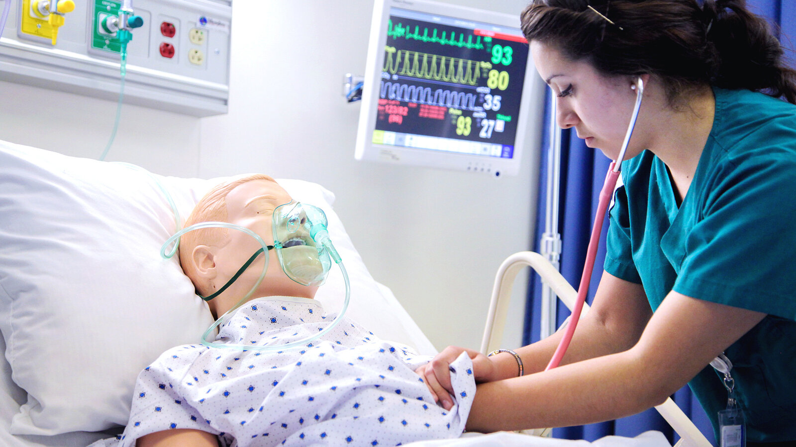
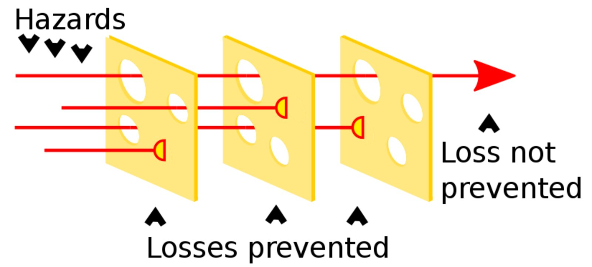
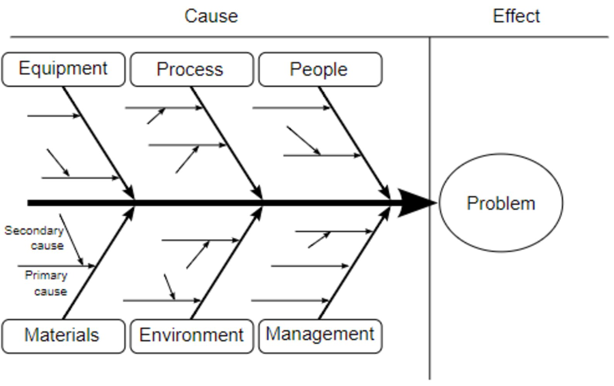

# Patient safety

*Categories: Clinical knowledge > Legal medicine and professionalism > Patient safety*

[Original Article Link](https://coursology-qbank.com/amboss/article/yq0dah)

---

## Summary

Patient safety is the prevention, reduction, and analysis of <u>medical errors</u> experienced by patients in the health care setting. <u>Medical errors</u> are events that expose patients to potential harm. Harm that occurs as a result of <u>medical error</u> is known as an <u>adverse event</u>. <u>Medical errors</u> often result from the interaction between <u>system-associated risk factors</u> (e.g., job-related factors or organizational factors) and person-associated <u>risk factors</u> (e.g., <u>health care personnel-associated risk factors</u> and <u>patient-associated risk factors</u>). Specific types of <u>medical errors</u> include <u>diagnostic errors</u>, <u>medication errors</u>, and <u>communication errors</u>. The prevention strategies that most effectively reduce <u>medical errors</u> include fostering a <u>safety culture</u>, ensuring usability of technology, implementing standardized protocols, and establishing <u>incident reporting systems</u>. Once a <u>medical error</u> has occurred, it should be disclosed to the patient and any other relevant individuals, and a <u>medical error analysis</u> should be conducted to identify the causes of the error and prevent a similar error in the future.

See also “<u>Quality improvement</u>” and “<u>Navigating stressful situations in residency</u>.”

---

## Epidemiology

* All medical settings globally: ∼ 5% of patients experience preventable harm. [[2]](https://coursology-qbank.com/amboss/article/yLcdZW0)

* Hospitals globally: Nearly 10% of patients experience <u>adverse events</u>, and approximately half of these are preventable. [[3]](https://coursology-qbank.com/amboss/article/lWWvl40)

* <u>Medical errors</u> are the 3rd leading <u>cause of death</u> (∼250,000 deaths a year). [[4]](https://coursology-qbank.com/amboss/article/rNWfcN0)

Epidemiological data refers to the US, unless otherwise specified.

---

## Terminology

### Hazards, risk, and <u>risk factors</u> [[5]](https://coursology-qbank.com/amboss/article/w-1hzj0)[[6]](https://coursology-qbank.com/amboss/article/MUWMdk0)

|  Hazards, risks, and <u>risk factors</u> [[5]](https://coursology-qbank.com/amboss/article/w-1hzj0)[[6]](https://coursology-qbank.com/amboss/article/MUWMdk0)  |  |  |
| --- | --- | --- |
| Term | Definition | Example |
| Hazard |  * A source of potential harm   |  * Incorrect dosage of a medication can cause adverse effects.   |
| Risk |  * The <u>probability</u> that a harmful event will occur and the degree of harm it might cause, depending on the circumstances   |   * Two blood pressure medications with similar names (e.g., <u>amiloride</u> and <u>amlodipine</u>) are more likely to be confused than two medications with dissimilar names (e.g., <u>ramipril</u> and <u>amlodipine</u>).  * A blood pressure medication that is dosed too highly carries a higher risk of immediate and significant adverse effects than a <u>cholesterol</u> medication that is dosed too highly.    |
| <u>Risk factor</u> |  * A variable or attribute that increases the <u>probability</u> of developing a disease or injury   |  * Additional factors that could influence the risk of an incorrect medication dosage reaching the patient and causing harm include:  * <u>Alert fatigue</u> of the ordering clinician  * Nursing staff interrupted while administering medications   |

### <u>Adverse events</u> and <u>medical errors</u> [[7]](https://coursology-qbank.com/amboss/article/WdWPK40)[[8]](https://coursology-qbank.com/amboss/article/KUWUVk0)[[9]](https://coursology-qbank.com/amboss/article/9WWNn40)

#### Definitions

* Medical error: an action or failure to act that exposes a patient to possible harm in the context of medical care, regardless of whether or not harm actually occurs  [[7]](https://coursology-qbank.com/amboss/article/WdWPK40)[[10]](https://coursology-qbank.com/amboss/article/43W3iO0)

* Adverse event: an unintended harmful consequence of a medical treatment, which may or may not be the result of a <u>medical error</u>  [[9]](https://coursology-qbank.com/amboss/article/9WWNn40)[[11]](https://coursology-qbank.com/amboss/article/E3X84B)

#### Classification of <u>adverse events</u> [[7]](https://coursology-qbank.com/amboss/article/WdWPK40)[[8]](https://coursology-qbank.com/amboss/article/KUWUVk0)

| Overview of <u>adverse event</u> types |  |  |
| --- | --- | --- |
|  | Definition | Examples |
| Preventable adverse event |  * Any <u>adverse event</u> that is due to a <u>medical error</u>   |  * A patient is given a medication to which they are allergic because their <u>allergy</u> information was never documented in the chart.   |
| Ameliorable adverse event |  * An unpreventable <u>adverse event</u> that could have been reduced in severity through specific actions   |  * A patient's correctly placed IV subsequently becomes infiltrated (unpreventable), but this is not discovered for a number of hours because of understaffing.   |
|  Potential <u>adverse event</u> (near miss) [[11]](https://coursology-qbank.com/amboss/article/E3X84B)  |  * A <u>medical error</u> that could have resulted in an <u>adverse event</u> but did not, either incidentally or due to a prevention program or timely intervention   |  * An incorrect order that is identified by a nurse before being completed   |
|  Never event/sentinel event [[12]](https://coursology-qbank.com/amboss/article/0ZbeZH)  |  * A serious <u>adverse event</u> that is clearly identifiable, causes serious injury, disability, or <u>death</u>, and is considered sufficiently preventable that it should never occur.   |   * <u>Wrong-site surgery</u>  * Wrong-patient <u>surgery</u>  * Post-procedure retention of a foreign object in a patient  * <u>Suicide</u>, <u>suicide attempt</u>, or self-harm within a <u>health care facility</u>  * Using contaminated devices or medications  * Using medical devices for purposes other than their intended function  * Administering the wrong medication    |
|  Adverse drug events (ADEs) [[13]](https://coursology-qbank.com/amboss/article/alcQvc0)  |  * An unintended harmful consequence of exposure to a medication   |   * <u>Medication error</u> that results in harm  * Nonpreventable ADEs (e.g., <u>adverse drug reactions</u>, <u>adverse events</u> related to <u>drug withdrawal</u>)    |

#### Classification of <u>medical errors</u> [[7]](https://coursology-qbank.com/amboss/article/WdWPK40)[[9]](https://coursology-qbank.com/amboss/article/9WWNn40)

The categories of <u>medical error</u> listed here are not mutually exclusive; they may occur in conjunction with or <u>complement</u> each other.

| Overview of medical error types |  |  |
| --- | --- | --- |
| Type of <u>medical error</u> | Definition | Examples |
| Error of omission |  * A failure to execute the appropriate action when required   |  * Failure to note a history of <u>allergies</u>, leading to the administration of a drug against which the patient has a known <u>allergy</u>   |
| Error of commission |  * An inappropriate execution of an action or execution of an inappropriate or unnecessary action   |   * Administering a subcutaneous drug intravenously  * Performing unnecessary <u>surgery</u>    |
| Active error |   * An error at the direct level of contact between <u>health care personnel</u> and patients  * Has an immediate impact on the patient    |   * <u>Surgery</u> on the incorrect site  * Incorrect route of drug administration    |
| Latent error |   * An error inherent to a system that may cause patient harm under specific circumstances  * <u>Latent error</u>(s) can lead to <u>active error</u>(s), ultimately resulting in <u>adverse events</u>.    |   * Medications with similar packaging that are stored directly next to each other  * Understaffing  * Implementation of new equipment without adequate staff training    |
|  Individual error [[14]](https://coursology-qbank.com/amboss/article/1dW2K40)  |  * An error resulting from the failure of a single <u>health care professional</u>   |  * A clinician prescribing the wrong dose of a drug   |
|  Systems error [[14]](https://coursology-qbank.com/amboss/article/1dW2K40)  |  * An error resulting from a series of actions and/or factors in treatment or diagnosis, from flaws in technical and organizational design and/or decision-making, or from failure to recognize and mitigate hazards and risks in the health care setting   |  * A lack of trained staff leads to bottlenecks in emergencies.   |
| Execution error |  * A preventable failure to perform an act of medical care as intended   |  * Prescribing an incorrect dose of a certain drug   |
| Planning error |  * The performance of an incorrect act of medical care to achieve an appropriate aim   |  * Prescribing the wrong drug   |

#### Specific <u>medical error</u> types

|  Overview of specific <u>medical errors</u> [[9]](https://coursology-qbank.com/amboss/article/9WWNn40)  |  |  |  |
| --- | --- | --- | --- |
| Type of error | Definition |  | Examples |
|  Communication error [[15]](https://coursology-qbank.com/amboss/article/QhWudO0)  |  * Error in communication between <u>health care personnel</u> and patients as well as among <u>health care personnel</u>   |  |   * Errors in:  * <u>History taking</u>  * Giving directions  * Explaining planned medical procedures to the patient  * Written communication (e.g., poor handwriting on order sheets or prescription pads)  * Verbal communication (e.g., lack of standardized terminology, use of jargon, failure to use medical interpreters when indicated)  * Transition of care errors: error during patient transfer/<u>hand-off</u> (e.g., from <u>HCP</u> to <u>HCP</u>, in between shifts, transfer between units, at discharge), e.g.:  * Vital information (e.g., lab results) is lost  * Patient is discharged without booking of a necessary follow-up appointment    |
| Diagnostic error |  * Errors or delays in diagnosis, i.e. the diagnosis is not: [[16]](https://coursology-qbank.com/amboss/article/glcFwc0)  * Accurate  * Timely  * Communicated appropriately to the patient   |  |   * Not ordering the indicated investigations  * Use of outdated tests; errors in diagnostic studies (e.g., <u>laboratory errors</u>)  * Failure to adequately monitor clinical signs or <u>laboratory studies</u>  * Misinterpretation    |
|  Laboratory error [[17]](https://coursology-qbank.com/amboss/article/QrcuSd0)[[18]](https://coursology-qbank.com/amboss/article/jrc_Sd0)  |   * An error that occurs at any stage from the ordering of the test to the reporting and interpretation of the test result  * For more information, see “<u>Basics of laboratory analysis</u>” in “<u>Laboratory methods</u>”    |  * Preanalytical phase errors  * Occur before the specimen arrives in the laboratory  * Account for up to 75% of <u>laboratory errors</u> [[16]](https://coursology-qbank.com/amboss/article/glcFwc0)   |   * Misplaced or incomplete test orders  * Ordering an inappropriate test  * Improper specimen collection, storage, and/or transport (e.g., <u>hemolysis</u> in a blood sample, insufficient blood volume, <u>postprandial</u> blood sample for a <u>fasting</u> test)  * Specimen contamination  * Incorrect identification of the patient and/or labeling of the specimen (<u>misidentification error</u>) [[19]](https://coursology-qbank.com/amboss/article/PrcWhd0)    |
|  * Analytical phase errors: occur during the processing and analysis of the specimen   |   * Malfunction or improper calibration of laboratory equipment (<u>device error</u>)  * Reagent or specimen contamination    |  |  |
|  * Postanalytical phase errors: occur during the reporting and/or interpretation of the test results   |   * <u>Transcribing error</u> (<u>documentation error</u>)  * Prolonged <u>turnaround time</u>  * Misinterpretation of the results    |  |  |
| Treatment error |  * Errors or delays in treatment   |  |   * Unnecessary medical procedures  * Incorrect administration of treatment  * Incorrect drug dosage  * Incorrect route of administration  * Failure to provide treatment or respond to diagnoses in a timely manner    |
| Preventive error |  * Errors in prophylaxis   |  |   * Failure to implement appropriate prophylaxis (leading to <u>hospital-acquired conditions</u>)  * Failure to provide adequate monitoring or follow-up treatment  * Failure to maintain equipment and systems    |
|  Medication error[[13]](https://coursology-qbank.com/amboss/article/alcQvc0)  |  * Errors in prescription   |  |  * Errors in <u>medication reconciliation</u>   |
|  * Errors in transcription   |  |  * Failure to correctly transcribe drug names, dosages, routes of administration (e.g, mistranscription of a trailing zero)   |  |
|  * Errors in dispensation   |  |  * Incorrect drug dispensation due to errors related to medications with similar name or appearance   |  |
|  * Errors in administration   |  |   * Mathematical errors  * Administering the wrong drug, dosage or using the wrong route of administration    |  |
|  Patient identification errors [[20]](https://coursology-qbank.com/amboss/article/jhW_dO0)  |  * Misidentification of the patient   |  |   * Mislabeling (e.g., <u>wrong patient</u> identification wristband) that can lead to further errors (e.g., <u>transfusion</u> errors)  * Lack of dual validation (e.g., verbal verification of administered medication)    |
| Device errors |  * User-associated <u>device errors</u>   |  |   * Incorrect use of equipment due to improper training  * Unergonomic equipment    |
|  * Device-associated <u>device errors</u>   |  |  * Malfunctioning or outdated equipment   |  |
| Monitoring errors |  * Errors associated with monitoring equipment or medication   |  |   * Errors in cardiac monitoring/<u>telemetry</u>, such as:  * Failure at the level of the device-patient interface (most common), e.g., disconnected wires, improper connection  * <u>Communication errors</u> e.g., resulting in incorrect settings  * <u>Device errors</u> in form of equipment malfunction  * <u>Alert fatigue</u>  * Errors in drug monitoring (e.g., no <u>INR</u> monitoring when using <u>warfarin</u>; no measurement of <u>vancomycin</u> trough levels)    |
| Documentation errors |  * Errors in documentation of patient-associated information   |  |   * Incomplete or inaccurate documentation  * Misinterpretation of information due to indecipherable handwriting or the use of nonstandard abbreviations  * Entry of medical information into the <u>wrong patient</u>'s medical record (<u>misidentification error</u>)  * In <u>electronic health records</u>, improper use of copy-paste or copy-forward functionality can lead to: [[21]](https://coursology-qbank.com/amboss/article/5rci3d0)[[22]](https://coursology-qbank.com/amboss/article/MrcM3d0)[[23]](https://coursology-qbank.com/amboss/article/nrc73d0)  * Note bloat: creation of lengthy record notes that make it difficult to identify key aspects relevant to the patient's current care  * Propagation of incorrect or outdated information (e.g., previous <u>vital signs</u>, old drug doses)  * Ordering tests or treatment unnecessarily or for the <u>wrong patient</u>    |
| Procedural errors |  * Errors associated with procedures   |  |   * Errors associated with universal protocol, including: [[24]](https://coursology-qbank.com/amboss/article/ehWx1O0)  * <u>Wrong patient</u>  * Wrong site  * Wrong procedure  * Retained foreign bodies  * Iatrogenic harm, e.g.:  * <u>Paracentesis</u>: <u>bowel perforation</u>  * Central venous/<u>arterial line</u> injuries: arterial puncture, bleeding, venous <u>thrombosis</u>  * <u>Thoracentesis</u>: <u>pneumothorax</u>  * <u>Lumbar puncture</u>: bleeding, <u>paralysis</u>  * Anesthesia-related errors (e.g., calculating the wrong dosage)    |

---

## Risk factors for medical errors

### General principles [[25]](https://coursology-qbank.com/amboss/article/9-1Nzj0)[[26]](https://coursology-qbank.com/amboss/article/7AX4O00)

* Health care is a <u>complex system</u> in which the interaction between multiple factors influences the risk of patient harm.

* Complex systems (e.g., hospitals) consist of innumerable interacting elements (e.g., machines, staff, facilities).

* The interaction of many individual elements introduces a certain degree of unpredictability (e.g., malfunction, illness) that makes these systems susceptible to failure (e.g., incorrect results, interruption of processes).

* Characteristics of <u>complex systems</u> include:

* Nonlinear processes

* Multiple/circular causality

* Multilevel cooperation

* Open systems

* Self-organization

* Synergy

### Workplace-associated risk factors [[5]](https://coursology-qbank.com/amboss/article/w-1hzj0)[[27]](https://coursology-qbank.com/amboss/article/adWQo40)

#### Environment

* High noise level

* Poor lighting

* Improper room temperature (e.g., too hot or too cold)

* Severe weather

* Bad air quality

* Poor workspace design, e.g., as relates to:

* Floor plan of wards (e.g., location of nursing station for optimal proximity to all patient rooms)

* Available space

* Furniture and room layout

#### Technology and tools

* Ineffective communication technology (e.g., nurse call systems)

* Malfunctioning information technology (e.g., electronic <u>health systems</u>)

* Limited availability of tools and equipment (e.g., a designated place with fresh gloves, bandages, syringes in every patient room)

#### Human resources and organizational factors

* Understaffing

* Scheduling errors

* Excessive workload (e.g., due to mismatched <u>ratio</u> of medical personnel to the number of patients)

### Health care personnel-associated risk factors [[5]](https://coursology-qbank.com/amboss/article/w-1hzj0)

* Inexperienced clinician: a deficiency of practical skills and/or knowledge, predisposing to judgment and/or <u>diagnostic errors</u>

* Overcommitment [[28]](https://coursology-qbank.com/amboss/article/CWWqn40)

* Characterized by placing a large amount of time and effort into one's job, even when it might not be necessary

* Has been associated with <u>burnout</u>

* Fatigue: <u>Sleep deprivation</u> impacts cognitive performance.  [[29]](https://coursology-qbank.com/amboss/article/iNWJaN0)

* Alert fatigue: the tendency to become desensitized to and subsequently ignore alerts prompted by <u>clinical decision support systems</u> or medical equipment due to the excessive number or limited clinical relevance of the alerts in the past

#### <u>Stress</u>-related consequences [[30]](https://coursology-qbank.com/amboss/article/yWWdL40)[[31]](https://coursology-qbank.com/amboss/article/QSWuzk0)

* Ongoing <u>stress</u> can lead to:

* Negative coping behaviors (e.g., <u>alcohol</u> and drug use)

* Psychiatric illness (e.g., <u>anxiety</u>, <u>depression</u>)

* Impaired cognitive function (e.g., decision-making abilities)

* Negative impacts on patient care (e.g., <u>medical errors</u>)

* Examples of <u>stress</u>-related illnesses include: [[32]](https://coursology-qbank.com/amboss/article/-o1De30)

* <u>Burnout syndrome</u>

* Compassion fatigue, which develops following long-term exposure to patient <u>distress</u> and includes :

* Physical and/or mental exhaustion

* Reduced empathy (e.g., indifference to others)

* Irritability and anger

* Reduced work satisfaction

#### Cognitive biases [[16]](https://coursology-qbank.com/amboss/article/glcFwc0)[[33]](https://coursology-qbank.com/amboss/article/vOcA8c0)[[34]](https://coursology-qbank.com/amboss/article/MyYMf7)

* Confirmation bias (psychology): the tendency to favor evidence that supports preconceived notions and ignore potentially conflicting or problematic evidence

* Anchoring bias: the tendency to inappropriately rely on an initial perception or piece of information, which hinders later judgment when new information becomes available (e.g., favoring a diagnosis proposed earlier despite new evidence)

* Availability bias: the tendency to make judgments based on the availability of information from <u>memory</u>:   (e.g., when a clinician makes a premature diagnosis that comes to mind easily and quickly due to having seen several patients with a similar clinical presentation)

* Framing bias: the tendency to be influenced by how information is presented (e.g., the order of symptoms and/or emphasis placed on specific findings)

* Visceral bias (or <u>affective bias</u>): the tendency for clinical decisions to be influenced by positive or negative feelings towards the patient (e.g., doubts regarding symptoms when described by a patient with <u>substance use disorder</u>)

* Ascertainment bias (psychology): the tendency to base decisions on preset assumptions (e.g, <u>gender bias</u>, stereotypes)

* Gender bias: the tendency to base decisions on false assumptions about an individual's real or perceived <u>gender</u>

* Information bias (psychology): the tendency to collect more information than necessary for a decision [[35]](https://coursology-qbank.com/amboss/article/jSW_zk0)

* Aggregate bias (psychology): the tendency to assume that aggregated data (e.g., clinical guidelines) do not apply to the individual patient [[35]](https://coursology-qbank.com/amboss/article/jSW_zk0)

* Commission bias: the tendency to prefer action over inaction

* Omission bias: the tendency to prefer inaction over action

* Premature closure bias (<u>search satisficing</u>): the tendency of a clinician to prematurely accept a diagnosis without verifying it and/or considering alternative causes, which can lead to misdiagnosis and/or delayed diagnosis

* Overconfidence bias: the tendency of an individual to assume that their skills and knowledge are greater than they are in reality

* Zebra retreat bias: the tendency of a clinician to disregard a potential diagnosis because of its rarity, although evidence exists that supports the rare diagnosis

* Conjunction fallacy: the false assumption that the <u>probability</u> of a <u>joint</u> event (e.g., multiple clinical findings) is greater than the <u>probability</u> of any of the events occurring individually [[36]](https://coursology-qbank.com/amboss/article/t11Xif0)

* Implicit bias

* Subconscious attitudes and/or perceptions toward a specific group of people (e.g., based on age, weight, race, or <u>gender</u>) [[37]](https://coursology-qbank.com/amboss/article/9hWNTO0)

* Can impact patient care (e.g., Hispanic and Black patients are less likely to receive appropriate <u>analgesia</u> compared to White patients, even when reported <u>pain</u> scores are identical) [[38]](https://coursology-qbank.com/amboss/article/tvcXbe0)

* Solutions

* Educate individuals and communities (e.g., <u>implicit bias</u> workshops)

* Encourage individual and group awareness (e.g., small group debriefing, self-monitoring <u>thought processes</u>, considering others' perspectives).

> [!TIP]
> <u>Implicit bias</u> impacts patient care and can perpetuate health disparities.

### Patient-associated risk factors

* Extremes of age [[39]](https://coursology-qbank.com/amboss/article/BLcz-10)

* Multiple comorbidities [[40]](https://coursology-qbank.com/amboss/article/4SW3-k0)

* Prolonged hospital stay [[39]](https://coursology-qbank.com/amboss/article/BLcz-10)

* Cultural factors (e.g., religious rules that do not permit men to examine women or vice versa) [[41]](https://coursology-qbank.com/amboss/article/PSWW-k0)

* Some <u>social determinants of health</u>, including:  [[42]](https://coursology-qbank.com/amboss/article/ZocZ0W0)[[43]](https://coursology-qbank.com/amboss/article/0oce0W0)[[44]](https://coursology-qbank.com/amboss/article/SOWy7l0)

* Low level of <u>health literacy</u> and awareness, which is often associated with low <u>socioeconomic status</u> [[13]](https://coursology-qbank.com/amboss/article/alcQvc0)

* Non-White race

* Limited English proficiency [[45]](https://coursology-qbank.com/amboss/article/Eoc8dW0)

* <u>Medicaid</u> insurance [[46]](https://coursology-qbank.com/amboss/article/Doc1VW0)

---

## Prevention of medical errors

### General principles [[9]](https://coursology-qbank.com/amboss/article/9WWNn40)[[47]](https://coursology-qbank.com/amboss/article/9SWNbO0)

* <u>Error prevention</u> is a core aspect of quality and patient safety.

* The goal of <u>error prevention</u> is to minimize <u>medical errors</u> and their effect on patients.

* <u>Error prevention</u> is most effective when its focus lies on system errors rather than individual errors.

* Fundamentals of <u>error prevention</u> include:

* <u>Hazard</u> and risk awareness (see “<u>Patient safety terminology</u>”)

* Personnel training (keeping up-to-date with current guidelines, standards, and procedures)

* A <u>safety culture</u> that incentivizes openness in error reporting rather than focusing on disciplinary action against individuals who have made an error

* <u>Human factors engineering</u> to minimize <u>system-associated risk factors</u> (e.g., <u>usability testing</u> to optimize functioning of equipment)

* Systems for error monitoring and error reporting (see “<u>Management of medical errors</u>”)

* Specific strategies have been developed to address common categories of <u>medical error</u> such as <u>medication errors</u>, <u>communication errors</u>.

> [!TIP]
> Person-focused strategies (e.g., education) are a weaker <u>error prevention</u> strategy than most system-focused strategies (e.g., <u>forcing functions</u>) as person-focused strategies usually rely on human <u>memory</u> to perform a task correctly and therefore have a higher likelihood of error. [[48]](https://coursology-qbank.com/amboss/article/BsczCd0)

### Safety culture [[49]](https://coursology-qbank.com/amboss/article/o9X0oZ0)[[50]](https://coursology-qbank.com/amboss/article/8OcO8c0)[[51]](https://coursology-qbank.com/amboss/article/ebWxsP0)

* Definition: a workplace culture that promotes safety awareness, develops and implements measures for the maintenance of a safe work environment, and ensures that individuals can openly express safety concerns

* Goal: improving <u>error prevention</u> and error identification

* Key features

* Creates awareness for risks and consequences of errors

* Fosters a sense of responsibility in maintaining a safe work environment

* Creates an environment in which employees are not afraid to report errors

* Flattens steep hierarchies in order to:

* Promote collaboration between different ranks and disciplines

* Reduce the reluctance to speak up to superiors about concerns

### Simulation-based training [[52]](https://coursology-qbank.com/amboss/article/UNWb0N0)

* Definition: a training method that uses simulations of real-life scenarios to teach skills through first-hand experience [[53]](https://coursology-qbank.com/amboss/article/tfWXLk0)

* Advantages

* Hands-on practice and repetition

* Safe <u>learning</u> environment

* Real-time, actionable feedback

* No risk to patients

* Ability to simulate high-risk and/or rare scenarios

* Allows interdisciplinary teams to practice working together

* Disadvantages

* Expensive

* Artificial simulation environment may not replicate normal working conditions  [[54]](https://coursology-qbank.com/amboss/article/fNWk0N0)

* Resources

* Low- to high-fidelity manikins

* Anatomical models

* Trained actors

* Virtual reality

* Examples

* Technical skills: sutures, <u>airway management</u>, urinary catheter insertion, <u>central line</u> placement

* Nontechnical skills: communication, decision-making, <u>teamwork</u>

* <u>History taking</u> and <u>physical examination</u>

* Emergency response scenarios (e.g., <u>BLS</u>, <u>ACLS</u>, <u>ATLS</u>, obstetric emergencies, <u>motor vehicle crashes</u>)

Simulation-based training

### Human factors engineering [[51]](https://coursology-qbank.com/amboss/article/ebWxsP0)[[55]](https://coursology-qbank.com/amboss/article/cdWaK40)

* Definition: a discipline that examines the interaction between individuals, their work environment, and the tools and processes they use for work, and uses that information to design safe and productive systems [[5]](https://coursology-qbank.com/amboss/article/w-1hzj0)

* Goals (in the context of patient safety):

* Identify <u>risk factors for medical error</u>

* Design systems that optimize performance and reduce the risk of error

* Methods

* <u>Forcing functions</u>

* <u>Standardization</u>

* <u>Universal protocol</u>

* <u>Simplification</u>

* <u>Usability testing</u>

> [!TIP]
> According to the <u>human factors engineering</u> approach, <u>medical errors</u> are not primarily the result of individual actions, but of the interaction between the various <u>risk factors for medical error</u>. [[55]](https://coursology-qbank.com/amboss/article/cdWaK40)[[56]](https://coursology-qbank.com/amboss/article/VbWGsP0)

#### Forcing functions [[57]](https://coursology-qbank.com/amboss/article/ZRXZlB)[[58]](https://coursology-qbank.com/amboss/article/yscdxd0)

* Equipment, process, method, or system features designed to prevent error by either:

* Prohibiting certain actions

* Requiring the performance of a particular action before another action

* A highly effective technique for minimizing <u>adverse events</u> because it inhibits a chain of action that causes or perpetuates error

* Examples include:

* Anesthesia gas cylinders with gas-specific nozzles to prevent attaching the wrong gas tubing to a cylinder

* <u>Electronic medical record</u> adaptions, e.g.:

* Alerts that require the user to acknowledge potential <u>adverse reactions</u> or interactions before placing orders for certain medications

* A requirement that the clinician exits one patient's record before opening a second one

* A requirement that the user enters a password and a reason for accessing confidential psychiatric records

* Excessive use can lead to <u>alert fatigue</u> and use of overrides; <u>forcing functions</u> should be reserved for actions that can cause serious harm to the patient. [[59]](https://coursology-qbank.com/amboss/article/QgWuEk0)

> [!TIP]
> Strategies to reduce the risk of <u>alert fatigue</u> caused by <u>forcing functions</u> include reducing alerts that are clinically irrelevant and/or unhelpful, as well as assigning different levels of severity to alerts. [[59]](https://coursology-qbank.com/amboss/article/QgWuEk0)[[60]](https://coursology-qbank.com/amboss/article/BWWzn40)

#### Standardization [[58]](https://coursology-qbank.com/amboss/article/yscdxd0)

* The development and implementation of standards that apply to various aspects of a process or system in order to improve reliability, efficiency, communication, and safety

* Examples of <u>standardization</u>:

* Protocols and guidelines to help ensure a consistent level of quality and increase efficiency

* Using the same equipment across a system by avoiding the need for workers to learn to use multiple different products

* Checklists to help prevent common errors by making sure various steps of a process are completed

#### Universal protocol [[61]](https://coursology-qbank.com/amboss/article/TNW60N0)

* A three-step process developed by the <u>Joint Commission</u> to prevent <u>wrong site</u>, <u>wrong procedure</u>, and wrong person <u>surgery</u> [[24]](https://coursology-qbank.com/amboss/article/ehWx1O0)

* Should be performed before invasive medical procedures

* Relies on active communication to provide an environment in which all members of a patient's care team can actively speak up about potential errors (see “<u>Safety culture</u>”)

* Steps: The first two steps should take place before the patient enters the operating room.
1. * Preprocedural verification of the patient's identity, the surgical site, and the surgical procedure
2. * Surgical site marking
3. * Time out: a preoperative pause conducted by the surgical team in the operating room

* Goal: to prevent harm from a <u>wrong procedure</u> or a procedure at the <u>wrong site</u> or on the <u>wrong patient</u>

* Method: the patient's identity, the procedure, and the surgical site are confirmed immediately prior to the start of the procedure or surgical <u>incision</u>

#### Simplification [[5]](https://coursology-qbank.com/amboss/article/w-1hzj0)[[9]](https://coursology-qbank.com/amboss/article/9WWNn40)

* Reduction in complexity of equipment, systems, and processes to increase efficiency and reduce the risk of error

* Examples include:

* Computerization and automation of health information technology

* Ordering laboratory tests electronically (i.e., <u>CPOE</u>)

* Clinical decision support system (<u>CDSS</u>): a computer-based system designed to analyze data within <u>electronic health records</u> to assist <u>health care professionals</u> in clinical decision-making tasks (e.g., by reporting <u>drug interactions</u>). [[62]](https://coursology-qbank.com/amboss/article/gNWF0N0)[[63]](https://coursology-qbank.com/amboss/article/VlcGDc0)

* Readily available standard equipment (e.g., <u>tongue</u> depressors, latex gloves, scissors)

* Multicompartment medication device

#### Usability testing [[55]](https://coursology-qbank.com/amboss/article/cdWaK40)

* Testing the use of new equipment and systems with real users to proactively identify possible risks or negative consequences, including:

* Incompatibilities between <u>health care personnel</u> and the equipment they use (e.g., surgical scissors designed with loops that are too small to handle comfortably and precisely)

* Poor design that impedes workflow, forcing staff to adopt temporary solutions (<u>workarounds</u>) that may increase the risk of errors

* Examples include:

* Testing a new format of <u>CPOE</u> to see if it increases confusion for ordering clinicians

* Testing a new process for medication administration to see if it leads to the use of <u>workarounds</u>

---

## Prevention of communication errors

<u>Communication errors</u> can arise either from breakdowns in communication between <u>health care providers</u> and patients, or different members of the health care team. Effective communication in health care settings can substantially reduce the risk of <u>medical errors</u>. See “<u>Communication during residency</u>” for further information on improving communication. [[15]](https://coursology-qbank.com/amboss/article/QhWudO0)

### <u>Communication errors</u> between health care staff

See also “<u>Workplace communication</u>.”

#### <u>Risk factors</u> [[75]](https://coursology-qbank.com/amboss/article/nlc7xc0)[[77]](https://coursology-qbank.com/amboss/article/Ylcnvc0)

* Environmental distractions (e.g., loud noise)

* Hierarchical relationships (e.g., a junior resident communicating with a senior resident)

* Inappropriate quality or quantity of communication

* Transition of care between teams or health care settings.

#### Prevention strategies

* Communicate as clearly as possible.

* Avoid medical abbreviations.

* Provide written orders rather than verbal orders whenever possible.

* Practice <u>closed-loop communication</u>. [[78]](https://coursology-qbank.com/amboss/article/bNWH-l0)

* For critical written results, in addition contact the clinician directly or by phone and utilize <u>check-back</u> to confirm results have been correctly understood. [[78]](https://coursology-qbank.com/amboss/article/bNWH-l0)

* Anticipate <u>transition of care errors</u> and proactively intervene.

* Handoff-related errors [[75]](https://coursology-qbank.com/amboss/article/nlc7xc0)[[77]](https://coursology-qbank.com/amboss/article/Ylcnvc0)

* Optimize <u>handover</u> environments and use standardized <u>handoff tools</u>.

* See “<u>Signouts</u>” for further information.

* Discharge errors [[77]](https://coursology-qbank.com/amboss/article/Ylcnvc0)[[79]](https://coursology-qbank.com/amboss/article/blcHvc0)[[80]](https://coursology-qbank.com/amboss/article/8ocOdW0)

* Identify patients at high risk.  [[81]](https://coursology-qbank.com/amboss/article/tocXdW0)

* Start early discharge planning with multidisciplinary team support.

* Ensure patients and their primary care clinicians receive clear and concise discharge paperwork.

* See “<u>Hospital discharges</u>” for further information.

### <u>Communication errors</u> between patients and health care staff

Poor communication between patients and health care staff can lead to <u>medical errors</u> and a reduction in <u>treatment adherence</u>.

#### <u>Risk factors</u> [[82]](https://coursology-qbank.com/amboss/article/03WeSO0)

* Language or cultural barriers

* <u>Limited health literacy</u>

* Extremes of age

#### Preventive strategies

* Patient involvement in care, e.g.:

* <u>Shared decision-making</u>

* Patient access to <u>electronic health records</u>

* Patient verification of identity and any further relevant information (e.g., site of <u>surgery</u>, planned procedure, consent) prior to administering drugs or inducing anesthesia

* Clear communication

* Clarify the patient's preferred language and offer medical interpretation services.

* Avoid medical jargon and long sentences.

* Check understanding and encourage questions.

* Provide written material that summarizes important information at a 5th–6th grade reading level.

* See also:

* “<u>Key principles of communication and counseling</u>”

* “<u>Communication during patient encounters</u>”

* Ensuring patients understand the next steps when transitioning between care.

* When patients are referred, ensure they understand:

* The referral process

* The expected time frame

* What to do if symptoms worsen before the referral appointment

* When patients are discharged:

* Provide <u>discharge counseling</u> and a copy of their <u>discharge summary</u> (which should be concise and relevant).

* Book a follow-up appointment.

* Consider arranging a postdischarge follow-up phone call. [[83]](https://coursology-qbank.com/amboss/article/-gWDBk0)

* A phone call within 2–3 days of discharge to promote continuity of care and support patients until their first follow-up appointment

* May improve <u>coordination of care</u>, increase patient engagement, and decrease readmission rates

* See also “<u>Hospital discharges</u>.”

> [!TIP]
> Encourage questions from patients by asking “What questions do you have for me?” rather than “Do you have any questions?” [[84]](https://coursology-qbank.com/amboss/article/GocBWW0)

---

## Prevention of medication errors

### <u>Risk factors</u> [[13]](https://coursology-qbank.com/amboss/article/alcQvc0)[[85]](https://coursology-qbank.com/amboss/article/-OcDEc0)[[86]](https://coursology-qbank.com/amboss/article/0lcevc0)

<u>Medication errors</u> may be caused by <u>system-associated risk factors</u> and <u>health care personnel-associated risk factors</u>, as well as the following patient-associated and medication-associated <u>risk factors</u>.

#### <u>Patient-associated risk factors</u> [[13]](https://coursology-qbank.com/amboss/article/alcQvc0)

* Extremes of age

* Female <u>gender</u> [[87]](https://coursology-qbank.com/amboss/article/qocC1W0)[[88]](https://coursology-qbank.com/amboss/article/NhW-VO0)

* <u>Polypharmacy</u>

* <u>Limited health literacy</u>

* Cognitive impairment

* <u>ICU</u> patient [[89]](https://coursology-qbank.com/amboss/article/IocYWW0)[[90]](https://coursology-qbank.com/amboss/article/mhWVeO0)

#### Medication-associated <u>risk factors</u>

* High-alert medications: medications that carry a higher risk of significant patient harm when used incorrectly, e.g., [[13]](https://coursology-qbank.com/amboss/article/alcQvc0)[[85]](https://coursology-qbank.com/amboss/article/-OcDEc0)

* <u>Antithrombotics</u> (e.g., <u>warfarin</u>, <u>DOACs</u>)

* <u>Insulin</u> and <u>sulfonylureas</u>

* <u>Opioids</u>

* IV sedatives (e.g., <u>lorazepam</u>)

* IV adrenergic <u>agonists</u> and <u>antagonists</u> (e.g., <u>epinephrine</u> and <u>labetalol</u>)

* IV <u>antiarrhythmics</u> (e.g., <u>lidocaine</u>)

* <u>Neuromuscular blocking agents</u> (e.g., <u>rocuronium</u>)

* <u>Parenteral nutrition</u>

* <u>Hypertonic saline</u>

* Commonly confused medications, e.g.: [[86]](https://coursology-qbank.com/amboss/article/0lcevc0)

* <u>Amiloride</u> and <u>amlodipine</u>

* <u>Bupropion</u> and <u>buspirone</u>

* <u>Clonidine</u> and <u>clozapine</u>

* <u>Diazepam</u> and <u>diltiazem</u>

### Prevention strategies [[75]](https://coursology-qbank.com/amboss/article/nlc7xc0)

#### Conservative prescribing practices [[91]](https://coursology-qbank.com/amboss/article/7oc4WW0)

* Consider nonpharmacological treatments.

* Assess for nonadherence before making any medication changes.

* Use caution when prescribing newly approved drugs; examine the evidence closely.

* Start new medications one at a time, if possible.  [[91]](https://coursology-qbank.com/amboss/article/7oc4WW0)

* Adjust dosages cautiously, especially in vulnerable patients, e.g.:

* Children

* Patients with hepatic or renal impairment

* Older adults (see “<u>Principles of prescribing for older adults</u>”) [[92]](https://coursology-qbank.com/amboss/article/no17c30)

* Discontinue medications that are no longer necessary.

* Do not restart medications that did not provide therapeutic benefit in the past.

> [!TIP]
> Assess <u>medication adherence</u> by first making a validating statement acknowledging that many patients have difficulty taking all their medications as prescribed every day, and then asking nonjudgementally about how many days in the past week the patient might have missed a dose of their medication. [[84]](https://coursology-qbank.com/amboss/article/GocBWW0)

#### Safe prescription writing [[93]](https://coursology-qbank.com/amboss/article/FhWgfO0)

The following strategies are used to prevent <u>transcription errors</u> and <u>dispensing errors</u>.

* Standardized prescription order writing [[93]](https://coursology-qbank.com/amboss/article/FhWgfO0)[[94]](https://coursology-qbank.com/amboss/article/rocfWW0)

* Use precise, simple language.

* Name the drug, dosage, route, frequency, and duration of administration (e.g., <u>nitrofurantoin</u>, 100 mg, orally, twice a day, for 5 days).

* Include the indication for the medication on the prescription as an additional safety checkpoint (e.g., prescribed for a <u>lower urinary tract infection</u>).

* Avoid abbreviations (e.g., use of q.d., derived from Latin to mean daily) and acronyms that may be misinterpreted.

* Where available, use <u>computerized physician order entry</u> (CPOE) to facilitate <u>standardized prescription order writing</u> and reduce <u>transcription errors</u>. ;  [[13]](https://coursology-qbank.com/amboss/article/alcQvc0)[[95]](https://coursology-qbank.com/amboss/article/jZb_YH)[[96]](https://coursology-qbank.com/amboss/article/r3WfPO0)

* A system in which electronically placed orders for medications, tests, procedures, and consults are directly transferred to the recipient

* Can prevent errors due to poor handwriting or ambiguous abbreviations

* Tall man lettering: a strategy used to clearly differentiate medications that look or sound alike by capitalizing the unique letters of two similar drug names (e.g., DOBUTamine vs. DOPamine) [[97]](https://coursology-qbank.com/amboss/article/ZlcZvc0)[[98]](https://coursology-qbank.com/amboss/article/thWXfO0)

> [!WARNING]
> The <u>Joint Commission</u> maintains a “Do Not Use” list of abbreviations in prescribing because of their potential for misunderstanding. This list includes U, IU, QD, QOD, MS, MSO4, <u>MgSO4</u>, trailing zeros (1.0 mg), and a lack of leading zeros (e.g., .1 mg). [[99]](https://coursology-qbank.com/amboss/article/0NWe-l0)

#### Medication reconciliation [[75]](https://coursology-qbank.com/amboss/article/nlc7xc0)

* Definition: a process performed during transitions of care (e.g., admission, transfer, discharge) to compare new medication orders with previous ones

* Goal: to avoid <u>medication errors</u> such as duplication, omission, dosing errors, and <u>drug interactions</u>

* Steps [[75]](https://coursology-qbank.com/amboss/article/nlc7xc0)[[100]](https://coursology-qbank.com/amboss/article/soctWW0)

* Identify previous medications.

* Compare previous medications to medications that are currently ordered.

* Identify discrepancies.

* Assess whether each medication should be continued, discontinued, dose-adjusted, or restarted.

* Create a new medication list for the patient, documenting the reasons for any changes made.

* Verifying home medications [[84]](https://coursology-qbank.com/amboss/article/GocBWW0)[[101]](https://coursology-qbank.com/amboss/article/HocKWW0)[[102]](https://coursology-qbank.com/amboss/article/hKccTW0)

* Try to obtain information from at least one source in addition to the patient (e.g., family member or pharmacy).

* Start with <u>open-ended questions</u>.

* Ask the patient to include:

* All forms of medications (e.g., pills, injections, patches, creams, <u>eye</u> drops)

* Over-the-counter medications, <u>vitamins</u>, and supplements

* A simple method is to ask the patient to bring in everything they take (known as a brown bag medication review) [[102]](https://coursology-qbank.com/amboss/article/hKccTW0)

* For each item, determine:

* The prescribed strength, dosage, route, and frequency (including any medications prescribed for use only as needed)

* Any discrepancies between prescribed use and actual use; ask the patient why, when, and how they take it.

* When the last dose was taken

> [!TIP]
> When admitting a patient, ask when they last took their medications so that new orders can be placed for the correct time.

> [!WARNING]
> When transferring or discharging a patient, do not forget to look back at the home medication list obtained on admission and reconcile those medications with the current inpatient orders.

#### Patient education on medications [[103]](https://coursology-qbank.com/amboss/article/XHX9Kz)

<u>Limited health literacy</u> is associated with an increased risk of <u>medication errors</u>. See also “<u>Communication errors</u>.”

* Clearly explain using simple language:

* Why the medication has been prescribed

* How to take it

* When dosages should be omitted or changed (e.g., <u>sick day rules</u>)

* Potential adverse effects and <u>drug interactions</u>

* Check for understanding by asking the patient to summarize; correct any errors using the <u>teach back method</u>.

* Ensure patients know who to contact if they have any questions about their medications.

* Consider offering dose administration aids (e.g., pill boxes or <u>blister</u> packs) to improve <u>medication adherence</u> and reduce <u>medication errors</u>. [[104]](https://coursology-qbank.com/amboss/article/8hWOfO0)[[105]](https://coursology-qbank.com/amboss/article/SNWy0N0)

#### Dispensing medications

* Consider using automated dispensing cabinets.  [[106]](https://coursology-qbank.com/amboss/article/hNWcaN0)[[107]](https://coursology-qbank.com/amboss/article/aNWQ-l0)[[108]](https://coursology-qbank.com/amboss/article/YNWn-l0)

* Do not store look-alike and sound-alike medications in close proximity.

* For high-risk scenarios , use independent manual double checks.  [[109]](https://coursology-qbank.com/amboss/article/uhWpfO0)

* For medication use in the OR, preferentially use:  [[110]](https://coursology-qbank.com/amboss/article/HNWKcN0)[[111]](https://coursology-qbank.com/amboss/article/7NW4cN0)

* Prepackaged single-use syringes or syringes prefilled/premixed by the pharmacy in an aseptic setting

* <u>Single-use vials</u> where possible

* Standardized preprinted labels stating the drug’s name and concentration

* Standardized arrangement of trays and with medications placed so labels are visible

#### Prescribing cascade [[112]](https://coursology-qbank.com/amboss/article/qMcCp10)[[113]](https://coursology-qbank.com/amboss/article/gKcFfW0)

* Definition: a cycle that arises when symptoms resulting from an <u>adverse reaction</u> to a medication are treated with a new medication  [[114]](https://coursology-qbank.com/amboss/article/TKc6fW0)

* Stages
1. * A prescribed medication (e.g., <u>NSAIDs</u> for musculoskeletal <u>pain</u>) causes an adverse effect (e.g., <u>hypertension</u>).
2. * The adverse effect is misinterpreted as a new condition, which leads to prescription of a new drug (e.g., an <u>ACE inhibitor</u>).
3. * The new medication causes new adverse effects (e.g., dry <u>cough</u>), triggering another cycle of the <u>prescribing cascade</u>.

* Prevention

* Use <u>conservative prescribing practices</u>.

* Perform periodic <u>brown bag medication reviews</u>.

* Improve the identification of an <u>adverse drug event</u>.

* Educate patients about potential adverse effects of their medications.

* Proactively ask patients about new symptoms after a new medication is started.

* Always include an <u>adverse drug reaction</u> in the differential diagnosis of a new symptom.

* If an <u>adverse drug event</u> is identified, consider whether it may be appropriate to:

* Discontinue or reduce the dose of the medication

* Switch to an alternative medication, or to a nonpharmacologic intervention

* Examples [[112]](https://coursology-qbank.com/amboss/article/qMcCp10)[[113]](https://coursology-qbank.com/amboss/article/gKcFfW0)

* <u>NSAIDs</u> → <u>hypertension</u> → <u>antihypertensive treatment</u>

* <u>Thiazide diuretics</u> → <u>hyperuricemia</u> → <u>gout</u> treatment

* <u>Antipsychotics</u> → <u>parkinsonism</u> → <u>antiparkinson medication</u>

---

## Management of medical errors

When a <u>medical error</u> has occurred, important next steps include mitigation of any patient harm, error reporting, transparency with the patient and family, and analysis of the error to reduce the risk of the error occurring again. Identified errors can then be used as the basis for <u>quality improvement initiatives</u>.

---

## Initial management

### General principles [[9]](https://coursology-qbank.com/amboss/article/9WWNn40)[[119]](https://coursology-qbank.com/amboss/article/w3XhkB)[[120]](https://coursology-qbank.com/amboss/article/kSWm-k0)

* Individual providers should respond to <u>adverse events</u> immediately.

* Implement corrective measures to stabilize patient and minimize additional harm.

* Communicate the <u>adverse event</u> to the patient.

* If an error has occurred, perform <u>medical error disclosure</u>.

* If the cause of an <u>adverse event</u> is not immediately known, the clinician should inform the patient and maintain contact while investigations are being carried out.

* Institutions should encourage error reporting and provide systems for reporting and <u>responding to adverse events</u>.

* Error reporting is more likely to happen in environments that focus on accountability and system errors rather than blame and punishing individuals.

* Promote use of <u>incident reporting systems</u>.

### Medical error disclosure [[9]](https://coursology-qbank.com/amboss/article/9WWNn40)

* Disclose error to the patient and, if necessary, a supervisor and the administration.

* The following points should be considered for optimal error disclosure:

* Clearly admit an error has occurred.

* State the course of events leading up to the error.

* Explain the consequences of the error, both immediate and long-term (if applicable).

* Describe corrective steps.

* Express personal regret and apologize.

* Allow ample time for questions and continued dialogue.

* For a suspected error by a colleague: [[121]](https://coursology-qbank.com/amboss/article/ercxTd0)[[122]](https://coursology-qbank.com/amboss/article/OSWI-k0)

* Discuss the circumstances of the potential error with the colleague.

* If an error was made, encourage the colleague to report the error via the standard protocol in place.

* If there is disagreement regarding whether an error occurred or whether it needs to be disclosed, consider discussion with other individuals at the institution (e.g., medical director, ethics committee) to determine next steps.

* If needed, provide psychological and emotional support for the consequences of <u>medical errors</u>, both for the providers and patients involved (see also “<u>Navigating stressful situations in residency</u>”).

> [!TIP]
> Regardless of the outcome of a treatment, a clinician must inform the patient immediately if an error has occurred and disclose the nature of that error.

> [!TIP]
> When <u>disclosing a medical error</u> to a patient, apologize directly and without qualification. Don't say: “I'm sorry you feel like that,” “I'm sorry you took it that way,” “I'm sorry, BUT...”. Instead say: “I'm sorry this happened,” “I'm truly sorry for the <u>distress</u> caused,” “I'm sorry, we have learned that...” [[123]](https://coursology-qbank.com/amboss/article/slWtyl0)

### Incident reporting systems (IRS) [[9]](https://coursology-qbank.com/amboss/article/9WWNn40)[[124]](https://coursology-qbank.com/amboss/article/twXXkZ0)[[125]](https://coursology-qbank.com/amboss/article/JSWs0O0)

* Overview

* IRS provide a means of reporting errors, <u>near misses</u>, and other safety concerns.

* Voluntary reporting systems: usually involve a confidential report from an individual involved in the event

* Mandatory reporting systems: state-based systems for reporting of deaths or other serious <u>adverse events</u> by health care organizations

* Analysis of the reports collected helps to identify risks within organizations.

* Goal: developing and implementing strategies to address identified risks and prevent further errors

* Advantages

* Useful in identifying commonly occurring and local <u>systems errors</u> (e.g., <u>medication errors</u> due to trailing zeros on labels), for which substantial data can be collected

* Aggregation of data with the help of IRS facilitates the analysis of more severe <u>adverse events</u> (e.g., <u>never events</u>), for which only limited data exists.

* Conclusions drawn from IRS data can be shared within and/or across organizations to help identify risks and prevent future error on a larger scale.

* Limitations

* Voluntary reporting systems are biased in that they rely on self-reporting by <u>health care personnel</u>.

* IRS cannot be used to measure safety in general and/or changes over time.  [[124]](https://coursology-qbank.com/amboss/article/twXXkZ0)

* Organizations cannot be compared with one another based on data from IRS.

* Organizations might not have enough resources to thoroughly review the large number of reports that IRS generate.

> [!TIP]
> Only a small number of errors (7%) are reported using an IRS. Encourage reporting by creating an easy-to-use, confidential IRS and fostering a culture that is open to <u>learning</u> from mistakes. [[124]](https://coursology-qbank.com/amboss/article/twXXkZ0)[[126]](https://coursology-qbank.com/amboss/article/RNWlaN0)

---

## Analysis of medical error

For the legal consequences of <u>medical error</u>, see “<u>Medical malpractice</u>.”

### Introduction [[14]](https://coursology-qbank.com/amboss/article/1dW2K40)

* Description: <u>Medical error analysis</u> involves the investigation of known and potential causes of error in a system to prevent future errors.

* Goal: to minimize the number of system errors by implementing safety measures and checkpoints

* Types

* Retrospective: an analysis of past errors done to gain knowledge of the types and causes of error (e.g., <u>root cause analysis</u>)

* Prospective: an analysis of potential errors done to assess risks and hazards that may lead to errors in the future (e.g., <u>failure mode and effects analysis</u>)

### Swiss cheese model  [[5]](https://coursology-qbank.com/amboss/article/w-1hzj0)[[127]](https://coursology-qbank.com/amboss/article/c3WahO0)

* Every safety system is imperfect and will, therefore, have flaws that allow hazards to provoke errors and, potentially, harm.

* The <u>Swiss cheese model</u> illustrates how a multilayered safety system (multiple slices of cheese) can help prevent flaws (holes in each slice) from allowing hazards to pass through the entire system, i.e., if a <u>hazard</u> manages to pass one layer, the next will likely block it.

* Alignment of flaws in the individual layers will allow a <u>hazard</u> to pass through and allow the error to occur.

Swiss cheese model

### Root cause analysis [[128]](https://coursology-qbank.com/amboss/article/13W2hO0)

#### Definition

The retrospective analysis of an error used to identify its (root) causes and develop measures to prevent its recurrence

#### Process

1. * Identify the <u>medical error</u>: “What happened?”
* Determine the circumstances of the error.
2. * Determine the root cause of the error: “Why did it happen?”

* Retrospectively analyze all possible <u>risk factors for medical error</u> that could have led to the error considering documentation, the equipment/drugs used, and the environment the patient was in.

* Examples of root causes: slippery floor, lack of isolation rooms, nonadherence to a standardized safety protocol, malfunctioning equipment or technology

* See “Methods” below.
3. * Determine what could have prevented the error and develop measures to prevent it from occurring again in the future: “What can be done to prevent the error from recurring?”

* Address root causes.

* E.g., update technology, introduce double checks, use checklists, educate staff on new policies

#### Methods [[129]](https://coursology-qbank.com/amboss/article/W3WPhO0)

* Fishbone diagram (<u>Ishikawa diagram</u> or cause-and-effect diagram) [[5]](https://coursology-qbank.com/amboss/article/w-1hzj0)

* A quality control technique used to break down the most significant factors that may have contributed to the error or problem into categories for improved visualization

* Steps 
1. * Identify the problem.
2. * Identify the main categories of factors contributing to the problem and draw branches off the main arrow to represent these.
3. * Repeat the method and draw branches off the main potential factors to identify more specific factors within each category.
4. * Use this data to specify the problem (if possible) and find possible multifactorial solutions.

* Example

* Problem: patient received the wrong medication

* Main potential factors contributing to the problem: equipment, people, environment

* Specific factors:

* Equipment: malfunctioning medication barcode requiring a manual <u>workaround</u>

* People: understaffing

* Environment: multiple distractions

* Five Whys approach [[5]](https://coursology-qbank.com/amboss/article/w-1hzj0)

* An interrogative technique used to identify the root cause of a problem by asking “why” five times.

* Example: The patient received the wrong medication.

* 1st why: Why did the patient receive the wrong medication? → The nurse did not complete patient identification.

* 2nd why: Why was the identification information incomplete? → The patient did not have a wristband.

* 3rd why: Why did the patient not have a wristband? → The wristband was removed for a procedure and not replaced.

* 4th why: Why was the wristband not replaced? → The wristband printer was out of service.

* 5th why: Why was the printer out of service? → The IT staff did not have the resources to fix the printer (this would be the root cause).

* Process mapping

* The visualization of processes using tools such as flowcharts to establish, analyze, and improve processes

* <u>Process maps</u> outline each step within a process, identify task owners and relationships, and provide details regarding expected timelines. In the context of <u>root cause analysis</u>, the mapping of processes or the analysis of established <u>process maps</u> can help determine causal relationships between errors at different points of a process and identify the step in a process that requires correction to address an error.

* Example

* <u>Anticoagulant</u> blood testing process: patient arrives at clinic → patient information is processed during check-in → blood sample is taken → <u>INR</u> test is performed → patient is given results → clinic schedules a follow-up appointment with the patient

* Error: A large number of patients never come to the follow-up appointment.

* <u>Root cause analysis</u>: Determine which step of the process is responsible for the error (may be more than one).

* Example causes: Patient email database is faulty and patients receive neither their results nor their invitation to schedule a follow-up appointment; a bottleneck in <u>INR</u> testing leads to excessive waiting periods, causing patients to seek a new provider.

Fishbone diagram

### Failure mode and effects analysis (<u>FMEA</u>) [[5]](https://coursology-qbank.com/amboss/article/w-1hzj0)[[129]](https://coursology-qbank.com/amboss/article/W3WPhO0)

* Definition: a prospective analysis used to identify potential risks and hazards by assessing the <u>failure modes</u> (i.e., the manner in which failure occurs) of a system

* Goal: Determine the effects that potential failures may have and develop measures to prevent these failures from occurring.

* Steps
1. * Choose a specific system component.
2. * Perform <u>process mapping</u>.
3. * Identify potential failures (<u>failure mode</u>).
4. * Identify why it could go wrong (failure causes).
5. * Identify the consequences of potential failures (failure effects).
6. * Prioritize the hypothetical failures by their <u>probability</u> of occurring and the severity of their effects.
7. * Implement corrective measures proactively.

* Example
1. * Component: medication administration
2. * <u>Process mapping</u>: Outline the steps involved in the medication administration process (e.g., medication ordering, preparation, and dispensing).
3. * <u>Failure mode</u>: <u>dispensing error</u> (e.g., wrong medication given to a patient)
4. * Failure causes

* A nurse confused one medication with another due to similar appearance or name.

* The packaging contained the wrong medication.

* The medication accidentally got swapped during dispensing.
5. * Failure effects: ranging from no effect to severe patient harm/<u>death</u>
6. * Prioritization
1. * A nurse confused one medication with another due to similar appearance or name.
2. * The medication accidentally got swapped during dispensing.
3. * The packaging contained the wrong medication.
7. * Implementation of corrective measures
1. * Introduce measures to reduce the <u>probability</u> of one medication getting confused with another, e.g., changes in storage, <u>tall man lettering</u>.
2. * Implement measures to prevent medication getting swapped during dispensing, e.g., physical barriers between the single medications, not dispensing the medications for all patients on the ward in one run.
3. * Educate staff to double-check packaging before removing medication from the wrapper.

### Morbidity and mortality review (M&M) [[130]](https://coursology-qbank.com/amboss/article/6bWjuP0)

* Definition: a retrospective analysis of patient care errors and complications performed in a <u>clinical peer review activity</u> format

* Goals

* Identify <u>medical errors</u>.

* Determine areas for improvement.

* Increase <u>situational awareness</u> among team members.

* Procedure

* Meetings are held at regular intervals to confidentially present, review, and discuss selected cases among peers.

* Traditionally, the meetings were held within a single department and focused on individual actions that led to an <u>adverse event</u>.

* Today, meetings more often include <u>health care providers</u> from different departments and focus on systemic causes for <u>medical errors</u> rather than the errors of individuals. [[131]](https://coursology-qbank.com/amboss/article/eqcxxW0)

* The meeting's proceedings, findings, and recommendations (as well as any documentation thereof) are protected from legal discovery and inadmissible in <u>malpractice</u> lawsuits in most (though not all) states. [[132]](https://coursology-qbank.com/amboss/article/Tqc6BW0)[[133]](https://coursology-qbank.com/amboss/article/gqcFBW0)

---