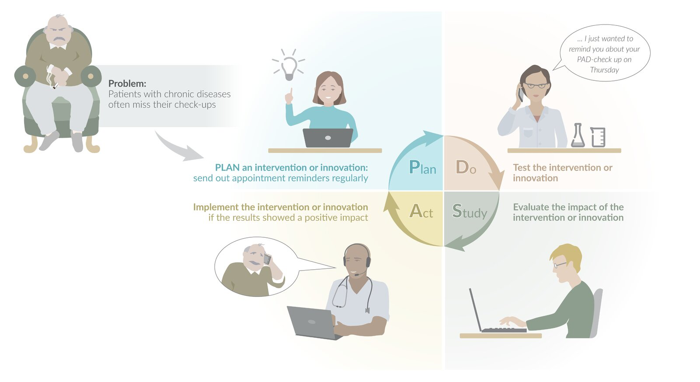
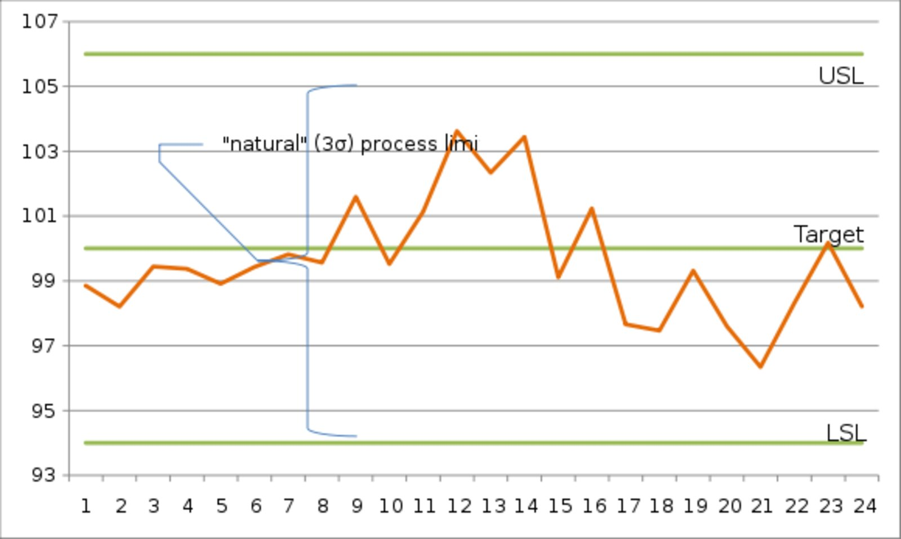

# Quality improvement

*Categories: Clinical knowledge > Legal medicine and professionalism > Quality improvement*

[Original Article Link](https://coursology-qbank.com/amboss/article/mp0VJS)

---

## Summary

Quality improvement (QI) is a structured process used to improve or verify the adherence of institutions and individual providers to established standards of healthcare. Tools such as <u>variation management</u> and the Plan-Do-Study-Act cycle (<u>PDSA cycle</u>) are used to identify areas of possible improvement and track incremental changes in quality. <u>QI measures</u> can be implemented on a national level (e.g., the <u>Merit-based Incentive Payment System</u>) or local level (e.g., a clinic improves access to care by extending opening hours). Measurements of patient satisfaction and management of patient complaints are often considered part of QI, but they are not synonymous with quality. Clinicians are expected to incorporate QI into their practice-based <u>learning</u> and continuing medical education.

For more information on the prevention of <u>medical errors</u>, see “<u>Patient safety</u>.”

---

## Health care quality

<u>Health care quality</u> refers to the degree to which health services generate the desired outcomes efficiently and in line with current standards of care.

### Key aims of health care (STEEEP) [[1]](https://coursology-qbank.com/amboss/article/__X5I00)[[2]](https://coursology-qbank.com/amboss/article/7AX4O00)[[3]](https://coursology-qbank.com/amboss/article/c-Xaw00)

* Safety: Avoid or minimize risks and hazards that may lead to harm (e.g., <u>iatrogenic</u> injuries/conditions).

* Timeliness: Reduce delays that may lead to harm.

* <u>Effectiveness</u>: Provide evidence-based health care and avoid services or treatments of doubtful benefit.

* Efficiency: Provide the highest quality care at the least investment of resources (e.g., avoid overutilization of medical resources, unnecessary diagnostics, overmedication).

* <u>Equitable care</u> principles: Provide equal care to all patients regardless of <u>gender</u>, ethnicity, <u>sexuality</u>, and <u>socioeconomic status</u>.

* Focus on patient needs: Individualize treatment with respect for patient preferences, values, and needs (see also “<u>Patient-centered approach</u>” in “<u>Patient communication and counseling</u>”).

### Integrated care [[4]](https://coursology-qbank.com/amboss/article/kFWmRM0)

* Definition: a multidisciplinary approach aimed at coordinating health care across levels, services, and settings to ensure the continuous improvement and delivery of <u>health promotion</u> and prevention, diagnosis and treatment, <u>rehabilitation</u>, and <u>palliative care</u>

* Principles

* Education, <u>shared decision-making</u>, and local services to empower individuals and communities to share in health care responsibilities

* Services tailored to the needs of individuals, communities, and the population as a whole

* Continuous improvement of <u>health care access</u>, quality, user satisfaction, and efficiency to ensure the best possible outcomes with the resources available (e.g., shared guidelines and protocols)

* Performance improvement through feedback loops

### Attributes of high-quality health care [[5]](https://coursology-qbank.com/amboss/article/m9WVLn0)[[6]](https://coursology-qbank.com/amboss/article/b-XHD00)[[7]](https://coursology-qbank.com/amboss/article/X-X9D00)

#### Cost-conscious care

<u>Alternative payment models</u> for health care are discussed in detail separately.

* Definition: a focus on controlling the costs of health care with the aim of providing affordable and accessible high-value care to the population at large

* Overview

* <u>Health care providers</u> have an obligation to manage resources responsibly and promote the accessibility as well as affordability of health care.

* <u>Health care providers</u> should be constantly aware of the cost of illness

* Principles

* Treatment recommendations and decisions should be individualized to foster adherence and prevent unnecessary treatment (see also “<u>Shared decision-making</u>”).

* Decisions should be made in accordance with evidence-based recommendations and guidelines to ensure effective and efficient treatment.
* Avoid overutilization of resources [[8]](https://coursology-qbank.com/amboss/article/59WiLn0)[[9]](https://coursology-qbank.com/amboss/article/d-Xow00)

* Overutilization can cause financial, physical, and psychological harm to patients.

* <u>Health care providers</u> should collaborate with patients on defining health care goals and provide realistic recommendations to achieve those goals.

* <u>Health care providers</u> should be transparent regarding treatment alternatives but recommend the course of action that provides the greatest benefit at the least expense of resources (e.g., prescribing a generic drug over the brand-name alternative)

* Unnecessary diagnostic tests or procedures should be avoided (e.g., unnecessary consultations, imaging studies, <u>antibiotic</u> or <u>opioid</u> prescriptions, maternity care interventions)

* Only truly necessary interventions or treatments should be recommended (e.g., ineffective nonpalliative services at end of life such as routine <u>screening tests</u> for cancer patients, <u>Pap smears</u> for patients with limited <u>life expectancy</u> and no relevant clinical features)

* <u>Antibiotic stewardship</u> programs (ASPs) [[10]](https://coursology-qbank.com/amboss/article/M9WMLn0)[[11]](https://coursology-qbank.com/amboss/article/h-XcC00)

* Organizations should assess the benefits, harms, and costs of diagnostic tests and interventions to determine whether they provide value in the treatment of specific diseases.

* Promotion of cost data transparency

* Facilitation of training regarding health care costs and health care spending for <u>health care providers</u>

* Collaboration between <u>health care providers</u> and government agencies to reduce financial and other obstacles to <u>health care access</u>

* Develop patient-friendly summaries to facilitate patient understanding of commonly used tests and procedures

* Goals

* Improvement of health care outcomes and <u>patient-centered care</u> that avoids unnecessary and even harmful interventions

* Reduction of the rapidly expanding costs of the <u>health care system</u>

##### Benefit-cost analysis [[12]](https://coursology-qbank.com/amboss/article/n9W7Ln0)[[13]](https://coursology-qbank.com/amboss/article/T-X6900)

* Overview

* An economic method used to compare the costs and benefits of an intervention or program

* Evaluates the impact of a program or intervention in quantifiable, monetary terms

* Assesses costs in the immediate (intervention) as well as the more distant future (intervention benefits)

* Allows ranking interventions and programs in order of decreasing net benefits in order to budget priorities accordingly (i.e., improves <u>resource stewardship</u>)

* Measures [[12]](https://coursology-qbank.com/amboss/article/n9W7Ln0)

* Benefit-cost ratio

* Provides insight into the amount of money saved for the amount spent on a program or intervention

* Benefits are divided by the net costs.

* Programs or interventions are generally implemented if the <u>benefit-cost ratio</u> is > 1.

* Net benefit (preferred measure) [[14]](https://coursology-qbank.com/amboss/article/L9WwLn0)

* The costs are subtracted from the benefits.

* Programs or interventions are generally implemented if the <u>net benefit</u> is > 0.

* Costs

* Staff, facilities, and medical supplies

* Psychological costs of disease increase long-term financial costs.

* Benefits

* Decreased medical expenditures due to a prevention initiative or treatment of a disease

* Increased productivity and satisfaction for healthcare employees due to improved outcomes

* Positive outcomes for patients have secondary, psychological benefits for healthcare workers

#### Equitable care [[15]](https://coursology-qbank.com/amboss/article/o9W0on0)[[16]](https://coursology-qbank.com/amboss/article/1-X2w00)

* Overview

* The provision of high-quality, affordable, and prompt care to all individuals regardless of age, <u>gender</u>, race, ethnicity, or <u>socioeconomic status</u> (see also “<u>Health care disparity</u>” in “<u>Health care system</u>”).

* Stakeholders in health care (i.e., health care organizations, health insurance companies, physicians, medical societies public policy makers) should collectively ensure access to appropriate health care for all people.

#### Patient-centered care [[17]](https://coursology-qbank.com/amboss/article/K9WUon0)[[18]](https://coursology-qbank.com/amboss/article/U-Xb900)

* Overview: a collaborative approach to the decision-making process between physicians, patients, and patient families that focuses on patient needs, requests, and desired outcomes

* <u>Health care providers</u> should keep the emotional, social, and financial effects of health care in perspective for each individual patient.

* Family members should be encouraged to participate if the patient desires. Their views and values should be discussed, respected, and taken into account.

* Pillars of <u>patient-centered care</u>

* Respect the patient's values, preferences, and needs.

* Provide adequate information and education (e.g., information for patients on condition, treatment plan, assistance with behavioral changes).

* Ensure access to care (e.g., facilitate making an appointment, short waiting time in office, timely response to telephone calls, efficient use of consultation time, electronic prescription refills).

* Provide emotional support.

* Involve family and friends, if the patient so desires.

* Ensure a safe and appropriate transition between health care settings (e.g., posthospital follow-up and support, proper information transfer between physicians and care providers)

* Provide a psychologically and physically comfortable setting for the patient.

* Guarantee proper <u>coordination of care</u> (e.g., coordination of specialist care, filling prescriptions to monitor patient adherence).

#### Timely care [[19]](https://coursology-qbank.com/amboss/article/p9WLon0)[[20]](https://coursology-qbank.com/amboss/article/W-XPw00)

* Overview

* Waiting times and operational hours that ensure patients receive the care they require in the event of an emergency.

* Timely delivery of care can help reduce mortality and <u>morbidity</u> also for chronic conditions.

* Principles to improve care timeliness

* Convenient operational hours

* Staggered shifts to extend operational hours

* Integrated services to provide appointment flexibility

* Appropriate number of staff and service hours

* Remote consultation or <u>telemedicine</u> services

* Low waiting times

* Easy-access appointment system for patients

* Enable making appointments via homepage, email, and <u>SMS</u> as well as telephone.

* Specific days or times for walk-ins or same-day appointments

### High-Reliability Organizations (<u>HROs</u>) [[21]](https://coursology-qbank.com/amboss/article/8zXOu00)[[22]](https://coursology-qbank.com/amboss/article/uzXpu00)

* Definition: organizations that consistently experience fewer accidents or harmful events than anticipated and manage to avoid these despite operating in complex, high-risk environments

#### Principles of HROs (principles of reliability) [[22]](https://coursology-qbank.com/amboss/article/uzXpu00)[[23]](https://coursology-qbank.com/amboss/article/J9Wson0)

Reliability in health care refers to the maintenance of a system's capability of performing its intended functions consistently according to the given standards of quality and safety. <u>HROs</u> operate under the principles of <u>patient-centered</u>, timely, and effective care to promote consistency and quality.

* Preoccupation with failure

* High <u>sensitivity</u> to the potential consequences of failure and error maintains vigilance for hazards and risks high even as rates of failure and error decrease

* Accordingly, <u>near misses</u> are regarded as potential failures that provide opportunities to test and improve the system rather than the confirmation of safety.

* Reluctance to simplify

* The appreciation of a system's necessary degree of complexity prevents individuals from cutting corners in the endeavor for efficiency in areas where safety is a concern.

* At the same time, there is an awareness of how unnecessary or excessive complexity also poses a <u>hazard</u> and that efficiency can be an important aspect of safety (as reflected, e.g., by <u>standardization</u>, streamlining processes, and reducing variation).

* <u>Sensitivity</u> to operations: <u>situational awareness</u> of how individual processes and actions affect the operations of a system as a whole

* Commitment to resilience

* Recognition of the fact that failure can be unpredictable and that a completely error-free environment cannot be created.

* Individual members are trained to continuously analyze challenging situations efficiently and minimize harm effectively.

* Deference to expertise: an organizational culture that encourages collaboration with and seeking advice from individuals with the experience and expertise necessary for the task at hand rather than relying on the authority of senior rank in challenging situations

### Measures of health care quality [[24]](https://coursology-qbank.com/amboss/article/q9WCon0)[[25]](https://coursology-qbank.com/amboss/article/e-Xxw00)

<u>Quality measurement</u> as part of <u>pay-for-performance</u> payment models (e.g., <u>PQRS</u>, <u>MIPS</u>) is discussed in detail separately.

* Definition: indicators used to assess and compare the quality of <u>health care systems</u>, based on the model developed by physician and health care services researcher Avedis <u>Donabedian</u>

* Donabedian model

* A framework for evaluating the quality of health care based on the assessment of structural, process, outcome, and <u>balancing measures</u>

* Based on the assumption that the structural context of health care (i.e., facilities, equipment, staff), the processes that take place within that context, the outcomes generated by the processes, and the interaction (balancing) of systems affect one another and determine the overall quality of health care

|  <u>Donabedian model</u> [[24]](https://coursology-qbank.com/amboss/article/q9WCon0)[[26]](https://coursology-qbank.com/amboss/article/I9WYKn0)  |  |  |
| --- | --- | --- |
|  | Definition | Examples |
| Structural measures |  * Measures of the resources available to a <u>health care facility</u> (e.g., equipment, facilities, staff)   |   * Number of nutritionists available for patients with <u>diabetes</u>  * Physician-patient <u>ratio</u>  * Number of beds    |
| Process measures |  * Measures of <u>health care system</u> performance as planned   |  * Percentage of individuals who receive a particular preventive service (e.g., immunizations, <u>cancer screening</u>, <u>HbA1c</u> measurement) over a period of time   |
| Outcome measures |  * Measures of the final impact of service provided by a <u>health care facility</u>, including mortality and <u>morbidity</u>   |   * Average <u>HbA1c</u> measurement of patients over a period of time  * Rates of <u>nosocomial infections</u>  * <u>Maternal mortality rates</u>    |
| Balancing measures |  * Measures of the impact of one system on another   |   * Cost-benefit analysis (e.g., using <u>number needed to treat</u>) of hiring more nutritionists to educate patients with <u>diabetes</u>  * Evaluating readmission rates after an initiative to reduce the average length of stay    |
|  Composite measures [[27]](https://coursology-qbank.com/amboss/article/9HcNsd0)[[28]](https://coursology-qbank.com/amboss/article/CHcqsd0)  |  * Measures that aggregate structural, process, and/or <u>outcome measures</u> into a single score   |  * A <u>composite measure</u> for assessing the management of <u>atrial fibrillation</u> (<u>Afib</u>) may aggregate the following measures:  * Number of cardiologists at the care facility (a <u>structural measure</u>)  * Percentage of patients with <u>Afib</u> who receive anticoagulation therapy (a <u>process measure</u>)  * Percentage of patients with <u>Afib</u> on anticoagulation therapy who develop <u>thromboembolic stroke</u> (an <u>outcome measure</u>)   |

### <u>Electronic health record</u> (<u>EHR</u>) and <u>health care quality</u>

* The US has invested heavily in health care information technology (e.g., <u>EHR Incentive Program</u>).

* Advantages of the <u>EHR</u> include:

* Improved communication and coordination between providers

* Immediate access to <u>clinical decision support systems</u>

* More efficient data collection for quality improvement programs

* Patient outcomes attributed to <u>EHR</u> use include: [[29]](https://coursology-qbank.com/amboss/article/hxWcwn0)[[30]](https://coursology-qbank.com/amboss/article/3xWSwn0)[[31]](https://coursology-qbank.com/amboss/article/RxWlwn0)

* Fewer <u>medication errors</u> and <u>adverse drug reactions</u>

* Lower readmission rates

* Improved adherence to clinical guidelines

---

## Continuous quality improvement in health care

Quality improvement is a continuous process of prospectively and retrospectively reviewing <u>measures of quality</u> control and maintenance to progressively improve the standard of health care and prevent <u>medical error</u>.

### Improvement science [[32]](https://coursology-qbank.com/amboss/article/Z9WZNn0)[[33]](https://coursology-qbank.com/amboss/article/s-XtA00)

* Multidisciplinary approach

* Applied science field based on researching and determining which improvement strategies work in the <u>health care system</u> and policies in order to ensure quality, safety, and value

* Focuses mainly on three areas of health care: interventions to improve or change existing processes, the implementation and systematic study of changes implemented, and the context or conditions in which the changes are applied.

#### Variation management [[34]](https://coursology-qbank.com/amboss/article/T9W65n0)[[35]](https://coursology-qbank.com/amboss/article/C9Wqpn0)

Variation in health care refers to the difference between the expected outcome of an intervention or process and the actual outcome. Some variation is expected and even necessary (e.g., new guidelines, new treatments, changes to processes) since every patient is different and should receive personalized care. However, the frequent occurrence of unexpected events due to unpredictable processes can also pose a risk to healthcare workers and patients. Proper <u>variation management</u> involving patients, health care managers, clinicians, and researchers increases the predictability of a <u>health care system</u> and the understanding of how care is being delivered, thereby improving the overall quality of care (i.e., stable and safe processes, care <u>effectiveness</u> and <u>generalizability</u>, <u>clinical outcome</u>).

* Types of variation

* Common cause variation

* A natural variation that is inherent to processes in a <u>health care system</u>

* Generally occurs at stable and predictable intervals, but may be unpredictable

* Typically cannot be traced back to a root cause

* Examples: patients with different manifestations for the same disease, demographic or socioeconomic differences between patients, hospital staff skills

* Special cause variation

* A variation attributable to a specific cause that is not inherent to processes in a <u>health care system</u>

* Occurs sporadically and unpredictably

* Typically, can be traced to a root cause that can then be identified and addressed

* May occur due to system or process management

* Examples: patient information is missing due to human error (file misplacement or <u>wrong patient</u> coding), the order in which patients are seen and treated (i.e., patients being seen out of turn), how hospital services are scheduled, the staff's workload during a shift, ordering different tests for the same clinical presentation

* Goals of managing variation: reducing <u>special cause variation</u> and properly managing <u>common cause variation</u>

* Understanding the type of variation before using internal data to positively impact systematic improvement strategies and, subsequently, improve quality and reduce potentially costly variations

* Improving <u>patient safety</u> and satisfaction

* Introducing instruments to assess and control variation in order to facilitate the detection of flaws in the system and establish consistency based on best practices

#### Instruments of <u>variation management</u> [[36]](https://coursology-qbank.com/amboss/article/U9Wb5n0)[[37]](https://coursology-qbank.com/amboss/article/y9WdJn0)[[38]](https://coursology-qbank.com/amboss/article/uTWpsk0)

* Variation analysis

* Identify the sources and types of variation.

* Determine how variations affect the system across time, place, and staff within the system.

* <u>Variation management</u>: implement measures to control variation

* <u>Standardization</u> of care and implementation of guidelines: protocols, checklists, clinical pathways (see “<u>Human factors and ergonomics</u>”)

* <u>Standardization of processes</u>, technology, and equipment reduces variation, costs, and the risk of error to improve <u>health care quality</u> and <u>patient safety</u>

* Typically used to improve processes that exhibit <u>common cause variation</u>

* Quality improvement interventions or models: a systematic framework for establishing change processes in <u>health care systems</u>, services, or suppliers for the purpose of increasing the likelihood of optimal quality of care [[37]](https://coursology-qbank.com/amboss/article/y9WdJn0)

* The components of <u>quality improvement interventions</u> can be applied to organizations, <u>health care systems</u>, the behavior of health professionals, and the patients cared for

* These interventions aim to identify inefficiencies and implement standardized processes to reduce costs and improve overall productivity.

* Typically measured by positive health outcomes in individuals and populations, examples include:

* <u>Plan-do-study-act cycle</u>

* <u>Six Sigma</u>

* Lean process improvement [[38]](https://coursology-qbank.com/amboss/article/uTWpsk0)

* Definition: quality improvement methodology that focuses on eliminating unnecessary steps in delivering patient care

* Aim: optimize workflows (e.g., to prevent delays in access to care), reduce waste (e.g., fewer patient no-shows), and improve the overall quality of care (e.g., shorter waiting times)

* Physician education and physician reminder systems

* Facilitated clinical data to providers

* Feedback

* Benchmarking

* Practice guidelines

* Critical pathways

* Patient education and patient reminder systems

* Promotion of self-management

* Providing feedback on performance data to the <u>healthcare provider</u>

* Establish a data monitoring system to review physician performance and appropriate use of standardized criteria

* Implement peer review programs to identify problems in performance and conduct focused professional practice evaluations

* Identifying the areas within the system that have the most variation utilization potential (e.g., hospital readmissions, CU utilization, emergency room utilization, surgical procedures, imaging tests)

* Creating a work culture based on improvement, transparency, safety, and excellence: Systems should strive for continuous performance improvement by implementing benchmarks, being open to collaboration, and providing external or internal leadership examples.

* Variation monitoring: Routinely collect, analyze, and report variation in <u>clinical outcomes</u> and <u>outliers</u>, to measure the impact of applying certain clinical practices and processes on <u>clinical outcomes</u>.

### Conceptual models of improvement [[39]](https://coursology-qbank.com/amboss/article/A9WRJn0)[[40]](https://coursology-qbank.com/amboss/article/29WT5n0)[[41]](https://coursology-qbank.com/amboss/article/lFWvRM0)

Continuous process control and improvement are fundamental aspects of quality management in any <u>healthcare system</u>. The models most commonly used today are the plan-do-study-act cycle (<u>PDSA</u>) and the plan-do-check-act cycle (<u>PDCA</u>), iterative four-step cycles that ideally culminate in the consolidation of the lessons learned through <u>process standardization</u>. The cycles are repeated until the problem is resolved or the process is perfected. However, due to the effects of variation in <u>complex systems</u>, process improvement is rarely finalized, and the <u>PDSA</u>/<u>PDCA</u> typically begins anew based on the standards set in the previous cycle.

* Plan: : assessing the need for improvement and planning the actions required to achieve the desired outcomes

* Do: : carrying out the actions determined necessary for improvement and testing their applicability

* Study/Check: : evaluating the data collected in the previous steps/inspecting compliance

* Act: : implementing the measures of process improvement based on the data collected

While the individual steps of the <u>PDSA</u> and <u>PDCA</u> are very similar, there are key differences between the <u>PDCA</u> and the <u>PDSA</u>.

* <u>PDCA</u>

* The precursor to the <u>PDSA</u> model, but still preferred in some business settings

* Focus on testing currently running processes to ensure compliance

* Check-stage

* Process inspection to ensure compliance

* Comparison of expected results and actual results

* Measurement of the improvement necessary for progressing to the Act-stage

* <u>PDSA</u>

* Often preferred in health care organizations

* Focus on the development and testing of process changes

* Focus on continuous <u>learning</u> as a basis for continuous improvement

* Study-stage

* Analysis of data collected in previous stages

* Reflection of metrics being analyzed

PDSA cycle

#### Steps in the cycles [[39]](https://coursology-qbank.com/amboss/article/A9WRJn0)

* Plan

* In this phase, an area that needs improvement is defined, followed by the planning of potential changes or actions to bring about a corrective change.

* SMART criteria can be applied to accurately define and develop the objectives of change [[42]](https://coursology-qbank.com/amboss/article/-9WDJn0)

* Specific: objectives are clear and specific with regard to actions required, expected impact, target population, and responsibilities

* Measurable: determine indicators that allow quantification of an objective's impact and the progress made towards achieving it

* Assignable: determine responsibilities in the team and set objectives that can realistically be achieved with the resources available.

* Realistic: set objectives that align with the intended goal and mission

* Timely: set objectives that can be achieved within a specific time frame and establish realistic timelines

* Do

* In this phase, the new action is tested.

* Attempt to solve the defined problem by mapping out possible hypotheses and trying new methodologies.

* Problems and unexpected observations should be documented.

* Study

* This phase completes the analysis of the data before and after the action took place and assesses its impact on the quality of health care. 

* Outcomes are measured and monitored

* Outcomes are compared with the predictions and hypothesis

* One of the following improvement measurement tools may be used:

* Pareto chart: a type of graph that combines bars and a line, in which the bars represent a total for each category (arranged from highest to lowest) and an overlaid line represents the cumulative percentage of the total.  ;  [[43]](https://coursology-qbank.com/amboss/article/ZCWZqn0)[[44]](https://coursology-qbank.com/amboss/article/plYLB6)

* Typically used to identify defects and prioritize improvement processes for the most significant categories (frequency or cost of problems).

* Example: identifying the highest ranked reason for inadequate patient transfers and what percentage of the total this reason represents.

* Shewhart chart (<u>control chart</u>): a graphic representation of data plotted over time by comparing the degrees of variation in a measure to determine if a perceived improvement in quality is <u>statistically significant</u> in the long term.   [[45]](https://coursology-qbank.com/amboss/article/0CWeqn0)

* Typically uses lines determined by previous data: a <u>central line</u> (shows the average), an upper line (shows the upper <u>control limit</u>), and a lower line (shows the lower <u>control limit</u>)

* Helps to identify variation (common cause vs. special cause) within the process by comparing current data to the aforementioned lines.

* Run chart (<u>time plot</u>): a line graph that plots data over time to analyze trends  ;  [[46]](https://coursology-qbank.com/amboss/article/aCWQqn0)

* The data displayed visualizes process performance over time

* Vertical axis: represents the process (currently being measured)

* <u>Horizontal axis</u>: represents time

* Center line: represents the mean or average

* <u>Run charts</u> do not use <u>control limits</u>; accordingly, they cannot provide information on whether a process is stable or not.

* Example: analysis of the impact of an intervention over time to help determine whether the improvement is a random occurrence or a true trend

* Check

* Review the effects of the implemented change (i.e., what was intended to be achieved actually happened)

* Analyze the results and identify learnings.

* Act

* This phase revolves around taking action

* Will result in either of the two options:

* Implementation of new processes according to the data collected in the “do” and “study” phases, if these showed a positive impact on <u>health care quality</u>

* Determine what modifications should be made to the tested action and prepare a new change plan (i.e., begin the cycle again)

Pareto Chart

Control Chart

Run Chart

### Clinical microsystems [[47]](https://coursology-qbank.com/amboss/article/v51ANh0)[[48]](https://coursology-qbank.com/amboss/article/D511mh0)[[49]](https://coursology-qbank.com/amboss/article/951Nmh0)

* Definition

* A core functional unit that exists within a larger organization and provides care for a set population in a specific location, i.e., the building blocks of a <u>healthcare system</u>

* <u>Clinical microsystems</u> involve the interaction of various roles (e.g., patients, <u>health care professionals</u>, support staff), processes (e.g., information sharing), and environmental factors (e.g., work environment, facility architecture, and equipment).

* Examples: <u>neonatal ICU</u>, emergency department, primary care physician's office, operating room

* Significance

* <u>Medical errors</u> are most likely to occur at the interfaces between roles, processes, and the environment of the system (e.g., during patient <u>handovers</u>, the administration of medication, or entering information into the electronic record system)

* Improving the functioning of and addressing hazards in microsystems can help prevent errors and, thereby, improve the quality of health care (e.g., by using <u>PDSA cycles</u> to improve patient <u>handovers</u>).

* Quality improvement in individual <u>clinical microsystems</u> improves the quality of care in the <u>health care system</u> as a whole.

---

## Collaboration and teamwork

* Significance  [[50]](https://coursology-qbank.com/amboss/article/YCWnqn0)[[51]](https://coursology-qbank.com/amboss/article/S9Wy5n0)

* The basis of <u>health care quality</u> and safety

* <u>Teamwork</u> and a collaborative work environment improve employee morale and, subsequently, the quality of health care.

* Collaboration and <u>teamwork</u> are professional expectations that every physician will be evaluated on.

* General domains [[52]](https://coursology-qbank.com/amboss/article/QZbuYH)[[53]](https://coursology-qbank.com/amboss/article/xDXEgZ0)

* Communication

* <u>Teamwork</u> and mutual support

* Leadership

* Situation monitoring

* Conflict resolution

---

## Workplace communication

### General principles [[54]](https://coursology-qbank.com/amboss/article/BDXzgZ0)

* Objective: communicating effectively and avoiding <u>communication errors</u>, e.g., by sharing incomplete, wrong, or ambiguous information

* Nonviolent communication [[55]](https://coursology-qbank.com/amboss/article/VzXG700) 

* Communication approach developed by Marshall Rosenberg designed to improve communication through empathy and awareness for the violence inherent to coercive and manipulative communication strategies

* According to Rosenberg, the source of conflict often lies in miscommunication about human needs, and violent language further fuels the conflict. Understanding the needs of others empathetically and expressing one's own needs honestly can prevent and help resolve conflict.

* Involves 4 components (i.e., observation , needs , feelings , and requests ) and 3 modes (i.e., self-empathy , honest expression , and empathetic reception )

* Cultural humility: open-minded and respectful attitude towards aspects of other persons' cultural identity that may be particularly important to them [[56]](https://coursology-qbank.com/amboss/article/bCWHqn0)

* Active listening: technique that involves listening closely, employing verbal (e.g., “I understand,” “Ok”) and nonverbal cues (body language, e.g., nodding), and paraphrasing back to the speaker to signal that one is positively engaged in the conversation [[57]](https://coursology-qbank.com/amboss/article/XCW9qn0)

* Information sharing: : making sure to provide all the information team members need to fulfill a task

### Strategies for effective communication [[52]](https://coursology-qbank.com/amboss/article/QZbuYH)

See also “<u>Handoff tools</u>” in “<u>Daily life of the intern</u>.”

#### SBAR tool [[58]](https://coursology-qbank.com/amboss/article/XAX9R00)

* Definition: a framework used in health care to avoid errors in the communication of a patient's condition

* Example scenario: A physician communicates the patient's condition to a colleague.

* Situation: assess what is happening at the moment (e.g., patient shows signs of arousal, discomfort, <u>chest pain</u>)

* Background: provide <u>patient history</u> (e.g., the patient was jogging when she began to feel <u>chest pain</u>)

* Assessment: express what the issue is (e.g., <u>chest pain</u>, discomfort, and/or arousal are potential signs of <u>myocardial infarction</u>)

* Recommendation and Request: develop a solution for the issue and take the appropriate steps to implement the solution (e.g., getting help from senior residents, ordering the nurse to take an <u>ECG</u>, preparing the patient for <u>cardiac catheterization</u>)

#### Check-back [[59]](https://coursology-qbank.com/amboss/article/h9WcMn0)

* Definition: a form of closed-loop communication used in health care to avoid <u>communication errors</u> in which the listener repeats the information received back to the speaker and the speaker confirms that the information has been received as intended

* Example scenario: During <u>surgery</u>, a patient loses a significant amount of blood and requires <u>blood transfusions</u>.

* The anesthesiologist (sender) calls out: “The patient is losing a lot of blood, we need two bags of A+ blood as soon as possible.”

* The nurse responsible (receiver) for taking care of this request responds: “Got it, we need two bags of A+ blood. I will order those right away.”

* The anesthesiologist (sender) confirms that the information has been received as intended by saying: “Correct!”

> [!TIP]
> Employ <u>strategies for effective communication</u> when consulting medical specialists to avoid delays in diagnosis and/or treatment.

### Strategies for escalating concerns/making assertions

#### DESC technique [[60]](https://coursology-qbank.com/amboss/article/69XjoZ0)[[61]](https://coursology-qbank.com/amboss/article/cCWaIn0)

* Definition: a technique in four steps employed to give concise, constructive feedback

* Describe: Describe the situation or behavior in question as objectively as possible.

* Express: Express your thoughts and feelings associated with the situation (using first-person statements, e.g., “I feel my concerns are not being considered,” and avoiding blame, e.g., “you never listen”).

* Specify: Specify your wishes and preferred outcome.

* Consequences: Outline the consequences, i.e., the positive payoff for you and others, of your preferred outcome.

* Example scenario: A nurse pages a resident in the middle of the night with a nonurgent question.

* Description: “Nurse Roberts, you paged me in the middle of the night with a question that didn't need answering right away.”

* Expression: “I woke up thinking there was an emergency, only to realize that you had a question that, in my opinion, could have waited until tomorrow.”

* Specification: “I encourage you to closely evaluate the urgency of your requests before paging me outside work hours and, especially, at night.”

* Consequences: “I have to perform <u>brain</u> <u>surgery</u> tomorrow morning and without proper rest, I might not be able to perform to the height of my abilities.”

#### Two-challenge rule [[59]](https://coursology-qbank.com/amboss/article/h9WcMn0)

* Definition: a technique for avoiding conflict while escalating a situation that involves voicing concern, e.g., regarding unsafe conduct, at least twice to the person responsible, before initiating a more assertive approach (e.g., intervening) or alerting a person in a higher position if the concerns are not addressed.

#### CUS communication [[59]](https://coursology-qbank.com/amboss/article/h9WcMn0)

* Definition: technique that involves voicing that you feel Concerned, Uncomfortable, and that the situation is not Safe.

#### PACE model for graded assertiveness [[62]](https://coursology-qbank.com/amboss/article/R9WlMn0)

* Definition: a strategy to escalate concerns effectively and appropriately in situations of potential crisis

* Probe the situation by voicing your concerns and assessing the reaction of others.

* Alert the persons involved if unsatisfied with the response, reiterating your concerns more emphatically.

* Challenge the situation openly if still unsatisfied with the response, formally stating your concerns and pointing out the consequences.

* Emergency action should be taken if all previous efforts to avert the crisis have been unsuccessful.

* Example scenario: A patient needs an <u>antibiotic</u>. An inexperienced resident is about to give <u>penicillin</u> to the patient. He appears to have missed the documented <u>penicillin</u> <u>allergy</u> in the patient's file. An attentive nurse intervenes:

* P: “Doesn't this patient have a <u>severe penicillin allergy</u>?”

* A: “The <u>antibiotic</u> you're about to give to the patient is <u>penicillin</u> and the patient has a documented <u>penicillin</u> <u>allergy</u>!”

* C: “If you administer <u>penicillin</u>, the patient may have an <u>anaphylactic shock</u>. You should not give <u>penicillin</u> to this patient and change the <u>antibiotic</u> regimen immediately.”

* E: “Step away from the patient! I am taking over and contacting your supervisor!”

---

## Teamwork and mutual support

The foundations of good <u>teamwork</u> are efficient, clear, and open communication; mutual respect and support; and <u>psychological safety</u>.

### Definitions

* Interprofessional team: a team composed of individuals with different professional backgrounds and/or specialties (e.g., a nurse, a physical therapist, and a physician; a <u>surgeon</u>, an anesthesiologist, and a radiologist) collaborating towards a common goal

* Intraprofessional team: a team composed of individuals with the same professional background (e.g., a team of physical therapists) collaborating towards a common goal

### Core competencies for teamwork [[63]](https://coursology-qbank.com/amboss/article/ADXRSZ0)[[64]](https://coursology-qbank.com/amboss/article/1CW2In0)[[65]](https://coursology-qbank.com/amboss/article/sFWtjM0)[[66]](https://coursology-qbank.com/amboss/article/GFWBjM0)

There are many institutional and societal frameworks to guide effective <u>teamwork</u>; most contain the following core tenets.

#### Shared belief in the benefits of <u>teamwork</u>

* Collective <u>intelligence</u> improves patient care: Pooling insights and skills generates more effective decisions.

* Synergy: The benefits of <u>teamwork</u> are greater than the sum of what individuals can achieve working separately.

#### Creation of a psychologically safe environment

* Mutual respect and support is a fundamental principle of the group.

* Cooperation is founded on trust and recognition of all members' contributions.

* There is a positive group attitude toward conflict resolution.

* The work environment permits and encourages the verbalization of ideas, concerns, mistakes, and questions without fear of negative consequences.

#### <u>Effective communication</u>

* <u>Strategies for effective communication</u> are employed to minimize <u>communication errors</u>.

* Proactive sharing of unique information is encouraged.

#### Optimization of team dynamics

* Coordination

* The individual's roles are clearly defined based on their level of skill, knowledge, and behavior.

* Shared goals, norms, and expectations are clearly defined and articulated.

* Cooperation

* Team members consult and assist each other to meet team goals efficiently.

* Team members remain vigilant of other team members’ skills, roles, and possible need for help.

* Members are open to suggestions from others without becoming defensive.

* <u>Shared decision-making</u>: based on collective <u>intelligence</u> and good communication

> [!TIP]
> In emergency settings, coordination, cooperation, and communication between team members should follow the principles of <u>crisis resource management</u>. [[67]](https://coursology-qbank.com/amboss/article/j7X_lz)

#### Reflection

* Ongoing team adaptability is fostered by team reflections and debriefings.

* Structured tools or processes are used to guide team reflection on previous experiences.

* All team members participate in debriefing sessions, preferably soon after the care event has occurred.

### Goals of <u>teamwork</u> [[64]](https://coursology-qbank.com/amboss/article/1CW2In0)[[65]](https://coursology-qbank.com/amboss/article/sFWtjM0)[[66]](https://coursology-qbank.com/amboss/article/GFWBjM0)

* Team members

* More job satisfaction

* Greater role clarity

* Improved sense of well-being

* Team

* Improved <u>coordination of care</u>

* Efficient use of resources

* Enhance communication efficiency and professional synergy

* Organization

* Reduce the time and/or costs of hospitalization

* Better accessibility for patients

* Patient

* Better care

* Greater satisfaction

* Lower cost

### Barriers to effective <u>teamwork</u> [[68]](https://coursology-qbank.com/amboss/article/6CWjGn0)[[69]](https://coursology-qbank.com/amboss/article/JCWsGn0)

* Frequent changes in team composition and/or individual team roles

* A physical environment that does not promote team cohesion

* Hierarchies that prevent <u>effective communication</u>

* Inconsistent team member behaviors, e.g., varying bedside manner, discordant treatment preferences

---

## Leadership

Leadership is a central factor in determining the culture of a healthcare organization and developing strategies for effective and efficient delivery to patients. Healthcare leaders should lead by example and shape their teams through collaboration from within. Accordingly, successful leadership requires interpersonal (soft) skills as well as organizational (hard) skills.

### Organizational skills [[52]](https://coursology-qbank.com/amboss/article/QZbuYH)[[70]](https://coursology-qbank.com/amboss/article/qCWCGn0)

* Coordination

* Clarify roles

* Set clear goals

* Assign tasks

* Structure team

* Manage resources

* Monitoring

* Modify plans as necessary and communicate changes

* Evaluate team performance

* Provide necessary feedback

### Interpersonal skills

* Lead by example

* Encourage <u>teamwork</u> through engagement in the team

* Foster positive team culture and atmosphere

* Provide team members with the necessary information and facilitate information sharing

* Encourage and mediate conflict resolution

### Situation monitoring [[67]](https://coursology-qbank.com/amboss/article/j7X_lz)

* Goal: ensuring a common understanding of the situation to reach common goals efficiently and safely

* STEP components of situation monitoring

* Status of patient

* Team members (skills, performance, <u>stress</u>, and fatigue)

* Environment (resources and equipment)

* Progress towards goal

* Cross-monitoring: Team members monitor each other to ensure that procedures are followed appropriately and safely.

> [!TIP]
> Effective team leaders should follow the principles of <u>crisis resource management</u> in emergencies. [[67]](https://coursology-qbank.com/amboss/article/j7X_lz)

---