# Nerve tissue, synapses, and neurotransmitters

*Categories: Clinical knowledge > Neurology > Basics of neurology > Nerve tissue, synapses, and neurotransmitters*

[Original Article Link](https://coursology-qbank.com/amboss/article/lp0vpS)

---

## Summary

<u>Nerve tissue</u> consists of <u>neurons</u>, which are excitable cells that transmit information as electrical signals, and <u>glial cells</u> (e.g., <u>oligodendrocytes</u>, <u>Schwann cells</u>, <u>astrocytes</u>, <u>microglial cells</u>), which perform a variety of nonsignaling functions such as forming <u>myelin</u> to provide support and insulation between <u>neurons</u>, phagocytosing and removing cellular debris, removing excess <u>neurotransmitters</u>, and forming the <u>blood-brain</u> barrier. <u>Oligodendrocytes</u> myelinate <u>neurons</u> in the <u>central nervous system</u> (<u>CNS</u>), while <u>Schwann cells</u> myelinate <u>neurons</u> in the <u>peripheral nervous system</u> (<u>PNS</u>). <u>Myelin</u> sheaths increase the conduction <u>velocity</u> of signals across <u>axons</u>. Inflammation and loss of the <u>myelin</u> sheath are the underlying pathologic processes in <u>multiple sclerosis</u> (<u>CNS</u>) and Guillain barre syndrome (<u>PNS</u>). <u>Neurons</u> are composed of <u>dendrites</u>, cell bodies, <u>axons</u>, and <u>axon</u> terminals. Based on their conduction <u>velocity</u>, diameter, and myelination, nerve fibers (<u>axons</u>) are classified into large, myelinated fibers with fast conduction <u>velocity</u> (group A); small, myelinated fibers with slow conduction <u>velocity</u> (group B); and small, unmyelinated fibers with slow conduction <u>velocity</u> (group C). <u>Neurons</u> communicate through the transmission of <u>action potentials</u> across junctions between them called <u>synapses</u>. <u>Synaptic transmission</u> can be chemical or electrical. Chemical <u>synaptic transmission</u> is the transfer of signals through the release of <u>neurotransmitters</u> (e.g. <u>acetylcholine</u>, <u>dopamine</u>, <u>norepinephrine</u>) from presynaptic terminals to postsynaptic <u>receptors</u>. Electrical <u>synaptic transmission</u> is the transfer of electrical signals through <u>gap junctions</u>. Alterations in <u>neurotransmitter</u> levels have been observed in various neurological diseases, including <u>Parkinson disease</u> (decreased <u>dopamine</u>), <u>schizophrenia</u> (increased <u>dopamine</u>), <u>depression</u> (decreased <u>dopamine</u>, <u>norepinephrine</u>, and <u>serotonin</u>), and <u>Alzheimer disease</u> (decreased <u>acetylcholine</u>).

Chemical Synapses: Neuronal Signal Transmission

---

## Nerve tissue

### General

* <u>Nerve tissue</u> is the main tissue component of the nervous system and is primarily composed of <u>neurons</u> and supporting <u>glial cells</u>.

* The nervous system is divided into two main components:

* Central nervous system (<u>CNS</u>): consists of the <u>brain</u> and spinal cord

* Peripheral nervous system: consists of the nerves and <u>ganglia</u> outside the <u>brain</u> and spinal cord, including the <u>cranial nerves</u>, <u>spinal nerves</u>, and their roots, <u>peripheral nerves</u>, and neuromuscular junctions

### Neurons

* Description

* Polarized, signal-transmitting cells that comprise the central and <u>peripheral nervous system</u>

* Classified into unipolar, pseudounipolar, bipolar, and multipolar depending on the number of protoplasmic processes (neurites)

* Do not undergo <u>mitosis</u>

* Composed of <u>soma</u> (cell body), <u>axon</u> and <u>dendrites</u>

* <u>Nissl staining</u> positive in <u>the cell</u> body and <u>dendrites</u>, which have <u>Nissl substance</u> (aggregates of <u>rough endoplasmic reticulum</u> with bound <u>polysomes</u>)

* Parts

* Soma: contains <u>the cell</u> organelles

* Has <u>Nissl substance</u>

* Pigments: <u>melanin</u>, <u>lipofuscin</u>

* <u>Cytoskeleton</u>: <u>microfilaments</u>

* Axon: the projection from a <u>neuron</u>'<u>s cell</u> body along which <u>action potentials</u> travel to send intercellular signals

* Connected to <u>the cell</u> body at the axon hillock; , which is a trigger zone for initiation of <u>action potentials</u> , and ends in a <u>synapse</u>

* Lacks a regular <u>rough endoplasmic reticulum</u> and thus does not contain <u>Nissl substance</u>  [[1]](https://coursology-qbank.com/amboss/article/9-YNz7)

* <u>Cytoskeleton</u>

* <u>Microtubules</u> with associated motor <u>proteins</u> for rapid axonal transport

* <u>Kinesin</u>: anterograde transport (– → +)

* <u>Dynein</u>: retrograde transport (+ → –)

* <u>Neurofilaments</u>

* Provide structural support

* Most abundant in <u>axons</u> and the <u>proximal</u> part of <u>dendrites</u>

* <u>Neurofilament</u> protein is used as a marker for neuronal cells.

* Dendrites

* Branching, thin projections from <u>the cell</u> body of <u>neurons</u> that receive input from neighboring <u>neurons</u> and transmit it to <u>the cell</u> body

* Contain spines that increase the number of <u>synapses</u> to other <u>neurons</u>

* Have <u>Nissl substance</u>

* <u>Cytoskeleton</u>: <u>microfilaments</u>

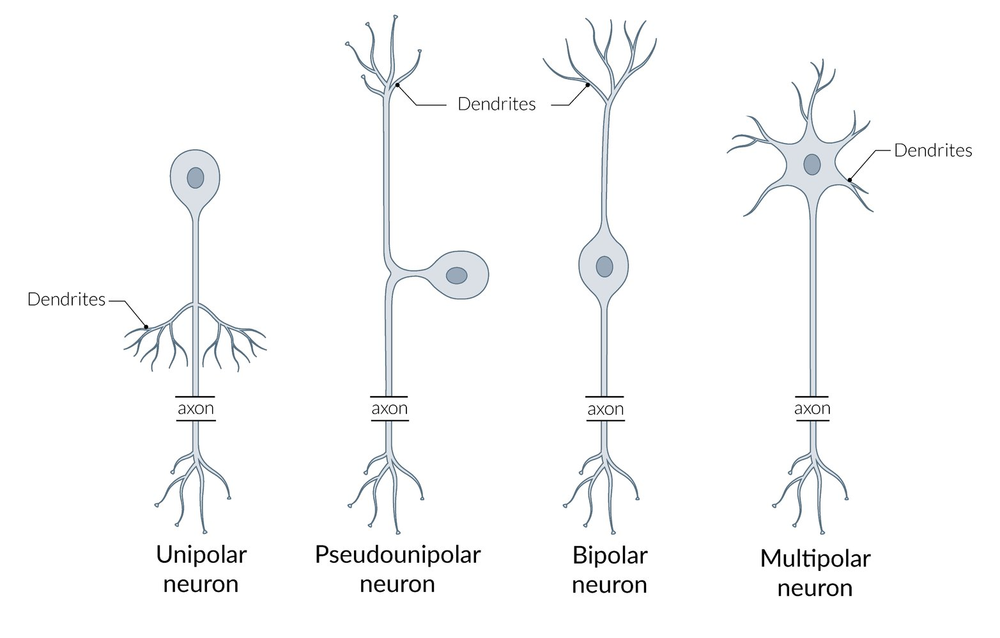

Types of neurons

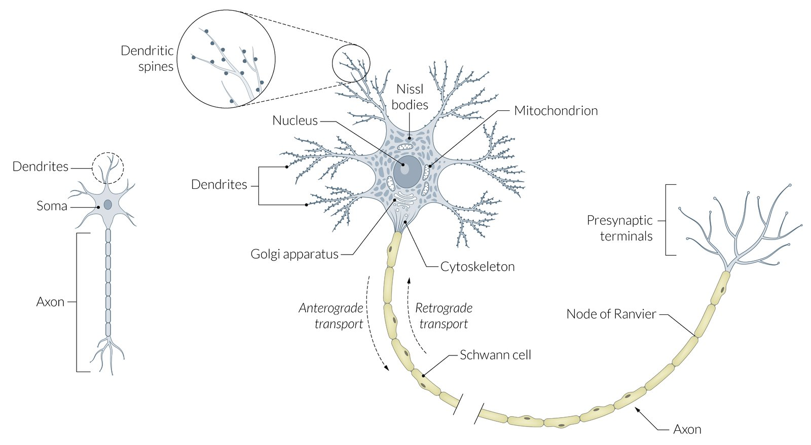

Structure of a neuron

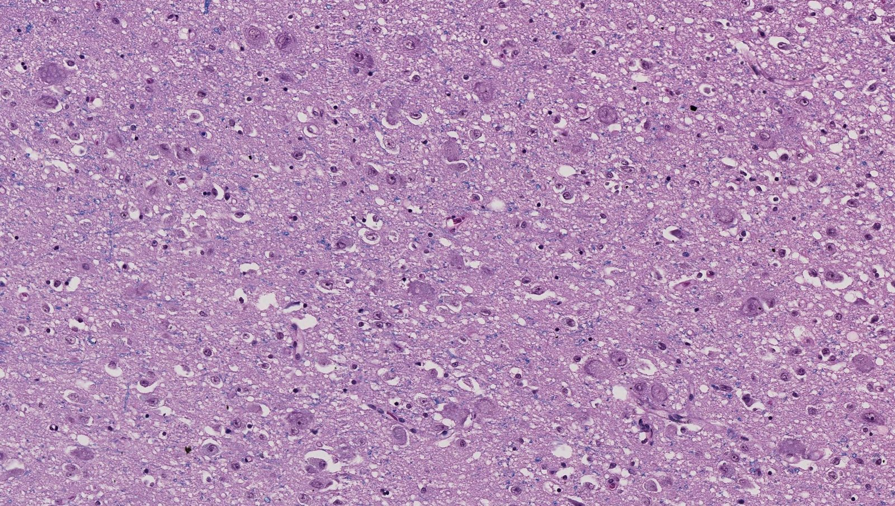

Somata and neuropil

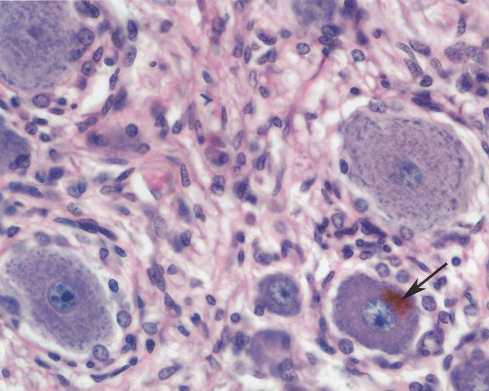

Sensory ganglion

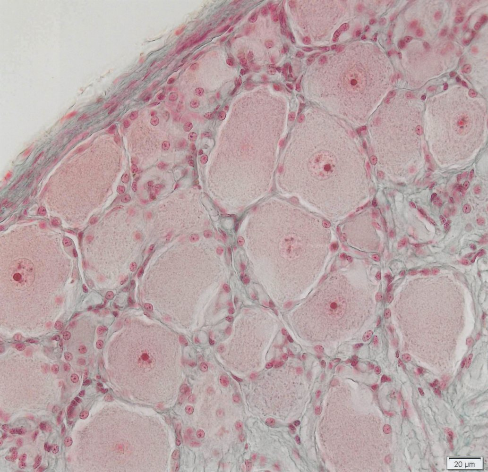

Sensory ganglion

### Supporting glial cells

| Cells of <u>nerve tissue</u> |  |  |  |
| --- | --- | --- | --- |
| Structure | Precursor | Characteristics | Clinical relevance |
| Central |  |  |  |
| Astrocytes |  * <u>Radial glial cells</u> from neuroepithelium (<u>neuroectoderm</u>)   |   * Most abundant type of <u>glial cells</u>  * Have a large number of projections  * Provide physical support (scaffolding of the <u>CNS</u>)  * Provide extracellular <u>potassium</u> buffer  * Remove excess <u>neurotransmitters</u>  * Contain <u>glycogen</u> reserve  * Contain bundles of <u>intermediate filaments</u> composed of <u>glial fibrillary acidic protein</u> (<u>GFAP</u>; an <u>astrocyte</u> marker)  * Proliferate and become <u>hypertrophic</u> after <u>CNS</u> injury  * Involved in nervous tissue repair  * Reactive gliosis → form of astroglial scars  * Foot processes form part of the <u>blood-brain</u> barrier and the glial-limiting membrane    |  * <u>Astrocytoma</u>   |
| Microglia |  * <u>Bone marrow</u> <u>monocytes</u> (<u>mesoderm</u>)   |   * Smallest type of <u>glial cells</u>  * Poorly identified with <u>Nissl stain</u>  * <u>Phagocytic cells</u>  * Activated in response to <u>CNS</u> tissue damage  * Proliferate and migrate to damaged <u>CNS</u> to remove cellular debris  * Release inflammatory mediators (e.g., <u>nitric oxide</u>) and signaling molecules (e.g., <u>glutamate</u>)    |  * <u>Target cells</u> for the <u>HIV-1</u> <u>virus</u>: Infected cells fuse to form <u>multinucleated giant cells</u>, which are the most specific histological marker of <u>HIV</u> <u>encephalitis</u> and <u>HIV-associated dementia</u>. [[2]](https://coursology-qbank.com/amboss/article/a_YQ57)   |
|  Ependymal cells (ependymocytes) and <u>choroid</u> <u>epithelial</u> cells  |  * Neuroepithelial cells (<u>neuroectoderm</u>)   |   * Simple columnar <u>glial cells</u>  * Form the <u>epithelium</u> lining the ventricles and <u>central canal</u> of the spinal cord  * Apical surface  * <u>Cilia</u> circulate <u>CSF</u>  * <u>Microvilli</u> increase the capacity of <u>CSF</u> absorption  * Modified <u>ependymal cells</u> known as the <u>choroid plexus</u> produce <u>cerebrospinal fluid</u>    |  * <u>Ependymoma</u>   |
| Tanycytes |  * <u>Radial glial cells</u> from neuroepithelium (<u>neuroectoderm</u>)   |   * Transport substances between the blood and the ventricles  * Located mainly on the floor of the <u>third ventricle</u>, in contact with <u>hypothalamic</u> <u>neurons</u>  * Play a role in <u>glucose</u> <u>homeostasis</u>    |  * Metabolic diseases (e.g., <u>type 2 diabetes</u>) [[3]](https://coursology-qbank.com/amboss/article/KS1U0g0)   |
| Oligodendrocytes |  * Neuroepithelial cells (<u>neuroectoderm</u>)   |   * Myelinate <u>axons</u> in the <u>CNS</u>, including <u>CN II</u>  * Main <u>glial cells</u> in the cerebral <u>white matter</u>  * Each projection of a cell can myelinate several <u>axons</u> (30 on average, up to 60). [[4]](https://coursology-qbank.com/amboss/article/_1Y5jL)  * Increase speed of conduction and <u>saltatory conduction</u>  * Fried-egg appearance on <u>histology</u>: prominent <u>nucleus</u> and clear, pale <u>cytoplasm</u>  * Unmyelinated <u>axons</u> are not covered by <u>oligodendrocyte</u> <u>cytoplasm</u>.    |   * <u>Oligodendroglioma</u>  * <u>Multiple sclerosis</u>  * <u>Progressive multifocal leukoencephalopathy</u> (<u>PML</u>)    |
| Peripheral |  |  |  |
| Schwann cells |  * <u>Neural crest cells</u> (<u>ectoderm</u>)   |   * Myelinate <u>axons</u> of the <u>PNS</u>, including <u>CN III</u>–XII  * Each cell can myelinate one single internodal segment for one single <u>axon</u>.  * Promote repair after nerve injury [[5]](https://coursology-qbank.com/amboss/article/Y_Yn57)  * Unmyelinated <u>axons</u> are covered by <u>Schwann cell</u> <u>cytoplasm</u>.  * Can <u>phagocytose</u> debris after injury  * Marker: <u>S100</u>    |   * <u>Guillain-Barré syndrome</u> (<u>GBS</u>)  * <u>Acoustic neuroma</u> (<u>vestibular schwannoma</u>)    |

> [!NOTE]
> Each myelinating SchwONE cell insulates only ONE <u>axon</u>.

> [!NOTE]
> <u>Glial cells</u> guard the <u>axons</u> of the nerve cells as COPS: CNS <u>axons</u> are myelinated by Oligodendrocytes; PNS <u>axons</u> are insulated by Schwann cells.

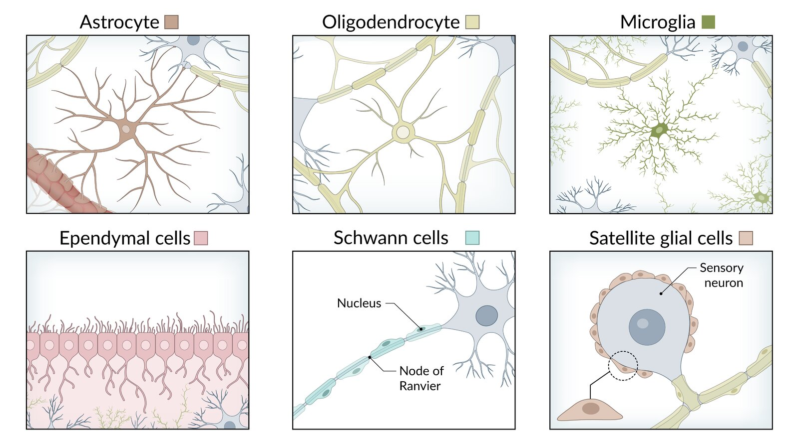

Overview of glial cells

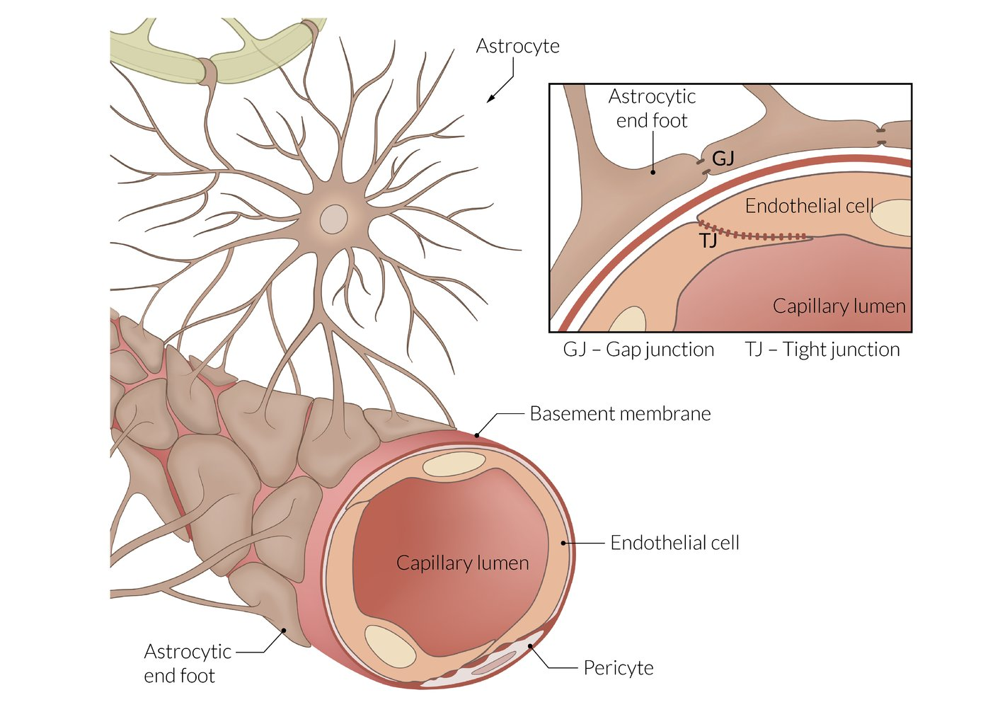

Blood-brain barrier

#### Myelin

* Insulating layer of modified plasma membrane that wraps around <u>axons</u> of nerve in a spiral structure

* Increases the space constant and the conduction <u>velocity</u> of signals traveling down <u>axons</u>

* Decreases <u>membrane capacitance</u> and increases <u>membrane resistance</u>

* Node of Ranvier

* Unmyelinated regions between two adjacent myelinated segments of <u>axons</u> in the <u>CNS</u> and <u>PNS</u>

* Contain a large amount of Na+ channels: allows <u>saltatory conduction</u> → increases the <u>velocity</u> of <u>action potentials</u>

* Demyelination: a process in which <u>myelin</u> sheaths of nerves become damaged, which impairs electrical conduction

* Central <u>demyelination</u> occurs within the <u>CNS</u> (e.g., seen with <u>multiple sclerosis</u>, <u>progressive multifocal leukoencephalopathy</u>, <u>leukodystrophies</u>).

* Peripheral <u>demyelination</u> affects the <u>PNS</u> (e.g., seen with <u>Guillain-Barré syndrome</u>).

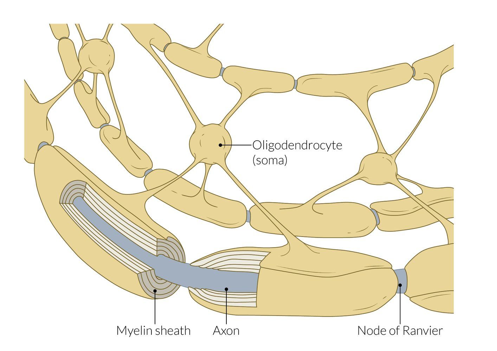

Oligodendrocytes

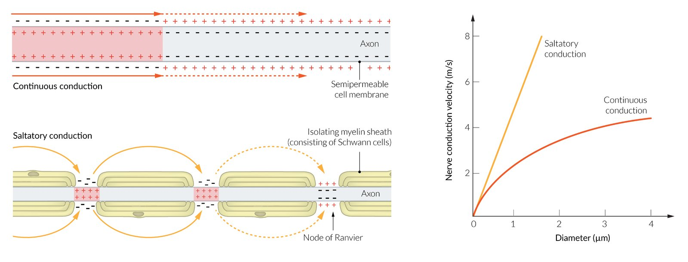

Conduction of action potentials

### Neuronal damage

* Responses to damage

* Cellular swelling

* Peripherally located <u>nucleus</u>

* Spread of <u>Nissl substance</u> throughout the <u>cytoplasm</u> of the <u>neuron</u> (<u>chromatolysis</u>)

* The <u>distal</u> injured part of the <u>neuron</u> undergoes <u>Wallerian degeneration</u>.

### Layers of <u>peripheral nerves</u>

* Endoneurium

* Thin inner layer of <u>connective tissue</u> around a single nerve fiber

* Clinical significance: contains inflammatory infiltrate in <u>Guillain-Barre syndrome</u>

* Perineurium

* Layer of <u>connective tissue</u> around nerve fascicles

* Contains the blood-nerve barrier

* Clinical significance: important layer in microsurgery during limb salvage surgical procedures

* Epineurium

* Outer layer of <u>dense connective tissue</u> around a nerve

* Contains nerve fascicles and <u>blood vessels</u> to the nerve

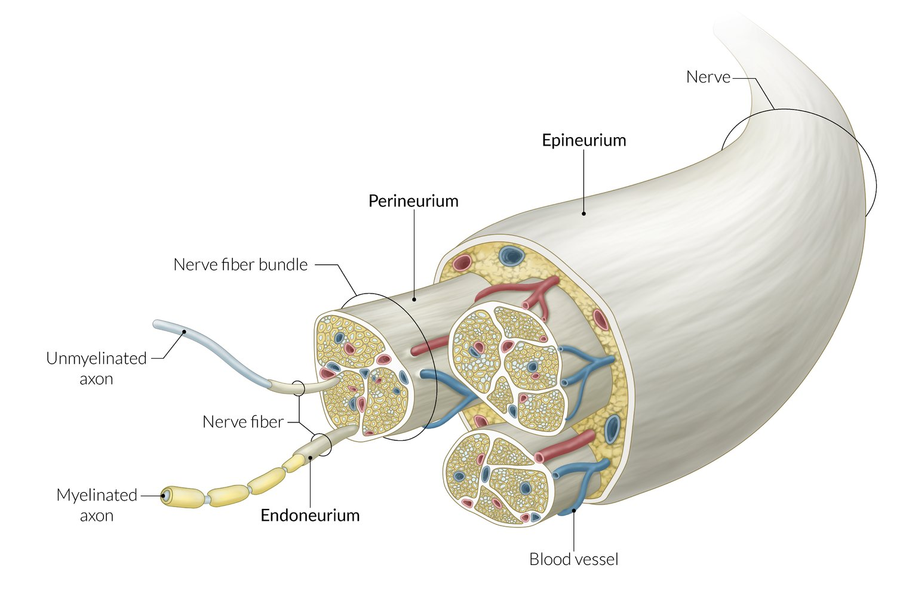

Cross-section of a peripheral nerve

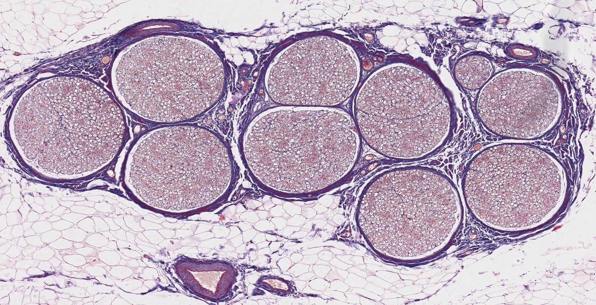

Transverse section of a nerve

---

## Classification of nerve fibers

Nerve fibers are classified based on their conduction <u>velocity</u>, diameter, and <u>axon</u> characteristics.

| Classification of nerve fibers |  |  |  |  |
| --- | --- | --- | --- | --- |
| Nerve fibers | Myelinated | Characteristics | Conduction <u>velocity</u> | Size |
| A-alpha fibers |  * Yes   |   * Afferent: <u>muscle spindles</u>  * Efferent: <u>alpha motor neurons</u>    |  * 60–120 m/s   |  * 15 μm   |
| A-beta fibers |  * Afferent: cutaneous <u>mechanoreceptors</u>   |  * 30–60 m/s   |  * 8 μm   |  |
| A-gamma fibers |  * Efferent: <u>muscle spindles</u> (<u>gamma motor neurons</u>)   |  * 2–30 m/s   |  * 5 μm   |  |
| A-delta fibers |  * Afferent: <u>pain</u> (e.g., thermal, mechanical )  * <u>Free nerve endings</u>  * Responsible for the withdrawal response to <u>pain</u> (e.g., rapidly moving the hand when burned)   |  * 3 μm   |  |  |
| B fibers |  * Moderately   |  * Efferent: <u>preganglionic</u> <u>sympathetic</u> fibers   |  * 3–15 m/s   |  * < 3 μm   |
| C fibers |  * No (lack of <u>myelin</u> creates the slow conduction as the <u>saltatory conduction</u> is not present)   |  * Afferent: <u>pain</u> (e.g., chemical, thermal, mechanical)   |  * 0.25–1.5 m/s   |  * 1 μm   |

> [!NOTE]
> <u>C fibers</u> have a slow conduction <u>velocity</u> due to their small diameter and lack of myelination.

---

## Neurotransmitters

### <u>Neurotransmitters</u>

<u>Neurotransmitters</u> are <u>endogenous</u> substances that allow communication between <u>neurons</u> and, usually, induce a change in the <u>target cell</u>. There are two types of <u>neurotransmitters</u>:

* Conventional <u>neurotransmitters</u>: molecules that follow conventional <u>synaptic transmission</u> (see <u>chemical synapse</u> below)

* Small molecule <u>neurotransmitters</u>: <u>GABA</u>, <u>dopamine</u>, <u>norepinephrine</u>, <u>epinephrine</u>, <u>serotonin</u>, <u>histamine</u>, <u>ATP</u>, <u>glutamate</u>, <u>aspartate</u>, <u>adenosine</u>, and <u>acetylcholine</u>

* Neuropeptides: <u>endorphins</u>, <u>enkephalins</u>, <u>substance P</u>, and <u>neuropeptide Y</u>

* Unconventional <u>neurotransmitters</u>: molecules that are not stored in <u>synaptic</u> <u>vesicles</u>, may carry messages from the postsynaptic to the presynaptic <u>neuron</u> and can cross <u>the cell</u> membrane, acting directly on molecules inside the cells.

* <u>Endocannabinoids</u>

* Gasotransmitters: <u>nitric oxide</u> and <u>carbon monoxide</u>

| Overview of <u>neurotransmitters</u> |  |  |
| --- | --- | --- |
| <u>Neurotransmitter</u> | Site of action | Characteristics |
| Acetylcholine |   * <u>Preganglionic</u> <u>sympathetic</u> <u>synapses</u>  * <u>Neuromuscular junction</u>  * <u>Parasympathetic</u> <u>synapses</u>    |   * Usually excitatory  * Synthesized from choline and <u>acetyl coenzyme A</u>.  * Two <u>receptors</u>  * Nicotinic <u>AChR</u>  * Muscarinic <u>AChR</u>    |
| <u>Aspartate</u> |  * <u>CNS</u>   |  * Excitatory   |
| <u>Dopamine</u> |   * <u>CNS</u>  * Local chemical messenger in other organ systems (e.g., increases <u>natriuresis</u> in the <u>kidney</u>)    |   * Both excitatory and inhibitory  * Involved in initiation of movement  * Inhibits the secretion of <u>prolactin</u> by the <u>anterior pituitary</u> upon release by the <u>hypothalamus</u>    |
| Endorphins |  * <u>CNS</u>   |   * <u>Endogenous opioids</u> produced by the <u>CNS</u> and <u>pituitary gland</u>  * Inhibit <u>pain</u>    |
| Enkephalins |  * Inhibit <u>pain</u>   |  |
| GABA |   * Inhibitory  * Is mainly synthesized from <u>glutamate</u> via the enzyme glutamate decarboxylase    |  |
| Glutamate |   * Two types  * Ionotropic glutamate receptors (<u>iGluR</u>)  * Excitatory <u>glutamate</u>-gated ion channels  * Three subtypes:  * <u>N-methyl-D-aspartate receptor</u> (<u>NMDA-R</u>)  * <u>Quisqualate receptor</u> (<u>AMPA-R</u>)  * Kainate <u>receptors</u>  * Metabotropic glutamate receptors (mGluR): excitatory or inhibitory <u>G-protein</u> coupled <u>receptors</u>  * Involved in <u>long-term potentiation</u> (e.g., <u>learning</u>, addiction) and neuronal <u>excitotoxicity</u>    |  |
| Glycine |   * Spinal cord  * <u>Brainstem</u>  * <u>Retina</u>    |  * Inhibitory   |
| Norepinephrine |   * <u>Postganglionic</u> <u>sympathetic</u> <u>synapses</u>  * <u>CNS</u>    |  * <u>Neurotransmitter</u> and <u>hormone</u>   |
| <u>Epinephrine</u> |  * <u>CNS</u>   |  |
| Serotonin |  * <u>CNS</u>   |   * Involved in <u>sleep</u>, mood, and <u>pain</u> inhibition  * Inhibitory    |

### Neurotransmitter receptors (<u>neuroreceptors</u>)

* Definition: a <u>membrane receptor</u> protein that is activated by a <u>neurotransmitter</u>

* Characteristics

* Membrane-bound, activated by the binding of <u>neurotransmitters</u>

* Found on presynaptic and postsynaptic neuronal membranes

* Open or close ion channels, producing electrical signals

* Excitatory and inhibitory responses are determined by the class of ion channel and by the concentration of permeant ions inside and outside <u>the cell</u>.

* Types of <u>receptors</u>

* <u>Ionotropic receptors</u> (<u>ligand-gated ion channels</u>): form channels through which ions, e.g., Na+ and <u>Ca2+</u>, flow

* <u>Metabotropic ion receptors</u> (<u>G-protein</u> coupled <u>receptors</u>): are coupled to intracellular <u>G proteins</u> that are activated upon binding to a <u>ligand</u>

* Other: presynaptic <u>receptors</u> (autoreceptors)

* Respond to the transmitter released by the same <u>neuron</u>

* Regulate <u>neurotransmitter release</u>, synthesis, or impulse flow

* Considered a <u>homeostatic</u> feedback mechanism

|  Overview of <u>neurotransmitter receptors</u> [[6]](https://coursology-qbank.com/amboss/article/gwcFRe0) |  |  |
| --- | --- | --- |
|  | Ionotropic receptors | Metabotropic receptors |
| Characteristics |   * <u>Allosteric</u> binding site  * The <u>receptor</u> molecule is also an ion channel (channel-linked).    |   * <u>Signal transduction</u> mechanisms, usually <u>G-proteins</u>, to activate intracellular events using a <u>second messenger</u>  * The <u>receptor</u> and ion channel are separate molecules.    |
| <u>Receptor</u> opening time |  * Fast   |  * Slow   |
| Response |  * Short-lasting postsynaptic potentials (PSPs) or fast PSPs   |  * Long-lasting postsynaptic or slow PSPs   |
| Target effect location |  * Within the immediate region of the <u>receptor</u>   |  * Effects can be more widespread and persistent throughout <u>the cell</u>   |
| <u>Receptor</u> examples |   * Nicotinic <u>acetylcholine</u>  * GABAA  * <u>5-HT3 receptor</u>  * <u>Glycine</u>  * <u>Glutamate</u>    |   * <u>Glutamate</u>  * Muscarinic <u>acetylcholine</u>  * GABAB  * α and β <u>norepinephrine</u> and <u>epinephrine</u> <u>receptors</u>  * <u>Histamine</u>  * <u>Dopamine</u>  * Neuropeptides    |

#### Ion channels [[6]](https://coursology-qbank.com/amboss/article/gwcFRe0)

* Definition: <u>transmembrane proteins</u> with a narrow pore that selectively permits particular ions to permeate the membrane

* Functions

* Give rise to selective ion permeability changes

* Detect the electrical potential across the membrane

* Involved in changing of local transmembrane potentials

* Types of channels

* Voltage-gated ion channels: selectively permeable to the major physiological ions (<u>K+</u>, Na+, <u>Ca2+</u>, <u>Cl-</u>), responding to changes in membrane potential (e.g., <u>depolarization</u>, <u>hyperpolarization</u>); e.g., Na+and <u>Ca2+</u> channels

* <u>Ligand-gated ion channels</u>: cell-surface ion channels that increase ion flux in response to <u>ligand</u> or drug binding to, e.g., <u>G-protein</u>-gated <u>neurotransmitter receptors</u>

* Mechanically-gated ion channels: transmembrane ion channels that are activated by changes in the structure of the membrane and allow the passage of ions when open. <u>Mechanically-gated ion channels</u> are generally specific to one of the major physiological ions (<u>K+</u>, Na+, <u>Ca2+</u>, <u>Cl-</u>).

### Clinical significance of neurotransmitter changes

| Overview of the <u>clinical significance of neurotransmitter changes</u> |  |  |  |
| --- | --- | --- | --- |
| <u>Neurotransmitter</u> | Site of action | Associated conditions |  |
| Increased levels | Decreased levels |  |  |
| <u>Acetylcholine</u> |   * Basal nucleus of Meynert (forebrain)  * <u>Neuromuscular junction</u>    |  * <u>Parkinson disease</u>   |   * <u>Alzheimer disease</u>  * <u>Huntington disease</u>    |
| <u>Dopamine</u> |   * <u>Substantia nigra</u>, mainly pars compacta (<u>midbrain</u>)  * <u>Ventral</u> tegmental area (<u>midbrain</u>)    |   * <u>Schizophrenia</u>  * <u>Huntington disease</u>    |   * <u>Depression</u>  * <u>Parkinson disease</u>    |
| <u>Norepinephrine</u> |  * <u>Locus coeruleus</u> (<u>pons</u>)   |  * <u>Anxiety</u>   |  * <u>Depression</u>   |
| <u>Serotonin</u> |  * <u>Raphe nucleus</u> (medulla, <u>pons</u>)   |  * <u>Serotonin syndrome</u>   |   * <u>Anxiety</u>  * <u>Depression</u>: some <u>antidepressants</u> act by increasing <u>synaptic</u> <u>serotonin</u> by selectively inhibiting <u>serotonin</u> reuptake (<u>SSRIs</u>; e.g., <u>escitalopram</u>)  * <u>Parkinson disease</u> [[7]](https://coursology-qbank.com/amboss/article/8kYOp6)    |
| <u>GABA</u> |  * <u>Nucleus accumbens</u> (<u>basal ganglia</u>)   |  * N/A   |   * <u>Anxiety</u>  * <u>Huntington disease</u>    |

---

## Synapses

### Definitions

* Synapses: the junction across which signals or <u>action potentials</u> are transmitted from a presynaptic to a postsynaptic structure (e.g., <u>neurons</u>, muscle).

* Synaptic transmission: the process of communication between two <u>neurons</u>, involving the release of a <u>neurotransmitter</u> by the presynaptic <u>neuron</u> and the <u>neurotransmitter</u> binding to <u>receptors</u> on the postsynaptic membrane

* Fast neurotransmission: direct activation of a <u>ligand-gated ion channel</u> by a <u>neurotransmitter</u>

* Neuromodulation: occurs when a <u>neurotransmitter</u> binds to a <u>G-protein</u>-bound <u>receptor</u> and activates a chemical <u>signaling cascade</u>

### General

* There are two types of <u>synapses</u>: chemical and electrical

* <u>Synapses</u> can further be classified according to the structures between which they signal:

* Axodendritic <u>synapses</u>: signal between <u>axons</u> and <u>dendrites</u>

* Axoaxonic <u>synapses</u>: signal between <u>axons</u>

* Axosomatic <u>synapses</u>: signal between <u>axons</u> and <u>the cell</u> body of <u>neurons</u>

* Dendrodendritic <u>synapses</u>: signal between <u>dendrites</u>

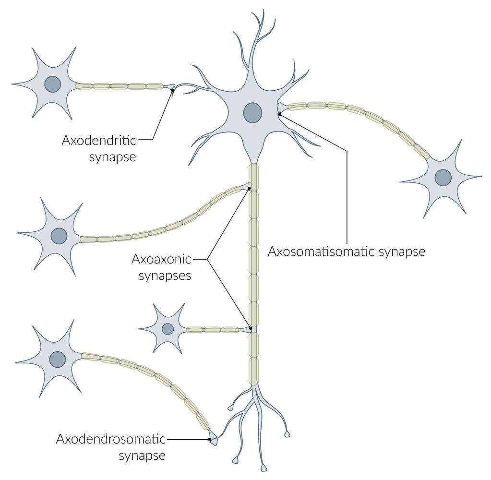

Types of synapses

### Chemical synapses

A type of <u>synapse</u> that transmits signals between <u>neurons</u> separated by a cleft via a chemical <u>neurotransmitter</u>

#### Overview

* Composed of a presynaptic membrane, a synaptic cleft (the space between a presynaptic and postsynaptic <u>neuron</u>), and postsynaptic membrane

* Most <u>neurotransmitters</u> (e.g., <u>GABA</u>, <u>glutamate</u>, <u>glycine</u>) undergo the following steps: synthesis, storage, release, reuptake, and degradation

#### Mechanism (presynaptic and postsynaptic receptor interactions)

1. * Neurotransmitter synthesis 

* Occurs in the presynaptic <u>neuron</u>

* A precursor <u>amino acid</u> accumulates into the <u>neuron</u>.

* The precursor is metabolized sequentially and yields a mature transmitter.
2. * Neurotransmitter storage

* <u>Vesicles</u> filled with <u>neurotransmitters</u> are stored in the presynaptic terminal and to be released in response to stimulation of the <u>neuron</u>

* Synaptophysin is a major <u>synaptic</u> <u>vesicle</u> protein that is thought to play a role in <u>synaptic</u> <u>vesicle</u> formation and maintenance [[8]](https://coursology-qbank.com/amboss/article/0_Ye57)

* Expressed throughout the <u>brain</u>

* Used as a marker for neuronal cells as well as <u>neuroendocrine tumors</u>
3. * Neurotransmitter release

* <u>Action potentials</u> in the presynaptic cell trigger the opening of <u>voltage</u>-gated <u>Ca2+</u> channels in the presynaptic membrane, permitting <u>Ca2+</u> influx.

* <u>Ca2+</u> binds to synaptotagmin (a protein anchored in the <u>vesicle</u> membrane), which initiates the <u>vesicle</u> docking to the presynaptic membrane and formation of <u>SNARE complex</u>. [[9]](https://coursology-qbank.com/amboss/article/59YiLr)

* SNARE complex  

* Stands for Soluble NSF Attachment protein REceptor complex

* Consists of several <u>SNARE proteins</u>, which are attached to either:

* The <u>vesicle</u> membrane (v-<u>SNARE</u> <u>proteins</u>; e.g., synaptobrevin)

* The presynaptic target membrane (t-<u>SNARE</u> <u>proteins</u>;  e.g., syntaxin 1, SNAP 25 )

* v-<u>SNARE</u> and t-<u>SNARE</u> <u>proteins</u> combine at the presynaptic membrane to form the <u>SNARE complex</u>.

* During <u>SNARE complex</u> formation, the <u>vesicle</u> membrane and the presynaptic membrane merge, causing <u>neurotransmitters</u> to be released into the <u>synaptic cleft</u>.
4. * Neurotransmitter binding and recognition by target <u>receptors</u>

* <u>Neurotransmitters</u> act on <u>receptors</u> on the postsynaptic membrane, resulting in the influx of ions into the postsynaptic cell.

* An <u>action potential</u> is created on the postsynaptic cell, completing the passage of the <u>neurotransmitter</u> from the presynaptic to the postsynaptic cell.
5. * Termination of the action of the released transmitter
* <u>Neurotransmitter</u> actions may be terminated by the following three interlinked processes. 

* Neurotransmitter reuptake: an active termination process triggered by specific transporter <u>proteins</u> on the presynaptic <u>neuron</u> or on <u>glial cells</u> where the <u>neurotransmitter</u> is stored

* Neurotransmitter enzymatic degradation: a termination process triggered by enzymes in the <u>synaptic cleft</u> (e.g., <u>acetylcholinesterase</u>) yielding an inactive substance

* Neurotransmitter diffusion: a dispersal of the <u>neurotransmitter</u> out of the <u>synaptic cleft</u>
6. * Postsynaptic potentials (PSPs)

* The postsynaptic response depends on the type of channel coupled to the <u>receptor</u>, and on the concentration of permeant ions inside and outside <u>the cell</u>.

* Excitatory postsynaptic potential (<u>EPSP</u>)

* A depolarizing potential that develops in a postsynaptic membrane as the result of increased influx of <u>cations</u> into the postsynaptic cell

* The summation of multiple <u>excitatory postsynaptic potentials</u> can cause the postsynaptic <u>neuron</u> to reach the threshold for the generation of an <u>action potential</u>.

* Examples include: <u>neuromuscular junction</u>, nicotinic <u>synapses</u> (e.g., autonomic <u>ganglia</u>), <u>NMDA</u> <u>synapses</u> (e.g., <u>glutamate</u> and <u>aspartate</u> <u>neurotransmitters</u>)

* Inhibitory postsynaptic potential (<u>IPSP</u>) [[10]](https://coursology-qbank.com/amboss/article/4Cc3He0)

* A temporary hyperpolarizing or depolarizing potential that develops in a postsynaptic membrane as the result of increased influx of <u>anions</u> into the postsynaptic cell.

* Inhibitory postsynaptic potentials cause the postsynaptic <u>neuron</u> to move away from the threshold, decreasing firing and propagation of <u>action potentials</u>.

* Examples include: GABAnergic <u>synapses</u>, <u>glycine</u> <u>synapses</u> (e.g., occur in the <u>Renshaw cells</u> of the spinal cord)

> [!NOTE]
> Certain proteolytic enzymes, e.g., <u>tetanus</u> toxin and <u>botulinum toxin</u>, can cleave <u>SNARE proteins</u>, thereby inhibiting <u>neurotransmitter release</u> into the <u>synaptic cleft</u> and, thus, causing spasms and <u>paralysis</u>.

#### Neuromuscular junction (NMJ)

* Definition: a type of <u>chemical synapse</u> that occurs between <u>alpha motor neurons</u> and <u>skeletal muscle</u>

* Motor unit: an <u>alpha motor neuron</u> together with the group of muscle fibers it innervates

* Presynaptic <u>neuron</u>: <u>action potential</u> → <u>depolarization</u> of the presynaptic membrane → opening of <u>voltage</u>-gated <u>Ca2+</u> channels → influx of <u>Ca2+</u> into the presynaptic terminal → <u>SNARE complex</u>-mediated fusion of <u>vesicles</u> with the presynaptic membrane → release of <u>acetylcholine</u> (<u>ACh</u>) from <u>vesicles</u> into the <u>synaptic cleft</u>

* Muscle fiber: binding of <u>ACh</u> to its <u>receptor</u> on the postsynaptic membrane of muscle (motor end plate) →:  <u>depolarization</u> of the postsynaptic membrane → end-plate potential (EPP) → stimulation of <u>voltage</u>-sensitive <u>dihydropyridine receptors</u> (<u>DHPR</u>) → coupling with <u>ryanodine receptors</u> (RR) → release of <u>Ca2+</u> from the <u>sarcoplasmic reticulum</u> (SR) → <u>tropomyosin</u> releases the <u>myosin</u>-binding site on <u>actin</u> → binding of <u>myosin</u> and <u>actin</u> → muscle contraction

* <u>Synaptic cleft</u>: <u>acetylcholinesterase</u> (<u>AChE</u>) breaks down <u>ACh</u> → acetate and choline → reuptake of choline into the presynaptic membrane → resynthesis of <u>ACh</u>

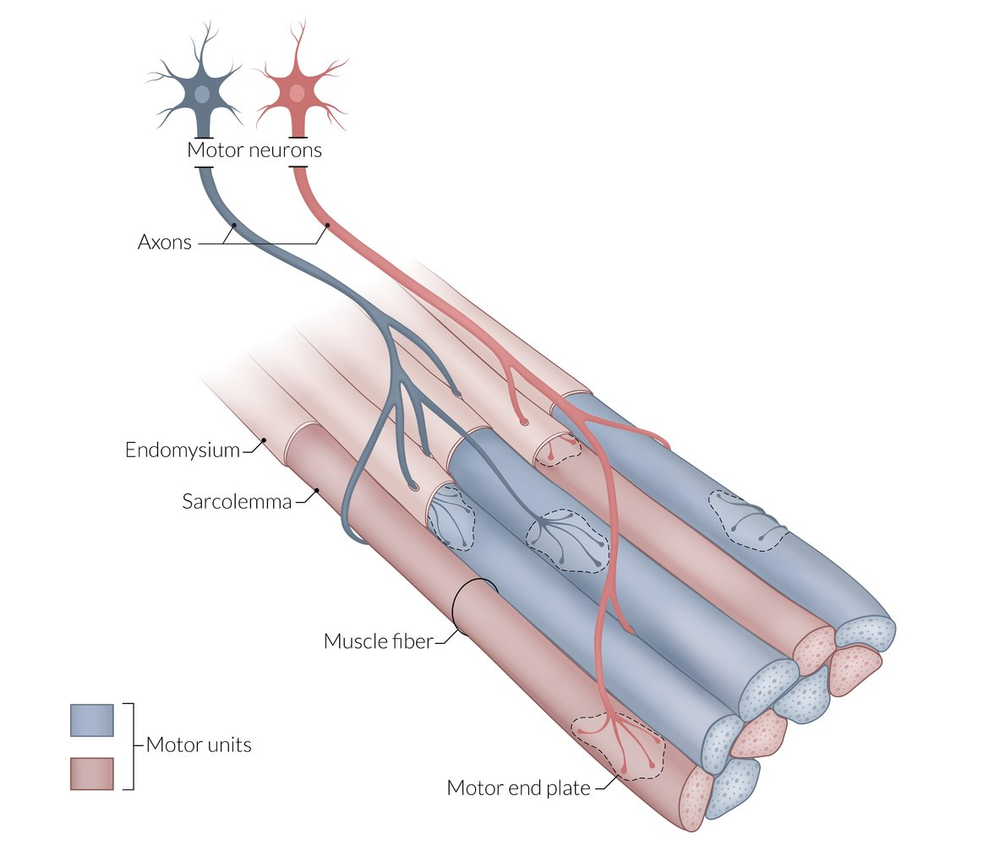

Motor unit

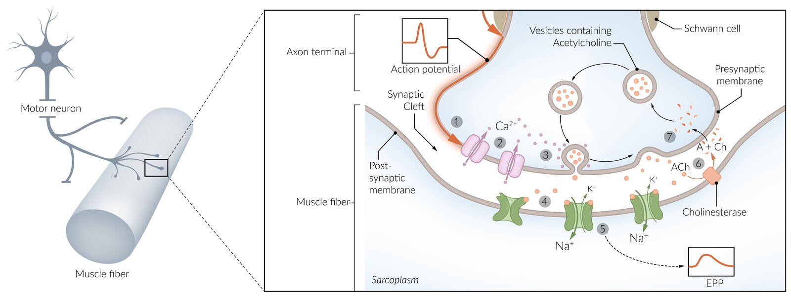

Signal transduction at the motor end plate

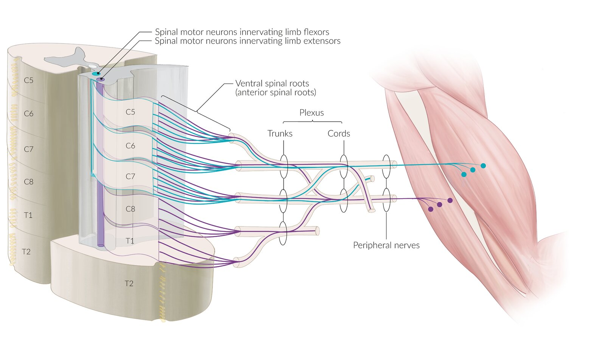

Motor neuron columns in the spinal cord and plexus formation

### Electrical synapses

* A type of <u>synapse</u> that transmits signals between <u>neurons</u> joined by a <u>gap junction</u> by the flow of electrical current (i.e., movement of ions).

* Unlike <u>chemical synapses</u>, which require the transmission of a <u>neurotransmitter</u> across a cleft, <u>electrical synapses</u> transmit the signal directly and without delay.

* Found in the <u>heart</u> and <u>smooth muscle</u>

* Allows bidirectional flow of information between cells

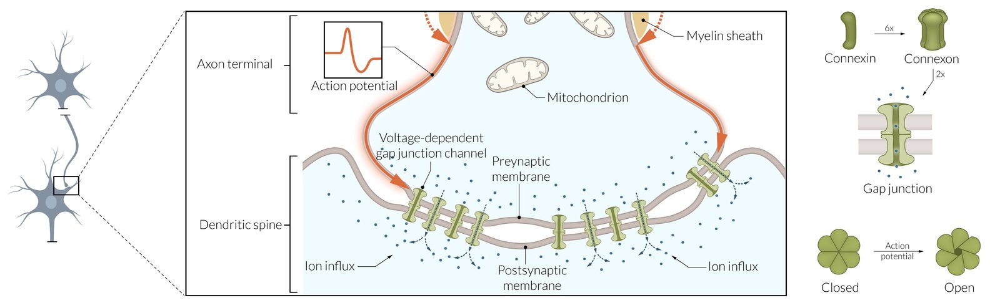

Electrical synapse

---

## Neurotrophic factors (NTFs)

* Definition: substances that enhance neuronal survival and differentiation

* Overview [[6]](https://coursology-qbank.com/amboss/article/gwcFRe0)[[11]](https://coursology-qbank.com/amboss/article/Rwclie0)[[12]](https://coursology-qbank.com/amboss/article/3taSWm)

* <u>Neurons</u> compete for survival-promoting agents during their development

* <u>NTFs</u> ensure a match between the requirement for appropriate target innervation and the number of surviving <u>neurons</u>

* Functions include regulation of nervous system development (e.g., cell <u>proliferation</u>, migration, differentiation, dendritic and axonal growth, synaptogenesis, <u>synaptic plasticity</u>), of regressive events (e.g., <u>cell death</u> or survival, <u>axon</u> and <u>synapse</u> elimination) after injury, and of <u>synaptic</u> competition and by modifying both <u>synaptic transmission</u> and structure

|  Overview of <u>NTFs</u> (trophic and growth factors) [[6]](https://coursology-qbank.com/amboss/article/gwcFRe0)[[12]](https://coursology-qbank.com/amboss/article/3taSWm)  |  |  |
| --- | --- | --- |
| Family | Examples | Functions |
| Neurotrophins |  * Nerve growth factor; <u>brain</u>-derived <u>neurotrophic factor</u>; neurotrophin 3, 4, and 5   |   * Neuronal survival and differentiation  * Involved in <u>synaptic plasticity</u> changes related to <u>learning and memory</u>    |
| Neuropoietic <u>cytokines</u> and <u>interleukins</u> |   * Ciliary <u>neurotrophic factor</u>, <u>leukemia</u> inhibitory factor, cardiotrophin like <u>cytokine</u>/<u>cytokine</u>-like factor  * IL-1α, IL-1β, <u>IL-2</u> – IL-15    |   * Motor <u>neuron</u> survival  * Immunoregulation    |
| Tissue growth factors |  * <u>TGF-α</u>, <u>TGF-β</u>, FGFs, <u>IGF</u>-Iα, <u>IGF</u>-Iβ, <u>IGF</u>-II, <u>EGF</u>, <u>PDGF</u>   |   * Cell <u>proliferation</u> and differentiation in diverse tissues and organs  * Effects on <u>enteric</u>, <u>dopaminergic</u>, and motor <u>neurons</u>    |

---