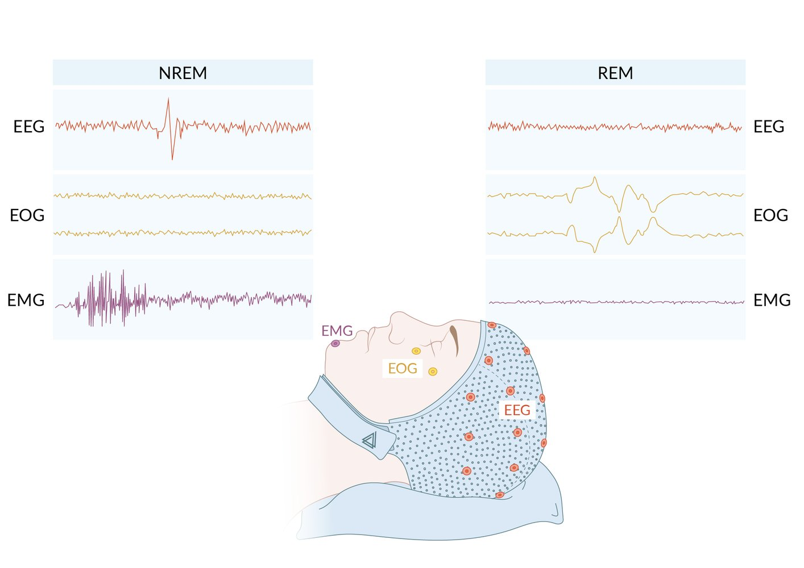
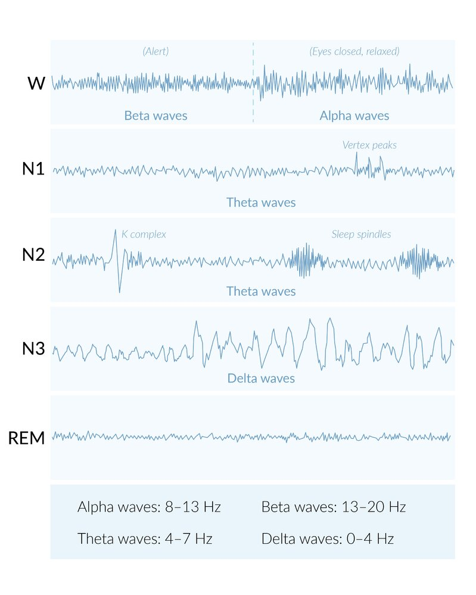
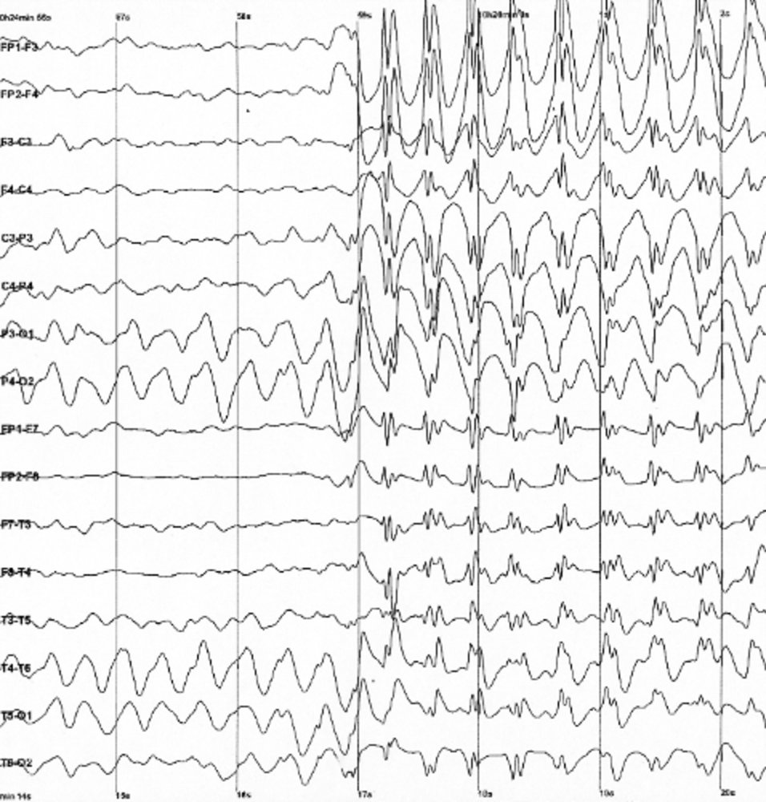
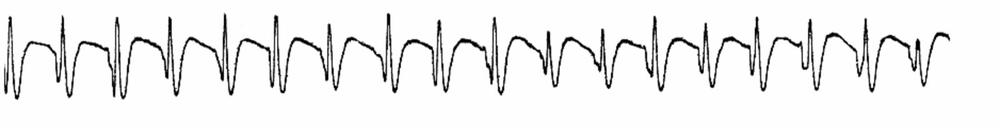
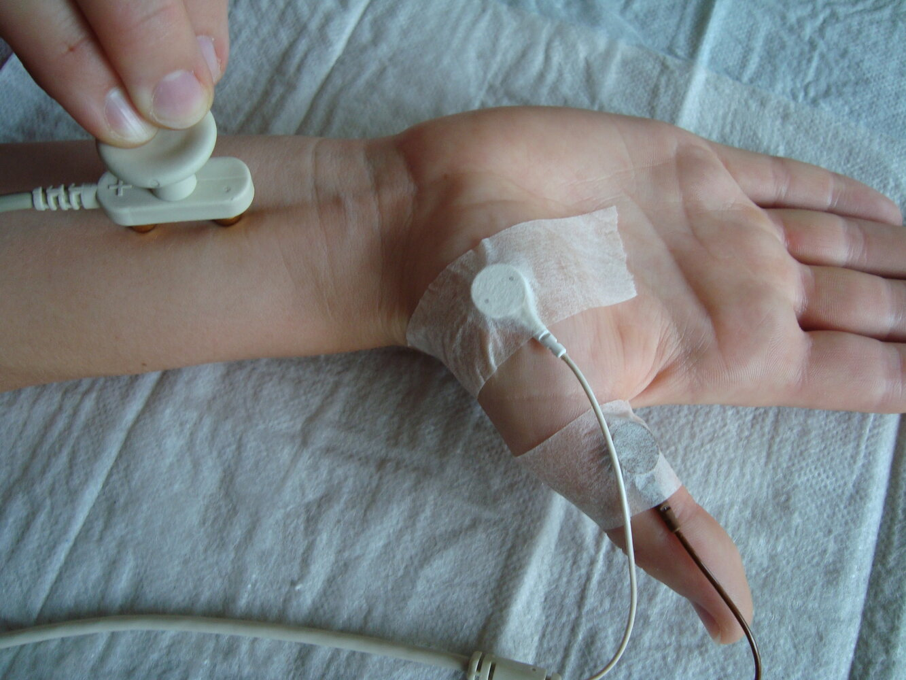
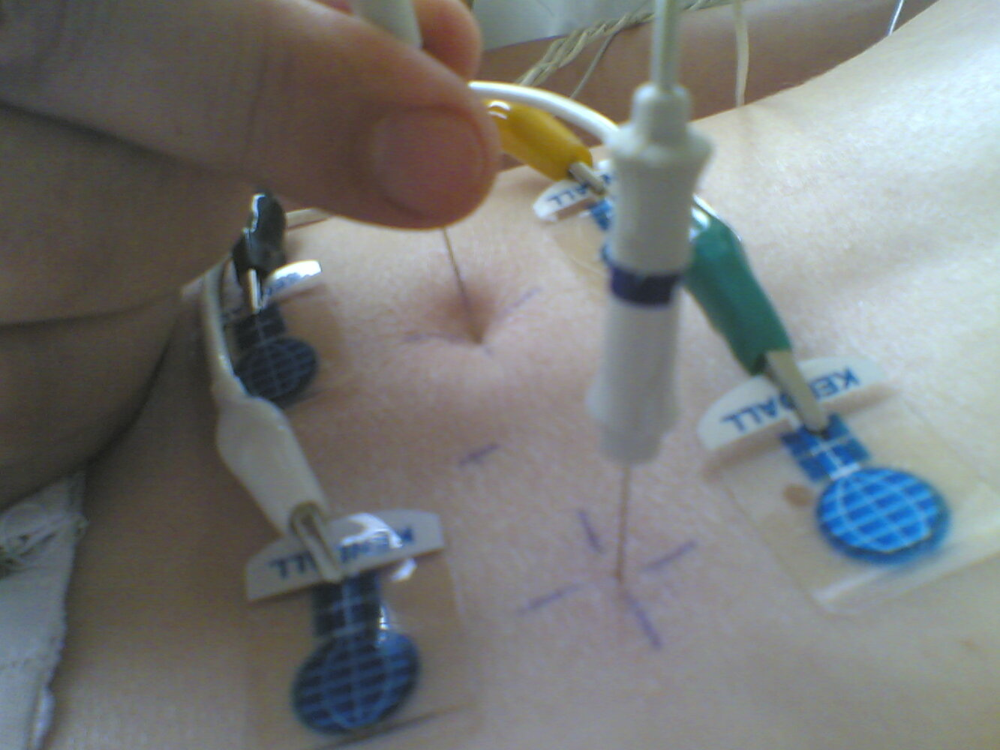

# Neurophysiological diagnostics

*Categories: Clinical knowledge > Neurology > Basics of neurology > Neurophysiological diagnostics*

[Original Article Link](https://coursology-qbank.com/amboss/article/Cn0qvg)

---

## Summary

Neurophysiological tests <u>complement</u> <u>neurological examination</u> and conventional imaging (e.g., CT, <u>MRI</u>) when assessing nerve, muscle, and/or <u>brain</u> function. The most commonly used neurophysiological test is <u>electroencephalography</u> (<u>EEG</u>) which measures fluctuation of <u>electric potential</u> at different regions of the cortex. <u>EEG</u> is often used to assess <u>epilepsy</u> and <u>sleep disorders</u>. <u>Evoked potentials</u> (EP) are microvolt fluctuations of the <u>CNS</u> in response to stimulation of sensory organs or a peripheral nerve. These fluctuations can be recorded by an <u>EEG</u> and may be used to detect <u>demyelination</u> of <u>white matter</u> (e.g., <u>multiple sclerosis</u>). <u>Nerve conduction studies</u> (<u>NCS</u>) assess the conduction of nerve impulses through <u>peripheral nerves</u> and are used to specify the type of nerve damage (<u>demyelination</u>, compression or transection of a nerve). <u>Electromyography</u> (<u>EMG</u>) measures the electrical activity of muscles at rest and during contraction. <u>EMG</u> is helpful in differentiating neuropathies from <u>myopathies</u>.

---

## Electroencephalography (EEG)

* Definition: a recording that shows the fluctuation of net electrical potential at different points on the <u>cerebral cortex</u>

* Principle: Every <u>neuron</u> generates an electrical potential irrespective of the degree of neuronal firing. <u>EEG</u> electrodes add up these electrical potentials at different points, which allows visualization of neuronal activity of different areas of the cortex. The entire <u>EEG</u> recording is then examined for physiological or pathological patterns of electrical activity.

* Procedure
1. * 6–19 electrodes are symmetrically placed on the scalp and the electrical activity is measured
2. * The potential difference between two electrodes is measured and represented as line tracing.

* Indications

* <u>Epilepsy</u> diagnostics: for first <u>seizures</u> with unclear cause, insufficient classification, or treatment-refractory <u>seizures</u> (see “<u>Epileptic syndromes</u>” and “<u>Seizure disorders</u>”)
* The absence of characteristic <u>epilepsy</u> findings cannot, however, rule out <u>epilepsy</u>.

* To determine the <u>level of consciousness</u> (bispectral index to determine the depth of anesthesia; diagnosis of <u>brain death</u>)

* As a part of <u>polysomnography</u> (to identify the different <u>phases of sleep</u>)

* Interpretation: The following steps should be followed when interpreting an <u>EEG</u>:
1. * Define the background electrical activity of the <u>brain</u>. This baseline <u>EEG</u> serves as a control.
2. * Look for physiological or pathological patterns of electrical activity (see “<u>EEG patterns</u>”).
3. * Localize the pathology by identifying the <u>EEG</u> tracing associated with abnormal electrical activity.

| Physiological EEG waveforms |  |  |
| --- | --- | --- |
| Wave type | Frequency | Stage of onset |
| Alpha waves | 8–12 Hz |   * Awake but eyes are closed  * Berger effect: a physiological phenomenon in which <u>alpha wave</u> activity decreases when a person opens his/her eyes or concentrates (transition into <u>beta waves</u>)    |
| Beta waves | 13–30 Hz |   * Awake and attentive with open eyes  * <u>REM sleep</u>    |
| Gamma waves | > 30 Hz |  * Wide-awake and concentrating   |
| Delta waves (EEG) | 0.1–4 Hz |  * Stage IV of NREM <u>sleep</u>   |
| Theta waves | 4–8 Hz |  * Stage I and II of <u>NREM sleep</u>   |

NREM and REM

Stages of sleep in adults (EEG)

### EEG patterns

| Physiological <u>EEG patterns</u> |  |  |
| --- | --- | --- |
| Patterns | Characteristics | Occurrence |
| Vertex waves (V waves) |   * Rapidly-rising, triphasic, positive, low-amplitude waveforms  * Mostly bilateral and symmetric; best seen at the vertex    |  * Stage 1 of <u>REM sleep</u>   |
| Sleep spindles |  * Pattern of low-amplitude waves that occur in rapid succession with a frequency of approximately 13 Hz   |  * Stages 2–4 of <u>NREM sleep</u>   |
| K complex |  * Large-amplitude, biphasic waves that are followed by <u>sleep spindles</u>   |  * Stages 2–4 of <u>NREM sleep</u>   |
| POSTS (<u>positive occipital sharp transients of sleep</u>) |  * Sharp, occipital, positive waves (may be isolated or grouped together with a frequency of 4–5 Hz)   |  * Tired state and during stage 2 of <u>NREM sleep</u>   |

| Pathological <u>EEG patterns</u> |  |  |  |
| --- | --- | --- | --- |
| Patterns | Characteristics |  | Occurrence |
| Slow activity |  * Background (baseline) activity with a frequency of < 8 Hz in an awake adult.   |  |  * A nonspecific sign of disturbed <u>brain</u> function   |
| Paroxysmal discharge |  * A general term used to describe any pattern of electrical activity which begins suddenly and stands out from the background electrical activity of the <u>brain</u> (e.g., spikes, <u>sharp waves</u>, etc.)   |  |  * An epileptiform discharge   |
| Sharp wave |  * Rapidly rising wave between 70 and 200 ms   |  |  * An <u>interictal</u> epileptiform discharge   |
| Spike (EEG) |  * A steeply sloped peak < 70 ms   |  |  * An <u>interictal</u> epileptiform discharge   |
| Spike-and-wave activity |  * A spike followed by a slow wave   |  * Frequency of 3/s   |   * <u>Absence seizures</u>  * <u>Myoclonic</u> twitches    |
|  * Frequency < 3/s (slow <u>spike-and-wave</u> complex)   |  * Lennox-Gastaut syndrome   |  |  |
| Polyspike and <u>polyspike</u>-wave complex |   * A pattern of waves and many spikes in rapid succession (= <u>polyspikes</u>)  * Referred to as a <u>polyspike</u>-wave complex if followed by slow waves    |  |   * Genetic generalized <u>epilepsy</u>  * <u>Juvenile myoclonic epilepsy</u> (<u>Janz syndrome</u>)  * <u>Progressive myoclonic epilepsies</u>  * <u>Absence seizures</u>    |
| Periodic sharp wave complex |  * Waveform with a frequency of 1–2 Hz   |  |  * Early stages of sporadic <u>Creutzfeldt-Jakob disease</u>   |
| Hypsarrhythmia |  * Generalized, irregular, slow waveforms interspersed with multifocal polymorphic spikes   |  |  * <u>West syndrome</u> (<u>infantile spasms</u>)   |

EEG with a frequency of 3/s spike waves in a child with absence seizures

EEG findings in absence seizures

---

## Nerve conduction study (NCS)

A direct electrical stimulus is applied to a motor nerve (motor <u>nerve conduction study</u>) and/or sensory nerve (sensory <u>nerve conduction study</u>) via surface electrodes at two or more points, and various parameters related to compound <u>action potentials</u> (<u>CMAPs</u>) are measured.

Nerve conduction study

### Sensory <u>nerve conduction study</u>

* Definition: recording of a purely sensory portion of a nerve in response to electrical nerve stimulation

* Indication: to determine whether sensory symptoms arise <u>proximal</u> or <u>distal</u> to the <u>dorsal root ganglia</u>

### Motor <u>nerve conduction studies</u>

* Definition: Recording of a muscle's compound <u>action potentials</u> (<u>CMAP</u>) after stimulation of its innervating motor nerve.

* Measured parameters

* Nerve conduction velocity: ↓ <u>nerve conduction velocity</u> indicates nerve <u>demyelination</u> and/or nerve compression (e.g., <u>carpal tunnel syndrome</u> - <u>median nerve</u> compressed in <u>flexor retinaculum</u>)

* Amplitude of the <u>CMAPs</u>

* Indirectly represents the <u>area under the curve</u> of the <u>CMAP</u>, which represents the summation of all <u>axons</u> of the motor nerve that was stimulated.

* ↓ <u>CMAP</u> amplitude → <u>axonopathy</u> or <u>temporal dispersion</u> due to axonal injury

* Distal motor latency: time period from stimulation of the motor nerve to <u>action potential</u>

* F-wave latency: a second <u>action potential</u> generated by the <u>antidromic</u> (<u>proximal</u>) conduction of the nerve that was stimulated

---

## Electromyography (EMG)

* Definition: A diagnostic test that measures the activity of muscles in response to neural stimulation, in order to detect dysfunction at the level of the <u>neuromuscular junction</u>, the muscle, or the corresponding nerve.

* Indications

* Differentiate neuropathic from myopathic <u>muscle weakness</u>

* Neuropathy: e.g., <u>carpal tunnel syndrome</u>, <u>Guillain-Barré syndrome</u>

* <u>Myopathy</u>: e.g., <u>polymyositis</u>, <u>muscular dystrophy</u>

* Determine the prognosis after nerve damage

* Estimate the age of a nerve lesion

* Diagnose sub-clinical <u>myopathies</u>

* Localize neurological injury

* Motor <u>neurons</u> in the <u>brain</u> or spinal cord: e.g., <u>ALS</u>, <u>poliomyelitis</u>

* <u>Nerve root</u>: e.g., <u>herniated disk</u>

* <u>Peripheral nerves</u>: e.g., <u>carpal tunnel syndrome</u>, <u>Guillain-Barré syndrome</u>, other <u>polyneuropathies</u>

* <u>Neuromuscular junction</u>: e.g., <u>myasthenia gravis</u>, <u>Lambert-Eaton myasthenic syndrome</u>, <u>botulism</u>

* Muscle: e.g., <u>inflammatory myopathies</u>, <u>myotonic syndromes</u>, <u>muscular dystrophies</u>

* Procedure:
1. * Needle electrodes are inserted into a muscle.
2. * The electrical activity of the muscle is measured during rest (<u>tonic</u> activity) and during movements (phasic muscle activity).

* Interpretation

| EMG findings of neuropathy vs. myopathy |  |  |
| --- | --- | --- |
| Findings | Neuropathy | <u>Myopathy</u> |
| Electrical activity at rest | Increased activity with needle insertion and pathological spontaneous discharge with fibrillations and <u>fasciculations</u>  | Little or no spontaneous electrical activity |
|  <u>Motor unit potential</u>  |  Large-amplitude, polyphasic, and prolonged <u>motor unit potential</u>  |  Low-amplitude, polyphasic, and shortened <u>motor unit potentials</u>  |
|  Interference pattern  |  Reduced interference pattern: muscle discharges have a low frequency but a large amplitude   | Full interference pattern: muscle discharges have a high frequency but a small amplitude |

Needle (intramuscular) electromyography (EMG)

---