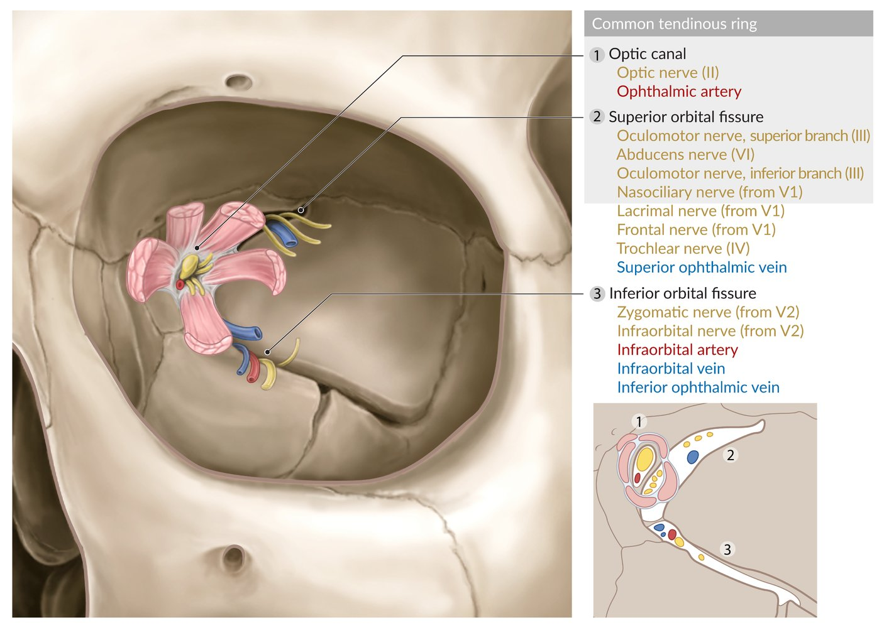
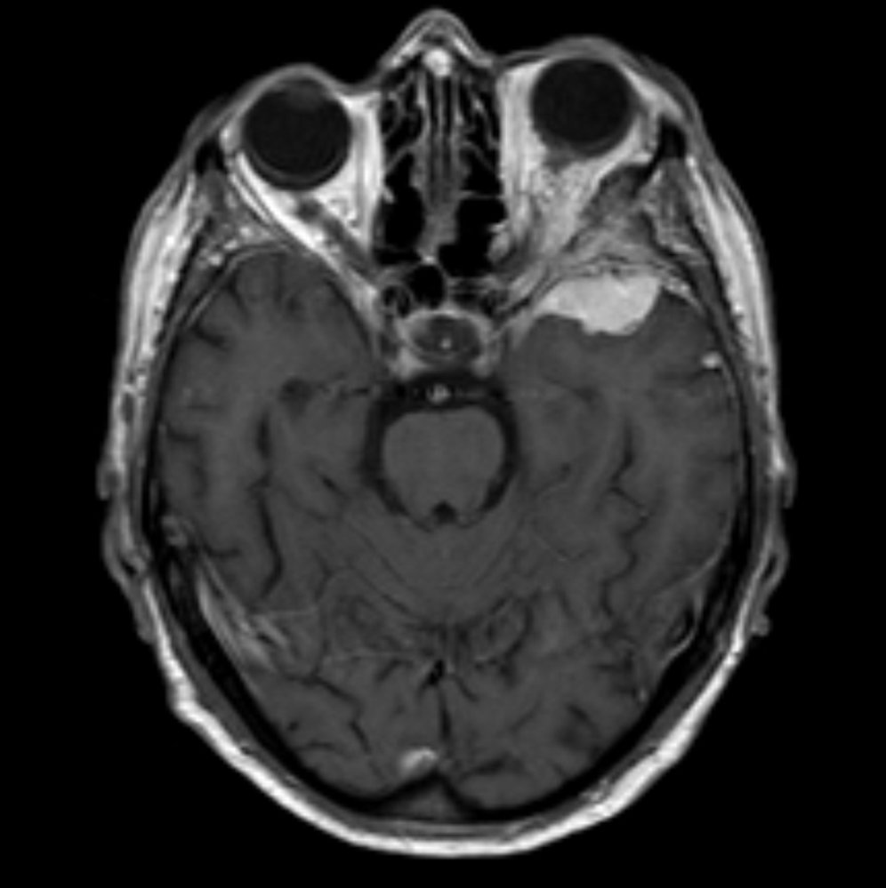
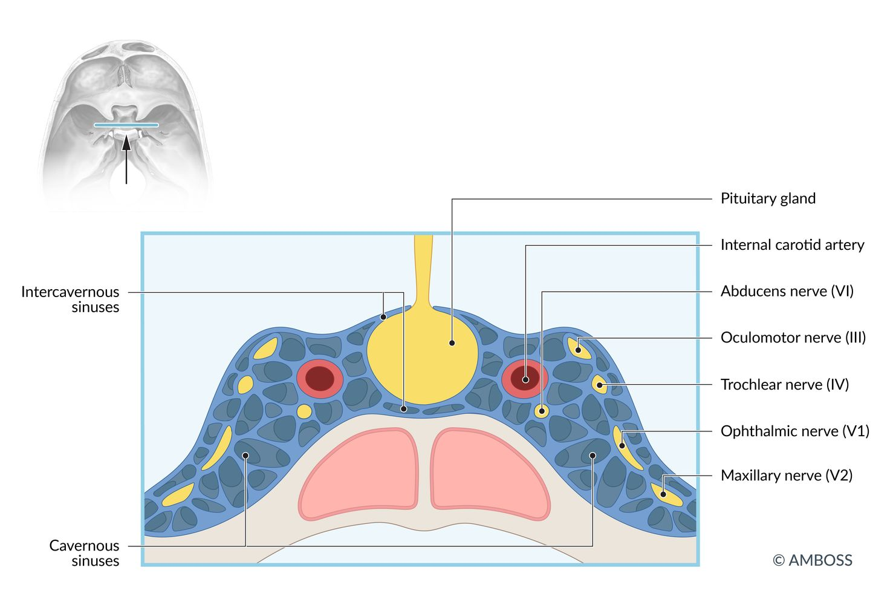
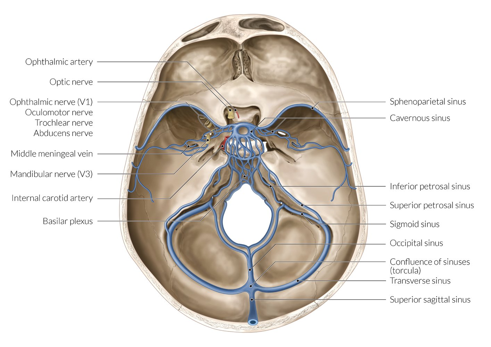
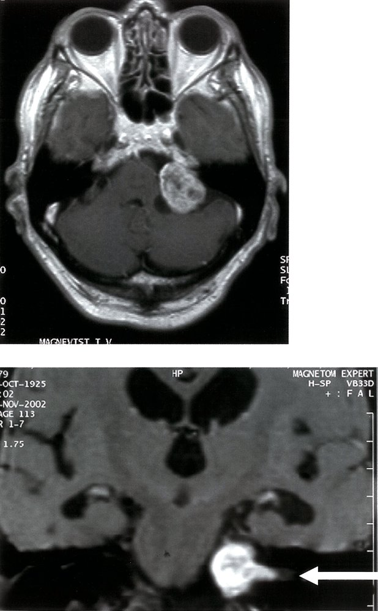

# Skull base syndromes

*Categories: Clinical knowledge > Neurology > Developmental disorders, malformations, and structural disorders > Skull base syndromes*

[Original Article Link](https://coursology-qbank.com/amboss/article/P50W4g)

---

## Summary

<u>Skull base</u> syndromes are caused by malignancies or inflammatory conditions that affect the <u>base of the skull</u> and the <u>cranial nerves</u> exiting the <u>skull</u>. The location of the pathology can often be determined by characteristic features produced by nerve damage and other localizing space-occupying effects (e.g., <u>pain</u>, <u>proptosis</u>). Syndromes primarily involving the <u>cranial nerves</u> are discussed in a separate article (see <u>cranial nerve disorders</u>).

---

## Superior orbital fissure syndrome

* Etiology: <u>sphenoid</u> wing <u>meningioma</u> and rarely, trauma

* Clinical features [[1]](https://coursology-qbank.com/amboss/article/fD0kdR)

* Upper <u>eyelid ptosis</u>

* <u>Proptosis</u> of the <u>eye</u>

* <u>Ophthalmoplegia</u>

* Dilated and <u>fixed pupil</u>

* Loss of sensation of the upper <u>eyelid</u> and forehead due to damage to the <u>trigeminal nerve</u> [[2]](https://coursology-qbank.com/amboss/article/gD0FdR)

Apertures of the bony orbit

Sphenoid wing meningioma

---

## Foster-Kennedy syndrome

* Etiology

* <u>Frontal lobe</u> tumors, typically parasellar or subfrontal <u>meningiomas</u>

* Olfactory groove meningioma; : <u>meningiomas</u> arising from the <u>cribriform</u> plate and frontosphenoidal suture (see <u>meningiomas</u>)

* Clinical features

* <u>Ipsilateral</u> <u>atrophy</u> of the <u>optic nerve</u>

* <u>Contralateral</u> <u>papilledema</u>

* <u>Anosmia</u>

---

## Cavernous sinus syndrome

* Etiology

* <u>Cavernous sinus thrombosis</u> (e.g., due to <u>sinusitis</u> and contiguous spread of infection)

* <u>Carotid-cavernous fistula</u>

* <u>Cavernous sinus</u> tumors

* <u>Pituitary tumors</u> producing <u>mass effect</u>

* Carotid <u>artery</u> <u>fistula</u> or <u>aneurysms</u>

* <u>Tolosa-Hunt syndrome</u> (<u>idiopathic</u> <u>granulomatous inflammation</u> of the <u>cavernous sinus</u>)

* Clinical features

* Swelling of the <u>conjunctiva</u>

* <u>Proptosis</u>

* Signs of <u>CN palsy</u> due to compression (<u>CN III</u>, IV, V-1, V-2, and VI pass through the <u>cavernous sinus</u>)

* <u>Painful ophthalmoplegia</u>: partial/complete <u>paresis</u> of <u>oculomotor nerve</u> (<u>CN III</u>), <u>trochlear nerve</u> (<u>CN IV</u>), and <u>abducens nerve</u> (<u>CN VI</u>)

* Absent <u>corneal reflex</u>: <u>paresis</u> of the <u>ophthalmic branch of the trigeminal nerve</u> (V1)

* Loss of upper facial and corneal sensation may occur due to damage to the <u>trigeminal</u> branches of V1 and V2 (see “<u>Cranial nerve disorders</u>“).

* <u>Horner syndrome</u>

Pituitary gland and cavernous sinuses

Base of the skull (important vessels and nerves)

---

## Cerebellopontine angle syndrome

* Etiology: : most commonly <u>vestibular schwannomas</u> (<u>acoustic neuroma</u>), although other <u>cerebellopontine angle</u> tumors may result in the same presentation

* Clinical features

* Unilateral <u>hearing loss</u>

* <u>Tinnitus</u>

* <u>Vertigo</u>

* <u>Headache</u>

* Loss of facial sensation

Acoustic neuroma

References:[[5]](https://coursology-qbank.com/amboss/article/cfYaOo)

---

## Gradenigo's syndrome

* Etiology: complication of <u>otitis media</u> and <u>mastoiditis</u> that spreads to the petrous apex of the <u>temporal bone</u>, can also be <u>tumor</u> growth in the same area

* Clinical features: typical triad

* <u>Lateral rectus palsy</u>

* Retro-orbital <u>pain</u>

* <u>Otorrhea</u> (<u>ear discharge</u>)

* Diagnostics: <u>MRI</u> to localize lesion, culture of <u>middle ear</u> effusion to determine <u>pathogen</u>

* Treatment: <u>Broad spectrum IV antibiotics</u> (eventually tailored to culture results); <u>surgery</u> for refractory or complicated cases despite medical therapy

---