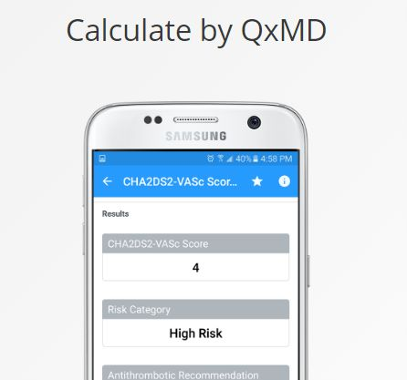

# Altered mental status and coma

*Categories: Clinical knowledge > Neurology > Disorders of consciousness > Altered mental status and coma*

[Original Article Link](https://coursology-qbank.com/amboss/article/7704Mh)

---

## Summary

<u>Altered mental status</u> (<u>AMS</u>) is an acute change in cognitive function, psychological function, and/or <u>level of consciousness</u> and can manifest with confusion, behavioral changes, and changes in alertness ranging from hyperalertness to <u>somnolence</u> or even <u>coma</u>. There are many potential <u>causes of altered mental status</u>, including primary <u>CNS</u> processes, general medical conditions, substance use, and psychiatric illness. Initial management includes stabilization (e.g., <u>definitive airway</u> management) and screening for life-threatening acutely reversible causes (e.g., <u>hypoglycemia</u>, <u>opioid overdose</u>). <u>Coma scores</u> are used to assess and monitor the level of neurological dysfunction. Once stabilized, a full diagnostic evaluation should be performed based on the suspected underlying etiology; this may include basic <u>laboratory studies</u>, <u>ECG</u>, head imaging, and <u>lumbar puncture</u>. Treatment is focused on the management of the underlying etiology in addition to providing <u>supportive care</u> and preventing complications.

---

## Coma scores

### General principles

* Use <u>coma scores</u> (e.g., <u>GCS</u>, <u>AVPU scale</u>, <u>FOUR score</u>) for a more objective and reproducible assessment.

* Document the score upon presentation.

* Frequently reassess to detect changes early.

### AVPU scale

An abbreviated scale that helps rapidly classify and communicate a patient's <u>level of consciousness</u> in emergency settings.  [[6]](https://coursology-qbank.com/amboss/article/b31HSg0)[[7]](https://coursology-qbank.com/amboss/article/X319Sg0)

* A: Alert

* V: responsive to Verbal stimuli

* P: responsive to Painful stimuli

* U: Unresponsive

### Glasgow coma scale (<u>GCS</u>)  [[8]](https://coursology-qbank.com/amboss/article/_dX5sC)

A standardized scale used to assess the <u>level of consciousness</u> and neurological status in multiple settings, e.g., <u>TBI classification</u>. <u>GCS</u> is less useful in intubated patients and does not provide a detailed assessment of <u>brainstem</u> function.

|  <u>Glasgow coma scale</u> (<u>GCS</u>) [[9]](https://coursology-qbank.com/amboss/article/M4bMPF)  |  |  |
| --- | --- | --- |
| Criteria | Response | Score |
| <u>Eye</u> opening (E) | Spontaneous | 4 |
| To verbal command | 3 |  |
| To <u>pain</u> | 2 |  |
| No response | 1 |  |
| Closed due to local factor (e.g., <u>ocular injury</u>) | Nontestable |  |
|  Verbal response (V)   | Oriented | 5 |
| Confused | 4 |  |
| Inappropriate words | 3 |  |
| Incomprehensible sounds | 2 |  |
| No response | 1 |  |
| Other factor(s) interfering with communication (e.g., <u>intubation</u>) | Nontestable |  |
| Best motor response (M) | Follows instructions | 6 |
|  Localizes <u>pain</u> stimulus   | 5 |  |
|  Withdraws from <u>pain</u> (normal <u>flexion</u> to <u>pain</u>) | 4 |  |
|  Decorticate posturing (abnormal <u>flexion</u> to <u>pain</u>) | 3 |  |
|  Decerebrate posturing (extension to <u>pain</u>) | 2 |  |
| No motor response | 1 |  |
| Preexisting factor(s) causing <u>paralysis</u>  | Nontestable |  |
|  Interpretation    * <u>GCS</u> 3 (minimum score): deeply <u>comatose</u> or imminent <u>brain death</u>  * <u>GCS</u> 15 (maximum score): fully conscious     |  |  |

Glasgow Coma Scale (GCS)

#### Modified Pediatric Glasgow Coma Scale (<u>pGCS</u>)

* For children < 2 years of age and nonverbal children, the <u>pGCS</u> is recommended. [[10]](https://coursology-qbank.com/amboss/article/AN1Rdh0)

* For older, verbal children, use the standard <u>GCS</u>.

|  <u>Modified pediatric Glasgow coma scale</u> (<u>pGCS</u>) [[10]](https://coursology-qbank.com/amboss/article/AN1Rdh0)[[11]](https://coursology-qbank.com/amboss/article/nzY7t7)  |  |  |
| --- | --- | --- |
| Criteria | Response | Score |
| <u>Eye</u> opening (E) | Spontaneous | 4 |
| To voice | 3 |  |
| To <u>pain</u>  | 2 |  |
| No response | 1 |  |
| Verbal response (V)  | Coos/babbles | 5 |
| Irritable or crying | 4 |  |
| Cries to <u>pain</u>  | 3 |  |
| Moans | 2 |  |
| No response | 1 |  |
| Best motor response (M) | Spontaneous movement | 6 |
| Withdraws to touch | 5 |  |
|  Withdraws to <u>pain</u> (normal <u>flexion</u> to <u>pain</u>) | 4 |  |
|  Decorticate posturing (abnormal <u>flexion</u> to <u>pain</u>) | 3 |  |
|  Decerebrate posturing (extension to <u>pain</u>) | 2 |  |
| No motor response | 1 |  |

Modified Pediatric Glasgow Coma Scale (pGCS)

### Full Outline of UnResponsiveness (FOUR) score  [[8]](https://coursology-qbank.com/amboss/article/_dX5sC)

The <u>FOUR score</u> is equally useful in nonintubated and intubated patients and is more discriminatory than <u>GCS</u> in patients with very low <u>levels of consciousness</u>  [[12]](https://coursology-qbank.com/amboss/article/qR1CLg0)[[13]](https://coursology-qbank.com/amboss/article/IR1Yog0)

|  <u>Full Outline of UnResponsiveness</u> (FOUR) score [[14]](https://coursology-qbank.com/amboss/article/OEcIDV0)  |  |  |
| --- | --- | --- |
| Criteria | Response | Score |
| <u>Eye</u> response (E) | Tracking or blinking to command   | 4 |
| Eyelids open spontaneously or to command | 3 |  |
| Eyelids closed but open in response to loud voices | 2 |  |
| Eyelids closed but open in response to <u>pain</u>  | 1 |  |
| Eyelids remained closed in response to <u>pain</u>  | 0 |  |
| Motor response (M) | Can make thumbs up, fist, or peace sign | 4 |
| Localizes <u>pain</u> stimulus | 3 |  |
|  <u>Flexion</u> response to <u>pain</u>  | 2 |  |
| Extension response to <u>pain</u>  | 1 |  |
|  No response to <u>pain</u> or generalized <u>myoclonus</u> <u>status epilepticus</u>  | 0 |  |
| <u>Brainstem</u> reflexes (B) |  <u>Pupil</u> and corneal reflexes present | 4 |
| One <u>pupil</u> wide and fixed | 3 |  |
|  <u>Pupil</u> OR corneal reflexes absent | 2 |  |
|  <u>Pupil</u> AND corneal reflexes absent; <u>cough reflex</u> present   | 1 |  |
| Absent <u>pupil</u>, corneal, and <u>cough</u> reflexes | 0 |  |
| Respiration (R) | Not intubated; regular breathing pattern | 4 |
| Not intubated; <u>Cheyne-Stokes breathing pattern</u>  | 3 |  |
| Not intubated; irregular breathing pattern | 2 |  |
| Intubated; breathing above ventilator rate   | 1 |  |
| Intubated; breathing at ventilator rate or <u>apnea</u>  | 0 |  |

> [!TIP]
> Consider using the <u>FOUR score</u> instead of <u>GCS</u> to assess intubated patients, as it does not rely on verbal responses. [[8]](https://coursology-qbank.com/amboss/article/_dX5sC)

FOUR Score

---