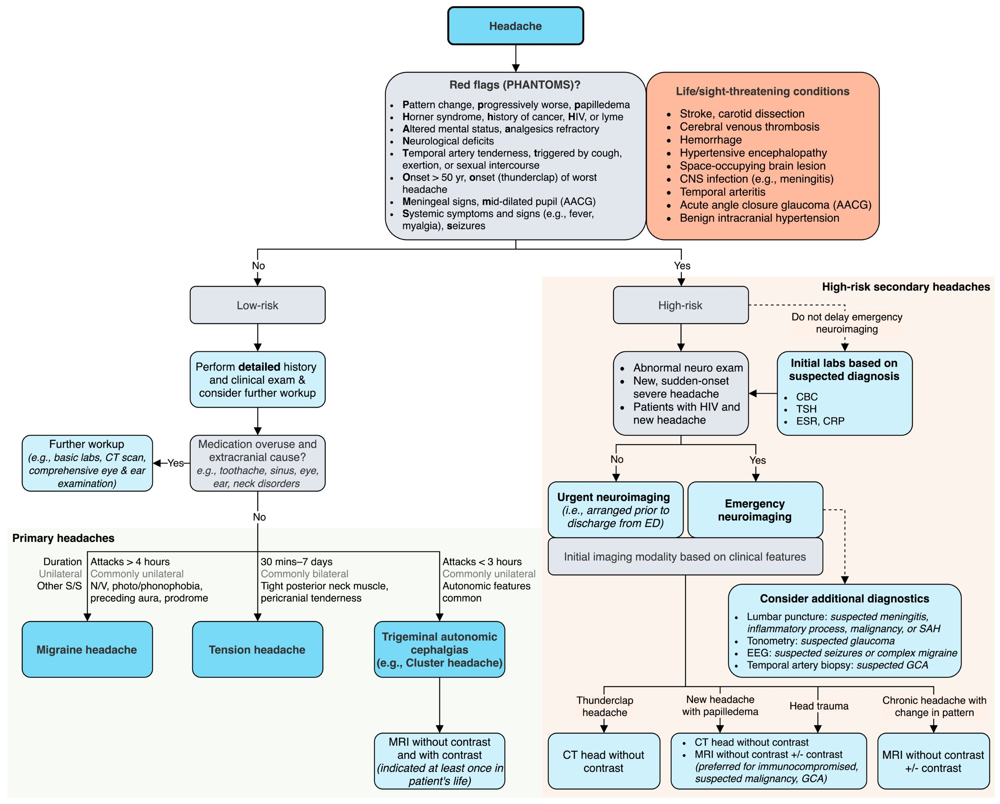

# Headache

*Categories: Clinical knowledge > Neurology > Headaches and facial pain > Headache*

[Original Article Link](https://coursology-qbank.com/amboss/article/YL0nwg)

---

## Summary

Headache is a symptom commonly encountered in everyday clinical practice, and, according to the WHO, one of the ten most common causes of functional disability. It may be primary (e.g., tension-type headaches, <u>migraine</u>) or secondary (e.g., following <u>head trauma</u> or infections) in nature. Although most episodes of headache are harmless, potentially life-threatening causes (e.g., <u>subarachnoid hemorrhage</u>, <u>meningitis</u>) should always be considered. Identifying the cause of headaches is often difficult and requires a detailed clinical history as well as a thorough <u>physical examination</u>. Additional diagnostics, e.g., imaging, are only indicated if headaches persist despite treatment or if specific clinical features are present that are signs of an underlying disease. This article gives an overview of the most common types of headache and serves as a guide to diagnosing different headache disorders.

---

## Initial management

### Approach

1. * Check <u>vital signs</u>.
2. * Perform focused history and examination.
3. * If <u>red flags</u> are present:

* Obtain <u>brain</u> imaging (either CT or <u>MRI</u> <u>brain</u> with and/or without contrast) based on the <u>red flag symptoms</u>. [[1]](https://coursology-qbank.com/amboss/article/VDYGWr)

* Perform further targeted diagnostics (see below).
4. * If no <u>red flags</u> are present and suspicion for life-threatening causes is low:

* Perform a detailed history and clinical exam.

* Consider whether further diagnostic testing is necessary.
5. * Provide <u>supportive care</u>.
6. * Identify and treat the underlying cause.

Approach to headache

### Headache red flags (SNOOP10) [[1]](https://coursology-qbank.com/amboss/article/VDYGWr)[[2]](https://coursology-qbank.com/amboss/article/xncEv10)

The original mnemonic, SNOOP   has more recently been expanded to cover the following total of 15 <u>red flags</u>:

* Systemic symptoms (e.g., <u>fever</u>, <u>signs of meningitis</u>, <u>myalgia</u>, <u>malaise</u>)

* Neoplasm in history

* Neurological deficits/dysfunction (e.g., <u>altered mental status</u>, <u>seizures</u>)  [[3]](https://coursology-qbank.com/amboss/article/MCcMse0)

* Onset of headache is sudden or abrupt

* Older age at onset (> 50 years)

* Pattern changes of headache or recent onset

* Positional headache

* Precipitated by sneezing, <u>coughing</u>, or exercise

* Papilledema and other <u>signs of increased ICP</u>

* Progressive headache and atypical features

* Pregnancy or <u>postpartum period</u>

* Pain of the <u>eye</u> with autonomic features and visual deficits

* Posttraumatic onset

* Pathology of the <u>immune system</u> (especially due to <u>HIV</u>)

* Painkiller overuse or new drug at onset of headache

> [!WARNING]
> A new or progressive headache in a patient aged > 50 years may indicate <u>tumor</u> or hemorrhage and should always be treated as a <u>high-risk headache</u>.

### Life-threatening conditions [[1]](https://coursology-qbank.com/amboss/article/VDYGWr)

* <u>Intracranial hemorrhage</u>: <u>subarachnoid hemorrhage</u>, <u>epidural hemorrhage</u>, <u>intracerebral hemorrhage</u>

* <u>CNS</u> infection: <u>meningitis</u>, <u>encephalitis</u>, <u>brain abscess</u>, subdural <u>empyema</u>

* Conditions causing <u>increased ICP</u> (e.g., <u>intracranial neoplasm</u>, <u>brain abscess</u>, <u>ICH</u>)

* <u>Hypertensive emergency</u>

* <u>Internal carotid artery</u> dissection

* <u>Vertebral artery dissection</u>

* <u>Ischemic stroke</u>

* <u>Pituitary apoplexy</u>

* <u>Carbon monoxide poisoning</u>

* <u>Cerebral venous sinus thrombosis</u>

* <u>Hypoglycemia</u>

* <u>Preeclampsia</u> or <u>eclampsia</u>

* Non-life-threatening conditions requiring urgent attention:

* <u>Acute angle-closure glaucoma</u>

* <u>Giant cell arteritis</u>

---

## Definitions

* Headache is a <u>pain</u> related to irritation and/or inflammation of intracranial or extracranial structures with <u>pain</u> <u>receptors</u> (e.g., <u>meninges</u>, <u>cranial nerves</u>, <u>blood vessels</u>).

* <u>Primary headache</u>: a headache that is not caused by another underlying condition [[4]](https://coursology-qbank.com/amboss/article/lGYvzq)
* Includes <u>migraine headache</u>, <u>tension headache</u>, <u>trigeminal</u> autonomic cephalalgias (e.g., <u>cluster headache</u>)

* <u>Secondary headache</u>: a headache that is caused by another underlying condition (e.g., trauma, space-occupying lesion) [[4]](https://coursology-qbank.com/amboss/article/lGYvzq)

---

## Epidemiology

* Lifetime <u>prevalence</u>: > 90%, with female predominance (except <u>cluster headache</u>) [[5]](https://coursology-qbank.com/amboss/article/Z9YZNr)

* Most common forms of headache [[5]](https://coursology-qbank.com/amboss/article/Z9YZNr)

* Tension-type headache: 40–80% of cases

* <u>Migraine</u>: 10% of cases

> [!TIP]
> Among patients presenting to the emergency department with headaches, <u>primary headache</u> (most frequently <u>migraine</u>) is the most common type, but up to 5% may have a <u>secondary headache</u> with a serious life-threatening cause. [[6]](https://coursology-qbank.com/amboss/article/QDcuVe0)

Epidemiological data refers to the US, unless otherwise specified.

---

## Etiology

### <u>Primary headache</u>

* <u>Migraine</u>

* <u>Tension-type headache</u>

* <u>Trigeminal</u> autonomic cephalalgias: <u>cluster headaches</u>, <u>paroxysmal hemicrania</u>, hemicrania continua

* Other <u>primary headaches</u>: <u>cough</u> headaches, headaches due to physical exertion, postcoital headache, primary stabbing headache

### <u>Secondary headache</u>

* Bleeding

* <u>Epidural hemorrhage</u>

* <u>Subdural hemorrhage</u>

* <u>Subarachnoid hemorrhage</u>

* <u>Intracerebral hemorrhage</u>

* Vascular

* <u>Cerebral venous thrombosis</u>

* <u>Pituitary apoplexy</u>

* <u>Stroke</u>, <u>TIA</u>

* <u>Aneurysms</u>

* <u>Carotid artery dissection</u>

* <u>Vertebral artery dissection</u>

* <u>Reversible cerebral vasoconstriction syndrome</u>

* Autoimmune
* <u>Temporal arteritis</u>; (<u>giant cell arteritis</u>)

* Drug/toxin-related

* <u>Alcohol</u> use

* <u>Alcohol withdrawal</u>

* Food additives (e.g., nitrites and <u>nitrates</u>)  [[7]](https://coursology-qbank.com/amboss/article/R_dlLs0)

* <u>Sympathomimetics</u> (e.g., <u>nicotine</u>)

* <u>Medication overuse headache</u>

* <u>Caffeine withdrawal headache</u>

* <u>Opioid withdrawal</u>

* <u>Nitroglycerin</u>

* <u>Carbon monoxide poisoning</u>

* Infectious

* Intracranial infections

* <u>Meningitis</u>

* <u>Encephalitis</u>

* <u>Brain abscess</u>

* Subdural <u>empyema</u>

* <u>Aseptic meningitis</u>

* <u>Toxoplasmosis</u>

* Systemic infections (e.g., <u>influenza</u>)

* <u>ICP</u>-related

* <u>Increased intracranial pressure</u> (e.g., due to <u>pseudotumor cerebri</u>)

* Decreased <u>intracranial pressure</u> (e.g., <u>post-lumbar puncture headache</u>)

* <u>Hydrocephalus</u>

* Metabolic

* <u>Hypoxia</u> and/or <u>hypercapnia</u> (e.g., high-altitude headache)

* <u>Hypoglycemia</u>

* <u>Hypothyroidism</u>

* Extracranial

* <u>Glaucoma</u>

* <u>Iridocyclitis</u>

* <u>Refractive errors</u>

* <u>Optic neuritis</u>

* <u>Rhinosinusitis</u>

* <u>Cervicogenic headache</u> (e.g., cervical disk disease)

* <u>Temporomandibular joint</u> disorders

* Other

* <u>Hypertension</u>

* <u>Brain tumors</u>

* <u>Trigeminal neuralgia</u>

* <u>Postherpetic neuralgia</u>

* <u>Postictal</u> headache

* Psychiatric

* <u>Somatization disorder</u>

* <u>Psychotic disorder</u>

---

## Clinical features

### <u>History of present illness</u>

* Timing

* Duration of a single episode

* Frequency

* Clinical course (e.g., chronic, acute)

* Nature of the headache

* Localization

* Character

* Intensity

* Radiation of <u>pain</u>

* Severity (e.g., impact on patient's life)

* Triggers and exacerbating factors

* Altered <u>sleep</u>-wake cycle

* Physical exertion

* <u>Stress</u>

* Certain types of food or <u>alcohol</u>

* Fluctuations in <u>hormone</u> levels: <u>oral contraceptives</u>; , <u>menstruation</u>

* Lying down or standing up

* Recent trauma

* Environmental exposures

* Associated symptoms

* <u>Nausea</u>/<u>vomiting</u>

* <u>Horner syndrome</u>

* <u>Aura</u>

* <u>Photopsia</u>, <u>photophobia</u>

* Neck stiffness

* <u>Neck pain</u>

* <u>Seizures</u>

* Change in <u>vision</u>

* <u>Lacrimation</u>, <u>rhinorrhea</u>

* New <u>skin</u> lesions

* <u>Allodynia</u> of the head region

> [!WARNING]
> Maintain a high index of suspicion for <u>secondary headache</u> in patients with a new, <u>sudden-onset severe headache</u>.

### <u>Past medical history</u>, <u>social history</u>, and <u>family history</u>

* <u>Past medical history</u> (e.g., <u>hypertension</u>, <u>hypothyroidism</u>, <u>seizures</u>, <u>migraine</u>, infections)

* Medications (e.g., <u>anticoagulants</u> , <u>analgesics</u>, <u>OCPs</u>)

* <u>Allergies</u>

* <u>Caffeine</u> intake

* Substance use

* <u>Alcohol</u> consumption

* Smoking

* <u>Family history</u>

### <u>Physical examination</u>

* <u>Vital signs</u>

* Blood pressure

* Presence of <u>fever</u>

* <u>HEENT</u>

* Signs of trauma

* <u>Auscultation</u> for <u>bruits</u>

* Palpation of pericranial muscles

* Palpation of the <u>temporal artery</u>;  and assessment of <u>jaw</u> movement

* Palpation along the course of the <u>trigeminal nerve</u> branches

* Examination of the <u>teeth</u> and <u>oral cavity</u>

* <u>Examination of the eye</u>

* <u>Examination of ocular movements</u>

* Assessment of <u>cervical spine</u> mobility

* Palpation of the sinuses

* <u>Direct fundoscopy</u>

* Neurological

* <u>Neurological examination</u> for neurological deficits

* <u>Meningeal signs</u>

* Signs of <u>Horner syndrome</u>

* Abdomen: inspection and <u>palpation of the abdomen</u>

* <u>Skin</u>: : Evaluate for <u>rash</u>  or signs of drug use.

> [!TIP]
> Consider secondary life-threatening causes if <u>red flags for headache</u> are present!

---

## Diagnosis

### Approach [[8]](https://coursology-qbank.com/amboss/article/_wY5lr)

* Check <u>vital signs</u>, obtain a history, and perform a physical and <u>neurological examination</u>.

* Determine the need for further testing based on risk <u>stratification</u> and the suspected diagnosis.

* Low-risk headache: No routine laboratory tests or imaging are recommended.

* <u>High-risk headache</u>: Consider diagnostic workup based on the suspected diagnosis.

> [!WARNING]
> In patients who are unstable or have <u>signs of increased ICP</u>, diagnostics should not delay stabilization (e.g., <u>ABCDE approach</u>) and <u>neuroprotective measures</u>.

> [!TIP]
> The diagnostic modality should be determined by the <u>patient history</u> and clinical presentation. <u>Primary headache</u> is a <u>clinical diagnosis</u> and typically does not require laboratory or imaging evaluation.

### Risk <u>stratification</u> of headache [[8]](https://coursology-qbank.com/amboss/article/_wY5lr)[[9]](https://coursology-qbank.com/amboss/article/TDY6dr)

|  | Clinical features |
| --- | --- |
| Low-risk headache |   * Age < 30 years  * Features of <u>primary headache</u>  * Prior experience of similar headache  * Absence of neurological deficits  * Typical headache pattern  * No recent history of cancer, <u>HIV</u>, or <u>Lyme disease</u>  * No <u>red flags for headache</u>    |
| High-risk headache |   * Any <u>red flags</u> for headache  * Any features of <u>secondary headache</u>  * <u>Horner syndrome</u>  * Accompanying systemic illness (e.g., <u>fever</u>, <u>myalgias</u>)  * Triggered by <u>cough</u> , exertion, or sexual intercourse  [[10]](https://coursology-qbank.com/amboss/article/UwcbRe0)  * Tenderness over the <u>temporal artery</u>  * History of cancer, <u>HIV</u>, <u>Lyme disease</u>    |

> [!WARNING]
> Response to <u>analgesics</u> should not be used for risk <u>stratification</u>! Pursue a diagnostic workup for high-risk features even if headache improves with initial treatment. [[11]](https://coursology-qbank.com/amboss/article/2wcTRe0)[[12]](https://coursology-qbank.com/amboss/article/fwckRe0)

> [!TIP]
> In the emergency department, use the <u>Ottawa subarachnoid hemorrhage (SAH) clinical decision rule</u> to rule out <u>SAH</u> in patients presenting with rapid onset headache and a normal <u>neurological examination</u>. [[13]](https://coursology-qbank.com/amboss/article/aPXQWy)

### <u>Laboratory studies</u>

* There are no routine recommended <u>laboratory studies</u> for headaches. Consider the following based on clinical suspicion:

* <u>CBC</u>

* <u>TSH</u>

* <u>ESR</u>, <u>CRP</u>

### Imaging [[13]](https://coursology-qbank.com/amboss/article/aPXQWy)[[14]](https://coursology-qbank.com/amboss/article/0CYeqr)

* Indications

* For emergency <u>neuroimaging</u> 

* Abnormal <u>neurological examination</u>

* New, <u>sudden-onset severe headache</u> if <u>Ottawa SAH rule</u> criteria are met

* Patients with <u>HIV</u> with a new type of headache

* For urgent (arranged prior to discharge) <u>neuroimaging</u> in the emergency department: 
* Patients > 50 years of age with a new type of headache but normal <u>neurological examination</u>

* In all other situations, imaging should be considered based on the suspected diagnosis and risk <u>stratification</u>.

* Test of choice

* The initial test of choice is usually a head <u>CT without contrast</u>.

* See the table below for other imaging modalities to consider.

Ottawa SAH rule for headache evaluation

|  Recommended initial imaging modality for headache [[15]](https://coursology-qbank.com/amboss/article/TCY6rr)  |  |  |  |
| --- | --- | --- | --- |
|  |  |  Initial test of choice  |  Alternatives  |
| <u>Sudden-onset severe headache</u> (i.e., <u>thunderclap headache</u>) |  |  * CT head without IV contrast   |  * <u>CTA</u> with IV contrast   |
|  New headache with <u>papilledema</u>   |  |   * <u>MRI</u> head   * Without contrast  * Without and with IV contrast  * CT head without IV contrast    |   * CTV head with IV contrast  * <u>MRV</u> head   * Without IV contrast  * Without and with IV contrast  * CT head with IV contrast    |
| New or worsening headache related to <u>head trauma</u> or accompanied by <u>red flags</u> |  |   * CT head without IV contrast  * <u>MRI</u> head  * Without IV contrast  * Without and with IV contrast    |  * N/A   |
|  New <u>primary headache</u> suspected to be of <u>trigeminal</u> autonomic origin  (e.g., <u>cluster headache</u>)    |  |  * <u>MRI</u> head without and with IV contrast   |  * <u>MRI</u> head without IV contrast   |
| Chronic headache with new features or change in character, severity, or frequency |  |  * <u>MRI</u> head   * Without IV contrast  * Without and with IV contrast   |  * CT head  * Without and with IV contrast  * Without IV contrast   |

> [!TIP]
> In patients presenting to the emergency department with acute headache and a normal <u>neurological examination</u>, a negative head <u>CT without contrast</u> indicates that the <u>diagnosis of SAH</u> is unlikely, even when performed < 6 hours from the onset of headache (see “Diagnostics” in “<u>Subarachnoid hemorrhage</u>.”) [[13]](https://coursology-qbank.com/amboss/article/aPXQWy)

> [!WARNING]
> Avoid imaging in patients presenting with a recurrent known <u>migraine</u> unless new concerning features are present, e.g., <u>seizures</u>, <u>focal neurological deficits</u>, or recent change in headache pattern.

### Additional diagnostics to consider [[14]](https://coursology-qbank.com/amboss/article/0CYeqr)

* <u>Lumbar puncture</u> (<u>LP</u>) with <u>CSF analysis</u>: for suspected <u>meningitis</u>, suspected inflammatory process or <u>malignancy</u>, or if there is a high suspicion of <u>SAH</u> without proof on <u>CT scan</u>

* <u>Tonometry</u>: if increased <u>intraocular pressure</u> is suspected

* <u>EEG</u>: for any form of suspected <u>seizures</u> or complex <u>migraine</u>

* <u>Temporal artery biopsy</u>: if <u>GCA</u> is suspected

> [!TIP]
> In the emergency department, if <u>SAH</u> is still suspected despite a normal head CT without contrast, either <u>LP</u> or <u>CTA</u> can be used as a second-line test to safely rule out the diagnosis (see “Diagnostics” in “<u>Subarachnoid hemorrhage</u>”). [[13]](https://coursology-qbank.com/amboss/article/aPXQWy)

> [!WARNING]
> In patients with suspected <u>meningitis</u> or <u>encephalitis</u>, do not delay <u>lumbar puncture</u> unless the patient meets the <u>criteria for imaging prior to LP</u>.

---

## Primary headaches

|  Types of primary headaches [[16]](https://coursology-qbank.com/amboss/article/lPavUk)   |  |  |  |  |  |
| --- | --- | --- | --- | --- | --- |
| Characteristics |  |  <u>Tension-type headache</u>  |  <u>Migraine headache</u>  |  <u>Cluster headache</u>  |  Mixed type headache [[4]](https://coursology-qbank.com/amboss/article/lGYvzq)  |
| <u>Epidemiology</u> |  |  * <u>♀</u> > <u>♂</u>   |  * <u>♀</u> > <u>♂</u>   |  * <u>♂</u> > <u>♀</u> (3:1)   |  * <u>♀</u> > <u>♂</u>   |
| Triggers/exacerbating factors |  |   * <u>Stress</u>, <u>anxiety</u>, <u>depression</u>  * <u>Lack of sleep</u>, fatigue  * Poor posture    |   * <u>Stress</u>  * Fluctuation in <u>hormone</u> levels: <u>oral contraceptives</u>, <u>menstruation</u>  * Certain types of food (e.g., those containing tyramines or <u>nitrates</u> such as processed meat, chocolate, cheese)  * Exacerbated by exertion    |  * <u>Alcohol</u>   |   * <u>Stress</u>  * <u>Lack of sleep</u>, fatigue  * Poor posture  * Fluctuation in <u>hormone</u> levels: <u>oral contraceptives</u>, <u>menstruation</u>  * Certain types of food (e.g., those containing tyramines or <u>nitrates</u> such as processed meat, chocolate, cheese)  * Exacerbated by exertion    |
| Clinical features | Attack duration |  * 30 minutes to 7 days   |  * 4–72 hours   |   * 15–180 minutes  * Short, recurring attacks    |  * Hours to days   |
| Frequency |   * Occasionally to daily (usually at the end of the day)  * Episodic or chronic    |   * Occasionally to several times a month  * Episodic or chronic    |   * 1–3 episodes every 24 hours  * Usually occur in a cyclical pattern (<u>cluster periods</u>) with remissions lasting ≥ 3 months (i.e., <u>episodic CH</u>), but may also occur with remissions lasting < 3 months or no remission (i.e., <u>chronic CH</u>)    |  * Episodic or chronic   |  |
| Localization |  * <u>Holocephalic</u> or bifrontal   |  * 60% of cases are unilateral.   |   * Exclusively unilateral  * Localized to the periorbital and/or temporal region    |  * <u>Holocephalic</u>, bifrontal, or unilateral   |  |
| Character |   * Dull, nonpulsating, band-like or vise-like <u>pain</u>  * Constant    |  * Pulsating, boring/hammering <u>pain</u>   |   * Often burning or piercing <u>pain</u>  * Attacks develop within minutes  * Often wakes patients up from <u>sleep</u>    |   * Features of <u>migraine</u> and <u>tension-type headache</u>  * Either pulsating or nonpulsating    |  |
| Intensity |  * Mild to moderate   |  * Moderate to severe   |  * Severe, agonizing <u>pain</u>   |  * Mild to severe   |  |
| Additional symptoms |   * Either <u>phonophobia</u> or <u>photophobia</u> (but not both)  * No <u>nausea</u>, <u>vomiting</u>, or <u>aura</u>  * Tightness in the <u>posterior</u> neck muscles  * Pericranial tenderness    |   * <u>Nausea</u>, <u>vomiting</u>  * <u>Hyperacusis</u>  * <u>Photophobia</u>  * <u>Phonophobia</u>  * Preceding <u>aura</u>  * <u>Prodrome</u> (e.g., excessive yawning, difficulty writing or reading, sudden hunger or lack of appetite, mood changes)    |   * <u>Ipsilateral</u> autonomic symptoms: <u>conjunctival injection</u> and/or <u>lacrimation</u>, <u>rhinorrhea</u>, and nasal congestion  * Partial Horner syndrome: <u>ptosis</u> and <u>miosis</u>, but no <u>anhidrosis</u>    |   * <u>Nausea</u>, <u>vomiting</u>  * <u>Hyperacusis</u>  * <u>Photophobia</u>  * <u>Phonophobia</u>  * Tightness in the <u>posterior</u> neck muscles  * Pericranial tenderness    |  |
| Diagnostics |  |  * <u>Clinical diagnosis</u>   |  |  |  |
|  * For further information see “<u>Diagnostic criteria for tension-type headaches</u>.”   |   * For further information see “<u>Diagnostic criteria for migraine</u>.”  * <u>Neuroimaging</u>: CT or <u>MRI</u> to rule out differential diagnoses (see below)  [[17]](https://coursology-qbank.com/amboss/article/NGY-zq)[[18]](https://coursology-qbank.com/amboss/article/avYQAI)    |  * For further information see “<u>Diagnostic criteria for cluster headache</u>.”   |  * For further information see “<u>Diagnostic criteria for tension-type headaches</u>” and “<u>Diagnostic criteria for migraine</u>.”   |  |  |
| Management |  |   * Episodic <u>tension-type headache</u>: <u>NSAIDs</u> (e.g., <u>ibuprofen</u>, <u>aspirin</u>) or <u>acetaminophen</u>  * <u>Chronic tension-type headache</u> and frequent episodic type: consider prophylactic therapy (e.g., with <u>amitriptyline</u>)  * For further information see “<u>Tension-type headache treatment</u>” and “<u>Acute management checklist for tension headache</u>.”    |   * Reduce stimuli (e.g., light, loud noises) and activity  * Treat <u>nausea</u>/<u>vomiting</u>  * Mild to moderate headache: <u>NSAIDs</u>, <u>acetaminophen</u>, <u>acetylsalicylic acid</u>, or combinations including <u>caffeine</u>  * Moderate to severe headache: <u>triptans</u>  * For further information see “<u>Migraine</u>: Management” and “<u>Acute management checklist for migraine headache</u>.”    |   * <u>Oxygen therapy</u> with <u>FiO2</u> 100%  * <u>Triptans</u> (e.g., <u>sumatriptan</u> or <u>zolmitriptan</u>)  * For further information see “<u>Treatment of cluster headache</u>” and “<u>Acute management checklist for cluster headache</u>.”    |  * Combination of management of “<u>Tension-type headache treatment</u>” and “<u>Migraine</u>: management.”   |

> [!NOTE]
> “POUND:“ pulsatile, one-day duration, unilateral, nausea, and disabling intensity are the typical features of <u>migraine headache</u>.

> [!TIP]
> In the emergency department, nonopioid <u>pain</u> medications are preferred for the treatment of acute <u>primary headaches</u>. [[13]](https://coursology-qbank.com/amboss/article/aPXQWy)

Tension headache fact sheet

Migraine fact sheet

Cluster headache fact sheet

Differential diagnoses of primary headaches fact sheet

---

## Secondary headaches

| Diagnosis | Clinical features | Diagnostic findings | Acute management |
| --- | --- | --- | --- |
|  <u>Meningitis</u> [[19]](https://coursology-qbank.com/amboss/article/AEYRyI)[[20]](https://coursology-qbank.com/amboss/article/KYYUJn)[[21]](https://coursology-qbank.com/amboss/article/_EY5yI)  |   * Classic triad: <u>fever</u>, headache, and neck stiffness (<u>nuchal rigidity</u>)  * <u>Meningism</u> (e.g., <u>photophobia</u>)  * Dull, diffuse (<u>holocephalic</u>) headache that worsens over hours/days  * <u>Altered mental status</u>  * <u>Nausea</u>, <u>vomiting</u>  * <u>Seizures</u>    |   * ↑ <u>WBC</u>, ↑ <u>procalcitonin</u> (if bacterial)  * <u>CSF analysis</u>  * Bacterial: <u>WBC</u> > 1,000/μL (predominantly <u>neutrophils</u>), elevated protein, low <u>glucose</u>, positive <u>gram stain</u>  * Viral: <u>WBC</u> 10–500 /μL (predominantly <u>lymphocytes</u>), normal-elevated protein, normal <u>glucose</u>    |  * See the <u>acute management checklist for meningitis</u>.   |
|  <u>Intracerebral hemorrhage</u> [[22]](https://coursology-qbank.com/amboss/article/qRaCL4)[[23]](https://coursology-qbank.com/amboss/article/eDYxWr)  |   * Acute, severe, nonspecific headache  * <u>Focal neurological signs</u> and symptoms  * <u>Nausea</u> and <u>vomiting</u>  * Confusion and <u>loss of consciousness</u>  * <u>Seizures</u>    |  * CT head without contrast: <u>hyperdense</u> lesion with <u>hypodense</u> perifocal <u>edema</u>   |  * See the <u>acute management checklist for intracerebral hemorrhage</u>.   |
|  <u>Subarachnoid hemorrhage</u> [[24]](https://coursology-qbank.com/amboss/article/oaa0lQ)  |   * Acute onset of a <u>thunderclap headache</u>  * <u>Focal neurological deficits</u>  * <u>Meningism</u>  * Impaired consciousness, rapidly worsening neurological status  * <u>Seizures</u>    |   * CT head without contrast: blood in <u>subarachnoid space</u> (<u>hyperdense</u>)  * <u>Lumbar puncture</u> : ↑ <u>RBC count</u>    |  * See the <u>acute management checklist for subarachnoid hemorrhage</u>.   |
| <u>Subdural hematoma</u> (<u>SDH</u>) |   * Diffuse headache that is worst on the side of the <u>hematoma</u>  * Impaired consciousness and confusion  * <u>Focal neurological deficits</u> (e.g., <u>hemiparesis</u> , gait, speech, visual impairment, <u>personality</u> changes, <u>dilated pupil</u> , or nonreactive <u>pupil</u> )  * <u>Signs of increased intracranial pressure</u>  * Chronic <u>subdural hemorrhage</u> : psychomotor impairment, <u>memory</u> loss    |  * CT head without contrast: crescent-shaped, <u>concave</u>, <u>hyperdense</u> hemorrhage that crosses suture lines but not the midline   |  * See the <u>acute management checklist for subdural hematoma</u>.   |
|  <u>Epidural hematoma</u> [[25]](https://coursology-qbank.com/amboss/article/oFY0QI)  |   * Headache localized to the side of the <u>hematoma</u>  * <u>Contralateral</u> focal symptoms/<u>hemiplegia</u>  * Impaired mental status, <u>loss of consciousness</u>, <u>seizures</u>, <u>nausea</u>, and <u>vomiting</u>  * Nearly half of patients who lose consciousness will have a <u>lucid interval</u> followed by clinical deterioration due to further expansion.    |  * CT head without contrast: biconvex, <u>hyperdense</u> lesion   |  * See the <u>acute management checklist for epidural hematoma</u>.   |
|  <u>Cerebral venous sinus thrombosis</u> [[26]](https://coursology-qbank.com/amboss/article/euYxJI)  |   * Nonspecific headache (acute, subacute, or chronic)  * <u>Cranial nerve</u> symptoms (e.g., <u>diplopia</u>, <u>tinnitus</u>, unilateral <u>deafness</u>, <u>facial palsy</u>)  * <u>Cavernous sinus syndrome</u>  * <u>Focal neurological deficits</u>  * <u>Seizures</u>  * Impairment in consciousness and awareness  * <u>Signs of increased intracranial pressure</u> (e.g., <u>nausea</u>, <u>vomiting</u>)  * <u>Risk factors</u>: <u>pregnancy</u>, <u>prothrombotic states</u>, <u>vasculitis</u>, smoking, use of <u>oral contraceptives</u>    |   * Labs: ↑ <u>WBC</u> , ↑ <u>D-dimer</u>  * <u>Fundoscopy</u>: <u>papilledema</u>  * <u>MRI</u>/<u>MRV</u> or CT/CTV: direct or indirect signs of <u>thrombus</u> (see also “Diagnostics” in <u>cerebral venous thrombosis</u>)  [[27]](https://coursology-qbank.com/amboss/article/8DYOTr)  * Cerebral <u>venography</u>: filling defect  [[26]](https://coursology-qbank.com/amboss/article/euYxJI)    |  * See the <u>acute management checklist for cerebral venous sinus thrombosis</u>.   |
|  <u>Giant cell arteritis</u> [[28]](https://coursology-qbank.com/amboss/article/r8YfLI)[[29]](https://coursology-qbank.com/amboss/article/I8YYLI)[[30]](https://coursology-qbank.com/amboss/article/q8YCnI)[[31]](https://coursology-qbank.com/amboss/article/J8YsnI)  |   * Unilateral headache over the temporal/occipital area  * Prominent, tender <u>temporal artery</u>  * <u>Jaw claudication</u>, scalp tenderness  * <u>Constitutional symptoms</u>: <u>fever</u>, <u>malaise</u>, fatigue  * If <u>temporal arteritis</u> is associated with <u>polymyalgia rheumatica</u>: shoulder/<u>pelvic pain</u>, <u>depression</u>, tiredness, <u>fever</u>, weight loss  * Partial or complete <u>vision loss</u> (unilateral or bilateral), <u>amaurosis fugax</u>, <u>diplopia</u>    |   * <u>Anemia</u>, ↑ <u>ESR</u> ≥ 40–50 mm/hour , ↑ <u>CRP</u>, ↑ IL–6  * <u>Temporal artery biopsy</u> (<u>gold standard</u>): segmental <u>vasculitis</u> with predominant <u>mononuclear cells</u> or <u>granulomatous inflammation</u>  * <u>MRI</u> with contrast: <u>enhancement</u> of the <u>temporal artery</u>    |  * See the <u>acute management checklist for giant cell arteritis</u>.   |
|  <u>Hypertensive crises</u> [[32]](https://coursology-qbank.com/amboss/article/fEYkEI)[[33]](https://coursology-qbank.com/amboss/article/_sY5xq)  |   * Diffuse (sometimes bifrontal), pulsating headache that is exacerbated by physical activity  * <u>Hypertension</u> > 180/120 mm Hg  * Signs of end-organ damage (e.g., <u>chest pain</u>, <u>dyspnea</u>, <u>oliguria</u>, <u>altered mental status</u>)    |  * <u>Clinical diagnosis</u>: elevated BP with  or without  signs of end-organ damage  * Labs: <u>anemia</u>, ↑ <u>creatinine</u>, ↑ <u>BNP</u>, <u>proteinuria</u>, <u>hematuria</u>  * <u>ECG</u>: <u>left ventricular hypertrophy</u>, signs of cardiac <u>ischemia</u> (e.g., <u>ST depressions</u> or elevations)  * <u>Chest x-ray</u>: <u>cardiomegaly</u>, <u>pulmonary edema</u>   |  * See the <u>acute management checklist for hypertensive crises</u>.   |
|  <u>Ischemic stroke</u> [[34]](https://coursology-qbank.com/amboss/article/dMYonp)[[35]](https://coursology-qbank.com/amboss/article/1CY2Ir)  |   * <u>Tension-type headache</u>  * <u>Focal neurological deficits</u>  * <u>Altered mental status</u>    |   * CT head without contrast: <u>hyperdense</u> occluded vessels, <u>hypodense</u> <u>parenchyma</u>, effacement of the sulci and loss of corticomedullary differentiation  * <u>CTA</u> head and neck: vessel occlusion  * <u>DW-MRI</u>: T1 <u>hypointense</u> signal, T2 <u>hyperintense</u> signal in the area of the <u>infarction</u>    |  * See the <u>acute management checklist for ischemic stroke</u>.   |
|  Intracranial space-occupying lesions (e.g., <u>brain tumors</u>) [[36]](https://coursology-qbank.com/amboss/article/fuYkqI)[[37]](https://coursology-qbank.com/amboss/article/TuY6qI)[[38]](https://coursology-qbank.com/amboss/article/0vYeAI)  |   * A dull headache that is usually bifrontal and worsens over weeks/months  * Signs of <u>increased intracranial pressure</u> (e.g., <u>papilledema</u>)  * <u>Focal neurological deficits</u>, <u>altered mental status</u>, <u>seizures</u>, <u>nausea and vomiting</u>    |   * <u>T1-weighted</u> <u>MRI</u> <u>brain</u> with <u>gadolinium</u>:  hypo-, hyper-, or <u>isointense</u>  mass lesion with peritumoral <u>edema</u>  * CT <u>brain</u> with IV contrast: mass lesion, commonly with <u>contrast enhancement</u>    |  * See the <u>acute management checklist for brain tumor</u>.   |
|  <u>Concussion</u> (e.g., <u>mild traumatic brain injury</u>) [[39]](https://coursology-qbank.com/amboss/article/nDY7Ur)[[40]](https://coursology-qbank.com/amboss/article/YCYnqr)[[41]](https://coursology-qbank.com/amboss/article/mxaVC5)  |   * Headache of variable intensity  * Confusion  * <u>Retrograde amnesia</u> and/or <u>anterograde amnesia</u>  * <u>Nausea</u>, <u>vomiting</u>, <u>dizziness</u>  * <u>Ageusia</u> , <u>anosmia</u>, <u>tinnitus</u>, <u>photophobia</u>, blurring of <u>vision</u>  * <u>Loss of consciousness</u> (rare)  * History of trauma    |   * <u>Clinical diagnosis</u>  * CT head without contrast: usually normal    |  * See the <u>acute management checklist for concussion</u>.   |
|  <u>Acute angle-closure glaucoma</u>  [[42]](https://coursology-qbank.com/amboss/article/nWa7Nj)[[43]](https://coursology-qbank.com/amboss/article/2uYTqI)  |   * Sudden onset of unilateral, severe ocular <u>pain</u> or headache  * Impaired, blurry <u>vision</u> with halos around lights  * Palpation of the <u>eye</u>: hard  [[44]](https://coursology-qbank.com/amboss/article/wEYhBI)  * Fixed mid-<u>dilated pupil</u>  * <u>Conjunctival hyperemia</u>, hazy <u>cornea</u>  * <u>Nausea</u>, <u>vomiting</u>    |   * Increased <u>IOP</u> (> 21 mm Hg)  * <u>Gonioscopy</u>: visualization of angle closure  * <u>Slit-lamp examination</u>: shallow <u>anterior</u> chamber  * <u>Visual field</u> losses    |  * See the <u>acute management checklist for acute angle-closure glaucoma</u>.   |
|  <u>Trigeminal neuralgia</u>  [[45]](https://coursology-qbank.com/amboss/article/cvYa_I)[[46]](https://coursology-qbank.com/amboss/article/xGYEYI)  |   * <u>Paroxysmal</u> (seconds to 2 minutes) and stabbing <u>pain</u>  * Unilateral facial <u>pain</u>, strictly localized to the distribution of the branches of the <u>trigeminal nerve</u>  * Frequency and intensity of episodes usually increase over time  * Tender trigger points  * Triggered by chewing, talking, cold, and touching specific areas of the face  * No neurological deficits    |   * <u>Clinical diagnosis</u> [[46]](https://coursology-qbank.com/amboss/article/xGYEYI)  * <u>MRI</u> <u>brain</u>: vascular compression of the <u>trigeminal</u> root    |  * See the <u>acute management checklist for trigeminal neuralgia</u>.   |
| <u>Medication overuse headache</u> |   * Headache with variable characteristics  * History of <u>analgesic</u> overuse  * Autonomic symptoms (e.g., <u>nausea</u>)  * Cognitive or behavioral symptoms (e.g., comorbid <u>depression</u>)    |  * <u>Clinical diagnosis</u>   |  * See <u>medication overuse headache</u>.   |

> [!TIP]
> Consider <u>eye examination</u> in patients with unexplained acute-onset severe headache with <u>nausea and vomiting</u> to evaluate for signs of <u>acute angle-closure glaucoma</u>.

---