# Helminth infections

*Categories: Clinical knowledge > Neurology > Infectious diseases > Helminth infections*

[Original Article Link](https://coursology-qbank.com/amboss/article/Ff0gL2)

---

## Summary

Helminths (i.e., parasitic worms) are a group of macroparasites encompassing a variety of species that can infect their hosts in three different ways: ingestion of eggs or larvae (e.g., via contaminated food and water or <u>fecal-oral route</u>), direct penetration of the <u>skin</u>, and via <u>vector</u> bites (e.g., certain species of flies and mosquitoes). Helminths are classified based on their macroscopic appearance as <u>nematodes</u> (i.e., <u>roundworms</u>; genera include <u>Ascaris</u>, Enterobius, Trichuris, <u>Toxocara</u>, <u>Trichinella</u>, Ancylostoma, Necator, <u>Strongyloides</u>, Loa, Onchocerca, Wuchereria, <u>Mansonella</u>, Dracunculus, <u>Gnathostoma</u>, <u>Anisakis</u>, Capillaria, and <u>Trichostrongylus</u>), <u>cestodes</u> (i.e., <u>tapeworms</u>; genera include Taenia,  Dibothriocephalus, <u>Echinococcus</u>, Hymenolepis, and Dipylidium), or <u>trematodes</u> (i.e., <u>flukes</u>; genera include <u>Schistosoma</u>, Clonorchis, <u>Paragonimus</u>, Fasciola, Dicrocoelium, and Opisthorchis). Most helminth species colonize the <u>gastrointestinal tract</u> of their hosts, causing symptoms such as abdominal <u>pain</u>, <u>nausea</u>, and <u>diarrhea</u>. The larvae of certain helminth species, such as those of the <u>Ascaris</u> and Ancylostoma genus, migrate from the intestines via the <u>portal vein</u> to the <u>lungs</u>, potentially causing <u>asthma</u>-like symptoms (e.g., dry <u>cough</u>, <u>wheezing</u>). Other species such as <u>Taenia solium</u> can colonize other human tissue, such as the <u>brain</u> or <u>liver</u>, which can lead to life-threatening complications (e.g., <u>neurocysticercosis</u>). Diagnosis of helminth infection is primarily based on <u>eosinophilia</u> in the blood and direct detection of worms, eggs, or larvae in stool samples. Serum <u>IgE</u> levels are often elevated. Treatment consists of anthelmintic agents, such as <u>albendazole</u> or <u>praziquantel</u>.

See also “<u>Echinococcosis</u>,” “<u>Schistosomiasis</u>,” and “<u>Strongyloidiasis</u>.” See “<u>General parasitology</u>” for an overview of all <u>parasites</u>.

---

## Nematodes (roundworms)

<u>Nematodes</u> (<u>roundworms</u>) are long, thin, unsegmented, tube-like worms with a longitudinal digestive tract opening at both ends. Adult worms form separate sexes, and females are usually larger than males. <u>Filarial nematodes</u> are thread-like <u>nematodes</u> transmitted to humans through <u>arthropod</u> <u>vectors</u>.

|  Overview of nematode infections [[1]](https://coursology-qbank.com/amboss/article/Ef18LT0)  |  |  |  |  |  |  |
| --- | --- | --- | --- | --- | --- | --- |
| Disease |  | <u>Pathogen</u> | Mode of transmission | Clinical features | Diagnostics |  Treatment [[2]](https://coursology-qbank.com/amboss/article/Bedza60)  |
| <u>Ascariasis</u> |  |  * <u>Ascaris lumbricoides</u>   |  * Fecal-oral   |   * Pulmonary symptoms  * Dry <u>cough</u>  * <u>Wheezing</u>  * <u>Loeffler syndrome</u>  * GI symptoms  * Abdominal discomfort  * <u>Nausea</u>  * Intestinal or <u>bile duct obstruction</u>    |   * Oval, knobby eggs in stool  * <u>Eosinophilia</u>    |   * <u>Albendazole</u>  * OR <u>mebendazole</u>    |
| <u>Enterobiasis</u> (<u>pinworm</u>) |  |  * <u>Enterobius vermicularis</u>   |   * Anal <u>pruritus</u>  * <u>Vulvovaginitis</u>    |  * <u>Tape test</u>   |   * <u>Mebendazole</u>  * OR <u>pyrantel pamoate</u>  * OR <u>albendazole</u>    |  |
| <u>Trichuriasis</u> (<u>whipworm</u>) |  |  * <u>Trichuris trichiura</u>   |  * <u>Rectal prolapse</u> in children   |  * Eggs in stool   |   * <u>Albendazole</u>  * OR <u>mebendazole</u>    |  |
| <u>Toxocariasis</u> |  |   * <u>Toxocara canis</u>  * <u>Toxocara cati</u>    |   * <u>Visceral toxocariasis</u>  * <u>Fever</u>  * <u>Rash</u>  * Organ-specific symptoms (e.g., <u>hepatosplenomegaly</u>, <u>Loeffler syndrome</u>, <u>myocarditis</u>, <u>seizures</u>)  * <u>Ocular toxocariasis</u>  * Unilateral <u>vision loss</u>  * <u>Strabismus</u>  * <u>Leukocoria</u>    |   * <u>Serology</u>: <u>Toxocara</u> <u>antibodies</u> in serum or <u>vitreous</u> fluid  * <u>Eosinophilia</u>    |   * <u>Albendazole</u>  * OR <u>mebendazole</u>    |  |
| <u>Trichinellosis</u> |  |  * <u>Trichinella spiralis</u>   |   * Consumption of undercooked meat (pork)  * Fecal-oral (rare)    |   * <u>Intestinal phase</u>  * Abdominal <u>pain</u>  * <u>Diarrhea</u>  * <u>Nausea</u>, <u>vomiting</u>  * Muscle phase  * <u>Myositis</u>  * <u>Periorbital edema</u>    |   * <u>Serology</u>: <u>IgG antibodies</u> against <u>Trichinella</u>  * <u>Eosinophilia</u>    |   * <u>Albendazole</u>  * OR <u>mebendazole</u>    |
| <u>Hookworm</u> (<u>ancylostomiasis</u>, <u>necatoriasis</u>) |  |   * <u>Ancylostoma duodenale</u>  * <u>Necator americanus</u>    |  * Penetration of the <u>skin</u> by a larvae   |   * Cutaneous symptoms  * <u>Erythema</u>  * <u>Pruritus</u>  * <u>Cutaneous larva migrans</u>  * Pulmonary symptoms  * Dry <u>cough</u>  * <u>Wheezing</u>  * <u>Loeffler syndrome</u>  * GI symptoms  * Abdominal <u>pain</u>  * <u>Nausea</u>  * <u>Anemia</u>    |   * Human <u>hookworm</u>  * Eggs in stool  * <u>Eosinophilia</u>  * <u>Zoonotic</u> <u>hookworms</u>: <u>clinical diagnosis</u> of <u>cutaneous larva migrans</u>    |   * Human <u>hookworms</u>  * <u>Albendazole</u>  * OR <u>mebendazole</u>  * OR <u>pyrantel pamoate</u>  * <u>Zoonotic</u> <u>hookworms</u>  * <u>Albendazole</u>  * OR <u>ivermectin</u>    |
| <u>Strongyloidiasis</u> |  |  * <u>Strongyloides stercoralis</u>   |   * Cutaneous symptoms  * <u>Erythema</u>  * <u>Pruritus</u>  * <u>Cutaneous larva migrans</u>  * Pulmonary symptoms  * Dry <u>cough</u>  * <u>Wheezing</u>  * <u>Hemoptysis</u>  * <u>Loeffler syndrome</u>  * GI symptoms  * Abdominal <u>pain</u>  * <u>Nausea</u>    |   * Mobile larvae in stool  * <u>Eosinophilia</u>    |   * <u>Ivermectin</u> OR <u>bendazoles</u>  * See “<u>Strongyloidiasis</u>.”    |  |
| Filariasis | <u>Loiasis</u> |  * <u>Loa loa</u>   |  * Bite of mango fly, deer fly, or horse fly   |   * Mostly asymptomatic  * <u>Calabar swellings</u>  * Ocular symptoms  * Congestion  * <u>Pruritus</u>  * <u>Pain</u>    |   * <u>Blood smear</u>  * <u>Eosinophilia</u>    |  * <u>Diethylcarbamazine</u>   |
| <u>Onchocerciasis</u> |  * <u>Onchocerca volvulus</u>   |  * Female blackfly bite   |   * Ocular symptoms  * <u>Uveitis</u>  * <u>Keratitis</u>  * <u>Optic atrophy</u>  * Blindness  * <u>Dermal</u> symptoms  * <u>Pruritus</u>  * Depigmentation  * <u>Skin</u> <u>atrophy</u>  * Subcutaneous <u>nodules</u>  * <u>Hyperpigmented</u> <u>papules</u>  * Systemic symptoms  * Weight loss  * Musculoskeletal <u>pain</u>  * <u>Allergic reactions</u>    |   * <u>Skin snip</u>  * <u>Slit-lamp examination</u>    |   * <u>Microfilariae</u>: <u>ivermectin</u>  * Macrofilariae: <u>doxycycline</u>    |  |
| <u>Lymphatic filariasis</u> |   * <u>Wuchereria bancrofti</u>  * Brugia malayi  * Brugia timori    |  * Female mosquito bite   |   * <u>Lymphadenopathy</u>  * Swelling of lower extremities  * <u>Hydrocele</u>    |   * <u>Blood smear</u>  * <u>Serology</u>    |  * <u>Diethylcarbamazine</u>   |  |
|  <u>Mansonellosis</u> [[3]](https://coursology-qbank.com/amboss/article/73V4P80)[[4]](https://coursology-qbank.com/amboss/article/P3VWi80)[[5]](https://coursology-qbank.com/amboss/article/j3V_R80)  |   * <u>Mansonella</u> perstans  * <u>Mansonella</u> ozzardi  * <u>Mansonella</u> streptocerca  * <u>Mansonella</u> rodhaini (rare)    |  * Biting midge or blackfly bite   |   * Often asymptomatic  * Cutaneous and <u>soft tissue</u> symptoms  * <u>Pruritus</u>  * Dermatitis and rashes  * Other symptoms  * Systemic symptoms (e.g., <u>fever</u>, fatigue)  * <u>Lymphadenopathy</u>  * <u>Headaches</u>  * <u>Arthralgias</u>    |  * Microscopy: used to detect <u>microfilariae</u>  * <u>Peripheral blood smear</u>: M. perstans or M. ozzardi  * <u>Skin snip biopsy</u>: M. streptocerca, M. rodhaini   |   * M. perstans  * <u>Diethylcarbamazine</u> (<u>DEC</u>) plus <u>mebendazole</u>  * Alternative: <u>doxycycline</u> 6-week course  * M. ozzardi: single-dose <u>ivermectin</u> (effective against <u>microfilariae</u> but not against adult worms)  * M. streptocerca: <u>DEC</u> or single-dose <u>ivermectin</u> (not effective against adult worms)    |  |
| <u>Dracunculiasis</u> (<u>Guinea worm disease</u>) |  |  * <u>Dracunculus medinensis</u>   |  * Consumption of contaminated water or raw aquatic animals   |   * Systemic symptoms  * <u>Fever</u>  * Generalized <u>pruritus</u>  * <u>Urticaria</u>  * Gastrointestinal symptoms  * <u>Nausea and vomiting</u>  * <u>Diarrhea</u>  * Dermatological symptoms  * Painful <u>papule</u>  * <u>Edema</u>  * <u>Blistering</u> and/or <u>ulcer</u>    |   * <u>Skin</u> <u>blister</u>  * Adult worm    |   * Worm extraction  * <u>Supportive care</u>    |
| <u>Gnathostomiasis</u> |  |   * G. spinigerum: most common species (particularly in Asia) [[6]](https://coursology-qbank.com/amboss/article/9aVN5G0)  * G. binucleatum: typically in Mexico, Peru, and Ecuador [[6]](https://coursology-qbank.com/amboss/article/9aVN5G0)    |  * Ingestion of undercooked or raw meat of intermediate hosts (e.g., frogs, snakes, birds, freshwater fish) or contaminated drinking water   |   * Systemic symptoms  * <u>Fever</u>  * <u>Anorexia</u>, <u>nausea</u>, <u>vomiting</u>  * Abdominal <u>pain</u>  * <u>Joint</u> <u>pain</u>  * Cutaneous symptoms (most common): Intermittent, migratory subcutaneous swelling, <u>plaques</u>, <u>nodules</u> (<u>panniculitis</u>), and/or <u>serpiginous</u> lesions (i.e., <u>cutaneous larva migrans</u>) that are often pruritic and painful    |   * Peripheral <u>eosinophilia</u>  * <u>Biopsy</u> of affected tissue    |   * Surgical removal of larvae  * <u>Albendazole</u> or <u>ivermectin</u>    |
|  <u>Anisakiasis</u> [[7]](https://coursology-qbank.com/amboss/article/p3VLj80)[[8]](https://coursology-qbank.com/amboss/article/i3VJR80)[[9]](https://coursology-qbank.com/amboss/article/Q3VuR80)  |  |   * <u>Anisakis</u> simplex complex (e.g., A. simplex sensu stricto, A. pegreffii, A. berlandi)  * Pseudoterranova decipiens complex (e.g., P. decipiens sensu stricto, P. azarasi, P. cattani)  * Contracecum osculatum complex    |  * Ingestion of mature larvae in raw or undercooked seafood (e.g., fish or squid)   |   * Gastric <u>anisakiasis</u>  * Abrupt-onset severe epigastric <u>pain</u>  * <u>Nausea and vomiting</u>  * <u>Diarrhea</u>  * <u>Dyspepsia</u>  * Intestinal <u>anisakiasis</u>  * <u>Symptoms of bowel obstruction</u>  * <u>Symptoms of gastrointestinal perforation</u>  * <u>Ectopic</u> <u>anisakiasis</u> (rare) * Symptoms depend on the location of larvae (e.g., <u>coughing</u> up larvae from the respiratory tract)    |   * Gastric <u>anisakiasis</u>: <u>upper endoscopy</u> (allows for direct visualization and removal of the larvae)  * Intestinal <u>anisakiasis</u>: <u>capsule endoscopy</u> or <u>double-balloon enteroscopy</u>    |   * <u>EGD</u>: Endoscopic removal is curative for gastric <u>anisakiasis</u>.  * Surgical management of complications (e.g., <u>intestinal perforation</u>)    |
|  <u>Intestinal capillariasis</u> [[10]](https://coursology-qbank.com/amboss/article/33VSR80)[[11]](https://coursology-qbank.com/amboss/article/R3VlR80)[[12]](https://coursology-qbank.com/amboss/article/K3VUj80)  |  |  * Capillaria philippinensis   |  * Ingestion of raw or undercooked freshwater fish   |   * Gastrointestinal symptoms  * Chronic <u>watery diarrhea</u> (most common symptom)  * <u>Steatorrhea</u>  * <u>Chronic abdominal pain</u>  * <u>Borborygmi</u>  * <u>Bloating</u>  * <u>Anorexia</u>  * Systemic symptoms  * Weight loss  * <u>Anasarca</u>  * Generalized <u>weakness</u>  * Fatigue  * <u>Dizziness</u>    |   * Eggs, larvae, and/or adult worms in stool  * Severe <u>hypoalbuminemia</u>  * ↓ Total protein  * Endoscopy with <u>biopsy</u>: <u>Histopathology</u> confirms the diagnosis.    |  * Anthelmintic therapy (e.g., <u>albendazole</u>, <u>mebendazole</u>)   |
|  <u>Trichostrongylosis</u> [[13]](https://coursology-qbank.com/amboss/article/H3VKP80)[[14]](https://coursology-qbank.com/amboss/article/43V3i80)  |  |  * Species of the <u>Trichostrongylus</u> genus, e.g.:  * T. colubriformis  * T. orientalis  * T. axei   |  * Ingestion of infective <u>filariform larvae</u> (e.g., in food or water contaminated with feces from infected herbivorous mammals)   |   * Typically asymptomatic  * Gastrointestinal symptoms (e.g., abdominal <u>pain</u>, <u>anorexia</u>, <u>diarrhea</u>)  * Systemic symptoms (e.g., fatigue, <u>cachexia</u>, <u>developmental delays</u> in children)    |  * Eggs in stool   |  * Anthelmintic therapy   |

> [!NOTE]
> Eating a Toxic TrEAT: Toxocara, Trichiniella, Enterobius, Ascaris, and Trichiuris are transmitted by ingestion.

> [!NOTE]
> SANd on your Shins, Ancles, and Neck: Strongyloides, Ancylostoma, and Necator penetrate the <u>skin</u> while walking on sand.

> [!NOTE]
> The OWL bites: Onchocerca, Wuchereria, and Loa loa are transmitted by bites.

---

## Ascariasis

* <u>Pathogen</u>

* Ascaris lumbricoides (giant <u>roundworm</u>)

* Ascaris are <u>nematodes</u>.

* <u>Epidemiology</u>: : most common helminth infection worldwide (mainly affects children in tropical countries with low standards of hygiene)

* Mode of transmission: : fecal-oral (infection occurs in the larval state following the consumption of contaminated food, especially raw vegetables that have been contaminated by human waste used as a fertilizer)

* Life cycle: Host ingests eggs → Eggs hatch and release larvae → Larvae invade intestinal walls → Larvae migrate to <u>lungs</u> via <u>portal vein</u> → Larvae migrate into <u>alveoli</u>, <u>trachea</u> (“<u>tracheal</u> migration”), and <u>larynx</u> → Larvae are expectorated into the mouth and swallowed back into the intestine → Larvae return to the intestine → Larvae mature into adult worms, which then lay new eggs.

* Clinical features

* Most patients are asymptomatic.

* Early symptoms 

* Dry <u>cough</u>, blood-tinged <u>sputum</u>, <u>wheezing</u>

* Loeffler syndrome: a transient respiratory disorder characterized by accumulation of <u>eosinophils</u> in the <u>lungs</u> due to certain infections (usually <u>parasites</u>) or <u>allergic reactions</u> to drugs. Symptoms are usually mild and resolve spontaneously

* Late symptoms : <u>anorexia</u>, abdominal discomfort, <u>nausea</u>, <u>vomiting</u>, and <u>diarrhea</u>

* Additional symptoms due to blockage by adult worms depend on the location of the obstruction:

* <u>Bowel obstruction</u>, especially at <u>ileocecal valve</u> (may lead to <u>intestinal perforation</u>)

* Obstruction of the <u>appendix</u> → features of <u>appendicitis</u>

* Obstruction of biliary and <u>pancreatic ducts</u> → features of <u>cholestasis</u>, <u>pancreatitis</u>

* Diagnostics [[1]](https://coursology-qbank.com/amboss/article/Ef18LT0)

* <u>CBC</u> shows <u>eosinophilia</u>. [[15]](https://coursology-qbank.com/amboss/article/81dOiK0)

* <u>Confirmatory test</u>: Stool samples show worms or visible oval eggs with a knobby appearance under the microscope.

* Treatment [[2]](https://coursology-qbank.com/amboss/article/Bedza60)

* Preferred

* <u>Albendazole</u> (<u>off-label</u>) DOSAGE [[2]](https://coursology-qbank.com/amboss/article/Bedza60)

* OR <u>mebendazole</u> DOSAGE [[2]](https://coursology-qbank.com/amboss/article/Bedza60)

* Alternative (all <u>off-label</u>): <u>pyrantel pamoate</u>, <u>ivermectin</u>, <u>nitazoxanide</u>

* Prevention [[2]](https://coursology-qbank.com/amboss/article/Bedza60)

* Proper disposal of human feces

* Thoroughly wash and cook vegetables.

* In high-<u>prevalence</u> areas, <u>chemoprophylaxis</u> for high-risk individuals  [[16]](https://coursology-qbank.com/amboss/article/35dSPq0)

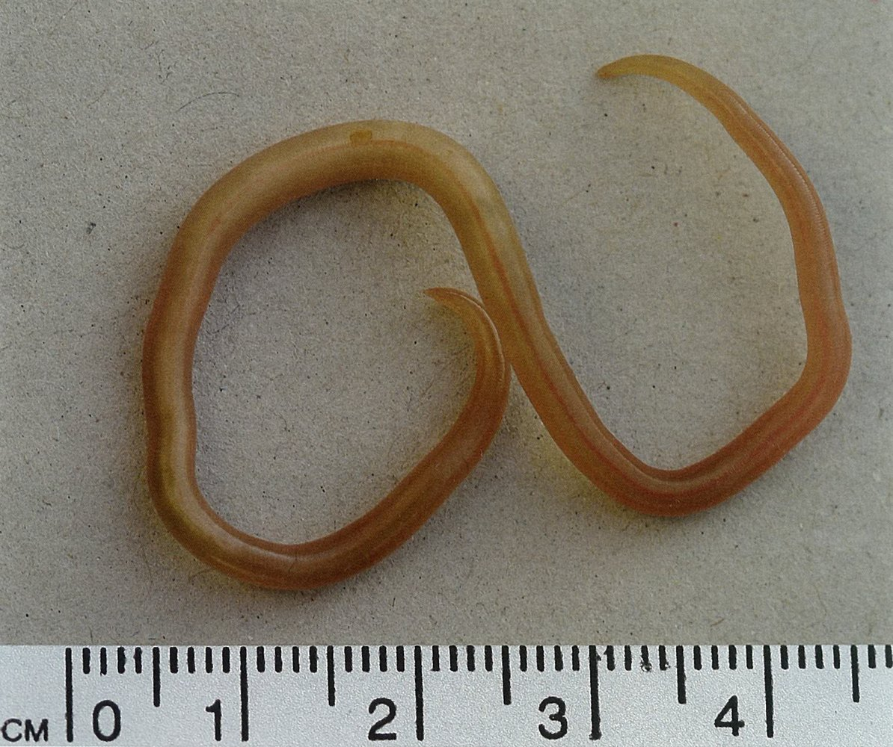

Ascaris lumbricoides (giant roundworm)

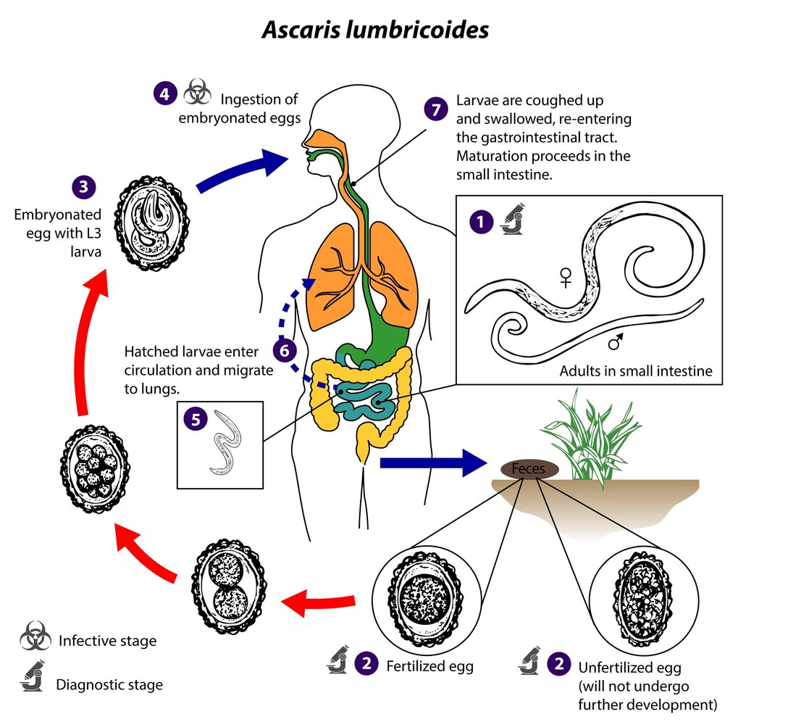

Life cycle of Ascaris lumbricoides (roundworm)

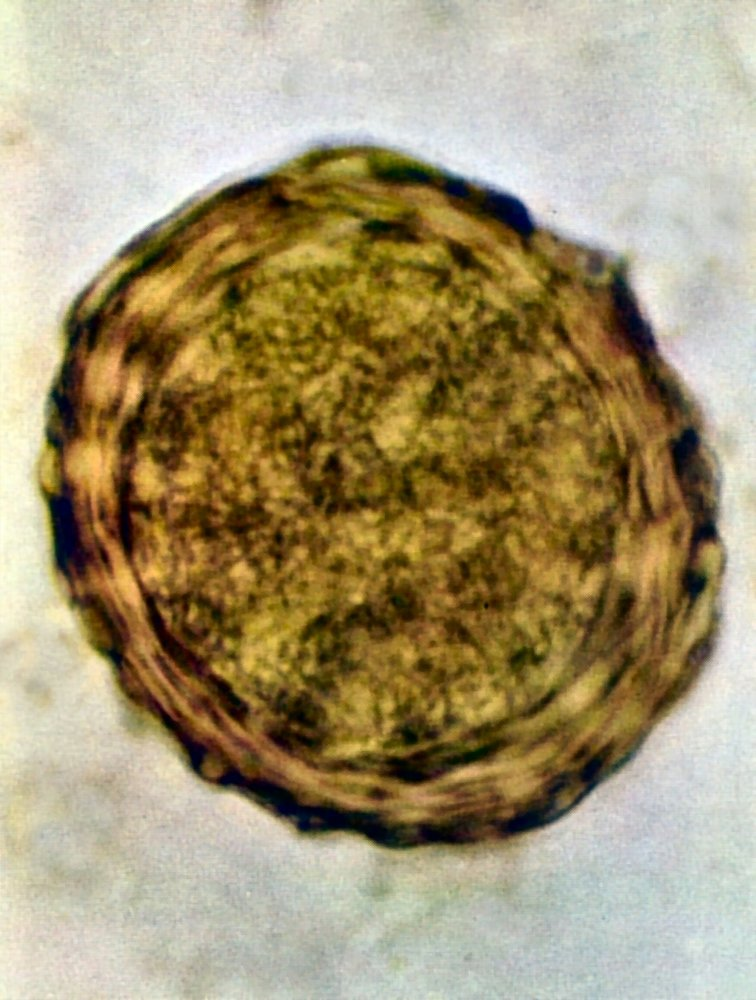

Ascaris lumbricoides fertilized egg

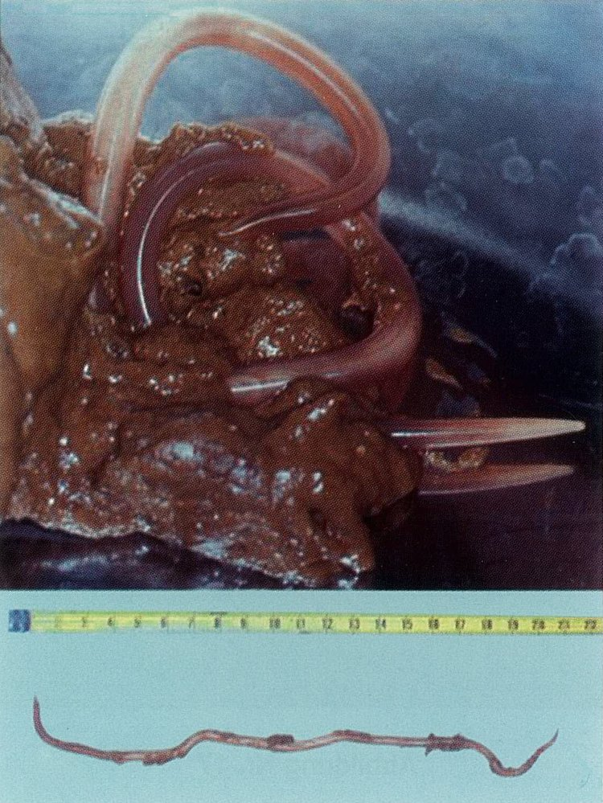

Ascaris lumbricoides (giant roundworm)

---

## Enterobiasis

* <u>Pathogen</u>

* Enterobius vermicularis (<u>pinworm</u>)

* <u>Pinworms</u> are <u>nematodes</u>.

* <u>Epidemiology</u> [[17]](https://coursology-qbank.com/amboss/article/weahaP)

* Most common helminthic infection in the US

* <u>Prevalence</u> in the US: ∼ 12%

* Primarily affects children 5–10 years of age

* Mode of transmission

* Initial infection: fecal-oral

* Reinfection: digital-oral after scratching anal region

* Clinical features

* <u>Anal pruritus</u> (especially at night)

* <u>Vulvovaginitis</u>, especially in children

* Occasionally, symptoms of intestinal infection (i.e., <u>nausea</u>, <u>vomiting</u>, and abdominal <u>pain</u> which may become severe enough to mimic <u>appendicitis</u>)

* Diagnostics [[1]](https://coursology-qbank.com/amboss/article/Ef18LT0)

* Tape test: microscopic detection of oval eggs (<u>ova</u>) and/or <u>pinworms</u> on tape that has been pressed against the perianal region

* Stool examination is not recommended because eggs and worms are rarely found in stool.

* Treatment [[2]](https://coursology-qbank.com/amboss/article/Bedza60)

* <u>Mebendazole</u> (<u>off-label</u>) DOSAGE [[2]](https://coursology-qbank.com/amboss/article/Bedza60)

* OR <u>pyrantel pamoate</u> (<u>off-label</u>) DOSAGE [[2]](https://coursology-qbank.com/amboss/article/Bedza60)

* OR <u>albendazole</u> (<u>off-label</u>) DOSAGE [[2]](https://coursology-qbank.com/amboss/article/Bedza60)

* Prevention [[2]](https://coursology-qbank.com/amboss/article/Bedza60)

* Consider treating the whole household to prevent reinfection.

* Encourage

* Daily hygiene (e.g., bathing, <u>nail</u> <u>clipping</u>, handwashing)

* Frequent washing of bedding and underwear

> [!TIP]
> Enterobius commonly manifests with perianal <u>pruritus</u>.

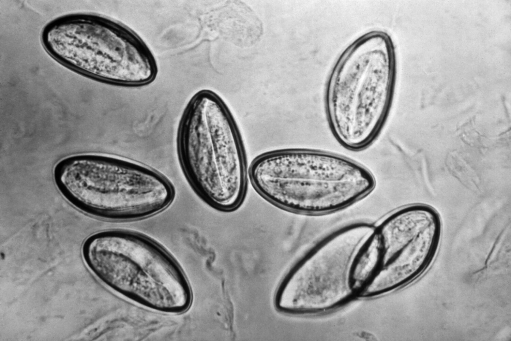

Enterobius vermicularis eggs

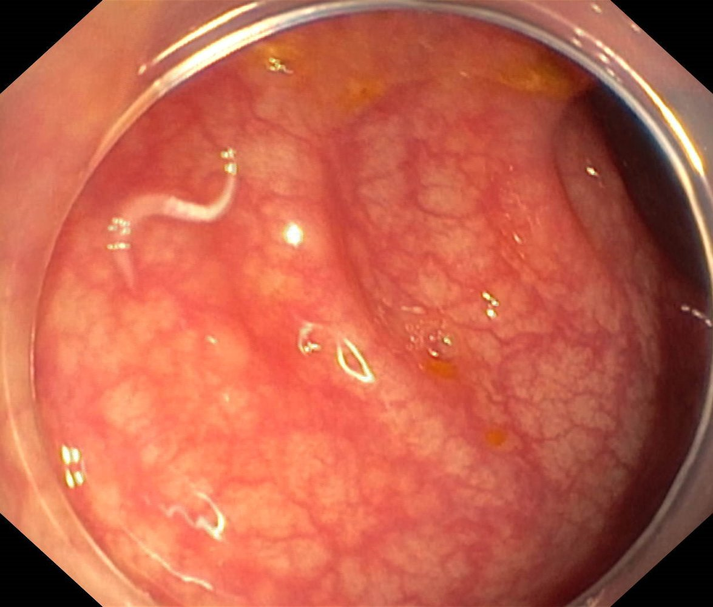

Enterobius vermicularis (pinworm)

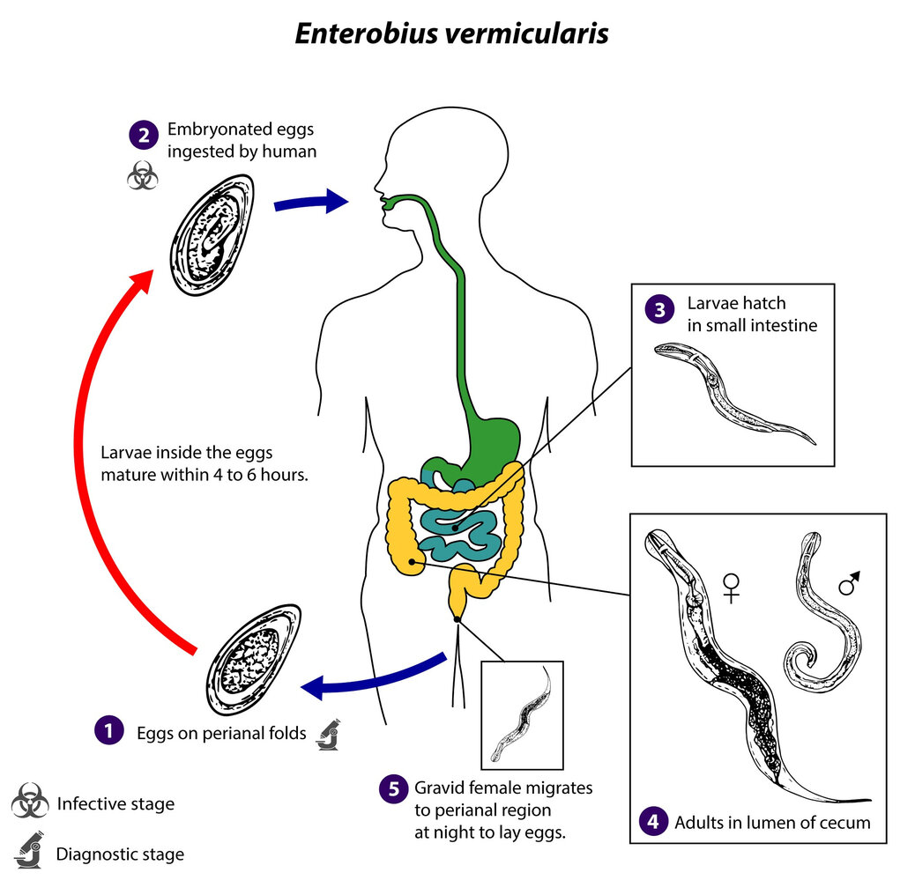

Life cycle of Enterobius vermicularis (pinworm)

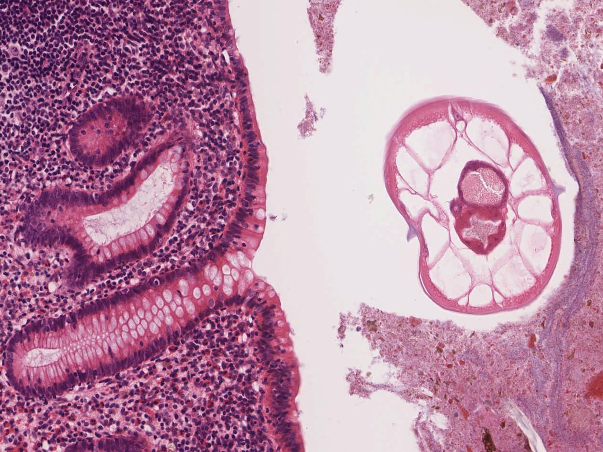

Vermiform appendix with enterobius vermicularis

---

## Trichiuriasis

* <u>Pathogen</u>

* Trichuris trichiura (<u>whipworm</u>)

* <u>Whipworms</u> are <u>nematodes</u>.

* Mode of transmission: : fecal-oral

* Life cycle: Host ingests eggs → Eggs hatch and release larvae in the small intestine → Larvae mature into adult worms in <u>colon</u> → Adult worms lay eggs, which are shed in feces.

* Clinical features

* Mostly asymptomatic

* In children: severe infection causes <u>diarrhea</u>, <u>iron deficiency anemia</u>, growth retardation, <u>rectal prolapse</u>

* Diagnostics [[1]](https://coursology-qbank.com/amboss/article/Ef18LT0)

* Microscopic examination of stool for eggs   [[1]](https://coursology-qbank.com/amboss/article/Ef18LT0)

* <u>Proctoscopy</u> or <u>colonoscopy</u> may reveal adult worms.

* Treatment [[2]](https://coursology-qbank.com/amboss/article/Bedza60)

* <u>Mebendazole</u> DOSAGE [[2]](https://coursology-qbank.com/amboss/article/Bedza60)

* OR <u>albendazole</u> (<u>off-label</u>) DOSAGE  with or without <u>ivermectin</u> (<u>off-label</u>) DOSAGE  [[2]](https://coursology-qbank.com/amboss/article/Bedza60)

* Prevention [[2]](https://coursology-qbank.com/amboss/article/Bedza60)

* Proper hygiene and disposal of human waste

* In high-<u>prevalence</u> areas, <u>chemoprophylaxis</u> for high-risk individuals  [[16]](https://coursology-qbank.com/amboss/article/35dSPq0)

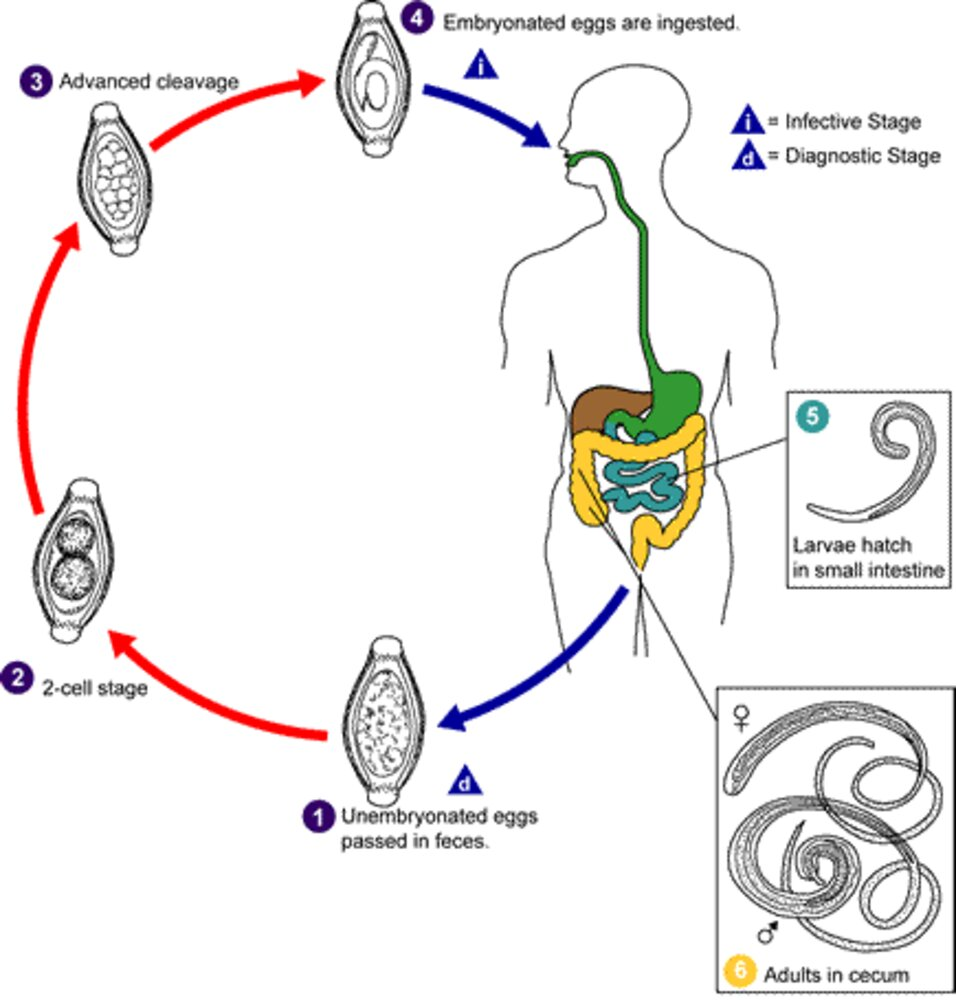

Life cycle of Trichuris trichiura (whipworm)

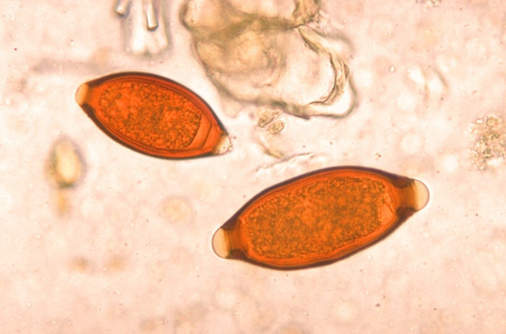

Trichuris trichiura eggs

---

## Toxocariasis

* <u>Pathogen</u>

* <u>Toxocara canis</u> (dog roundworm), <u>Toxocara</u> mystax/<u>Toxocara cati</u> (cat roundworm)

* Toxocara are <u>nematodes</u>.

* Mode of transmission: : fecal-oral (ingestion of <u>Toxocara</u> eggs from an infected dog or cat feces, e.g., in contaminated playground sand or garden soil)   [[18]](https://coursology-qbank.com/amboss/article/ueap0P)

* <u>Incubation period</u>: 2–4 weeks

* Clinical features 

* <u>Visceral toxocariasis</u> (also called <u>visceral larva migrans</u>): caused by larvae migrating through the intestinal wall into the blood and reaching other organs

* <u>Fever</u> and <u>flu-like</u> symptoms

* Additional symptoms depend on the affected organs

* <u>Liver</u>: <u>hepatomegaly</u> and abdominal <u>pain</u>

* <u>Lungs</u>

* <u>Dyspnea</u>, <u>wheezing</u>, <u>cough</u>, <u>pneumonia</u>

* <u>Loeffler syndrome</u>

* <u>Skin</u>: <u>rash</u>

* <u>Heart</u>: <u>myocarditis</u>

* <u>CNS</u> (also called neural larva migrans): <u>seizures</u>, <u>coma</u>

* <u>Ocular toxocariasis</u> (also called <u>ocular larva migrans</u>): caused by larvae migrating into the <u>eye</u>

* Unilateral impairment or loss of <u>vision</u> and resulting <u>strabismus</u>

* <u>Leukocoria</u>

* Inflammation, scarring, and possible detachment of the <u>retina</u>

* Diagnostics [[1]](https://coursology-qbank.com/amboss/article/Ef18LT0)

* <u>CBC</u>: <u>leukocytosis</u> with <u>eosinophilia</u>, <u>anemia</u>

* <u>Hypergammaglobulinemia</u> (↑ serum total <u>IgE</u>)

* <u>Serology</u>: <u>ELISA</u> for <u>Toxocara</u> <u>antibodies</u> in serum or <u>vitreous</u> fluid

* Advanced imaging (e.g., <u>ultrasound</u>, CT, <u>MRI</u>) may show diffuse nodular lesions on the <u>liver</u>.

* Treatment [[2]](https://coursology-qbank.com/amboss/article/Bedza60)

* <u>Albendazole</u> (<u>off-label</u>) DOSAGE [[2]](https://coursology-qbank.com/amboss/article/Bedza60)

* OR <u>mebendazole</u> (<u>off-label</u>) DOSAGE [[2]](https://coursology-qbank.com/amboss/article/Bedza60)

* Specialist consult (e.g., ophthalmology) depending on affected organs

* Prevention [[2]](https://coursology-qbank.com/amboss/article/Bedza60)

* Proper disposal of animal feces

* Deworm animals regularly.

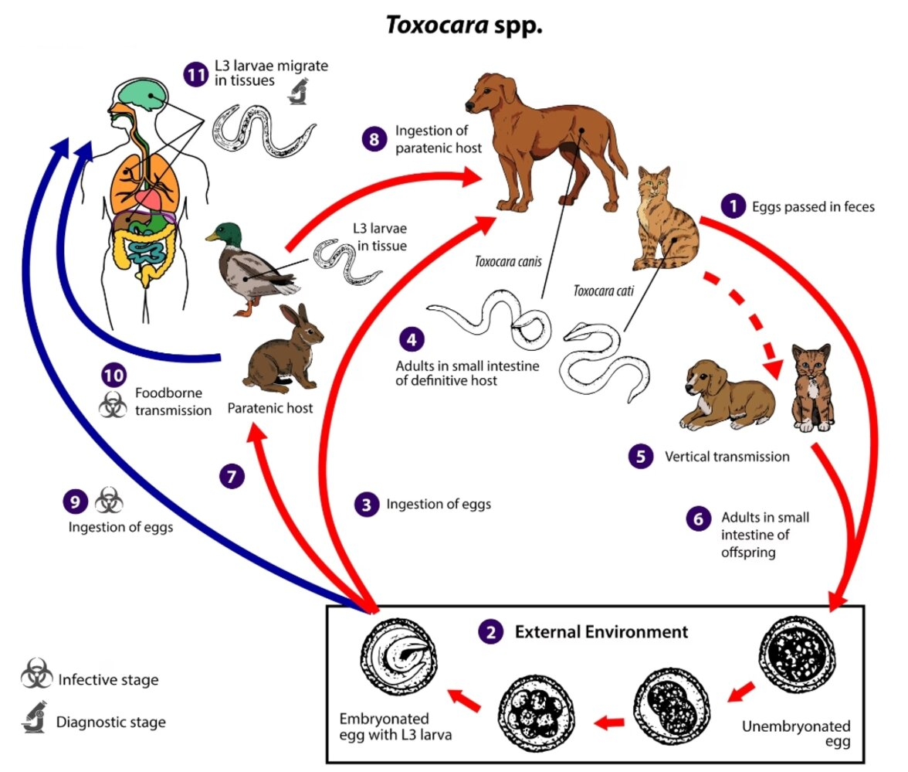

Life cycle of Toxocara spp.

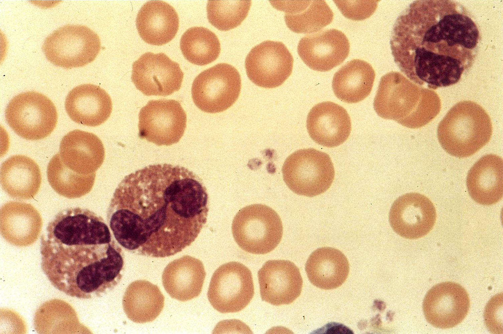

Eosinophilia in toxocariasis

---

## Trichinellosis

* <u>Pathogen</u>

* Trichinella spiralis and other <u>Trichinella</u> spp.

* <u>Trichinella</u> are <u>nematodes</u>.

* Mode of transmission

* Consumption of undercooked meat (especially pork) containing encysted larvae

* Fecal-oral (rarely)

* Life cycle: Host ingests meat that contains cysts → Larvae invade the <u>small bowel</u> <u>mucosa</u> → Larvae develop into adult worms → Adult worms release larvae, which then migrate to muscles, where they encyst.

* <u>Incubation period</u>: 7–30 days [[19]](https://coursology-qbank.com/amboss/article/2xbTDD)

* Clinical features

* <u>Intestinal phase</u> : abdominal <u>pain</u>, <u>diarrhea</u>, <u>nausea</u>, and <u>vomiting</u>

* Muscle phase 

* <u>Myositis</u>: <u>myalgia</u>, muscle swelling, <u>weakness</u>

* <u>Periorbital edema</u>

* Other symptoms include: <u>fever</u>, <u>rash</u>, <u>splinter hemorrhages</u>, retinal and <u>conjunctival</u> hemorrhages, <u>chemosis</u>

* Diagnostics [[1]](https://coursology-qbank.com/amboss/article/Ef18LT0)

* <u>CBC</u>: <u>eosinophilia</u>

* Elevated <u>muscle enzymes</u> (e.g., ↑ <u>creatine kinase</u>, ↑ <u>lactate dehydrogenase</u>)

* <u>Serologic testing</u> for <u>antibodies</u>

* Rarely: muscle <u>biopsy</u>

* Treatment [[2]](https://coursology-qbank.com/amboss/article/Bedza60)

* <u>Albendazole</u> (<u>off-label</u>) DOSAGE [[2]](https://coursology-qbank.com/amboss/article/Bedza60)

* OR <u>mebendazole</u> (<u>off-label</u>) DOSAGE [[2]](https://coursology-qbank.com/amboss/article/Bedza60)

* Consider <u>corticosteroids</u> if symptoms are severe.

* Complications 

* Cardiac: <u>ECG</u> changes (e.g., <u>arrhythmias</u>)

* <u>CNS</u>: <u>meningitis</u>, <u>encephalitis</u>

* Pulmonary: <u>myositis</u> involving respiratory muscles, <u>pneumonia</u>

* Prevention [[2]](https://coursology-qbank.com/amboss/article/Bedza60)

* Cook food thoroughly.

* Known exposure in the previous 6 days: prophylactic treatment

> [!TIP]
> Consider <u>trichinella</u> infection in patients with <u>myositis</u>, <u>periorbital edema</u>, and <u>eosinophilia</u>.

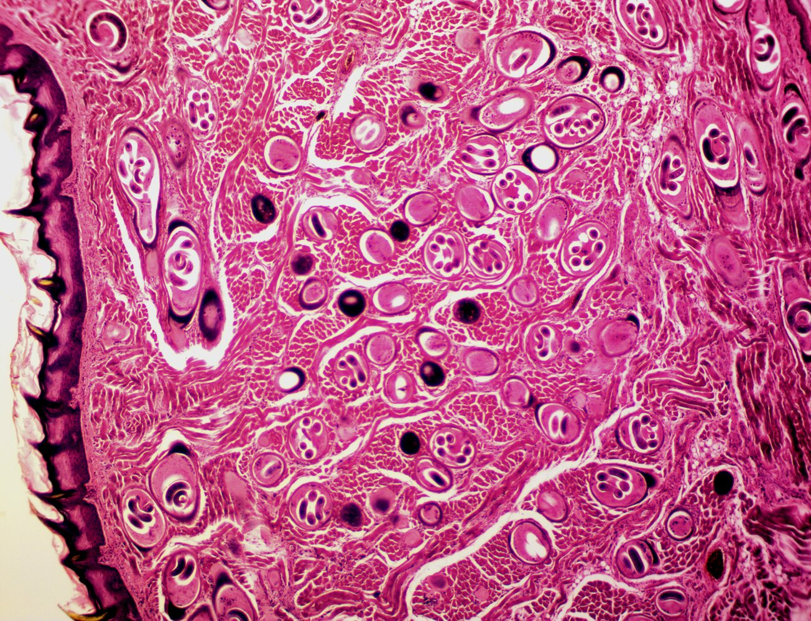

Trichinella spiralis

---

## Hookworm infections (ancylostomiasis; necatoriasis)

* <u>Pathogen</u> [[20]](https://coursology-qbank.com/amboss/article/aUaQbP)

* Human hookworms: Ancylostoma duodenale and Necator americanus

* <u>Zoonotic</u> <u>hookworms</u>, i.e., cat and dog <u>hookworms</u> ; (Ancylostoma braziliense;  and Ancylostoma caninum) can also infect humans.

* <u>Hookworms</u> are <u>nematodes</u>.

* Mode of transmission: percutaneous penetration of larvae (primarily via the feet, e.g., while walking on a beach)

* Life cycle

* Human <u>hookworm</u>: Soil is contaminated with human feces containing <u>hookworm</u> eggs → Eggs hatch and release larvae → Larvae penetrate <u>skin</u> (usually the feet) → Larvae migrate to <u>lungs</u> via blood and lymphatic vessels → Larvae migrate via <u>bronchi</u> and <u>trachea</u> to the <u>larynx</u> → Larvae are expectorated and swallowed back into the intestine → Larvae mature into adult worms that colonize the intestinal tract → Female <u>hookworms</u> lay eggs in the intestine → Eggs are eliminated with the feces.

* <u>Zoonotic</u> <u>hookworms</u> are usually unable to break through the <u>basement membrane</u>;  after entering the human <u>epidermis</u> (humans are accidental intermediate hosts) → Migration through the <u>epidermis</u> for several weeks.

* Clinical features

* Cutaneous symptoms

* At entry site: <u>pruritus</u>, <u>erythema</u>, <u>maculopapular rash</u>

* Cutaneous larva migrans (<u>CLM</u>): serpiginous marks (cutaneous lesion with a progressive, creeping, snake-like border) representing larval tracks

* In <u>zoonotic</u> <u>hookworm infections</u>, only cutaneous symptoms are present.

* Respiratory tract: dry <u>cough</u>, <u>wheezing</u>, <u>Loeffler syndrome</u>

* Intestine: abdominal <u>pain</u>, weight loss, <u>nausea</u>, <u>vomiting</u>, <u>diarrhea</u>

* <u>Microcytic anemia</u> (<u>hookworms</u> ingest blood from the intestinal wall)

* Diagnostics [[1]](https://coursology-qbank.com/amboss/article/Ef18LT0)

* Human <u>hookworms</u>

* <u>CBC</u> may show <u>eosinophilia</u> and <u>microcytic anemia</u>. [[21]](https://coursology-qbank.com/amboss/article/B1dzQK0)

* Microscopic examination of stool for eggs [[22]](https://coursology-qbank.com/amboss/article/qLXCAA)

* <u>Zoonotic</u> <u>hookworms</u>: <u>clinical diagnosis</u> based on visualization of <u>cutaneous larva migrans</u>

* Treatment [[2]](https://coursology-qbank.com/amboss/article/Bedza60)

* Human <u>hookworm</u>

* <u>Albendazole</u> (<u>off-label</u>) DOSAGE [[2]](https://coursology-qbank.com/amboss/article/Bedza60)

* OR <u>mebendazole</u> (<u>off-label</u>) DOSAGE [[2]](https://coursology-qbank.com/amboss/article/Bedza60)

* OR <u>pyrantel pamoate</u> (<u>off-label</u>) DOSAGE [[2]](https://coursology-qbank.com/amboss/article/Bedza60)

* <u>Zoonotic</u> <u>hookworms</u> (<u>cutaneous larva migrans</u>) 

* <u>Albendazole</u> (<u>off-label</u>) DOSAGE [[2]](https://coursology-qbank.com/amboss/article/Bedza60)

* OR <u>ivermectin</u> (<u>off-label</u>) DOSAGE [[2]](https://coursology-qbank.com/amboss/article/Bedza60)

* Prevention [[2]](https://coursology-qbank.com/amboss/article/Bedza60)

* Proper disposal of human and animal waste

* Wear shoes to protect feet from exposure to soil.

* In high-<u>prevalence</u> areas, <u>chemoprophylaxis</u> for high-risk individuals  [[16]](https://coursology-qbank.com/amboss/article/35dSPq0)

> [!TIP]
> Consider <u>hookworm infection</u> in patients who present with a history of recent travel to a tropical country and <u>microcytic anemia</u>.

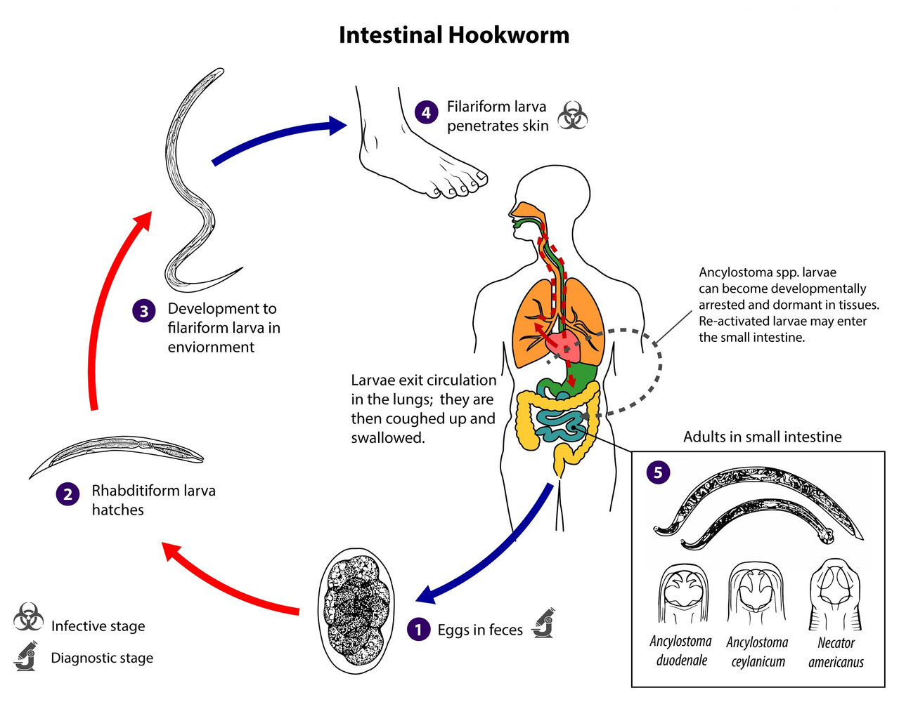

Life cycle of intestinal hookworms

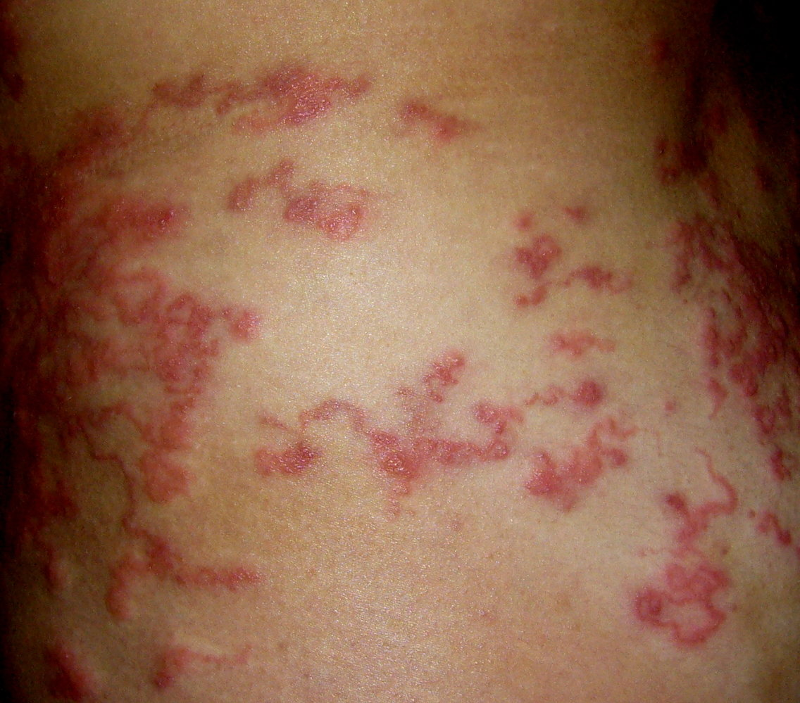

Cutaneous larva migrans

---

## Loiasis

* <u>Pathogen</u>: Loa loa, a <u>filarial</u> <u>nematode</u> [[23]](https://coursology-qbank.com/amboss/article/lQYvwK)[[24]](https://coursology-qbank.com/amboss/article/NQY-wK)

* Mode of transmission: bite from Chrysops (deer fly), horse fly, mango fly

* Life cycle: Introduction of larvae into bite wound → Larvae mature into adult worms → Adult worms reside in <u>subcutaneous tissue</u>, migrating through the body and causing symptoms → Adult worms produce <u>microfilariae</u> and release them into the bloodstream, where they are ingested by a female fly during a blood meal → <u>Microfilariae</u> mature into larvae, thus completing the cycle.

* <u>Incubation period</u>: 3–5 months

* Clinical features

* Most infected individuals are asymptomatic.

* The two cardinal manifestations are:

* Calabar swelling: transient, localized swellings found commonly on the arms, legs, and around <u>joints</u>, which can cause <u>pruritus</u> and local <u>pain</u>

* Ocular manifestation (<u>eye worm</u>): <u>Loa loa</u> has a tendency to migrate to the subconjunctival tissue of the <u>eye</u> where it causes <u>self-limiting</u> congestion, <u>pruritus</u>, and <u>pain</u>.

* Diagnostics [[25]](https://coursology-qbank.com/amboss/article/Scaybj)

* Initial test: <u>CBC</u> may show <u>eosinophilia</u>.

* <u>Confirmatory tests</u>

* <u>Blood smear</u>: detection of <u>microfilariae</u>

* Visualization of adult worms in <u>subcutaneous tissue</u> or <u>conjunctivae</u>

* Treatment: <u>diethylcarbamazine</u> (<u>off-label</u>; prescribed by a specialist) [[2]](https://coursology-qbank.com/amboss/article/Bedza60)

* Complications

* <u>Encephalitis</u>

* <u>Cardiomyopathy</u>

* Nephropathy

* <u>Arthritis</u>

* <u>Lymphadenitis</u>

* Prevention

* <u>Prevention of insect bites</u> [[26]](https://coursology-qbank.com/amboss/article/i5dJPq0)

* Weekly prophylactic <u>diethylcarbamazine</u> for long-term travelers in <u>endemic</u> areas [[27]](https://coursology-qbank.com/amboss/article/Q5duPq0)

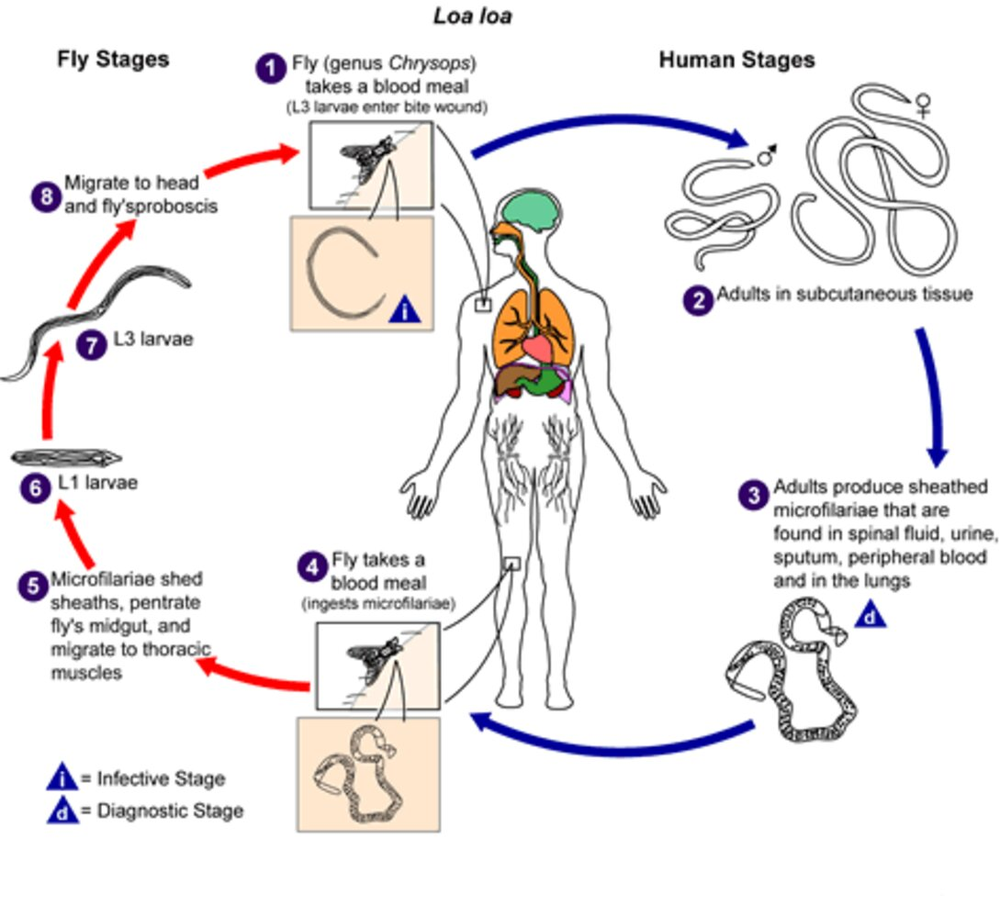

Life cycle of Loa loa

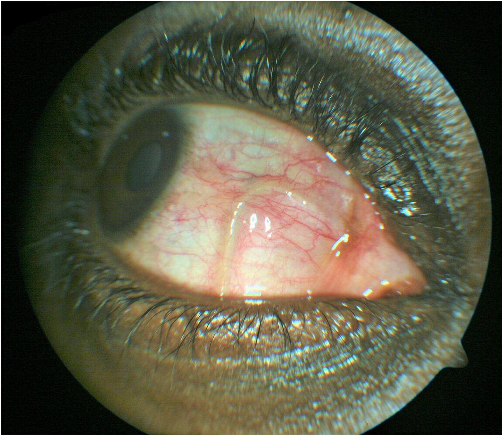

Subconjunctival Loa loa infestation

---

## Onchocerciasis

* <u>Pathogen</u>: Onchocerca volvulus  [[23]](https://coursology-qbank.com/amboss/article/lQYvwK)[[28]](https://coursology-qbank.com/amboss/article/MQYM9K)

* Mode of transmission: bite of the female blackfly

* Life cycle: Host is bitten by blackfly → Larvae are introduced into bite wound → Larvae mature into adult worms that reside in subcutaneous or intramuscular tissue → Adult worms produce <u>microfilariae</u> → <u>Microfilariae</u> migrate through <u>subcutaneous tissue</u>, causing clinical symptoms → Female fly consumes <u>microfilariae</u> during a blood meal → <u>Microfilariae</u> mature into larvae, thus completing the cycle.

* Clinical features

* Ocular <u>onchocerciasis</u>

* <u>Keratitis</u>

* <u>Uveitis</u>

* <u>Optic atrophy</u>

* Onchochorioretinitis

* Ocular lesions can progress to blindness (hence the common name <u>river blindness</u>)

* Onchocercal <u>skin</u> disease

* Onchocercomata (subcutaneous <u>nodules</u>): deep, nonpalpable <u>nodules</u> containing adult worms that are found over various bony prominences

* Generalized pruritic lesions

* <u>Hyperpigmented</u> <u>papules</u> (sowda)

* <u>Skin</u> <u>atrophy</u> (due to loss of <u>skin</u> elasticity)

* Hanging groin

* Depigmentation (leopard-<u>skin</u> appearance)

* Systemic manifestations

* <u>Allergic reactions</u> to <u>microfilariae</u> may occur

* Weight loss

* Generalized musculoskeletal complaints (e.g., back and <u>joint</u> <u>pain</u>)

* Inguinal and <u>femoral hernia</u>

* Diagnostics [[1]](https://coursology-qbank.com/amboss/article/Ef18LT0)[[29]](https://coursology-qbank.com/amboss/article/z1drjK0)

* Skin snips (<u>gold standard</u>): <u>superficial</u> <u>skin biopsies</u> are taken from an inflamed area and incubated in salinefor 24 hours, causing <u>microfilariae</u> to leave the <u>skin</u> sample. <u>Microfilarial</u> load can be determined microscopically.

* At least two specimens are sampled and examined for motile <u>microfilariae</u>.

* Specimens of subcutaneous <u>nodules</u> can also be sampled and examined for adult worms.

* <u>Slit-lamp examination</u>: investigation of choice for ocular <u>onchocerciasis</u>

* Mazzotti test: a provocative test that involves administering <u>diethylcarbamazine</u> (<u>DEC</u>) to induce <u>microfilarial</u> <u>death</u> and exacerbate symptoms. A positive test is highly suggestive of <u>onchocerciasis</u>.

* <u>Serology</u>: unreliable for diagnosis as it cannot distinguish between active and past infection

* Treatment [[2]](https://coursology-qbank.com/amboss/article/Bedza60)

* <u>Microfilariae</u>: <u>ivermectin</u> DOSAGE [[2]](https://coursology-qbank.com/amboss/article/Bedza60)

* Macrofilariae (adult worms): <u>doxycycline</u> (<u>off-label</u>) DOSAGE [[2]](https://coursology-qbank.com/amboss/article/Bedza60)

* Prevention [[2]](https://coursology-qbank.com/amboss/article/Bedza60)

* <u>Prevention of insect bites</u>

* Mass treatment programs in <u>endemic</u> areas

> [!WARNING]
> Treating patients with <u>onchocerciasis</u> and <u>loiasis</u> <u>coinfection</u> places patients at risk for fatal <u>encephalopathy</u>; consult infectious diseases to help guide management. [[1]](https://coursology-qbank.com/amboss/article/Ef18LT0)

> [!NOTE]
> Everything turns black in <u>onchocerciasis</u>: black flies, black <u>skin nodules</u>, black <u>vision</u> (blindness).

> [!NOTE]
> Treat rIVER blindness with IVERmectin.

---

## Lymphatic filariasis

* Pathogens

* Wuchereria bancrofti: a <u>nematode</u>; responsible for most cases of <u>lymphatic filariasis</u> worldwide

* Brugia malayi and Brugia timori: found in Asia

* Mode of transmission: female mosquito bite (Aedes, Mansonia, Anopheles, and Culex)

* <u>Incubation period</u>: 9–12 months

* Life cycle: Mosquito introduces <u>filarial</u> larvae into host via bite wound → Larvae mature into adult worms that reside in the lymphatic system → Adult worms produce microfilariae (the blood circulating stage of <u>filariasis</u>-causing <u>roundworms</u>) → <u>microfilariae</u> move throughout vascular and lymphatic system → <u>microfilariae</u> are consumed by a female mosquito during a blood meal → <u>microfilariae</u> mature into larvae, thus completing the cycle.

* Clinical features

* <u>Fever</u>

* Painful <u>lymphadenopathy</u> (due to worms invading <u>lymph nodes</u>, causing inflammation) ;   and retrograde <u>lymphangitis</u> → <u>lymphedema</u> with disfiguration of the lower extremities (<u>elephantiasis</u>)

* <u>Hydrocele</u>

* Diagnostics [[1]](https://coursology-qbank.com/amboss/article/Ef18LT0)

* <u>Blood smear</u> obtained at night (with <u>Giemsa stain</u> or H&E stain): detection of <u>microfilariae</u>

* <u>Serology</u>: elevated levels of antifilarial IgG4

* Treatment [[2]](https://coursology-qbank.com/amboss/article/Bedza60)

* <u>Diethylcarbamazine</u> (<u>off-label</u>; prescribed by a specialist)

* <u>Diethylcarbamazine</u> can worsen <u>eye</u> disease in <u>onchocerciasis</u> and/or <u>loiasis</u> <u>coinfection</u>.

* Complications [[1]](https://coursology-qbank.com/amboss/article/Ef18LT0)

* <u>Lymphedema</u>

* <u>Hydrocele</u>

* Prevention [[2]](https://coursology-qbank.com/amboss/article/Bedza60)

* <u>Prevention of insect bites</u>

* Mass treatment programs in <u>endemic</u> areas

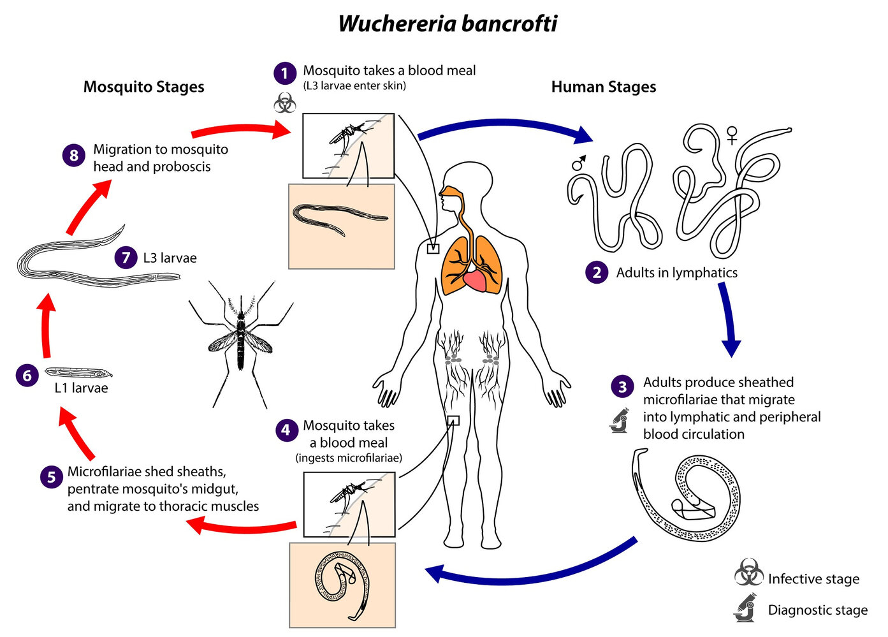

Life cycle of Wuchereria bancrofti

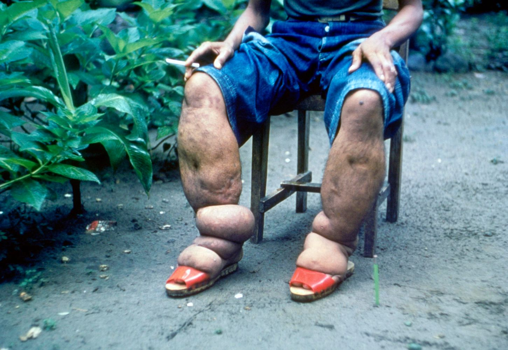

Elephantiasis from lymphatic filariasis

---

## Cestodes (tapeworms)

<u>Cestodes</u> (<u>tapeworms</u>) are long, flat, ribbon-like worms composed of numerous segments and a single scolex at the head, which they use to anchor themselves to the intestine. Since they do not have a digestive tract, all <u>nutrients</u> are absorbed through the tegument. <u>Cestodes</u> are hermaphroditic.

|  Overview of cestode infections [[1]](https://coursology-qbank.com/amboss/article/Ef18LT0)  |  |  |  |  |  |  |
| --- | --- | --- | --- | --- | --- | --- |
| Disease |  | <u>Pathogen</u> | Mode of transmission | Clinical features | Diagnosis | Treatment |
| <u>Taeniasis</u> | <u>Intestinal taeniasis</u> |   * <u>Taenia saginata</u> (beef <u>tapeworm</u>)  * <u>Taenia solium</u> (<u>pork tapeworm</u>)    |  * Consumption of undercooked beef or pork   |   * Mostly asymptomatic  * GI symptoms  * Abdominal <u>pain</u>  * <u>Nausea</u>, <u>vomiting</u>  * Weight loss    |   * Eggs or <u>proglottids</u> in stool  * <u>Eosinophilia</u>    |  * <u>Praziquantel</u>   |
| <u>Cysticercosis</u> |  * <u>Taenia solium</u> (<u>pork tapeworm</u>)   |  * Fecal-oral   |   * Neurological symptoms:  * ↑ <u>Intracranial pressure</u>  * Neurological deficits  * <u>Seizures</u>  * Ocular symptoms  * <u>Pain</u>  * Loss of <u>visual acuity</u>  * Loss of <u>vision</u>    |   * CT and/or <u>MRI</u> <u>brain</u> with multiple unilocular cysts  * <u>CSF</u>: ↑ protein, ↓ <u>glucose</u>, <u>lymphocytic</u> and/or eosinophilic <u>pleocytosis</u>  * <u>Serologic testing</u> (e.g., <u>enzyme-linked immunoelectrotransfer blot</u>, <u>ELISA</u>)    |   * <u>Antiparasitic therapy</u> (e.g., <u>praziquantel</u>, <u>albendazole</u>)  * <u>Corticosteroids</u>    |  |
| <u>Diphyllobothriasis</u> |  |  * <u>Dibothriocephalus latus</u> (<u>fish tapeworm</u>)   |  * Consumption of raw or undercooked freshwater fish   |   * Mostly asymptomatic  * <u>Vitamin B12 deficiency</u>    |   * Eggs or <u>proglottids</u> in stool  * <u>Eosinophilia</u>  * <u>Megaloblastic anemia</u>    |  * <u>Praziquantel</u>   |
| <u>Echinococcosis</u> |  |  * <u>Echinococcus</u> granulosis   |   * Fecal-oral  * Hoofed animals (e.g., sheep) are intermediate hosts.    |   * GI symptoms  * <u>Nausea</u>  * <u>Vomiting</u>  * Abdominal <u>pain</u>  * <u>Anaphylaxis</u> with cyst rupture    |   * <u>ELISA</u>  * CT/<u>MRI</u>  * <u>Eggshell calcifications</u> within <u>hydatid cyst</u>    |   * <u>Albendazole</u>  * Surgical removal of cysts  * Percutaneous <u>aspiration</u> and injection of protoscolicidal medication    |
| <u>Hymenolepiasis</u> |  |   * <u>Hymenolepis nana</u> (<u>dwarf tapeworm</u>)  * Hymenolepis diminuta (rat <u>tapeworm</u>)    |  * Ingestion of eggs or cysticercoids   |   * Mostly asymptomatic  * GI symptoms  * <u>Anorexia</u>  * Abdominal <u>pain</u>  * <u>Diarrhea</u>  * <u>Headache</u>    |  * Eggs in stool   |   * <u>Praziquantel</u>  * OR <u>nitazoxanide</u>    |
|  <u>Dipylidiasis</u> [[2]](https://coursology-qbank.com/amboss/article/Bedza60)[[33]](https://coursology-qbank.com/amboss/article/J3Vsj80)[[34]](https://coursology-qbank.com/amboss/article/S3Vy380)  |  |  * Dipylidium caninum (<u>flea</u> <u>tapeworm</u>)   |  * Ingestion of an <u>intermediate host</u> (<u>flea</u> or, less commonly, <u>louse</u>) containing infective cysticercoid larvae   |   * Typically asymptomatic  * Passage of <u>proglottids</u> is the most common sign.  * Symptoms may include:  * <u>Anal pruritus</u> and resulting excoriations  * <u>Bloating</u>  * <u>Sleep</u> disturbances    |  * <u>Proglottids</u> or characteristic egg packets in stool   |   * Typically <u>self-limited</u>  * <u>Praziquantel</u>    |

---

## Taenia infections

|  Overview of <u>Taenia infections</u> [[2]](https://coursology-qbank.com/amboss/article/Bedza60) |  |  |
| --- | --- | --- |
|  | Intestinal taeniasis |  Cysticercosis [[35]](https://coursology-qbank.com/amboss/article/zearYP) |
| Description |  * An intestinal infection with adult <u>tapeworms</u> that causes mainly GI symptoms   |  * A tissue infection with <u>tapeworm</u> larvae. Symptoms depend on the infected organ (e.g., muscles, <u>brain</u>, <u>skin</u>).   |
| <u>Pathogen</u> |   * Taenia saginata (beef <u>tapeworm</u>)  * Taenia solium (<u>pork tapeworm</u>)    |  * <u>Taenia solium</u> (<u>pork tapeworm</u>)   |
| Mode of transmission |  * Ingestion of larvae (cysticerci) in raw or undercooked beef/pork   |  * Fecal-oral: eggs are ingested from contaminated water or vegetables   |
| Life cycle |  * Eggs hatch in the human intestine → Develop into adult worms → Produce <u>proglottids</u> which can detach from the <u>tapeworm</u> and are passed in the feces.   |  |
| Clinical features |   * Often asymptomatic  * Symptoms caused by adult worms in the intestinal tract: abdominal <u>pain</u>, <u>anorexia</u>, weight loss, <u>nausea</u>, and <u>vomiting</u>    |   * Often asymptomatic  * Symptoms caused by <u>cysticerci</u> accumulation in <u>subcutaneous tissue</u>, muscles, <u>brain</u>, spinal cord, and eyes   * Palpable subcutaneous cysts  * <u>Myalgia</u>  * Neurocysticercosis (<u>cysticerci</u>-containing cysts in the <u>CNS</u>): <u>increased intracranial pressure</u>, neurological deficits, <u>seizures</u>  * Ocular <u>cysticercosis</u>: <u>eye pain</u>, loss of <u>visual acuity</u> or <u>vision</u> in one <u>eye</u>    |
| Diagnosis |   * <u>CBC</u>: <u>eosinophilia</u> [[36]](https://coursology-qbank.com/amboss/article/-1dDjK0)  * Stool examination for eggs or worms [[1]](https://coursology-qbank.com/amboss/article/Ef18LT0)    |   * <u>CBC</u>: <u>eosinophilia</u> [[36]](https://coursology-qbank.com/amboss/article/-1dDjK0)  * CT and/or <u>MRI</u> <u>brain</u>: multiple unilocular cysts   * Early findings: cysts with an invaginated <u>scolex</u>  * Late findings: calcified cysts  * <u>CSF</u>: ↑ protein, ↓ <u>glucose</u>, <u>lymphocytic</u> and/or eosinophilic <u>pleocytosis</u> [[37]](https://coursology-qbank.com/amboss/article/ZWdZPK0)  * <u>Serologic testing</u> (e.g., <u>enzyme-linked immunoelectrotransfer blot</u>, <u>ELISA</u>)    |
|   Treatment[[2]](https://coursology-qbank.com/amboss/article/Bedza60) |   * <u>Praziquantel</u> (<u>off-label</u>) DOSAGE [[2]](https://coursology-qbank.com/amboss/article/Bedza60)  * OR <u>albendazole</u> (<u>off-label</u>) DOSAGE [[2]](https://coursology-qbank.com/amboss/article/Bedza60)    |   * Requires multidisciplinary collaboration with subspecialists (e.g., infectious diseases, neurosurgery, ophthalmology)  * Treatment is complex and may include:  * <u>Antiparasitic therapy</u>, e.g., <u>praziquantel</u> (<u>off-label</u>), <u>albendazole</u>  * <u>Corticosteroids</u>  * Surgical removal of cysts  * <u>Hydrocephalus management</u>  * <u>Acute seizure management</u>    |
|   Prevention[[2]](https://coursology-qbank.com/amboss/article/Bedza60) |   * Avoid raw pork and beef; inspect for <u>cysticerci</u>.  * Adequately freeze and cook meat to destroy viable <u>cysticerci</u>.  * Dispose of human feces properly.  * Wash hands before meal preparation.    |  |

> [!TIP]
> <u>Cysticercosis</u> can cause <u>brain</u> cysts and <u>seizures</u>.

---

## Diphyllobothriasis

* <u>Pathogen</u> [[38]](https://coursology-qbank.com/amboss/article/WUaPXP)

* Dibothriocephalus latus (<u>fish tapeworm</u>; formerly <u>Diphyllobothrium latum</u>)

* Fish <u>tapeworms</u> are <u>cestodes</u>.

* Mode of transmission: consumption of raw or undercooked freshwater fish containing larvae

* Life cycle: Larvae develop into adult <u>tapeworms</u> in the small intestine → Adult worms produce <u>proglottids</u>, which can detach from the <u>tapeworm</u> and are passed in the feces.

* Clinical features

* Usually asymptomatic

* Chronic infection leads to <u>vitamin B12 deficiency</u>: fish <u>tapeworms</u> compete with the host for dietary <u>vitamin B12</u> in the intestine → <u>anemia</u> and/or neurological symptoms

* Diagnostics [[1]](https://coursology-qbank.com/amboss/article/Ef18LT0)

* Initial test: <u>CBC</u> may show <u>eosinophilia</u> and <u>megaloblastic anemia</u>. [[39]](https://coursology-qbank.com/amboss/article/0WdePK0)

* <u>Confirmatory test</u>: stool examination for eggs or <u>proglottids</u> (i.e., segments of adult <u>tapeworms</u>)

* Treatment: <u>praziquantel</u> (<u>off-label</u>) DOSAGE [[2]](https://coursology-qbank.com/amboss/article/Bedza60)

* Prevention: thoroughly cook fish [[2]](https://coursology-qbank.com/amboss/article/Bedza60)

> [!TIP]
> Dibothriocephalus causes <u>vitamin B12 deficiency</u>.

---

## Trematodes (flukes)

<u>Trematodes</u> (<u>flukes</u>) are small, flat, oval worms with two suckers (one located at the mouth and the other ventrally) and a blind-ending gut. Most species are hermaphroditic, but some also form separate male and female adults.

|  Overview of trematode infections [[1]](https://coursology-qbank.com/amboss/article/Ef18LT0)  |  |  |  |  |  |  |
| --- | --- | --- | --- | --- | --- | --- |
| Disease |  | <u>Pathogen</u> | Mode of transmission | Clinical features | Diagnosis |  Treatment [[2]](https://coursology-qbank.com/amboss/article/Bedza60)  |
| <u>Schistosomiasis</u> |  |   * <u>Schistosoma mansoni</u>  * <u>Schistosoma haematobium</u>  * <u>Schistosoma japonicum</u>    |   * Penetration of the <u>skin</u> by a larva  * Freshwater snails are intermediate hosts    |   * Pruritic <u>maculopapular rash</u> (<u>swimmer's itch</u>)  * GU symptoms  * <u>Hematuria</u>  * <u>Dysuria</u>  * Can cause <u>bladder carcinoma</u>  * GI symptoms  * <u>Diarrhea</u>  * Abdominal <u>pain</u>  * <u>Hepatosplenomegaly</u>  * <u>Periportal fibrosis</u> and <u>portal hypertension</u>  * Pulmonary symptoms  * <u>Pulmonary hypertension</u>  * <u>Cor pulmonale</u>    |   * Eggs in stool or urine  * <u>Serology</u>  * <u>Eosinophilia</u>    |   * <u>Praziquantel</u>  * <u>Corticosteroids</u>  * See “Treatment” in “<u>Schistosomiasis</u>.”    |
| <u>Clonorchiasis</u> |  |  * <u>Clonorchis sinensis</u>   |  * Consumption of raw/undercooked freshwater fish   |   * Mostly asymptomatic  * <u>Cholangitis</u>, <u>cholelithiasis</u>  * GI symptoms  * <u>RUQ</u> abdominal <u>pain</u>  * <u>Diarrhea</u>  * <u>Jaundice</u>  * Increased risk of <u>cholangiocarcinoma</u>    |   * Eggs in stool  * <u>Eosinophilia</u>    |   * <u>Praziquantel</u>  * OR <u>albendazole</u>    |
| <u>Paragonimiasis</u> |  |   * <u>Paragonimus westermani</u>  * <u>Paragonimus</u> mexicanus  * <u>Paragonimus</u> kellicoti  * <u>Paragonimus</u> heterotremus  * <u>Paragonimus</u> africanus    |   * Consumption of raw/undercooked seafood  * Utilization of contaminated cooking utensils    |   * Mostly asymptomatic  * Possibly <u>prodromal</u> GI symptoms  * Pulmonary form  * Mild <u>fever</u>, night sweats  * Productive <u>cough</u>, <u>hemoptysis</u>  * <u>Pleural effusions</u>  * Extrapulmonary form  * Possibly cysts, <u>abscess</u>, and/or <u>granuloma</u> formation  * Cerebral <u>paragonimiasis</u>    |   * Eggs in <u>sputum</u> or stool  * <u>Eosinophilia</u>  * <u>ELISA</u>  * <u>Chest x-ray</u>    |   * <u>Praziquantel</u>  * OR <u>triclabendazole</u>    |
| <u>Fascioliasis</u> |  |   * <u>Fasciola hepatica</u>  * Fasciola gigantica    |  * Consumption of contaminated freshwater plants   |   * Acute phase  * <u>Fever</u>  * <u>Right upper quadrant</u> <u>pain</u>  * <u>Hepatomegaly</u>  * Chronic biliary phase  * Abdominal <u>pain</u>  * <u>Nausea</u>, <u>vomiting</u>  * <u>Diarrhea</u>  * <u>Common bile duct</u> obstruction    |   * Eggs in stool  * <u>ELISA</u>  * <u>Eosinophilia</u>  * Endoscopy: adult <u>flukes</u> in the <u>biliary tract</u>    |   * <u>Triclabendazole</u>  * OR <u>nitazoxanide</u>  * <u>Biliary obstruction</u>: GI consult and <u>ERCP</u>    |
|  <u>Dicrocoeliasis</u> [[41]](https://coursology-qbank.com/amboss/article/O3VIi80)[[42]](https://coursology-qbank.com/amboss/article/g3VF380)  |  |   * Dicrocoelium dendriticum  * Dicrocoelium hospes    |  * Consumption of infected ants   |   * Typically asymptomatic  * High <u>fluke</u> burden  * Abdominal <u>pain</u>  * Symptoms related to chronic <u>cholangitis</u> (e.g., weight loss, fatigue)  * <u>Symptoms of acute cholecystitis</u>  * Subcutaneous <u>nodules</u> containing <u>flukes</u> (rare)    |   * Fully embryonated eggs in stool  * Spurious infection can occur from consuming infected animal <u>liver</u>.  * Repeat stool examination after a <u>liver</u>-free diet for at least 3 days.  * Persistence of eggs: true infection  * Absence of eggs: spurious infection    |  * Treat only true infection with:  * <u>Praziquantel</u>  * OR <u>triclabendazole</u>   |
|  <u>Opisthorchiasis</u> [[43]](https://coursology-qbank.com/amboss/article/k3Vmi80)[[44]](https://coursology-qbank.com/amboss/article/c3Vah80)  |  |   * Opisthorchis viverrini  * Opisthorchis felineus    |  * Consumption of raw or undercooked freshwater fish   |   * Typically asymptomatic  * Acute phase: similar to <u>Katayama fever</u> (primarily with O. felineus infection)  * Mild or early infection: nonspecific symptoms (e.g., <u>RUQ</u> abdominal <u>pain</u>, <u>dyspepsia</u>, <u>anorexia</u>)  * Chronic or severe infection: <u>hepatomegaly</u>, <u>malnutrition</u>, <u>jaundice</u>, tenderness on <u>liver palpation</u>    |   * Eggs in stool  * <u>PCR</u> of stool samples for species differentiation  * Imaging to assess for organ damage and complications  * Adult <u>flukes</u> may be recovered during <u>surgery</u>.    |   * <u>Praziquantel</u> (preferred)  * OR <u>albendazole</u> (alternative)    |

---

## Clonorchiasis

* <u>Pathogen</u>

* Clonorchis sinensis (<u>Chinese liver fluke</u>)

* Clonorchis are <u>trematodes</u> (<u>flukes</u>).

* <u>Endemic</u> to certain parts of Asia

* Mode of transmission: consumption of raw/undercooked freshwater fish

* <u>Incubation period</u>: 10–26 days [[45]](https://coursology-qbank.com/amboss/article/fxbkDD)

* Life cycle: Water is contaminated with human feces containing Clonorchis eggs  → Eggs are ingested by freshwater snails and mature into larvae → Larvae are released to water and penetrate fish → Humans eat fish containing larvae → Larvae migrate to <u>biliary tract</u> and mature into adult worms → Eggs of adult worms are released into the <u>bile</u> ducts and carried to the intestinal tract → Eggs are eliminated with the feces, thus completing the cycle.

* Clinical features

* Most infected individuals are asymptomatic.

* Acute symptoms

* <u>Cholangitis</u>

* Unspecific symptoms (e.g., <u>right upper quadrant</u> <u>pain</u>, <u>diarrhea</u>, fatigue)

* Chronic symptoms and complications

* <u>Cholelithiasis</u> with <u>pigmented gallstones</u>

* <u>Hepatomegaly</u>

* <u>Malnutrition</u>, weight loss

* <u>Jaundice</u>

* <u>Risk factor</u> for <u>cholangiocarcinoma</u>

* Diagnostics [[25]](https://coursology-qbank.com/amboss/article/Scaybj)

* <u>CBC</u>: <u>eosinophilia</u> [[46]](https://coursology-qbank.com/amboss/article/Ned-_K0)

* Microscopic examination of stool for eggs

* Identification of adult worms on <u>ERCP</u> or during <u>surgery</u>

* Treatment [[2]](https://coursology-qbank.com/amboss/article/Bedza60)

* <u>Praziquantel</u> DOSAGE [[2]](https://coursology-qbank.com/amboss/article/Bedza60)

* OR <u>albendazole</u> (<u>off-label</u>) DOSAGE [[2]](https://coursology-qbank.com/amboss/article/Bedza60)

* Prevention: thoroughly cook seafood [[2]](https://coursology-qbank.com/amboss/article/Bedza60)

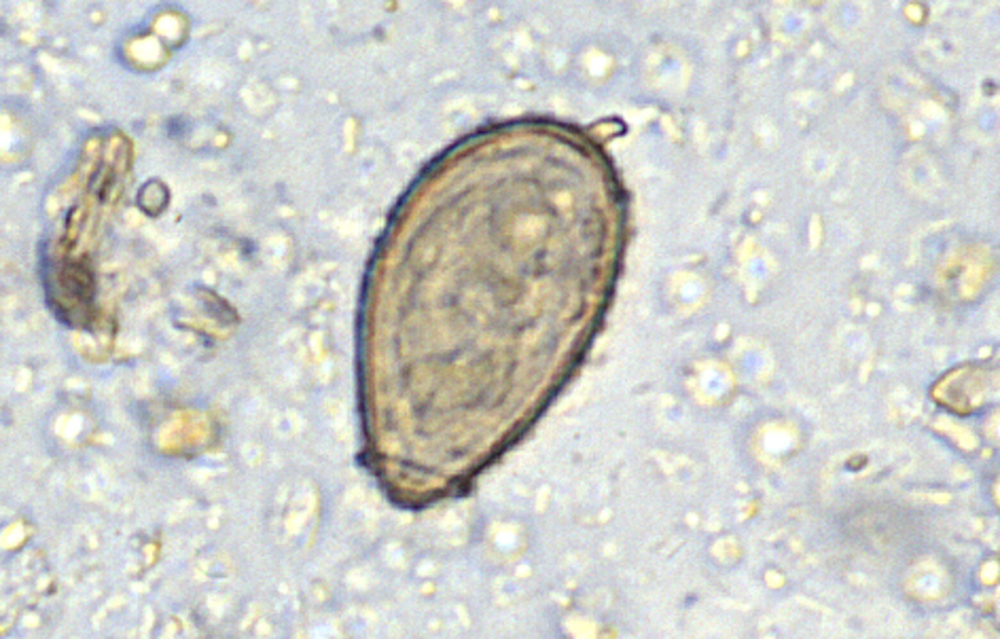

Clonorchis sinensis egg

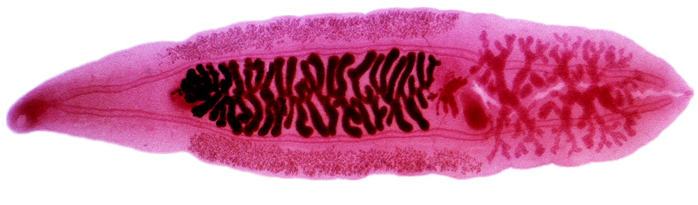

Adult Clonorchis sinensis

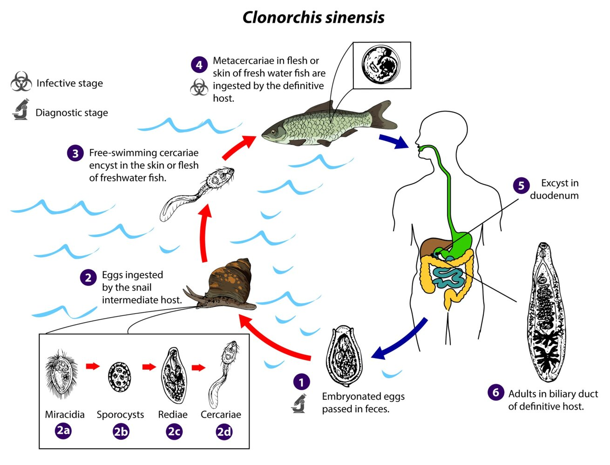

Life cycle of Clonorchis sinensis (Chinese liver fluke)

---