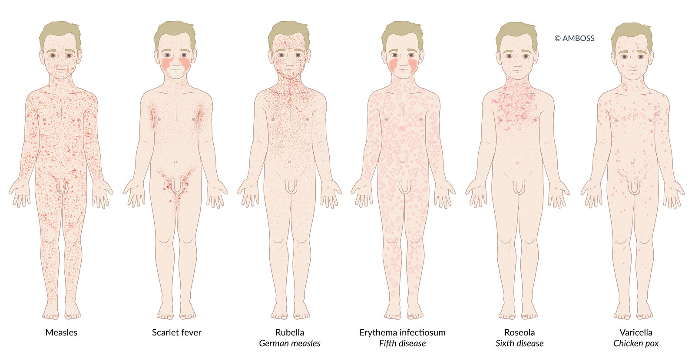
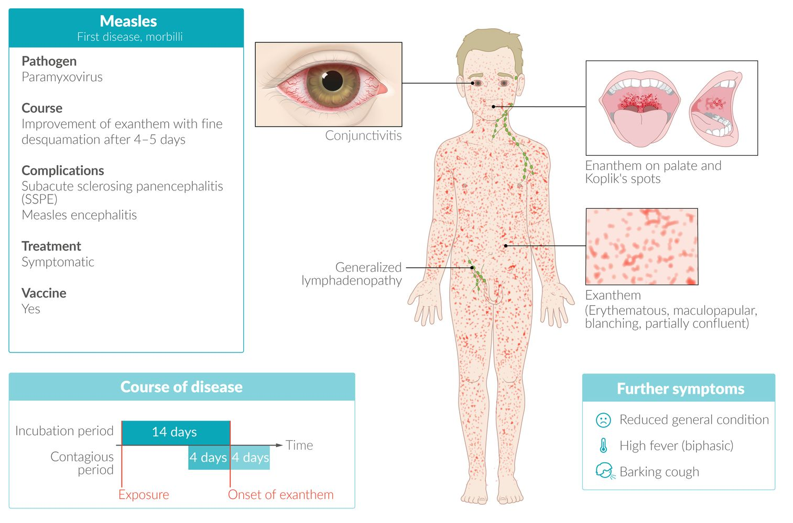
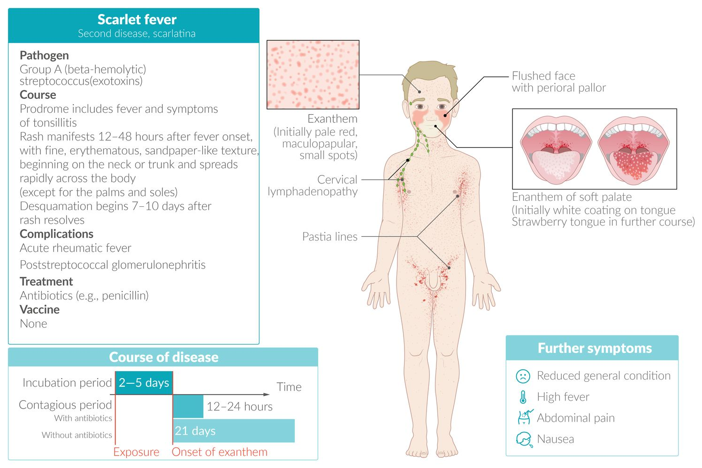
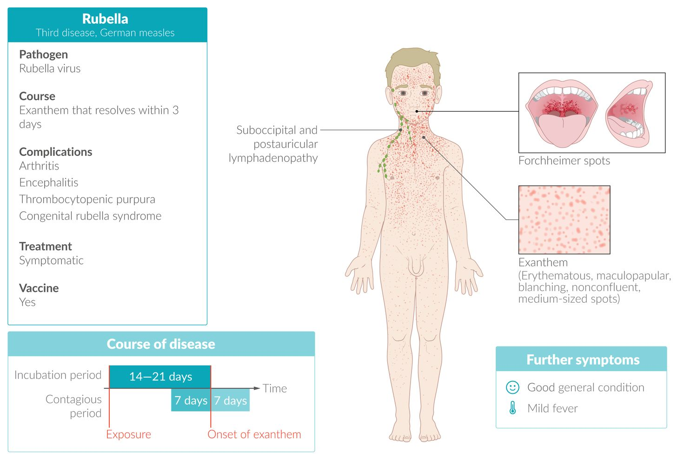
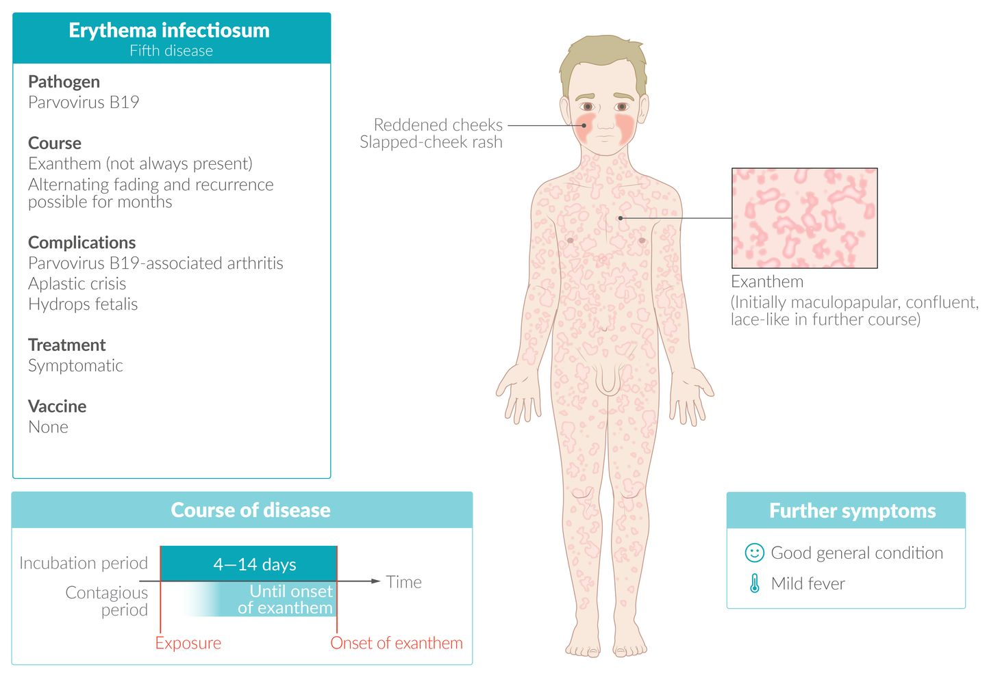
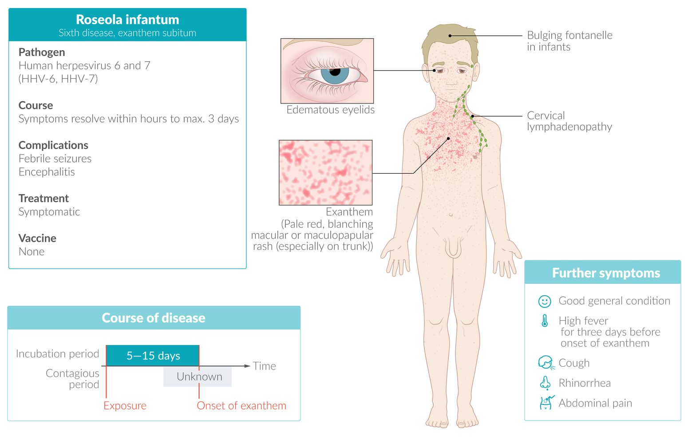
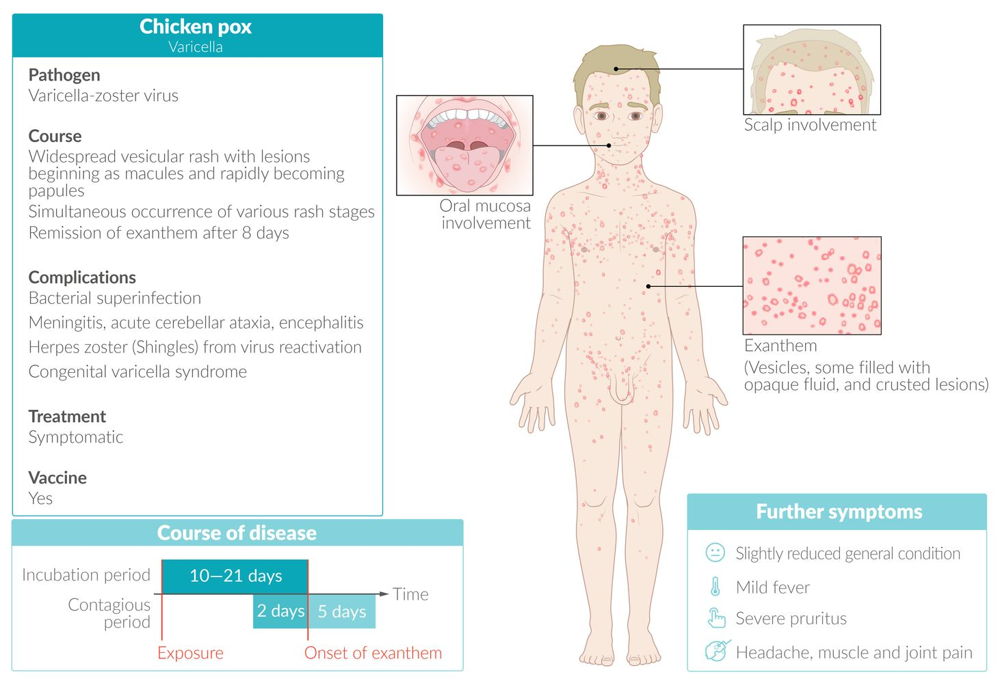

# Infectious rashes in childhood

*Categories: Clinical knowledge > Neurology > Infectious diseases > Infectious rashes in childhood*

[Original Article Link](https://coursology-qbank.com/amboss/article/QH0uJh)

---

## Summary

Infectious rashes are common in children and are caused by <u>viruses</u>, bacteria, fungi, or <u>parasites</u>. In acutely ill patients, perform <u>initial management of rash</u> to identify <u>red flags for a life-threatening rash</u>. A detailed history and <u>skin examination</u> are essential in all patients, as infectious rashes can often be <u>diagnosed clinically</u>. Diagnostic testing may be obtained to confirm certain diagnoses (e.g., <u>measles</u>, <u>rubella</u>, bacterial or <u>fungal infections</u>) and to exclude alternative diagnoses in case of diagnostic uncertainty. Management is based on the underlying cause. Most viral infections are managed with <u>supportive care</u>. Pharmacological treatment with <u>antibiotics</u>, antivirals, or <u>ectoparasiticides</u> may be indicated depending on the causative organism.

For information on rashes associated with congenital infections, see “<u>Congenital TORCH infections</u>.” For more information on each specific infection, see the respective articles.

Pediatric Rashes – Part 1: Diagnosis

---

## Common causes

|  Common causes of infectious rash in children [[1]](https://coursology-qbank.com/amboss/article/Bedza60)[[2]](https://coursology-qbank.com/amboss/article/rXdfzo0)[[7]](https://coursology-qbank.com/amboss/article/iG1J_R0)[[8]](https://coursology-qbank.com/amboss/article/lPWvUl0)  |  |  |  |
| --- | --- | --- | --- |
|  Disease (<u>pathogen</u>) | Characteristic clinical features |  | Management |
|  <u>Measles</u>   (<u>Measles virus</u>)  |  |   * <u>Prodrome</u>  * <u>Coryza</u>, <u>cough</u>, and <u>conjunctivitis</u>  * <u>Koplik spots</u>  * <u>Fever</u>  * <u>Erythematous</u>, blanching <u>rash</u> with <u>macules</u> and <u>papules</u>   * Begins on the face, frequently behind the <u>ears</u>  * Spreads to the rest of the body  * Possible desquamation    |   * <u>Airborne precautions</u>  * <u>Serology</u> or <u>PCR</u> to confirm the diagnosis  * <u>Supportive care</u>  * <u>Vitamin A</u> supplementation in selected patients  * See “<u>Management of measles</u>.”    |
|  <u>Scarlet fever</u>   (<u>Streptococcus pyogenes</u>)  |  |   * <u>Prodrome</u> of <u>fever</u>, tonsillopharyngitis  * Fine, <u>erythematous</u> blanching <u>rash</u> with <u>macules</u> and <u>papules</u> (sandpaper-like texture)  * Begins on the neck or trunk and spreads rapidly across the body  [[9]](https://coursology-qbank.com/amboss/article/DHb1sE)  * Desquamation 7–10 days after <u>rash</u> resolves  * <u>Strawberry tongue</u>  * <u>Pastia lines</u>  * Flushed cheeks, perioral <u>pallor</u>    |   * <u>Rapid strep test</u> or throat culture to confirm the diagnosis  * <u>Antibiotics for GAS pharyngitis</u>  * See “<u>Treatment of scarlet fever</u>.”    |
|  <u>Rubella</u>   (<u>Rubella virus</u>)  |  |   * <u>Prodrome</u>   * Mild nonspecific symptoms, low-grade <u>fever</u>  * Suboccipital and postauricular <u>lymphadenopathy</u>  * <u>Forchheimer sign</u>  * Fine, <u>erythematous</u> <u>rash</u> with <u>macules</u> and <u>papules</u>   * Begins on the face and spreads to the trunk and extremities  * Nonconfluent, medium-sized spots    |   * <u>Droplet precautions</u>  * <u>Serology</u> or <u>PCR</u> to confirm the diagnosis  * See “<u>Management of rubella</u>.”    |
|  <u>Fifth disease</u> (<u>erythema infectiosum</u>)   (<u>Parvovirus B19</u>)  |  |   * <u>Prodrome</u> of systemic symptoms, <u>arthralgias</u>  * Initial slapped cheek appearance  * <u>Rash</u> on trunk and extremities  * <u>Macules</u> and <u>papules</u> that become confluent (lace-like, reticular appearance)  * May recur with environmental changes (e.g., sunlight, heat exposure) over weeks to months    |   * <u>Clinical diagnosis</u>  * Supportive management  * See “<u>Management of parvovirus B19 infection</u>.”    |
|  <u>Roseola infantum</u> (<u>exanthem subitum</u>)   (<u>Human herpesvirus 6</u>)  |  |   * <u>Prodrome</u>  * Sudden high <u>fever</u> for 3–7 days  * <u>Nagayama spots</u>  * Patchy, blanching rose-pink <u>rash</u> with <u>macules</u> and <u>papules</u>  * Develops as <u>fever</u> subsides  * Originates on the trunk    |   * <u>Clinical diagnosis</u>  * <u>Supportive care</u>  * Management of complications (e.g., <u>febrile seizures</u>)  * See “<u>Treatment of roseola infantum</u>.”    |
|  <u>Chickenpox</u> (<u>varicella</u>)   (<u>Varicella zoster virus</u>)  |  |  * Starry sky: simultaneous occurrence of various stages of <u>rash</u> (e.g., pruritic <u>vesicles</u> on <u>erythematous</u> base, crusted <u>pustules</u>)  * Starts centrally (trunk, face) and spreads to extremities  * <u>Mucous membrane</u> involvement (typically oropharyngeal, possibly urogenital)   |   * <u>Clinical diagnosis</u>  * <u>Supportive care</u>  * <u>Antiviral therapy for VZV infection</u> in selected patients  * See “<u>Treatment of chickenpox</u>.”    |
|  <u>Hand, foot, and mouth disease</u> (Group A <u>Coxsackievirus</u>)  |  |   * Painful oral <u>ulcers</u>  * <u>Rash</u> with <u>macules</u> and <u>papules</u>   * Becomes <u>vesicular</u>  * Affects feet and hands    |   * <u>Clinical diagnosis</u>  * <u>Supportive care</u>    |
|  <u>Impetigo</u> [[10]](https://coursology-qbank.com/amboss/article/FYdgIo0) (<u>Streptococcus pyogenes</u>,  <u>Staphylococcus aureus</u>)  |  |   * <u>Papules</u> that evolve into <u>vesicles</u> and/or <u>pustules</u>  * <u>Honey-colored crust</u>  * Most common on the face and extremities  * Negative <u>Nikolsky sign</u>    |   * <u>Clinical diagnosis</u>  * <u>Antibiotics</u>  * See “<u>Treatment of impetigo</u>.”    |

> [!TIP]
> <u>Measles</u> and <u>rubella</u> are nationally <u>notifiable diseases</u> in the US. Notify the local health department of any suspected cases. [[1]](https://coursology-qbank.com/amboss/article/Bedza60)

Infectious rashes in children

Measles fact sheet

Scarlet fever fact sheet

Rubella fact sheet

Erythema infectiosum (fifth disease) fact sheet

Roseola infantum (sixth disease) fact sheet

Chickenpox fact sheet

---