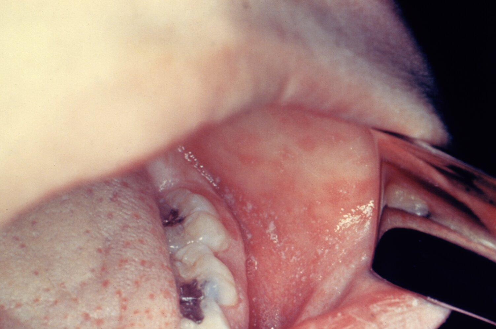
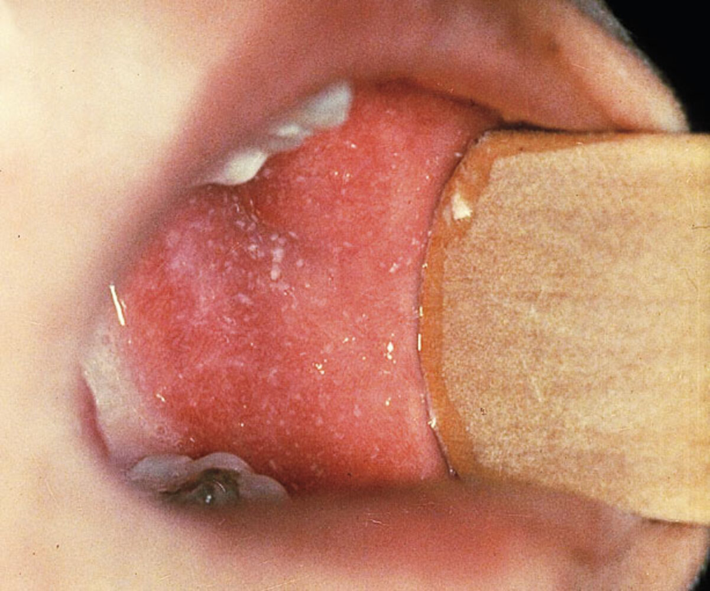
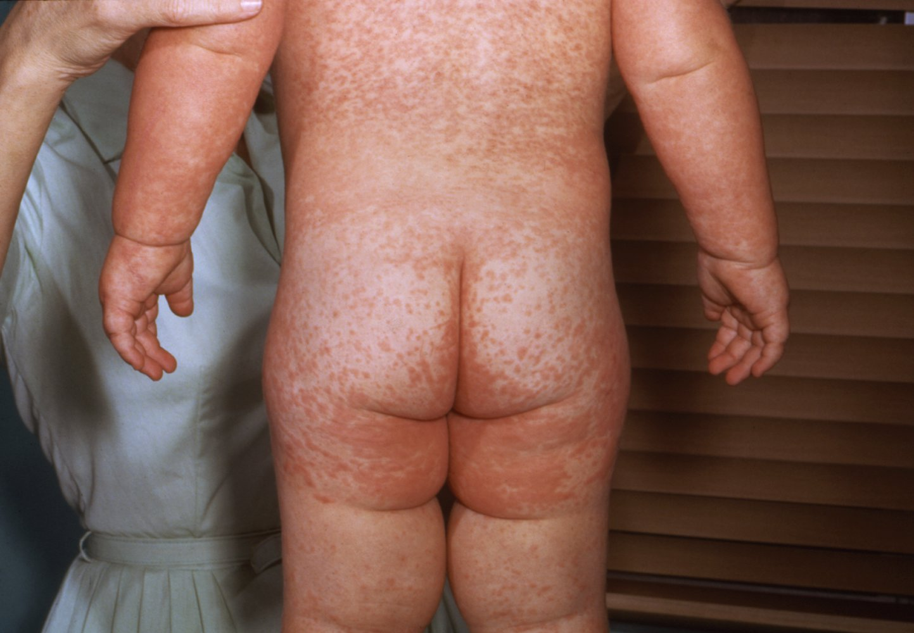
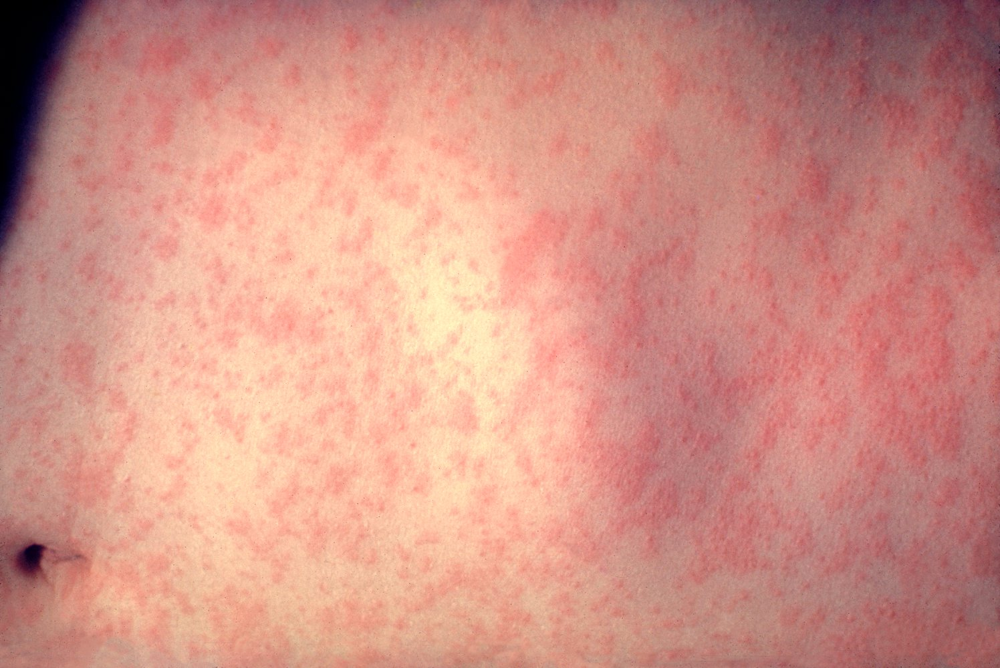
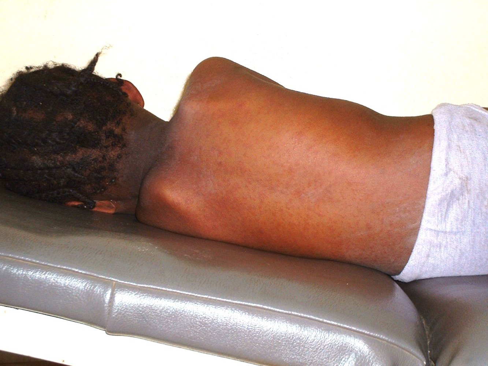
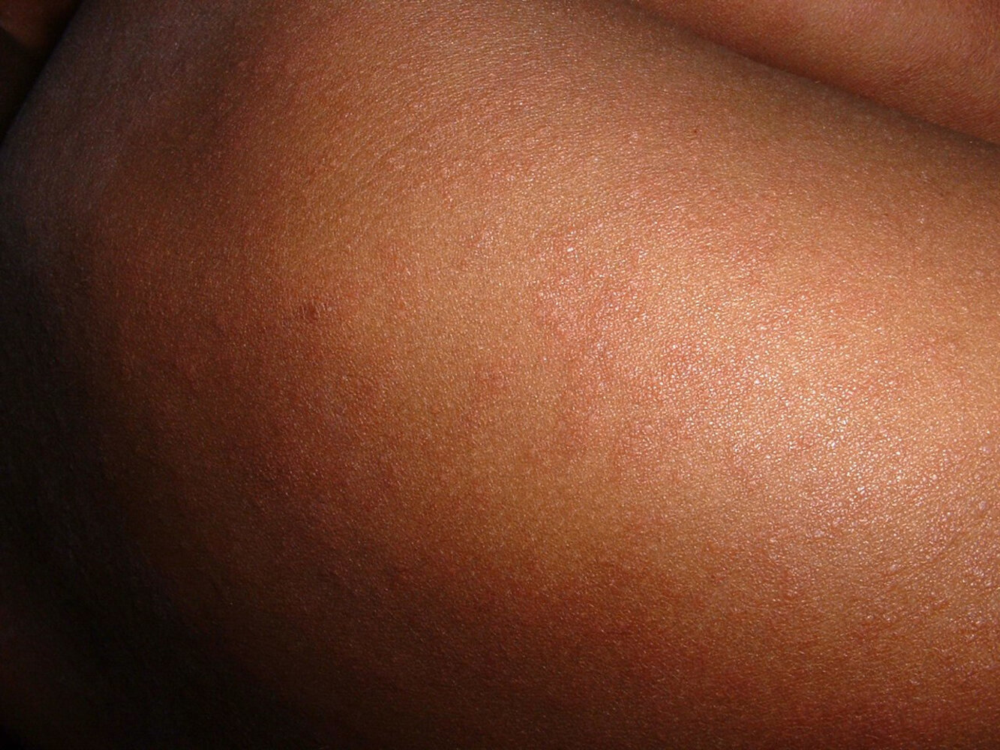
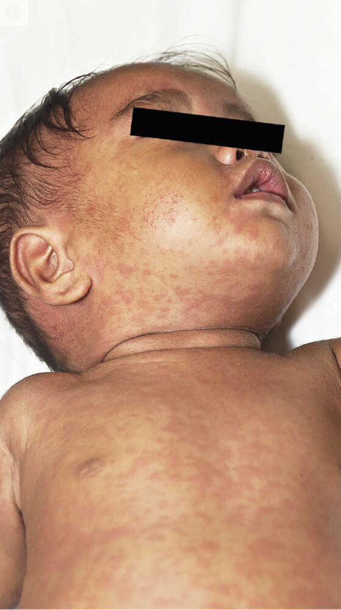
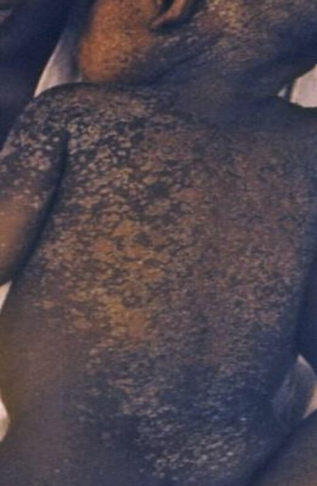

# Measles

*Categories: Clinical knowledge > Neurology > Infectious diseases > Measles*

[Original Article Link](https://coursology-qbank.com/amboss/article/r40fkT)

---

## Summary

Measles (rubeola) is a highly infectious disease caused by the <u>measles virus</u>. There are three phases of disease: a <u>prodromal</u> stage, an <u>exanthem</u> stage, and a recovery stage. The <u>prodromal</u> stage is characterized by a high-grade <u>fever</u> with <u>conjunctivitis</u>, <u>coryza</u>, <u>cough</u>, and <u>pathognomonic</u> <u>Koplik spots</u> on the buccal <u>mucosa</u>. The <u>exanthem</u> stage is characterized by an <u>erythematous</u> <u>maculopapular rash</u> that originates at the hairline and spreads from the face and neck to the rest of the body. The combination of <u>RT-PCR</u> and <u>serology</u> for measles-specific <u>IgM antibodies</u> is preferred to confirm active disease. Treatment is supportive, including <u>vitamin A</u> supplementation to decrease the risk of complications. Prognosis is usually good, but measles may lead to complications such as <u>subacute sclerosing panencephalitis</u>, <u>encephalitis</u>, otitis, or <u>pneumonia</u>; complications are most common in young children, adults, and <u>immunocompromised individuals</u>. <u>Postexposure prophylaxis</u> is available. <u>Routine immunization</u> with the <u>MMR vaccine</u> or <u>MMRV vaccine</u> is recommended for all children and for adults without evidence of <u>immunity</u>.

Measles fact sheet

---

## Etiology

* <u>Pathogen</u>: <u>measles virus</u> (MV), an <u>RNA virus</u> of the <u>Morbillivirus</u> genus belonging to the <u>Paramyxoviridae</u> family

* Route of transmission: direct contact with or inhalation of <u>virus</u>-containing droplets [[1]](https://coursology-qbank.com/amboss/article/FWagMj)

* <u>Infectivity</u> [[1]](https://coursology-qbank.com/amboss/article/FWagMj)

* ∼ 90%

* Highly contagious 4 days before and up to 4 days after the onset of <u>exanthem</u>. .

* <u>Incubation period</u>: ∼ 2 weeks after infection

---

## Clinical features

### <u>Prodromal</u> stage [[5]](https://coursology-qbank.com/amboss/article/ScdybK0)[[6]](https://coursology-qbank.com/amboss/article/gcdFbK0)[[7]](https://coursology-qbank.com/amboss/article/Bedza60)

* Duration: ≤ 7 days [[6]](https://coursology-qbank.com/amboss/article/gcdFbK0)

* Presentation

* <u>Coryza</u>, <u>cough</u>, and <u>conjunctivitis</u>

* <u>Fever</u> that gradually increases to ≤ 40.6°C (≤ 105°F) [[6]](https://coursology-qbank.com/amboss/article/gcdFbK0)

* Koplik spots  

* <u>Pathognomonic</u> <u>maculopapular</u> <u>enanthem</u> of the buccal <u>mucosa</u>

* Several tiny white or blue-white spots on an irregular <u>erythematous</u> background  [[8]](https://coursology-qbank.com/amboss/article/wWahnj)

* Manifest 1–2 days before the <u>exanthem</u> stage [[6]](https://coursology-qbank.com/amboss/article/gcdFbK0)

> [!NOTE]
> The most important findings of measles are the 3 Cs and 1 K: Coryza, Cough, Conjunctivitis, and Koplik spots.

Koplik spots

Koplik spots

### <u>Exanthem</u> stage [[5]](https://coursology-qbank.com/amboss/article/ScdybK0)[[6]](https://coursology-qbank.com/amboss/article/gcdFbK0)[[7]](https://coursology-qbank.com/amboss/article/Bedza60)

* Duration: develops 3–7 days after the <u>prodromal</u> stage and lasts 4–7 days [[5]](https://coursology-qbank.com/amboss/article/ScdybK0)

* Presentation

* <u>Erythematous</u> <u>maculopapular rash</u> that is initially blanching and can be confluent on the face and upper body ;  [[8]](https://coursology-qbank.com/amboss/article/wWahnj)

* Begins behind the <u>ears</u> along the hairline

* Disseminates from the head to the rest of the body (palm and sole involvement is rare)

* Recedes in the same order as it appeared

* Desquamation may occur.

* <u>Generalized lymphadenopathy</u>

* <u>Anorexia</u>

Measles rash

Measles rash

Measles rash

Measles rash

Measles rash

Measles rash

### Recovery stage

<u>Cough</u> may persist for up to 10 days. [[8]](https://coursology-qbank.com/amboss/article/wWahnj)

---

## Management

### Initial management [[6]](https://coursology-qbank.com/amboss/article/gcdFbK0)[[7]](https://coursology-qbank.com/amboss/article/Bedza60)[[9]](https://coursology-qbank.com/amboss/article/4cd3cK0)

Suspect acute infection in a patient with typical <u>clinical features of measles</u>.

* Isolate patient and institute <u>standard precautions</u> and <u>airborne precautions</u>.

* Ensure that only <u>health care professionals</u> with <u>evidence of measles immunity</u> provide direct care to the patient.

* Notify the local health department immediately of suspected measles.

* Determine disposition.

* Severe disease (e.g., <u>complications of measles</u>): Admit to hospital. [[10]](https://coursology-qbank.com/amboss/article/AN1Rdh0)

* Other patients: Manage at home while awaiting results of testing.

> [!WARNING]
> Measles is a nationally <u>notifiable disease</u> in the US; immediately report all suspected and confirmed cases to the local health department.

### Diagnostics for measles [[6]](https://coursology-qbank.com/amboss/article/gcdFbK0)[[7]](https://coursology-qbank.com/amboss/article/Bedza60)[[9]](https://coursology-qbank.com/amboss/article/4cd3cK0)

Obtain and interpret diagnostic studies in all patients in coordination with the health department.

#### Studies

* All patients: <u>serology</u> for measles-specific <u>IgM</u> and <u>IgG antibodies</u>

* Patients presenting ≤ 10 days (ideally ≤ 3 days) after <u>rash</u> onset: [[9]](https://coursology-qbank.com/amboss/article/4cd3cK0)

* <u>RT-PCR</u> of a <u>nasopharyngeal</u> or throat swab

* If presenting close to day 10 after <u>rash</u> onset, also consider <u>RT-PCR</u> of a urine sample.  [[9]](https://coursology-qbank.com/amboss/article/4cd3cK0)

#### Interpretation of results

The following applies to patients with clinical suspicion for measles.

* Confirmatory results include any of the following:

* Positive <u>RT-PCR</u> or viral culture  [[9]](https://coursology-qbank.com/amboss/article/4cd3cK0)

* Positive measles-specific <u>IgM antibodies</u>  [[9]](https://coursology-qbank.com/amboss/article/4cd3cK0)

* A 4-fold increase in measles-specific <u>IgG antibodies</u> seen on two serum samples taken ∼ 2 weeks apart, starting from symptom onset [[9]](https://coursology-qbank.com/amboss/article/4cd3cK0)

* Results that cannot rule out acute infection include:

* A single negative measles-specific <u>IgM</u> test collected:

* Within the first 3 days of <u>rash</u> onset (if generalized <u>rash</u> persists for > 3 days, repeat <u>IgM</u> test) [[7]](https://coursology-qbank.com/amboss/article/Bedza60)

* In a previously vaccinated patient  [[7]](https://coursology-qbank.com/amboss/article/Bedza60)

* A single negative <u>RT-PCR</u> test  [[7]](https://coursology-qbank.com/amboss/article/Bedza60)

* A single negative measles-specific <u>IgG</u> test

* If both <u>IgM</u> and <u>RT-PCR</u> are negative and patient has <u>febrile</u> <u>rash</u>: Obtain <u>diagnostics for rubella</u> with the same samples.

> [!TIP]
> <u>RT-PCR</u> with measles <u>serology</u> (<u>IgM</u>) is preferred to confirm acute measles infection. <u>RT-PCR</u> samples should be collected as soon as possible and within 10 days of <u>rash</u> onset. [[9]](https://coursology-qbank.com/amboss/article/4cd3cK0)

> [!NOTE]
> <u>Biopsy</u> of an affected <u>lymph node</u> shows paracortical <u>hyperplasia</u> and Warthin-Finkeldey cells (<u>multinucleated giant cells</u> formed by <u>lymphocytic</u> fusion).

### Further management [[7]](https://coursology-qbank.com/amboss/article/Bedza60)[[11]](https://coursology-qbank.com/amboss/article/vgdAC60)

* Provide <u>supportive care</u> (e.g., <u>supportive care for pediatric fever</u>) to all patients.

* <u>Vitamin A</u> supplementation to reduce <u>morbidity</u> and mortality DOSAGE

* Administer to all children with severe measles; consider in other children.  [[7]](https://coursology-qbank.com/amboss/article/Bedza60)[[11]](https://coursology-qbank.com/amboss/article/vgdAC60)

* Children with suspected <u>vitamin A deficiency</u>: Administer one additional dose 2–4 weeks after the initial regimen. [[7]](https://coursology-qbank.com/amboss/article/Bedza60)

* Ensure <u>exposure control for measles</u>.

* Administer <u>postexposure prophylaxis for measles</u> to affected contacts if necessary.

* Instruct on <u>isolation precautions</u>.

> [!TIP]
> <u>Antiviral therapy</u> is not available for the treatment of measles. Most uncomplicated measles can be managed at home with <u>supportive care</u> and <u>vitamin A</u>. [[7]](https://coursology-qbank.com/amboss/article/Bedza60)[[10]](https://coursology-qbank.com/amboss/article/AN1Rdh0)

Pediatric Rashes – Part 2: Treatment

---

## Complications

### Subacute sclerosing panencephalitis (<u>SSPE</u>) [[1]](https://coursology-qbank.com/amboss/article/FWagMj)[[12]](https://coursology-qbank.com/amboss/article/abXQH9)

* Definition: a lethal, generalized, <u>demyelinating</u> inflammation of the <u>brain</u> caused by persistent <u>measles virus</u> infection [[13]](https://coursology-qbank.com/amboss/article/_Wa5Lj)[[14]](https://coursology-qbank.com/amboss/article/-WaDLj)

* <u>Epidemiology</u>

* Primarily affects boys between 8 and 11 years of age

* Usually develops ≥ 7 years after measles infection

* Clinical presentation: characterized by four clinical stages

* Stage I: <u>dementia</u>, <u>personality</u> changes

* Stage II: <u>epilepsy</u>, <u>myoclonus</u>, <u>autonomic dysfunction</u>

* Stage III: decerebration, <u>spasticity</u>, <u>extrapyramidal symptoms</u>

* Stage IV: <u>vegetative state</u>, autonomic failure

* Diagnosis

* <u>Electroencephalography</u>

* <u>Paroxysmal</u> delta waves (very slow, 1–3/sec)

* Periodic sharp and slow wave complexes

* <u>Cerebrospinal fluid</u>: ↑ anti-measles <u>IgG</u>

* Prognosis: <u>SSPE</u> leads to <u>death</u> within 1–3 years of diagnosis [[15]](https://coursology-qbank.com/amboss/article/70b4hH)

### Other complications [[1]](https://coursology-qbank.com/amboss/article/FWagMj)

* Bacterial <u>superinfection</u>

* <u>Otitis media</u>

* <u>Pneumonia</u> (most common <u>cause of death</u>)

* <u>Laryngotracheitis</u>

* <u>Gastroenteritis</u>

* <u>Meningitis</u>

* Acute <u>encephalitis</u> 

* Frequency: ∼ 1:1000 [[16]](https://coursology-qbank.com/amboss/article/H0bKhH)

* Develops within days of infection

* <u>Acute disseminated encephalomyelitis</u> may develop within weeks.

* <u>Giant cell</u> <u>pneumonia</u> (viral, most commonly seen in <u>immunosuppressed</u> individuals)

> [!TIP]
> Complications are likely to occur when the <u>fever</u> does not subside after a few days after onset of the <u>exanthem</u>.

We list the most important complications. The selection is not exhaustive.

---

## Prevention

### <u>Vaccination</u> [[3]](https://coursology-qbank.com/amboss/article/6tdje70)[[4]](https://coursology-qbank.com/amboss/article/ptdLe70)

* Available options: <u>live attenuated vaccines</u> that contain multiple <u>antigens</u>

* Measles, mumps, rubella vaccine (<u>MMR vaccine</u>)

* Measles, mumps, rubella, varicella vaccine (<u>MMRV vaccine</u>)

* Routine administration: See “<u>ACIP immunization schedule</u>” for details.

* Individuals with <u>risk factors for measles</u> [[2]](https://coursology-qbank.com/amboss/article/KtdUe70)[[7]](https://coursology-qbank.com/amboss/article/Bedza60)

* Adults and children ≥ 12 months of age with no <u>evidence of immunity to measles</u>: Administer 2 doses total, ≥ 28 days apart.

* <u>Infants</u> 6–11 months of age with planned international travel: Administer 1 dose before departure.

* Measles outbreak

* Consult the local health department.

* Recommendations may be similar to those for individuals with <u>risk factors for measles</u>; see above.

* Contraindications [[17]](https://coursology-qbank.com/amboss/article/tWXXMC)

* Any <u>contraindications to live vaccines</u> [[17]](https://coursology-qbank.com/amboss/article/tWXXMC)[[18]](https://coursology-qbank.com/amboss/article/oWW0m40)

* History of <u>anaphylaxis</u> from <u>neomycin</u>

* <u>HIV</u> with severe <u>immunosuppression</u>  [[2]](https://coursology-qbank.com/amboss/article/KtdUe70)[[7]](https://coursology-qbank.com/amboss/article/Bedza60)

* Precautions [[17]](https://coursology-qbank.com/amboss/article/tWXXMC)

* History of <u>thrombocytopenia</u>

* <u>Tuberculin skin test</u> (<u>TST</u>) within the preceding 4–6 weeks  [[17]](https://coursology-qbank.com/amboss/article/tWXXMC)[[19]](https://coursology-qbank.com/amboss/article/AfWRKk0)

* Personal or <u>family history</u> of <u>epilepsy</u> (<u>MMRV vaccine</u> only)  [[20]](https://coursology-qbank.com/amboss/article/981NKi0)

> [!TIP]
> During a <u>measles outbreak</u>, follow local health department recommendations regarding <u>vaccination</u>.

ACIP routine immunization schedule: children and adolescents ≤ 18 years of age

ACIP catch-up immunization schedule: children and adolescents ≤ 18 years of age

ACIP routine immunization schedule: adults ≥ 19 years of age

ACIP immunization schedule by medical or other indications: adults ≥ 19 years of age

### Evidence of <u>immunity</u> [[7]](https://coursology-qbank.com/amboss/article/Bedza60)[[17]](https://coursology-qbank.com/amboss/article/tWXXMC)

#### Indications to test for immunity to measles, mumps, and rubella [[7]](https://coursology-qbank.com/amboss/article/Bedza60)[[17]](https://coursology-qbank.com/amboss/article/tWXXMC)[[21]](https://coursology-qbank.com/amboss/article/pWWLm40)

The following at-risk groups should be tested for <u>immunity</u> to determine the need for <u>vaccination</u>.  [[1]](https://coursology-qbank.com/amboss/article/FWagMj)[[22]](https://coursology-qbank.com/amboss/article/LWWwN40)[[23]](https://coursology-qbank.com/amboss/article/9WaNnj)

* Pregnant individuals as part of <u>routine prenatal care</u> [[24]](https://coursology-qbank.com/amboss/article/_fW5Kk0)

* <u>Immunosuppressed</u> individuals (e.g., individuals with <u>HIV</u>) [[18]](https://coursology-qbank.com/amboss/article/oWW0m40)[[25]](https://coursology-qbank.com/amboss/article/6TWj7k0)

* <u>Undervaccinated</u> individuals with:

* Known exposure to measles, <u>mumps</u>, and/or <u>rubella</u>

* Suspected prior infection that was not confirmed with laboratory testing

* Inadequate or unknown <u>vaccination</u> status in <u>individuals at increased risk of acquiring or transmitting measles, mumps, and/or rubella</u>

#### Evidence of immunity to measles, mumps, and/or rubella [[7]](https://coursology-qbank.com/amboss/article/Bedza60)[[26]](https://coursology-qbank.com/amboss/article/j2W_hk0)

Any of the following constitutes as evidence of <u>immunity</u>:

* <u>Birth</u> before 1957

* Confirmed receipt of <u>MMR vaccine</u> and/or <u>MMRV vaccine</u> [[17]](https://coursology-qbank.com/amboss/article/tWXXMC)

* For measles and <u>mumps</u> <u>immunity</u>  [[7]](https://coursology-qbank.com/amboss/article/Bedza60)

* Children 1–3 years of age: 1 dose

* Children 4–18 years of age: 2 doses

* Adults without <u>risk factors for measles, mumps, and/or rubella</u>: 1 dose

* Adults with <u>risk factors for measles, mumps, and/or rubella</u>: 2 doses

* For <u>rubella</u> <u>immunity</u>: 1 dose at ≥ 12 months of age

* Laboratory evidence of either:  [[27]](https://coursology-qbank.com/amboss/article/Ef18LT0)

* Prior infection: elevated serum <u>IgM antibodies</u> (for measles or <u>rubella</u>) or positive <u>RT-PCR</u> during the infection

* <u>Immunity</u>: elevated <u>IgG antibody</u> <u>titers</u>

> [!TIP]
> The <u>MMR vaccine</u> is contraindicated during <u>pregnancy</u>. Individuals without <u>evidence of immunity to MMR</u> should receive one dose of <u>MMR</u> after delivery, preferably before discharge from the <u>health care facility</u>. [[21]](https://coursology-qbank.com/amboss/article/pWWLm40)

> [!TIP]
> Individuals with <u>HIV</u> and <u>CD4</u> percentage ≥ 15% and <u>CD4 count</u> ≥ 200/mm³ for ≥ 6 months and no <u>evidence of immunity to MMR</u> should receive a 2-dose series of the <u>MMR vaccine</u>, administered ≥ 4 weeks apart. <u>Live vaccines</u> are contraindicated in individuals with severe <u>immunocompromise</u> (i.e., <u>CD4</u> percentage < 15% and <u>CD4 count</u> < 200/mm³). [[21]](https://coursology-qbank.com/amboss/article/pWWLm40)

> [!TIP]
> <u>Health care personnel</u> with no <u>evidence of immunity to MMR</u> should receive a 2-dose series of <u>MMR vaccine</u>, administered ≥ 4 weeks apart; this should be considered even for those born before 1957. [[21]](https://coursology-qbank.com/amboss/article/pWWLm40)

### Exposure control for measles

#### Suspected and confirmed cases

* Hospitalized patients: Initiate <u>standard precautions</u> and <u>airborne precautions</u>.

* Isolation duration

* Immunocompetent: for 4 days from the onset of <u>rash</u> [[28]](https://coursology-qbank.com/amboss/article/TgW6uk0)

* <u>Immunocompromised</u>: for the duration of their illness  [[28]](https://coursology-qbank.com/amboss/article/TgW6uk0)

#### Postexposure prophylaxis for measles

<u>Postexposure prophylaxis</u> and isolation are not required for immunocompetent individuals with <u>evidence of immunity to measles</u>.

* Definition of exposure: either of the following  [[28]](https://coursology-qbank.com/amboss/article/TgW6uk0)

* Being in the same airspace as an individual with measles

* Being in an airspace ≤ 2 hours after an individual with measles was in it [[28]](https://coursology-qbank.com/amboss/article/TgW6uk0)

* Indications: confirmed exposure in the following individuals, if they present in the recommended timeframe

* Immunocompetent and pregnant individuals without <u>evidence of immunity to measles</u>

* Individuals in a severely <u>immunocompromised state</u>, regardless of immune status   [[17]](https://coursology-qbank.com/amboss/article/tWXXMC)

* Methods

* <u>Active immunization</u> with a single dose of <u>MMR vaccine</u>

* <u>Passive immunization</u> with measles <u>IgM</u> <u>immunoglobulin</u>, given intramuscularly (<u>IGIM</u>) DOSAGE or intravenously (IGIV) DOSAGE [[7]](https://coursology-qbank.com/amboss/article/Bedza60)

|  <u>Postexposure prophylaxis for measles</u> [[7]](https://coursology-qbank.com/amboss/article/Bedza60)  |  |  |
| --- | --- | --- |
| Status | Age | Recommendations |
| Immunocompetent | < 6 months |  * Within 6 days of exposure: <u>IGIM</u>   |
| 6–11 months |   * Within 72 hours of exposure: <u>MMR vaccine</u>  * After 72 hours but within 6 days of exposure: <u>IGIM</u>    |  |
| ≥ 12 months without <u>evidence of immunity to MMR</u> |  * Within 72 hours of exposure: <u>MMR vaccine</u>   |  |
| ≥ 12 months with 1 previous <u>MMR</u> dose |  * Regardless of time after exposure: <u>MMR vaccine</u> (if previous dose was given ≥ 28 days ago)   |  |
| Severely <u>immunocompromised</u> |  |  * Within 6 days of exposure: IGIV   |
| Pregnant without <u>evidence of immunity to MMR</u> |  |  |

* Follow up after PEP for individuals without <u>evidence of immunity to measles</u> [[7]](https://coursology-qbank.com/amboss/article/Bedza60)

* After PEP with <u>MMR vaccine</u>: isolation not required, but exclude from healthcare settings for 21 days after last exposure

* After PEP with measles <u>IgM</u> <u>immunoglobulin</u>:

* Generally, isolate for 28 days after last exposure.

* Administer routine <u>MMR</u> <u>vaccination</u> at least 6–8 months later.  [[17]](https://coursology-qbank.com/amboss/article/tWXXMC)

* Individuals who present too late for PEP

* Isolate for 21 days after last exposure.

* Then administer routine <u>MMR vaccine</u> if no <u>contraindications to live vaccines</u>.

#### Exposed health care workers [[29]](https://coursology-qbank.com/amboss/article/4Td3I60)

* Administer PEP if indicated.

* No prior <u>MMR</u> doses: Exclude from work from day 5 after first exposure until day 21 after last exposure, regardless of whether PEP was received.

* With <u>evidence of immunity to measles</u> or with documented 1 dose of <u>MMR</u> before exposure:

* May continue to work, but monitor for symptoms from day 5 after first exposure until day 21 after last exposure.

* If only 1 dose previously, give second dose of <u>MMR</u> as soon as possible.

---