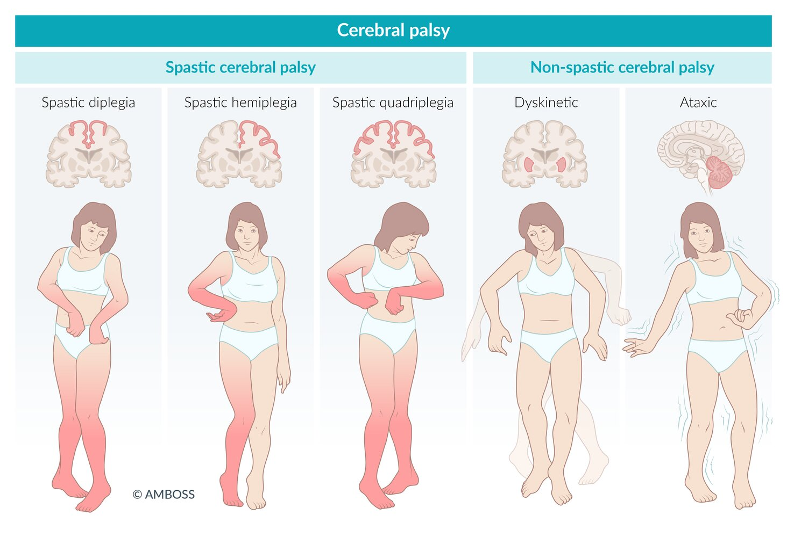
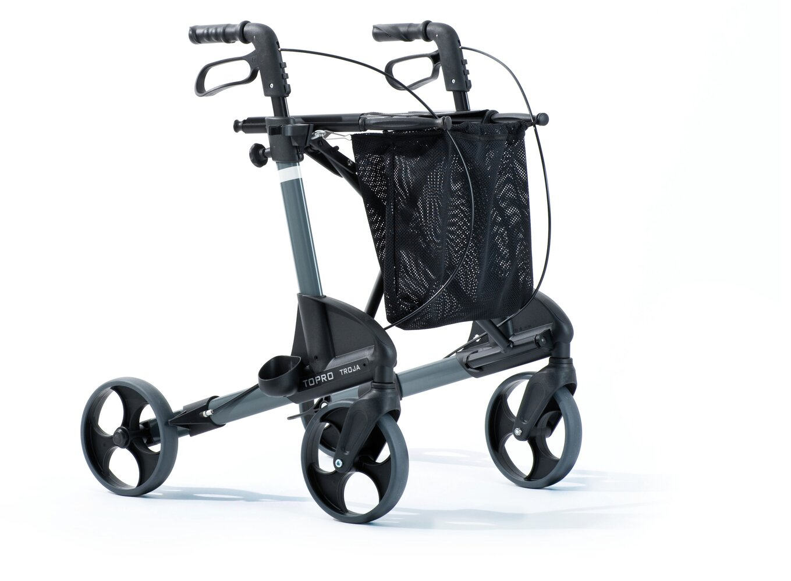
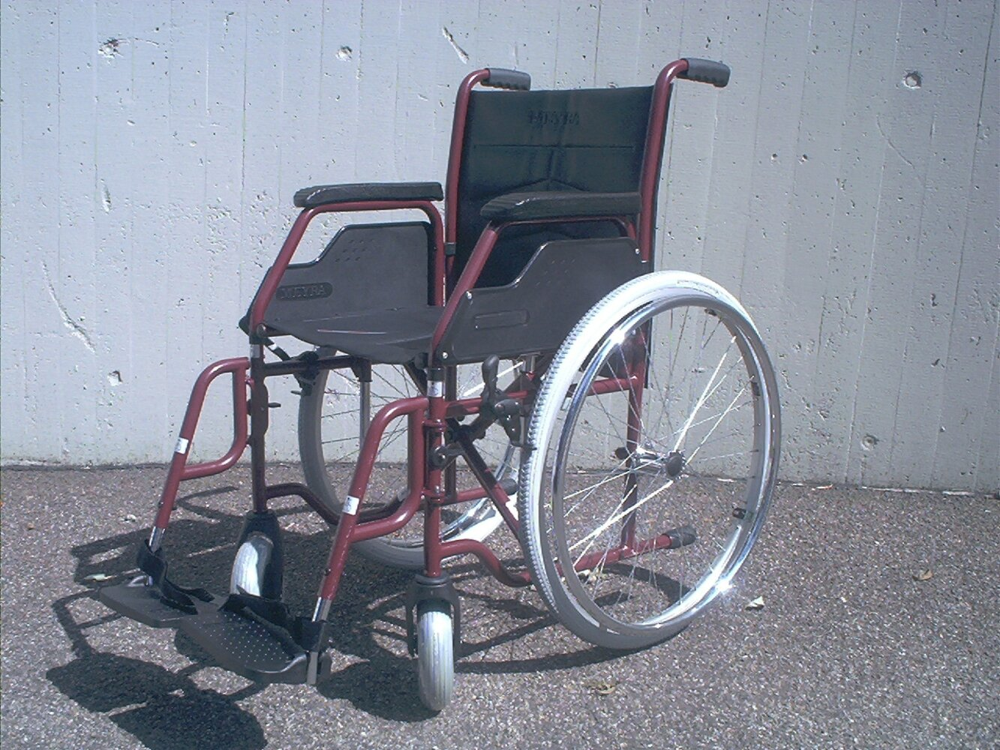
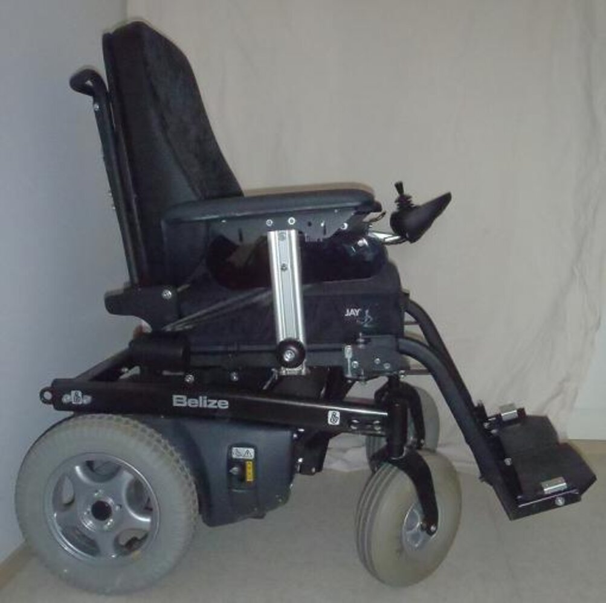

# Cerebral palsy

*Categories: Clinical knowledge > Neurology > Movement disorders > Cerebral palsy*

[Original Article Link](https://coursology-qbank.com/amboss/article/5o0icS)

---

## Summary

Cerebral palsy (CP) is a heterogenous group of disorders affecting the muscle tone and the development of movement and posture. CP results from a non-progressive damage to the <u>brain</u> in utero or during infantile development up to the age of 3 years. Depending on the affected <u>brain</u> area, <u>spastic</u>, <u>ataxic</u>, or dyskinetic cerebral palsy develops. While, in many cases, there is no identifiable cause, <u>risk factors</u> for cerebral palsy are <u>prematurity</u>, <u>perinatal</u> complications such as <u>chorioamnionitis</u>, <u>birth trauma</u> with <u>intracerebral hemorrhage</u>, or postnatal infections such as <u>meningitis</u>. The diagnosis of CP is usually not made until features become apparent as children fail to meet certain milestones during the postneonatal period (e.g., inability to roll over or sit independently). Physical indicators of <u>spastic</u> cerebral palsy include <u>spastic paresis</u> of multiple limbs and <u>joint contractures</u>, scissors gait, and persistence of <u>primitive reflexes</u>. Patients with non-<u>spastic</u> cerebral palsy present with <u>dysarthria</u> and abnormal involuntary movements (choreoathetoid, dystonic, or <u>ataxic</u>) that worsen with <u>stress</u>. <u>Seizure disorders</u> and <u>intellectual disability</u> are associated with all types. Diagnosis is mainly based on the clinical picture but <u>cranial</u> <u>ultrasound</u> or <u>MRI</u> can help identify the causative lesion (e.g., hemorrhage, <u>brain</u> <u>malformation</u>). Since there is no cure, management follows a multidisciplinary approach with a focus on treating <u>contractures</u> (e.g., bracing, <u>antispasmodics</u>, <u>physical therapy</u>, <u>surgery</u>) and ensuring social participation (e.g., <u>speech therapy</u>, social support). Depending on the severity and type of cerebral palsy, patients may be slightly restricted or severely disabled and unable to walk.

---

## Epidemiology

* Most common motor disability in children

* Approx. 2/1000 <u>live births</u> [[1]](https://coursology-qbank.com/amboss/article/GAWBOL0)

References:[[2]](https://coursology-qbank.com/amboss/article/TEa6Em)

Epidemiological data refers to the US, unless otherwise specified.

---

## Etiology

* <u>Idiopathic</u> (most cases)

* <u>Risk factors</u> [[1]](https://coursology-qbank.com/amboss/article/GAWBOL0)

* <u>Preterm birth</u> and <u>low birth weight</u> (most important <u>risk factors</u>)

* <u>TORCH infection</u>

* <u>Perinatal asphyxia</u>

* <u>Intracranial hemorrhage</u>

* <u>Periventricular leukomalacia</u>

* Structural abnormality of the <u>brain</u>

* <u>Neonatal seizures</u>

* <u>Kernicterus</u>

* Postnatal infection (e.g., <u>meningitis</u>, <u>encephalitis</u>)

* <u>Thyroid disorder</u> in <u>pregnancy</u>

> [!NOTE]
> Studies have shown that antenatal administration of <u>magnesium sulfate</u> in birthing parents at risk of <u>premature delivery</u> (e.g., likely to enter <u>preterm labor</u> within 24 hours) has neuroprotective effects on the fetus and is associated with reduced <u>incidence</u> of cerebral palsy. [[3]](https://coursology-qbank.com/amboss/article/oAW0kL0)[[4]](https://coursology-qbank.com/amboss/article/KAWUkL0)[[5]](https://coursology-qbank.com/amboss/article/6AWjkL0)

References:[[6]](https://coursology-qbank.com/amboss/article/gEaFEm)

---

## Classification

* <u>Spastic</u> cerebral palsy: <u>spastic paresis</u> of one or more limbs (75% of cases)

* Non-<u>spastic</u> cerebral palsy :

* Dyskinetic: abnormal involuntary movements (choreoathetoid, dystonic)

* <u>Ataxic</u>: <u>intention tremor</u>, lack of balance and coordination

Types of cerebral palsy

---

## Clinical features

Patients may present with mixed types of cerebral palsy (e.g., combination of <u>spastic</u> and athetoid CP).

* All types ; <u>Spastic</u> type  

* ↑ Muscle tone in one or more limbs

* ↑ <u>DTRs</u>

* Persistence of <u>primitive reflexes</u> (e.g., positive <u>Babinski sign</u>)

* <u>Toe walking</u> or <u>equinus deformity</u>

* Scissor gait (due to <u>spastic</u> <u>paraplegia</u> of the hip adductors)

* <u>Muscle weakness</u> and/or <u>atrophy</u>

* <u>Hip dislocation</u>

* <u>Scoliosis</u>

* <u>Hearing</u> or <u>vision</u> impairment

* <u>Intellectual disability</u> (50%)

* <u>Seizure disorder</u> (35%–50%)

* <u>Upper motor neuron signs</u> (e.g., <u>spasticity</u>, <u>hyperreflexia</u>, <u>clonus</u>)

* Behavioral difficulties

* <u>Developmental delay</u>, particularly <u>motor function</u> (e.g., rolling over from back to belly, sitting independently, crawling).

* <u>Attention deficit hyperactivity disorder</u>

* Non-<u>spastic</u> type 

* Abnormal involuntary movements that worsen with <u>stress</u> and stop during <u>sleep</u>

* <u>Chorea</u>

* <u>Athetosis</u>

* <u>Dystonia</u>

* <u>Ataxia</u>

* <u>Dysarthria</u> and <u>dysphagia</u>

> [!WARNING]
> Definite hand preference before 1 year of age suggests one-sided <u>muscle weakness</u> and is a <u>red flag</u> for <u>hemiplegia</u>.

---

## Diagnosis

Diagnosis is mainly based on clinical findings. A comprehensive assessment of <u>vision</u>, <u>hearing</u>, and <u>developmental milestones</u> should be conducted. [[1]](https://coursology-qbank.com/amboss/article/GAWBOL0)

* <u>Cranial</u> <u>ultrasonography</u> (early <u>neonatal period</u>): e.g., <u>intracerebral hemorrhage</u>:  and/or <u>hypoxic</u>-<u>ischemic</u> injury, structural abnormalities

* <u>MRI</u> (in older <u>infants</u>): to detect causative lesion (e.g., <u>periventricular leukomalacia</u>, congenital <u>malformation</u>, <u>intracranial hemorrhage</u>)

* <u>EEG</u>: patients with suspected <u>seizures</u>

---

## Treatment

There is no curative therapy for cerebral palsy. Management is dependent on the severity and nature of symptoms. A multidisciplinary approach is employed in management to improve function and quality of life.

* Nonpharmacological management

* <u>Physical therapy</u>: prevents muscle <u>contractures</u>

* <u>Occupational therapy</u>: motor skill development

* <u>Speech therapy</u>: communication skills and <u>dysphagia</u>

* Orthotic devices (e.g., <u>braces</u>, <u>splints</u>, and casts) and assistive devices (e.g., wheelchairs, walkers)

* Educational support for <u>intellectual disability</u>

* <u>Nutritional support</u> for <u>dysphagia</u>

* Social and psychological support

* Pharmacological management

* <u>Antispasmodics</u>;  (e.g., <u>botulinum toxin</u>, <u>baclofen</u>, <u>dantrolene</u>, <u>benzodiazepines</u>)

* <u>Anticonvulsants</u>

* <u>Anticholinergics</u> for rigidity and <u>sialorrhea</u>

* <u>Surgery</u>

* Orthopedic <u>surgery</u> to treat <u>scoliosis</u> and relieve <u>contractures</u>

* <u>Selective dorsal rhizotomy</u> to relieve <u>spasticity</u> and <u>pain</u>

Two-wheeled walker

Four-wheeled walker

Manual wheelchair

Motorized wheelchair

---