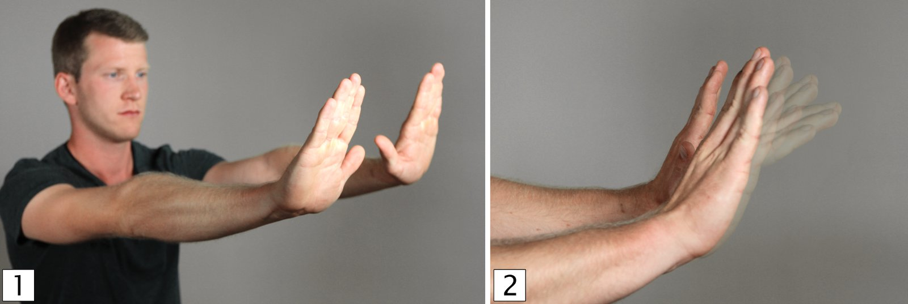
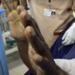

# Tremor

*Categories: Clinical knowledge > Neurology > Movement disorders > Tremor*

[Original Article Link](https://coursology-qbank.com/amboss/article/x30Ekf)

---

## Summary

Tremor is an involuntary, rhythmic, oscillatory movement of one or more body parts. It is the most common movement disorder and is classified into <u>resting tremor</u> and <u>action tremor</u> (e.g., <u>postural tremor</u>, <u>intention tremor</u>). <u>Resting tremor</u> is typical in <u>Parkinson disease</u> and manifests as an asymmetrical tremor that occurs at rest. <u>Postural tremor</u> occurs when a position is held against gravity and includes essential, physiologic, and <u>orthostatic tremor</u>. <u>Essential tremor</u> is the most common pathologic tremor, usually involves the hands, is characteristically bilateral, and improves with <u>alcohol</u> consumption. <u>Physiologic tremor</u> is bilateral, most commonly involves the hands, and is enhanced with <u>sympathetic</u> stimulation (e.g., <u>caffeine</u>, <u>anxiety</u>). <u>Orthostatic tremor</u> is associated with standing and resolves when sitting or lying down. <u>Intention tremor</u> is a coarse hand tremor that is aggravated by goal-directed movement and is often caused by <u>cerebellar</u> lesions (e.g., due to <u>strokes</u>, trauma, <u>multiple sclerosis</u>). Various medications and toxins are associated with tremor, most commonly <u>enhanced physiologic tremor</u>. Diagnosis is typically clinical, but laboratory tests and imaging may be required to determine the underlying cause. Treatment is based on the type of tremor and the underlying condition.

---

## Overview

|  Common types of tremors [[1]](https://coursology-qbank.com/amboss/article/lhdvVp0)[[2]](https://coursology-qbank.com/amboss/article/vhdAfp0)[[3]](https://coursology-qbank.com/amboss/article/Xhd9cp0)[[4]](https://coursology-qbank.com/amboss/article/0Rdelp0)  |  |  |  |  |
| --- | --- | --- | --- | --- |
|  | <u>Resting tremor</u> | Action tremor |  |  |
| <u>Postural tremor</u> |  | <u>Intention tremor</u> |  |  |
| Essential | Physiologic |  |  |  |
| Typical features |   * Initially unilateral  * Most commonly apparent in the upper limbs and hands  * Resembles <u>pill-rolling</u> movement of the fingers  * Frequencies of 4–6 Hz    |   * Bilateral  * Most commonly affects the hands  * Fine tremor with frequencies of 6–12 Hz    |   * Bilateral  * Most commonly affects the hands and fingers  * Fine tremor with frequencies of 8–12 Hz    |   * Most commonly apparent in the upper limbs  * Slow (< 5 Hz) zigzag movement; amplitude increases toward a target    |
| Etiology |   * <u>Parkinson disease</u>: dysfunction of the <u>basal ganglia</u>, especially <u>substantia nigra</u>  * <u>Drug-induced parkinsonism</u>  * <u>Parkinson-plus syndromes</u>    |  * Often hereditary   |  * <u>Sympathetic</u> stimulation from <u>stress</u>, substances (e.g., <u>caffeine</u>), or medical conditions (e.g., <u>hyperthyroidism</u>, <u>hypoglycemia</u>)   |   * <u>Cerebellar</u> lesion (e.g., <u>stroke</u>, trauma, <u>multiple sclerosis</u>)  * Substance-induced: ethanol, <u>lithium</u>    |
| Activation condition |  * At rest   |   * With certain sustained postures (e.g., holding arms outstretched)  * Worse with voluntary movement or <u>anxiety</u>    |  * With certain postures (e.g., holding arms outstretched)   |  * Any movement; worse with goal-directed movement   |
| Associated features |   * Rigidity  * <u>Bradykinesia</u>  * <u>Postural instability</u>    |   * Involvement of the head, neck, and/or voice  * Normal <u>neurological examination</u>    |  * Normal <u>neurological examination</u>   |   * <u>Dysmetria</u>  * Other <u>cerebellar signs</u>    |
| Improved by |  * Voluntary movement   |  * <u>Alcohol</u> consumption   |  * Managing cause of <u>sympathetic</u> stimulation   |  * Rest   |

---

## Etiology

### Conditions associated with tremor

#### <u>Neurodegenerative diseases</u> [[3]](https://coursology-qbank.com/amboss/article/Xhd9cp0)

* <u>Parkinson disease</u>

* <u>Corticobasal degeneration</u>

* <u>Multiple system atrophy</u>

* <u>Progressive supranuclear palsy</u>

#### Focal lesions [[3]](https://coursology-qbank.com/amboss/article/Xhd9cp0)[[6]](https://coursology-qbank.com/amboss/article/hhdcdp0)

* <u>Stroke</u> or space-occupying lesion affecting the <u>basal ganglia</u> and/or cerebello-thalamo-cortical network

* <u>Multiple sclerosis</u>

* Posttraumatic

#### Hereditary conditions [[3]](https://coursology-qbank.com/amboss/article/Xhd9cp0)

* <u>Spinocerebellar ataxia</u>

* <u>Klinefelter syndrome</u>

* <u>Fragile X syndrome</u>

* <u>Leigh syndrome</u>

#### Metabolic conditions [[3]](https://coursology-qbank.com/amboss/article/Xhd9cp0)

* <u>Wilson disease</u>

* <u>Hyperthyroidism</u>

* <u>Electrolyte</u> disturbances (e.g., <u>hypocalcemia</u>, <u>hyponatremia</u>, <u>hypomagnesemia</u>)

* <u>Hypoglycemia</u>

* <u>Hyperparathyroidism</u>

* <u>Vitamin B12 deficiency</u>

#### Neuropathies [[3]](https://coursology-qbank.com/amboss/article/Xhd9cp0)

* <u>Hereditary motor sensory neuropathy</u>

* <u>Acute inflammatory demyelinating polyradiculoneuropathy</u>

* <u>Chronic inflammatory demyelinating polyradiculoneuropathy</u>

* <u>Multifocal neuropathy</u>

### Medications associated with tremor [[3]](https://coursology-qbank.com/amboss/article/Xhd9cp0)[[8]](https://coursology-qbank.com/amboss/article/7hd42p0)[[9]](https://coursology-qbank.com/amboss/article/IhdY2p0)

* <u>Sympathomimetics</u>

* <u>Hormones</u>

* <u>Levothyroxine</u>

* <u>Steroids</u>: <u>progesterone</u>, <u>corticosteroids</u>

* <u>Antiepileptics</u>

* <u>Dopamine antagonists</u>

* <u>Antipsychotics</u>

* <u>Metoclopramide</u>

* <u>Antidepressants</u>

* <u>Selective serotonin reuptake inhibitors</u>

* <u>Tricyclic antidepressants</u>

* <u>Chemotherapeutic agents</u>

* Others: <u>amiodarone</u>, <u>lithium</u>, <u>theophylline</u>

### Substances associated with tremor [[3]](https://coursology-qbank.com/amboss/article/Xhd9cp0)[[9]](https://coursology-qbank.com/amboss/article/IhdY2p0)[[10]](https://coursology-qbank.com/amboss/article/qhdCUp0)

* <u>Stimulant toxicity</u> (e.g., <u>caffeine</u>, <u>nicotine</u>, <u>cocaine</u>)

* <u>Substance withdrawal</u>

* <u>Alcohol withdrawal</u>

* <u>Benzodiazepine withdrawal</u>

* <u>Marijuana withdrawal</u> [[11]](https://coursology-qbank.com/amboss/article/MfWM5k0)

* <u>Alcohol</u>

* Toxins

* <u>Metal toxicity</u>: <u>mercury</u>, lead, <u>arsenic</u>, <u>manganese</u>

* <u>Cyanide toxicity</u>

* <u>Carbon monoxide toxicity</u>

* <u>Organic solvent toxicity</u>: <u>toluene</u>, <u>lindane</u>

* <u>Naphthalene</u>

---

## Resting tremor

### <u>Parkinson disease</u>

* <u>Epidemiology</u>

* Onset typically ≥ 60 years [[6]](https://coursology-qbank.com/amboss/article/hhdcdp0)

* Most common cause of <u>resting tremor</u> [[1]](https://coursology-qbank.com/amboss/article/lhdvVp0)

* Pathophysiology: caused by a dysfunction of the <u>basal ganglia</u>, especially <u>substantia nigra</u>

* Clinical features [[12]](https://coursology-qbank.com/amboss/article/3S1SzT0)[[13]](https://coursology-qbank.com/amboss/article/fS1k_T0)

* Typically, asymmetric <u>resting tremor</u> of the extremities (especially apparent in the hands);  at a frequency of 4–6 Hz

* Hand motion resembling <u>pill-rolling</u>

* Decreases with target-directed movement

* Usually unilateral; may progress to bilateral tremors

* Often associated with rigidity, <u>bradykinesia</u>, and <u>postural instability</u> (see “<u>Parkinsonism</u>”)

* Diagnosis: See “<u>Diagnostics in Parkinson disease</u>.”

* Management: See “<u>Management of Parkinson disease</u>.”

> [!TIP]
> “Rest in the park”: The most common cause of resting tremor is Parkinson disease. [[1]](https://coursology-qbank.com/amboss/article/lhdvVp0)

> [!WARNING]
> Tremor that is apparent at rest but does not decrease with target-directed movement is unlikely to be due to <u>parkinsonism</u>. [[1]](https://coursology-qbank.com/amboss/article/lhdvVp0)

### Other causes

* <u>Drug-induced parkinsonism</u> (e.g., <u>typical antipsychotics</u>, <u>metoclopramide</u>) [[14]](https://coursology-qbank.com/amboss/article/9iaNF4)

* <u>Parkinson-plus syndromes</u> (e.g., <u>progressive supranuclear palsy</u>)

* Severe <u>essential tremor</u>  [[1]](https://coursology-qbank.com/amboss/article/lhdvVp0)

---

## Postural tremor

### Essential tremor [[2]](https://coursology-qbank.com/amboss/article/vhdAfp0)[[3]](https://coursology-qbank.com/amboss/article/Xhd9cp0)[[6]](https://coursology-qbank.com/amboss/article/hhdcdp0)

* Definition

* Isolated bilateral upper limb <u>action tremor</u> in the absence of other neurological signs, e.g., <u>dystonia</u>, <u>ataxia</u>, or <u>parkinsonism</u>

* May be accompanied by tremor of the head, neck, voice, and/or lower limbs

* Formal diagnosis requires symptoms to be present for ≥ 3 years.

* <u>Epidemiology</u>

* Most common pathologic form of tremor [[1]](https://coursology-qbank.com/amboss/article/lhdvVp0)

* <u>Bimodal distribution</u>: <u>adolescence</u> or early adulthood and adults aged > 60 years (most common in older adults) [[6]](https://coursology-qbank.com/amboss/article/hhdcdp0)

* Etiology: positive <u>family history</u> in up to 70% of patients ; may be sporadic [[15]](https://coursology-qbank.com/amboss/article/Nkd-LJ0)

* Clinical features

* Localization: hands (most common), head ("yes-yes” or "no-no” motion), voice

* Bilateral <u>postural tremor</u> with a frequency between 6–12 Hz

* Slowly progressive

* Worse with voluntary movement, <u>stress</u> or <u>anxiety</u>, fatigue, and <u>caffeine</u>

* Improves with <u>alcohol</u> consumption

* May be accompanied by <u>intention tremor</u> and/or <u>resting tremor</u>

* Diagnosis

* <u>Clinical diagnosis</u>

* See “<u>Diagnostics for tremor</u>.”

* Treatment [[2]](https://coursology-qbank.com/amboss/article/vhdAfp0)[[16]](https://coursology-qbank.com/amboss/article/nja7ak)[[17]](https://coursology-qbank.com/amboss/article/JNasXO)

* First-line medications 

* <u>Propranolol</u> DOSAGE  [[17]](https://coursology-qbank.com/amboss/article/JNasXO)

* <u>Primidone</u> (<u>off-label</u>) DOSAGE  [[17]](https://coursology-qbank.com/amboss/article/JNasXO)

* Alternative medications (if <u>propranolol</u> and <u>primidone</u> are ineffective or contraindicated)

* Other <u>beta blockers</u> (e.g., <u>atenolol</u>, <u>metoprolol</u>)

* Other <u>anticonvulsants</u>;  (e.g., <u>topiramate</u>, <u>gabapentin</u>)

* <u>Benzodiazepines</u> (e.g., <u>alprazolam</u>, <u>clonazepam</u>)

* Drug-resistant <u>essential tremor</u>

* <u>Deep brain stimulation</u> (<u>DBS</u>)

* Thalamotomy

> [!TIP]
> Consider <u>essential tremor</u> in patients with chronic bilateral hand tremor who have a positive <u>family history</u> and are otherwise neurologically intact.

### Physiologic tremor [[1]](https://coursology-qbank.com/amboss/article/lhdvVp0)[[5]](https://coursology-qbank.com/amboss/article/4kd3LJ0)[[9]](https://coursology-qbank.com/amboss/article/IhdY2p0)

All individuals have <u>physiologic tremor</u>, but it is generally not symptomatic or visible. <u>Enhanced physiologic tremor</u> occurs when reversible conditions (e.g., <u>stress</u>, fatigue) magnify <u>physiologic tremor</u>.

#### <u>Enhanced physiologic tremor</u> [[1]](https://coursology-qbank.com/amboss/article/lhdvVp0)[[5]](https://coursology-qbank.com/amboss/article/4kd3LJ0)[[9]](https://coursology-qbank.com/amboss/article/IhdY2p0)

* <u>Epidemiology</u>: may occur at any age

* Etiology: usually caused by increased <u>sympathetic</u> stimulation, e.g.,

* <u>Stress</u>, exercise, fatigue

* Medications (e.g., <u>albuterol</u>, <u>levothyroxine</u>)

* Substance use (e.g., <u>sympathomimetic drugs</u>)

* <u>Substance withdrawal syndromes</u> (e.g., <u>alcohol withdrawal</u>)

* Medical conditions (e.g., <u>hyperthyroidism</u>, <u>pheochromocytoma</u>, <u>hypoglycemia</u>) [[8]](https://coursology-qbank.com/amboss/article/7hd42p0)[[10]](https://coursology-qbank.com/amboss/article/qhdCUp0)

* Clinical features: usually a fine bilateral <u>postural tremor</u> in the hands and fingers (8–12 Hz)

* Diagnosis

* <u>Clinical diagnosis</u>

* See “<u>Diagnostics for tremor</u>.”

* Treatment

* Reversible once the underlying cause is treated

* <u>Propranolol</u> may be considered under specialist guidance.

### Orthostatic tremor [[5]](https://coursology-qbank.com/amboss/article/4kd3LJ0)[[18]](https://coursology-qbank.com/amboss/article/mjaVak)[[19]](https://coursology-qbank.com/amboss/article/43d3ip0)

* <u>Epidemiology</u> [[19]](https://coursology-qbank.com/amboss/article/43d3ip0)

* Rare

* <u>♀</u> > <u>♂</u>

* Onset ∼ 60 years

* Etiology: unknown

* Clinical features:

* Occurs upon standing and resolves when sitting or lying down

* Tremor occurs primarily in the legs but may involve other body parts, e.g., hands. [[20]](https://coursology-qbank.com/amboss/article/k3dmip0)

* May be associated with falls and <u>postural instability</u>

* Diagnosis

* <u>Clinical diagnosis</u>

* <u>Electromyography</u> shows 13–18 Hz tremor in the patient's legs while standing

* See “<u>Diagnostics for tremor</u>.”

* Treatment 

* Tailored to symptoms (e.g., physical aids, <u>physical therapy</u>, <u>occupational therapy</u>)

* Consider <u>clonazepam</u> or <u>gabapentin</u>  [[20]](https://coursology-qbank.com/amboss/article/k3dmip0)

---

## Intention tremor

* Etiology [[1]](https://coursology-qbank.com/amboss/article/lhdvVp0)[[4]](https://coursology-qbank.com/amboss/article/0Rdelp0)[[9]](https://coursology-qbank.com/amboss/article/IhdY2p0)

* <u>Cerebellar stroke</u>, <u>tumor</u>, or trauma

* Drug-induced: <u>alcohol</u>, <u>lithium</u>

* <u>Multiple sclerosis</u>

* <u>Wilson disease</u> [[18]](https://coursology-qbank.com/amboss/article/mjaVak)

* Other causes of <u>cerebellar dysfunction</u> (e.g., <u>acute cerebellitis</u>)

* Clinical features [[6]](https://coursology-qbank.com/amboss/article/hhdcdp0)[[8]](https://coursology-qbank.com/amboss/article/7hd42p0)

* Coarse hand tremor

* Slow tremor with a frequency of < 5 Hz

* Worse with goal-directed movement

* Other <u>cerebellar signs</u>

* Diagnosis

* <u>Clinical diagnosis</u>

* Additional diagnostics based on suspected cause, e.g.:

* <u>Diagnosis of stroke</u> (e.g., CT, <u>MRI</u>)

* <u>Diagnosis of multiple sclerosis</u>

* <u>Diagnosis of Wilson disease</u>

* <u>Lithium poisoning</u>

* See “<u>Diagnostics for tremor</u>.”

* Treatment [[1]](https://coursology-qbank.com/amboss/article/lhdvVp0)

* Treatment of the underlying cause

* <u>Deep brain stimulation</u>

* Supportive measures (e.g., <u>occupational therapy</u>, <u>physical therapy</u>)

---

## Additional types of tremors

### Flapping tremor (<u>asterixis</u>) [[21]](https://coursology-qbank.com/amboss/article/aRdQlp0)

* Etiology

* <u>Metabolic encephalopathies</u>

* <u>Hepatic encephalopathy</u> (most common)

* <u>Respiratory failure</u> and <u>hypercapnia</u>

* <u>Renal failure</u> and <u>uremia</u>

* Cardiac failure

* <u>Electrolyte</u> abnormalities: <u>hypokalemia</u>, <u>hypomagnesemia</u>

* <u>Hypoglycemia</u>

* Lesions in the <u>thalamus</u> (e.g., <u>ischemic stroke</u>, hemorrhage, space-occupying lesion)

* <u>Wilson disease</u>

* Drug-induced (e.g., <u>phenytoin</u>, <u>benzodiazepines</u>, <u>barbiturates</u>)

* Infections (e.g., cerebral <u>malaria</u>)

* Clinical features

* Irregular, high-amplitude <u>oscillations</u> when arms are extended and wrists are <u>dorsiflexed</u>

* Caused by <u>negative myoclonus</u>: short loss of postural muscle tone followed by a compensatory corrective movement

* Features of the underlying cause, e.g.:

* <u>Signs of hepatic encephalopathy</u>

* <u>Signs of Wilson disease</u>

* <u>Signs of stroke</u>

* Diagnosis

* <u>Clinical diagnosis</u>

* Additional diagnostics based on suspected cause, e.g.:

* <u>Diagnosis of hepatic encephalopathy</u>

* <u>Diagnosis of Wilson disease</u>

* <u>Diagnosis of stroke</u>

* See “<u>Diagnostics for tremor</u>.”

* Treatment: based on the underlying cause, e.g.,

* See “<u>Treatment of hepatic encephalopathy</u>.”

* See “<u>Treatment of Wilson disease</u>.”

* See “<u>Renal replacement therapy</u>.”

Asterixis (flapping tremor)

asterixis

### Functional tremor [[1]](https://coursology-qbank.com/amboss/article/lhdvVp0)[[3]](https://coursology-qbank.com/amboss/article/Xhd9cp0)[[8]](https://coursology-qbank.com/amboss/article/7hd42p0)

* Etiology: a common feature of <u>conversion disorder</u>; may occur in other psychiatric disorders (e.g., <u>anxiety disorders</u>, <u>factitious disorder</u>, <u>depression</u>)

* Clinical features

* Complex resting, postural, and/or <u>action tremor</u>

* Sudden onset

* Worsens under direct observation and diminishes with distraction

* Variability in the amplitude, frequency, or distribution of the movement over time

* Other clinical features of <u>conversion disorder</u>

* Diagnosis: <u>clinical diagnosis</u>; usually made by a specialist  [[3]](https://coursology-qbank.com/amboss/article/Xhd9cp0)[[22]](https://coursology-qbank.com/amboss/article/lRdvMp0)

* Entrainment test

* The patient performs a voluntary movement (e.g., tapping) with an unaffected limb and at a set rhythm that is different from the frequency of the tremor.

* Positive test: The tremor of the affected limb aligns with the frequency of the voluntary movement.

* See “<u>Diagnostics for tremor</u>.”

* See “Diagnostics” in “<u>Conversion disorder</u>.”

* Treatment

* <u>Multidisciplinary care</u> that may include <u>cognitive behavioral therapy</u> and pharmacotherapy (e.g., <u>antidepressants</u>)

* See “Management” in “<u>Conversion disorder</u>.”

* See “<u>Approach to patients with suspected somatic symptom and related disorders</u>.”

### Other types of tremor

* Dystonic tremor: focal postural and/or kinetic tremor that occurs in muscles with preexisting <u>dystonia</u> [[18]](https://coursology-qbank.com/amboss/article/mjaVak)

* Holmes tremor [[3]](https://coursology-qbank.com/amboss/article/Xhd9cp0)

* Low-frequency, large-amplitude tremor that is present at rest and worsens when performing an action or maintaining certain postures.

* Causes: <u>stroke</u>, <u>traumatic brain injury</u>, <u>multiple sclerosis</u>, <u>intracranial hypertension</u>, <u>CNS</u> infections

* <u>Cerebellar tremor</u>

* <u>Wing-beating tremor</u>

---