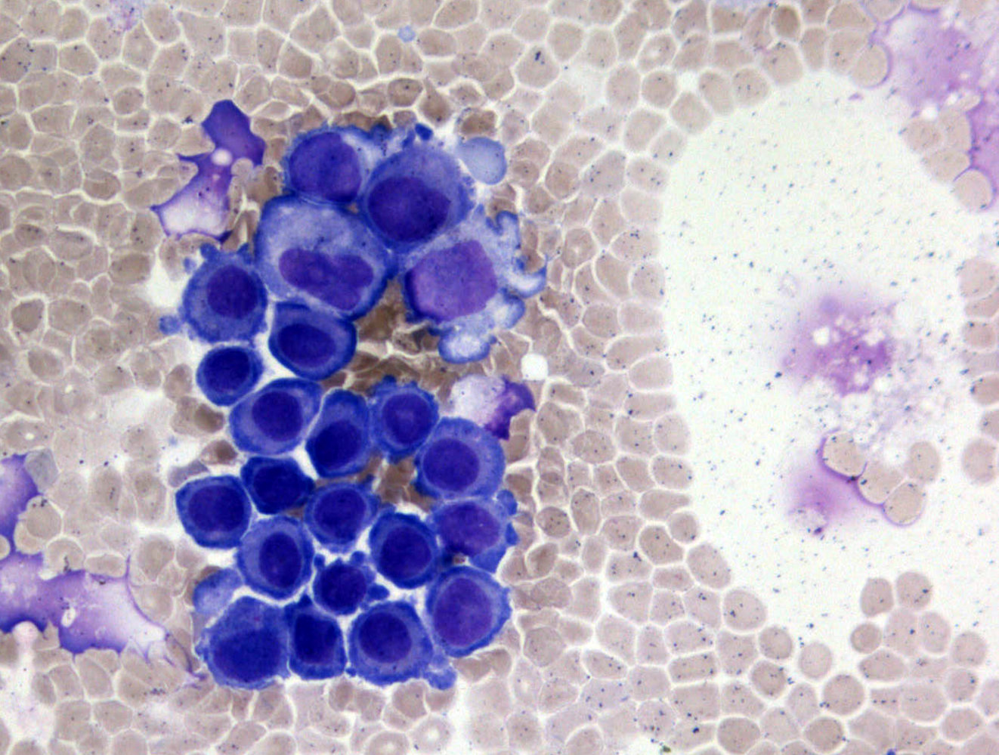
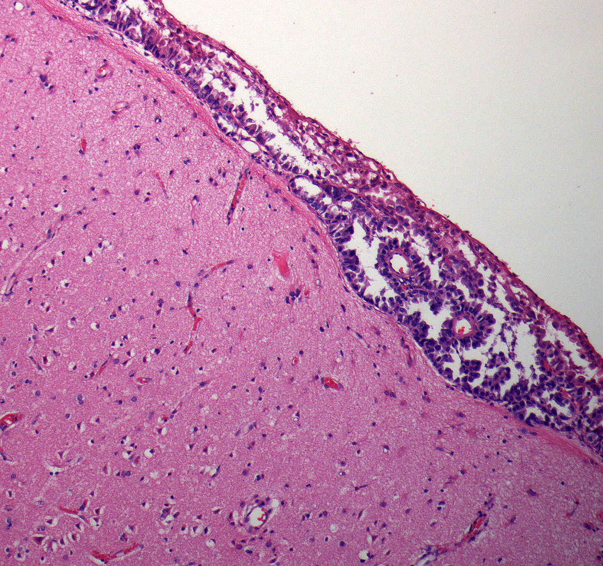
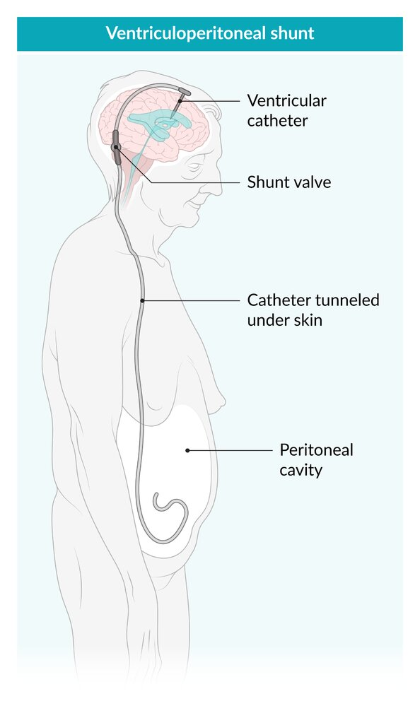

# Neoplastic meningitis

*Categories: Clinical knowledge > Neurology > Neoplastic disorders > Neoplastic meningitis*

[Original Article Link](https://coursology-qbank.com/amboss/article/XR09lf)

---

## Summary

<u>Neoplastic</u> <u>meningitis</u> is the infiltration of the <u>meninges</u> by <u>tumor</u> cells. It affects approximately 5% of all patients with cancer. Based on the origin of the primary <u>tumor</u>, the condition may be categorized as carcinomatous, lymphomatous, or <u>leukemic meningitis</u>. Some clinical features are secondary to <u>elevated intracranial pressure</u> and include <u>headaches</u>, <u>papilledema</u>, and <u>altered mental status</u>. Treatment is based on the type of primary <u>tumor</u> and the extent of disease. As <u>neoplastic</u> <u>meningitis</u> is usually a sign of advanced disease with systemic spread, the overall prognosis is poor.

---

## Clinical features

* <u>Meningism</u>

* <u>Cranial neuropathies</u>

* <u>Headache</u>

* <u>Papilledema</u>

* <u>Nausea</u>, <u>vomiting</u>

* <u>Altered mental status</u> (ranging from confusion to <u>lethargy</u>)

* <u>Seizures</u>

References:[[2]](https://coursology-qbank.com/amboss/article/SaayPQ)

---

## Diagnosis

### General principles  [[5]](https://coursology-qbank.com/amboss/article/fIWkX50)[[6]](https://coursology-qbank.com/amboss/article/3R1S5g0)

* Consider in patients with either typical:

* Neurological features (e.g., <u>signs of elevated ICP</u>)

* <u>Neuroimaging</u> findings (e.g., on <u>MRI</u>)

* Diagnosis is confirmed by malignant cells on <u>CSF</u> or <u>leptomeningeal</u> <u>biopsy</u>.

* If the primary <u>tumor</u> is unknown, consider <u>diagnostics for cancer of unknown primary</u>.

### <u>Neuroimaging</u> [[5]](https://coursology-qbank.com/amboss/article/fIWkX50)[[6]](https://coursology-qbank.com/amboss/article/3R1S5g0)[[7]](https://coursology-qbank.com/amboss/article/hR1c5g0)

* <u>MRI</u> <u>brain</u> and <u>spine</u> with and without <u>gadolinium</u> (first-line)

* Obtain for all patients, ideally prior to <u>LP</u> to avoid <u>false positives</u> .

* Supportive findings

* <u>Leptomeningeal</u> <u>enhancement</u> (linear or nodular)

* <u>Communicating hydrocephalus</u>

* Sulcal obliteration

* CT <u>brain</u> with contrast (second-line) : supportive findings similar to <u>MRI</u>

* <u>CSF flow study</u>

* To evaluate for complications (e.g., <u>hydrocephalus</u> )

* Preparation for intra-<u>CSF</u> treatments

### <u>Lumbar puncture</u> [[5]](https://coursology-qbank.com/amboss/article/fIWkX50)[[6]](https://coursology-qbank.com/amboss/article/3R1S5g0)[[8]](https://coursology-qbank.com/amboss/article/RR1l5g0)

* Indications

* Obtain for all patients after <u>neuroimaging</u>.

* Repeat if initial <u>cytology</u> is negative or equivocal.

* <u>Cytology</u> 

* Confirmatory result: <u>tumor</u> cells

* Equivocal result: <u>atypical cells</u>

* <u>CSF analysis</u> (nonspecific)

* ↑ <u>Opening pressure</u> (> 200 mm H₂O)

* ↑ <u>Leukocytes</u> (> 4/mm³)

* ↑ Total protein (> 50 mg/dL)

* ↓ <u>Glucose</u> (< 60 mg/dL)

* ↑ <u>Lactate</u>

Carcinomatous meningitis in lung cancer

### <u>Leptomeningeal</u> <u>biopsy</u> [[5]](https://coursology-qbank.com/amboss/article/fIWkX50)[[6]](https://coursology-qbank.com/amboss/article/3R1S5g0)

* Indications (rarely performed)

* Negative <u>CSF</u> <u>cytology</u>

* No prior history of cancer

* Treatment is indicated but diagnosis is uncertain.

* Confirmatory result: malignant cells

Neoplastic meningitis

---

## Treatment

### General principles [[5]](https://coursology-qbank.com/amboss/article/fIWkX50)[[6]](https://coursology-qbank.com/amboss/article/3R1S5g0)

* Provide urgent <u>management of elevated ICP</u>.

* <u>Anticancer treatment plans</u>

* May include <u>chemotherapy</u> (systemic and/or intra-<u>CSF</u>) and/or <u>radiotherapy</u>

* Should be formulated by specialists (e.g., a <u>tumor board</u>)

* Consider need for <u>supportive care</u> and <u>symptom palliation</u>.

> [!TIP]
> Goals of treatment include improving or stabilizing neurological function and prolonging survival with a reasonable quality of life.

### <u>Anticancer therapies</u> [[5]](https://coursology-qbank.com/amboss/article/fIWkX50)[[6]](https://coursology-qbank.com/amboss/article/3R1S5g0)

Treatment typically involves a combination of the following:

* Intra-<u>CSF</u> <u>chemotherapy</u>

* Intrathecal chemotherapy (e.g., <u>methotrexate</u>): delivered through <u>lumbar puncture</u>

* Intraventricular <u>chemotherapy</u>: delivered directly to the <u>cerebral ventricle</u>

* Systemic <u>chemotherapy</u>: regimen based on primary <u>malignancy</u>, treatment history, and treatment goals

* <u>Radiation therapy</u>: focal or <u>whole-brain radiation</u> depending on disease extent

> [!TIP]
> <u>Neoplastic</u> <u>meningitis</u> is usually a sign of advanced disease and therefore has a very poor prognosis.

### <u>Supportive care</u> [[2]](https://coursology-qbank.com/amboss/article/SaayPQ)[[5]](https://coursology-qbank.com/amboss/article/fIWkX50)[[6]](https://coursology-qbank.com/amboss/article/3R1S5g0)

* Symptomatic relief: e.g., <u>antiemetics</u>, <u>analgesics</u>

* Management of <u>cancer-related complications</u>; may include:

* <u>Anticonvulsant drugs</u>: for <u>treatment of epileptic seizures</u>

* <u>Glucocorticoids</u> (e.g., <u>dexamethasone</u> DOSAGE ): for <u>vasogenic cerebral edema</u> with <u>signs of elevated ICP</u>. [[9]](https://coursology-qbank.com/amboss/article/3abS4H)

* <u>VP shunt</u>: for relief of <u>increased ICP</u> and/or <u>hydrocephalus</u>

* Management of <u>anticancer treatment-related complications</u>

* Management of <u>anxiety disorders</u> and <u>depressive disorders</u>

Ventriculoperitoneal shunt

---