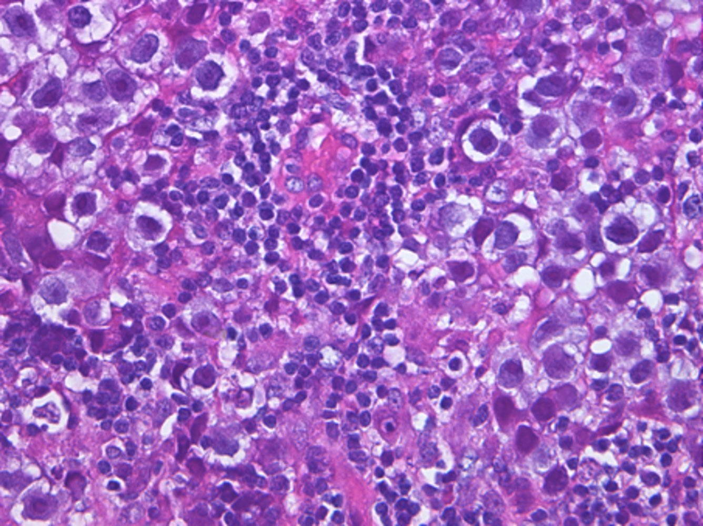
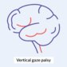
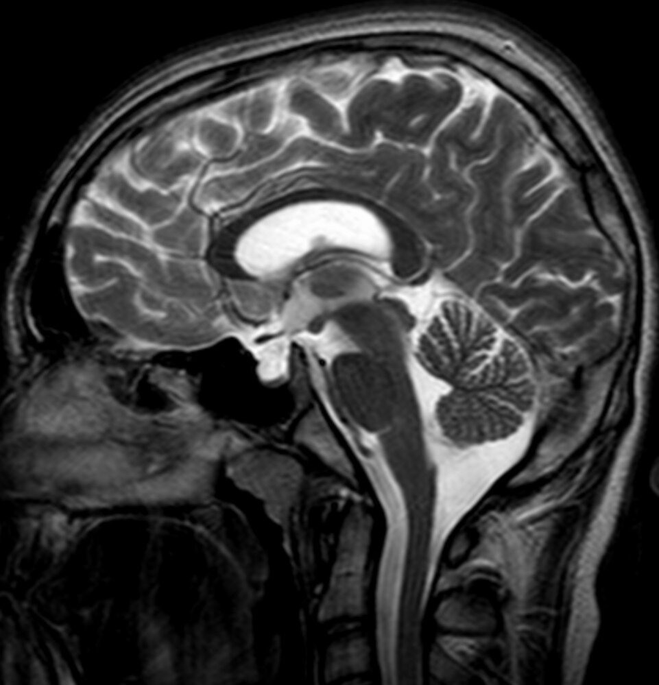

# Rare neurological diseases

*Categories: Clinical knowledge > Neurology > Neoplastic disorders > Rare neurological diseases*

[Original Article Link](https://coursology-qbank.com/amboss/article/l50v4g)

---

## Summary

Rare neurological diseases may be inherited, postinfectious, <u>iatrogenic</u>, or of unknown etiology. They can affect the <u>brain</u>, spinal cord, or <u>peripheral nerves</u>. Symptoms range from mild <u>tremors</u> to significant motor and cognitive impairment. Therapy is often supportive.

---

## Adrenoleukodystrophy

* Definition: a rare X-linked neurological disease usually seen in young men

* Inheritance: <u>X-linked recessive</u> disorder

* <u>Epidemiology</u>

* Rare

* Most often manifests in young boys

* Pathophysiology: mutation of the ABCD1 gene (located on <u>chromosome</u> X), which encodes a peroxisomal <u>ATP</u>-binding cassette (<u>ABC</u>) transporter protein 

* Impaired transport of <u>very long chain fatty acids</u> (<u>VLCFA</u>) into <u>peroxisomes</u>

* Impaired <u>β-oxidation</u> of <u>VLCFA</u> results in accumulation of <u>VLCFA</u> in the <u>adrenal glands</u>, <u>testes</u>, and <u>white matter</u>.

* <u>Neuron</u> <u>demyelination</u> and destruction of <u>adrenal</u> and <u>Leydig cells</u>.

* Clinical features

* Cognitive impairment

* Progressive <u>vision</u>, <u>hearing</u>, and motor deterioration

* <u>Dementia</u>

* <u>Adrenal insufficiency</u>

* <u>Coma</u>

* <u>Death</u>

* Diagnostics

* Increased concentration of <u>VLCFA</u> in plasma

* Decreased <u>adrenal</u> function (↑ <u>ACTH</u> and ↓ <u>cortisol</u>)

* <u>Brain</u> <u>MRI</u>: occipitoparietal <u>white matter</u> <u>demyelination</u>

* Mutation analysis

* Treatment

* Dietary therapy: <u>VLCFA</u> restriction and Lorenzo's oil;  )

* <u>Adrenal insufficiency</u>: <u>corticosteroid</u> replacement therapy

* Early cerebral <u>adrenoleukodystrophy</u>: <u>allogeneic hematopoietic stem cell transplantation</u>

> [!NOTE]
> The name <u>adrenoleukodystrophy</u> means <u>dystrophy</u> (tissue wasting) of the <u>adrenals</u> and the <u>white matter</u> (leuko) of the nervous system.

---

## Vertical gaze palsy

* Definition: a conjugate, bilateral, limitation of the <u>eye movements</u> in upgaze and/or downgaze

* Etiology: tumors (e.g., <u>pinealoma</u>), <u>multiple sclerosis</u>, <u>encephalitis</u>, and <u>cerebral infarction</u> → damage of <u>cranial nerves</u> or <u>superior colliculi</u> in the <u>midbrain</u>
* The most common <u>pinealoma</u> in children is a <u>germinoma</u>, which often secretes <u>β-hCG</u>

* Clinical features

* Conjugate <u>vertical gaze palsy</u>

* <u>Mydriasis</u>

* Poor <u>pupillary</u> constriction to light but intact constriction with <u>accommodation</u>

* <u>Hydrocephalus</u> (due to obstruction of <u>cerebrospinal fluid</u> outflow pathways)

* <u>Ataxia</u> (due to <u>cerebellar</u> involvement)

* If <u>germinoma</u> in boys: potentially <u>precocious puberty</u>

* Treatment: treat the underlying condition
* If <u>pinealomas</u>: focal radiation or <u>chemotherapy</u>.

Pineal germinoma

Vertical Gaze Palsy

---

## Kluver Bucy syndrome

* Definition: a rare behavioral syndrome that results from bilateral damage to the <u>medial</u> parts of the <u>anterior</u> <u>temporal lobes</u> (<u>amygdala</u>, <u>hippocampus</u>)

* Etiology

* Infection (e.g., <u>HSV-1 encephalitis</u>)

* <u>Head trauma</u>

* <u>Stroke</u>

* <u>Malignancy</u> (e.g., <u>brain metastases</u>)

* <u>Neurodegenerative disease</u> (e.g., <u>Alzheimer disease</u>)

* Pathophysiology: bilateral damage to the <u>medial</u> parts of the <u>anterior</u> <u>temporal lobes</u> (<u>amygdala</u>, <u>hippocampus</u>)

* Clinical features

* <u>Disinhibited behavior</u>

* Hyperorality: excessive chewing, sucking, lip-smacking, and examination of objects with the mouth

* <u>Hyperphagia</u>

* Hypersexuality (e.g., increased libido, sexually suggestive speech and gestures)

* Placidity

* Hyperdocility (e.g., excessive obedience, loss of the ability to resist commands)

* Cognitive dysfunction (e.g., <u>memory</u> loss, distractibility, <u>amnesia</u>, <u>aphasia</u>)

* <u>Visual agnosia</u>

* <u>Seizures</u>

* Treatment

* Symptomatic and <u>psychotropic medications</u>

* <u>Acyclovir</u> if active <u>HSV infection</u> is suspected

References:[[1]](https://coursology-qbank.com/amboss/article/09YeNr)[[2]](https://coursology-qbank.com/amboss/article/a9YQNr)

---

## Empty sella syndrome

* Description

* Considered a radiologic finding rather than a clinical condition

* A small and flat <u>pituitary gland</u> within the <u>sella turcica</u> on <u>MRI</u> (<u>empty sella</u>)

* <u>Epidemiology</u>: occurs most often in <u>obese</u> women with <u>hypertension</u>

* Etiology

* Primary form: <u>idiopathic</u>

* Secondary form: associated with <u>idiopathic intracranial hypertension</u>, <u>pituitary gland</u> <u>surgery</u>, <u>radiation therapy</u>, trauma, or <u>infarction</u> (e.g., <u>Sheehan syndrome</u>)

* Pathophysiology

* Primary form: enlargement or <u>malformation</u> of the <u>sella turcica</u>, which surrounds the <u>pituitary gland</u> → <u>CSF leaks</u> in and partially or completely fills the <u>sella turcica</u> → compression and/or <u>atrophy</u> of the <u>pituitary gland</u>

* Secondary form: small <u>pituitary gland</u> due to, e.g., surgical removal of a <u>pituitary tumor</u> or <u>increased intracranial pressure</u>

* Clinical features

* Often asymptomatic

* Symptoms of <u>hypopituitarism</u> in severe cases

* Treatment: in <u>hypopituitarism</u>, <u>hormone</u> replacement

Empty sella syndrome

References:[[3]](https://coursology-qbank.com/amboss/article/-L0DZS)

---

## Posthypoxic myoclonus

### Acute posthypoxic myoclonus [[4]](https://coursology-qbank.com/amboss/article/teWX0k0)

* Definition: generalized <u>myoclonus</u> that typically manifests within hours of a <u>hypoxic</u> episode

* Etiology: <u>hypoxic</u> <u>brain injury</u>

* Clinical features

* Typically, generalized <u>myoclonus</u>

* Other possible features include:

* Multifocal <u>myoclonus</u>

* Upward <u>eye</u> deviation

* Periodic <u>eye</u> opening

* <u>Swallowing</u> movements

* <u>Flexion</u> of the neck and trunk

* Diagnosis

* <u>Clinical diagnosis</u>

* <u>EEG</u>: The following findings are usually seen in affected individuals, but one or more may be absent. 

* <u>Spike-wave activity</u> (continuous or intermittent)

* Burst suppression

* Diffuse slow background and waves

* Alpha <u>coma</u>

* Treatment

* <u>Anticonvulsants</u>

* If ineffective: <u>anesthetic agents</u>

### Chronic posthypoxic myoclonus (<u>Lance-Adams syndrome</u>)

* Definition: a syndrome characterized by multifocal <u>myoclonus</u> following <u>hypoxic</u> <u>brain injury</u> (e.g., due to <u>cardiac arrest</u>)

* Etiology: <u>hypoxic</u> <u>brain damage</u>

* Clinical features

* Multifocal <u>myoclonus</u> exacerbated by muscle activation (action <u>myoclonus</u>) or intention to move (intention <u>myoclonus</u>)

* Possible additional features

* <u>Seizure</u>

* <u>Dysarthria</u>

* <u>Dysphagia</u>

* <u>Ataxia</u>

* Cognitive deficits

* Diagnosis

* <u>Clinical diagnosis</u>

* <u>EEG</u>: typically focal <u>EEG</u> discharge over the corresponding sensorimotor cortical area

* <u>EMG</u>: short <u>EMG</u> discharge typically (≤100 ms) accompanied by near-synchronous <u>EMG</u> discharges in <u>agonists</u>, <u>antagonists</u>, and contiguous muscle segments

* Treatment: <u>anticonvulsants</u>

---

## Myoclonic status epilepticus

* Definition: a state of nearly continuous <u>myoclonus</u> that lasts > 30 minutes [[5]](https://coursology-qbank.com/amboss/article/HUWKek0)

* Etiology

* <u>Epilepsy syndromes</u>

* <u>Juvenile myoclonic epilepsy</u>

* <u>Dravet syndrome</u>

* <u>Lennox-Gastaut syndrome</u>

* Patients without a history of <u>epilepsy</u>

* Toxic-<u>metabolic encephalopathy</u> (e.g., <u>uremia</u>, exposure to heavy metals, adverse effect of medications such as <u>pregabalin</u>, <u>cefepime</u>, and <u>olanzapine</u>)

* Infection

* Neuroinflammation

* Neurodegeneration (e.g., <u>progressive myoclonic epilepsy</u>)

* <u>Anoxic encephalopathy</u>

* Clinical features

* Bilateral <u>myoclonus</u> of the trunk, limbs, and facial muscles

* Periodic <u>eye</u> opening and upward deviation of the eyes

* Diagnosis

* Detailed history to identify cause

* <u>Laboratory studies</u>

* <u>Basic metabolic panel</u>

* Urine and serum toxicology

* <u>Cerebrospinal fluid analysis</u> if either autoimmune or neuroinflammatory cause is suspected

* Imaging

* <u>EEG</u> (jerk-locked back-averaged <u>EEG</u>): spikes located over the <u>contralateral</u> <u>primary motor cortex</u> precede <u>myoclonus</u>

* <u>EMG</u> and/or <u>EEG</u> with <u>somatosensory evoked potentials</u> test to identify the neuroanatomic origin

* Treatment: <u>valproate</u>, <u>levetiracetam</u>, intravenous <u>benzodiazepines</u>

* Prognosis: depends on underlying cause

* <u>MSE</u> due to a reversible cause (e.g., <u>uremia</u>): good prognosis

* <u>Anoxic</u> <u>MSE</u>: poor prognosis

---