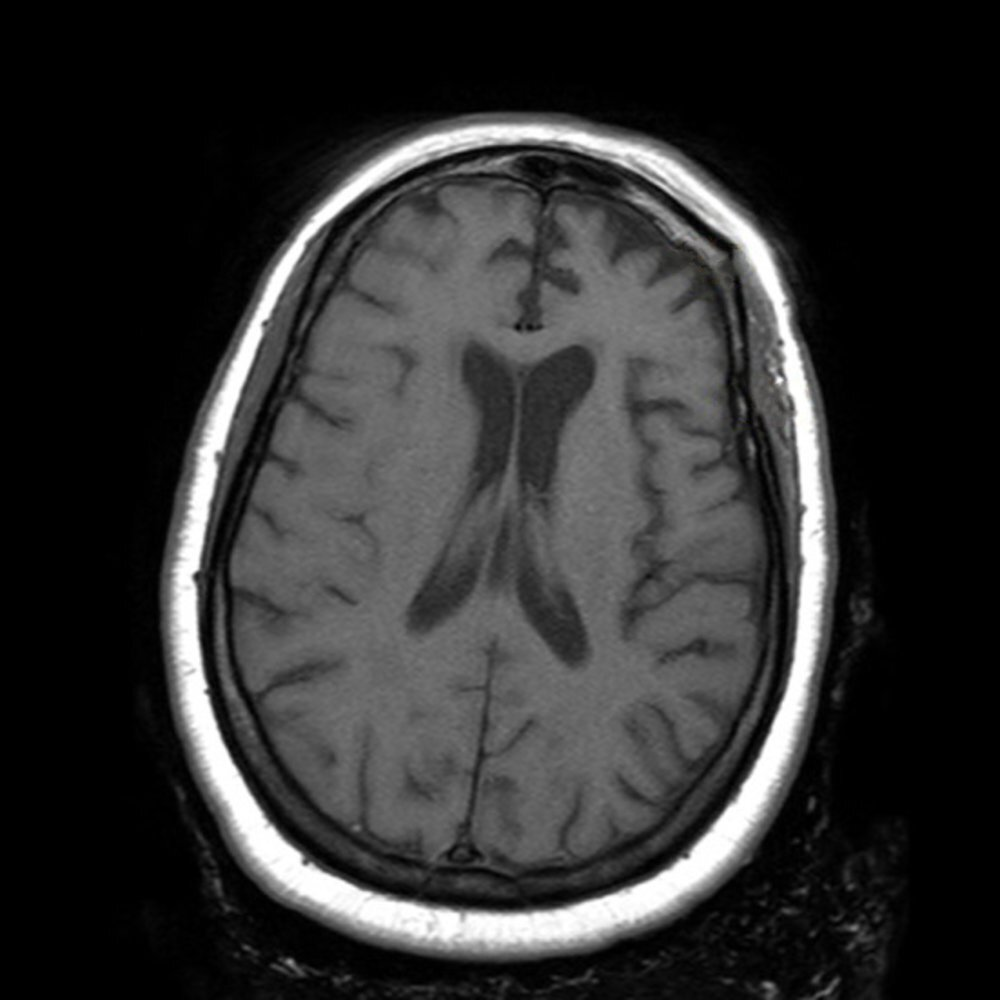
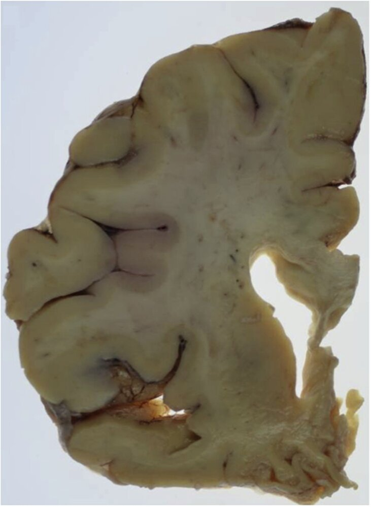

# Frontotemporal dementia

*Categories: Clinical knowledge > Neurology > Neurocognitive disorders > Frontotemporal dementia*

[Original Article Link](https://coursology-qbank.com/amboss/article/w30hkf)

---

## Summary

Frontotemporal <u>dementia</u> (FTD) is a progressive <u>neurodegenerative disorder</u> that affects the frontal, insular, and/or temporal cortices and is associated with pathological protein accumulations (e.g., <u>tau</u>, <u>TDP-43</u>). Historically, the term Pick disease was often used synonymously with FTD; however, it specifically refers to a pathological subtype. Onset is typically between 40 and 60 years of age. Early symptoms include behavioral changes (e.g., disinhibition, <u>apathy</u>), while <u>intelligence</u>, <u>memory</u>, and orientation are initially preserved. As the disease progresses, motor deficits (such as <u>parkinsonism</u>) and more widespread cognitive decline may develop. Diagnosis is primarily clinical and is supported by <u>neuroimaging</u> findings, with additional investigations used to exclude alternative causes of symptoms. There is currently no disease-modifying treatment, and management focuses on <u>supportive care</u> and symptomatic relief.

---

## Epidemiology

* Age of onset: : usually between 40 and 60 years;  (typically younger than in <u>Alzheimer disease</u>)

* <u>Prevalence</u>: 3–4/100,000 in patients ≤ 65 years

Epidemiological data refers to the US, unless otherwise specified.

---

## Etiology

* Generally associated with pathological intracellular <u>inclusion bodies</u> (<u>Pick bodies</u>) that are caused by mutations in <u>tau</u> (main protein component of <u>Pick bodies</u>) or progranulin (precursor of granulin, which regulates cell growth) <u>proteins</u>

* Also associated with <u>ubiquitin</u> <u>inclusion bodies</u> hypothesized to be caused by dysfunction of the <u>ubiquitin proteasome system</u>

* Familial predisposition (<u>autosomal dominant</u>): ∼ 10–25% of FTD cases

---

## Clinical features

The occurrence, timing, and prominence of features depend on the <u>subtype of FTD</u>.

* <u>Personality</u> and behavioral changes ;  [[3]](https://coursology-qbank.com/amboss/article/OtdId70)

* Disinhibited behavior 

* Inability to observe social etiquette (e.g., offensive language, not respecting personal boundaries, lack of embarrassment)

* Impulsivity (e.g., reckless spending) [[4]](https://coursology-qbank.com/amboss/article/Btdzf70)

* Overeating, change in dietary preferences (e.g., new preference for sweet foods)

* <u>Hyperorality</u>

* Emotional symptoms

* <u>Apathy</u>

* Loss of empathy

* Exaggerated emotional display

* Irritability

* Stereotypies

* <u>Compulsive behaviors</u>

* Speech and language impairment  [[3]](https://coursology-qbank.com/amboss/article/OtdId70)

* <u>Aphasia</u>

* <u>Anomic aphasia</u>

* <u>Agrammatism</u>

* <u>Verbal apraxia</u>

* Late symptoms [[3]](https://coursology-qbank.com/amboss/article/OtdId70)

* Motor symptoms (e.g., <u>parkinsonism</u>, <u>dysphagia</u>)

* <u>Global</u> cognitive decline

> [!TIP]
> <u>Global</u> <u>memory</u>, <u>intelligence</u>, and orientation are usually initially preserved.

---

## Subtypes and variants

### Clinical subtypes of FTD [[3]](https://coursology-qbank.com/amboss/article/OtdId70)

* Behavioral variant frontotemporal dementia

* Most common subtype (50–70% of cases) [[3]](https://coursology-qbank.com/amboss/article/OtdId70)

* Early <u>personality</u> and behavioral changes (e.g., <u>apathy</u>, disinhibition)

* Primary progressive aphasia (<u>PPA</u>)

* Nonfluent variant PPA 

* <u>Agrammatism</u>

* <u>Verbal apraxia</u>

* Phonological errors

* Impaired comprehension of complex sentences

* Semantic variant PPA 

* <u>Anomic aphasia</u>

* Impaired word comprehension

### FTD-related disorders [[4]](https://coursology-qbank.com/amboss/article/Btdzf70)

Disorders with similar pathological characteristics (e.g., <u>tau protein</u> deposition) include:

* <u>Progressive supranuclear palsy</u>

* <u>Corticobasal degeneration</u>

* <u>FTD-motor neuron disease</u>

---

## Diagnosis

### General principles [[3]](https://coursology-qbank.com/amboss/article/OtdId70)[[5]](https://coursology-qbank.com/amboss/article/jtd_W70)

* FTD is a primarily <u>clinical diagnosis</u>.

* Perform a comprehensive clinical evaluation, including <u>cognitive testing</u>.

* Interview family members, as information obtained from patients may be unreliable.

* Diagnostic criteria may be used by specialists to confirm FTD subtypes.

* <u>Neuroimaging</u> is required to exclude other causes and can also help identify the FTD subtype.

* Consider further testing as needed.

* Laboratory tests are used to rule out alternative causes of cognitive decline (see “<u>Initial evaluation of major neurocognitive disorder</u>”).

* Advanced testing may be done in consultation with <u>neurology</u> (e.g., testing for genetic factors).

* Definitive diagnosis requires postmortem neurohistopathological confirmation (not usually performed).

### <u>Neuroimaging</u> [[3]](https://coursology-qbank.com/amboss/article/OtdId70)[[5]](https://coursology-qbank.com/amboss/article/jtd_W70)

* <u>MRI</u> <u>brain</u>

* Evaluation for characteristic structural changes

* Exclusion of other reversible or nondegenerative causes of cognitive decline

* Supportive findings: <u>atrophy</u> of the frontal and/or <u>temporal lobes</u>

* Common patterns and localizations of subtypes differ.

* <u>FDG-PET/CT</u>

* May help distinguish between FTD and <u>Alzheimer disease</u>, as well as between different FTD subtypes

* Findings: frontotemporal hypometabolism

Frontotemporal dementia

---

## Pathology

Pathological changes in FTD are commonly referred to as frontotemporal lobar degeneration (<u>FTLD</u>).

### Macroscopic [[6]](https://coursology-qbank.com/amboss/article/rzbf8w)

* <u>Atrophy</u> of the temporal and/or frontal lobes

* Often beginning on one side and subsequently affecting both hemispheres

Frontotemporal dementia

### Microscopic [[6]](https://coursology-qbank.com/amboss/article/rzbf8w)

* Detection of different types of intracellular <u>inclusions</u> in surviving <u>neurons</u> (<u>tau</u> or <u>TDP-43</u> occur in approx. 90%)

* Pick bodies (<u>FTLD</u>-<u>tau</u>);   : round <u>cytoplasmic</u> <u>inclusions</u> of aggregated hyperphosphorylated <u>tau proteins</u> ;  

* Associated with Pick disease

* Found in approx. 40% of patients with <u>FTLD</u>

* Also found in other <u>neurodegenerative diseases</u> (e.g., <u>progressive supranuclear palsy</u>, <u>corticobasal degeneration</u>)

* <u>Silver stain</u>: classic <u>Pick bodies</u> stain positive, but many patients with <u>tau</u> <u>inclusions</u> stain negative

* FTLD‑TDP: <u>inclusions</u> with ubiquitinated TDP‑43

* FTLD‑ALS/DPR

* FTLD‑FUS

* Nonspecific <u>gliosis</u>

* Formation of microvacuoles

* Loss of neuronal tissue

* Swollen <u>neurons</u> (Pick cells)

> [!NOTE]
> Historically, FTD was referred to as Pick disease; however, Pick disease is a pathological <u>subtype of FTD</u>.

---

## Differential diagnoses

See “<u>Differential diagnosis of dementia subtypes</u>.”

The differential diagnoses listed here are not exhaustive.

---

## Treatment

### General principles [[7]](https://coursology-qbank.com/amboss/article/utdp270)

* There is currently no disease-modifying therapy for FTD. [[2]](https://coursology-qbank.com/amboss/article/kIYm1q)

* <u>SSRIs</u> may be effective for the management of some behavioral symptoms (e.g., disinhibition and <u>hyperorality</u>).

* <u>Speech therapy</u> may be effective for <u>verbal apraxia</u>.

### Supportive management [[7]](https://coursology-qbank.com/amboss/article/utdp270)

* <u>Supportive care for dementia</u>, e.g.:

* Lifestyle modifications

* <u>Cognitive training</u>

* Referral for <u>swallowing assessment</u> and <u>occupational therapy</u> as needed

* <u>Management of neuropsychiatric symptoms of dementia</u>, e.g.:

* Low-dose <u>SSRIs</u> for <u>depression</u>

* Low-dose <u>atypical antipsychotics</u> may be considered for <u>agitation</u> or <u>psychosis</u> under specialist guidance.

* Management of conditions in advanced <u>dementia</u>

> [!TIP]
> <u>Cholinesterase inhibitors</u> and <u>memantine</u> are usually not effective and may even worsen symptoms in patients with FTD. [[7]](https://coursology-qbank.com/amboss/article/utdp270)

> [!WARNING]
> <u>Atypical antipsychotic</u> use in <u>dementia</u> is associated with increased mortality and should be used with caution. [[8]](https://coursology-qbank.com/amboss/article/dudoJ70)

---