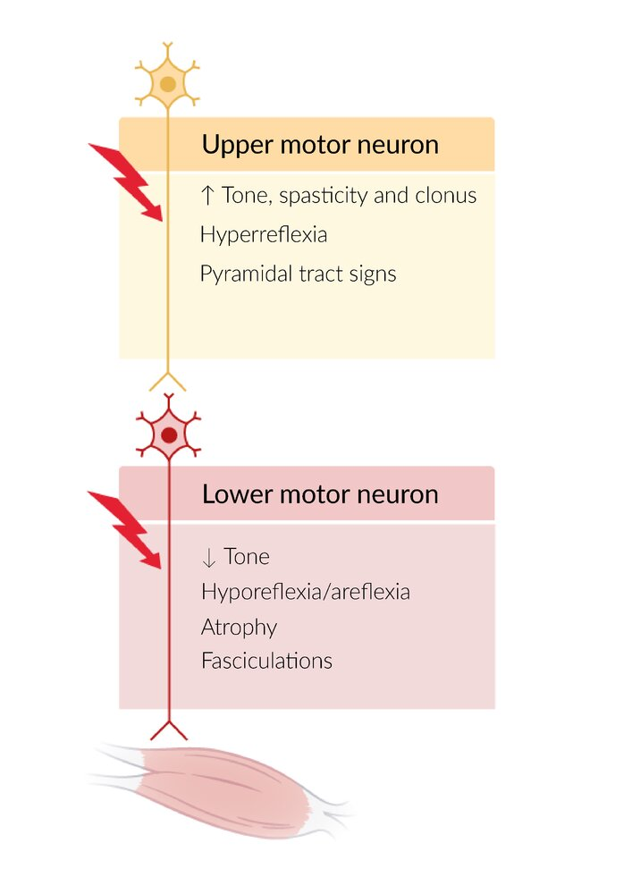

# Amyotrophic lateral sclerosis

*Categories: Clinical knowledge > Neurology > Neuromuscular disorders > Amyotrophic lateral sclerosis*

[Original Article Link](https://coursology-qbank.com/amboss/article/LR0wnf)

---

## Summary

Amyotrophic <u>lateral</u> <u>sclerosis</u> (ALS), formerly known as Lou Gehrig disease, is a fatal <u>neurodegenerative disease</u> characterized by progressive <u>upper motor neuron</u> (<u>UMN</u>) and <u>lower motor neuron</u> (<u>LMN</u>) damage. ALS usually manifests initially with asymmetric <u>weakness</u> in the hands or feet, but early presentation is highly variable and may be subtle (e.g., minor vocal changes). The mean age of onset is 65 years. Most patients develop <u>respiratory muscle weakness</u> and <u>dysphagia</u>. <u>Riluzole</u> and <u>edaravone</u> are <u>FDA</u>-approved for ALS treatment but have minimal impact on the disease course. <u>Multidisciplinary care</u> is essential and includes nursing care, <u>physiotherapy</u>, and eventually <u>respiratory support</u> and <u>enteral feeding</u>. Prognosis is poor, with a median survival of ∼ 3–5 years after symptom onset and a 10–20% survival rate of 10 years.

---

## Etiology

The definitive cause of ALS is still unknown. Studies have suggested an interaction between genetic predisposition and environmental factors.

### Genetics

Mutations of the following <u>genes</u> have been found in approx. 70% of familial <u>clusters</u> and some sporadic cases.  [[4]](https://coursology-qbank.com/amboss/article/-xbD_D)

* SOD1 [[5]](https://coursology-qbank.com/amboss/article/1Bb2-D)

* Codes for <u>superoxide dismutase</u>

* Mutations are associated with either a very aggressive or very slow disease progression

* Account for 15–20% of familial ALS cases

* TARDBP

* Сodes for the TDP-43 protein involved in <u>DNA repair</u>

* In ALS, abnormally ubiquitinated <u>TDP-43</u> forms <u>inclusions</u> within motor <u>neurons</u>.

* Accounts for ∼ 5% of familial ALS cases

* C9orf72

* Most common mutated <u>gene</u> in familial ALS (account for 30–40% of familial ALS cases)

* Associated with a combination of ALS and <u>frontotemporal dementia</u>

* FUS

* Mutations are associated with a young-onset rapidly-progressing ALS. [[1]](https://coursology-qbank.com/amboss/article/XBb9zD)

* Accounts for ∼ 5% of familial ALS cases

### Environmental <u>risk factors</u> [[6]](https://coursology-qbank.com/amboss/article/WBbP-D)

* Exposure to the following substances:

* β-N-methylamino-L-<u>alanine</u>  [[7]](https://coursology-qbank.com/amboss/article/YBbnzD)

* Pesticides (e.g., cis-chlordane, pentachlorobenzene) [[8]](https://coursology-qbank.com/amboss/article/RBbl0w)

* Lead

* <u>Head trauma</u>

* Individuals serving in US military  [[6]](https://coursology-qbank.com/amboss/article/WBbP-D)[[9]](https://coursology-qbank.com/amboss/article/dBbo-D)

* Smoking

---

## Pathophysiology

* Classically affects the entire motor <u>neuron</u> system at two or more levels (both upper and lower motor <u>neuron</u> degeneration).

* <u>Upper motor neurons</u> in the precentral <u>gyrus</u> and, frequently, <u>prefrontal cortex</u>

* <u>Lower motor neurons</u> in the <u>anterior horn</u> of the spinal cord and <u>brainstem</u>

* Potential underlying mechanisms include abnormal <u>RNA processing</u> and protein aggregation, <u>excitotoxicity</u>, <u>mitochondrial</u> dysfunction, and defective <u>neurofilaments</u>.

References:[[10]](https://coursology-qbank.com/amboss/article/CiYqFK)[[11]](https://coursology-qbank.com/amboss/article/ZBbZzD)

---

## Clinical features

### General characteristics [[12]](https://coursology-qbank.com/amboss/article/cndaHq0)

* Combined upper and <u>lower motor neuron signs</u>: See “<u>UMN signs vs. LMN signs</u>.”

* Constant disease progression: usually begins in one extremity, then progresses to all extremities and, after months or years, the respiratory system

### Early features [[12]](https://coursology-qbank.com/amboss/article/cndaHq0)

Clinical presentation may be subtle (e.g., vocal changes or difficulties grasping objects) and is highly variable.

* Weight loss

* <u>Bulbar palsy</u> (25% of patients at onset): e.g., <u>dysarthria</u>, <u>tongue</u> <u>atrophy</u>, <u>dysphagia</u> [[12]](https://coursology-qbank.com/amboss/article/cndaHq0)

* <u>Pseudobulbar palsy</u> with <u>pseudobulbar affect</u>

* Asymmetric limb <u>weakness</u> that often begins in the hands and feet but may affect any part of the body

* Split hand sign: <u>atrophy</u> of the muscles in the <u>thenar eminence</u> due to degeneration of the <u>lateral</u> portion of the <u>anterior horn</u> of the spinal cord

* <u>Fasciculations</u>, muscle <u>spasticity</u>, <u>clonus</u>, and/or <u>hyperreflexia</u>

### Late features [[12]](https://coursology-qbank.com/amboss/article/cndaHq0)

* <u>Frontotemporal dementia</u> (∼15 % of patients with ALS) [[12]](https://coursology-qbank.com/amboss/article/cndaHq0)

* <u>Dysautonomia</u> (e.g., <u>constipation</u>, <u>neurogenic bladder</u>)

* <u>Respiratory muscle weakness</u> causing:

* <u>Dyspnea</u> with <u>hypoxia</u> and/or <u>hypercarbia</u>

* Possible <u>respiratory failure</u>

* Severe <u>dysphagia</u> (leading to weight loss and <u>malnutrition</u>)

Clinical features and pathophysiology of amyotrophic lateral sclerosis

Findings in lower or upper motor neuron damage

---

## Diagnosis

### Approach [[12]](https://coursology-qbank.com/amboss/article/cndaHq0)

* Perform a complete <u>neurological examination</u>, focusing on <u>motor function</u>.

* Obtain <u>electrodiagnostic studies</u>;  to support the diagnosis in patients with suggestive clinical features.

* Obtain additional studies (e.g., <u>neuroimaging</u>; , <u>vitamin B12</u>) to exclude alternative <u>causes of neuromuscular weakness</u>.

* Consider a validated clinical tool to support the diagnosis (e.g., the Gold Coast diagnostic criteria).  [[13]](https://coursology-qbank.com/amboss/article/eKdx2I0)

> [!TIP]
> Progressive <u>UMN signs</u> and <u>LMN signs</u> without <u>sensory function</u> compromise strongly suggests ALS, but alternative diagnoses should be excluded.

### <u>Electrodiagnostic studies</u> [[12]](https://coursology-qbank.com/amboss/article/cndaHq0)

* <u>Electromyography</u>: Findings must be confirmed in at least two muscular regions.

* Signs of <u>denervation</u> (e.g., fibrillations, positive <u>sharp waves</u>, <u>fasciculations</u>)

* Signs of reinnervation (e.g., large-amplitude complex <u>motor unit action potentials</u>)

* <u>Nerve conduction studies</u>

* Sensory and motor nerve conduction are usually normal; , but motor <u>neuron</u> conduction <u>amplitudes</u> may be reduced.

* Abnormal conduction suggests an alternative diagnosis (e.g., <u>multifocal motor neuropathy</u>).

### Additional studies [[12]](https://coursology-qbank.com/amboss/article/cndaHq0)[[14]](https://coursology-qbank.com/amboss/article/Dod1VI0)

See also “<u>Subacute, chronic, or gradually progressive causes of weakness</u>” for a comparison of differential diagnoses.

* <u>Neuroimaging</u>: Findings are usually normal in early stages of ALS.

* <u>MRI</u> <u>spine</u> without IV contrast: to exclude <u>spinal cord compression</u> (e.g., due to <u>disc herniation</u>, <u>neoplasms</u>)

* <u>MRI</u> head with and without IV contrast: to help exclude infectious diseases or <u>neoplasms</u>

* <u>Laboratory studies</u>

* Routine <u>laboratory studies</u> (e.g., <u>CBC</u>, <u>CMP</u>) are usually normal, ↑ <u>CPK</u> levels may be present

* <u>Vitamin B12</u>, <u>TFTs</u>: to rule out treatable metabolic causes of neurological symptoms

* <u>Lyme serology</u>: to rule out <u>neuroborreliosis</u> in patients from an <u>endemic</u> area

* Other studies in consultation with a <u>neurologist</u> (e.g., <u>anti-AChR antibodies</u>)

> [!TIP]
> <u>Vitamin B12</u> deficiency and <u>thyroid disorders</u> cause neurological features that are similar to those of ALS.

---

## Differential diagnoses

* Multifocal motor neuropathy (<u>MMN</u>) [[17]](https://coursology-qbank.com/amboss/article/3PaSek)[[18]](https://coursology-qbank.com/amboss/article/mUXVdx)

* A type of neuropathy that solely affects motor <u>neurons</u>

* Slowly progressing asymmetrical <u>paralysis</u> and areflexia that typically affect the <u>distal</u> upper limbs

* Muscle <u>atrophy</u> is rare.

* <u>EMG</u> may reveal motor nerve conduction block.

* Protein levels in <u>CSF</u> are usually normal.

* Highly elevated anti-GM1-<u>ganglioside</u> <u>antibody</u> <u>titers</u>

* <u>Myasthenia gravis</u>

* <u>Weakness</u> improves with <u>acetylcholinesterase inhibitors</u>

* No <u>UMN</u> or <u>LMN signs</u>

* <u>Lambert-Eaton myasthenic syndrome</u>

* <u>Proximal</u> <u>muscle weakness</u> that improves with repetitive stimulation (<u>Lambert sign</u>)

* Symptoms of <u>autonomic dysfunction</u> (e.g., dry mouth)

* <u>Anti-VGCC antibodies</u>

* <u>Cervical spondylotic myelopathy</u>

* Sensory symptoms

* <u>LMN</u> confined to affected level of spinal compression

* <u>MRI</u> shows <u>spinal cord compression</u>

* <u>Thyrotoxicosis</u>
* <u>Myopathy</u>, fine <u>tremor</u>, and <u>hyperreflexia</u> resolve with <u>treatment of hyperthyroidism</u>

* <u>Poliomyelitis</u>

* Asymmetric <u>flaccid paralysis</u>

* <u>Poliovirus</u> <u>RNA</u> in <u>CSF</u>

* Other conditions, e.g.:

* <u>Vitamin B12</u> deficiency

* <u>Copper deficiency</u>

* <u>Neuroborreliosis</u>

* <u>Hyperparathyroidism</u>

The differential diagnoses listed here are not exhaustive.

---

## Treatment

### General principles

* There is no curative therapy for ALS; management is mostly supportive.

* Pharmacological treatment only modestly improves <u>life expectancy</u> and functional decline.

* Consult <u>neurology</u> and other specialists (e.g., <u>physical therapy</u>, <u>speech therapy</u>) for a <u>multidisciplinary care</u> approach.

* Encourage early <u>advance care planning</u>.

> [!TIP]
> ALS is a chronic, progressive, life-limiting condition. Encourage <u>advance care planning</u> and early engagement with <u>palliative care</u>.

### <u>Supportive care</u>

* Monitoring for disease progression

* Assess for <u>respiratory failure</u>. [[19]](https://coursology-qbank.com/amboss/article/uqdpZr0)

* Obtain routine <u>PFTs</u>. [[4]](https://coursology-qbank.com/amboss/article/-xbD_D)

* Findings may include decreased <u>maximum inspiratory pressure</u> and/or <u>PFT findings in restrictive lung disease</u>.

* Screen for <u>dysphagia</u> (e.g., using a <u>clinical swallow evaluation</u>).

* Management of symptoms and prevention of complications, e.g.: [[11]](https://coursology-qbank.com/amboss/article/ZBbZzD)[[12]](https://coursology-qbank.com/amboss/article/cndaHq0)

* <u>Bronchopulmonary hygiene</u> (e.g., oral or <u>tracheal</u> suctioning, <u>mucolytics</u>, chest <u>physiotherapy</u>) [[12]](https://coursology-qbank.com/amboss/article/cndaHq0)

* Management of <u>dysphagia</u>: Consider <u>specialized nutritional support</u> as needed (e.g., <u>PEG tube</u>).

* <u>Management of constipation</u> [[12]](https://coursology-qbank.com/amboss/article/cndaHq0)

* <u>Pain management</u> [[12]](https://coursology-qbank.com/amboss/article/cndaHq0)

* <u>Advance care planning</u> 

* Discuss prognosis and end-of-life choices early (e.g., care setting in a <u>nursing home</u>).

* Consider <u>palliative care</u> as needed.

* Assess for <u>caregiver burnout</u>.

### Pharmacological treatment [[11]](https://coursology-qbank.com/amboss/article/ZBbZzD)[[12]](https://coursology-qbank.com/amboss/article/cndaHq0)[[20]](https://coursology-qbank.com/amboss/article/WndPHq0)

Consider ALS-targeted pharmacological treatment based on <u>shared decision-making</u>, e.g.:

* Riluzole

* A <u>sodium channel blocker</u> that inhibits <u>glutamate</u> release in the <u>CNS</u> and decreases <u>glutamate</u> <u>excitotoxicity</u>

* May prolong <u>life expectancy</u> (on average for 2–3 months) and slow functional decline in patients with late-stage ALS [[20]](https://coursology-qbank.com/amboss/article/WndPHq0)

* Edaravone

* A <u>reactive oxygen species</u> scavenger

* Shown to slow functional decline in some patients with ALS

* Sodium phenylbutyrate/taurursodiol [[21]](https://coursology-qbank.com/amboss/article/1-12wj0)[[22]](https://coursology-qbank.com/amboss/article/W-1Pwj0)

* A combination of <u>sodium phenylbutyrate</u> and taurursodiol (<u>ursodeoxycholic acid</u> conjugated with taurine)

* No longer commercially available in the US as of 2024

> [!NOTE]
> Rilouzole rilly helps treat Lou Gehrig disease.

### <u>Respiratory support</u> for ALS [[4]](https://coursology-qbank.com/amboss/article/-xbD_D)[[12]](https://coursology-qbank.com/amboss/article/cndaHq0)[[20]](https://coursology-qbank.com/amboss/article/WndPHq0)

* <u>Noninvasive positive-pressure ventilation</u> 

* May improve <u>life expectancy</u> and quality of life

* Consider in patients with:

* Signs of <u>respiratory muscle weakness</u> (e.g., <u>orthopnea</u>, daytime fatigue)

* Abnormal oximetry (e.g, <u>SaO2</u> < 90% during at least 5% of <u>sleep</u> time) [[4]](https://coursology-qbank.com/amboss/article/-xbD_D)

* Abnormal <u>PFTs</u> (e.g., <u>VC</u> < 80% of the predicted value) [[4]](https://coursology-qbank.com/amboss/article/-xbD_D)

* <u>Invasive mechanical ventilation</u> [[19]](https://coursology-qbank.com/amboss/article/uqdpZr0)[[23]](https://coursology-qbank.com/amboss/article/dKdo2I0)

* <u>Tracheostomy</u> may be considered if <u>noninvasive ventilation</u> is insufficient or not possible.

* If considering <u>intubation</u> (e.g., in emergency settings):

* Review <u>goals of care</u> (e.g., <u>DNI order</u>, parameters for withdrawal of ventilation).

* Do not use depolarizing <u>neuromuscular blockers</u> (e.g., <u>succinylcholine</u>) during <u>intubation</u>.

* See “<u>Ventilation strategy for neuromuscular weakness</u>.”

---

## Prognosis

* ALS is incurable.

* Median survival is ∼ 3–5 years after symptom onset. [[1]](https://coursology-qbank.com/amboss/article/XBb9zD)[[14]](https://coursology-qbank.com/amboss/article/Dod1VI0)

* <u>5-year survival rate</u>: 30% [[1]](https://coursology-qbank.com/amboss/article/XBb9zD)[[24]](https://coursology-qbank.com/amboss/article/UVYbFL)

* 10-year survival rate: 10–20% [[1]](https://coursology-qbank.com/amboss/article/XBb9zD)[[24]](https://coursology-qbank.com/amboss/article/UVYbFL)

* Early bulbar and/or respiratory symptoms are associated with a worse prognosis.

---