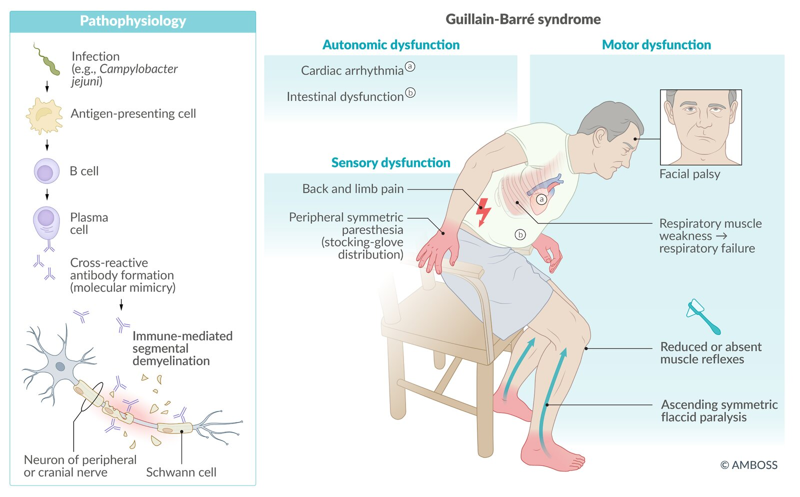

# Guillain-Barré syndrome

*Categories: Clinical knowledge > Neurology > Neuromuscular disorders > Guillain-Barré syndrome*

[Original Article Link](https://coursology-qbank.com/amboss/article/7R04of)

---

## Summary

Guillain-Barré syndrome (<u>GBS</u>) is an acute immune-mediated <u>polyradiculoneuropathy</u> that typically manifests with bilateral ascending <u>flaccid paralysis</u> and sensory involvement, e.g., <u>paresthesia</u>. The pathogenesis of <u>GBS</u> involves <u>autoantibodies</u> against <u>antigens</u> in the <u>myelin</u> sheath, other Schwann-cell <u>antigens</u>, and <u>axon</u> membranes. Approximately 65% of patients have an <u>upper respiratory tract</u> or <u>gastrointestinal infection</u> before the onset of <u>GBS</u> symptoms. Diagnosis is primarily clinical; alternative diagnoses should be considered especially in patients with atypical presentations. <u>Cerebrospinal fluid</u> (<u>CSF</u>) analysis showing <u>albuminocytologic dissociation</u> and <u>electrodiagnostic study</u> findings help support the diagnosis. Medical treatment depends on the severity of symptoms; available treatment options are <u>intravenous immunoglobulin</u> (<u>IVIg</u>) and <u>plasmapheresis</u>. Close monitoring is required for all patients. Complications such as <u>respiratory failure</u>, <u>pulmonary embolism</u>, and/or <u>cardiac arrest</u> increase mortality. Up to 20% of patients remain severely disabled and approximately 5% of patients die despite medical treatment.

---

## Epidemiology

* <u>Incidence</u> [[1]](https://coursology-qbank.com/amboss/article/FMXgqA)

* ∼ 1 case per 100,000 individuals

* Adults are affected more frequently than children.

* Sex: <u>♂</u> > <u>♀</u> (1.5:1) [[2]](https://coursology-qbank.com/amboss/article/TPa6Vk)

Epidemiological data refers to the US, unless otherwise specified.

---

## Etiology

* Overview

* About two-thirds of <u>GBS</u> patients experience symptoms of an upper respiratory or <u>gastrointestinal tract</u> infection up to 6 weeks prior to onset of <u>GBS</u>. [[2]](https://coursology-qbank.com/amboss/article/TPa6Vk)[[3]](https://coursology-qbank.com/amboss/article/YVWnG40)

* The causal connection between pathogens and <u>GBS</u> is still undetermined.

* Associated pathogens [[1]](https://coursology-qbank.com/amboss/article/FMXgqA)[[4]](https://coursology-qbank.com/amboss/article/EhX8fB)[[5]](https://coursology-qbank.com/amboss/article/gPaFVk)

* <u>Campylobacter jejuni</u>: <u>Campylobacter enteritis</u> is the most common disease associated with <u>GBS</u>.

* <u>Cytomegalovirus</u> (<u>CMV</u>)

* <u>HIV</u>

* <u>Influenza</u>

* <u>Zika virus</u>

* <u>Epstein-Barr virus</u>

* <u>SARS-CoV-2</u>

* <u>Mycoplasma pneumoniae</u>

* <u>Vaccination</u>

* There have been reports of small increases in <u>incidence</u> after administration of certain <u>vaccines</u>. [[6]](https://coursology-qbank.com/amboss/article/8MXOqA)

* In the US, <u>GBS</u> is listed as a <u>vaccination</u> injury for the seasonal <u>influenza vaccines</u>.

---

## Pathophysiology

* Postinfectious autoimmune reaction that generates cross-reactive <u>antibodies</u> (<u>molecular mimicry</u>)  [[7]](https://coursology-qbank.com/amboss/article/RPalek)

* Infection triggers <u>humoral</u> response → formation of <u>autoantibodies</u> against <u>gangliosides</u> (e.g., GM1, GD1a) or other unknown <u>antigens</u> of peripheral <u>Schwann cells</u> → immune-mediated segmental demyelination → axonal degeneration of motor and sensory fibers in peripheral and <u>cranial nerves</u> (<u>CN III</u>–XII) [[7]](https://coursology-qbank.com/amboss/article/RPalek)

Guillain-Barré syndrome

---

## Clinical features

Disease extent and severity in <u>GBS</u> vary widely, from mild <u>muscle weakness</u> to <u>quadriplegia</u> and <u>respiratory failure</u>.

### Typical disease progression

* Onset is acute or subacute, and symptoms progress rapidly.

* Symptoms peak at ∼ 2–4 weeks and then plateau over months or years, followed by partial or complete resolution. [[2]](https://coursology-qbank.com/amboss/article/TPa6Vk)[[3]](https://coursology-qbank.com/amboss/article/YVWnG40)

### Typical presentation

Classic sensorimotor features are observed in most patients with <u>GBS</u> (see also “<u>Variants of GBS</u>”). [[3]](https://coursology-qbank.com/amboss/article/YVWnG40)

* Limb involvement:  typically bilateral and ascending from the lower limbs

* Progressive <u>flaccid paresis</u> or <u>paralysis</u>

* <u>Paresthesia</u>: stocking‑glove distribution  [[3]](https://coursology-qbank.com/amboss/article/YVWnG40)

* <u>Hyporeflexia</u> or areflexia typically begins in the lower limbs.  [[2]](https://coursology-qbank.com/amboss/article/TPa6Vk)

* Back and limb <u>pain</u> (often an early symptom)

* Involves <u>nociceptive</u> and <u>neuropathic pain</u>

* Affects approx. two-thirds of patients  [[8]](https://coursology-qbank.com/amboss/article/yOadEk)

* <u>Autonomic dysfunction</u>

* <u>Cardiac arrhythmias</u>, blood pressure fluctuations  [[2]](https://coursology-qbank.com/amboss/article/TPa6Vk)

* <u>Urinary retention</u> and/or intestinal dysfunction

* Respiratory muscle involvement: may lead to <u>respiratory failure</u>.

* <u>Cranial nerve</u> involvement

* <u>Facial diplegia</u>: due to bilateral <u>facial nerve</u> involvement (most frequently affected <u>cranial nerve</u> in <u>GBS</u>)

* <u>Bulbar dysfunction</u>

> [!WARNING]
> <u>GBS</u> can affect <u>respiratory muscle function</u>; life-threatening <u>respiratory failure</u> occurs in approx. 20% of patients. [[8]](https://coursology-qbank.com/amboss/article/yOadEk)[[9]](https://coursology-qbank.com/amboss/article/gVWFF40)

Guillain-Barré syndrome

---

## Subtypes and variants

### Subtypes of Guillain-Barré syndrome

Classification into subtypes is based on <u>electrodiagnostic study</u> findings; each subtype is associated with specific <u>autoantibodies</u>.

| Overview of <u>subtypes of Guillain-Barré syndrome</u> |  |  |  |  |  |  |
| --- | --- | --- | --- | --- | --- | --- |
| Subtype |  | Pathophysiology |  | <u>Epidemiology</u> | Characteristic features |  |
|  Acute inflammatory demyelinating polyneuropathy (<u>AIDP</u>) |  |   * <u>Autoantibodies</u> directed at <u>myelin</u> membranes lead to <u>demyelination</u>. [[7]](https://coursology-qbank.com/amboss/article/RPalek)  * Associated with <u>C. jejuni</u> and <u>CMV infection</u>    |  |  * Most common subtype (up to 90% of cases) in the US, Canada, and Europe [[2]](https://coursology-qbank.com/amboss/article/TPa6Vk)   |   * <u>Pain</u> and <u>cranial nerve</u> involvement are more common than in axonal neuropathies. [[7]](https://coursology-qbank.com/amboss/article/RPalek)  * <u>Nerve conduction studies</u> show signs of <u>demyelination</u>.    |  |
| Axonal loss |  Acute motor axonal neuropathy (<u>AMAN</u>) |   * Typically associated with <u>C. jejuni</u> [[7]](https://coursology-qbank.com/amboss/article/RPalek)  * Associated with anti-GD1a and <u>anti-GM1 antibodies</u>, which cause axonal loss [[2]](https://coursology-qbank.com/amboss/article/TPa6Vk)    |  |  * Most common subtype (30–65% of cases) in some Asian countries (e.g., China and Japan) and Mexico [[2]](https://coursology-qbank.com/amboss/article/TPa6Vk)   |   * More rapid progression, slower recovery, and higher rates of residual symptoms than <u>AIDP</u> [[2]](https://coursology-qbank.com/amboss/article/TPa6Vk)[[3]](https://coursology-qbank.com/amboss/article/YVWnG40)  * <u>Nerve conduction studies</u> show signs of <u>axonopathy</u>.    |  |
|  Acute motor and sensory axonal neuropathy (AMSAN) |  |  |  |  |  |  |

> [!TIP]
> Classification into subtypes does not affect treatment decisions but may inform prognosis. [[2]](https://coursology-qbank.com/amboss/article/TPa6Vk)[[3]](https://coursology-qbank.com/amboss/article/YVWnG40)

### Variants of Guillain-Barré syndrome

Variants of the classic sensorimotor presentation are characterized by the involvement of a specific group of muscles or nerves; overlap between variants is common.

* Miller-Fisher syndrome (MFS)  [[2]](https://coursology-qbank.com/amboss/article/TPa6Vk)[[3]](https://coursology-qbank.com/amboss/article/YVWnG40)

* Limited involvement; characteristic features include: [[2]](https://coursology-qbank.com/amboss/article/TPa6Vk)

* <u>Cranial nerve</u> involvement, typically <u>ophthalmoplegia</u>

* <u>Bulbar palsy</u>

* <u>Ataxia</u>

* Areflexia

* Anti‑GQ1b <u>antibodies</u> and anti‑GT1a <u>antibodies</u> are detected in 90% of patients. [[7]](https://coursology-qbank.com/amboss/article/RPalek)

* <u>Nerve conduction studies</u> are normal in most patients. [[7]](https://coursology-qbank.com/amboss/article/RPalek)

* Other variants include:

* <u>Bickerstaff brainstem encephalitis</u> (<u>BBE</u>)  [[9]](https://coursology-qbank.com/amboss/article/gVWFF40)

* Typical features include <u>ophthalmoplegia</u>, <u>ataxia</u>, and signs of <u>brainstem</u> dysfunction.

* Associated with anti‑GQ1b <u>antibodies</u>

* Pure motor variant

* Pharyngeal-cervical-brachial variant

* Paraparetic variant

* <u>Bilateral facial palsy</u> with <u>paresthesia</u> variant

---

## Diagnosis

### General principles [[9]](https://coursology-qbank.com/amboss/article/gVWFF40)[[10]](https://coursology-qbank.com/amboss/article/RVWl840)

* A diagnosis of <u>GBS</u> is based on:

* Typical clinical features, e.g., rapidly progressive bilateral limb <u>paresis</u> and/or sensory involvement, with <u>hyporeflexia</u> or areflexia

* <u>CSF analysis</u>

* <u>Electrodiagnostic studies</u>

* Diagnostic criteria may be considered to support the diagnosis, e.g., the National Institute of Neurological Disorders and <u>Stroke</u> or Brighton criteria.  [[9]](https://coursology-qbank.com/amboss/article/gVWFF40)[[10]](https://coursology-qbank.com/amboss/article/RVWl840)

* Evaluate patients for <u>differential diagnoses of GBS</u>, especially those with atypical presentations.  [[9]](https://coursology-qbank.com/amboss/article/gVWFF40)

* Consult a <u>neurologist</u> for all patients.

> [!TIP]
> A complete <u>neurological examination</u> is required for all patients.

### <u>CSF analysis</u> [[2]](https://coursology-qbank.com/amboss/article/TPa6Vk)[[7]](https://coursology-qbank.com/amboss/article/RPalek)

* Obtained to support diagnosis and rule out infectious and malignant causes

* Findings

* May be normal in the first 1–2 weeks of the disease [[2]](https://coursology-qbank.com/amboss/article/TPa6Vk)

* Typical: <u>albuminocytologic dissociation</u>, i.e., increased protein levels with <u>WBCs</u> normal or slightly elevated (typically < 10 cells/mcL) in <u>CSF</u>  [[11]](https://coursology-qbank.com/amboss/article/lkVvLu0)

> [!TIP]
> <u>CSF</u> cell count is typically normal in patients with <u>GBS</u>; consider other diagnoses in patients with a count > 50 cells/mcL. [[11]](https://coursology-qbank.com/amboss/article/lkVvLu0)

### <u>Electrodiagnostic studies</u>

#### <u>Nerve conduction studies</u> [[7]](https://coursology-qbank.com/amboss/article/RPalek)[[8]](https://coursology-qbank.com/amboss/article/yOadEk)

* Obtained to support diagnosis and/or to classify <u>GBS</u> into subtypes

* Findings vary according to the subtype of <u>GBS</u> and may be normal during the early stages of disease.

* Signs of <u>demyelination</u>;  in <u>AIDP</u> (e.g., ↓ <u>nerve conduction velocity</u>, conduction block, ↑ F‑wave latency)

* Signs of axonal damage in <u>AMAN</u> and AMSAN subtypes (e.g., ↓ <u>CMAP</u> amplitude)

* <u>Sural nerve</u> function is typically intact.

> [!TIP]
> <u>Nerve conduction study</u> findings may be normal in the week following symptom onset or in patients with certain <u>GBS</u> clinical variants, e.g., <u>Miller-Fisher syndrome</u>. [[9]](https://coursology-qbank.com/amboss/article/gVWFF40)

#### <u>Electromyography</u>

* Findings help differentiate between neuropathy and <u>myopathy</u>.

* Pathological spontaneous activity is a sign of an unfavorable prognosis.

* See “<u>EMG findings of neuropathy vs. myopathy</u>.”

### Additional studies [[7]](https://coursology-qbank.com/amboss/article/RPalek)[[9]](https://coursology-qbank.com/amboss/article/gVWFF40)

* Routine <u>laboratory studies</u>

* <u>CBC</u>, <u>CMP</u>: to exclude differential diagnoses, e.g., infection or <u>electrolyte</u> disturbances

* See “<u>Diagnostic workup for polyneuropathy</u>” for further details.

* <u>Serological studies</u> may be obtained to: [[7]](https://coursology-qbank.com/amboss/article/RPalek)

* Identify the causative <u>pathogen</u> for epidemiological data, e.g., during <u>outbreaks</u>

* Detect specific <u>autoantibodies</u>, e.g., <u>anti-GM1 antibodies</u>, <u>anti-GQ1b antibodies</u>

* Imaging studies: not routinely required but may help rule out differential diagnoses [[2]](https://coursology-qbank.com/amboss/article/TPa6Vk)[[9]](https://coursology-qbank.com/amboss/article/gVWFF40)

* <u>MRI</u> <u>spine</u> with contrast

* Consider in patients with abrupt acute onset of <u>paralysis</u> and <u>urinary retention</u> to rule out a spinal cause.  [[2]](https://coursology-qbank.com/amboss/article/TPa6Vk)

* <u>Nerve root</u> <u>enhancement</u> on <u>gadolinium</u>-enhanced <u>MRI</u> can support the diagnosis of <u>GBS</u> [[9]](https://coursology-qbank.com/amboss/article/gVWFF40)

* <u>MRI</u> <u>brain</u> with contrast: Consider in patients with suspected <u>CNS</u> involvement.

---

## Differential diagnoses

### Differential diagnoses of Guillain-Barré syndrome [[3]](https://coursology-qbank.com/amboss/article/YVWnG40)[[9]](https://coursology-qbank.com/amboss/article/gVWFF40)

See “<u>Etiology of polyneuropathy</u>” and “<u>Differential diagnoses of polyneuropathy</u>” for further details.

* Peripheral <u>polyneuropathies</u>

* <u>Chronic inflammatory demyelinating polyneuropathy</u>

* <u>Multifocal motor neuropathy</u>

* <u>Critical illness polyneuropathy</u>

* <u>Diabetic polyneuropathy</u>

* <u>CNS</u>-related 

* <u>Multiple sclerosis</u>

* <u>Transverse myelitis</u>

* <u>Poliomyelitis</u>

* <u>Spinal cord compression</u>

* <u>Brainstem syndrome</u>

* <u>Lyme disease</u>

* Metabolic or <u>electrolyte</u> disorders

* <u>Hypokalemia</u>

* <u>Hypophosphatemia</u>

* <u>Hypoglycemia</u>

* <u>Hypothyroidism</u>

* <u>Porphyria</u>

* <u>Vitamin deficiency</u>

* <u>Vitamin B1 deficiency</u>

* <u>Vitamin B12 deficiency</u>

* Muscle-related

* <u>Myasthenia gravis</u>

* <u>Lambert-Eaton myasthenic syndrome</u>

* <u>Drug-induced myopathy</u>

* Toxic <u>myopathy</u> (<u>botulism</u>, <u>tetanus</u>)

* Other

* <u>Vasculitides</u>

* <u>Diphtheria</u>

* <u>HIV</u>

* <u>Tick paralysis</u>

* <u>West Nile virus</u>

### <u>Clinical features of Guillain-Barré syndrome vs. transverse myelitis</u>

| Clinical features of Guillain-Barré syndrome vs. transverse myelitis |  |  |
| --- | --- | --- |
|  | Guillain-Barré syndrome | <u>Transverse myelitis</u> |
| Etiology |  * <u>Upper respiratory tract</u> or <u>gastrointestinal infections</u>, e.g., <u>C. jejuni</u> enteritis, <u>CMV</u>, <u>HIV</u>, <u>Zika virus</u>   |   * Most often <u>idiopathic</u>  * Parainfectious  * <u>Enteroviruses</u>  * <u>EBV</u>, <u>CMV</u>  * <u>Listeria monocytogenes</u>  * <u>Borrelia burgdorferi</u>  * <u>CNS</u> <u>demyelinating</u> disorders  * Systemic inflammatory autoimmune disorders  * <u>Paraneoplastic syndromes</u>    |
| Symptom onset |  * 1–6 weeks following an <u>upper respiratory tract</u> or <u>gastrointestinal tract</u> infection   |  * Acute or subacute (4 hours to 21 days)   |
| Motor findings |   * Ascending <u>paralysis</u>  * Involvement of respiratory muscles    |   * <u>Paresis</u>  * <u>Paraplegia</u>    |
| Reflexes |  * Reduced or absent   |   * Acute phase: reduced or absent  * Later stages: <u>hyperreflexia</u>, <u>Babinski sign</u>    |
| Sensory findings |   * Peripheral, symmetrical <u>paresthesias</u> with a stocking‑glove distribution  * <u>Neuropathic pain</u>    |   * Numbness  * <u>Paresthesias</u>  * Circumferential <u>dysesthesia</u> directly above the <u>sensory level</u>    |
| <u>Autonomic dysfunction</u> |   * <u>Arrhythmia</u>  * <u>Hypertension</u> or <u>hypotension</u>  * <u>Urinary retention</u>  * Intestinal dysfunction    |   * <u>Bladder</u> and/or <u>bowel incontinence</u>  * <u>Sexual dysfunction</u>    |
| <u>Cranial nerve</u> involvement |  * Bilateral <u>facial nerve</u> involvement (<u>facial diplegia</u>)   |  * Not affected   |
| <u>CSF</u> examination |  * <u>Albuminocytologic dissociation</u> (elevated protein levels, normal <u>WBC count</u>)   |  * <u>Pleocytosis</u> and/or elevated <u>IgG index</u>   |
| Imaging and findings |   * Usually normal  * <u>Nerve root</u> <u>enhancement</u> on <u>MRI</u> (with contrast) may support the diagnosis of <u>GBS</u>. [[9]](https://coursology-qbank.com/amboss/article/gVWFF40)    |  * <u>MRI</u>: focal, enhanced lesion in the spinal cord   |
| Electrophysiological findings |  * Decreased <u>nerve conduction velocity</u>   |  * Usually normal   |

The differential diagnoses listed here are not exhaustive.

---

## Management

### Approach [[9]](https://coursology-qbank.com/amboss/article/gVWFF40)

* Screen for <u>predictors of respiratory failure in GBS</u> and provide <u>respiratory support</u> early if indicated.

* Consult <u>neurology</u>.

* Admit all patients for close monitoring and supportive management.

* Start medical treatment (<u>IVIg</u> or <u>plasmapheresis</u>) promptly in patients with indications.

* Monitor for symptom progression and provide management as needed, e.g., <u>management of respiratory failure</u>, <u>bradycardia</u>, <u>dysphagia</u>.

> [!TIP]
> Even though many patients recover without treatment, hospital admission and <u>multidisciplinary care</u> are necessary because of the unpredictable course of the disease and risk of <u>death</u>.

### Medical treatment [[3]](https://coursology-qbank.com/amboss/article/YVWnG40)[[8]](https://coursology-qbank.com/amboss/article/yOadEk)[[9]](https://coursology-qbank.com/amboss/article/gVWFF40)

* Indications [[9]](https://coursology-qbank.com/amboss/article/gVWFF40)

* Inability to walk > 10 meters unaided

* Severe <u>autonomic dysfunction</u>, e.g., <u>cardiac arrhythmia</u>

* <u>Oropharyngeal dysphagia</u>

* <u>Respiratory failure</u>

* Options 

* <u>Intravenous immunoglobulin</u> (<u>IVIg</u>) DOSAGE  [[3]](https://coursology-qbank.com/amboss/article/YVWnG40)

* <u>Plasmapheresis</u>

* Special considerations: patients with <u>clinical variants of GBS</u> [[9]](https://coursology-qbank.com/amboss/article/gVWFF40)

* Treatment decisions should be made by a specialist.

* Very limited variants, e.g., MFS, may not require medical treatment.

* In severe variants, e.g., <u>BBE</u>, treatment with <u>IVIg</u> or <u>plasmapheresis</u> may be indicated.

> [!TIP]
> <u>Glucocorticoids</u> are not recommended for the <u>treatment of GBS</u>, as they have not been proven to hasten recovery or affect the prognosis. [[9]](https://coursology-qbank.com/amboss/article/gVWFF40)

### Monitoring for individuals with Guillain-Barré [[9]](https://coursology-qbank.com/amboss/article/gVWFF40)[[12]](https://coursology-qbank.com/amboss/article/N71-NR0)

The frequency of reassessment should be based on clinical severity; follow local protocols when available.

* Monitor <u>respiratory muscle function</u> frequently.

* Assess for <u>clinical features of respiratory distress</u>.

* Perform bedside <u>pulmonary function tests</u> (<u>PFTs</u>): <u>vital capacity</u> (<u>VC</u>), <u>maximal inspiratory pressure</u> (<u>MIP</u>), and <u>maximal expiratory pressure</u> (<u>MEP</u>)

* Monitor autonomic function.

* Initiate <u>continuous cardiac monitoring</u>.

* Patients with cardiac <u>autonomic dysfunction</u>, e.g., severe <u>bradycardia</u>, may require a <u>cardiac pacemaker</u>.

* Assess regularly for <u>bladder</u> and/or bowel dysfunction, e.g., <u>urinary retention</u>, <u>paralytic ileus</u>.

* Frequently assess <u>paresis</u> and/or <u>paralysis</u> progression and <u>swallowing</u> function.

> [!TIP]
> <u>ICU</u>-level care and <u>intubation</u> may be indicated.

> [!WARNING]
> Patients with <u>bulbar palsy</u>, involvement of the upper extremities, or <u>autonomic dysfunction</u> have an increased risk of <u>respiratory failure</u>. [[3]](https://coursology-qbank.com/amboss/article/YVWnG40)

### <u>Respiratory support</u>

Identify <u>predictors of respiratory failure in GBS</u> early to guide decisions about <u>intubation</u>, <u>mechanical ventilation</u>, and <u>ICU</u> admission. <u>Manage respiratory failure</u> urgently.

* Predictors of respiratory failure in GBS [[13]](https://coursology-qbank.com/amboss/article/d6WoPm0)[[14]](https://coursology-qbank.com/amboss/article/V6WGPm0)

* Clinical features at presentation

* Rapid progression (e.g., onset-to-peak disability interval < 7 days)

* <u>Bulbar palsy</u>

* <u>Facial nerve palsy</u> (especially bilateral)

* Neck <u>weakness</u>

* <u>Autonomic dysfunction</u>

* Bedside <u>PFTs</u>

* <u>VC</u> < 20 mL/kg or > 30% decline from baseline

* <u>MIP</u> less negative than -30 cm H2O or > 30% decline from baseline

* <u>MEP</u> < 40 cm H2O or > 30% decline from baseline

* Clinical prediction rule: The Erasmus <u>GBS</u> Respiratory Insufficiency Score (EGRIS) can be used to predict the need for <u>mechanical ventilation</u>.  [[15]](https://coursology-qbank.com/amboss/article/_6W5nm0)

* Management: See “<u>Management of respiratory failure</u>” for a general approach.

* <u>Endotracheal intubation</u>

* Consider early <u>intubation</u>: e.g., for <u>airway</u> protection in at-risk patients or to prevent complications of unplanned <u>intubation</u>.

* Avoid <u>succinylcholine</u>; use <u>nondepolarizing NMJ blockers</u> (e.g., <u>rocuronium</u>) if <u>paralytic agents for intubation</u> are indicated.

* <u>Mechanical ventilation</u>: Use a <u>ventilation strategy for neuromuscular weakness</u>.

> [!WARNING]
> Classic <u>signs of respiratory distress</u> and <u>signs of impending respiratory failure</u> typically occur late in <u>GBS</u>. Identify <u>predictors of respiratory failure in GBS</u> as early as possible. [[13]](https://coursology-qbank.com/amboss/article/d6WoPm0)[[14]](https://coursology-qbank.com/amboss/article/V6WGPm0)

> [!WARNING]
> <u>Succinylcholine</u> is contraindicated in patients with <u>GBS</u> as it can cause life-threatening <u>hyperkalemia</u> and <u>cardiac arrest</u>. [[16]](https://coursology-qbank.com/amboss/article/26WT4m0)

Erasmus GBS Respiratory Insufficiency Score (EGRIS)

### Supportive management [[9]](https://coursology-qbank.com/amboss/article/gVWFF40)

* Manage <u>neuropathic pain</u>.

* NSAIDS and <u>opioids</u> are usually not effective.

* Consider <u>gabapentin</u> or <u>carbamazepine</u>.

* See “<u>Analgesia for peripheral neuropathy</u>” for dosage suggestions.

* Prevent complications.

* <u>Prevention of decubitus ulcers</u>

* <u>Thromboprophylaxis</u> for patients confined to bed: <u>LMWH</u> or low dose <u>UFH</u>, <u>compression stockings</u> [[9]](https://coursology-qbank.com/amboss/article/gVWFF40)

* Early <u>physiotherapy</u>, physical <u>rehabilitation</u>, and psychosocial support

### Disposition [[9]](https://coursology-qbank.com/amboss/article/gVWFF40)[[12]](https://coursology-qbank.com/amboss/article/N71-NR0)

* All patients with suspected or confirmed <u>GBS</u> require inpatient evaluation and monitoring.

* Admit to <u>ICU</u> for any of the following life-threatening features of Guillain-Barré syndrome:" [[9]](https://coursology-qbank.com/amboss/article/gVWFF40)

* <u>Predictors of respiratory failure in GBS</u>

* <u>Signs of impending respiratory failure</u>

* Rapid progression of <u>paralysis</u>

* Severe <u>autonomic dysfunction</u>, e.g., <u>arrhythmia</u>

* Severe <u>dysphagia</u>, reduced <u>cough reflex</u>, or <u>signs of airway compromise</u>

---

## Prognosis

* Approx. 80% of patients with <u>GBS</u> regain the ability to walk unaided 6 months after symptom onset. [[9]](https://coursology-qbank.com/amboss/article/gVWFF40)

* Consider calculating the modified Erasmus <u>GBS</u> Outcome Score (mEGOS) to predict the patient's ability to walk unaided.

* 3–7% of patients with <u>GBS</u> die as a result of complications, e.g.: [[2]](https://coursology-qbank.com/amboss/article/TPa6Vk)[[8]](https://coursology-qbank.com/amboss/article/yOadEk)

* Respiratory muscle <u>paralysis</u>

* <u>Sepsis</u>

* <u>Pulmonary embolism</u>

* <u>Cardiac arrest</u>

* Patient factors associated with an increased risk of long-term disability include: [[3]](https://coursology-qbank.com/amboss/article/YVWnG40)

* Rapid symptom progression

* Severe symptoms at peak of the disease

* Older age

* Axonal damage (e.g., in <u>AMAN</u>)

* It may take > 5 years for symptoms to improve and/or resolve. [[9]](https://coursology-qbank.com/amboss/article/gVWFF40)

Modified Erasmus GBS Outcome Score (EGOS)

> [!TIP]
> <u>Death</u> can occur as many as > 30 days after onset of symptoms, during the recovery phase.

---