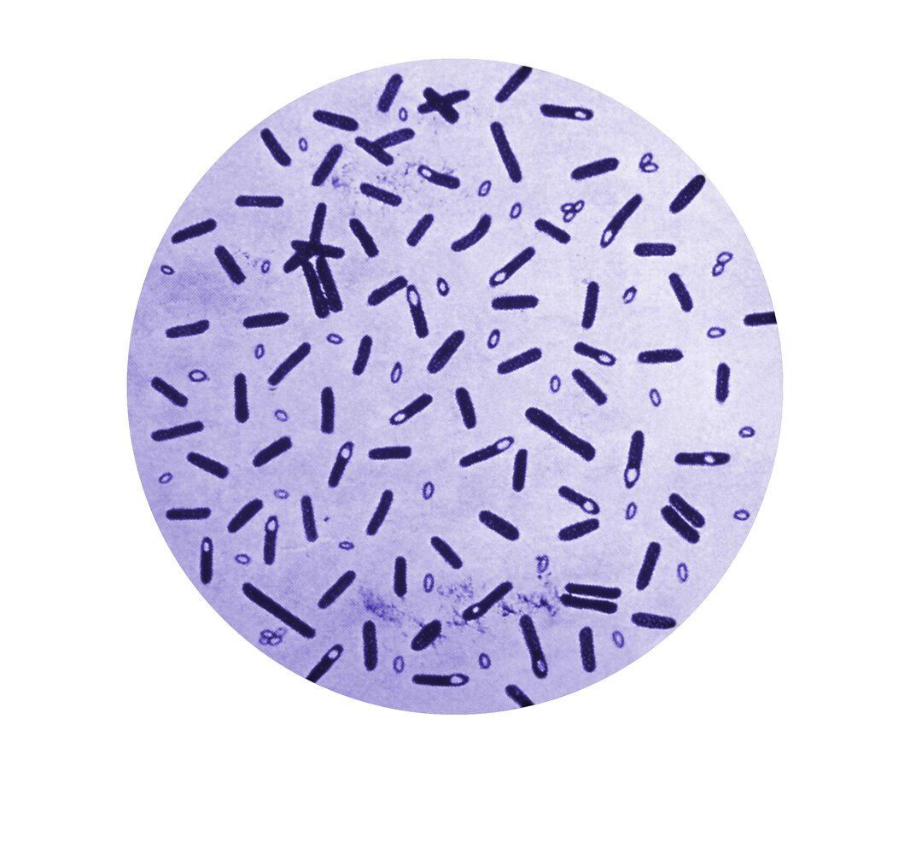
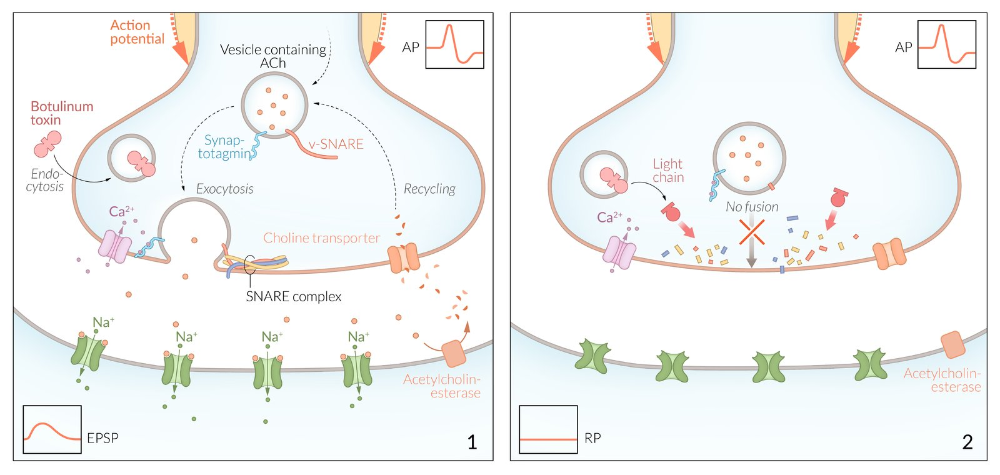
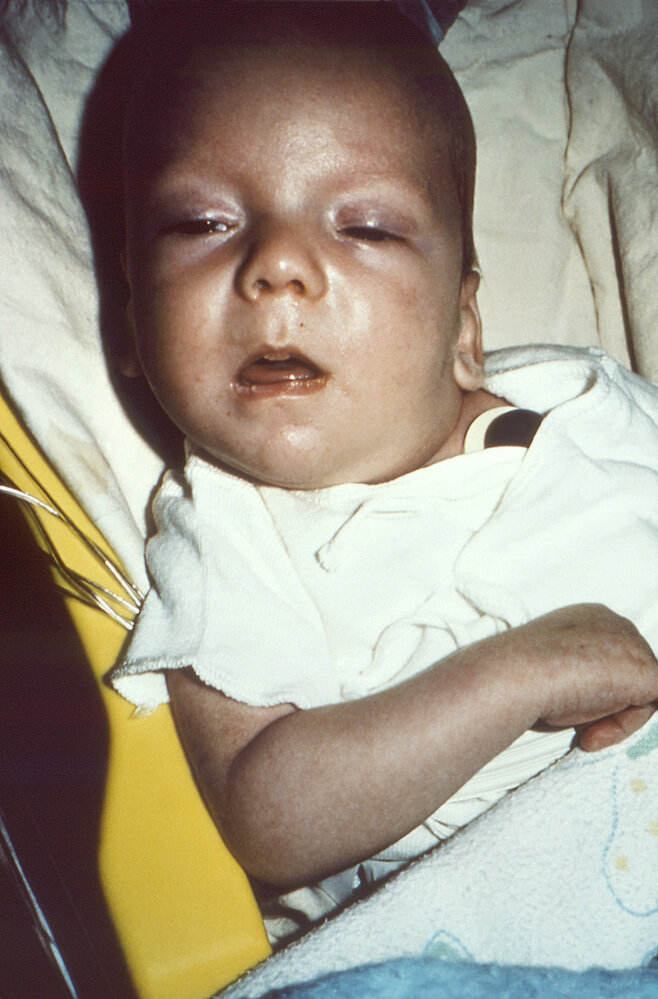

# Botulism

*Categories: Clinical knowledge > Neurology > Peripheral nerve disorders > Botulism*

[Original Article Link](https://coursology-qbank.com/amboss/article/nL07yg)

---

## Summary

Botulism is an acute paralytic disorder caused by exposure to <u>botulinum neurotoxin</u> produced by <u>Clostridium botulinum</u>. The most common forms are <u>foodborne botulism</u>, <u>infant botulism</u>, <u>wound botulism</u>, and <u>iatrogenic botulism</u>. Clinical features include <u>cranial nerve palsies</u>, <u>neuromuscular weakness</u> or <u>paralysis</u>, and <u>autonomic nervous system</u> dysfunction. Botulism is a <u>clinical diagnosis</u> later confirmed based on detection of <u>botulinum neurotoxin</u> or <u>C. botulinum</u> in collected specimens. Management focuses on <u>airway management</u> and preventing the progression of <u>paralysis</u> by administering <u>botulism antitoxin</u> therapy. All patients are admitted to the <u>ICU</u> for <u>supportive care</u> and monitoring.

---

## Overview

### Etiology [[1]](https://coursology-qbank.com/amboss/article/2pdTKI0)

* <u>Pathogen</u>: <u>C. botulinum</u>

* Gram-positive rod

* <u>Spore-forming</u>

* <u>Obligate anaerobe</u>

* Toxin: <u>botulinum neurotoxin</u> (heat-labile)

* Route of exposure: ingestion, colonized wound, or local injections

* <u>Foodborne botulism</u>: caused by ingestion of <u>botulinum neurotoxin</u> from contaminated food

* <u>Infant botulism</u>: caused by ingestion of <u>endospores</u> from the environment, leading to in vivo production of <u>botulinum neurotoxin</u>

* <u>Wound botulism</u>: caused by contamination of a wound, resulting in production of <u>botulinum neurotoxin</u>

* <u>Iatrogenic botulism</u>: caused by excessive injection of <u>botulinum neurotoxin</u>

* Adult <u>colonization</u> botulism (rare): similar to <u>infant botulism</u>

Clostridium botulinum

### Pathophysiology [[2]](https://coursology-qbank.com/amboss/article/ysddxr0)

Botulinum neurotoxin (a <u>protease</u>) cleaves <u>SNARE proteins</u> → prevention of <u>neurotransmitter</u>-containing <u>vesicles</u> fusing with the presynaptic membrane → inhibition of <u>acetylcholine</u> release from the presynaptic <u>axon</u> terminals → flaccid muscle <u>paralysis</u>

Mechanism of action: botulinum toxin

### Clinical features of botulism [[1]](https://coursology-qbank.com/amboss/article/2pdTKI0)[[3]](https://coursology-qbank.com/amboss/article/fpdkKI0)

* <u>Cranial nerve palsies</u> (> 90% of patients) [[3]](https://coursology-qbank.com/amboss/article/fpdkKI0)

* <u>Ptosis</u>

* <u>Ophthalmoplegia</u> (e.g., <u>mydriasis</u>, loss of visual <u>accommodation</u>, <u>diplopia</u>)

* <u>Dysarthria</u>, <u>dysphagia</u>

* <u>Muscle weakness</u> or <u>paralysis</u>

* Symmetrical descending <u>muscle weakness</u> or <u>paralysis</u>

* Affects <u>proximal</u> muscles more than <u>distal</u> muscles

* Respiratory muscle involvement may cause <u>dyspnea</u> and <u>respiratory failure</u>.

* <u>Autonomic nervous system</u> dysfunction

* <u>Xerostomia</u>

* <u>Urinary retention</u>

* <u>Constipation</u>, <u>ileus</u>

> [!TIP]
> <u>Cranial nerve palsies</u> are the most common early feature of botulism; suspect an alternative diagnosis in patients with no or late onset of <u>cranial nerve palsies</u>. [[4]](https://coursology-qbank.com/amboss/article/GRXBoB)

> [!NOTE]
> Five D's of botulism: Dysarthria, Diplopia, Dysphagia, Dyspnea, and Descending <u>paralysis</u>.

### Diagnosis of botulism [[1]](https://coursology-qbank.com/amboss/article/2pdTKI0)[[5]](https://coursology-qbank.com/amboss/article/AN1Rdh0)

Botulism is a <u>clinical diagnosis</u>; diagnostic confirmation may take 24–48 hours. [[1]](https://coursology-qbank.com/amboss/article/2pdTKI0)

* Diagnosis is confirmed if <u>botulinum neurotoxin</u> or <u>C. botulinum</u> are detected in collected specimens.

* Foodborne or <u>infant botulism</u>: serum, gastric fluid, stool, suspected food

* <u>Wound botulism</u>: serum, wound specimen

* Routine <u>laboratory studies</u> (e.g., <u>CBC</u>, <u>CSF analysis</u>) and imaging studies are typically normal.

* <u>Electrodiagnostic studies</u> (e.g., <u>EMG</u>, repetitive nerve stimulation) may help differentiate botulism from other paralytic diseases.

* See also “<u>Diagnostics for neuromuscular weakness</u>.”

> [!TIP]
> If botulism is suspected in the US, contact the state health department and <u>CDC</u> to discuss specimen collection and testing. [[1]](https://coursology-qbank.com/amboss/article/2pdTKI0)

### Differential diagnoses [[1]](https://coursology-qbank.com/amboss/article/2pdTKI0)[[4]](https://coursology-qbank.com/amboss/article/GRXBoB)

* <u>Guillain-Barré syndrome</u>

* <u>Myasthenia gravis</u>

* <u>Lambert-Eaton myasthenic syndrome</u>

* <u>Tick paralysis</u>

* <u>Poisoning</u> (e.g., <u>cholinergic poisoning</u>, <u>puffer fish poisoning</u>)

* <u>Stroke</u>

* <u>Poliomyelitis</u>

* See also “<u>Acute or rapidly progressive causes of neuromuscular weakness</u>.”

> [!TIP]
> Suspect botulism if ≥ 2 patients present with clinical features compatible with botulism; other illnesses with these features do not typically occur in <u>outbreaks</u>. [[4]](https://coursology-qbank.com/amboss/article/GRXBoB)

### Management of botulism [[1]](https://coursology-qbank.com/amboss/article/2pdTKI0)

* Monitor for <u>signs of respiratory failure</u> and provide <u>respiratory support in botulism</u> as needed.

* Consult infectious diseases and local health department.

* Administer <u>botulism antitoxin</u> therapy for all suspected cases under specialist guidance.

* Noninfant botulism: <u>Botulism antitoxin</u> (equine)

* <u>Infant botulism</u>: <u>Botulism immune globulin</u> (<u>BabyBIG</u>)

* Treat complications (e.g., <u>NG tube</u> for <u>ileus</u> and/or <u>Foley catheter</u> for <u>urinary retention</u>).

* Avoid medications that may worsen the <u>paralysis</u>.

* Admit all patients to the <u>ICU</u>.

> [!WARNING]
> In <u>infants</u> with suspected <u>foodborne botulism</u> (e.g., part of a botulism <u>outbreak</u>), treat for <u>foodborne botulism</u> rather than <u>infant botulism</u>. [[1]](https://coursology-qbank.com/amboss/article/2pdTKI0)

> [!TIP]
> Botulinium <u>antitoxin</u> neutralizes <u>neurotoxin</u> that has not yet bound to a <u>synaptic</u> <u>receptor</u>; it cannot reverse existing <u>paralysis</u>. [[1]](https://coursology-qbank.com/amboss/article/2pdTKI0)

#### Respiratory support in botulism [[1]](https://coursology-qbank.com/amboss/article/2pdTKI0)

* Perform serial <u>spirometry</u> and <u>respiratory muscle function</u> testing.

* Consider <u>mechanical ventilation</u> for any of the following:

* <u>Forced vital capacity</u> < 20 mL/kg

* <u>Maximal inspiratory pressure</u> < 30 cm H2O

* <u>Maximal expiratory pressure</u> < 40 cm H2O

* Use <u>ventilation strategies for neuromuscular weakness</u>.

* Provide <u>adjunctive care of ventilated patients</u> as needed.

---

## Foodborne botulism

* Etiology [[1]](https://coursology-qbank.com/amboss/article/2pdTKI0)

* Ingestion of preformed <u>botulinum neurotoxin</u> from contaminated foods

* <u>Endospores</u> survive in foods that have been inadequately pasteurized.

* Germinated <u>endospores</u> produce <u>botulinum neurotoxins</u> and gas.

* Common sources include home-canned or processed foods (e.g., fish, vegetables, tofu, dairy products). [[6]](https://coursology-qbank.com/amboss/article/NGd-zr0)

* <u>Incubation period</u>: 12–36 hours [[7]](https://coursology-qbank.com/amboss/article/AsdRxr0)

* Clinical features [[8]](https://coursology-qbank.com/amboss/article/mGdV-r0)

* <u>Clinical features of botulism</u>

* <u>Nausea</u>, <u>vomiting</u>, abdominal <u>pain</u>, and <u>diarrhea</u> may be present.  [[8]](https://coursology-qbank.com/amboss/article/mGdV-r0)

* Diagnosis: See “<u>Diagnosis of botulism</u>.”

* Management

* See “<u>Management of botulism</u>.”

* <u>Gastrointestinal decontamination</u> may clear residual <u>neurotoxins</u> but is not supported by evidence. [[5]](https://coursology-qbank.com/amboss/article/AN1Rdh0)[[9]](https://coursology-qbank.com/amboss/article/CDdqgH0)

* Prevention [[8]](https://coursology-qbank.com/amboss/article/mGdV-r0)

* Following approved heating processes for canning food (e.g., pressure cooker)

* Discarding all canned foods that appear swollen, damaged, or abnormal

> [!NOTE]
> <u>C. botulinum</u> produces gas that may cause cans of contaminated food to bulge. [[6]](https://coursology-qbank.com/amboss/article/NGd-zr0)

---

## Infant botulism

* <u>Epidemiology</u>: peak <u>incidence</u> between 6 weeks and 6 months old [[5]](https://coursology-qbank.com/amboss/article/AN1Rdh0)

* Etiology

* Ingestion of <u>endospores</u> from the environment (e.g., honey, soil, juice)

* <u>Endospores</u> germinate in the intestine and produce <u>botulinum neurotoxin</u>.

* <u>Incubation period</u>: 3–30 days [[10]](https://coursology-qbank.com/amboss/article/Bedza60)

* Clinical features ;   [[5]](https://coursology-qbank.com/amboss/article/AN1Rdh0)

* <u>Constipation</u>

* Poor feeding

* Weak cry

* Loss of head control

* <u>Hypotonia</u>

* Other <u>clinical features of botulism</u> (e.g., <u>ptosis</u>)

* Differential diagnosis: See “<u>Differential diagnosis of infantile hypotonia</u>.”

* Diagnosis: See “<u>Diagnosis of botulism</u>.”

* Management: See “<u>Management of botulism</u>.”

* Prevention: avoiding honey in children < 1 year of age [[10]](https://coursology-qbank.com/amboss/article/Bedza60)

> [!WARNING]
> Do not wait for diagnostic confirmation to begin treatment of <u>infant botulism</u>. [[10]](https://coursology-qbank.com/amboss/article/Bedza60)

Infant botulism

|  Differential diagnosis of infantile hypotonia [[11]](https://coursology-qbank.com/amboss/article/XWc9PY0) |  |  |  |
| --- | --- | --- | --- |
| Condition | Etiology | Clinical features | Management |
| <u>Infant botulism</u> |  * Ingestion of <u>Clostridium botulinum</u> spores (e.g., honey, soil, juice)   |   * <u>Constipation</u> (can be a presenting sign)  * Descending palsy (usually starts with <u>ptosis</u>)  * <u>Hypotonia</u>  * Poor feeding, weak sucking  * Respiratory compromise    |   * <u>Supportive care</u>  * IV human <u>botulism immune globulin</u>    |
| Neonatal myasthenia gravis |  * Transfer of <u>acetylcholine receptor antibodies</u> from a mother with <u>myasthenia gravis</u>   |   * <u>Hypotonia</u>  * Poor sucking  * <u>Respiratory distress</u>    |   * Monitoring in <u>neonatal ICU</u>  * <u>Respiratory support</u>  * <u>Acetylcholinesterase inhibitors</u>  * In severe cases: <u>plasmapheresis</u>, IV <u>IgG</u>    |
| <u>Spinal muscular atrophy</u> type 1 |  * Defect in the SMN1 <u>gene</u> on <u>chromosome</u> 5q causing abnormal SMN complex formation with subsequent <u>death</u> of <u>anterior</u> motor <u>neurons</u>   |   * Symmetrical <u>LMN</u> palsy (more prominent in lower extremities)  * <u>Atrophy</u> and <u>fasciculations</u> throughout the body (typically prominent in the <u>tongue</u>)  * Weak cry and <u>cough</u>  * <u>Respiratory failure</u>    |   * <u>Supportive care</u>  * <u>Nusinersen</u>  * <u>Risdiplam</u>  * <u>Onasemnogene abeparvovec</u>    |
| <u>Myotonic dystrophy type 1</u> |   * <u>CTG</u> <u>trinucleotide repeat expansion</u> in the <u>DMPK</u> <u>gene</u>  * <u>Autosomal dominant</u> (almost exclusively maternal <u>inheritance pattern</u>)    |   * <u>Hypotonia</u>, especially affecting the face  * Associated with <u>cataracts</u>, <u>arrhythmias</u>, and <u>intellectual disability</u>  * For adult presentation, see “<u>Myotonic dystrophy</u>.”    |  * <u>Supportive care</u>   |
| <u>Trisomy 21</u> |   * <u>Meiotic</u> <u>nondisjunction</u> resulting in <u>trisomy 21</u>  * <u>Translocation trisomy 21</u>  * <u>Mitotic</u> <u>nondisjunction</u> resulting in <u>trisomy 21</u>    |   * Characteristic facies (<u>hypertelorism</u>, <u>epicanthal folds</u>, broad and flat nasal bridge, small mouth)  * <u>Hypotonia</u>  * <u>Congenital heart defects</u>  * <u>Duodenal atresia</u>  * Delayed intellectual and <u>motor development</u>    |   * <u>Supportive care</u>  * Management of gastrointestinal and cardiovascular anomalies    |

---

## Wound botulism

* Etiology [[10]](https://coursology-qbank.com/amboss/article/Bedza60)

* Contamination of a wound by <u>C. botulinum</u>, resulting in production of <u>botulinum neurotoxin</u>

* Typically associated with trauma or IV drug use

* <u>Incubation period</u>: 4–14 days [[10]](https://coursology-qbank.com/amboss/article/Bedza60)

* Clinical features

* <u>Clinical features of botulism</u>

* Potential <u>signs of wound infection</u>

* Diagnosis: See “<u>Diagnosis of botulism</u>.”

* Management [[5]](https://coursology-qbank.com/amboss/article/AN1Rdh0)

* See “<u>Management of botulism</u>.”

* Consult <u>surgery</u> for <u>wound debridement</u>.

* Consider <u>antibiotic therapy for skin and soft tissue infections</u> for concurrent infections.

* Prevention

* Avoiding IV drug use

* Appropriate <u>management of acute wounds</u>

---

## Iatrogenic botulism

* Etiology [[12]](https://coursology-qbank.com/amboss/article/pudLH70)

* Excessive therapeutic or cosmetic injection of <u>botulinum neurotoxin</u>

* <u>Botulinum neurotoxin</u> may be used to treat muscle spasms, focal <u>dystonia</u>, <u>hyperhidrosis</u>, or facial <u>wrinkles</u>.

* Management: See “<u>Management of botulism</u>.”

---