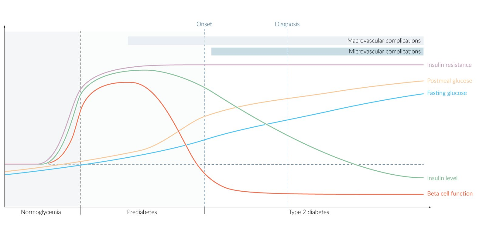
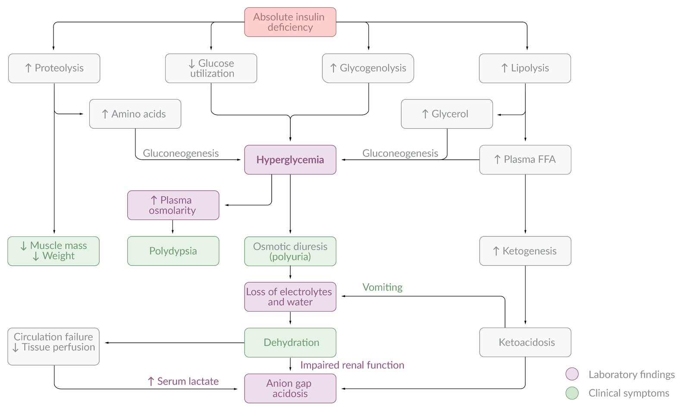
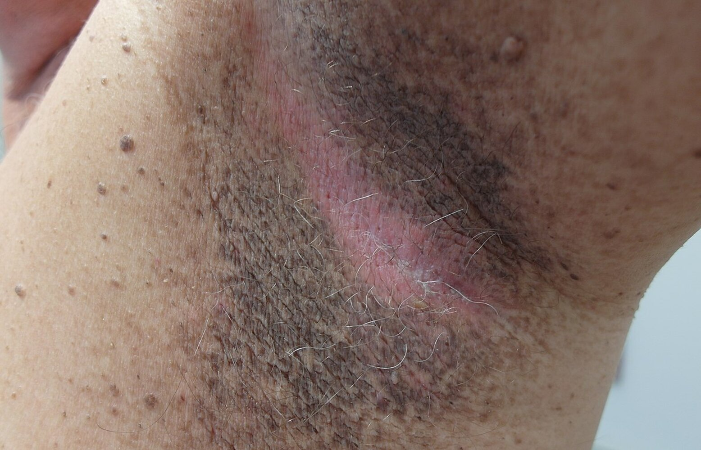
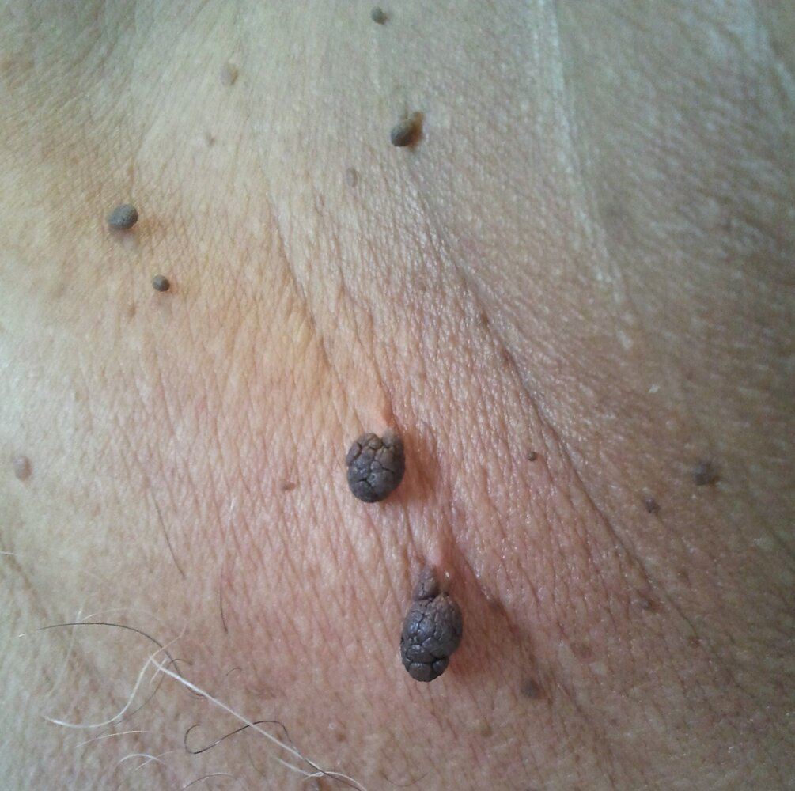
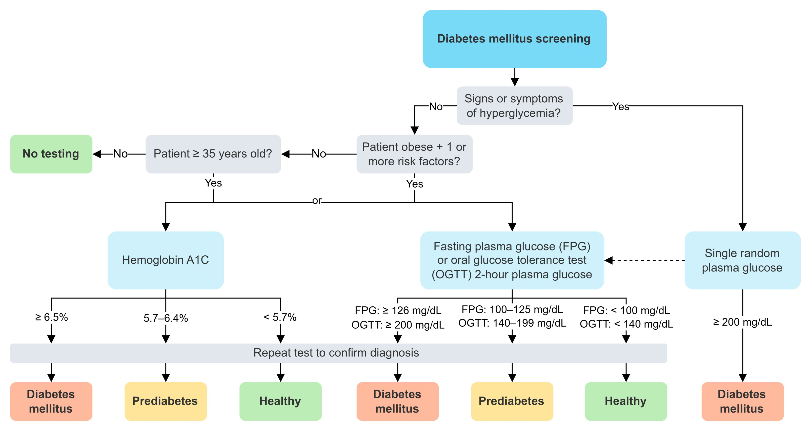
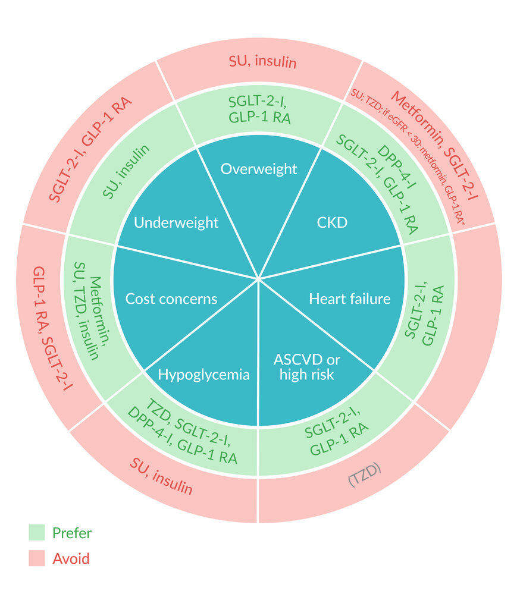
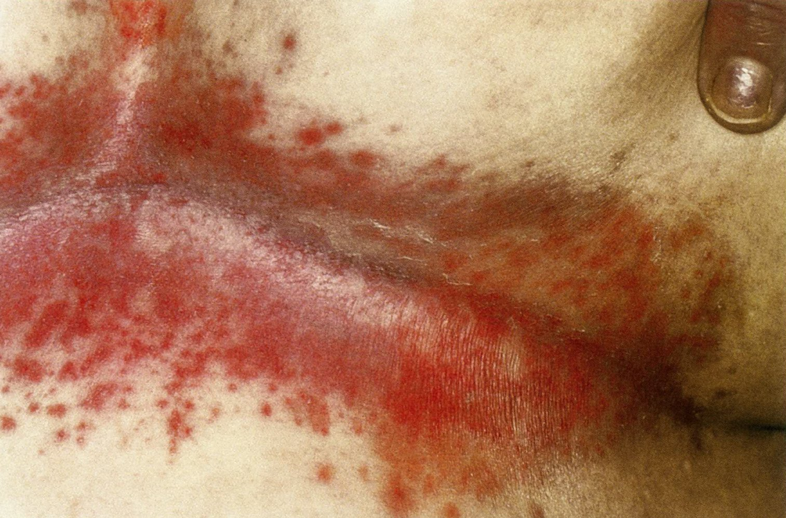
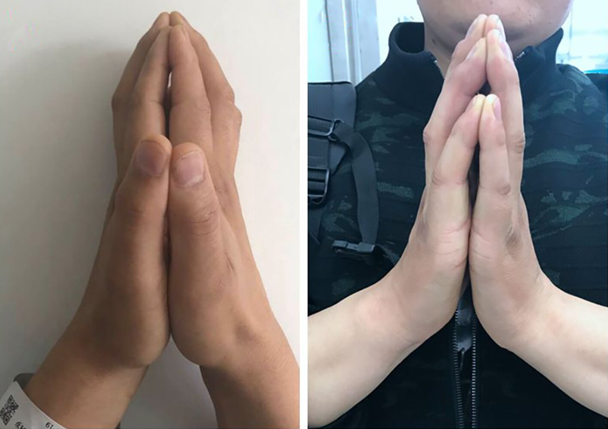

# Diabetes mellitus

*Categories: Clinical knowledge > Neurology > Peripheral nerve disorders > Diabetes mellitus*

[Original Article Link](https://coursology-qbank.com/amboss/article/3g0SE2)

---

## Summary

Diabetes mellitus (DM) describes a group of metabolic diseases that are characterized by chronic <u>hyperglycemia</u>. <u>Type 1 diabetes</u> mellitus (<u>T1DM</u>) is caused by an autoimmune response that triggers the destruction of <u>insulin</u>-producing <u>beta cells</u> in the <u>pancreas</u> and results in an absolute <u>insulin</u> deficiency. It often develops during childhood, manifesting with an acute onset (e.g., <u>diabetic ketoacidosis</u>). <u>Type 2 diabetes mellitus</u> (<u>T2DM</u>) is much more common, has a strong genetic component, and is associated with <u>obesity</u> and a sedentary lifestyle. <u>T2DM</u> is characterized by <u>insulin resistance</u> and impaired <u>insulin</u> secretion due to <u>pancreatic beta-cell</u> dysfunction, resulting in relative <u>insulin</u> deficiency. This type of diabetes usually remains undiagnosed for many years. Testing for <u>hyperglycemia</u> is recommended for patients with classic <u>symptoms of diabetes mellitus</u>, and screening is recommended for asymptomatic patients who are at high risk of <u>prediabetes</u> or diabetes (e.g., patients with <u>obesity</u> and additional <u>risk factors</u>). The diagnosis is made based on blood <u>glucose</u> or <u>HbA1c</u> levels. The main goal of treatment is blood <u>glucose</u> control tailored to glycemic targets while avoiding <u>hypoglycemia</u>. Diabetes care should be comprehensive and <u>patient-centered</u> and should include monitoring and management of <u>ASCVD risk factors</u>, <u>microvascular</u> complications (e.g., <u>diabetic retinopathy</u>, <u>diabetic nephropathy</u>, <u>diabetic neuropathy</u>), and <u>macrovascular</u> complications (e.g., <u>coronary artery disease</u>, <u>stroke</u>, <u>peripheral artery disease</u>). Management should also include general lifestyle modifications (e.g., <u>smoking cessation</u>, exercise, <u>nutritional support</u>) and pharmacological treatment (e.g., <u>antihyperglycemics</u>, <u>statins</u>, <u>ACE inhibitors</u> or <u>angiotensin receptor blockers</u>, and <u>aspirin</u>). The <u>management of diabetes</u> in children is largely similar to adults, except that certain medications (<u>sulfonylureas</u>, <u>dipeptidyl peptidase-4 inhibitors</u>, <u>SGLT-2 inhibitors</u>, and <u>thiazolidinediones</u>) are not approved for use in this age group.

See also “<u>Diabetes in pregnancy</u>,” “<u>Insulin</u>,” “<u>Hyperglycemic crises</u>,” and "<u>Diabetic ketoacidosis in children</u>."

Type 2 diabetes mellitus fact sheet

---

## Overview

| Type 1 vs <u>Type 2 diabetes mellitus</u> |  |  |
| --- | --- | --- |
| Features | <u>Type 1 DM</u> |  <u>Type 2 DM</u> [[1]](https://coursology-qbank.com/amboss/article/F7bgnE) |
| Genetics |   * Positive <u>HLA-DR4</u> and <u>HLA-DR3</u> association  * Weak familial predisposition [[2]](https://coursology-qbank.com/amboss/article/i1bJgs)  * <u>Polygenic</u>    |   * Negative <u>HLA</u> association  * Strong familial predisposition [[3]](https://coursology-qbank.com/amboss/article/Q1bugs)  * <u>Polygenic</u>    |
| Pathogenesis |  * Autoimmune destruction of <u>β cells</u> → absolute <u>insulin</u> deficiency   |  * <u>Insulin resistance</u>, progressive destruction of <u>pancreatic</u> <u>β-cells</u>   |
| Association with <u>obesity</u> |  * No   |  * Yes   |
| Onset |   * Childhood onset typically < 20 years but can occur at any age  * Peaks at age 4–6 years and 10–14 years    |  * Gradual; usually at age > 40 years   |
| <u>C-peptide</u> (<u>insulin</u>) |  * Decreased or absent   |  * Initially elevated, decreased in advanced stage   |
| <u>Glucose intolerance</u> |  * Severe   |  * Mild to moderate   |
| <u>Insulin sensitivity</u> |  * High   |  * Low   |
| Risk of ketoacidosis |  * High   |  * Low   |
| <u>β-cells</u> in the islets |  * Decreased   |  * Variable (with <u>amyloid</u> deposits)   |
|  Classic symptoms (i.e., <u>polyuria</u>, <u>polydipsia</u>, <u>polyphagia</u>, weight loss) |  * Common   |  * Sometimes   |
| <u>Histology</u> |  * <u>Leukocyte</u> infiltration of islets   |  * <u>Amyloid</u> <u>polypeptide</u> (<u>IAPP</u>) deposits in islets   |
| Treatment |  * <u>Insulin therapy</u>   |   * Lifestyle changes  * Oral <u>diabetes medications</u>  * <u>Insulin therapy</u>    |

---

## Epidemiology

### <u>Type 1 DM</u>

* <u>Prevalence</u> [[4]](https://coursology-qbank.com/amboss/article/yrbdPE)

* ∼ 1.6 million in the US

* ∼ 5–10% of all patients with diabetes

* Age [[4]](https://coursology-qbank.com/amboss/article/yrbdPE)

* Childhood onset typically < 20 years but can occur at any age

* Peaks at age 4–6 years and 10–14 years

* Race: highest <u>prevalence</u> in non-Hispanic White individuals [[5]](https://coursology-qbank.com/amboss/article/U30b3f)

### <u>Type 2 DM</u>

* <u>Prevalence</u> [[4]](https://coursology-qbank.com/amboss/article/yrbdPE)

* ∼ 10.5% of adult population in the US

* Nearly 34 million individuals in the US have diabetes with 7.3 million being undiagnosed.

* <u>Incidence</u>: ∼ 6.7 per 1,000 among US adults [[4]](https://coursology-qbank.com/amboss/article/yrbdPE)

* Age

* Adult onset typically > 40 years  [[5]](https://coursology-qbank.com/amboss/article/U30b3f)

* Mean age of onset is decreasing

* <u>Gender</u>: <u>♂</u> > <u>♀</u>  [[4]](https://coursology-qbank.com/amboss/article/yrbdPE)

* Race: highest <u>prevalence</u> in Native Americans, Hispanics, African Americans, and Asian non-Hispanic Americans [[4]](https://coursology-qbank.com/amboss/article/yrbdPE)

Epidemiological data refers to the US, unless otherwise specified.

---

## Etiology

### <u>Type 1 DM</u> [[6]](https://coursology-qbank.com/amboss/article/GYYBqn)[[7]](https://coursology-qbank.com/amboss/article/tYYXIn)

* Autoimmune destruction of <u>pancreatic</u> <u>β cells</u> in genetically susceptible individuals

* <u>HLA</u> association: <u>HLA-DR3</u> and <u>HLA-DR4</u> positive patients are at increased risk of developing <u>T1DM</u>.

* Associated with other autoimmune conditions

* <u>Hashimoto thyroiditis</u>

* Type A <u>gastritis</u>

* <u>Celiac disease</u>

* <u>Primary adrenal insufficiency</u>

> [!NOTE]
> “If you buy 4 DiaMonds and only pay for 3, you get 1 for free:” DR4 and DR3 are associated with Diabetes Mellitus type 1.

### <u>Type 2 DM</u> [[8]](https://coursology-qbank.com/amboss/article/r7bfME)[[9]](https://coursology-qbank.com/amboss/article/77b4ME)[[10]](https://coursology-qbank.com/amboss/article/JKdshI0)

* Risk factors for type 2 diabetes mellitus [[11]](https://coursology-qbank.com/amboss/article/jbd_to0)

* <u>Family history</u>: <u>first-degree relative</u> with diabetes  [[12]](https://coursology-qbank.com/amboss/article/f1ckTY0)[[13]](https://coursology-qbank.com/amboss/article/T1c6TY0)[[14]](https://coursology-qbank.com/amboss/article/g1cFTY0)

* High-risk race or ethnicity

* <u>Dyslipidemia</u>

* <u>Prediabetes</u>

* Physical inactivity

* Cardiovascular disease

* <u>Polycystic ovary syndrome</u>

* <u>Hypertension</u>

* History of <u>gestational diabetes</u>

* Poor <u>sleep</u>

* Other conditions associated with <u>metabolic syndrome</u> and <u>insulin resistance</u>: e.g., <u>overweight</u>, <u>obesity</u>, <u>acanthosis nigricans</u>

* Medications known to increase the risk of diabetes, e.g.:

* <u>Glucocorticoids</u>

* <u>Statins</u>

* <u>Thiazide diuretics</u>

* Some <u>HIV</u> medications

* <u>Second generation antipsychotics</u>

---

## Classification

### Classification according to the WHO and American Diabetes Association (<u>ADA</u>) [[10]](https://coursology-qbank.com/amboss/article/JKdshI0)[[15]](https://coursology-qbank.com/amboss/article/cX1aC20)

* Type 1: formerly known as <u>insulin</u>-dependent (<u>IDDM</u>) or juvenile-onset diabetes mellitus

* Autoimmune (type 1A)

* LADA: <u>Latent autoimmune diabetes in adults</u>, a variant of diabetes characterized by a late onset of type 1 (autoimmune) diabetes that is often mistaken for <u>type 2 diabetes</u>.

* <u>Idiopathic</u> (type 1B)

* Type 2: formerly known as non-<u>insulin</u>-dependent (<u>NIDDM</u>) or adult-onset diabetes mellitus

* <u>Gestational diabetes</u>

* Other types of diabetes mellitus

* MODY (<u>maturity-onset diabetes of the young</u>): genetic defects leading to <u>β-cell</u> dysfunction

* Different forms of <u>autosomal dominant</u> inherited diabetes mellitus that manifest before the age of 25 years and are not associated with <u>obesity</u> or <u>autoantibodies</u>

* Multiple monogenic subtypes (most common: <u>MODY</u> II due to <u>glucokinase</u> <u>gene</u> defect, and <u>MODY</u> III, due to hepatocyte nuclear factor-1-α <u>gene</u> defect)

* <u>MODY</u> II

* A single mutation leads to impaired <u>insulin</u> secretion due to altered <u>glucokinase</u> function.

* <u>Glucokinase</u> is the <u>glucose</u> sensor of the <u>β cell</u>, facilitating storage of <u>glucose</u> in the <u>liver</u>, especially at high concentrations.

* There is no increased risk of <u>microvascular</u> disease.

* Despite stable <u>hyperglycemia</u> and chronically elevated HbA1C levels, <u>MODY</u> II can be managed with diet alone.

* All other subtypes, including <u>MODY</u> III, require medical treatment either with <u>insulin</u> or <u>sulfonylureas</u>.

* Pancreatogenic diabetes mellitus: following pancreatectomy and due to conditions that lead to destruction of <u>pancreatic</u> endocrine islets (e.g., <u>hemochromatosis</u>, <u>cystic fibrosis</u>)

* Endocrinopathies: <u>Cushing disease</u>, <u>acromegaly</u>

* Drug-induced diabetes, e.g., due to <u>corticosteroids</u> (<u>steroid</u> diabetes)

* Genetic defects affecting <u>insulin synthesis</u>

* Infections (e.g., <u>congenital rubella infection</u>)

* Rare immunological diseases: <u>stiff person syndrome</u>

* Other genetic syndromes that are associated with diabetes mellitus (e.g., <u>Down syndrome</u>)

---

## Pathophysiology

### Normal <u>insulin</u> physiology [[16]](https://coursology-qbank.com/amboss/article/G7bBME)

* Secretion: <u>Insulin</u> is synthesized in the <u>β cells</u> of the <u>islets of Langerhans</u>. The cleavage of <u>proinsulin</u> (precursor molecule of <u>insulin</u>) produces <u>C-peptide</u> (connecting <u>peptide</u>) and <u>insulin</u>, which consists of two <u>peptide</u> chains (A and B chains).

* Action: <u>Insulin</u> is an <u>anabolic</u> <u>hormone</u> with a variety of metabolic effects on the body, primarily contributing to the generation of energy reserves (cellular uptake and metabolism of <u>nutrients</u>) and glycemic control.

* <u>Carbohydrate</u> metabolism: <u>Insulin</u> is the only <u>hormone</u> in the body that directly lowers the blood <u>glucose</u> level.

* <u>Protein metabolism</u>: <u>Insulin</u> inhibits proteolysis, stimulates <u>protein synthesis</u>, and stimulates cellular uptake of <u>amino acids</u>.

* Lipid metabolism: maintains a fat depot and has an antiketogenic effect

* <u>Electrolyte</u> regulation: stimulates intracellular <u>potassium</u> accumulation

### Type 1 diabetes [[6]](https://coursology-qbank.com/amboss/article/GYYBqn)

* Genetic susceptibility and environmental triggers;  (often associated with previous viral infection) → autoimmune response with production of <u>autoantibodies</u>, e.g., <u>anti-glutamic acid decarboxylase antibody</u> (anti-GAD), <u>anti-islet cell cytoplasmic antibody</u> (anti-ICA) → progressive destruction of <u>β cells</u> in the <u>pancreatic islets</u> → absolute <u>insulin</u> deficiency → decreased <u>glucose</u> uptake in the tissues

### Type 2 diabetes

#### Mechanisms [[5]](https://coursology-qbank.com/amboss/article/U30b3f)

* Peripheral insulin resistance [[17]](https://coursology-qbank.com/amboss/article/NOY-s6)
* Numerous genetic and environmental factors

* <u>Central obesity</u> → increased plasma levels of free <u>fatty acids</u> → impaired <u>insulin</u>-dependent <u>glucose</u> uptake into <u>hepatocytes</u>, <u>myocytes</u>, and <u>adipocytes</u>

* Increased <u>serine kinase</u> activity in fat and <u>skeletal muscle</u> cells → <u>phosphorylation</u> of <u>insulin</u> <u>receptor</u> substrate (IRS)-1 → decreased affinity of IRS-1 for <u>PI3K</u> → decreased expression of <u>GLUT4</u> channels → decreased cellular <u>glucose</u> uptake [[18]](https://coursology-qbank.com/amboss/article/pC1LGQ0)

* <u>Pancreatic</u> <u>β cell</u> dysfunction: accumulation of pro-<u>amylin</u> (islet amyloidpolypeptide) in the <u>pancreas</u>  → decreased <u>endogenous</u> <u>insulin</u> production  [[19]](https://coursology-qbank.com/amboss/article/t7bXnE)

#### Progression [[1]](https://coursology-qbank.com/amboss/article/F7bgnE)

* Initially, <u>insulin resistance</u> is compensated by increased <u>insulin</u> and <u>amylin</u> secretion.

* Over the course of the disease, <u>insulin resistance</u> progresses, while <u>insulin</u> secretion capacity declines.

* After a period of <u>impaired glucose tolerance</u> with isolated <u>postprandial</u> <u>hyperglycemia</u>, diabetes manifests with <u>fasting</u> <u>hyperglycemia</u>.

Disease progression in type 2 diabetes

Consequences of insulin deficiency

---

## Clinical features

| <u>Clinical features of diabetes mellitus</u> |  |  |
| --- | --- | --- |
|  | <u>Type 1 DM</u> |  <u>Type 2 DM</u> [[1]](https://coursology-qbank.com/amboss/article/F7bgnE) |
| Onset |   * Often sudden  * <u>Diabetic ketoacidosis</u> (<u>DKA</u>) is the first manifestation in 25–50% of cases. [[10]](https://coursology-qbank.com/amboss/article/JKdshI0)  * Children may present with acute illness and classic symptoms.    |   * Typically gradual  * The majority of patients are asymptomatic.  * Some patients may present with a <u>hyperglycemic crisis</u>.  * Elderly patients especially may present in a <u>hyperglycemic hyperosmolar state</u>. [[20]](https://coursology-qbank.com/amboss/article/Q3cuRX0)  * Occasionally, patients with <u>T2DM</u> present with <u>DKA</u> , which mostly affects Black and Hispanic individuals. [[21]](https://coursology-qbank.com/amboss/article/3GXS_z)  * Symptoms of complications may be the first clinical sign of disease.    |
| Clinical features |   * Classic symptoms of hyperglycemia  * <u>Polyuria</u>, which can lead to secondary <u>enuresis</u> and <u>nocturia</u> in children  * <u>Polydipsia</u>  * <u>Polyphagia</u>  * Nonspecific symptoms  * Unexplained weight loss  * Visual disturbances, e.g., blurred <u>vision</u>  * Fatigue  * <u>Pruritus</u>  * Poor <u>wound healing</u>  * Increased susceptibility to infections  * Calf cramps  [[22]](https://coursology-qbank.com/amboss/article/u1cpiY0)    |  |
|  * A thin appearance is typical for patients with <u>T1DM</u>.   |  * Possible cutaneous signs of <u>insulin resistance</u> [[23]](https://coursology-qbank.com/amboss/article/E1c8iY0)  * <u>Benign acanthosis nigricans</u>  * <u>Acrochordons</u>   |  |

> [!NOTE]
> Diabetes mellitus should be suspected in patients with recurrent <u>cellulitis</u>, <u>candidiasis</u>, <u>dermatophyte infections</u>, <u>gangrene</u>, <u>pneumonia</u> (particularly <u>tuberculosis</u> reactivation), <u>influenza</u>, genitourinary infections (<u>UTIs</u>), <u>osteomyelitis</u>, and/or <u>vascular dementia</u>.

Acanthosis nigricans

Acrochordons (skin tags)

---

## Screening

See “<u>Hyperglycemia tests</u>” for recommended screening methods.

### Indications for diabetes screening [[10]](https://coursology-qbank.com/amboss/article/JKdshI0)

The indications listed below are consistent with the 2025 <u>ADA</u> guidelines. The <u>USPSTF</u> recommends screening in adults aged 35–70 years with <u>overweight or obesity</u>. [[10]](https://coursology-qbank.com/amboss/article/JKdshI0)[[24]](https://coursology-qbank.com/amboss/article/xicEFX0)[[25]](https://coursology-qbank.com/amboss/article/kIYm1q)

* All individuals ≥ 35 years of age

* Patients < 35 years of age who: 

* Are <u>overweight or obese</u> ;  AND have ≥ 1 of the following <u>risk factors</u>:

* <u>First-degree relative</u> with diabetes

* High-risk race or ethnicity

* Physical inactivity

* Cardiovascular disease

* <u>Polycystic ovary syndrome</u>

* <u>Hypertension</u>

* <u>Dyslipidemia</u>

* Other conditions associated with <u>insulin resistance</u>: e.g., <u>severe obesity</u> and <u>acanthosis nigricans</u>

* Have <u>prediabetes</u> or a history of <u>gestational diabetes</u>

* Have any risk-enhancing comorbidities, including:

* <u>HIV infection</u>: Screen before starting or switching <u>antiretroviral therapy</u>.  [[11]](https://coursology-qbank.com/amboss/article/jbd_to0)

* <u>Cystic fibrosis</u>: Begin annual screening in all patients at the age of 10 years.

* Post <u>organ transplantation</u>: Screen once the patient is on an <u>immunosuppressive</u> regimen, stable, and no infections are present.

* <u>Pancreatitis</u>: Screen annually in patients with <u>chronic pancreatitis</u> and/or a history of <u>acute pancreatitis</u>

* Consider screening individuals exposed to medications known to increase the risk of diabetes, e.g., <u>statins</u>.

* Individuals who are planning <u>pregnancy</u> with any <u>risk factor for T2DM</u>

* See “<u>Gestational diabetes</u>” for testing indications during <u>pregnancy</u>.

> [!TIP]
> If results are normal, repeat testing in asymptomatic patients at least every three years. Patients with <u>prediabetes</u> should be tested annually. Patients with a history of <u>gestational diabetes</u> should be tested every 1–3 years. [[10]](https://coursology-qbank.com/amboss/article/JKdshI0)

---

## Diagnosis

### Diagnostic criteria for diabetes mellitus [[10]](https://coursology-qbank.com/amboss/article/JKdshI0)

The following tests may be performed in combination for screening and/or diagnosis. If two separate blood samples are used, the second should be obtained soon after the first.

* Random blood <u>glucose</u> level ≥ 200 mg/dL in patients with <u>symptoms of hyperglycemia</u> (i.e., <u>polydipsia</u>, <u>polyuria</u>, <u>polyphagia</u>, unexplained weight loss) or <u>hyperglycemic crisis</u>

* OR ≥ 2 abnormal test results for <u>hyperglycemia</u> in asymptomatic individuals

### Hyperglycemia tests [[10]](https://coursology-qbank.com/amboss/article/JKdshI0)

#### Blood <u>glucose</u> tests

* Random blood <u>glucose</u>: blood <u>glucose</u> measured at any time irrespective of recent meals

* Fasting plasma glucose (<u>FPG</u>): blood <u>glucose</u> measured after > 8 hours of <u>fasting</u>

* Inexpensive and widely available

* Should not be used to diagnose diabetes in hospitalized patients or in patients with critical illness

* Oral glucose tolerance test (<u>OGTT</u>) [[26]](https://coursology-qbank.com/amboss/article/VIdGbr0)

* Most sensitive test

* Less convenient and more expensive than other tests

* One-step OGTT: measurement of <u>fasting plasma glucose</u> and blood <u>glucose</u> 2 hours after the consumption of 75 g of <u>glucose</u>

* Two-step OGTT: used in <u>diagnosis of gestational diabetes</u>

* Nonfasting patients are given 50 g of <u>glucose</u> and blood <u>glucose</u> is measured after 1 hour.

* If values at 1 hour are 130–140 mg/dL , measure <u>fasting plasma glucose</u> and blood <u>glucose</u> 1, 2, and 3 hours after the consumption of 100 g of <u>glucose</u>.

* For interpretation of results, see “<u>Diagnosis of gestational diabetes</u>.”

#### Hemoglobin A1C (<u>HbA1c</u> or <u>A1C</u>)

* <u>Glycated hemoglobin</u>, which reflects the average blood <u>glucose</u> levels of the prior 8–12 weeks

* Can be measured at any time

* Results may be impacted by a variety of conditions or treatments (e.g., <u>sickle cell trait</u>, <u>chronic kidney disease</u>). ;  [[10]](https://coursology-qbank.com/amboss/article/JKdshI0)[[27]](https://coursology-qbank.com/amboss/article/1N12Zh0)[[28]](https://coursology-qbank.com/amboss/article/rudfs70)

* Factors resulting in a falsely high <u>HbA1c</u>

* Increased <u>RBC</u> lifespan: e.g., <u>iron</u> and/or <u>vitamin B12</u> deficiency, <u>splenectomy</u>, <u>aplastic anemia</u>

* Altered <u>hemoglobin</u>: <u>chronic kidney disease</u>

* Assay interference: <u>heavy alcohol use</u>, chronic <u>opiate</u> use, high-dose <u>aspirin</u>, <u>severe hypertriglyceridemia</u>, <u>uremia</u>, <u>hyperbilirubinemia</u>

* Factors resulting in a falsely low <u>HbA1c</u>

* Decreased <u>RBC</u> lifespan; : e.g., due to acute blood loss, <u>hemoglobinopathies</u> such as <u>sickle cell trait</u>/disease, <u>thalassemia</u>, <u>G6PD-deficiency</u>, <u>cirrhosis</u>, <u>hemolytic anemia</u>, <u>splenomegaly</u>, <u>antiretroviral drugs</u>

* Increased <u>erythropoiesis</u>: e.g., due to <u>EPO</u> therapy, <u>reticulocytosis</u>, <u>pregnancy</u> (second and third trimesters), <u>iron</u> supplementation

* Altered <u>hemoglobin</u>: high-dose <u>vitamin C</u> and E supplementation

* Assay interference: <u>low-dose aspirin</u>

> [!TIP]
> Significant discrepancy between <u>HbA1c</u> and <u>glucose</u> measurements warrants investigation of the underlying cause (e.g., <u>sickle cell trait</u>).

|  Interpretation of hyperglycemia tests [[10]](https://coursology-qbank.com/amboss/article/JKdshI0)  |  |  |  |  |
| --- | --- | --- | --- | --- |
|  |  | <u>FPG</u> | 2-hour <u>glucose</u> value after <u>one-step OGTT</u> | <u>HbA1c</u> |
| Diabetes mellitus |  | ≥ 126 mg/dL | ≥ 200 mg/dL | ≥ 6.5% |
| <u>Prediabetes</u> |  |  100–125 mg/dL= impaired fasting glucose   | 140–199 mg/dL= impaired glucose tolerance |  5.7–6.4 % [[10]](https://coursology-qbank.com/amboss/article/JKdshI0)[[24]](https://coursology-qbank.com/amboss/article/xicEFX0)[[29]](https://coursology-qbank.com/amboss/article/AGdRb70)  |
| Normal |  | < 100 mg/dL | < 140 mg/dL | < 5.7% |

Diagnosis of diabetes mellitus

### Additional recommended studies [[30]](https://coursology-qbank.com/amboss/article/1ud2J70)

Perform in all patients as part of the initial diagnostic workup and reassess at least annually.

* <u>BMP</u>

* Renal function

* <u>Electrolytes</u>, including <u>potassium</u>

* Spot urinary <u>albumin-to-creatinine ratio</u>: to detect <u>microalbuminuria</u>

* <u>CBC</u> with <u>platelets</u>

* <u>Liver chemistries</u>

* <u>Lipid panel</u>

* Additionally consider: [[30]](https://coursology-qbank.com/amboss/article/1ud2J70)

* Patients with suspected or confirmed <u>T1DM</u>: <u>TSH</u>, <u>celiac disease panel</u>

* Patients on <u>metformin</u>: <u>vitamin B12</u> level

* Selected patients: <u>calcium</u>, phosphorous, <u>vitamin D</u> level

eGFR using CKD-EPI

### Additional optional studies

These tests are not routinely indicated or required to establish a diagnosis.

* C-peptide: can help differentiate between types of diabetes [[31]](https://coursology-qbank.com/amboss/article/u7bpnE)[[32]](https://coursology-qbank.com/amboss/article/l1cvSY0)

* ↑ <u>C-peptide</u> levels may indicate <u>insulin resistance</u> and <u>hyperinsulinemia</u> → <u>T2DM</u>

* ↓ <u>C-peptide</u> levels indicate an absolute <u>insulin</u> deficiency → <u>T1DM</u>

* <u>Urinalysis</u>

* <u>Glucosuria</u> may be present if the renal threshold for <u>glucose</u> is reached (nonspecific for diabetes mellitus).

* <u>Ketone bodies</u>: positive in acute metabolic decompensation (<u>diabetic ketoacidosis</u>) [[32]](https://coursology-qbank.com/amboss/article/l1cvSY0)

* <u>Microalbuminuria</u>: early sign of <u>diabetic nephropathy</u>

* Islet autoantibody testing: Consider in patients with diagnosed diabetes mellitus if there is clinical suspicion for <u>T1DM</u>.  [[10]](https://coursology-qbank.com/amboss/article/JKdshI0)

* Antiglutamic acid decarboxylase antibodies (<u>Anti-GAD</u>): an <u>antibody</u> against the enzyme <u>glutamic acid decarboxylase</u> responsible for the conversion of <u>glutamic acid</u> to <u>GABA</u>   [[32]](https://coursology-qbank.com/amboss/article/l1cvSY0)

* Positive result confirms <u>T1DM</u>

* Negative result should trigger testing for other <u>antibodies</u> (e.g., anti-<u>tyrosine</u> <u>phosphatase</u>-related islet <u>antigen</u> 2 (IA-2), anti-<u>zinc</u> transporter 8 <u>antibodies</u>) and/or consultation with a specialist

* Anti-<u>tyrosine</u> <u>phosphatase</u>-related islet <u>antigen</u> 2 (IA-2)  [[32]](https://coursology-qbank.com/amboss/article/l1cvSY0)

* Anti-<u>zinc</u> transporter 8 <u>antibodies</u>

* Anti-<u>insulin</u> <u>antibodies</u>

> [!TIP]
> Screening for <u>T1DM</u> with <u>autoantibodies</u> is not routinely recommended but can be considered in patients with <u>presymptomatic T1DM</u> and increased genetic risk (e.g., <u>first-degree relatives</u> with <u>T1DM</u>). [[10]](https://coursology-qbank.com/amboss/article/JKdshI0)

> [!TIP]
> Consider specialist consultation if the differentiation between <u>T2DM</u> and <u>T1DM</u> is unclear.

---

## Differential diagnoses

* <u>Glucagonoma</u>

* <u>Somatostatinoma</u>

* <u>Stress</u>-induced <u>hyperglycemia</u>  [[33]](https://coursology-qbank.com/amboss/article/7ud4s70)[[34]](https://coursology-qbank.com/amboss/article/HudKs70)

* Medication-induced <u>hyperglycemia</u>

The differential diagnoses listed here are not exhaustive.

---

## Management

### General principles [[30]](https://coursology-qbank.com/amboss/article/1ud2J70)[[35]](https://coursology-qbank.com/amboss/article/Xud9p70)

* Main goal: blood <u>glucose</u> control (tailored to glycemic targets and regularly monitored) [[30]](https://coursology-qbank.com/amboss/article/1ud2J70)

* Patients with <u>T1DM</u> always require <u>insulin</u> therapy.

* <u>T2DM</u> may be managed with <u>noninsulin diabetes medications</u> and/or <u>insulin therapy</u>.

* Acute illness may require temporary changes in treatment (e.g., increased <u>insulin</u> demand due to <u>acute stress reaction</u>).

* Comprehensive diabetes care (all patients)

* Diabetes self-management education and support;  see “<u>Managing chronic conditions</u>.” [[35]](https://coursology-qbank.com/amboss/article/Xud9p70)

* Lifestyle modifications, including:

* Weight reduction

* Balanced diet and nutrition;  (including a <u>high-fiber diet</u>)

* Regular exercise

* <u>Smoking cessation</u>

* Routine <u>screening for microvascular complications of diabetes</u>

* Evaluation for and management of common comorbidities as indicated (e.g., psychiatric disorders, autoimmune diseases, <u>NAFLD</u>, <u>obstructive sleep apnea</u>, dental or <u>periodontal disease</u>, <u>sexual dysfunction</u>) [[30]](https://coursology-qbank.com/amboss/article/1ud2J70)[[36]](https://coursology-qbank.com/amboss/article/LC1wsQ0)

* <u>Vaccinations</u>;  (e.g., <u>influenza</u>, <u>hepatitis B</u>, zoster, <u>COVID-19</u>, and <u>pneumococcal vaccines</u>)  [[30]](https://coursology-qbank.com/amboss/article/1ud2J70)[[36]](https://coursology-qbank.com/amboss/article/LC1wsQ0)

* <u>ASCVD risk assessment</u> and <u>ASCVD prevention</u>, including: [[37]](https://coursology-qbank.com/amboss/article/0sdetr0)

* <u>Hypertension management</u>

* <u>Management of hypercholesterolemia</u>

* Patients aged 40–75 years with diabetes mellitus: Initiate <u>moderate-intensity statin therapy</u> regardless of lipid levels.

* Assess indications for <u>high-intensity statins</u>.  [[38]](https://coursology-qbank.com/amboss/article/0fcekb0)

* <u>Management of obesity</u> [[39]](https://coursology-qbank.com/amboss/article/fudkq70)

* <u>Diagnostic studies for coronary artery disease</u> in patients with <u>clinical features of CAD</u>  [[37]](https://coursology-qbank.com/amboss/article/0sdetr0)

* <u>Antiplatelet therapy</u> if indicated (see “<u>Primary prevention of ASCVD</u>” and “<u>Management of ASCVD</u>”)

* Follow-up

* Periodically re-evaluate the need for further education and support.  [[35]](https://coursology-qbank.com/amboss/article/Xud9p70)

* Check <u>HbA1c</u> at least every 3–6 months (see “<u>Glycemic monitoring for DM</u>”).

* For patients requiring lipid-lowering therapy, repeat <u>lipid panel</u> yearly and 4–12 weeks after any medication changes. [[37]](https://coursology-qbank.com/amboss/article/0sdetr0)

> [!TIP]
> Diabetes care should be <u>patient-centered</u> and comprehensive and include lifestyle modifications and assessment of psychosocial health. Consider <u>social determinants of health</u> and formulate a treatment plan together with the patient.

> [!TIP]
> The goals of <u>diabetes management</u> include eliminating <u>symptoms of hyperglycemia</u>, reducing or eliminating complications, and enabling as healthy a lifestyle as possible. [[25]](https://coursology-qbank.com/amboss/article/kIYm1q)

> [!TIP]
> Physical exercise reduces blood <u>glucose</u> and increases <u>insulin sensitivity</u>.

### Lifestyle modifications [[35]](https://coursology-qbank.com/amboss/article/Xud9p70)

|  Lifestyle recommendations for patients with diabetes mellitus [[35]](https://coursology-qbank.com/amboss/article/Xud9p70)  |  |
| --- | --- |
| Physical activity |   * Recommend regular exercise.  * ≥150 minutes of moderate-to-vigorous intensity exercise spread over ≥ 3 days per week  * 2–3 sessions of resistance exercise  per week  * Recommend reducing sedentary time  and increasing nonsedentary activities.    |
| Balanced diet and nutrition |   * Refer to a registered nutritionist.  * Individualize dietary recommendations taking into account the patient’s health status, preferences, and cultural background.  * General recommendations include:  * A <u>high-fiber diet</u>  * Eating nonstarchy vegetables, whole foods  * Avoiding refined sugar and grains    |
|  <u>Weight management</u> [[39]](https://coursology-qbank.com/amboss/article/fudkq70)  |   * Assess <u>BMI</u> annually.  * <u>T2DM</u> with <u>overweight or obesity</u>: Aim for ≥ 3% weight loss.  [[39]](https://coursology-qbank.com/amboss/article/fudkq70)  * Recommend dietary changes and physical activity.  * Consider weight loss drugs or <u>metabolic surgery</u> depending on <u>BMI</u>.  [[39]](https://coursology-qbank.com/amboss/article/fudkq70)  * Consider weight maintenance programs if weight loss is achieved.  * See “<u>Management of overweight and obesity</u>” for details on weight loss treatment options.    |
| Other |   * Recommend <u>smoking cessation</u> for all patients; offer counseling if necessary. [[40]](https://coursology-qbank.com/amboss/article/AA1Rmj0)  * Advise against recreational <u>cannabis</u> in patients with <u>T1DM</u> or those at risk for <u>diabetic ketoacidosis</u>. [[35]](https://coursology-qbank.com/amboss/article/Xud9p70)  * <u>Alcohol</u> consumption should be: [[35]](https://coursology-qbank.com/amboss/article/Xud9p70)  * Limited to a moderate intake  * Consumed with food to avoid <u>hypoglycemia</u>, with <u>glucose</u> monitored after consumption  * Provide psychosocial screening for patients and caregivers.  [[35]](https://coursology-qbank.com/amboss/article/Xud9p70)  * Recommend 6–8 hours of uninterrupted <u>sleep</u> every night; consider assessment for underlying <u>sleep disorders</u> (e.g., <u>sleep apnea</u>).    |

### Glycemic targets in diabetes [[41]](https://coursology-qbank.com/amboss/article/eudxJ70)[[42]](https://coursology-qbank.com/amboss/article/YQcnuX0)

* Consider the following patient factors when setting a glycemic target:

* Risk of <u>hypoglycemia</u> or other adverse effects

* Presence of vascular complications and comorbidities

* Patient preferences and resources

* Disease duration

* <u>Life expectancy</u>

* Re-evaluate glycemic targets continuously and adjust if necessary.

|  |  Common glycemic targets  [[41]](https://coursology-qbank.com/amboss/article/eudxJ70)  |
| --- | --- |
| <u>HbA1c</u> |  < 7%: suitable for most patients  [[41]](https://coursology-qbank.com/amboss/article/eudxJ70)[[42]](https://coursology-qbank.com/amboss/article/YQcnuX0)  |
| Preprandial <u>capillary</u> <u>glucose</u> | 80–130 mg/dL |
|  Peak <u>postprandial</u> <u>capillary</u> <u>glucose</u>   | < 180 mg/dL |
| <u>Continuous glucose monitor</u> |  > 70% time in goal range (e.g., 70–180 mg/dL)   |

> [!TIP]
> Glycemic targets should be individualized. A target of <u>HbA1c</u> < 7% is usually suitable for most nonpregnant adults. [[41]](https://coursology-qbank.com/amboss/article/eudxJ70)

### Glycemic monitoring for diabetes [[41]](https://coursology-qbank.com/amboss/article/eudxJ70)[[43]](https://coursology-qbank.com/amboss/article/Uudbq70)

#### <u>HbA1c monitoring</u>

<u>HbA1c</u> is measured at fixed intervals.

* At least every 6 months if targets are met

* At least every 3 months in the following situations:

* If targets are not met

* If treatment has recently been modified

* If the patient is undergoing <u>intensive insulin therapy</u>

* Repeated or significant <u>hyperglycemia</u> or <u>hypoglycemia</u>

* Rapid <u>growth in children</u>

* Health changes

> [!TIP]
> <u>Fructosamine</u> or <u>continuous glucose monitoring</u> may be used as alternatives to <u>HbA1c</u> if needed.

#### <u>Home glucose monitoring</u>

<u>Glucose</u> levels can be used to evaluate treatment and prevent <u>hypoglycemia</u> and <u>hyperglycemia</u>, especially in patients using <u>insulin</u>.

* Self-monitoring of blood <u>glucose</u>: at fixed times or as needed 

* Indication: <u>insulin therapy</u> (particularly for intensive regimens)

* Consider for any patient to assess for <u>hypoglycemia</u> or the impact of diet and/or exercise.

* Continuous glucose monitoring: <u>Interstitial</u> <u>glucose</u> levels are measured continuously or intermittently using a subcutaneous device. [[43]](https://coursology-qbank.com/amboss/article/Uudbq70)

* Improves glycemic monitoring, which reduces the risk of <u>hypoglycemia</u>

* Early use is recommended for adults with <u>T1DM</u> (can be used in combination with an <u>insulin pump</u>).

* Advised for use in patients with diabetes on any form of <u>insulin therapy</u>

* Consider in:

* Patients with <u>T2DM</u> on noninsulin <u>glucose</u>-lowering drugs

* Patients not meeting <u>HbA1c</u> targets

#### <u>Hypoglycemia</u>

* Assess for episodes of <u>hypoglycemia</u> (symptomatic or asymptomatic) at every follow-up visit.

* Prescribe <u>glucagon</u> for individuals taking <u>insulin</u> or at high-risk for <u>hypoglycemic</u> events

* In patients with at least one clinically significant <u>hypoglycemia</u> event  or asymptomatic <u>hypoglycemia</u>:

* Check for possible contributors (e.g., medication interaction or errors).

* Consider relaxing the glycemic targets and adjusting management.

> [!TIP]
> Reassess and adjust treatment at regular intervals (e.g., every 3–6 months).

#### Early morning <u>hyperglycemia</u>

* Early morning <u>hyperglycemia</u> may be caused by:

* Dawn phenomenon

* A physiological increase of <u>growth hormone</u> levels in the early morning hours stimulates hepatic <u>gluconeogenesis</u> and leads to a subsequent increase in <u>insulin</u> demand that cannot be met in <u>insulin</u>-dependent patients, resulting in elevated blood <u>glucose</u> levels.

* Consider measurement of nocturnal blood <u>glucose</u> levels before initiating <u>insulin therapy</u>.

* <u>Long-acting insulin</u> dose may be given later or increased under careful glycemic control.

* Somogyi effect (widely taught but unproven hypothesis)

* Description: Nocturnal <u>hypoglycemia</u> due to evening <u>insulin</u> injection triggers a counterregulatory secretion of <u>hormones</u> , leading to elevated blood <u>glucose</u> levels in the morning.

* There is no evidence to support the existence of this effect. [[44]](https://coursology-qbank.com/amboss/article/BiczFX0)[[45]](https://coursology-qbank.com/amboss/article/AicR8X0)[[46]](https://coursology-qbank.com/amboss/article/_ic58X0)

> [!TIP]
> Do not assume that early morning <u>hyperglycemia</u> is due to nocturnal <u>hypoglycemia</u>. It is more likely caused by nocturnal <u>hyperglycemia</u> with or without hypoinsulinemia and/or early morning secretion of counterregulatory <u>hormones</u> (e.g., <u>cortisol</u>). [[44]](https://coursology-qbank.com/amboss/article/BiczFX0)[[45]](https://coursology-qbank.com/amboss/article/AicR8X0)[[46]](https://coursology-qbank.com/amboss/article/_ic58X0)

> [!WARNING]
> Assess for past <u>hypoglycemic</u> episodes or risk of <u>hypoglycemia</u> regularly and adjust glycemic goals accordingly. <u>Hypoglycemia</u> is one of the major limitations to adequate glycemic control. [[41]](https://coursology-qbank.com/amboss/article/eudxJ70)

> [!TIP]
> In patients that meet preprandial <u>glucose</u> targets, <u>HbA1c</u> above target may be due to <u>postprandial</u> <u>hyperglycemia</u>, requiring prandial <u>insulin</u> dose adjustments.

---

## Glycemic treatment

This section outlines the approach to pharmacological <u>treatment of diabetes</u> mellitus.

* See “<u>Inpatient management of hyperglycemia</u>” for details, including <u>management of hyperglycemia in critically ill patients</u>.

* See also “<u>Perioperative medication management</u>” for adjustments to <u>insulin</u> and oral <u>diabetes medications</u> prior to <u>surgery</u>.

### <u>Type 1 diabetes mellitus</u>

#### <u>Insulin replacement therapy</u> [[47]](https://coursology-qbank.com/amboss/article/Tud6q70)

* Treatment options

* <u>Insulin pump</u>: Consider for most patients.

* Multiple daily <u>insulin</u> injections; see “<u>Full basal-bolus insulin regimen</u>” for details.

* Starting dose calculation [[47]](https://coursology-qbank.com/amboss/article/Tud6q70)

* <u>Exogenous</u> <u>insulin</u> requirements will depend on the residual <u>insulin</u> production of the <u>pancreas</u>.

* Total daily dose (TDD) of <u>insulin</u> is usually 0.4–1.0 units/kg per day, divided into 50% basal and 50% prandial <u>insulin</u>.

* Consider starting treatment with 0.5 units/kg per day.

* Dose <u>titration</u>

* After beginning <u>insulin treatment</u>, <u>exogenous</u> <u>insulin</u> demand is temporarily reduced.  [[48]](https://coursology-qbank.com/amboss/article/ZicZJX0)

* Dosage should be adjusted according to glycemic monitoring.

> [!TIP]
> Educate patients on calculating <u>insulin</u> requirements throughout the day based on activities and meals. [[47]](https://coursology-qbank.com/amboss/article/Tud6q70)

#### Other treatment strategies [[47]](https://coursology-qbank.com/amboss/article/Tud6q70)

* Noninsulin <u>diabetes medications</u>: not generally used in <u>T1DM</u> treatment

* <u>Pancreas</u> and/or islet <u>transplantation</u>

* May improve <u>glucose</u> control but is not standard treatment due to the need for lifelong <u>immunosuppressive therapy</u>

* May be considered in patients:

* With recurrent episodes of <u>diabetic ketoacidosis</u> or severe <u>hypoglycemia</u> despite adequate treatment

* Undergoing simultaneous <u>renal transplantation</u> or patients with a previous <u>renal transplantation</u>

### <u>Type 2 diabetes mellitus</u>

#### Approach [[47]](https://coursology-qbank.com/amboss/article/Tud6q70)

* Start treatment in all patients at diagnosis. ;  [[47]](https://coursology-qbank.com/amboss/article/Tud6q70)[[49]](https://coursology-qbank.com/amboss/article/v5XANA)

* Start therapy with a <u>glucose</u>-lowering medication based on patient factors (e.g., <u>ASCVD</u>, <u>CKD</u>).

* <u>Metformin</u> is the first-line initial therapy for most patients;  without cardiovascular or <u>kidney</u> <u>risk factors</u>.

* Consider initial combination pharmacological treatment   in selected patients, e.g., those with: [[36]](https://coursology-qbank.com/amboss/article/LC1wsQ0)[[47]](https://coursology-qbank.com/amboss/article/Tud6q70)

* <u>Clinical ASCVD</u>, high <u>ASCVD risk</u>, <u>heart failure</u>, or <u>CKD</u>

* <u>HbA1c</u> above the glycemic target

* <u>Indications for insulin therapy for T2DM</u> at time of diagnosis

* Re-evaluate treatment and <u>treatment adherence</u> every 3–6 months. [[47]](https://coursology-qbank.com/amboss/article/Tud6q70)

* Sequentially add <u>noninsulin diabetes medications</u> until <u>glucose</u> targets are met.

* Consider <u>insulin therapy</u> if targets are not met despite adequate treatment.

Diabetes medications: Pros and Cons

#### <u>Noninsulin diabetes medications</u>

|  Noninsulin diabetes medications [[47]](https://coursology-qbank.com/amboss/article/Tud6q70)  |  |  |
| --- | --- | --- |
| Drug class |  Examples   | Important considerations |
| Biguanides |  |  |
|  * <u>Metformin</u> DOSAGE   |  * Frequently the first-line therapy, unless there are <u>contraindications for metformin</u>   |  |
| Dipeptidyl peptidase-4 inhibitor |   * <u>Sitagliptin</u> DOSAGE  * <u>Saxagliptin</u> DOSAGE  * <u>Linagliptin</u> DOSAGE    |   * Avoid <u>saxagliptin</u> in patients with <u>heart failure</u>.  * Should not be used in patients who also use <u>GLP-1RAs</u>. [[50]](https://coursology-qbank.com/amboss/article/28WTNM0)    |
| SGLT-2 inhibitors |  * <u>Empagliflozin</u> DOSAGE   |   * Recommended in patients with: [[47]](https://coursology-qbank.com/amboss/article/Tud6q70)  * <u>Clinical ASCVD</u> or high risk of <u>ASCVD</u>  * <u>Chronic kidney disease</u> (<u>eGFR</u> 20–60 mL/min/1.73 m2 and/or <u>albuminuria</u>)  * <u>Heart failure</u>  * Beneficial for patients who need to lose or maintain their weight    |
| GLP-1 receptor agonists |   * <u>Semaglutide</u>  * Oral DOSAGE  * Injectable DOSAGE  * <u>Liraglutide</u> DOSAGE  * <u>Dulaglutide</u> DOSAGE  * <u>Exenatide</u>  * <u>Lixisenatide</u>    |   * Recommend in patients with [[47]](https://coursology-qbank.com/amboss/article/Tud6q70)  * <u>Clinical ASCVD</u> or high risk of <u>ASCVD</u>  * Symptomatic <u>HFpEF</u>  * <u>CKD</u> (<u>eGFR</u> 20–60 mL/min/1.73 m2 and/or <u>albuminuria</u>; preferred in patients with <u>eGFR</u> < 30 mL/min/1.73 m2)  * Beneficial for patients who need to lose or maintain their weight    |
| Sulfonylureas |  * <u>Glimepiride</u> DOSAGE   |   * Increases risk for <u>hypoglycemia</u>  * Low cost  * May increase <u>fracture</u> risk [[30]](https://coursology-qbank.com/amboss/article/1ud2J70)    |
| Thiazolidinedione |  * <u>Pioglitazone</u> DOSAGE   |   * Beneficial in patients with <u>MASH</u>  * Avoid in patients with <u>congestive heart failure</u>.  * Low cost  * May increase <u>fracture</u> risk [[30]](https://coursology-qbank.com/amboss/article/1ud2J70)    |

* Other drugs that are not part of the therapy algorithms for <u>T2DM</u> according to the <u>ADA</u> guideline include:

* <u>Meglitinides</u> (e.g., <u>nateglinide</u>  DOSAGE)

* <u>Alpha-glucosidase inhibitors</u>: <u>acarbose</u> DOSAGE

* <u>Amylin analogs</u>: injectable <u>pramlintide</u>

* See “<u>Overview of diabetes medications</u>” for details on side effects and contraindications.

> [!TIP]
> Oral monotherapy usually lowers <u>HbA1c</u> levels by ∼ 1%. Every noninsulin drug added to <u>metformin</u> will lower the <u>HbA1c</u> by an additional 0.7–1.0 %. [[47]](https://coursology-qbank.com/amboss/article/Tud6q70)

> [!WARNING]
> Beware of <u>drug interactions</u> and drug incompatibilities; combining <u>sulfonylureas</u> with <u>insulin</u> increases the risk for <u>hypoglycemia</u>. [[51]](https://coursology-qbank.com/amboss/article/p0WLSP0)

> [!WARNING]
> Many oral <u>diabetes medications</u> should be avoided in patients undergoing <u>surgery</u> or experiencing severe illness; consider <u>insulin therapy</u> instead.

#### Indications for insulin therapy in T2DM [[47]](https://coursology-qbank.com/amboss/article/Tud6q70)

* Patients whose glycemic targets are not met despite sufficient <u>noninsulin diabetes medications</u>

* Patients with contraindications for <u>noninsulin diabetes medications</u> (e.g., patients with <u>end-stage renal failure</u>)

* Pregestational and <u>gestational diabetes</u> [[52]](https://coursology-qbank.com/amboss/article/pKdLhI0)

* <u>Hyperglycemic crisis</u>

* Consider in patients with ≥ 1 of the following:

* Initial <u>glucose</u> ≥ 300 mg/dL or <u>HbA1c</u> > 10%

* <u>Symptoms of hyperglycemia</u>

* Signs of a continued <u>catabolic</u> state (e.g., weight loss)

#### Approach to <u>insulin treatment</u> in <u>T2DM</u> [[47]](https://coursology-qbank.com/amboss/article/Tud6q70)

* Start with the simplest <u>insulin regimen</u> (i.e., a <u>basal insulin regimen</u> with once-daily injections).

* Titrate the <u>insulin</u> dose according to individualized glycemic targets and tolerance.

* Consider adding prandial <u>insulin</u> or switching to a <u>mixed insulin regimen</u> as needed.

* <u>Noninsulin diabetes medications</u> may be continued once <u>insulin treatment</u> is started.

* See “<u>Insulin regimens</u>” for details.

> [!TIP]
> Include <u>GLP-1 receptor agonists</u> in the treatment strategy prior to starting <u>insulin therapy</u> in patients with <u>T2DM</u>, unless they are inappropriate or <u>insulin therapy</u> is preferred.

---

## Screening for complications of diabetes

### Screening for microvascular complications of diabetes

* Initial screening [[53]](https://coursology-qbank.com/amboss/article/Ludw770)[[54]](https://coursology-qbank.com/amboss/article/oud0H70)[[55]](https://coursology-qbank.com/amboss/article/-G1Dbi0)

* <u>Type 1 DM</u>: 5 years after the onset of diabetes [[56]](https://coursology-qbank.com/amboss/article/pbdLuo0)

* <u>Type 2 DM</u>: at the time of <u>diabetes diagnosis</u>

* Frequency [[53]](https://coursology-qbank.com/amboss/article/Ludw770)[[54]](https://coursology-qbank.com/amboss/article/oud0H70)[[55]](https://coursology-qbank.com/amboss/article/-G1Dbi0)

* Perform at minimum every 12 months.

* More frequent screening may be necessary for:

* Pregnant individuals

* Patients with a history of <u>microvascular</u> complications

* Modalities

* <u>Screening for diabetic kidney disease</u>: spot <u>urine albumin to creatinine ratio</u> (<u>UACR</u>) and serum <u>glomerular filtration rate</u> [[55]](https://coursology-qbank.com/amboss/article/-G1Dbi0)[[57]](https://coursology-qbank.com/amboss/article/KudUH70)

* <u>Screening for diabetic retinopathy</u>: <u>comprehensive eye exam</u> with dilation or retinal photography (if available)  [[53]](https://coursology-qbank.com/amboss/article/Ludw770)

* <u>Screening for diabetic peripheral neuropathy</u> with a <u>focused examination of sensation</u>, e.g.: [[53]](https://coursology-qbank.com/amboss/article/Ludw770)[[57]](https://coursology-qbank.com/amboss/article/KudUH70)

* <u>Monofilament test</u>

* <u>Pinprick sensation</u> or <u>temperature sensation</u>

* <u>Vibration sense</u> (using a tuning fork)

* <u>Screening for diabetic autonomic neuropathy</u> by recording <u>resting heart rate</u>, <u>orthostatic vital signs</u>, and <u>heart rate</u> variability.

* <u>Screening for diabetic foot</u>: comprehensive foot exam [[53]](https://coursology-qbank.com/amboss/article/Ludw770)[[58]](https://coursology-qbank.com/amboss/article/9p1N730)[[59]](https://coursology-qbank.com/amboss/article/cI1abR0)

### Screening for macrovascular complications of diabetes [[37]](https://coursology-qbank.com/amboss/article/0sdetr0)

* Check BP at every clinic appointment and encourage patients with elevated BP to measure blood pressure at home.

* Obtain a <u>lipid panel</u> at the time of <u>diabetes diagnosis</u> and repeat every 5 years for patients < 40 years.

* Screening for cardiovascular disease is not recommended for asymptomatic individuals. [[37]](https://coursology-qbank.com/amboss/article/0sdetr0)

* Consider screening asymptomatic individuals for cardiovascular disease on a case-by-case basis:

* <u>BNP</u> or <u>NT-proBNP</u> for patients without known <u>structural heart disease</u>  [[60]](https://coursology-qbank.com/amboss/article/Jbdsuo0)

* <u>Ankle-brachial index</u> testing for patients ≥ 65 years of age with <u>microvascular</u> disease, <u>diabetic foot</u> complications, and/or any <u>end-organ damage</u> from diabetes  [[37]](https://coursology-qbank.com/amboss/article/0sdetr0)

---

## Complications

### Acute complications

* <u>Hyperglycemic crisis</u>: undiagnosed or insufficiently treated diabetes mellitus may result in severe <u>hyperglycemia</u>, potentially culminating in a crisis

* <u>Hyperglycemic hyperosmolar state</u> (<u>HHS</u>)

* <u>Diabetic ketoacidosis</u> (<u>DKA</u>)

* Life-threatening <u>hypoglycemia</u>: secondary to inappropriate <u>insulin therapy</u>

### Long-term complications [[61]](https://coursology-qbank.com/amboss/article/D7b1LE)

#### <u>Macrovascular</u> complications of diabetes (<u>atherosclerosis</u>)

* <u>Prevalence</u>: more common in patients with <u>type 2 diabetes</u>

* <u>Risk factors</u>: : The major determinants are metabolic <u>risk factors</u>, which include <u>obesity</u>, <u>dyslipidemia</u>, and <u>arterial hypertension</u>. <u>Hyperglycemia</u> may be less related to the development of <u>macrovascular</u> disease.

* Manifestations

* <u>Coronary heart disease</u> (most common <u>cause of death</u>)

* <u>Cerebrovascular disease</u>

* <u>Peripheral artery disease</u> (possible loss of limb)

* <u>Monckeberg arteriosclerosis</u>

* <u>Gangrene</u>

#### Microvascular complications of diabetes

* Onset: typically arises 5–10 years after onset of disease

* Pathophysiology: chronic <u>hyperglycemia</u> → <u>nonenzymatic glycation</u> of <u>proteins</u> and lipids → thickening of the basal membrane with progressive function impairment and tissue damage

* Manifestations

* <u>Diabetic nephropathy</u>

* <u>Diabetic retinopathy</u>, <u>glaucoma</u>

* <u>Diabetic neuropathy</u>, including <u>diabetic gastroparesis</u>

* <u>Diabetic foot</u>

> [!TIP]
> <u>Gastroparesis</u> can complicate the <u>management of diabetes</u> by causing poor absorption of <u>oral antidiabetic drugs</u> and difficulties with timing <u>insulin</u> doses due to delayed food absorption. [[62]](https://coursology-qbank.com/amboss/article/ae1Qxf0)

> [!TIP]
> Strict glycemic control is crucial in preventing <u>microvascular</u> disease.

#### Necrobiosis lipoidica [[63]](https://coursology-qbank.com/amboss/article/w7bhLE)

* Definition: inflammatory granulomatous disorder of the <u>skin</u>; characterized by <u>collagen</u> degeneration and lipid accumulation in the surface of the <u>skin</u>.

* <u>Epidemiology</u>

* > 60% association with DM

* <u>♀</u> >> <u>♂</u>

* Clinical features

* <u>Rash</u>: circumscribed, <u>erythematous</u> <u>plaques</u> with <u>atrophic</u> centers and irregular margins

* Common sites: pretibial region

* Usually asymptomatic

* <u>Ulcerations</u> with subsequent scarring may occur.

* <u>Histopathology</u>: necrobiotic palisading <u>granuloma</u>

* Lymphohistiocytic infiltration with <u>plasma cells</u>, <u>foam cells</u>, and <u>giant cells</u>

* Wall thickening and occlusion of <u>small blood vessels</u>

* Destruction of <u>collagen fibers</u> in the entire corium

* Treatment: <u>Corticosteroids</u> may be effective (e.g., intralesional <u>corticosteroid</u> injections).

Candidal intertrigo

Necrobiosis lipoidica

Necrobiosis lipoidica

Necrobiosis lipoidica

#### Other complications

* <u>Mucormycosis</u> (<u>zygomycosis</u>)

* Diabetic cardiomyopathy: a disorder of the <u>myocardium</u> seen in patients with diabetes [[64]](https://coursology-qbank.com/amboss/article/x7bELE)

* Chronic <u>hyperglycemia</u> results in altered metabolism of <u>glucose</u> and <u>fatty acids</u>, microangiopathy with <u>endothelial</u> dysfunction, and <u>autonomic neuropathy</u>, which collectively results in <u>cardiomyocyte</u> <u>hypertrophy</u>, <u>myocardial</u> <u>fibrosis</u>, ventricular dilation, and ultimately in systolic and/or <u>diastolic heart failure</u>.

* This disorder may or may not be accompanied by <u>CVD</u> and <u>hypertension</u>.

* Osmotic damage: occurs in tissues with high <u>aldolase reductase</u> activity and low/absent <u>sorbitol dehydrogenase</u> activity (e.g., eyes, peripheral nerves) → <u>cataracts</u>, neuropathy

* Diabetic <u>fatty liver</u> disease

* Hyporeninemic hypoaldosteronism [[65]](https://coursology-qbank.com/amboss/article/0HbeKE)

* <u>Hypoaldosteronism</u> that is caused by decreased <u>renin</u> activity

* Most commonly caused by <u>diabetic nephropathy</u> or <u>chronic interstitial nephritis</u>

* Patients present with features of <u>hypoaldosteronism</u>, i.e., <u>hypotension</u>, <u>hyponatremia</u>, and type 4 <u>renal tubular acidosis</u>.

* Limited joint mobility syndrome (formerly known as diabetic <u>cheiroarthropathy</u>) [[66]](https://coursology-qbank.com/amboss/article/lI0v1h)

* Manifested as stiffness of the <u>small joints</u> of the hand

* Tight waxy <u>skin</u>, particularly on the <u>dorsal</u> surface of the fingers, is common.

* Positive prayer sign: inability to approximate the palms due to <u>flexion</u> <u>contractures</u> of the <u>PIP</u> and <u>MCP joints</u> [[67]](https://coursology-qbank.com/amboss/article/NI0-1h)

* Positive tabletop test: inability to flatten the palm against the surface of a table due to the <u>contractures</u> in the <u>metacarpophalangeal joints</u>

* <u>Sialadenosis</u>

* Increased risk of infection

Carbuncle

Positive prayer sign

### Insulin purging [[68]](https://coursology-qbank.com/amboss/article/aHbQKE)

* Definition: attempting to lose weight by purposefully not injecting <u>insulin</u> after meals

* Population: young patients with <u>type 1 diabetes</u> with <u>eating disorders</u> use <u>insulin purging</u> as an alternative to <u>fasting</u>, <u>vomiting</u>, and other methods of weight loss

* Result: self-induced <u>insulin</u> deficiency → ↓ <u>insulin</u>-dependent <u>glucose</u> uptake in cells → ↓ <u>anabolic</u> effect of <u>insulin</u> → weight loss (no weight gain)

* Poor glycemic control

* Increased risk of <u>hyperglycemic crises</u>

We list the most important complications. The selection is not exhaustive.

---

## Prognosis

* Diabetes mellitus is one of the <u>leading causes of death</u> in the US; common complications that result in <u>death</u> are <u>myocardial infarction</u> and <u>end-stage renal failure</u>. [[4]](https://coursology-qbank.com/amboss/article/yrbdPE)

* One of the leading causes of blindness, nontraumatic lower limb <u>amputation</u>, <u>end-stage renal failure</u>, and cardiovascular disease [[4]](https://coursology-qbank.com/amboss/article/yrbdPE)

* The prognosis primarily depends on glycemic control and treatment of comorbidities (e.g., <u>hypertension</u>, <u>dyslipidemia</u>).

---