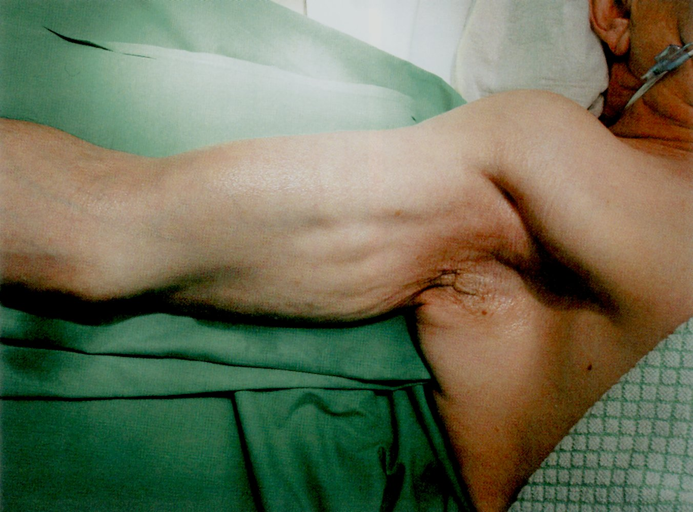
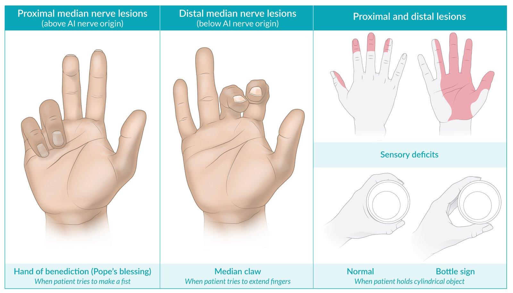
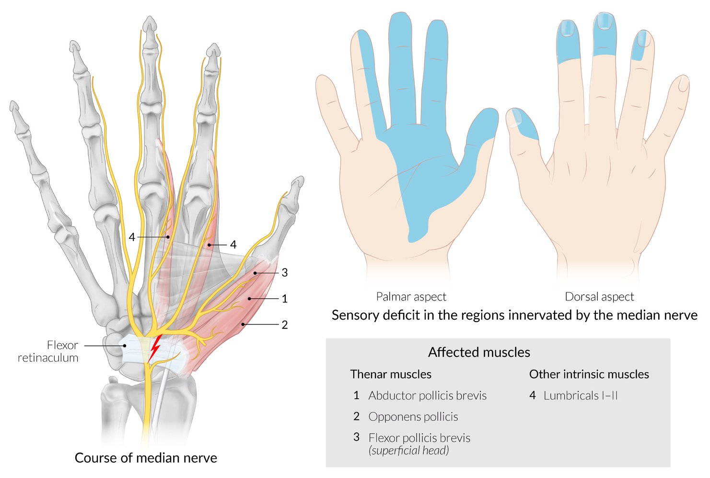
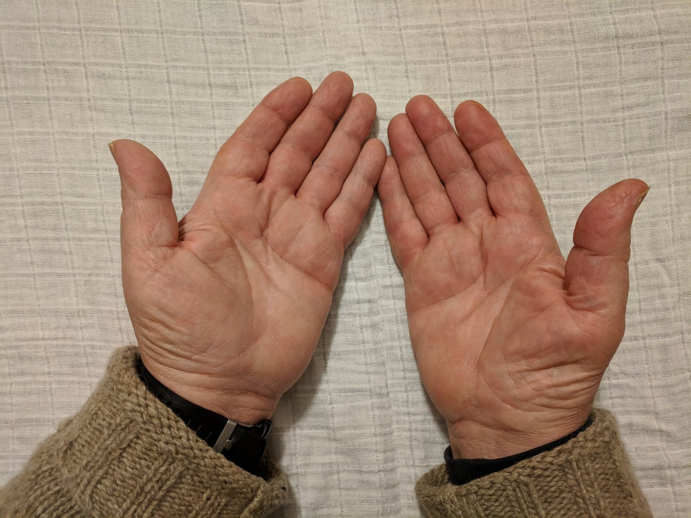
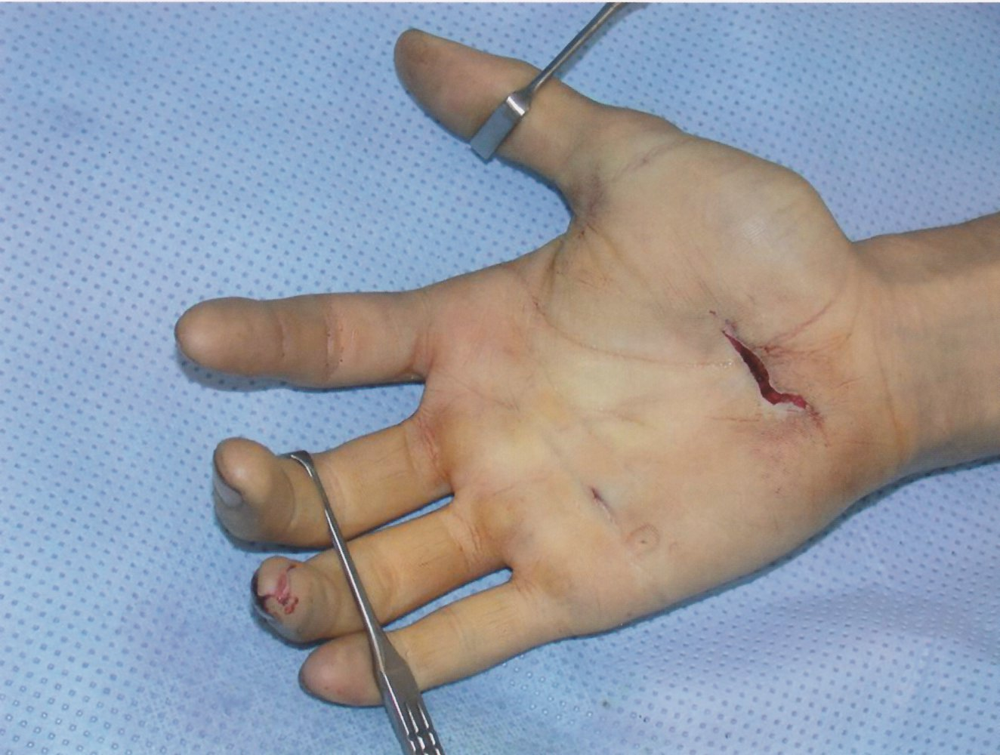

# Median nerve neuropathy

*Categories: Clinical knowledge > Neurology > Peripheral nerve disorders > Median nerve neuropathy*

[Original Article Link](https://coursology-qbank.com/amboss/article/zR0rpf)

---

## Summary

The <u>median nerve</u> is a peripheral nerve originating in the cervical roots C5–T1 of the <u>brachial plexus</u>. It supplies motor innervation to the <u>anterior</u> forearm flexors, the <u>thenar muscles</u>, and the two <u>lateral</u> <u>lumbricals</u> as well as sensory innervation to the <u>lateral</u> palm and <u>anterior</u>, <u>lateral</u> three and a half fingers. Motor and sensory deficits depend on whether the lesion is <u>proximal</u> (above the <u>elbow</u>) or <u>distal</u> (below the <u>elbow</u>). While <u>proximal</u> lesions present with the “<u>hand of benediction</u>,” <u>distal</u> lesions present with either the “<u>pinch sign</u>” (<u>anterior interosseous nerve syndrome</u>) or, in the case of <u>carpal tunnel syndrome</u>, with mildly impaired thumb and index finger motion. Both <u>proximal</u> lesions and <u>carpal tunnel syndrome</u> result in reduced sensation in the area of the thumb, index and middle finger. <u>Anterior</u> interosseus nerve syndrome does not cause any sensory deficits. Chronic injuries to the nerve result in <u>atrophy</u> of <u>median nerve</u> innervated muscles while acute injuries do not have this feature. Treatment is mostly conservative and focuses on rest and <u>immobilization</u>.

---

## Etiology

* Traumatic: e.g., <u>fractures</u> (<u>humerus fracture</u> causing <u>proximal</u> lesion), carpal bone <u>dislocations</u>, or <u>penetrating injuries</u> (gunshots, <u>lacerations</u> )

* Chronic compression: : e.g., in the <u>carpal tunnel</u> (see <u>carpal tunnel syndrome</u>; ) or between the <u>forearm muscles</u> (<u>anterior interosseous nerve syndrome</u>) or by a nerve sheath <u>tumor</u> (<u>schwannoma</u> of the <u>median nerve</u>)

Neuroma (schwannoma) of the median nerve

References:[[1]](https://coursology-qbank.com/amboss/article/l5Yv4p)

---

## Clinical features

### Course of the <u>median nerve</u>

* Runs from the <u>axilla</u> to the <u>elbow</u>, in the <u>medial</u> side of the arm in the <u>medial bicipital groove</u>

* Enters the forearm through the two heads of the <u>pronator teres muscle</u>

* After branching off into a motor nerve (<u>anterior interosseous nerve</u>), courses distally between the <u>superficial</u> and deep layers of the forearm's flexor compartment

* At the wrist, branches off into a sensory nerve (the <u>palmar</u> cutaneous branch of the <u>median nerve</u>)

* Enters the hand through the <u>carpal tunnel</u>

* For more information, see <u>peripheral nerve injuries</u>.

Median nerve

### Lesions of the <u>median nerve</u>

|  Clinical features of median nerve lesions   |  |  |
| --- | --- | --- |
| Location of lesion | Motor deficit | Sensory deficit |
| <u>Proximal</u> (above <u>anterior interosseous nerve</u> origin) |   * Hand of benediction: when asked to make a fist, the patient can only flex the ring finger and the little finger due to  * Loss of thumb opposition and <u>abduction</u>  * Loss of index and middle finger <u>flexion</u>  * Impaired wrist <u>pronation</u> and <u>flexion</u>  * Thenar muscle <u>atrophy</u> (chronic injury)    |   * Thumb  * Index and middle finger  * Radial side of ring finger    |
| <u>Distal</u> (affecting <u>anterior interosseous nerve</u>) |  * Anterior interosseous nerve syndrome: loss of <u>flexion</u> in <u>distal</u> <u>joints</u> of the thumb and index finger, leading to an inability to pinch small objects (pinch sign) or form the “<u>OK sign</u>”   |  * None   |
| <u>Distal</u> (below <u>anterior interosseous nerve</u> origin) |   * Recurrent branch of <u>median nerve</u>  * Innervates muscles of the <u>thenar eminence</u>  * Damaged with <u>lacerations</u> of the radial-sided wrist and <u>proximal</u> palm  * Results in loss of thumb <u>flexion</u>, opposition, and <u>abduction</u> without sensory or other motor deficits  * Median claw: <u>Distal</u> <u>median nerve</u> injury causes palsy of the <u>lumbricals</u> I and II with preserved function of extrinsic flexors. This imbalance leads to permanent <u>flexion</u> of the index finger and the middle finger (aggravated when trying to extend the fingers).  * Ape hand: inability to oppose and <u>abduct</u> the thumb due to injury of the <u>proximal</u> or <u>distal</u> median nerves impairing the <u>thenar muscles</u>' functions  * <u>Palmar</u> cutaneous nerve  * Purely sensory nerve arising from <u>median nerve</u> <u>proximal</u> to the <u>carpal tunnel</u>  * Provides sensation to the palm    |   * Thumb  * Index and middle finger  * Radial side of ring finger    |
| <u>Distal</u> (within wrist) |  * <u>Carpal tunnel syndrome</u>  * Mild impairment of <u>flexion</u> of index finger, long finger, and thumb (less severe than in other <u>median nerve</u> lesions)  * Thenar muscle <u>atrophy</u> (in chronic injury)   |  |

> [!TIP]
> The <u>hand of benediction</u> only occurs in <u>proximal</u> <u>median nerve</u> injuries.

Proximal and distal median nerve lesions

Pinch sign (anterior interosseous syndrome)

Carpal tunnel syndrome

Thenar muscle atrophy

Sensory innervation areas of the peripheral nerves (arm, ventral view)

Sensory innervation areas of the peripheral nerves (arm, dorsal view)

Laceration of the hand

References:[[1]](https://coursology-qbank.com/amboss/article/l5Yv4p)[[2]](https://coursology-qbank.com/amboss/article/fT0kJ2)

---

## Diagnosis

* <u>Physical examination</u>

* Bottle sign

* In the case of <u>carpal tunnel syndrome</u>, the following signs are also present:

* <u>Tinel's sign</u>

* <u>Phalen's sign</u>

* Diagnostic procedures

* <u>Nerve conduction study</u>

* <u>Electromyography</u> (<u>EMG</u>)

References:[[3]](https://coursology-qbank.com/amboss/article/19a2m5)

---

## Treatment

* Avoid repetitive wrist activities

* See treatment for <u>carpal tunnel syndrome</u>

References:[[2]](https://coursology-qbank.com/amboss/article/fT0kJ2)

---