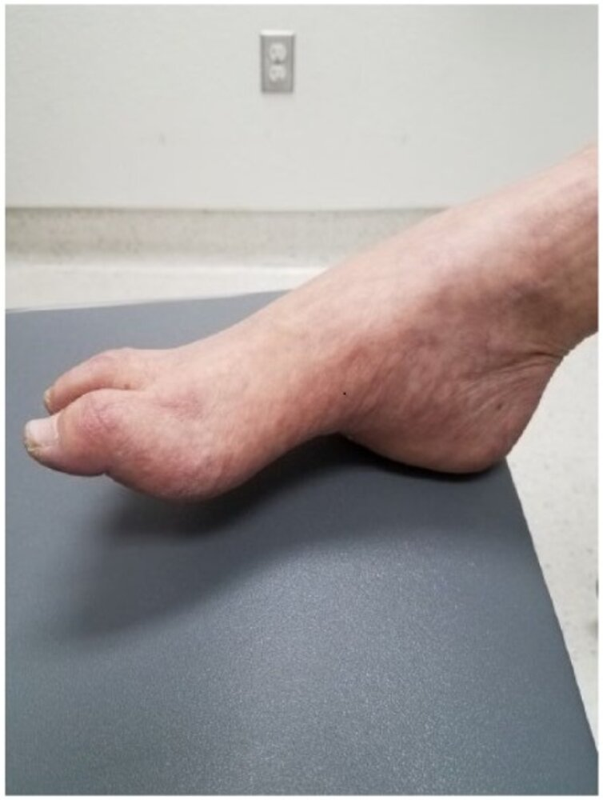
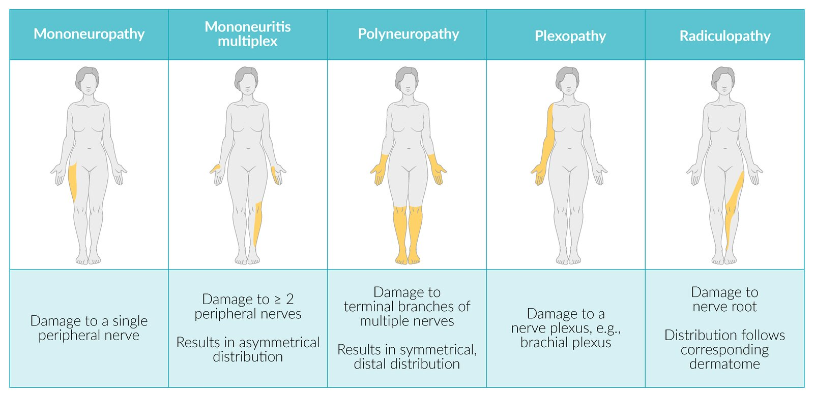

# Polyneuropathy

*Categories: Clinical knowledge > Neurology > Peripheral nerve disorders > Polyneuropathy*

[Original Article Link](https://coursology-qbank.com/amboss/article/qR0CLf)

---

## Summary

Polyneuropathy is a disorder that involves damage to multiple peripheral nerve fibers. Causes include <u>diabetes mellitus</u>, <u>alcohol use disorder</u>, hereditary diseases, toxins, infection, or other inflammatory conditions. The classic presentation is a symmetrical <u>distal</u> burning sensation or loss of sensation. Further clinical features depend on whether an axonal or <u>demyelinating</u> nerve injury has occurred. Diagnosis is usually clinical, supported by <u>laboratory studies</u> to rule out common causes such as <u>diabetes</u>. Further diagnostic tests such as <u>electrodiagnostic studies</u> are reserved for patients with atypical clinical features, unknown etiology, and/or severe or rapidly progressive symptoms. Management involves treatment of the underlying disorder and symptomatic therapy (e.g., control of <u>neuropathic pain</u>).

See also “<u>Diabetic neuropathy</u>.”

---

## Etiology

* Hereditary

* <u>Charcot-Marie-Tooth disease</u>

* <u>Krabbe disease</u>

* <u>Adrenoleukodystrophy</u>

* <u>Metachromatic leukodystrophy</u>

* Toxins

* <u>Endogenous</u>

* Metabolic/endocrine causes: <u>diabetes mellitus</u>, <u>acromegaly</u>, <u>pregnancy</u>

* Hereditary causes: <u>hereditary motor and sensory neuropathy</u> (<u>HMSN</u>), hereditary sensory neuropathy (HSN), <u>amyloidosis</u>, <u>porphyria</u>

* <u>Exogenous</u>

* <u>Alcohol</u>

* Heavy metals (<u>lead poisoning</u>, <u>arsenic</u>, <u>thallium</u>)

* Solvents (e.g., <u>trichloroethylene</u>)

* Medication (e.g., <u>chemotherapy-induced peripheral neuropathy</u>)

* <u>Malnutrition</u>/intestinal <u>malabsorption</u>

* Inflammatory

* <u>Vasculitis</u>

* <u>Connective tissue disorders</u>

* <u>Granulomatous diseases</u>

* Radiation exposure

* <u>Guillain-Barré syndrome</u>

* <u>Chronic inflammatory demyelinating polyneuropathy</u>

* <u>Critical illness polyneuropathy</u>

* Infectious

* Bacterial: <u>borreliosis</u>; , <u>diphtheria</u>, <u>leprosy</u>

* Viral: <u>AIDS</u>, <u>CMV</u>, <u>VZV</u>, <u>herpes zoster</u>, <u>measles</u>, <u>mumps</u>, <u>rubella</u>, <u>influenza</u>

* Environmental

* Prolonged exposure to cold

* <u>Hypoxemia</u>

* Vibration-induced damage

* <u>Idiopathic</u>

> [!TIP]
> <u>Diabetes mellitus</u> and <u>alcohol use disorder</u> account for most cases in developed countries.

References:[[1]](https://coursology-qbank.com/amboss/article/pFaLQm)[[2]](https://coursology-qbank.com/amboss/article/IFaYjm)[[3]](https://coursology-qbank.com/amboss/article/7Fa4jm)[[4]](https://coursology-qbank.com/amboss/article/HFaKjm)[[5]](https://coursology-qbank.com/amboss/article/vFaAPm)[[6]](https://coursology-qbank.com/amboss/article/9d1NHf0)

---

## Clinical features

### General

* Symmetrical <u>distal</u> sensory loss (<u>glove and stocking pattern</u>)

* May be accompanied by <u>neuropathic pain</u>, <u>paresthesias</u>, and motor <u>weakness</u>
* Burning-foot syndrome: burning <u>pain</u>, tingling, pins-and-needles sensation, or formication , <u>hyperhidrosis</u>

* <u>Atrophy</u> of muscles: e.g., stork legs  in the case of <u>Charcot-Marie-Tooth disease</u>

* <u>Sensory ataxia</u>: caused by loss of sensation, particularly <u>proprioception</u>, that affects the afferent limb of postural reflexes (e.g., due to <u>vitamin B12</u> deficiency).

* ↓ <u>Deep tendon reflexes</u>

### Axonal vs. <u>demyelinating</u>

| Overview of axonal and <u>demyelinating</u> neuropathies |  |  |  |  |
| --- | --- | --- | --- | --- |
| Features | Axonal |  | <u>Demyelinating</u> |  |
| Chronic | Acute | Chronic | Acute |  |
| Progression |  * Slow decline over years   |  * Months to years of slow, yet incomplete recovery   |  * Variable (periods of recovery, stabilization, exacerbations, or slow decline)   |  * Variable   |
| Characteristics |   * Affects longer <u>axons</u> first (begins in lower extremities → <u>sternum</u> (intercostal nerves) → head)  * Early disease: sensory symptoms > motor symptoms    |   * Similar, but symptoms more severe  * Significant <u>pain</u>    |  * Early disease: motor symptoms = sensory symptoms   |  * Early disease: motor symptoms > sensory symptoms   |
|   * <u>Distal</u> muscle wasting: feet, lower legs, hands (severe cases)  * <u>Distal</u> sensory loss (<u>pain</u>, temperature, <u>proprioception</u>, vibration)  * Reduced or absent <u>distal</u> reflexes (usually begins in the ankles)    |  |   * Generalized <u>muscle weakness</u>: <u>distal</u> > <u>proximal</u> * <u>Distal</u> sensory loss (abnormal vibration and <u>proprioception</u> > <u>pain</u> or temperature)  * Diffusely reduced or absent reflexes    |  |  |
| Associated conditions |   * Chronic <u>idiopathic</u> axonal polyneuropathy (CIAP)  * <u>Diabetes</u>  * <u>Alcohol use disorder</u>  * <u>Hereditary motor sensory neuropathies</u>  * <u>Leprosy</u>  * <u>HIV-associated distal symmetric polyneuropathy</u>  * <u>Borreliosis</u>  * <u>Hypothyroidism</u>  * Toxic polyneuropathy (e.g. due to <u>cisplatin</u>, <u>doxorubicin</u>)    |  * Axonal <u>Guillain-Barré syndrome</u>   |   * <u>Chronic inflammatory demyelinating polyneuropathy</u> (<u>CIDP</u>)  * <u>Hereditary motor sensory neuropathies</u> (Charcot-Marie-<u>Tooth</u> disease)  * Uremic polyneuropathy  [[7]](https://coursology-qbank.com/amboss/article/LQXw9B)  * Toxic polyneuropathy (e.g. due to <u>diphtheria toxin</u>, <u>suramin</u>, <u>amiodarone</u>)    |  * <u>Guillain-Barré syndrome</u>   |

References:[[8]](https://coursology-qbank.com/amboss/article/GFaBjm)[[9]](https://coursology-qbank.com/amboss/article/tFaXPm)[[10]](https://coursology-qbank.com/amboss/article/DFa14m)[[11]](https://coursology-qbank.com/amboss/article/R8almm)

---

## Subtypes and variants

See also “<u>Diabetic neuropathy</u>.”

### Alcoholic polyneuropathy [[12]](https://coursology-qbank.com/amboss/article/We1PBf0)[[13]](https://coursology-qbank.com/amboss/article/1e12Bf0)[[14]](https://coursology-qbank.com/amboss/article/de1oBf0)

* Definition: progressive <u>peripheral nerve injury</u> due to a chronic <u>alcohol use disorder</u>

* Pathophysiology

* Likely multifactorial

* Mechanisms include <u>malnutrition</u> (e.g., <u>thiamine deficiency</u>) and the toxic effects of <u>alcohol</u> on the nervous system

* Clinical features: Symptoms usually begin in the <u>distal</u> lower extremities and progress slowly over months to years. [[14]](https://coursology-qbank.com/amboss/article/de1oBf0)

* Sensory deficits: usually symmetrical [[6]](https://coursology-qbank.com/amboss/article/9d1NHf0)

* Numbness, <u>paresthesias</u>, <u>impaired vibration sense</u>

* Decreased <u>proprioception</u>

* <u>Burning feet syndrome</u>

* <u>Weakness</u> of <u>distal</u> muscles

* Reduced or absent reflexes

* <u>Gait ataxia</u>

* Rare: red, <u>atrophic</u> <u>skin</u>; muscle cramps

* Diagnostics

* Usually <u>diagnosed clinically</u>

* <u>Laboratory studies</u> help identify other conditions associated with <u>alcohol use disorder</u>.

* Consider <u>electrodiagnostic studies</u> if there is diagnostic uncertainty (see “<u>Diagnostics of polyneuropathy</u>”).

* Treatment

* Cessation of <u>alcohol</u> use (see “<u>Treatment of alcohol use disorder</u>”)

* <u>Vitamin</u> supplementation (e.g., <u>thiamine</u>)

* For symptom management, see “<u>Treatment of polyneuropathy</u>.”

### Hereditary motor sensory neuropathy (<u>HMSN</u>) [[15]](https://coursology-qbank.com/amboss/article/ee1xBf0)[[16]](https://coursology-qbank.com/amboss/article/Ve1GBf0)[[17]](https://coursology-qbank.com/amboss/article/Qi1urg0)

#### Overview [[17]](https://coursology-qbank.com/amboss/article/Qi1urg0)

* One of the most common inherited neurological diseases

* Also known as <u>Charcot-Marie-Tooth disease</u>

* Inheritance is usually <u>autosomal dominant</u>, but may be <u>autosomal recessive</u> or X-linked.

* Various mutations cause impaired growth or function of the <u>axons</u> or <u>Schwann cells</u> (e.g., defects in <u>axon</u> or <u>myelin</u> sheath <u>proteins</u>).

* Common clinical features include:

* <u>Distal</u> <u>muscle weakness</u> and <u>atrophy</u>

* Reduced or absent reflexes

* Sensory deficits (e.g., decreased vibration, <u>proprioception</u>)

* Associated with <u>scoliosis</u> and <u>foot deformities</u>;  (e.g., high arches; , <u>hammer toes</u>)

#### <u>HMSN type I</u>

* <u>Epidemiology</u>: most common subtype

* Pathophysiology

* Primarily <u>demyelinating</u> neuropathy

* Usually caused by duplication of the PMP22 <u>gene</u> on <u>chromosome</u> 17

* Clinical features: onset before the age of 20 years with <u>distal</u> symmetrical sensorimotor polyneuropathy

* <u>Foot drop</u>, <u>pes cavus</u> deformity, <u>hammer toe</u>  [[18]](https://coursology-qbank.com/amboss/article/Se1yyf0)

* <u>Atrophy</u> of the calf muscles (stork leg appearance)

* Weak intrinsic hand muscles

* Sensory loss

* <u>Nociceptive pain</u>

* May be associated with <u>sleep apnea</u>

* Diagnostics

* <u>Nerve conduction studies</u>: ↓ impulse conduction <u>velocity</u> in both sensory and motor nerves

* <u>Sural nerve</u> <u>biopsy</u>: hypertrophic neuropathy (onion bulb appearance from repeated <u>demyelination</u> and remyelination in large nerve fibers) [[19]](https://coursology-qbank.com/amboss/article/he1cAf0)

* Management: primarily symptomatic; see “<u>Treatment of polyneuropathy</u>.”

* Consider <u>surgery</u> for <u>foot deformities</u>.

* Avoidance of <u>neurotoxic</u> medications (e.g., <u>vincristine</u>)

* <u>Genetic counseling</u>

Pes cavus and hammer toes

Pes cavus

#### Other types of <u>HMSN</u>  [[17]](https://coursology-qbank.com/amboss/article/Qi1urg0)[[20]](https://coursology-qbank.com/amboss/article/ie1JAf0)[[21]](https://coursology-qbank.com/amboss/article/9S1Nbg0)

* HMSN type II: primarily axonal neuropathy

* <u>HMSN type III</u> (Dejerine-Sottas disease): severe symptoms with an early onset

* <u>HMSN</u> type IV

* Previously synonymous with <u>Refsum disease</u> [[22]](https://coursology-qbank.com/amboss/article/zl1rzS0)

* Now used to describe <u>autosomal recessive</u> <u>demyelinating</u> neuropathy

* HMSN type V: associated with <u>spastic</u> <u>paraplegia</u>

* HMSN type VI: manifests with neuropathy and <u>optic atrophy</u>

* HMSN type VII: manifests with neuropathy and <u>retinitis pigmentosa</u>

> [!TIP]
> <u>HMSN</u> is a heterogeneous group of diseases with variable symptom onset and severity. Generally, progression of symptoms is slow and <u>life expectancy</u> is unaffected. [[15]](https://coursology-qbank.com/amboss/article/ee1xBf0)

### Refsum disease [[23]](https://coursology-qbank.com/amboss/article/3e1SAf0)[[24]](https://coursology-qbank.com/amboss/article/Re1lAf0)

* Pathophysiology: <u>autosomal recessive</u> defect affecting <u>alpha-oxidation</u> in <u>peroxisomes</u> → ↓ conversion of phytanic acid (a <u>branched-chain fatty acid</u> that can only be metabolized by <u>alpha-oxidation</u> in the <u>peroxisome</u>) to pristanic acid → accumulation of <u>phytanic acid</u>

* Clinical features

* Symmetrical, ascending polyneuropathy

* <u>Muscle weakness</u> and <u>atrophy</u>

* <u>Ataxia</u>

* <u>Sensorineural hearing loss</u>

* <u>Anosmia</u>

* <u>Ichthyosis</u>

* <u>Cataracts</u> and <u>nyctalopia</u> caused by <u>retinitis pigmentosa</u>

* Shortened third and fourth toe

* Epiphyseal <u>dysplasia</u>

* Cardiac abnormalities: <u>cardiomyopathy</u>, <u>aberrant conduction</u>

* Diagnosis: detection of <u>phytanic acid</u> in plasma

* Treatment: The goal is to reduce plasma <u>phytanic acid</u> levels.

* Diet: elimination of foods that contain <u>phytanic acid</u>, e.g., dairy products, beef, lamb, and fish

* <u>Plasmapheresis</u> in severe cases

### Chronic inflammatory demyelinating polyneuropathy (<u>CIDP</u>) [[25]](https://coursology-qbank.com/amboss/article/GW1B5f0)

* Definition: A chronic immune-mediated polyneuropathy primarily affecting <u>peripheral nerves</u> [[26]](https://coursology-qbank.com/amboss/article/aN1Q-S0)

* <u>Epidemiology</u>

* More common in men [[27]](https://coursology-qbank.com/amboss/article/sN1tch0)

* Peak <u>incidence</u> is 40–60 years old. [[25]](https://coursology-qbank.com/amboss/article/GW1B5f0)

* Etiology

* <u>Macrophage</u>-associated <u>demyelination</u> [[28]](https://coursology-qbank.com/amboss/article/bN1H-S0)

* Likely autoimmune, <u>autoantibodies</u> (e.g., anti‑GM1 <u>antibodies</u> anti-contactin 1, anti-neurofascin 155) have been detected [[25]](https://coursology-qbank.com/amboss/article/GW1B5f0)

* <u>CIDP</u> has not been linked to a particular <u>pathogen</u>. [[29]](https://coursology-qbank.com/amboss/article/XUY9bo)

* Predisposing factors

* <u>Diabetes mellitus</u>

* <u>HIV infection</u>

* Monoclonal gammopathies (e.g., <u>MGUS</u>)

* Malignancies (e.g., <u>hepatocellular carcinoma</u>)

* Pathophysiology

* <u>Macrophages</u> <u>phagocyte</u> <u>myelin</u> sheath → <u>demyelination</u> of <u>peripheral nerves</u> → remyelination by <u>Schwann cells</u> → onion bulb formation

* <u>Autoantibodies</u> against nodal and paranodal <u>proteins</u>  → detachment of <u>myelin</u> sheath around the <u>nodes of Ranvier</u> → abnormal nerve conduction

* Clinical features: progress or relapse/remit over > 8 weeks[[25]](https://coursology-qbank.com/amboss/article/GW1B5f0)

* Symmetric <u>weakness</u> of both <u>proximal</u> and <u>distal</u> muscles  [[28]](https://coursology-qbank.com/amboss/article/bN1H-S0)

* ↓ Deep <u>tendon reflexes</u> in both upper and lower extremities

* Sensory involvement (e.g., <u>paresthesias</u>)

* <u>Autonomic dysfunction</u> and <u>cranial nerve</u> involvement are rare.

* <u>CIDP</u> variants can manifest with asymmetric symptoms and/or purely sensory or motor symptoms.

* Diagnostics: See also “<u>Diagnostics of polyneuropathy</u>.” [[25]](https://coursology-qbank.com/amboss/article/GW1B5f0)

* Perform nerve conduction; diagnosis is confirmed if in ≥ 2 nerves either of the following are present:

* Signs of motor nerve <u>demyelination</u> (e.g., reduced conduction <u>velocity</u>)

* Impaired sensory nerve conduction

* Assess for monoclonal gammopathy with <u>serum protein electrophoresis</u> and serum and urine <u>immunofixation</u>.

* If <u>nerve conduction studies</u> are not diagnostic, consider additional testing. 

* <u>Lumbar puncture</u>: elevated <u>proteins</u> (<u>albuminocytologic dissociation</u>) and normal <u>WBC count</u> [[28]](https://coursology-qbank.com/amboss/article/bN1H-S0)

* Imaging: <u>Ultrasound</u> or <u>MRI</u> may show nerve enlargement.

* Nerve <u>biopsy</u>: shows reduced nerve myelination

* <u>Antibody</u> testing (e.g., anti-NF155, anti-CNTN1, anti-Caspr1)

* Further studies may be recommended by a specialist depending on the subtype.

* Treatment [[25]](https://coursology-qbank.com/amboss/article/GW1B5f0)

* First-line therapies: <u>corticosteroids</u> or <u>intravenous immunoglobulin</u>

* Alternative therapies

* <u>Plasmapheresis</u>

* Immunomodulatory drugs (e.g., <u>azathioprine</u>, <u>cyclophosphamide</u>): reserved for treatment failure

* Provide symptomatic <u>treatment for pain</u> (see “<u>Treatment of polyneuropathy</u>”).

* Tailor long-term treatment plans to the patient's clinical response.

---

## Diagnosis

### Approach [[6]](https://coursology-qbank.com/amboss/article/9d1NHf0)[[30]](https://coursology-qbank.com/amboss/article/y7bdoE)[[31]](https://coursology-qbank.com/amboss/article/Cd1qHf0)

* All patients

* Obtain initial laboratory workup to evaluate for common causes.

* Consider further <u>laboratory studies</u> based on clinical features.

* Atypical clinical presentation  or nondiagnostic initial workup: Refer to <u>neurology</u> for further studies.

* First-line: <u>electrodiagnostic studies</u>

* Persistent diagnostic uncertainty: imaging, genetic studies, or nerve or <u>skin biopsies</u>

> [!TIP]
> In many cases of polyneuropathy, the underlying cause remains unknown despite thorough clinical evaluation, laboratory testing, and <u>electrodiagnostic studies</u>. [[6]](https://coursology-qbank.com/amboss/article/9d1NHf0)

### <u>Laboratory studies</u> [[6]](https://coursology-qbank.com/amboss/article/9d1NHf0)[[32]](https://coursology-qbank.com/amboss/article/Bd1zHf0)

* Initial studies

* <u>CBC</u>: to assess for <u>anemia</u>

* <u>CMP</u>

* To evaluate for <u>kidney</u> and <u>liver</u> disease

* ↑ <u>Fasting</u> and <u>postprandial</u> serum <u>glucose</u> suggest possible <u>diabetes</u>

* <u>Vitamin B12</u>: ↓ levels can cause polyneuropathy  [[30]](https://coursology-qbank.com/amboss/article/y7bdoE)

* <u>Serum electrophoresis</u> with <u>immunofixation</u>: to assess for monoclonal gammopathies

* <u>TSH</u>: to assess for <u>thyroid disease</u>

* Additional <u>laboratory studies</u>: Perform based on clinical suspicion.

* Infections

* Bloodbourne <u>viruses</u>: <u>hepatitis B serology</u>, <u>hepatitis C testing</u>, <u>HIV screening</u>

* <u>Diagnostic studies for Lyme disease</u>

* <u>Syphilis screening</u>

* Nutritional deficiencies: serum <u>folic acid</u>, <u>phosphorus</u>, <u>thiamine</u>

* <u>Heavy metal toxicity</u>: urine or serum levels of toxins (such as lead; , <u>thallium</u>, and <u>arsenic</u>)

* <u>Sarcoidosis</u>: <u>ACE</u> levels

* Autoimmune or inflammatory disease: <u>ESR</u>, <u>CRP</u> <u>ANA</u>, <u>c-ANCA</u>, <u>p-ANCA</u> [[33]](https://coursology-qbank.com/amboss/article/KV1Uvf0)

* <u>Alcohol use disorder</u>: ethanol level

* <u>Malignancy</u>: <u>paraneoplastic panel</u>

* Defective <u>heme synthesis</u> (e.g., <u>porphyria</u>, <u>lead intoxication</u>; ): Consider specific tests (e.g., urine <u>delta aminolevulinic acid</u> levels). [[34]](https://coursology-qbank.com/amboss/article/tR1XKg0)

### <u>Electrodiagnostic studies</u>  [[6]](https://coursology-qbank.com/amboss/article/9d1NHf0)

* Indications

* Acute onset or rapid progression of symptoms

* Asymmetrical symptoms

* Primarily motor or <u>autonomic dysfunction</u>

* Diffuse reflex loss [[35]](https://coursology-qbank.com/amboss/article/RV1l8f0)

* Nondiagnostic initial workup

* Modalities [[35]](https://coursology-qbank.com/amboss/article/RV1l8f0)

* <u>Nerve conduction studies</u> 

* <u>Demyelinating</u> disease: ↓ impulse conduction <u>velocity</u>, normal amplitude of response  [[6]](https://coursology-qbank.com/amboss/article/9d1NHf0)

* Axonal disease: normal impulse conduction <u>velocity</u>, ↓ amplitude of response

* <u>Electromyography</u> [[36]](https://coursology-qbank.com/amboss/article/zh1rgg0)

* Can differentiate between neuropathy and <u>myopathy</u>

* Polyneuropathy findings may include spontaneous electrical activity (fibrillation potentials) and <u>reduced interference pattern</u>.

> [!TIP]
> <u>Electrodiagnostic studies</u> can help identify and localize nerve dysfunction, but often do not reveal the underlying cause of neuropathy. [[35]](https://coursology-qbank.com/amboss/article/RV1l8f0)

Nerve conduction study

Needle (intramuscular) electromyography (EMG)

### Additional testing [[6]](https://coursology-qbank.com/amboss/article/9d1NHf0)[[33]](https://coursology-qbank.com/amboss/article/KV1Uvf0)

* Imaging

* <u>Central nervous system</u> imaging: only for patients with symptoms of <u>CNS</u> lesions or <u>radiculopathies</u>

* <u>MRI</u> <u>brain</u>: patients with <u>cranial nerve palsies</u>, <u>ataxia</u>, or <u>dysarthria</u>

* <u>MRI</u> <u>spine</u>: patients with suspected <u>radiculopathy</u>

* Peripheral nerve imaging: advanced imaging, e.g., <u>MR neurography</u>, may be considered in atypical neuropathies. [[37]](https://coursology-qbank.com/amboss/article/NO1-sS0)

* <u>Sural nerve</u> <u>biopsy</u>: performed in diagnostic uncertainty or prior to starting aggressive treatments [[6]](https://coursology-qbank.com/amboss/article/9d1NHf0)

* <u>Skin biopsy</u>: may be performed in patients with a burning sensation or painful neuropathy

* <u>Genetic testing</u>: for suspected hereditary disorders

* <u>Cerebrospinal fluid analysis</u>: for suspected infections or <u>CIDP</u>

> [!WARNING]
> Only request imaging of the <u>brain</u> or <u>spine</u> if there are clinical features of <u>CNS</u> lesions or <u>radiculopathy</u>. [[6]](https://coursology-qbank.com/amboss/article/9d1NHf0)

---

## Differential diagnoses

### Mononeuritis multiplex

* Definition: : a group of disorders characterized by ≥ 2 isolated mononeuropathies; e.g., concurrent sciatic neuropathy and radial neuropathy

* Etiology

* Axonal injury caused by damage to <u>vasa nervorum</u>

* Occurs in conditions characterized by the development of <u>granulomas</u> and/or microangiopathy (e.g., <u>diabetes mellitus</u>, <u>rheumatoid arthritis</u>, <u>vasculitides</u>, <u>SLE</u>, <u>Lyme disease</u>, <u>amyloidosis</u>, <u>HIV</u>, <u>polyarteritis nodosa</u>)

* Clinical features: painful, asymmetrical sensory and motor symptoms

* Diagnostics: Confirm with <u>electrodiagnostic testing</u> and test for possible etiology.

* Treatment: <u>analgesia</u> (see “<u>Pain management</u>”) and treatment of the underlying condition

### Differential diagnosis of impaired sensation and sensory ataxia

|  | Polyneuropathy |  <u>Multiple sclerosis</u>  | <u>Subacute combined degeneration</u> | <u>Tabes dorsalis</u> | <u>Compressive myelopathy</u> |
| --- | --- | --- | --- | --- | --- |
| Pathogenesis |  * Acute or chronic <u>demyelination</u> and/or axonal degeneration due to:  * Toxins: e.g., in <u>diabetes mellitus</u> or <u>alcohol</u> use  * Trauma  * Inflammation or infection   |  * Immune-mediated chronic <u>demyelination</u> of <u>white matter</u> in the <u>brain</u> and spinal cord   |  * Chronic <u>demyelination</u> of <u>dorsal columns</u>, <u>lateral corticospinal tracts</u>, and <u>spinocerebellar tracts</u> due to <u>vitamin B12 deficiency</u>   |  * <u>Demyelination</u> of the <u>dorsal columns</u> and the <u>dorsal root ganglia</u> due to <u>Treponema pallidum</u> infection (<u>tertiary syphilis</u>)   |  * Spinal cord <u>demyelination</u> and <u>ischemia</u> that is caused by compression due to:  * <u>Disk herniation</u>  * <u>Osteophytes</u>  * Tumors and <u>metastases</u>   |
| Impairment of sensation |  * Symmetrical <u>distal</u> loss of all the types of sensation (<u>stocking-and-glove distribution</u>)   |  * Loss of all types of sensation is possible (distribution depends on the lesion).   |  * Loss of position and <u>vibration sense</u> below the level of the lesion   |  * Loss of position and <u>vibration sense</u> below the level of the lesion   |  * Loss of <u>pain</u> and <u>temperature sensation</u> below the level of compression is most common.   |
| <u>Motor neuron signs</u> |  * <u>Lower motor neuron signs</u>: <u>distal</u> <u>flaccid paresis</u>   |  * <u>Upper motor neuron signs</u>   |  * <u>Upper motor neuron signs</u>: <u>spastic paresis</u>   |  * None   |   * <u>Lower motor neuron signs</u> at the level of the lesion  * <u>Upper motor neuron signs</u> below the level of cord compression    |
| Other features |  * Burning-foot syndrome and <u>neuropathic pain</u> are common.   |   * <u>Internuclear ophthalmoplegia</u> (<u>INO</u>)  * <u>Lhermitte sign</u>  * <u>Charcot neurological triad</u>  * Exacerbations followed by periods of remission    |   * <u>Megaloblastic anemia</u>  * Neuropsychiatric symptoms    |   * <u>Argyll Robertson pupils</u>  * Sharp, shooting <u>pain</u> in the legs and the abdomen  * <u>Gumma</u>, <u>aortitis</u>    |  * <u>Back pain</u>   |

### Other considerations

* <u>Radicular neuropathy</u>: associated with acute onset of severe <u>back pain</u> that radiates to the legs and arms

* <u>Amyotrophic lateral sclerosis</u>: asymmetrical limb <u>weakness</u> with <u>fasciculations</u> and muscle stiffness

* <u>Peripheral vascular disease</u>: trophic <u>skin</u> changes and <u>pain</u> exacerbated by walking

Peripheral neuropathy

The differential diagnoses listed here are not exhaustive.

---

## Treatment

### Approach [[6]](https://coursology-qbank.com/amboss/article/9d1NHf0)[[30]](https://coursology-qbank.com/amboss/article/y7bdoE)[[38]](https://coursology-qbank.com/amboss/article/QBYu07)

* Identify and treat the underlying disease (e.g., <u>alcohol use disorder</u>, <u>diabetes mellitus</u>).

* Educate patients on the expected course of their disease.  [[39]](https://coursology-qbank.com/amboss/article/yl1dzS0)[[40]](https://coursology-qbank.com/amboss/article/Al1RzS0)

* Consider referral to <u>neurology</u>.  [[6]](https://coursology-qbank.com/amboss/article/9d1NHf0)

* Recommend nonpharmacological measures.

* For patients with <u>pain</u>:

* Start pharmacological therapy.

* Consider referral to a <u>pain management</u> specialist in severe or refractory cases.

> [!TIP]
> Management of polyneuropathy is based on treating the underlying cause and providing symptom control.

### Nonpharmacological methods [[6]](https://coursology-qbank.com/amboss/article/9d1NHf0)

* The aim is to prevent a worsening of symptoms through overuse or injury.

* Refer patients to:

* <u>Podiatry</u>: for foot care (e.g., appropriate shoes, foot hygiene)

* <u>Physical therapy</u>: for exercises (including balance and gait retraining)

* <u>Occupational therapy</u>: for <u>home hazard assessment and modification</u>

* Consider the need for <u>orthotics</u>.

* Patients may additionally benefit from <u>management of obesity</u>.  [[41]](https://coursology-qbank.com/amboss/article/SO1y7S0)

### Pharmacological therapy [[6]](https://coursology-qbank.com/amboss/article/9d1NHf0)[[38]](https://coursology-qbank.com/amboss/article/QBYu07)

* Initial therapy

* First-line: <u>tricyclic antidepressants</u> (e.g., <u>amitriptyline</u>), <u>SNRIs</u> (e.g., <u>duloxetine</u>), or <u>gabapentinoids</u>

* Adjuvants: <u>topical analgesics</u> (e.g., <u>lidocaine</u>, <u>capsaicin</u>)

* If response to a 3–8 week trial of a first-line pharmacological agent is inadequate, consider:

* Switching to another first-line agent

* Adding a second first-line agent or an adjuvant

* Treatment failure: Consider <u>tramadol</u>.  [[6]](https://coursology-qbank.com/amboss/article/9d1NHf0)

* For further information, see “<u>Pain management</u>.”

|  Pharmacological treatment of peripheral neuropathy [[38]](https://coursology-qbank.com/amboss/article/QBYu07)  |  |  |
| --- | --- | --- |
| Drug class | Drugs | Clinical considerations |
| <u>Tricyclic antidepressants</u> |   * <u>Amitriptyline</u> DOSAGE  * <u>Nortriptyline</u> DOSAGE    |  * Use with caution in older adults because of potential side effects (e.g., blurry <u>vision</u>, <u>urinary retention</u>).   |
| <u>SNRIs</u> |   * <u>Duloxetine</u> DOSAGE  * <u>Venlafaxine</u> DOSAGE    |  * Reduce the dose in patients with renal dysfunction.   |
| <u>Gabapentinoids</u> |   * <u>Gabapentin</u> DOSAGE  * <u>Pregabalin</u> DOSAGE    |  * Reduce the dose in patients with renal dysfunction.   |
| <u>Topical analgesics</u> |   * <u>Lidocaine</u> patches DOSAGE  * <u>Capsaicin</u> patches DOSAGE  [[42]](https://coursology-qbank.com/amboss/article/-h1Dgg0)  * <u>Capsaicin</u> cream DOSAGE [[43]](https://coursology-qbank.com/amboss/article/DV119f0)    |  * <u>Capsaicin</u> patches should only be applied under close physician supervision.  [[42]](https://coursology-qbank.com/amboss/article/-h1Dgg0)   |
| <u>Opioid</u> <u>agonists</u> |  * <u>Tramadol</u> DOSAGE [[44]](https://coursology-qbank.com/amboss/article/1bY2sn)   |  * Avoid in patients with <u>seizure disorders</u>.   |

> [!WARNING]
> Avoid combining <u>antidepressant</u> classes or <u>antidepressants</u> with <u>tramadol</u> because of the risk of <u>serotonin syndrome</u>. [[38]](https://coursology-qbank.com/amboss/article/QBYu07)

> [!TIP]
> Treatment <u>efficacy</u> can only be assessed after 3–8 weeks of therapy. Since complete <u>pain</u> relief is often not possible, a tolerable level of <u>pain</u> may be an acceptable treatment goal. [[38]](https://coursology-qbank.com/amboss/article/QBYu07)

---