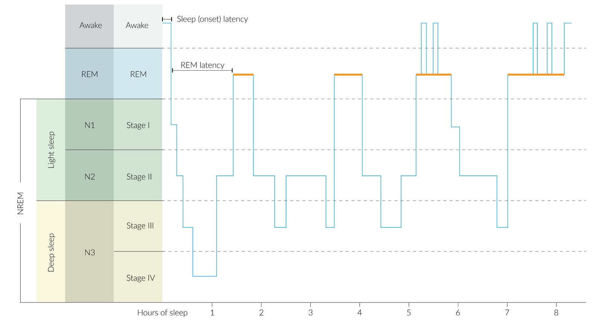
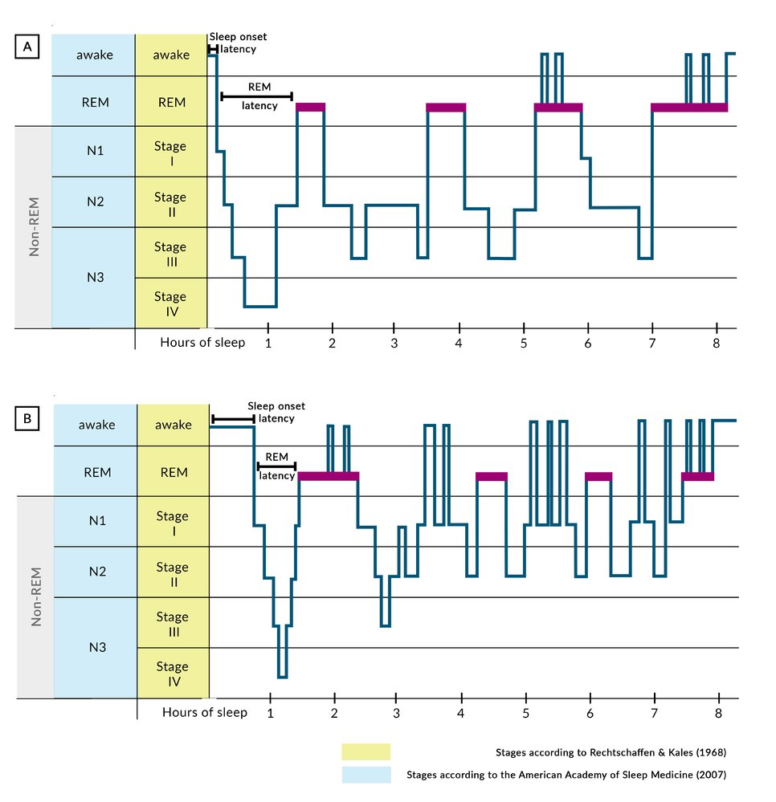
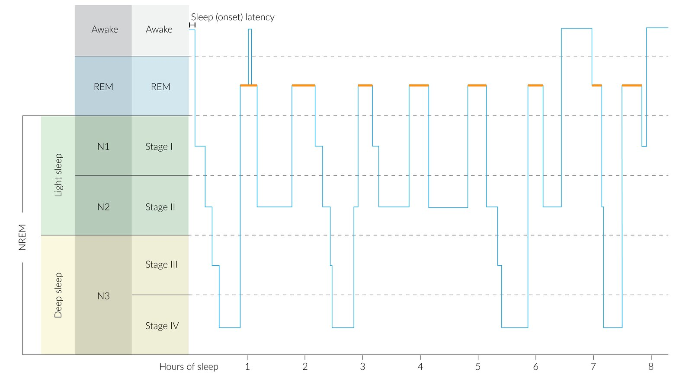

# Sleep disorders

*Categories: Clinical knowledge > Neurology > Sleep-wake disorders > Sleep disorders*

[Original Article Link](https://coursology-qbank.com/amboss/article/tP0XgT)

---

## Summary

<u>Sleep disorders</u> can be grouped into primary disorders (i.e., due to an intrinsic disorder of the <u>sleep</u>-wake cycle) and secondary disorders (i.e., due to an underlying medical condition). Primary <u>sleep disorders</u> are further divided into <u>dyssomnias</u> and <u>parasomnias</u>. Symptoms include difficulty falling asleep, difficulty remaining asleep, or abnormal behavior during <u>sleep</u>. Environmental factors (e.g., long working hours, irregular <u>sleep</u> schedules, <u>alcohol</u> consumption) can also lead to <u>sleep loss</u>. Symptoms include <u>excessive daytime sleepiness</u> and cognitive impairment. Treatment of <u>sleep disorders</u> and <u>sleep loss</u> may include <u>sleep hygiene</u> practice, light therapy, and sedative pharmacotherapy.

<u>Narcolepsy</u>, <u>restless legs syndrome</u>, <u>obstructive sleep apnea</u>, and the pathophysiological basics of the <u>circadian rhythm, sleep, and induced states of altered consciousness</u> are discussed in separate articles.

---

## Classification of sleep disorders

### Primary <u>sleep disorders</u>

#### Dyssomnias

* Definition: : a group of primary sleeping disorders characterized by difficulty falling/staying asleep or <u>hypersomnia</u> (<u>excessive daytime sleepiness</u>)

* Types of <u>dyssomnias</u>

* <u>Circadian rhythm sleep-wake disorder</u> [[1]](https://coursology-qbank.com/amboss/article/pBbLbw)

* <u>Delayed sleep phase disorder</u>

* <u>Advanced sleep phase disorder</u>

* <u>Jet lag disorder</u>

* <u>Shift-work disorder</u>

* <u>Non-24-hour sleep-wake disorder</u>

* <u>Insomnia disorder</u>

* <u>Hypersomnolence disorder</u>

* <u>Narcolepsy</u>

* <u>Central sleep apnea</u>

* <u>Obstructive sleep apnea</u>

#### Parasomnias [[1]](https://coursology-qbank.com/amboss/article/pBbLbw)

* Definition: : a group of primary sleeping disorders characterized by abnormal behaviors or experiences that occur while falling asleep, during <u>sleep</u>, or while waking up

* Types of <u>parasomnias</u>

* NREM-related parasomnia: a group of <u>parasomnias</u> characterized by repeated episodes of brief but incomplete awakenings that typically occur during the first third of <u>sleep</u>

* <u>Sleepwalking disorder</u>

* <u>Sleep terror disorder</u>

* REM-related parasomnias: a group of <u>parasomnias</u> characterized by a dissociation between <u>REM sleep</u> and the awake state

* <u>Nightmare disorder</u>

* <u>REM sleep behavior disorder</u>

* Recurrent isolated <u>sleep paralysis</u>

#### <u>Sleep</u>-related movement disorders [[2]](https://coursology-qbank.com/amboss/article/8tWO2M0)

* <u>Restless legs syndrome</u>

* <u>Periodic limb movement disorder</u>

* <u>Sleep</u>-related <u>bruxism</u>

### Secondary sleep disorders

* Definition: disturbances in <u>sleep</u> that are caused by an underlying medical, psychiatric, or substance-related condition; management focuses on addressing the underlying condition first

* Psychiatric sleep disorders

* <u>Major depressive disorder</u>  [[3]](https://coursology-qbank.com/amboss/article/q3YCjK)

* Decresed <u>REM sleep latency</u>

* Increased <u>REM sleep</u> duration

* Increased <u>REM sleep</u> density

* Decreased <u>N3 stage</u> (<u>deep sleep</u>)

* Multiple nighttime awakenings

* Early morning awakening (terminal <u>insomnia</u>)

* <u>Bipolar disorder</u>: <u>manic episodes</u> cause a decreased need for <u>sleep</u>

* <u>Generalized anxiety disorder</u>: characterized by <u>sleep</u>-onset <u>insomnia</u> (difficulty falling asleep) due to "<u>racing thoughts</u>" or hyperarousal

* <u>PTSD</u>: associated with <u>REM</u>-related nightmares and <u>sleep</u>-maintenance <u>insomnia</u> due to <u>hypervigilance</u>

* Medical sleep disorders

* Cardiovascular: <u>CHF</u> can lead to <u>Cheyne-Stokes respiration</u> or <u>paroxysmal nocturnal dyspnea</u> that wakes the patient up <u>gasping</u>

* Neurological

* <u>Parkinson disease</u>: highly associated with <u>REM sleep behavior disorder</u> (<u>acting out</u> dreams) and frequent arousals due to motor symptoms

* <u>Alzheimer disease</u>: often causes "<u>sundowning</u>" and a reversal of the <u>sleep</u>-wake cycle

* Endocrine

* <u>Hyperthyroidism</u>: causes <u>insomnia</u> via <u>hypermetabolism</u> and <u>anxiety</u>

* <u>Diabetes</u>: may cause <u>nocturia</u> or painful <u>peripheral neuropathy</u>

* Gastrointestinal: <u>GERD</u> often worsens when lying flat, causing nighttime awakenings

| ‎ Substance or medication-induced sleep disorders |  |
| --- | --- |
| Substance | Effect on <u>sleep</u> |
| <u>Alcohol</u> | Initially helps with <u>sleep</u> onset but suppresses <u>REM</u> and causes fragmented <u>sleep</u> as it wears off |
| <u>Benzodiazepines</u>/<u>barbiturates</u> | Increase <u>sleep</u> time but decrease N3 (<u>slow wave sleep</u>) and <u>REM sleep</u> |
| <u>SSRIs</u>/<u>SNRIs</u> | Can cause <u>insomnia</u> and often suppress <u>REM sleep</u> (sometimes used to treat <u>narcolepsy</u> for this reason) |
| <u>Beta-blockers</u> | Can lower <u>melatonin</u> levels, leading to <u>insomnia</u> and vivid nightmares |
| <u>Corticosteroids</u> | Induce a state of hyperarousal/<u>mania</u>-like symptoms, causing significant <u>insomnia</u> |
| <u>Opioids</u> | Can induce <u>central sleep apnea</u> by depressing the <u>brainstem</u> <u>respiratory centers</u> |

Sleep profile in adults

Stages of sleep in adults (EEG)

Comparison of sleep phases in healthy and depressed individuals

---

## Circadian rhythm sleep-wake disorders

### Common features of circadian rhythm sleep-wake disorders

* <u>Insomnia</u>

* Excessive <u>daytime somnolence</u>

* Irritability

* Frequent waking during abnormal hours

* <u>Headaches</u> and impaired concentration

### Delayed sleep phase disorder

* Definition: a <u>sleep-wake disorder</u> characterized by a recurrent delay in <u>sleep</u> onset and waking times compared to social norms

* <u>Risk factors</u>: <u>puberty</u>, use of stimulants (e.g., <u>caffeine</u>), irregular <u>sleep</u>

* Treatment

* Light therapy in the morning

* <u>Melatonin receptor agonist</u>  (e.g., <u>ramelteon</u>, administered at night) [[4]](https://coursology-qbank.com/amboss/article/JBbsbw)

* <u>Chronotherapy</u>  [[5]](https://coursology-qbank.com/amboss/article/CzWqEL0)

### Advanced sleep phase disorder

* Definition: a <u>sleep-wake disorder</u> characterized by earlier than desired <u>sleep</u> onset and awakening times

* <u>Risk factor</u>: : associated with older age

* Treatment

* Reassurance

* Light therapy in the evening [[4]](https://coursology-qbank.com/amboss/article/JBbsbw)

### Jet lag disorder

* Definition: a <u>circadian rhythm sleep disorder</u> characterized by <u>insomnia</u> or <u>hypersomnia</u> due to travel across time zones

* <u>Risk factor</u>: <u>sleep deprivation</u> prior to travel

* Treatment

* Resolves spontaneously

* Exposure to sunlight in the new time zone can accelerate the recovery. [[6]](https://coursology-qbank.com/amboss/article/sEbtCv)

### Shift-work disorder

* Definition: : a <u>sleep-wake disorder</u> characterized by misaligned <u>circadian rhythm</u> due to nightly working hours and <u>sleep deprivation</u>

* <u>Risk factors</u>: shifts > 16 hours and/or night shifts

* Treatment

* <u>Modafinil</u> if severe

* <u>Bright light therapy</u> at night to adapt to work shift

### Non-24 hour sleep-wake disorder [[7]](https://coursology-qbank.com/amboss/article/JxbsxD)

* Definition: a <u>circadian rhythm sleep disorder</u> characterized by an individual's inability to align with the environmental 24-hour rhythm

* <u>Risk factors</u>: blindness, impaired light <u>sensitivity</u>

* Treatment

* Combination of light therapy and scototherapy (for the resynchronization of the patient’s <u>circadian rhythm</u>)

* <u>Melatonin receptor agonist</u> (<u>tasimelteon</u>)

---

## Insomnia disorder

### Overview [[8]](https://coursology-qbank.com/amboss/article/P3XWiB)[[9]](https://coursology-qbank.com/amboss/article/43X3iB)[[10]](https://coursology-qbank.com/amboss/article/7iX4GB)

* Definition: a dissatisfying quantity or quality of <u>sleep</u> that leads to some form of daytime dysfunction

* <u>Epidemiology</u>: most common <u>sleep-wake disorder</u> (<u>global</u> <u>prevalence</u> ∼ 10%)

* Etiology: complex and not fully understood

* Predisposing factors include:

* A chronic state of cognitive and physiological hyperarousal

* Medical comorbidities, including mood and <u>anxiety disorders</u>  [[9]](https://coursology-qbank.com/amboss/article/43X3iB)

* Precipitating (acutely triggering) factors: e.g., stressful events (acute or chronic)

* Perpetuating factors: e.g., poor <u>sleep hygiene</u>

* Clinical features include: 

* Difficulty falling asleep, maintaining <u>sleep</u>, or early morning awakening

* Nonrefreshing <u>sleep</u>

* Impaired daytime functioning

* Fatigue

* Cognitive impairment

* Mood disturbance

* Difficulty with social, academic, or occupational functioning

* Potential health consequences

* Development of <u>mood disorders</u>  and increased risk of <u>suicide</u> [[10]](https://coursology-qbank.com/amboss/article/7iX4GB)

* Workplace injuries

* Reduced quality of life

> [!TIP]
> <u>Insomnia</u> is the most common <u>sleep-wake disorder</u>, affecting ∼ 10% of the population worldwide. <u>Prevalence</u> is higher in women, shift workers, and people with physical or mental disorders or disabilities.

### Diagnosis [[8]](https://coursology-qbank.com/amboss/article/P3XWiB)[[9]](https://coursology-qbank.com/amboss/article/43X3iB)[[10]](https://coursology-qbank.com/amboss/article/7iX4GB)[[11]](https://coursology-qbank.com/amboss/article/ZjXZ_B)

#### Clinical assessment

Obtain a detailed clinical history, including symptoms and contributing factors; the <u>Insomnia</u> Severity Index or the Pittsburgh <u>Sleep</u> Quality Index are commonly used standardized assessment tools.

* <u>Sleep</u>-related symptoms 

* Inquire about sleeping habits and bedtime routine.

* Determine symptom onset, triggers, and interventions already tried.

* Identify nighttime symptoms and assess their frequency and pattern.  [[10]](https://coursology-qbank.com/amboss/article/7iX4GB)

* Difficulty falling asleep, staying asleep, and/or waking early

* Behaviors during <u>sleep</u> (including snoring, witnessed <u>apneas</u>, and leg kicking)

* Ask about daytime impaired functioning and/or sleepiness.

* Medical and psychiatric history should include: [[10]](https://coursology-qbank.com/amboss/article/7iX4GB)[[12]](https://coursology-qbank.com/amboss/article/j3X_RB)

* Comorbid conditions and associated symptoms that could interfere with <u>sleep</u>

* Medication use (prescription and over-the-counter) and the time at which medications are taken

* <u>Alcohol</u> consumption, use of stimulants (e.g., <u>nicotine</u>, <u>caffeine</u>), and sedatives (e.g., <u>opioids</u>, <u>benzodiazepines</u>)

* Occupation, school, and working hours

* <u>Physical exam</u>: Check <u>BMI</u>, neck circumference, and <u>airway</u> to evaluate for <u>OSA</u>.

> [!TIP]
> Medications that may interfere with <u>sleep</u> include decongestants (e.g., <u>pseudoephedrine</u> or <u>phenylephrine</u>), <u>bronchodilators</u> (e.g., <u>albuterol</u> or <u>theophylline</u>), <u>antidepressants</u>, <u>antihypertensives</u> (e.g., <u>beta blockers</u>, <u>calcium channel blockers</u>, <u>diuretics</u>), <u>glucocorticoids</u>, sedatives, and hypnotics.

Insomnia Severity Index (ISI)

#### Diagnostic criteria for insomnia disorder

The most common sets of criteria are the International Classification of <u>Sleep</u> Disorders (ICSD-3) and the Diagnostic and Statistical Manual of Mental Disorders (<u>DSM-5</u>), which are largely consistent with one another.

|  <u>Diagnosis of insomnia</u> disorder [[9]](https://coursology-qbank.com/amboss/article/43X3iB)[[11]](https://coursology-qbank.com/amboss/article/ZjXZ_B)  |  |  |
| --- | --- | --- |
|  |  ICSD-3 criteria [[1]](https://coursology-qbank.com/amboss/article/pBbLbw)  |  <u>DSM-5</u> criteria [[13]](https://coursology-qbank.com/amboss/article/Nta-dm)  |
|  Nighttime symptoms (presence of ≥ 1 feature)  |   * Difficulty initiating <u>sleep</u>  [[9]](https://coursology-qbank.com/amboss/article/43X3iB)  * Difficulty maintaining <u>sleep</u>  [[9]](https://coursology-qbank.com/amboss/article/43X3iB)  * Early-morning awakening with inability to return to <u>sleep</u>  * Difficulty going to bed at an appropriate time  * Need for intervention from a parent or caregiver to fall asleep    |   * Difficulty initiating <u>sleep</u> (initial or <u>sleep</u>-onset <u>insomnia</u>)  [[9]](https://coursology-qbank.com/amboss/article/43X3iB)  * Difficulty maintaining <u>sleep</u> (middle or <u>sleep</u>-maintenance <u>insomnia</u>), i.e., frequent or prolonged awakening from <u>sleep</u>  [[9]](https://coursology-qbank.com/amboss/article/43X3iB)  * Early-morning awakening with inability to return to <u>sleep</u> (late or <u>sleep</u>-offset <u>insomnia</u>)    |
|  Daytime symptoms (presence of ≥ 1 feature)  |   * Fatigue or daytime sleepiness  [[9]](https://coursology-qbank.com/amboss/article/43X3iB)  * Disturbed mood or behavior (e.g., irritability, impulsivity, or aggression)  * Impaired <u>cognition</u> (e.g., problems with attention, concentration, or <u>memory</u>)  * Reduced motivation and/or energy  * <u>Prone</u> to errors or accidents  * Impaired functioning in a social, occupational, or academic capacity    |  * Clinically significant <u>distress</u> or impairment in at least one area of functioning (e.g., social, occupational, academic)   |
| Additional considerations |   * Symptoms occur despite adequate time and environment for <u>sleep</u>.  * Symptoms cannot be attributable to:  * Use of a substance or medication  * Medical or psychiatric comorbidities or other <u>sleep disorders</u>  [[9]](https://coursology-qbank.com/amboss/article/43X3iB)    |  |
| Interpretation |  * Symptoms occur ≥ 3 times per week  * Short-term <u>insomnia</u>: < 3 months  * Chronic <u>insomnia</u>: ≥ 3 months   |  * Symptoms occur ≥ 3 times per week  * Episodic <u>insomnia</u>: 1–3 months  * Persistent <u>insomnia</u>: ≥ 3 months  * Recurrent <u>insomnia</u>: Patient meets criteria for episodic <u>insomnia</u> at least 2 times within 1 year.   |

#### Additional studies [[10]](https://coursology-qbank.com/amboss/article/7iX4GB)

Diagnostic studies are not required to diagnose <u>insomnia</u>, but they may be useful in select patients:

* <u>Actigraphy</u> may be useful if:

* <u>Patient history</u> is incomplete or unreliable

* A <u>circadian rhythm</u> disorder is suspected

* <u>Polysomnography</u> may be useful if:

* The patient is not responding to typical treatment

* <u>OSA</u> or <u>periodic limb movement disorder</u> is suspected

### Management  [[14]](https://coursology-qbank.com/amboss/article/Q3XuRB)[[15]](https://coursology-qbank.com/amboss/article/53XiQB)[[16]](https://coursology-qbank.com/amboss/article/AnXRDA)

#### Approach [[17]](https://coursology-qbank.com/amboss/article/i3XJRB)

* All patients

* Provide <u>sleep hygiene</u> education.

* Optimize management of comorbid conditions.

* Short-term <u>insomnia</u>

* Address triggers.  [[9]](https://coursology-qbank.com/amboss/article/43X3iB)[[11]](https://coursology-qbank.com/amboss/article/ZjXZ_B)

* Start a brief course of <u>pharmacotherapy for insomnia</u>.  [[17]](https://coursology-qbank.com/amboss/article/i3XJRB)

* Chronic <u>insomnia</u> [[14]](https://coursology-qbank.com/amboss/article/Q3XuRB)[[15]](https://coursology-qbank.com/amboss/article/53XiQB)[[17]](https://coursology-qbank.com/amboss/article/i3XJRB)

* First line: multicomponent cognitive <u>behavioral therapy for insomnia</u> (<u>CBT-I</u>)

* If <u>CBT-I</u> is not successful:

* Reassess the diagnosis (e.g., consider other <u>sleep-wake disorders</u>), comorbidities, and exacerbating factors.

* Consider pharmacotherapy for select patients; use a <u>shared decision-making</u> strategy.  [[14]](https://coursology-qbank.com/amboss/article/Q3XuRB)

* Refer to a <u>sleep</u> specialist.

> [!TIP]
> <u>Cognitive behavioral therapy</u> is the first-line treatment for chronic <u>insomnia</u>. [[14]](https://coursology-qbank.com/amboss/article/Q3XuRB)

#### Nonpharmacological management [[12]](https://coursology-qbank.com/amboss/article/j3X_RB)[[16]](https://coursology-qbank.com/amboss/article/AnXRDA)

There are multiple nonpharmacological interventions that can improve <u>sleep</u> and their impact is greater when used in combination.

|  Behavioral and cognitive therapies for insomnia [[12]](https://coursology-qbank.com/amboss/article/j3X_RB)[[16]](https://coursology-qbank.com/amboss/article/AnXRDA)  |  |  |
| --- | --- | --- |
|  | Goal | Techniques |
| Sleep hygiene |  * Avoid factors that may trigger or exacerbate <u>insomnia</u>.   |   * Use the bed/bedroom only for <u>sleep</u> or sex.  * Avoid <u>alcohol</u>, <u>caffeine</u>, and <u>nicotine</u> close to bedtime.  * Exercise regularly, but no vigorous exercise shortly before bedtime (≤ 1 hour) [[18]](https://coursology-qbank.com/amboss/article/LodwcI0)  * Avoid daytime naps.  * Avoid large meals and fluid intake in the evenings.  * Avoid bright lights (including electronic screen use) before bedtime.    |
| Stimulus control |   * Reestablish the association between bed/bedroom and <u>sleep</u>.  * Establish a consistent <u>sleep</u>/wake schedule.    |   * Discourage engaging in other activities in bed.  * Maintain a regular <u>sleep</u>/wake cycle (wake up at the same time every day, avoid naps).  * Wait to go to bed until feeling sleepy.  * If unable to fall asleep within 20 minutes:  * Leave the bedroom to sit somewhere quiet.  * Return only when sleepy.    |
| <u>Cognitive therapy</u> |  * Identify and reframe dysfunctional beliefs about <u>sleep</u>.   |   * Counseling/<u>psychoeducation</u>  * Paradoxical intention  * <u>Cognitive behavior therapy</u> for patients with chronic <u>insomnia</u> aimed at reducing the <u>anxiety</u> and <u>stress</u> surrounding being unable to <u>sleep</u>  * In this technique, the patient is advised to remain awake as long as possible, but otherwise follow good <u>sleep hygiene</u> practices (e.g., avoiding stimulants close to bedtime, exercising, sunlight exposure during the day and darkness at night).  * Journaling, including thought records    |
| Sleep restriction |  * Reduction of <u>sleep latency</u>   |  * Advise patient to restrict time spent in bed to only the time spent sleeping and increase gradually.   |
| Relaxation training |  * Reduce physical and cognitive arousal and <u>anxiety</u>.   |  * Examples include:  * <u>Progressive muscle relaxation</u>  * Visual imagery  * <u>Biofeedback</u>   |

> [!TIP]
> <u>CBT-I</u> combines <u>cognitive therapy</u>, stimulus control, and <u>sleep restriction therapy</u>, possibly with the addition of relaxation training. [[12]](https://coursology-qbank.com/amboss/article/j3X_RB)

> [!WARNING]
> Avoid <u>sleep restriction</u> in patients with <u>seizure disorders</u> or <u>bipolar disorders</u>, as it can lower the threshold for <u>seizures</u> or precipitate <u>manic episodes</u>. [[10]](https://coursology-qbank.com/amboss/article/7iX4GB)

> [!WARNING]
> Patients using <u>sleep restriction</u> to manage <u>insomnia</u> should avoid driving and operating heavy machinery. [[10]](https://coursology-qbank.com/amboss/article/7iX4GB)

#### Pharmacotherapy for insomnia [[10]](https://coursology-qbank.com/amboss/article/7iX4GB)[[17]](https://coursology-qbank.com/amboss/article/i3XJRB)[[19]](https://coursology-qbank.com/amboss/article/SPXyVy)

* The evidence supporting the benefits of pharmacotherapy for treating <u>insomnia</u> is relatively weak overall.

* Some examples of commonly used drugs include:  [[15]](https://coursology-qbank.com/amboss/article/53XiQB)

* <u>Sleep</u>-onset <u>insomnia</u>

* <u>Melatonin</u>, <u>ramelteon</u>

* <u>Z-drugs</u> (<u>eszopiclone</u>, <u>zaleplon</u>, <u>zolpidem</u>)

* <u>Benzodiazepines</u> (preferably short-acting <u>benzodiazepines</u> like <u>triazolam</u>)

* <u>Suvorexant</u> (<u>orexin</u> <u>antagonist</u>)

* <u>Sleep</u>-maintenance <u>insomnia</u>: <u>Z-drugs</u> (<u>eszopiclone</u>, <u>zolpidem</u>), <u>doxepin</u>, <u>suvorexant</u>

* Early-morning awakening: <u>doxepin</u>, <u>suvorexant</u> [[10]](https://coursology-qbank.com/amboss/article/7iX4GB)

* Older adults (> 65 years old): <u>doxepin</u>, <u>melatonin</u>, <u>ramelteon</u>

* Comorbid <u>depression</u>: <u>doxepin</u>, <u>mirtazapine</u>, <u>trazodone</u>

* <u>Pregnancy</u>: <u>doxylamine</u>, <u>diphenhydramine</u>  [[19]](https://coursology-qbank.com/amboss/article/SPXyVy)

> [!WARNING]
> <u>Benzodiazepines</u> carry a high risk of addiction and should therefore only be considered for short-term use.

> [!TIP]
> Short-acting agents are useful for <u>sleep</u>-onset <u>insomnia</u>; longer-acting agents are useful for <u>sleep</u>-maintenance <u>insomnia</u> but increase the risk of next-day effects.

|  Overview of <u>pharmacotherapy for insomnia</u> [[10]](https://coursology-qbank.com/amboss/article/7iX4GB)[[15]](https://coursology-qbank.com/amboss/article/53XiQB)[[19]](https://coursology-qbank.com/amboss/article/SPXyVy)  |  |  |  |
| --- | --- | --- | --- |
| Class |  | Agents |  Cautions [[8]](https://coursology-qbank.com/amboss/article/P3XWiB)[[10]](https://coursology-qbank.com/amboss/article/7iX4GB)[[14]](https://coursology-qbank.com/amboss/article/Q3XuRB)  |
| <u>Benzodiazepine</u> <u>receptor</u> <u>agonists</u> |  |   * <u>Nonbenzodiazepines</u> (<u>Z-drugs</u>) [[8]](https://coursology-qbank.com/amboss/article/P3XWiB)  * <u>Zaleplon</u> (short-acting) DOSAGE  * <u>Zolpidem</u> (short and long-acting forms) DOSAGE  * <u>Eszopiclone</u> (long-acting) DOSAGE  * <u>Benzodiazepines</u>  * <u>Triazolam</u> (short-acting) DOSAGE  * <u>Temazepam</u> (intermediate-acting) DOSAGE    |   * Dose-dependent daytime sedation and <u>memory</u>, cognitive, and psychomotor impairment  * Complex <u>sleep</u>-related behaviors (e.g., <u>sleepwalking</u>)  * Addictive potential    |
| <u>Melatonin receptor agonist</u> |  |   * <u>Melatonin</u> DOSAGE  [[10]](https://coursology-qbank.com/amboss/article/7iX4GB)[[15]](https://coursology-qbank.com/amboss/article/53XiQB)[[19]](https://coursology-qbank.com/amboss/article/SPXyVy)  * <u>Ramelteon</u> DOSAGE    |   * Adverse effects include <u>headaches</u>, <u>nausea</u>, fatigue and daytime sedation.  * Avoid in patients with hepatic disease and those with severe <u>sleep apnea</u>.    |
| <u>Orexin</u> <u>receptor</u> <u>antagonist</u> |  |  * <u>Suvorexant</u> DOSAGE   |   * May cause daytime sedation  * Addictive potential (avoid in patients with a history of <u>substance use disorder</u>)  * Not recommended for patients with severe hepatic disease    |
| <u>Tricyclic antidepressants</u> |  |  * <u>Doxepin</u> DOSAGE   |   * May cause daytime sedation  * Contraindications include:  * <u>MAOI</u> use  * Severe <u>urinary retention</u>  * Uncontrolled/untreated <u>closed-angle glaucoma</u>    |
|  Others (not routinely recommended)   |  |   * Sedating <u>antidepressants</u>  * <u>Trazodone</u>  * <u>Mirtazapine</u>  [[8]](https://coursology-qbank.com/amboss/article/P3XWiB)  * <u>First-generation antihistamines</u>  * <u>Diphenhydramine</u>  * <u>Hydroxyzine</u>    |  * These medications are commonly prescribed but are not approved for <u>insomnia</u> by the <u>FDA</u>.   |

> [!WARNING]
> Avoid the use of <u>benzodiazepine</u> <u>receptor</u> <u>agonists</u> as a first-line medication for the treatment of <u>insomnia</u> in older adults and in patients with a history of <u>substance use disorder</u> or drug dependence. [[8]](https://coursology-qbank.com/amboss/article/P3XWiB)[[19]](https://coursology-qbank.com/amboss/article/SPXyVy)

---

## Parasomnias

### Sleepwalking disorder

* Definition: a <u>NREM-related parasomnia</u> characterized by walking or performing other activities during the first third of the <u>sleep cycle</u>

* <u>Epidemiology</u>: Discrete episodes are common (up to 7% of adults and 30% of children), but the disorder is rare. [[25]](https://coursology-qbank.com/amboss/article/rBbfXw)[[26]](https://coursology-qbank.com/amboss/article/7Bb4Xw)

* Etiology: <u>idiopathic</u> or genetic (inherited in 80% of cases)

* <u>Risk factors</u>

* <u>Sleep deprivation</u>

* Irregular <u>sleep</u> schedules

* <u>Stress</u> or fatigue

* <u>Obstructive sleep apnea</u>

* Nocturnal <u>seizures</u>

* <u>Fever</u>

* Drugs (e.g., <u>benzodiazepines</u>, <u>z-drugs</u>, <u>antidepressants</u>, <u>antipsychotics</u>, <u>β-blockers</u>) [[27]](https://coursology-qbank.com/amboss/article/DEb1Bv)

* Clinical features

* Recurrent episodes during the first third of the <u>sleep cycle</u>, including sitting up, walking, or eating

* Blank stare and difficulty arousing patient during the episode

* Followed by <u>amnesia</u> of the event

* Treatment

* Education and reassurance

* Ensuring safe <u>sleep</u> environment to reduce the risk of physical harm or wandering outdoors

* In refractory cases, <u>benzodiazepines</u>

### Sleep terror disorder

* Definition: a <u>NREM-related parasomnia</u> that occurs during the N3 <u>sleep stage</u> (<u>slow-wave sleep</u>), characterized by episodes of <u>sleep terror</u>

* <u>Epidemiology</u>: Discrete episodes of <u>sleep terrors</u> are relatively common in children (∼ 20% of children and ∼ 2% of adults), but the disorder is rare.

* Etiology: unknown; presumed to be genetic (<u>family history</u>)

* <u>Risk factors</u>

* <u>Stress</u> or fatigue

* <u>Fever</u>

* <u>Sleep deprivation</u>

* <u>Obstructive sleep apnea</u>

* Nocturnal <u>seizures</u>

* Drugs (e.g., <u>lithium</u>)

* Clinical features

* Screaming or crying suddenly upon awakening, usually in the first part of the night (rarely during daytime naps) [[28]](https://coursology-qbank.com/amboss/article/vEbAxv)

* Intense fear and <u>agitation</u>

* <u>Tachypnea</u>, <u>diaphoresis</u>, <u>tachycardia</u> during episodes

* Difficulty arousing patients during episodes

* Patients usually return to <u>sleep</u> after the episode.

* Typically no recollection of the arousal episode (unlike with <u>nightmare disorder</u>)

* Treatment

* Education and reassurance (disorder usually <u>self-limited</u>)

* Removal of dangerous objects from bedroom to reduce risk of self-injury

* In refractory cases, <u>benzodiazepines</u>

### Nightmare disorder

* Definition:  a <u>REM-related parasomnia</u> characterized by recurrent nightmares

* <u>Epidemiology</u>

* <u>Prevalence</u>: most common in early adulthood; occurs in 2–5% of the adult population [[29]](https://coursology-qbank.com/amboss/article/FCbgFD)

* Sex: <u>♀</u> > <u>♂</u>

* Peak <u>incidence</u> is 5-7 years

* <u>Risk factors</u>: <u>post-traumatic stress disorder</u> (<u>PTSD</u>)

* Clinical features

* Recurrent frightening dreams during the second half of <u>sleep cycle</u> (middle of the night or early in the morning)

* Patient remembers the dream after awakening (unlike in <u>sleep terror disorder</u>).

* Causes functional impairment or <u>distress</u>

* Treatment

* Reassurance if the disorder is mild

* Imagery rehearsal therapy: involves modifying a recurrent nightmare by writing it down and rehearsing new endings that make nightmares less frightening when they occur again

* <u>Antidepressants</u> or <u>prazosin</u> if associated with <u>PTSD</u> [[30]](https://coursology-qbank.com/amboss/article/uEbpxv)

### REM sleep behavior disorder

* Definition: a <u>REM-related parasomnia</u> characterized by dream enactment due to loss of <u>REM sleep</u> atonia

* <u>Epidemiology</u>

* <u>Prevalence</u>: ∼ 1% in the general population [[31]](https://coursology-qbank.com/amboss/article/6xbjxD)

* Sex: <u>♂</u> > <u>♀</u>

* Usually in older patients (> 50 years)

* <u>Risk factors</u>

* <u>Narcolepsy</u>

* Psychiatric medications (e.g., <u>antidepressants</u>)

* <u>Neurodegenerative disorders</u> (e.g., <u>Parkinson disease</u>, <u>dementia with Lewy bodies</u>)

* Clinical features

* Physically <u>acting out</u> dreams during <u>sleep</u> (e.g., yelling, moving limbs, walking, punching), sometimes leading to injury to self or others

* Patient is alert and orientated after awakening, and remembers the dream.

* Treatment

* Remove dangerous objects from the bedroom to reduce risk of self-injury.

* If applicable, discontinue causative medications.

* Pharmacotherapy [[31]](https://coursology-qbank.com/amboss/article/6xbjxD)

* <u>Melatonin receptor agonist</u> (first-line treatment)

* <u>Benzodiazepines</u> (e.g., <u>clonazepam</u>)

* Prognosis: Most patients with <u>idiopathic</u> <u>RBD</u> eventually develop a disorder of α-synuclein neurodegeneration, most commonly <u>Parkinson disease</u>.

### Other <u>parasomnias</u>

* <u>Nocturnal enuresis</u>

* <u>Restless leg syndrome</u>

> [!NOTE]
> “I <u>REM</u>ember my NIGHTMARE, and there were NO memorable TERRORists:” <u>Nightmare disorder</u> occurs during <u>REM sleep</u> and the experience is remembered, while <u>sleep terror disorder</u> occurs during <u>non-REM sleep</u> and is not remembered.

---

## Periodic limb movement disorder

* Definition: : a condition characterized by periodic limb movements of sleep (<u>PLMS</u>) that is not associated with any other disease

* Etiology: unknown

* Pathophysiology: <u>idiopathic</u> malfunction of the <u>dopaminergic</u> system

* Clinical features

* Frequent and stereotypic involuntary movement in the legs (e.g., <u>flexion</u> and extension of the toes, ankles, knees, and hips) and/or in the arms (less common) during <u>sleep</u>.

* Clinically significant <u>sleep</u> disturbance or functional impairment not explained by any other disorder

* Diagnostics: <u>Polysomnography</u>

* Treatment: <u>benzodiazepines</u>, <u>dopaminergic</u> agents, OR <u>antiepileptics</u> drugs (e.g, <u>gabapentin</u>)

---

## Age-related sleep changes

Normal changes in <u>sleep</u> architecture occur with <u>aging</u>, and include:

* Decreased total <u>sleep</u> time  [[32]](https://coursology-qbank.com/amboss/article/tEbXxv)

* Decreased time spent in <u>deep sleep</u> and <u>REM sleep</u>

* Increased <u>sleep latency</u>

* More frequent nighttime awakenings that are likely multifactorial (e.g., due to <u>nocturia</u>, <u>pain</u>, and/or less time spent in deeper stages of <u>sleep</u>)

* Advanced <u>circadian rhythms</u> resulting in earlier bedtimes and thus morning awakenings [[32]](https://coursology-qbank.com/amboss/article/tEbXxv)

Sleep profile in adults

Sleep profile in infants

---

## Sleep deprivation

* Definition: a state of inadequate quality and/or quantity of <u>sleep</u>   [[33]](https://coursology-qbank.com/amboss/article/Xuc9pV0)

* <u>Epidemiology</u>

* <u>Prevalence</u>: approx. 20%  [[33]](https://coursology-qbank.com/amboss/article/Xuc9pV0)

* <u>Risk factors</u>

* Prolonged working hours; shift work

* Irregular <u>sleep</u> schedules

* Increased exposure to nocturnal blue light (e.g., due to cell phone use and/or watching television before <u>sleep</u>)

* Being a parent to young children

* Etiology [[34]](https://coursology-qbank.com/amboss/article/-8cD6V0)[[35]](https://coursology-qbank.com/amboss/article/w8chKV0)

* Environmental causes, e.g.:

* Substance use (e.g., <u>alcohol</u>, stimulants such as <u>caffeine</u>, <u>cocaine</u>, <u>amphetamines</u>)

* Sleeping circumstances (e.g., exposure to increased noise or light at night)

* <u>Sleep disorders</u>, e.g.:

* <u>Dyssomnias</u> (see above) include:

* <u>Delayed sleep phase disorder</u>,

* <u>Advanced sleep phase disorder</u>

* <u>Central sleep apnea</u>

* <u>Obstructive sleep apnea</u>

* <u>Insomnia disorder</u>

* <u>Parasomnias</u> (see above)

* Other medical conditions, including:

* <u>Metabolic syndrome</u>

* Acute and <u>chronic pain</u>

* <u>Neurodegenerative diseases</u>

* Psychiatric disorders (e.g., <u>major depressive disorder</u>, <u>anxiety</u>, <u>bipolar disorder</u>)

* Classification

* Acute <u>sleep deprivation</u>: 1–2 days of reduced or no <u>sleep</u>

* Chronic <u>sleep deprivation</u> (<u>sleep restriction</u>): reduced <u>sleep</u> for months

* Clinical features

* Fatigue

* <u>Excessive daytime sleepiness</u>

* Cognitive impairment (e.g., poor focus, impaired <u>memory</u>, reduced alertness)

* Mood disturbances (e.g., <u>depressed mood</u>)

* Lower self-reported quality of life

* Diagnostics

* Assessment of quality and quantity of <u>sleep</u>

* <u>Polysomnography</u>

* Differential diagnosis

* <u>Hypersomnolence disorder</u>

* <u>Chronic fatigue syndrome</u>

* Management

* Treatment of underlying conditions (e.g., <u>obesity</u>, <u>sleep apnea</u>, psychiatric disorders)

* Behavioral modification

* Patient education

* Improvement of <u>sleep hygiene</u> (eliminate behavioral habits that adversely affect <u>sleep</u>)

* In case other options fail: <u>sedative-hypnotic drugs</u>

* In case life circumstances can not be changed (e.g., shift work): use of substances helping with wakefulness (e.g., <u>caffeine</u>)

* Complications

* Increased rates of accidents and injuries

* Increased rates of errors (e.g., doctors, pilots)

* Organ-related complications 

* <u>Obesity</u>, <u>diabetes mellitus</u>, and <u>impaired glucose tolerance</u>

* Cardiovascular diseases and <u>hypertension</u>

* <u>Anxiety</u> and <u>depressive disorders</u>

---