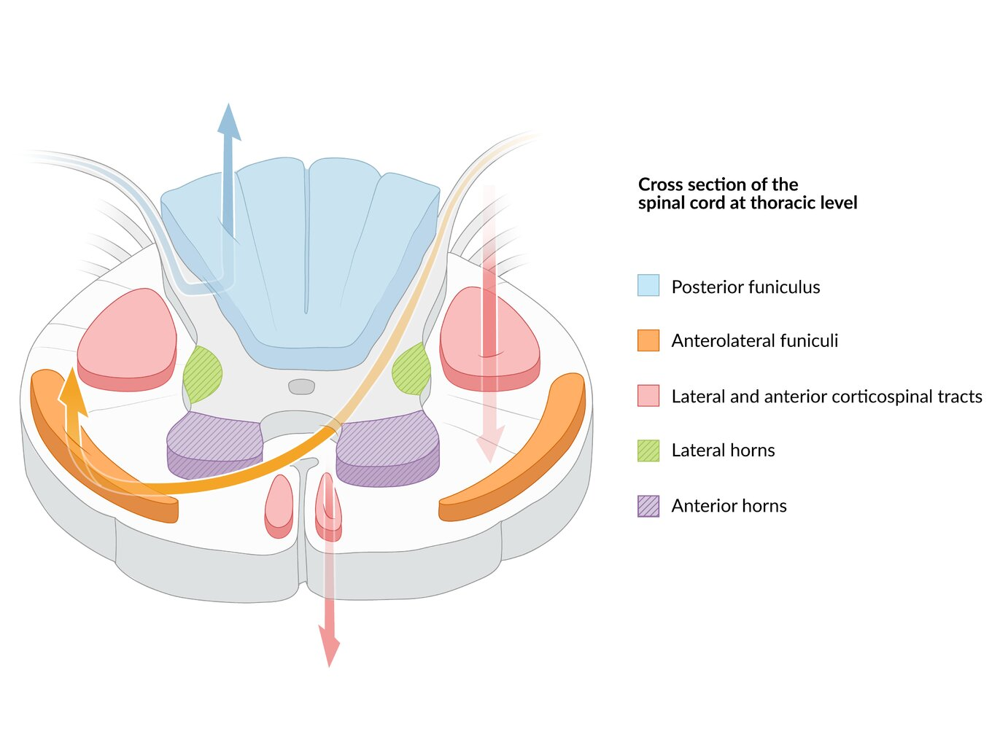
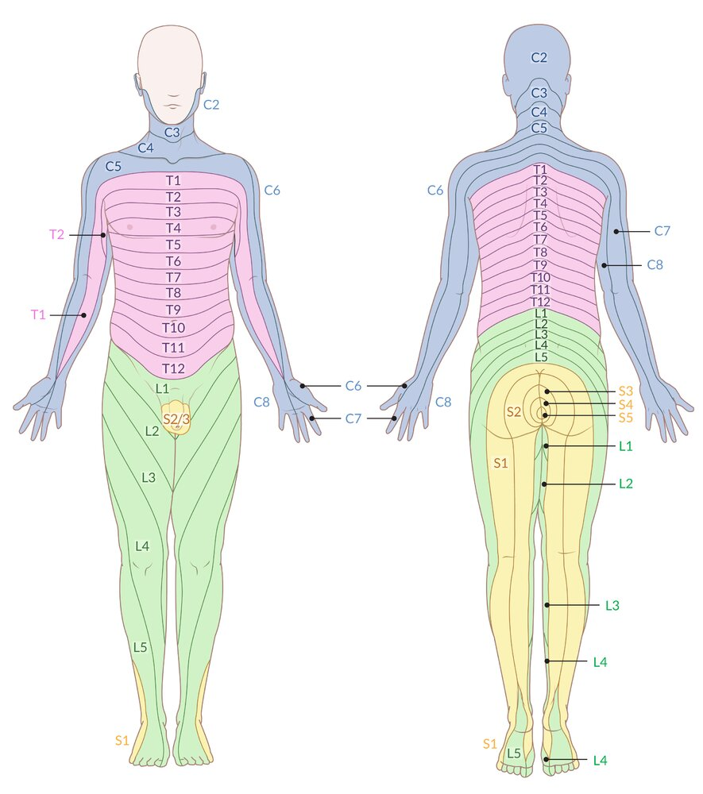
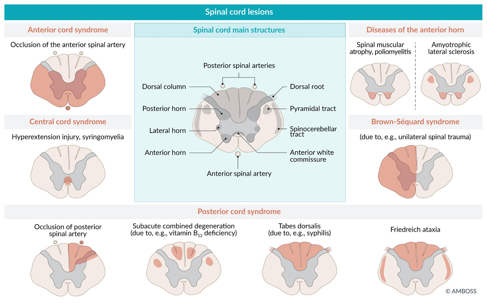
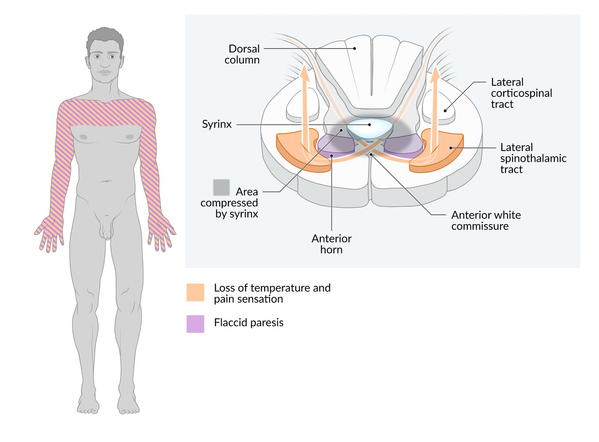
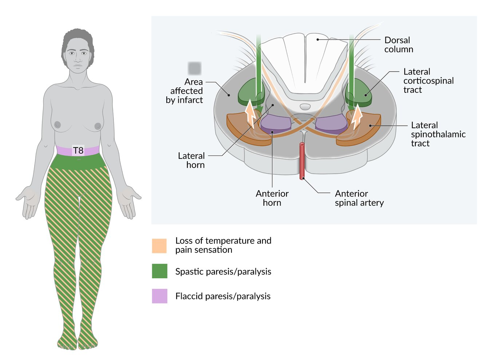
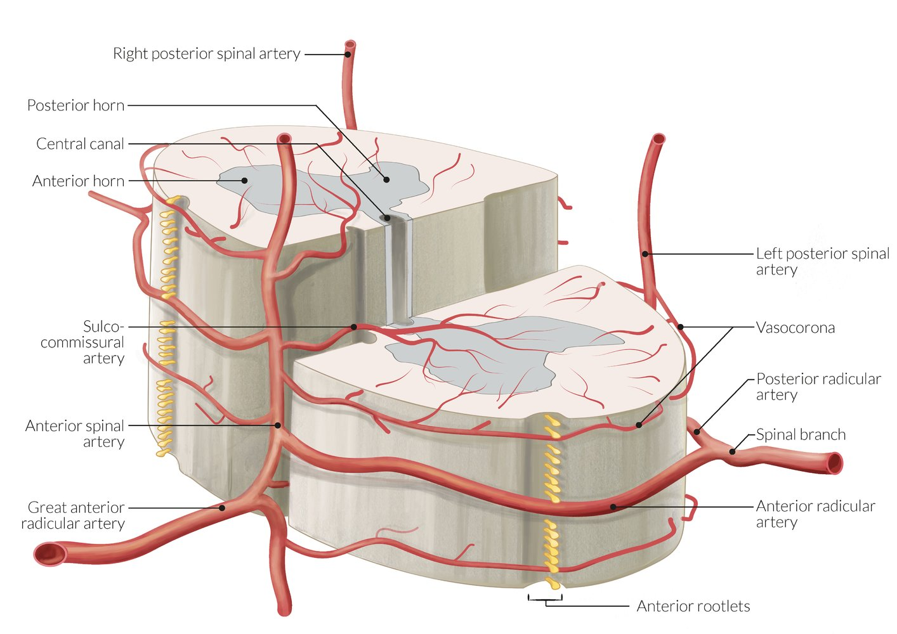
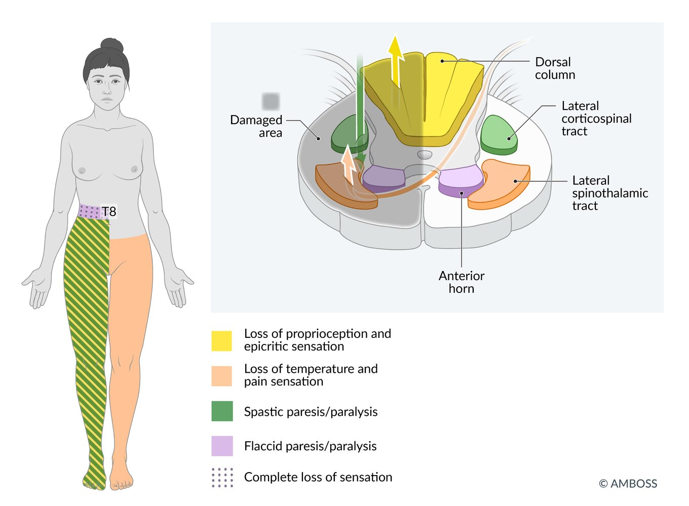
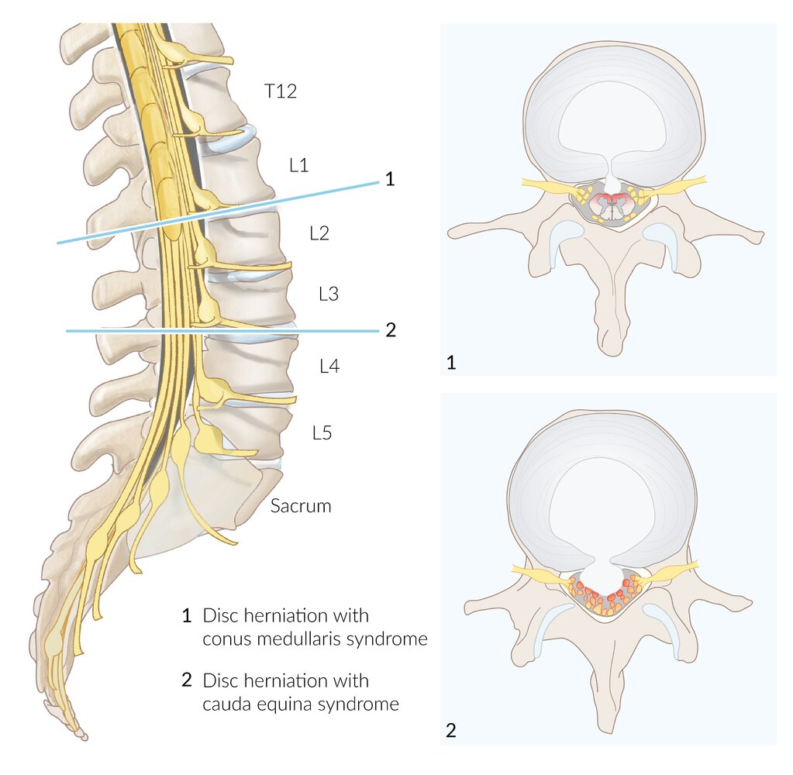
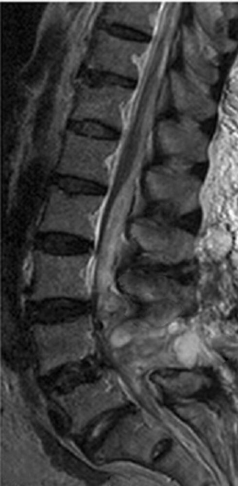

# Incomplete spinal cord syndromes

*Categories: Clinical knowledge > Neurology > Spinal cord disorders > Incomplete spinal cord syndromes*

[Original Article Link](https://coursology-qbank.com/amboss/article/NR0-Mf)

---

## Summary

Incomplete spinal cord syndromes are caused by lesions of the ascending or descending <u>spinal tracts</u> that result from trauma, spinal compression, or occlusion of spinal <u>arteries</u>. <u>Central cord syndrome</u> is the most common type; other examples include <u>anterior cord syndrome</u>, <u>posterior cord syndrome</u>, <u>Brown-Séquard syndrome</u>, <u>cauda equina syndrome</u>, and <u>conus medullaris syndrome</u>. In contrast to <u>complete spinal cord injuries</u>, lesions only affect part of the cord, and affected individuals present with <u>dissociated sensory loss</u>. Clinical features depend on the affected sensory and <u>motor pathways</u> in the spinal cord. <u>MRI</u> of the <u>spine</u> is the diagnostic modality of choice to assess the level, extent, and underlying cause of the lesion, which determine the treatment. In some patients, <u>surgery</u> may be necessary to treat the underlying cause and improve outcome.

For more information, see “<u>Treatment of spinal cord injuries</u>.”

For more information on <u>cauda equina syndrome</u> and <u>conus medullaris syndrome</u>, see “<u>Compressive spinal emergencies</u>.”

---

## Overview

### Basic neuroanatomy and function

* <u>Lateral</u> and <u>anterior corticospinal tracts</u>

* Descending tracts that originate in the <u>cerebral cortex</u> and extend to the <u>alpha motor neuron</u> in the <u>ventral horn</u> of the spinal cord

* About 90% of pyramidal nerve fibers <u>decussate</u> as they pass through the medulla and descend further, forming the <u>lateral corticospinal tract</u>.

* The remaining 10% comprise the <u>anterior corticospinal tract</u> and <u>decussate</u> at the segmental level.

* Function: controls <u>motor function</u>

* <u>Dorsal column</u>

* Neuronal fibers <u>decussate</u> at the <u>medulla oblongata</u>.

* Remains <u>ipsilateral</u> in the spinal cord

* Function: conveys <u>epicritic sensation</u> and <u>proprioception</u>

* <u>Spinothalamic tract</u>

* Neuronal fibers <u>decussate</u> only at the segmental level or shortly above.

* Function: conveys <u>protopathic sensation</u>

* For more information, see ''<u>Spinal cord tracts</u>.''

Cross section of the spinal cord

Dermatome map

### Overview of incomplete spinal cord syndromes

| Types of incomplete spinal cord syndromes |  |  |  |
| --- | --- | --- | --- |
| Syndrome | Affected <u>spinal tracts</u> | Etiology |  Clinical features* |
|  <u>Central cord syndrome</u> (most common) |  * Bilateral central <u>corticospinal tracts</u> and <u>lateral</u> <u>spinothalamic tracts</u>   |   * Hyperextension injury (e.g., <u>whiplash injury</u> with chronic cervical <u>spondylosis</u>)  * <u>Syringomyelia</u>  * <u>Spinal cord compression</u>    |  * Bilateral <u>paresis</u>: upper > lower extremities   |
|  <u>Anterior cord syndrome</u>    |  * <u>Corticospinal tracts</u> and <u>spinothalamic tracts</u>   |   * Trauma (e.g., <u>burst fracture</u> of <u>vertebra</u>, penetrating injury)  * Occlusion of <u>anterior spinal artery</u>    |  * Bilateral motor <u>paralysis</u>, loss of <u>pain</u> and <u>temperature sensation</u>, and <u>autonomic dysfunction</u> below the level of the lesion   |
| <u>Posterior cord syndrome</u> |  * <u>Posterior columns</u>   |   * Trauma (e.g., penetrating injury)  * Occlusion of the <u>posterior spinal artery</u>  * <u>Multiple sclerosis</u>    |  * Bilateral loss of <u>proprioception</u>, vibration, and touch sensation below the level of the lesion [[1]](https://coursology-qbank.com/amboss/article/XOX9Iy)   |
|  <u>Brown-Séquard syndrome</u> (hemisection syndrome)   |  * Hemisection of the cord   |   * Trauma (e.g., penetrating injury)  * <u>Spinal cord compression</u>    |   * <u>Ipsilateral</u>  * Loss of <u>proprioception</u>, vibration, and tactile discrimination below the level of the lesion  * Segmental <u>flaccid paresis</u> at the level of the lesion  * <u>Spastic paresis</u> below the level of the lesion and <u>Babinski sign</u>  * <u>Horner syndrome</u> in lesions above T1  * <u>Contralateral</u>: loss of <u>pain</u> and <u>temperature sensation</u> one or two levels below the lesion    |
| <u>Conus medullaris syndrome</u> |  * <u>Conus medullaris</u>   |  * Damage (e.g., trauma) to the spinal cord segments T12–L2   |   * Sudden, bilateral  * Symmetrical, flaccid <u>muscle weakness</u> of lower limbs, possibly <u>fasciculations</u>  * <u>Lower back pain</u>  * <u>Hyperreflexia</u>  * Absence of <u>Achilles reflex</u>  * Symmetrical, bilateral perianal numbness  * Sensory dissociation  * <u>Bladder</u> and <u>fecal incontinence</u>  * For more information, see “<u>Compressive spinal emergencies</u>.”    |
| <u>Cauda equina syndrome</u> |  * <u>Cauda equina</u>   |  * Damage (e.g., trauma) to or compression (e.g., <u>disk herniation</u>) of the <u>cauda equina</u> and nerve fibers of L2 and below   |   * Unilateral, asymmetrical  * <u>LMN damage</u>: flaccid <u>muscle weakness</u> and muscle <u>atrophy</u> of the leg  * Severe <u>radicular pain</u>  * <u>Hyporeflexia</u>  * Absent <u>knee jerk reflex</u> and <u>ankle jerk reflex</u>  * <u>Saddle anesthesia</u>  * Loss of anal and <u>bladder</u> sphincter control  * For more information, see “<u>Compressive spinal emergencies</u>.”    |
| *All syndromes manifest with dissociated sensory loss, a pattern of selective sensory loss (dissociation of modalities), which suggests a focal lesion of a single tract within the spinal cord or <u>brainstem</u>. [[2]](https://coursology-qbank.com/amboss/article/C70qLh) |  |  |  |

Spinal cord lesions

Syringomyelia with lesion at C5-T2

Anterior spinal artery syndrome at T8 level

Arterial supply of a spinal segment

Brown-Séquard syndrome

Conus medullaris and cauda equina syndromes

Spinal epidural hematoma

---

## Central cord syndrome

* Definition: a syndrome caused by injury to the central region of the spinal cord, which includes the central <u>corticospinal tracts</u> and decussating fibers of the <u>lateral</u> <u>spinothalamic tract</u>

* <u>Epidemiology</u> [[3]](https://coursology-qbank.com/amboss/article/bOXHIy)

* Most common type of incomplete cord syndrome

* More common in individuals > 50 years old because of age-related degeneration of the <u>cervical spine</u>

* Etiology

* Hyperextension injury (e.g., <u>whiplash injury</u> with chronic cervical <u>spondylosis</u>)

* Cervical <u>spondylosis</u>

* Degenerative <u>spine</u> disease

* Traumatic <u>disk herniation</u>

* <u>Syringomyelia</u>

* Clinical features

* Bilateral motor <u>paresis</u> (upper > lower extremities; distally > proximally)

* Loss of <u>bladder</u> control

* Variable sensory impairment

* Burning <u>pain</u> in the arms

* Loss of <u>pain</u> and <u>temperature sensation</u> in the arms

* <u>Sacral sparing</u>

* Diagnostics

* CT or <u>x-ray</u> of the <u>spine</u>: findings of cervical <u>spondylosis</u>, <u>spinal canal stenosis</u>, or <u>vertebral fractures</u>

* <u>MRI</u> of the <u>spine</u>: diagnostic modality of choice for evaluating spinal cord pathology

* Treatment: See “<u>Treatment of spinal cord injuries</u>.”

Syringomyelia with lesion at C5-T2

---

## Anterior cord syndrome

* Definition: a syndrome caused by injury to the <u>anterior</u> two-thirds of the spinal cord [[4]](https://coursology-qbank.com/amboss/article/Seayyj)

* <u>Epidemiology</u>

* Approx. 5% of incomplete spinal cord syndromes [[5]](https://coursology-qbank.com/amboss/article/cHWa650)

* Approx. 6% of acute <u>myelopathies</u> [[6]](https://coursology-qbank.com/amboss/article/8IWOe50)

* Most common type of spinal cord <u>infarction</u> [[7]](https://coursology-qbank.com/amboss/article/NwW-Qn0)

* Etiology [[8]](https://coursology-qbank.com/amboss/article/2eaTyj)

* <u>Anterior spinal artery syndrome</u> (∼ 95% of cases): reduced blood flow or occlusion of the <u>anterior spinal artery</u> (<u>ASA</u>)

* Systemic <u>hypoperfusion</u> (e.g., <u>heart failure</u>)

* <u>Iatrogenic</u> injury (e.g., during aortic <u>surgery</u>, spinal <u>angiography</u>, or <u>spinal anesthesia</u>)

* Aortic repairs may result in lesions of the artery of Adamkiewicz: a thoracic radicular <u>artery</u> (branch of the intercostal vasculature) that supplies the lower two-thirds of the spinal cord.

* The midthoracic region of the <u>ASA</u> is a <u>watershed area</u> because the <u>artery of Adamkiewicz</u> is the only major vessel that supplies the spinal cord below spinal level T8/T9. [[9]](https://coursology-qbank.com/amboss/article/geaFyj)

* Trauma;  (e.g., <u>burst fracture</u>, penetrating injury, and hyperflexion injury with <u>vertebral instability</u>)  [[8]](https://coursology-qbank.com/amboss/article/2eaTyj)

* <u>Arteriosclerosis</u>, <u>vasculitis</u> (e.g., due to <u>diabetes</u>)

* <u>Thrombosis</u>, embolic occlusion

* <u>Aortic dissection</u>, <u>aneurysm</u>

* Severe <u>hypotension</u> (e.g., following hemorrhage)

* Pathological compression (e.g., tumors, cervical <u>spondylosis</u>)

* Clinical features 

* Acute (within hours)

* Back or <u>chest pain</u>

* Bilateral loss of temperature and <u>pain</u> sensation below the level of the lesion due to damage of the <u>spinothalamic tracts</u>

* <u>Lower motor neuron</u> deficits (<u>flaccid paralysis</u>) at the level of and below the lesion

* <u>Autonomic dysfunction</u> (<u>spastic bladder</u>, <u>neurogenic bowel</u>, <u>erectile dysfunction</u>, <u>orthostatic hypotension</u>)

* Absent <u>bulbocavernosus reflex</u>

* Late (within days or weeks)

* <u>Upper motor neuron</u> dysfunction (<u>spastic paraparesis</u> or quadriparesis) below the level of the lesion due to damage to the <u>corticospinal tracts</u>

* <u>Lower motor neuron</u> deficits (<u>flaccid paralysis</u>) at the level of the lesion due to damage to the <u>anterior horn</u>

* Continued sensory and <u>autonomic dysfunction</u>

* <u>Hyperreflexia</u>

* Diagnostics
* <u>MRI</u> of the <u>spine</u> (diagnostic modality of choice)

* Findings: spinal cord <u>parenchyma</u> abnormalities (e.g., <u>infarction</u>) in the <u>anterior</u> part of the spinal cord

* Excludes <u>soft tissue</u> lesions (e.g., tumors, <u>hematomas</u>) and vascular <u>malformations</u>

* Treatment: See “<u>Treatment of spinal cord injuries</u>.”

> [!NOTE]
> Vibration and <u>proprioception</u> are typically spared because of an intact <u>dorsal column</u>.

Anterior spinal artery syndrome at T8 level

---

## Posterior cord syndrome

* Definition: a syndrome caused by injury to the <u>posterior</u> spinal cord affecting the <u>dorsal columns</u> (bilateral loss of <u>fine touch</u>, vibration, pressure, and <u>proprioception</u> below the level of the lesion). In larger lesions, the <u>lateral corticospinal tracts</u> (CSTs) and autonomic tracts may be affected.

* <u>Epidemiology</u>: very rare [[6]](https://coursology-qbank.com/amboss/article/8IWOe50)

* Etiology [[1]](https://coursology-qbank.com/amboss/article/XOX9Iy)

* Occlusion of the <u>posterior spinal artery</u>

* <u>Subacute combined degeneration</u>

* <u>Multiple sclerosis</u>

* <u>Tabes dorsalis</u>

* <u>Friedreich ataxia</u>

* Clinical features [[1]](https://coursology-qbank.com/amboss/article/XOX9Iy)

* Bilateral loss of vibration, <u>fine touch</u>, and proprioceptive sensation below the level of the lesion

* Frequent falls

* <u>Sensory ataxia</u>, <u>positive Romberg</u> sign

* <u>Muscle weakness</u> and subsequent <u>spasticity</u>

* <u>Autonomic dysfunction</u> (<u>spastic bladder</u>, <u>neurogenic bowel</u>, <u>erectile dysfunction</u>, <u>orthostatic hypotension</u>)

* Diagnostics

* <u>MRI</u> of the <u>spine</u>: findings consistent with underlying cause (e.g., <u>infarction</u> of the <u>dorsal columns</u> in <u>posterior spinal artery</u> occlusion, <u>demyelinating</u> <u>plaques</u> in MS)

* <u>VDRL</u> or <u>RPR</u> if <u>syphilis</u> is suspected

* Treatment: See “<u>Treatment of spinal cord injuries</u>.”

Arterial supply of a spinal segment

---

## Brown-Séquard syndrome

* Definition: : a syndrome involving hemisection of the spinal cord (often in the cervical cord)

* <u>Epidemiology</u>: approx. 1–4% of all traumatic SCIs [[5]](https://coursology-qbank.com/amboss/article/cHWa650)

* Etiology [[10]](https://coursology-qbank.com/amboss/article/hIWcc50)[[11]](https://coursology-qbank.com/amboss/article/cOXary)

* Unilateral compression or trauma of the spinal cord (e.g., <u>penetrating injuries</u>, <u>motor vehicle crashes</u>, <u>crush injuries</u>)

* Less commonly: <u>disk herniations</u>, <u>spinal epidural hematomas</u>, <u>spinal epidural abscesses</u>, spinal tumors, <u>multiple sclerosis</u>, complication of <u>decompression sickness</u>

* Clinical features  

* <u>Ipsilateral</u>

* Loss of all sensation at the level of the lesion

* Segmental <u>flaccid paralysis</u> at the level of the lesion due to damage of <u>lower motor neurons</u>

* Loss of <u>proprioception</u>, vibration, and tactile discrimination (<u>fine touch</u>) below the level of the lesion due to an interrupted <u>dorsal column</u>

* <u>Spastic paresis</u> and <u>Babinski sign</u> below the level of the lesion due to damage of <u>upper motor neuron</u> <u>axons</u> in the <u>lateral corticospinal tracts</u>

* In lesions above T1, <u>Horner syndrome</u> occurs because of damage to <u>ipsilateral</u> <u>sympathetic</u> fibers (oculosympathetic pathway).

* <u>Contralateral</u>: loss of <u>pain</u>, temperature, and nondiscriminative touch (crude touch) one or two levels below the level of the lesion due to an interrupted <u>spinothalamic tract</u>

* Diagnostics

* <u>Clinical diagnosis</u>

* Imaging studies can help identify the underlying pathology.

* CT of the <u>spine</u>: for bone abnormalities, <u>vertebral fractures</u>, trauma

* <u>MRI</u> of the <u>spine</u>

* Diagnostic modality of choice for spinal cord pathology

* Findings: unilateral abnormal signal in the spinal cord at the level of the lesion, surrounding injuries of <u>soft tissues</u> or <u>ligaments</u> (e.g., <u>epidural hematoma</u>)

* Treatment: See “<u>Treatment of spinal cord injuries</u>.”

> [!NOTE]
> Autonomic symptoms are usually absent in <u>Brown-Séquard syndrome</u> because of unilateral involvement of the descending autonomic fibers.

Brown-Séquard syndrome

---