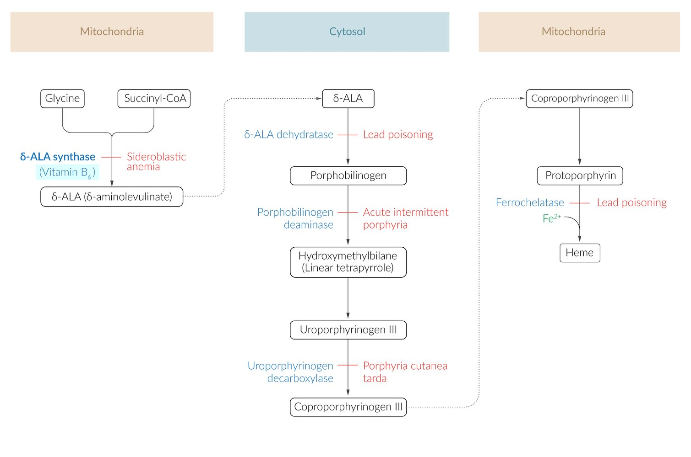
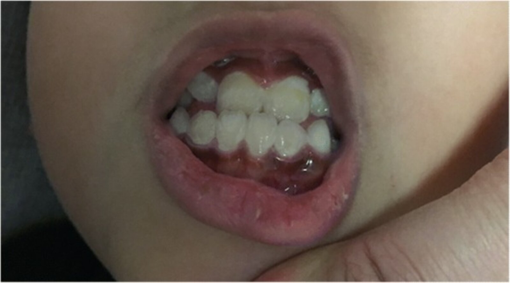

# Lead poisoning

*Categories: Clinical knowledge > Neurology > Toxic and metabolic disorders > Lead poisoning*

[Original Article Link](https://coursology-qbank.com/amboss/article/dI0obh)

---

## Summary

Lead <u>poisoning</u> results from the accumulation of lead in the body, which is toxic to multiple organ systems. Children are particularly susceptible to lead <u>poisoning</u> and may develop lasting neurodevelopmental impairments. Common <u>sources of lead exposure</u> include lead-based paint in older homes and occupational contact. While often asymptomatic, lead <u>poisoning</u> can manifest with cognitive impairment, <u>myalgia</u>, abdominal <u>pain</u>, and, in severe cases, <u>encephalopathy</u> or <u>coma</u>. Elevated venous blood lead levels (BLLs) confirm the diagnosis. Supportive diagnostics include <u>laboratory studies</u> such as a <u>CBC</u> and <u>peripheral blood smear</u>, which may show <u>anemia</u> and <u>basophilic stippling</u>. There is no known safe BLL, and intervention should be initiated as soon as lead is detected. Management focuses on <u>measures to minimize lead exposure</u> and, in severe cases, <u>lead chelation therapy</u>. Prevention through <u>public health</u> measures and screening of at-risk populations is crucial to avoid the irreversible health effects of lead exposure.

---

## Etiology

### Routes of exposure [[1]](https://coursology-qbank.com/amboss/article/VsdGFr0)[[2]](https://coursology-qbank.com/amboss/article/AN1Rdh0)

* Ingestion (more common in children)

* Inhalation (more common in adults)

### Sources of lead exposure [[1]](https://coursology-qbank.com/amboss/article/VsdGFr0)[[3]](https://coursology-qbank.com/amboss/article/Y11n2f0)[[4]](https://coursology-qbank.com/amboss/article/l-dvxs0)[[5]](https://coursology-qbank.com/amboss/article/1D12WQ0)

* Drinking water (e.g., leached from lead plumbing)  [[5]](https://coursology-qbank.com/amboss/article/1D12WQ0)[[6]](https://coursology-qbank.com/amboss/article/dsdoFr0)

* Lead-based paint (common source in children), e.g., from:

* Living in or regularly visiting buildings built before 1978 (especially if paint is damaged or peeling and during renovations)

* Antique or imported toys

* Food sources [[1]](https://coursology-qbank.com/amboss/article/VsdGFr0)[[5]](https://coursology-qbank.com/amboss/article/1D12WQ0)

* Using lead-containing kitchenware to prepare, store, or consume food (e.g., glazed ceramics, leaded crystal)

* Lead-containing dyes (e.g., in imported candy)

* Unregulated or home-distilled spirits (moonshine)

* Game killed with lead ammunition

* Traditional medicines (e.g., herbal medicine, ayurvedic medicine)

* Cosmetics and jewelry [[6]](https://coursology-qbank.com/amboss/article/dsdoFr0)

* Direct or secondary <u>occupational exposure</u> (e.g., from battery manufacturing, metallurgy, construction) [[7]](https://coursology-qbank.com/amboss/article/qMWCpN0)[[8]](https://coursology-qbank.com/amboss/article/cbVasG0)

* Contaminated soil (e.g., near roads, older homes, or airports)

* Aircraft emissions (e.g., living near an airport)

---

## Pathophysiology

* Inhibition of <u>aminolevulinate dehydratase</u> and <u>ferrochelatase</u> → disruption of <u>heme synthesis</u> → ↑ <u>protoporphyrin</u> and ↑ aminolevulinic acid in <u>RBCs</u>  [[3]](https://coursology-qbank.com/amboss/article/Y11n2f0)

* Inhibition of <u>heme synthesis</u> → <u>microcytic</u>, <u>hypochromic</u>, or normochromic <u>anemia</u> [[1]](https://coursology-qbank.com/amboss/article/VsdGFr0)

* Inhibition of the breakdown of <u>ribosomal RNA</u> → precipitation of <u>ribosomes</u> and <u>ribosomal RNA</u> in the <u>cytoplasm</u> of <u>erythrocytes</u> → <u>basophilic stippling</u> [[9]](https://coursology-qbank.com/amboss/article/rvdfYH0)

Heme synthesis and corresponding diseases

---

## Clinical features

Acute and chronic lead <u>poisoning</u> manifest similarly in both children and adults. [[1]](https://coursology-qbank.com/amboss/article/VsdGFr0)[[2]](https://coursology-qbank.com/amboss/article/AN1Rdh0)[[3]](https://coursology-qbank.com/amboss/article/Y11n2f0)

* Mild lead <u>poisoning</u> 

* Fatigue, <u>lethargy</u>

* Cognitive impairment

* Irritability

* Additional findings in children: <u>hearing</u> and growth impairment, <u>delayed puberty</u>

* Moderate lead <u>poisoning</u> 

* Neurological 

* <u>Headache</u>, <u>memory</u> loss, <u>insomnia</u>

* <u>Peripheral neuropathy</u> (due to <u>demyelination</u> of <u>peripheral nerves</u>)

* GI: abdominal <u>pain</u>, <u>constipation</u>, metallic <u>taste</u>, <u>anorexia</u>, <u>nausea</u>, <u>vomiting</u>

* Musculoskeletal: <u>myalgias</u>, <u>arthralgias</u>, <u>gout</u>

* Severe lead <u>poisoning</u> 

* Neurological 

* <u>Encephalopathy</u>, <u>seizures</u>, <u>coma</u>, <u>signs of increased intracranial pressure</u>

* <u>Peripheral neuropathy</u>, particularly in the <u>radial nerve</u> (causing <u>wrist drop</u>) and the <u>peroneal nerve</u> (causing <u>foot drop</u>)

* Renal: nephropathy

* GI: abdominal colic, <u>vomiting</u>

> [!NOTE]
> Patients with lead <u>poisoning</u> and poor dental hygiene may develop a purple-blue line on the <u>gums</u> (i.e., <u>Burton line</u>). [[1]](https://coursology-qbank.com/amboss/article/VsdGFr0)

> [!NOTE]
> ABCDEFGH: Anemia, Basophilic stippling, Constipation, Demyelination, Encephalopathy, Foot drop, Gum deposition/Growth restriction/Gout, Hyperuricemia/Hypertension

Burton line

---

## Diagnosis

See also “<u>Diagnostics for the poisoned patient</u>.”

### Approach [[1]](https://coursology-qbank.com/amboss/article/VsdGFr0)[[2]](https://coursology-qbank.com/amboss/article/AN1Rdh0)[[3]](https://coursology-qbank.com/amboss/article/Y11n2f0)

* Obtain a venous BLL in:

* Symptomatic individuals with known lead exposure

* Asymptomatic individuals as part of <u>lead screening</u>  [[10]](https://coursology-qbank.com/amboss/article/eo1xa30)[[4]](https://coursology-qbank.com/amboss/article/l-dvxs0)

* Venous BLL ≥ 3.5 mcg/dL is considered elevated.  [[4]](https://coursology-qbank.com/amboss/article/l-dvxs0)[[11]](https://coursology-qbank.com/amboss/article/HGdK070)

* Consider additional <u>laboratory studies</u> and imaging to identify:

* Complications of lead exposure (e.g., <u>anemia</u>, <u>chronic kidney disease</u>) [[12]](https://coursology-qbank.com/amboss/article/O-dIxs0)

* <u>Sources of lead exposure</u> (e.g., ingested objects, bullets)

### Blood lead screening [[4]](https://coursology-qbank.com/amboss/article/l-dvxs0)[[12]](https://coursology-qbank.com/amboss/article/O-dIxs0)[[13]](https://coursology-qbank.com/amboss/article/zYYr7n)

* Indications

* All adults and children with potential exposure to <u>sources of lead</u>

* On arrival to the US for:  [[6]](https://coursology-qbank.com/amboss/article/dsdoFr0)[[14]](https://coursology-qbank.com/amboss/article/o-d0ys0)

* Refugees who are ≤16 years of age, pregnant, or lactating

* Children with recent immigration or international adoption

* Children with any of the following should be screened both at 1 and 2 years of age (or between 2 and 6 years of age if not previously screened):[[4]](https://coursology-qbank.com/amboss/article/l-dvxs0)

* <u>Medicaid</u> enrollment

* Residence in a community with a high or unknown <u>risk of lead exposure</u>  [[5]](https://coursology-qbank.com/amboss/article/1D12WQ0)

* Modality [[4]](https://coursology-qbank.com/amboss/article/l-dvxs0) 

* <u>Capillary</u> or venous BLL  [[15]](https://coursology-qbank.com/amboss/article/D0V1RG0)

* If BLL is elevated on <u>capillary</u> blood sample testing, repeat the study with a venous blood sample.  [[4]](https://coursology-qbank.com/amboss/article/l-dvxs0)[[7]](https://coursology-qbank.com/amboss/article/qMWCpN0)[[15]](https://coursology-qbank.com/amboss/article/D0V1RG0)

* Follow-up of positive lead screen

* Nonpregnant adults and children: See "<u>Management of lead exposure in asymptomatic individuals</u>."

* Pregnant and lactating individuals: See "<u>Lead poisoning in pregnant and lactating individuals</u>."

### Ancillary <u>laboratory studies</u>

* <u>CBC</u>: <u>microcytic</u>, <u>hypochromic</u>, or normochromic <u>anemia</u> [[2]](https://coursology-qbank.com/amboss/article/AN1Rdh0)

* <u>Peripheral blood smear</u>: <u>basophilic stippling</u> of <u>erythrocytes</u>  [[2]](https://coursology-qbank.com/amboss/article/AN1Rdh0)

* <u>BMP</u>

* <u>LFTs</u>

* <u>Urinalysis</u>

### Imaging studies

* <u>Abdominal x-ray</u>: Consider for individuals with BLL ≥ 20 mcg/dL to assess for ingested lead-containing objects (e.g., paint chips). [[4]](https://coursology-qbank.com/amboss/article/l-dvxs0)

* Wrist or knee <u>x-rays</u>: may show dense metaphyseal bands (<u>lead lines</u>)

* <u>X-rays</u> to assess for retained bullets or shrapnel

> [!WARNING]
> Avoid performing <u>lumbar punctures</u> in patients with suspected lead <u>encephalopathy</u> because of the risk of <u>cerebral herniation</u>. [[3]](https://coursology-qbank.com/amboss/article/Y11n2f0)

---

## Management

### Approach to lead <u>poisoning</u> [[1]](https://coursology-qbank.com/amboss/article/VsdGFr0)[[4]](https://coursology-qbank.com/amboss/article/l-dvxs0)

* Symptomatic individuals with acute exposure

* Provide initial management of acute lead exposure, including <u>lead chelation therapy</u>.

* Admit to hospital for ongoing management.

* Asymptomatic individuals with elevated BLL on screening

* Determine the need for hospitalization and <u>lead chelation therapy</u> based on BLL.

* See "<u>Management of lead exposure in asymptomatic individuals</u>" for details.

> [!TIP]
> Lead <u>poisoning</u> is a nationally <u>notifiable disease</u> in the US. Notify local public and/or occupational health departments if a case is confirmed.

### Lead chelation therapy [[3]](https://coursology-qbank.com/amboss/article/Y11n2f0)

Use <u>body surface area-based dosing</u>.

#### Adults

* <u>Encephalopathy</u> and/or BLL > 100 mcg/dL

* <u>Dimercaprol</u> (<u>off-label</u>) DOSAGE

* PLUS <u>edetate calcium disodium</u> DOSAGE 4 hours after initiating <u>dimercaprol</u> [[3]](https://coursology-qbank.com/amboss/article/Y11n2f0)

* Symptomatic and/or BLL 70–100 mcg/dL: <u>succimer</u> (<u>off-label</u>) DOSAGE [[3]](https://coursology-qbank.com/amboss/article/Y11n2f0)

* Asymptomatic and BLL < 70 mcg/dL: <u>Chelation therapy</u> is usually not indicated.

#### Children

* <u>Encephalopathy</u>

* <u>Dimercaprol</u> (<u>off-label</u>) DOSAGE

* PLUS <u>edetate calcium disodium</u> DOSAGE 4 hours after initiating <u>dimercaprol</u> [[3]](https://coursology-qbank.com/amboss/article/Y11n2f0)

* Symptomatic and/or BLL ≥ 70 mcg/dL

* <u>Dimercaprol</u> (<u>off-label</u>) DOSAGE

* PLUS <u>edetate calcium disodium</u> DOSAGE 4 hours after initiating <u>dimercaprol</u> [[3]](https://coursology-qbank.com/amboss/article/Y11n2f0)

* Asymptomatic and BLL 45–69 mcg/dL

* <u>Succimer</u> DOSAGE [[3]](https://coursology-qbank.com/amboss/article/Y11n2f0)

* OR <u>edetate calcium disodium</u> DOSAGE

* Asymptomatic and BLL < 45 mcg/dL: <u>Chelation therapy</u> is usually not indicated.

> [!WARNING]
> <u>Dimercaprol</u> is no longer manufactured. Consult local poison control or the health department for guidance on alternative treatments (e.g., monotherapy with <u>succimer</u>, use of expired <u>dimercaprol</u>).

Body Surface Area Based Dosing

---