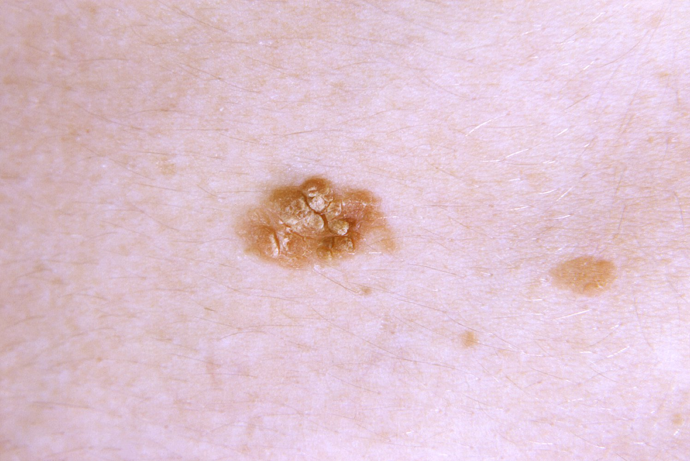

# Metal poisoning

*Categories: Clinical knowledge > Neurology > Toxic and metabolic disorders > Metal poisoning*

[Original Article Link](https://coursology-qbank.com/amboss/article/AQ0RAf)

---

## Summary

Metal <u>poisoning</u> is caused by exposure to metals such as <u>arsenic</u>, lead, and <u>mercury</u>. Clinical features vary based on the metal and quantity and duration of exposure. <u>Clinical diagnosis</u> is made in symptomatic patients following exposure and confirmed with elevated metal levels in the serum or <u>24-hour urine collections</u>. Treatment focuses on <u>chelation therapy</u> and managing acute and chronic complications of metal <u>poisoning</u>.

---

## Overview

### Chelating agents [[1]](https://coursology-qbank.com/amboss/article/Y11n2f0)

* Definition: substances that bind to metal ions in the body, facilitating their excretion

* Examples

* <u>Dimercaprol</u>: <u>arsenic</u>, lead, <u>mercury</u>, gold

* <u>Succimer</u>: <u>arsenic</u>, lead, <u>mercury</u>

* <u>Penicillamine</u>: gold, <u>copper</u>

* <u>Deferoxamine</u>, deferasirox, deferiprone: <u>iron</u>

* <u>Edetate calcium disodium</u>: lead

* <u>Trientine</u>: <u>copper</u>

### Overview

|  Overview of metal poisoning [[2]](https://coursology-qbank.com/amboss/article/EaY8mn)[[3]](https://coursology-qbank.com/amboss/article/vaYAmn)[[4]](https://coursology-qbank.com/amboss/article/DaY15n)[[5]](https://coursology-qbank.com/amboss/article/3QYSDK)  |  |  |  |  |
| --- | --- | --- | --- | --- |
|  | Clinical features | Pathophysiology | Diagnosis | Treatment |
| <u>Arsenic</u> |   * Acute  * <u>Nausea</u>, <u>vomiting</u>, abdominal <u>pain</u>  * Garlic‑like odor on the breath  * <u>QT prolongation</u>  * Chronic  * Peripheral <u>polyneuropathy</u>  * <u>Hyperkeratosis</u>  * <u>Mees lines</u>: white bands across the <u>nails</u>    |  * Induction of oxidative <u>stress</u> in <u>endothelial</u> cells and disruption of <u>ATP</u> production   |  * <u>Arsenic</u> studies in <u>24-hour urine collection</u>   |   * <u>Dimercaprol</u>  * <u>Succimer</u>    |
| Lead |   * Varies by blood lead level (BLL)  * Neurological  * Cognitive impairment  * <u>Encephalopathy</u>  * <u>Peripheral neuropathy</u> (e.g., <u>wrist drop</u>, <u>foot drop</u>)  * GI  * Abdominal colic  * Purple-blue line on the <u>gums</u> (<u>lead line</u> or Burton line)  * Hematologic  * <u>Anemia</u>  * <u>Basophilic stippling</u> of <u>erythrocytes</u>  * Renal: nephropathy    |  * Inhibition of <u>delta-aminolevulinic acid dehydratase</u> → disruption of <u>heme synthesis</u>   |  * BLL   |   * <u>Dimercaprol</u>  * <u>Edetate calcium disodium</u>  * <u>Succimer</u>  * See also “<u>Initial management of lead poisoning</u>.”    |
| <u>Iron</u> |   * <u>Nausea</u>, <u>vomiting</u>, <u>diarrhea</u>  * <u>GI bleeding</u> (e.g., <u>hematemesis</u>, <u>hematochezia</u>)  * <u>Renal failure</u>  * <u>Liver</u> failure    |  * <u>Free radical formation</u> and lipid peroxidation → disruption of <u>oxidative phosphorylation</u> and <u>mitochondrial</u> function → <u>cellular death</u>   |  * <u>Serum iron</u> concentration   |   * <u>GI decontamination</u>  * <u>Iron chelation therapy</u>, e.g., <u>deferoxamine</u>  * For chronic <u>iron poisoning</u>, see “<u>Hemochromatosis</u>.”    |
| <u>Mercury</u> |   * Elemental <u>mercury</u>  * Acute: <u>cough</u>, <u>dyspnea</u>, <u>respiratory distress</u>  * Chronic: <u>erethism</u>, <u>gingivostomatitis</u>  * Inorganic <u>mercury</u>: hemorrhagic <u>gastroenteritis</u>, <u>shock</u>, <u>acute tubular necrosis</u>  * Organic <u>mercury</u>: delayed neurological symptoms (e.g., <u>ataxia</u>, <u>tremor</u>)    |  * <u>Irreversible inhibition</u> of selenoenzymes → ↓ antioxidant activity → ↑ oxidative damage [[6]](https://coursology-qbank.com/amboss/article/rHYf7q)   |   * All: blood <u>mercury</u> concentration  * Non-organic: <u>mercury</u> concentration in <u>24-hour urine collection</u>    |   * <u>Dimercaprol</u>  * <u>Succimer</u>  * See ”<u>Mercury poisoning</u>” for details.    |
| <u>Chromium</u> |   * <u>Contact dermatitis</u>  * <u>Allergic asthma</u>  * Hemorrhagic <u>gastroenteritis</u>  * <u>Ulcerations</u> of the <u>nasal septum</u>  * <u>Welder's lung</u>  * <u>Lung cancer</u>    |  * Hexavalent <u>chromium</u> compounds → crossing into <u>the cell</u> membrane → reduction to trivalent <u>chromium</u> compounds → <u>intracellular accumulation</u>   |  * Detectable in blood and urine   |   * Stop exposure.  * Clean contaminated <u>skin</u> with running water.    |
| Gold |   * <u>Hypersensitivity reaction</u>  * <u>Pruritus</u>  * Dermatitis  * Metallic <u>taste</u>  * <u>Nephrotoxicity</u>    |  * Gold nanoparticles form <u>reactive oxygen species</u> → oxidative damage [[7]](https://coursology-qbank.com/amboss/article/HHYK7q)   |  * Clinical   |   * <u>Penicillamine</u>  * <u>Dimercaprol</u>  * Discontinue gold therapy.    |
| <u>Copper</u> |   * Gastrointestinal symptoms  * Abdominal <u>pain</u>  * <u>Diarrhea</u>  * <u>Vomiting</u>  * <u>Altered level of consciousness</u>  * <u>Headache</u>  * <u>Coma</u>  * Complications  * <u>Liver</u> failure  * <u>Renal failure</u>  * <u>Intravascular hemolysis</u>  * <u>Death</u> [[8]](https://coursology-qbank.com/amboss/article/JlXsBy)    |  * Catalyzes formation of <u>reactive oxygen species</u> → oxidative damage (via <u>redox reactions</u>) [[9]](https://coursology-qbank.com/amboss/article/7HY47q)   |  * Detectable in blood and urine [[8]](https://coursology-qbank.com/amboss/article/JlXsBy)   |   * <u>Penicillamine</u> [[8]](https://coursology-qbank.com/amboss/article/JlXsBy)  * <u>Trientine</u>    |

---

## Arsenic poisoning

### Etiology [[1]](https://coursology-qbank.com/amboss/article/Y11n2f0)[[10]](https://coursology-qbank.com/amboss/article/AN1Rdh0)

* <u>Occupational exposure</u>, e.g.:

* Metal smelting

* Semiconductor production

* Coal combustion

* Pesticides, herbicides

* Environmental exposure, e.g.:

* Contaminated drinking water

* <u>Chemotherapeutic agents</u>

* <u>Alternative medicines</u>

* Unregulated or home-distilled spirits (moonshine)

### Pathophysiology [[1]](https://coursology-qbank.com/amboss/article/Y11n2f0)

* Induces oxidative <u>stress</u> and disrupts <u>ATP</u> production

* Directly affects <u>endothelial</u> cells

### Clinical features [[1]](https://coursology-qbank.com/amboss/article/Y11n2f0)[[10]](https://coursology-qbank.com/amboss/article/AN1Rdh0)[[11]](https://coursology-qbank.com/amboss/article/IHdY7r0)

#### Acute <u>arsenic poisoning</u>

Acute <u>arsenic poisoning</u> initially manifests with gastrointestinal symptoms before progressing to <u>multisystem organ failure</u>.

* Early symptoms (within minutes to hours)

* <u>Nausea and vomiting</u>

* <u>Watery diarrhea</u>

* Abdominal <u>pain</u>

* Garlic-like odor on the breath

* Late symptoms (within hours to days)

* Neurological: <u>coma</u>, <u>seizures</u>, <u>headache</u>, <u>delirium</u>, <u>encephalopathy</u>

* Cardiovascular: <u>tachycardia</u>, <u>myocardial</u> dysfunction, <u>third space volume loss</u>

* Respiratory: <u>respiratory failure</u>, <u>ARDS</u>

* Renal: <u>acute kidney injury</u>

* GI: <u>GI bleeding</u>, <u>hepatitis</u>, <u>pancreatitis</u>, <u>jaundice</u>

> [!WARNING]
> Acute <u>arsenic poisoning</u> may be misdiagnosed as <u>gastroenteritis</u>, <u>sepsis</u>, or <u>myocardial infarction</u>. [[1]](https://coursology-qbank.com/amboss/article/Y11n2f0)[[10]](https://coursology-qbank.com/amboss/article/AN1Rdh0)

#### Chronic <u>arsenic poisoning</u> [[1]](https://coursology-qbank.com/amboss/article/Y11n2f0)[[12]](https://coursology-qbank.com/amboss/article/qHdCrr0)

* Neurological: peripheral <u>polyneuropathy</u>, <u>encephalopathy</u>

* Dermatologic

* <u>Hyperpigmentation</u> and/or <u>hypopigmentation</u>

* <u>Hyperkeratoses</u> (typically on the palms and soles)

* <u>Skin</u> cancer (e.g., <u>basal cell carcinoma</u>, <u>squamous cell carcinoma</u> )

* Mees lines: white bands across the <u>nails</u>

* <u>Carcinogenic</u> (e.g., increased risk of <u>lung cancer</u>, <u>bladder cancer</u>, <u>renal cancer</u>, <u>liver cancer</u>)

Arsenical keratosis after long-term exposure to arsenic

Squamous cell carcinoma in situ due to chronic arsenic exposure

Mees lines

### Diagnosis [[1]](https://coursology-qbank.com/amboss/article/Y11n2f0)[[10]](https://coursology-qbank.com/amboss/article/AN1Rdh0)[[11]](https://coursology-qbank.com/amboss/article/IHdY7r0)[[12]](https://coursology-qbank.com/amboss/article/qHdCrr0)

Acute <u>arsenic poisoning</u> is a <u>clinical diagnosis</u> in symptomatic patients with known <u>arsenic</u> exposure, later confirmed by <u>24-hour urine collection</u>. See also “<u>Diagnostics for the poisoned patient</u>.”

#### <u>Arsenic</u> studies [[1]](https://coursology-qbank.com/amboss/article/Y11n2f0)[[12]](https://coursology-qbank.com/amboss/article/qHdCrr0)

* Confirmatory study: <u>24-hour urine collection</u>

* Findings: positive for any of the following

* <u>Arsenic</u>: ≥ 50 mcg/L urine

* <u>Arsenic</u>: ≥ 50 mcg/g <u>creatinine</u>

* Total <u>arsenic</u>: ≥ 100 mcg

* Alternative studies: may be useful in the acute setting, but not diagnostic

* <u>Spot urine</u> <u>arsenic</u> concentration

* Blood <u>arsenic</u> concentration

#### Ancillary studies [[1]](https://coursology-qbank.com/amboss/article/Y11n2f0)[[10]](https://coursology-qbank.com/amboss/article/AN1Rdh0)

* <u>Laboratory studies</u>: <u>CBC</u>, <u>BMP</u>, <u>LFTs</u>, UA

* <u>ECG</u> findings

* Morphology changes: <u>wide QRS</u>, <u>QT prolongation</u>, <u>ST depressions</u>, <u>T-wave flattening</u>

* <u>Arrhythmias</u>: <u>PVCs</u>, <u>nonsustained VT</u>, <u>torsade de pointes</u>

### Management of <u>arsenic poisoning</u> [[1]](https://coursology-qbank.com/amboss/article/Y11n2f0)[[10]](https://coursology-qbank.com/amboss/article/AN1Rdh0)[[11]](https://coursology-qbank.com/amboss/article/IHdY7r0)

#### Acute <u>arsenic poisoning</u> [[1]](https://coursology-qbank.com/amboss/article/Y11n2f0)[[10]](https://coursology-qbank.com/amboss/article/AN1Rdh0)[[11]](https://coursology-qbank.com/amboss/article/IHdY7r0)

* Perform the <u>ABCDE approach in poisoning</u> and initiate stabilization as needed.

* Call the local Poison Control Center: In the US, the Poison Help line is 1-800-222-1222.

* Consider <u>GI decontamination</u> in consultation with a toxicologist.

* Administer <u>arsenic</u> <u>chelation therapy</u>.

* Preferred: <u>dimercaprol</u> (<u>off-label</u>) DOSAGE  [[1]](https://coursology-qbank.com/amboss/article/Y11n2f0)

* Alternative: <u>succimer</u> (<u>off-label</u>) DOSAGE [[1]](https://coursology-qbank.com/amboss/article/Y11n2f0)

* <u>Replete electrolytes</u> as needed.

* Monitor <u>volume status</u>: Aim to maintain <u>euvolemia</u>.

* Admit to the <u>ICU</u>.

#### Chronic <u>arsenic poisoning</u> [[1]](https://coursology-qbank.com/amboss/article/Y11n2f0)[[10]](https://coursology-qbank.com/amboss/article/AN1Rdh0)

* Confirm chronic <u>arsenic poisoning</u> with <u>24-hour urine collection</u>.

* Symptomatic patients: Administer <u>arsenic</u> <u>chelation therapy</u> with <u>succimer</u>. DOSAGE [[1]](https://coursology-qbank.com/amboss/article/Y11n2f0)

* Prevent ongoing <u>arsenic</u> exposure by identifying and removing the source.

* Refer patients to occupational medicine.

---

## Acute iron poisoning

For chronic <u>iron poisoning</u>, see “<u>Hemochromatosis</u>.”

### Etiology [[10]](https://coursology-qbank.com/amboss/article/AN1Rdh0)[[13]](https://coursology-qbank.com/amboss/article/Fsdg9r0)

* Common sources: ingestion of <u>iron</u>-containing products (e.g., prenatal <u>vitamins</u>)

* Effects of elemental <u>iron</u>  [[10]](https://coursology-qbank.com/amboss/article/AN1Rdh0)[[13]](https://coursology-qbank.com/amboss/article/Fsdg9r0)

* < 20 mg/kg elemental <u>iron</u>: usually no symptoms

* 20–60 mg/kg elemental <u>iron</u>: mild to moderate symptoms

* > 60 mg/kg elemental <u>iron</u>: severe symptoms

### <u>Epidemiology</u> [[13]](https://coursology-qbank.com/amboss/article/Fsdg9r0)

* Children: unintentional ingestion

* <u>Adolescents</u> and adults: intentional ingestion (e.g., <u>suicide attempt</u>) [[13]](https://coursology-qbank.com/amboss/article/Fsdg9r0)

### Pathophysiology [[10]](https://coursology-qbank.com/amboss/article/AN1Rdh0)

* Caustic injury to <u>GI tract</u>

* <u>Free radical formation</u> → lipid peroxidation → <u>cell membrane</u> injury

* Disruption of <u>oxidative phosphorylation</u> and <u>mitochondrial</u> function

### Clinical features [[1]](https://coursology-qbank.com/amboss/article/Y11n2f0)[[10]](https://coursology-qbank.com/amboss/article/AN1Rdh0)[[13]](https://coursology-qbank.com/amboss/article/Fsdg9r0)

Features are commonly divided into five phases based on time since ingestion; timing varies by patient and <u>poisoning</u> severity.

* Gastrointestinal phase (6 hours)

* <u>Nausea</u>, <u>vomiting</u>, <u>diarrhea</u>

* <u>GI bleeding</u> (e.g., <u>hematemesis</u>, <u>hematochezia</u>)

* Latent phase (6–24 hours)

* GI symptoms resolve.

* <u>Tachycardia</u>

* <u>Metabolic acidosis</u>

* <u>Lethargy</u>

* Systemic phase (12–24 hours)

* GI symptoms return.

* <u>Metabolic acidosis</u>

* <u>Coagulopathy</u>

* <u>Hypovolemia</u>, <u>vasodilation</u>, reduced <u>cardiac output</u>

* <u>Renal failure</u>

* <u>Lethargy</u>, <u>coma</u>, <u>seizures</u>

* Hepatic phase (2–5 days)

* <u>Liver</u> failure

* <u>Coagulopathy</u>

* Obstructive phase (2–8 weeks)

* GI obstruction (e.g., <u>gastric outlet obstruction</u>, <u>SBO</u>)

* GI strictures (e.g., <u>colonic strictures</u>)

> [!TIP]
> Patients who are asymptomatic > 6 hours after ingestion are unlikely to develop acute <u>iron poisoning</u>. [[1]](https://coursology-qbank.com/amboss/article/Y11n2f0)[[10]](https://coursology-qbank.com/amboss/article/AN1Rdh0)[[13]](https://coursology-qbank.com/amboss/article/Fsdg9r0)

### Diagnostics [[1]](https://coursology-qbank.com/amboss/article/Y11n2f0)[[10]](https://coursology-qbank.com/amboss/article/AN1Rdh0)[[13]](https://coursology-qbank.com/amboss/article/Fsdg9r0)

<u>Iron poisoning</u> is a <u>clinical diagnosis</u> in symptomatic patients with known <u>iron</u> exposure. See also “<u>Diagnostics for the poisoned patient</u>.”

* Confirmatory study: peak <u>serum iron</u> concentration [[10]](https://coursology-qbank.com/amboss/article/AN1Rdh0)

* Obtain at presentation, 3–5 hours after ingestion, and 6–8 hours after ingestion.

* Peak <u>serum iron</u> concentration correlates with symptom severity. [[1]](https://coursology-qbank.com/amboss/article/Y11n2f0)

* < 300 mcg/dL: minimal symptoms

* 300–500 mcg/dL: moderate symptoms

* > 500 mcg/dL: severe symptoms

* Ancillary studies: <u>CBC</u>, <u>BMP</u>, <u>blood gas analysis</u>, <u>lactate</u>, <u>LFTs</u>, <u>coagulation studies</u> [[1]](https://coursology-qbank.com/amboss/article/Y11n2f0)

* <u>Abdominal x-ray</u>: to evaluate for <u>radiopaque</u> pills

* <u>Radiopacity</u> varies by formulation (e.g., liquid and chewable formulations are generally not <u>radiopaque</u>).

* The absence of <u>radiopacity</u> does not rule out significant <u>iron</u> ingestion.

### Classification [[1]](https://coursology-qbank.com/amboss/article/Y11n2f0)[[10]](https://coursology-qbank.com/amboss/article/AN1Rdh0)[[13]](https://coursology-qbank.com/amboss/article/Fsdg9r0)

* Mild to moderate <u>iron poisoning</u> 

* Mild to moderate symptoms

* AND/OR 20–60 mg/kg elemental <u>iron</u> ingestion

* Severe acute <u>iron poisoning</u>

* <u>Signs of shock</u> (e.g., <u>hypotension</u>)

* Repetitive <u>vomiting</u>

* <u>Lethargy</u> or <u>coma</u>

* <u>High anion gap metabolic acidosis</u>

* Estimated ingestion of > 60 mg/kg elemental <u>iron</u>

* Peak <u>serum iron</u> concentration > 500 mcg/dL

### Management [[1]](https://coursology-qbank.com/amboss/article/Y11n2f0)[[10]](https://coursology-qbank.com/amboss/article/AN1Rdh0)[[13]](https://coursology-qbank.com/amboss/article/Fsdg9r0)

* All patients: Call the local Poison Control Center: In the US, the Poison Help line is 1-800-222-1222.

* Severe acute <u>iron poisoning</u> [[1]](https://coursology-qbank.com/amboss/article/Y11n2f0)[[10]](https://coursology-qbank.com/amboss/article/AN1Rdh0)[[13]](https://coursology-qbank.com/amboss/article/Fsdg9r0)

* Perform the <u>ABCDE approach in poisoning</u> and initiate stabilization as needed.

* Perform <u>GI decontamination</u> with <u>whole bowel irrigation</u>.  [[10]](https://coursology-qbank.com/amboss/article/AN1Rdh0)

* Iron chelation therapy: Administer <u>deferoxamine</u>. DOSAGE [[1]](https://coursology-qbank.com/amboss/article/Y11n2f0)[[10]](https://coursology-qbank.com/amboss/article/AN1Rdh0)

* Admit to the <u>ICU</u>.

* Mild to moderate <u>poisoning</u>: inpatient admission and <u>supportive care</u>

* Asymptomatic patients: observation for 6 hours

---

## Mercury poisoning

### Elemental <u>mercury poisoning</u> [[1]](https://coursology-qbank.com/amboss/article/Y11n2f0)[[10]](https://coursology-qbank.com/amboss/article/AN1Rdh0)

* Routes of exposure

* Inhalation of volatilized <u>mercury</u> vapor

* Ingestion or subcutaneous injection of <u>mercury</u>

* Common sources

* Elemental <u>mercury</u>-containing devices (e.g., thermometers, fluorescent light bulbs)

* Industrial uses (e.g., paint, jewelry, ceramics, photography)

* Clinical features

* Acute exposure

* Respiratory: <u>cough</u>, <u>dyspnea</u>, <u>shortness of breath</u>, <u>respiratory distress</u>

* GI: <u>nausea</u>, <u>vomiting</u>, <u>diarrhea</u>, metallic <u>taste</u>

* Neurological: <u>headaches</u>, visual disturbance

* Constitutional: <u>fever</u>, chills, <u>weakness</u>

* Chronic exposure

* Neurological: erethism, <u>tremor</u>, <u>insomnia</u>

* GI: <u>gingivostomatitis</u>, loose <u>teeth</u>, <u>ptyalism</u>

* Dermatologic: acrodynia

* Diagnosis: <u>clinical diagnosis</u> in symptomatic patients with known <u>mercury</u> exposure [[1]](https://coursology-qbank.com/amboss/article/Y11n2f0)[[10]](https://coursology-qbank.com/amboss/article/AN1Rdh0)

* Confirmatory studies

* Blood <u>mercury</u> concentration > 35 mcg/L [[10]](https://coursology-qbank.com/amboss/article/AN1Rdh0)

* OR 24-hour urine <u>mercury</u> concentration > 150 mcg/L [[10]](https://coursology-qbank.com/amboss/article/AN1Rdh0)

* <u>X-ray</u>: <u>radiopaque</u> elemental <u>mercury</u>

* Management [[1]](https://coursology-qbank.com/amboss/article/Y11n2f0)[[10]](https://coursology-qbank.com/amboss/article/AN1Rdh0)

* Perform the <u>ABCDE approach in poisoning</u> and initiate stabilization as needed.

* Call the local Poison Control Center: In the US, the Poison Help line is 1-800-222-1222.

* Inhaled <u>mercury</u>: Consider <u>postural drainage</u> and/or <u>endotracheal suctioning</u>.

* Injected <u>mercury</u>: Consult <u>surgery</u> for possible <u>debridement</u>.

* Administer <u>mercury</u> <u>chelation therapy</u>.

* Tolerating PO: <u>succimer</u> (<u>off-label</u>) DOSAGE [[1]](https://coursology-qbank.com/amboss/article/Y11n2f0)

* Unable to tolerate PO: <u>dimercaprol</u> (<u>off-label</u>) DOSAGE  [[1]](https://coursology-qbank.com/amboss/article/Y11n2f0)

* Disposition [[10]](https://coursology-qbank.com/amboss/article/AN1Rdh0)

* <u>Signs of airway compromise</u> and/or <u>hemodynamic instability</u>: <u>ICU</u>

* Symptomatic patients: hospital admission

* Asymptomatic patients: outpatient management

### Inorganic <u>mercury poisoning</u> [[1]](https://coursology-qbank.com/amboss/article/Y11n2f0)[[10]](https://coursology-qbank.com/amboss/article/AN1Rdh0)

* Route of exposure: ingestion of inorganic <u>mercury</u> salts (e.g., HgCl)

* Common sources

* Industrial uses (e.g., batteries, explosives, fireworks, <u>vinyl chloride</u> production)

* Medicinal uses (e.g., <u>antiseptics</u>, <u>laxatives</u>)

* Clinical features [[1]](https://coursology-qbank.com/amboss/article/Y11n2f0)[[10]](https://coursology-qbank.com/amboss/article/AN1Rdh0)

* GI: <u>nausea</u>, <u>vomiting</u>, <u>diarrhea</u>, abdominal <u>pain</u>, hemorrhagic <u>gastroenteritis</u>

* Cardiovascular: <u>third space volume loss</u>, <u>shock</u>

* Renal: <u>acute tubular necrosis</u> (e.g., <u>oliguria</u>, <u>anuria</u>)

* Diagnosis: <u>clinical diagnosis</u> in symptomatic patients with known <u>mercury</u> exposure [[1]](https://coursology-qbank.com/amboss/article/Y11n2f0)[[10]](https://coursology-qbank.com/amboss/article/AN1Rdh0)

* Confirmatory studies

* Blood <u>mercury</u> concentration > 35 mcg/L [[10]](https://coursology-qbank.com/amboss/article/AN1Rdh0)

* OR 24-hour urine <u>mercury</u> concentration > 150 mcg/L [[10]](https://coursology-qbank.com/amboss/article/AN1Rdh0)

* See also “<u>Diagnostics for acute kidney injury</u>” and “<u>Initial evaluation of GI bleeding</u>.”

* Management [[1]](https://coursology-qbank.com/amboss/article/Y11n2f0)[[10]](https://coursology-qbank.com/amboss/article/AN1Rdh0)

* Perform the <u>ABCDE approach in poisoning</u> and initiate stabilization as needed.

* Call the local Poison Control Center: In the US, the Poison Help line is 1-800-222-1222.

* Begin <u>management of GI bleeding</u>.

* Begin <u>management of acute kidney injury</u>.

* Administer <u>mercury</u> <u>chelation therapy</u>.

* Tolerating PO: <u>succimer</u> (<u>off-label</u>) DOSAGE [[1]](https://coursology-qbank.com/amboss/article/Y11n2f0)

* Unable to tolerate PO: <u>dimercaprol</u> (<u>off-label</u>) DOSAGE  [[1]](https://coursology-qbank.com/amboss/article/Y11n2f0)

* Disposition [[10]](https://coursology-qbank.com/amboss/article/AN1Rdh0)

* <u>Signs of airway compromise</u> and/or <u>hemodynamic instability</u>: <u>ICU</u>

* Symptomatic patients: hospital admission

* Asymptomatic patients: outpatient management

### Organic mercury poisoning [[1]](https://coursology-qbank.com/amboss/article/Y11n2f0)[[10]](https://coursology-qbank.com/amboss/article/AN1Rdh0)[[14]](https://coursology-qbank.com/amboss/article/zydr3s0)[[15]](https://coursology-qbank.com/amboss/article/-ydD3s0)

* Route of exposure: ingestion of organic <u>mercury</u> compounds (e.g., methylmercury)

* Common sources

* Seafood (most common)

* Industrial uses (e.g., wood preservatives, embalming)

* Clinical features: predominantly delayed neurological symptoms, e.g.,

* <u>Ataxia</u>

* Movement disorders, e.g., <u>tremor</u>, <u>myoclonus</u>

* Sensory disturbances, e.g., <u>glove and stocking pattern</u> <u>paresthesias</u>

* Visual, auditory, olfactory, and gustatory disturbances

* <u>Dysarthria</u>

* <u>Hyperreflexia</u>

* Psychiatric disturbances

* Diagnosis: <u>clinical diagnosis</u> in symptomatic patients with known <u>mercury</u> exposure [[1]](https://coursology-qbank.com/amboss/article/Y11n2f0)[[10]](https://coursology-qbank.com/amboss/article/AN1Rdh0)

* Confirmatory study: blood <u>mercury</u> concentration > 35 mcg/L [[10]](https://coursology-qbank.com/amboss/article/AN1Rdh0)

* Urine studies are not useful, as organic <u>mercury</u> is eliminated via the fecal route.

* Management

* Perform the <u>ABCDE approach in poisoning</u> and initiate stabilization as needed.

* Call the local Poison Control Center: In the US, the Poison Help line is 1-800-222-1222.

* There are no effective treatments.

* Disposition [[10]](https://coursology-qbank.com/amboss/article/AN1Rdh0)

* Neurological symptoms: hospital admission

* Asymptomatic patients: outpatient management with dietary counseling

* Complications

* Persistent neurological symptoms

* <u>Teratogen</u> [[16]](https://coursology-qbank.com/amboss/article/ZbYZHn)

> [!TIP]
> Urine studies are not useful, as organic <u>mercury</u> is eliminated via the fecal route. [[1]](https://coursology-qbank.com/amboss/article/Y11n2f0)

> [!WARNING]
> <u>Dimercaprol</u> is contraindicated in <u>organic mercury poisoning</u>, as it may increase <u>mercury</u> transportation across the <u>blood-brain barrier</u>. [[1]](https://coursology-qbank.com/amboss/article/Y11n2f0)[[10]](https://coursology-qbank.com/amboss/article/AN1Rdh0)[[17]](https://coursology-qbank.com/amboss/article/iGdJ_r0)

---

## Chromium poisoning

* Sources of exposure: galvanization (chrome plating), paint and glass manufacturing, tanning leather, building materials (<u>potassium</u> dichromate in cement can lead to “cement <u>eczema</u>,” which is an <u>occupational hazard</u> among construction workers)

* Pathophysiology: hexavalent <u>chromium</u> compounds → crossing into <u>the cell</u> membrane → reduction to trivalent <u>chromium</u> compounds → <u>intracellular accumulation</u>

* Clinical features [[21]](https://coursology-qbank.com/amboss/article/cc1aYf0)

* Acute toxicity

* <u>Contact dermatitis</u>

* <u>Allergic asthma</u>

* Hemorrhagic <u>gastroenteritis</u>

* Chronic toxicity

* <u>Ulceration</u> of the <u>nasal septum</u> from contact with contaminated fingers → risk of perforation

* <u>Lung cancer</u>

* <u>Welder's lung</u>

* Diagnostics: urine or blood

* Treatment [[21]](https://coursology-qbank.com/amboss/article/cc1aYf0)

* Stop exposure.

* Clean contaminated <u>skin</u> with running water.

---

## Gold poisoning

* Source of exposure [[24]](https://coursology-qbank.com/amboss/article/ElX8Ay)[[25]](https://coursology-qbank.com/amboss/article/bNXH-y)[[26]](https://coursology-qbank.com/amboss/article/ONXIYA)

* Chrysotherapy

* Gold nanoparticles for diagnosis (e.g., <u>antibody</u> sensing) and therapy (e.g., cancer treatment)

* Clinical features

* Typical

* <u>Pruritus</u>

* Dermatitis

* <u>Stomatitis</u>

* Metallic <u>taste</u>

* Severe cases

* Vasomotor reaction: <u>nausea</u>, flushing, <u>hypotension</u> including <u>syncope</u>, sweating, and <u>weakness</u>

* Renal: <u>proteinuria</u>

* Hematologic: <u>thrombocytopenia</u>, <u>neutropenia</u>, and <u>aplastic anemia</u>

* Gastrointestinal: <u>diarrhea</u> and enterocolitis

* Diagnostics: <u>laboratory studies</u>

* <u>CBC</u>: decreased <u>WBCs</u>, decreased <u>platelet count</u>

* <u>LFTs</u>: decreased <u>transaminases</u>

* <u>Renal function tests</u>: increased <u>creatinine</u>, increased <u>urea</u>, increased <u>uric acid</u>

* <u>Urinalysis</u>: <u>proteinuria</u>, <u>hematuria</u>

* Treatment: discontinuation of gold therapy

* Complications

* Renal: <u>membranous glomerulonephritis</u>

* Cardiovascular: <u>myocardial infarction</u>, <u>stroke</u>

---

## Copper poisoning

* Source of exposure [[8]](https://coursology-qbank.com/amboss/article/JlXsBy)

* Genetic: <u>Wilson disease</u>

* External

* Uncoated <u>copper</u> cookware heated with acidic food

* Contaminated water

* <u>Copper</u>-containing creams for burn healing

* <u>Suicide attempts</u> (via i.v. <u>copper</u> sulfate injection)

* Clinical features

* Gastrointestinal: abdominal <u>pain</u>, <u>diarrhea</u>, or <u>vomiting</u> (early symptoms)

* Hepatic: <u>jaundice</u>

* <u>Altered mental status</u>: <u>encephalopathy</u>, <u>coma</u>

* Diagnostics [[27]](https://coursology-qbank.com/amboss/article/rlXfyy)

* <u>Laboratory studies</u>: increased serum <u>copper</u>, <u>ceruloplasmin</u>

* <u>Urinalysis</u>: increased <u>copper</u> excretion

* Treatment [[8]](https://coursology-qbank.com/amboss/article/JlXsBy)

* Early stage: <u>zinc</u>

* <u>Chelating agents</u>: <u>penicillamine</u>, <u>trientine</u>

* Complications

* <u>Liver</u> failure

* <u>Heart failure</u>

* <u>Kidney failure</u>

* <u>Intravascular hemolysis</u>

* <u>Death</u>

---