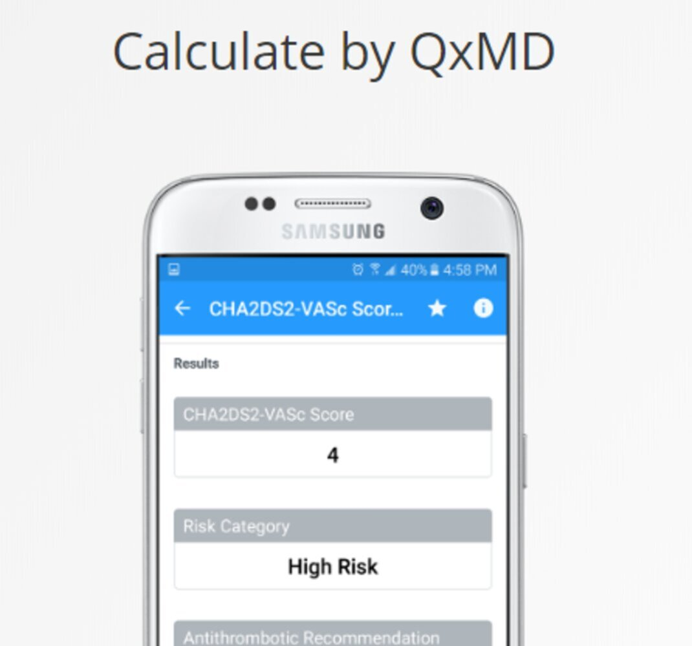
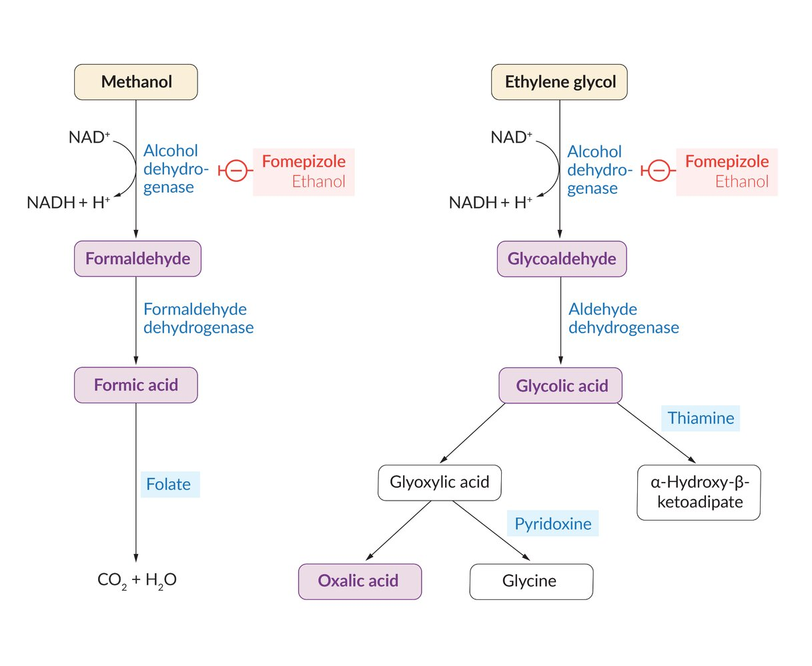

# Toxic alcohol poisoning

*Categories: Clinical knowledge > Neurology > Toxic and metabolic disorders > Toxic alcohol poisoning*

[Original Article Link](https://coursology-qbank.com/amboss/article/KF0UQ3)

---

## Summary

<u>Toxic alcohol</u> <u>poisoning</u> is a potentially life-threatening condition caused by the ingestion of <u>toxic alcohols</u>, which are either themselves toxic (e.g., <u>isopropyl alcohol</u>) or have toxic metabolites (e.g., <u>methanol</u>, <u>ethylene glycol</u>). Clinical features are generally nonspecific and include <u>altered mental status</u>, <u>nausea</u>, <u>vomiting</u>, <u>tachypnea</u>, and <u>tachycardia</u>. In particular, <u>methanol poisoning</u> is associated with ophthalmologic pathologies (e.g., blurred <u>vision</u>, blindness), while <u>ethylene glycol poisoning</u> is associated with renal pathologies (e.g., <u>hematuria</u>, flank <u>pain</u>). While <u>toxic alcohol</u> <u>poisoning</u> may be definitively diagnosed with serum <u>toxic alcohol</u> levels, these tests are generally not readily available. It is most often a <u>clinical diagnosis</u>, which may be supported by laboratory findings. An elevated <u>osmolar gap</u> with an <u>anion gap metabolic acidosis</u> suggests <u>methanol</u> or <u>ethylene glycol poisoning</u>. Management of <u>methanol</u> and <u>ethylene glycol poisoning</u> involves treatment with <u>fomepizole</u>, with severe cases requiring <u>hemodialysis</u>. Patients often require admission for further monitoring and treatment.

See also “<u>Alcohol intoxication</u>.”

---

## Management

### Approach

* All patients: Provide <u>general management of toxic alcohol poisoning</u>.

* <u>Methanol</u> or <u>ethylene glycol poisoning</u>

* <u>Antidote</u>: Administer <u>alcohol dehydrogenase inhibitors</u> (e.g., <u>fomepizole</u>).

* <u>Enhanced elimination</u>

* Normalize <u>pH</u> with <u>sodium bicarbonate</u>.

* Consider a nephrology consultation for <u>hemodialysis</u>.

* <u>Isopropyl alcohol</u> <u>poisoning</u>

* <u>Antidote</u> and <u>enhanced elimination</u>: not routinely required

* <u>Supportive care</u>: Monitor for <u>symptoms of GI bleeding</u> and <u>hypotension</u>.

### General management of toxic alcohol poisoning

* Follow the <u>ABCDE approach in poisoning</u>.

* Call poison control; the US National Poison Help line is 1-800-222-1222.

* Obtain <u>laboratory studies</u>.

* Routine: <u>BMP</u>, <u>ABG</u>, <u>serum osmolality</u>, <u>urinalysis</u>, serum ethanol

* Confirmatory: <u>methanol</u>, <u>ethylene glycol</u>, and <u>isopropyl alcohol</u> levels

* Calculate <u>anion gap</u>  and <u>osmolar gap</u> .

* Identify and treat toxic co-ingestions (e.g., <u>acetaminophen poisoning</u>, <u>ethanol intoxication</u>).

* Consider <u>treatment of alcohol use disorder</u>.

* Consult <u>psychiatry</u> if there has been a self-harm attempt.

> [!TIP]
> Elevated <u>osmolar gap</u> is classically an early feature of <u>toxic alcohol</u> ingestion. As <u>methanol</u> and <u>ethylene glycol</u> are metabolized, the <u>osmolar gap</u> decreases and a <u>high anion gap metabolic acidosis</u> (<u>HAGMA</u>) develops. <u>Isopropyl alcohol</u> <u>poisoning</u> does not cause <u>HAGMA</u>.

Anion Gap

Osmolar gap

### Alcohol dehydrogenase inhibitors [[3]](https://coursology-qbank.com/amboss/article/qNWCXN0)[[4]](https://coursology-qbank.com/amboss/article/INWYcN0)

* Goal: to prevent the conversion of <u>methanol</u> or <u>ethylene glycol</u> to toxic metabolites (e.g., formic acid, glycolic acid, oxalic acid) by competitively inhibiting <u>alcohol dehydrogenase</u>

* Indications

* Clinical suspicion of <u>methanol</u> or <u>ethylene glycol</u> ingestion AND two of the following:

* Arterial <u>pH</u> < 7.3

* Serum <u>bicarbonate</u> < 20 mEq/L

* <u>Osmolar gap</u> > 10 mOsm/L

* Presence of urinary oxalate crystals

* History of <u>methanol</u> or <u>ethylene glycol</u> ingestion AND <u>osmolar gap</u> > 10 mOsm/L

* Serum <u>methanol</u> ≥ 20 mg/dL or <u>ethylene glycol</u> concentration ≥ 20 mg/dL

* Options

* Fomepizole (first-line) DOSAGE: a competitive <u>alcohol dehydrogenase</u> inhibitor; safer and easier to administer than ethanol

* Ethanol (second-line)  [[5]](https://coursology-qbank.com/amboss/article/AN1Rdh0)

* Duration: Continue treatment until <u>ethylene glycol</u> < 20 mg/dL or <u>methanol</u> concentrations < 20 mg/dL.

> [!NOTE]
> FOMEpizole: For Overdosing on Methanol or Ethylene glycol!

Methanol and ethylene glycol metabolism

### Normalize <u>pH</u> [[3]](https://coursology-qbank.com/amboss/article/qNWCXN0)[[4]](https://coursology-qbank.com/amboss/article/INWYcN0)

* Goals [[5]](https://coursology-qbank.com/amboss/article/AN1Rdh0)

* <u>Enhanced elimination</u> of <u>ethylene glycol</u> in urine

* Prevention of <u>calcium</u> oxalate-induced <u>acute renal failure</u>

* Indication: <u>pH</u> < 7.3

* Treatment: Administer <u>IV sodium bicarbonate</u> bolus and infusion DOSAGE until <u>pH</u> normalizes.

### <u>Hemodialysis</u> [[3]](https://coursology-qbank.com/amboss/article/qNWCXN0)[[4]](https://coursology-qbank.com/amboss/article/INWYcN0)

Usually reserved for <u>poisoning</u> with severe features, e.g., severe <u>acidosis</u>, neurological or renal dysfunction

* See “<u>Indications for hemodialysis in methanol poisoning</u>.”

* See “<u>Indications for hemodialysis in ethylene glycol poisoning</u>.”

---

## Methanol poisoning

### Background [[2]](https://coursology-qbank.com/amboss/article/PhWWVO0)[[5]](https://coursology-qbank.com/amboss/article/AN1Rdh0)

<u>Methanol</u> is a slightly sweet-tasting <u>alcohol</u> that is commonly used as a solvent and gasoline additive.

* Sources of exposure

* Ingested as ethanol substitute by individuals with <u>alcohol use disorder</u>

* Improper distillation of spirits

* Self-harm attempts

* Accidental ingestion

* Mechanism of toxicity: oxidation of <u>methanol</u> to formaldehyde by <u>alcohol dehydrogenase</u> → conversion of formaldehyde to formic acid by formaldehyde <u>dehydrogenase</u> → accumulation of formaldehyde and formic acid → <u>anion gap metabolic acidosis</u> → cellular toxicity

### Clinical features [[2]](https://coursology-qbank.com/amboss/article/PhWWVO0)[[5]](https://coursology-qbank.com/amboss/article/AN1Rdh0)

Can resemble <u>clinical features of alcohol intoxication</u> (e.g., <u>altered mental status</u>, <u>nausea</u>) but may also include:

* Ophthalmologic

* Optic neuropathy (e.g., blurred <u>vision</u>, <u>scotoma</u>, blindness)

* <u>Papilledema</u>

* Peripapillary retinal <u>edema</u>

* <u>Afferent pupillary defect</u>

* Cardiopulmonary: <u>Kussmaul breathing</u>, <u>tachycardia</u>

* Gastrointestinal: abdominal <u>pain</u>, hemorrhagic <u>gastritis</u> in severe cases

### Diagnostics [[2]](https://coursology-qbank.com/amboss/article/PhWWVO0)[[5]](https://coursology-qbank.com/amboss/article/AN1Rdh0)

* <u>Methanol poisoning</u> is most often <u>diagnosed clinically</u>.

* Peak serum <u>methanol</u> level can confirm the diagnosis, but may not be readily available.   [[5]](https://coursology-qbank.com/amboss/article/AN1Rdh0)

* > 50 mg/dL: <u>poisoning</u> likely

* < 20 mg/dL: <u>poisoning</u> unlikely

* Routine <u>laboratory studies</u> that support the diagnosis include:

* Elevated <u>osmolar gap</u>: > 20 mOsm is highly suspicious for <u>toxic alcohol</u> ingestion.  [[5]](https://coursology-qbank.com/amboss/article/AN1Rdh0)

* <u>Anion gap metabolic acidosis</u> (e.g., ↓ <u>pH</u>, ↓ <u>HCO3-</u>)

### Management

* Begin <u>general management of toxic alcohol poisoning</u>.

* Administer an <u>antidote for toxic alcohol poisoning</u> (e.g., <u>fomepizole</u> DOSAGE) if indicated.

* Consider <u>leucovorin</u> (<u>off-label</u>) DOSAGE as an adjunct to enhance formic acid clearance. [[3]](https://coursology-qbank.com/amboss/article/qNWCXN0)

#### Indications for hemodialysis in methanol poisoning [[6]](https://coursology-qbank.com/amboss/article/o5W0ON0)

* Presence of neurological symptoms (e.g., <u>seizures</u>, <u>coma</u>, new <u>vision</u> deficits)

* Serum <u>pH</u> ≤ 7.15 or persistent <u>acidosis</u> despite treatment

* Serum <u>anion gap</u> > 24 mmol/L

* Serum <u>methanol</u> level

* > 70 mg/dL if receiving <u>fomepizole</u> therapy

* > 60 mg/dL if receiving ethanol therapy

* > 50 mg/dL if not receiving an <u>ADH</u> <u>antagonist</u>

* Impaired <u>kidney function</u>

### Disposition [[5]](https://coursology-qbank.com/amboss/article/AN1Rdh0)

* Admit patients with <u>methanol poisoning</u> for treatment and monitoring.

* Transfer patients who meet criteria for emergency <u>hemodialysis</u>, if <u>hemodialysis</u> is not available on site.

* Admit patients with <u>hemodynamic instability</u> or receiving ethanol therapy to the <u>ICU</u>. [[2]](https://coursology-qbank.com/amboss/article/PhWWVO0)

* Asymptomatic patients without laboratory abnormalities and a serum <u>methanol</u> level < 20 mg/dL may be discharged.

* Refer to ophthalmology within 24 hours to evaluate for <u>methanol</u>-induced <u>ocular injury</u>.

---

## Ethylene glycol poisoning

### Background [[2]](https://coursology-qbank.com/amboss/article/PhWWVO0)[[5]](https://coursology-qbank.com/amboss/article/AN1Rdh0)

<u>Ethylene glycol</u> is a sweet-tasting <u>alcohol</u> that is commonly used as an antifreeze agent.

* Sources of exposure

* Ingested as ethanol substitute by individuals with <u>alcohol use disorder</u>

* Self-harm attempts

* Accidental ingestion

* Mechanism of toxicity

* Hepatic metabolism of <u>ethylene glycol</u> → accumulation of glycolic acid → <u>anion gap metabolic acidosis</u>

* Metabolism of glycolic acid → accumulation of oxalic acid → deposition of <u>calcium</u> oxalate crystal in renal tubules → <u>acute kidney injury</u>

### Clinical features [[2]](https://coursology-qbank.com/amboss/article/PhWWVO0)[[5]](https://coursology-qbank.com/amboss/article/AN1Rdh0)

The clinical features of <u>ethylene glycol poisoning</u> are commonly divided into three stages.

* Neurologic stage: first 12 hours after ingestion

* <u>Clinical features of alcohol intoxication</u> (e.g., <u>altered mental status</u>, <u>ataxia</u>)

* <u>Seizures</u>

* <u>Nystagmus</u>

* Cardiopulmonary stage: 12–24 hours after ingestion

* <u>Tachypnea</u> secondary to <u>metabolic acidosis</u>

* <u>Tachycardia</u>

* <u>ARDS</u> and/or circulatory collapse in severe cases

* Renal stage:  24–72 hours after ingestion

* Flank <u>pain</u>

* <u>Hematuria</u>

* <u>Oliguria</u> or <u>anuria</u>

* <u>Symptoms of hypocalcemia</u>

### Diagnostics [[2]](https://coursology-qbank.com/amboss/article/PhWWVO0)[[5]](https://coursology-qbank.com/amboss/article/AN1Rdh0)

* <u>Ethylene glycol poisoning</u> is most often <u>diagnosed clinically</u>.

* Peak serum <u>ethylene glycol</u> level can confirm the diagnosis, but may not be readily available.  [[5]](https://coursology-qbank.com/amboss/article/AN1Rdh0)

* > 50 mg/dL: <u>poisoning</u> likely

* < 50 mg/dL: <u>poisoning</u> unlikely

* Routine <u>laboratory studies</u> that support the diagnosis include:

* Elevated <u>osmolar gap</u>: > 20 mOsm is highly suspicious for <u>toxic alcohol</u> ingestion.  [[5]](https://coursology-qbank.com/amboss/article/AN1Rdh0)

* <u>Anion gap metabolic acidosis</u> (e.g., ↓ <u>pH</u>, ↓ <u>HCO3-</u>)

* <u>Urinalysis</u>: <u>hematuria</u>, <u>proteinuria</u>, <u>calcium</u> oxalate crystalluria

> [!TIP]
> Because antifreeze preparations often have a fluorescent component, the urine of patients who ingest antifreeze may glow under a <u>Woods lamp</u>. [[5]](https://coursology-qbank.com/amboss/article/AN1Rdh0)

> [!WARNING]
> <u>Lactate</u> levels may be falsely elevated on point-of-care machines because of interference from glycolic acid. [[2]](https://coursology-qbank.com/amboss/article/PhWWVO0)

### Management

* Begin <u>general management of toxic alcohol poisoning</u>.

* Administer an <u>antidote for toxic alcohol poisoning</u> (e.g., <u>fomepizole</u> DOSAGE) if indicated.

* Consider adjunctive <u>vitamin</u> supplementation  [[7]](https://coursology-qbank.com/amboss/article/Y11n2f0)

* <u>Thiamine</u> (<u>off-label</u>) DOSAGE

* <u>Pyridoxine</u> (<u>off-label</u>) DOSAGE

#### Indications for hemodialysis in ethylene glycol poisoning [[8]](https://coursology-qbank.com/amboss/article/K5WUON0)

Consider <u>hemodialysis</u> in patients with any of the following:

* Dialysis recommended

* Neurologic symptoms (e.g., <u>coma</u>, <u>seizures</u>)

* Plasma <u>ethylene glycol</u> concentration of:

* > 310 mg/dL in patients being treated with ethanol therapy

* > 62 mg/dL if no <u>antidote</u> is given

* <u>Osmolar gap</u>

* > 50 mOsm/L in patients being treated with ethanol therapy

* > 10 mOsm/L if no <u>antidote</u> is given

* Plasma glycolate concentration > 12 mmol/L

* <u>Anion gap</u> > 27 mmol/L

* <u>Acute kidney injury</u>

* Dialysis suggested

* Plasma <u>ethylene glycol</u> concentration of:

* > 310 mg/dL in patients being treated with <u>fomepizole</u>

* 124–310 mg/dL in patients being treated with ethanol therapy

* <u>Osmolar gap</u>

* > 50 mOsm/L in patients being treated with <u>fomepizole</u>

* 20–50 mOsm/L in patients being treated with ethanol therapy

* Plasma glycolate concentration 8–12 mmol/L

* <u>Anion gap</u> 23–27 mEq/L

* <u>Chronic kidney disease</u>

### Disposition [[5]](https://coursology-qbank.com/amboss/article/AN1Rdh0)

* Admit patients with <u>ethylene glycol poisoning</u> for treatment and monitoring.

* Transfer patients who meet criteria for emergency <u>hemodialysis</u>, if <u>hemodialysis</u> is not available on site.

* Admit patients with <u>hemodynamic instability</u> and those receiving ethanol therapy to the <u>ICU</u>. [[2]](https://coursology-qbank.com/amboss/article/PhWWVO0)

* Asymptomatic patients without laboratory abnormalities and a serum <u>ethylene glycol</u> level < 20 mg/dL may be discharged.

---

## Isopropyl alcohol poisoning

### Background [[2]](https://coursology-qbank.com/amboss/article/PhWWVO0)[[5]](https://coursology-qbank.com/amboss/article/AN1Rdh0)

<u>Isopropyl alcohol</u> is a bitter-tasting <u>alcohol</u> with a fruity odor. It is used as a solvent and is the main component of rubbing <u>alcohol</u>.

* Sources of exposure

* <u>Disinfectants</u> (e.g., rubbing <u>alcohol</u>)

* Solvents

* Antifreeze

* Mechanism of toxicity: : directly toxic; metabolized in the <u>liver</u> to acetone

### Clinical features [[2]](https://coursology-qbank.com/amboss/article/PhWWVO0)[[5]](https://coursology-qbank.com/amboss/article/AN1Rdh0)

Can resemble <u>clinical features of alcohol intoxication</u> (e.g., <u>altered mental status</u>, <u>ataxia</u>) but may also include:

* Gastrointestinal

* <u>Nausea</u>, <u>vomiting</u>, abdominal <u>pain</u>

* Fruity, sweet-smelling breath

* In severe cases, hemorrhagic <u>gastritis</u> and/or <u>hematemesis</u>

* Cardiopulmonary

* If <u>isopropyl alcohol</u> is aspirated: <u>pulmonary edema</u>, hemorrhagic tracheobronchitis

* Respiratory <u>depression</u> and/or <u>hypotension</u> in severe <u>poisoning</u>

* Neurological: <u>headache</u>, <u>hypotonia</u>, <u>seizures</u>

### Diagnostics [[2]](https://coursology-qbank.com/amboss/article/PhWWVO0)[[5]](https://coursology-qbank.com/amboss/article/AN1Rdh0)

* <u>Isopropyl alcohol</u> <u>poisoning</u> is most often <u>diagnosed clinically</u>.

* Peak serum <u>isopropyl alcohol</u> levels > 50 mg/dL can confirm the diagnosis, but may not be readily available.  [[5]](https://coursology-qbank.com/amboss/article/AN1Rdh0) [[5]](https://coursology-qbank.com/amboss/article/AN1Rdh0)

* Routine <u>laboratory studies</u> that support the diagnosis include:

* Elevated <u>osmolar gap</u>: > 20 mOsm is suspicious for <u>toxic alcohol</u> ingestion.   [[5]](https://coursology-qbank.com/amboss/article/AN1Rdh0)

* Absence of <u>anion gap metabolic acidosis</u>

* <u>Ketosis</u>: urine and/or serum <u>ketones</u>

> [!WARNING]
> Acetone may interfere with some <u>creatinine</u> assays, causing a falsely elevated <u>creatinine</u> level. [[5]](https://coursology-qbank.com/amboss/article/AN1Rdh0)

### Management [[5]](https://coursology-qbank.com/amboss/article/AN1Rdh0)

<u>Antidotes for toxic alcohol poisoning</u> are not required for <u>isopropyl alcohol</u> <u>poisoning</u>.

* All patients: Begin <u>general management of toxic alcohol poisoning</u>.

* Hemorrhagic <u>gastritis</u>: See “<u>Treatment of GI bleeding</u>.”

* <u>Hypotension</u>

* <u>IV fluid resuscitation</u>

* Titratable <u>vasopressors</u>: e.g., <u>norepinephrine infusion</u>

* Clinical deterioration: Consult poison control to discuss options; <u>hemodialysis</u> is very rarely indicated. [[5]](https://coursology-qbank.com/amboss/article/AN1Rdh0)

> [!WARNING]
> Avoid administering <u>fomepizole</u>, as it will prolong the effects of <u>isopropyl alcohol</u>. [[5]](https://coursology-qbank.com/amboss/article/AN1Rdh0)

### Disposition [[5]](https://coursology-qbank.com/amboss/article/AN1Rdh0)

* Admit patients with symptoms of intoxication or <u>altered mental status</u> for monitoring.

* Admit patients with <u>hemodynamic instability</u> to the <u>ICU</u>.

* Asymptomatic patients who do not appear to be intoxicated may be discharged 6 hours after ingestion.

---