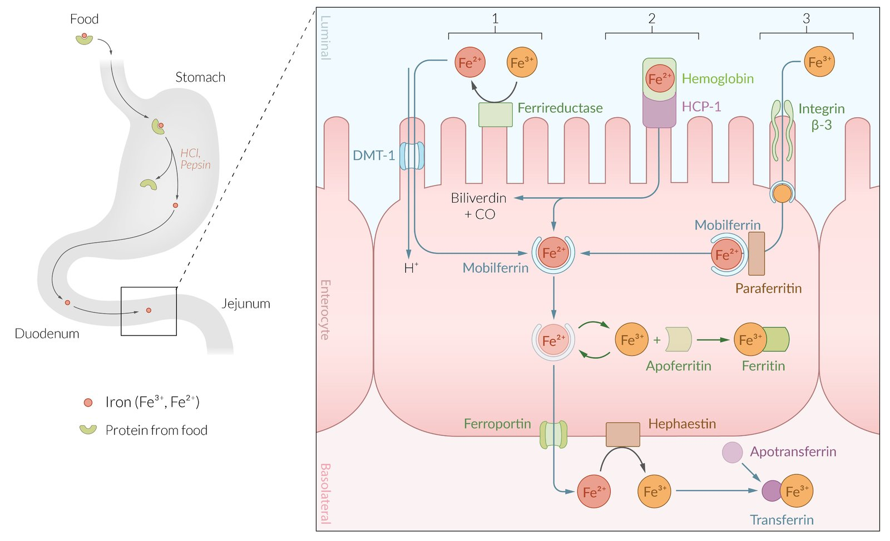
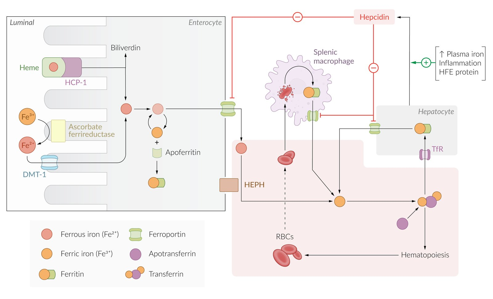
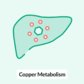
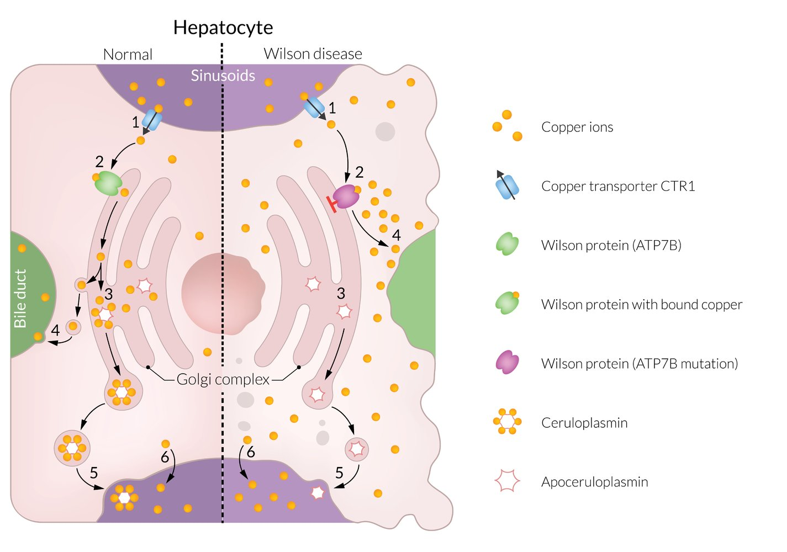
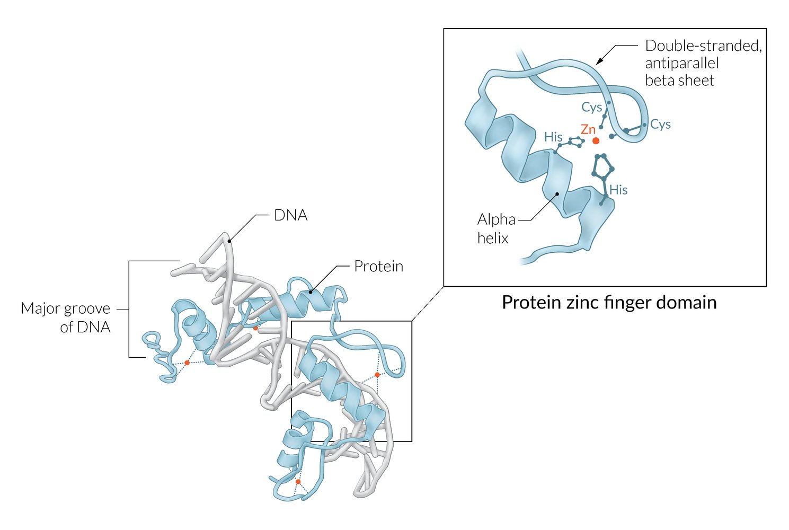
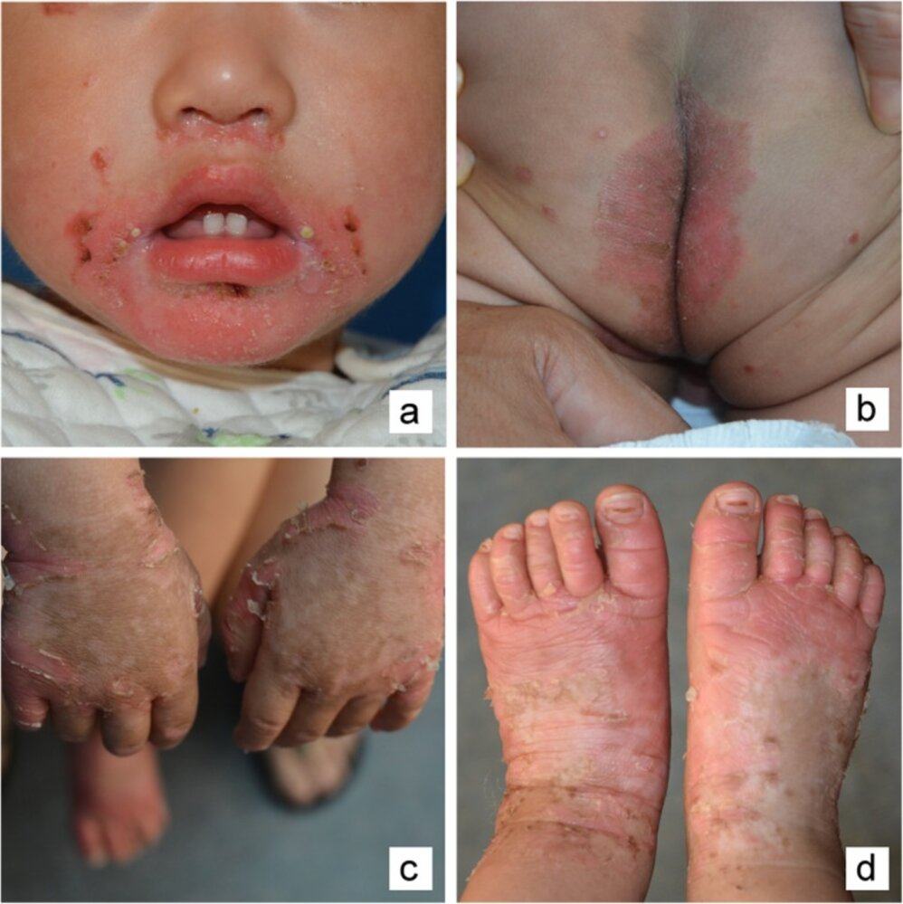

# Trace elements

*Categories: Clinical knowledge > Neurology > Toxic and metabolic disorders > Trace elements*

[Original Article Link](https://coursology-qbank.com/amboss/article/Sp0yKS)

---

## Summary

Essential trace elements are dietary elements including <u>iron</u>, <u>copper</u>, <u>zinc</u>, <u>iodine</u>, <u>selenium</u>, and sulfur that the body requires in minute amounts for proper physiological function and development. While most essential trace elements primarily function as <u>cofactors</u> for a variety of reactions, some also function as constituents of essential molecules (e.g., <u>iron</u> in <u>hemoglobin</u> and <u>myoglobin</u>), <u>transcription factors</u> (e.g., <u>zinc finger</u>), and <u>amino acids</u> (e.g., sulfur in <u>methionine</u> and <u>cysteine</u>). Excess and deficiency of essential trace elements can cause symptoms and diseases, the most important of which are discussed below.

---

## Overview

In biochemistry, trace elements are dietary elements that the body requires in minute amounts for proper function and development.

| Overview of the most important trace elements |  |  |  |
| --- | --- | --- | --- |
| Trace element | Main function | Deficiency | Excess |
| <u>Iron</u> |   * <u>Cofactor</u> for:  * <u>Cytochrome P450</u>  * Cytochrome C  * <u>Metalloproteases</u> (e.g., <u>NADH dehydrogenase</u>  * Integral part of:  * <u>Hemoglobin</u>  * <u>Myoglobin</u>    |  * <u>Iron deficiency anemia</u>   |   * <u>Hemochromatosis</u>  * <u>Iron toxicity</u>    |
| <u>Copper</u> |   * Forms part of <u>ceruloplasmin</u>, <u>superoxide dismutase</u>  * <u>Cofactor</u> for:  * <u>Cytochrome c oxidase</u> (<u>electron transport chain</u>)  * <u>Tyrosinase</u> (<u>melanin synthesis</u>)  * <u>Lysyl oxidase</u> (cross-linking in <u>collagen synthesis</u>)  * <u>Factor V</u> (<u>coagulation cascade</u>)    |   * <u>Menkes disease</u>  * <u>Sideroblastic anemia</u>  * Abnormal <u>hair</u> growth  * Depigmentation of the <u>skin</u>  * <u>Muscle weakness</u>  * <u>Hepatosplenomegaly</u>  * <u>Osteoporosis</u>  * Neurologic manifestations: <u>ataxia</u>, neuropathy  * <u>Delayed wound healing</u>    |  * <u>Wilson disease</u>   |
| <u>Zinc</u> |   * <u>Protein structure</u>  * Forms <u>zinc finger transcription factor</u> motif  * Forms bonds between <u>cysteine</u> and <u>histidine</u>  * <u>Cofactor</u> for:  * <u>ACE</u>  * <u>DNA polymerase</u>  * <u>Carbonic anhydrase</u>  * <u>Alkaline phosphatase</u>  * Metallothionein  * <u>Superoxide dismutase</u>  * <u>Collagenases</u>    |   * Impaired <u>wound healing</u>  * <u>Immune dysfunction</u>  * Dermatitis  * <u>Dysgeusia</u>  * <u>Anosmia</u>  * <u>Hypogonadism</u> in males  * <u>Alopecia</u>  * <u>Diarrhea</u>  * Impaired growth and development    |   * Abdominal <u>pain</u>  * <u>Nausea</u>, <u>vomiting</u>, <u>diarrhea</u>    |
| <u>Iodine</u> |  * Integral part of <u>triiodothyronine</u> (T3) and <u>thyroxine</u> (T4)   |   * <u>Hypothyroidism</u>  * <u>Congenital iodine deficiency syndrome</u>  * <u>Goiter</u>  * Increased <u>infant</u> mortality    |  * Pre-existing <u>hypothyroidism</u>, latent or <u>overt hyperthyroidism</u> → <u>symptoms of hyperthyroidism</u>   |
| <u>Selenium</u> |  * <u>Cofactor</u> for:  * <u>Glutathione</u> peroxidase  * <u>Iodothyronine deiodinase 2</u>   |   * <u>Cardiomyopathy</u>  * <u>Skeletal muscle</u> dysfunction  * <u>Immune system</u> dysfunction  * <u>Macrocytosis</u>    |   * <u>Nail</u> changes  * <u>Nausea</u>, <u>vomiting</u>, <u>diarrhea</u>  * <u>Peripheral neuropathy</u>  * Fatigue    |
| Sulfur |  * Part of <u>amino acids</u>  * <u>Methionine</u>  * <u>Cysteine</u>   |   * <u>Brittle nails</u> and <u>hair</u>  * <u>Arthritis</u>  * <u>Nausea</u>, <u>vomiting</u>, <u>diarrhea</u>  * <u>Skin</u> <u>rash</u>  * Cognitive impairment (e.g., <u>memory</u> loss)  * May contribute to <u>obesity</u>, <u>heart</u> disease, <u>Alzheimer disease</u>    |   * <u>Nausea</u>, <u>diarrhea</u>, <u>vomiting</u>  * <u>Headache</u>    |
| <u>Chromium</u> |  * Component of <u>chromium</u>-containing <u>glucose</u> tolerance factors   |  * Decreased <u>insulin sensitivity</u> and <u>impaired glucose tolerance</u>   |   * Acute: <u>contact dermatitis</u>, <u>allergic asthma</u>, hemorrhagic <u>gastroenteritis</u>  * Chronic: <u>lung cancer</u>, <u>ulceration</u> of the <u>nasal septum</u>    |
| <u>Fluoride</u> |   * Induction of bone formation by increasing <u>osteoblastic</u> activity  * Inhibition of demineralization of <u>tooth</u> <u>enamel</u>    |   * <u>Dental caries</u>  * <u>Osteoporosis</u>    |   * <u>Dental fluorosis</u>  * <u>Skeletal fluorosis</u>    |

---

## Iron

### General

* <u>RDA</u>: 10 mg/d (only 10% of <u>iron</u> is absorbed from the intestines)

* Dietary <u>iron</u>

* <u>Heme</u> <u>iron</u>: from meat

* Non-<u>heme</u> <u>iron</u>: from plants 

* Ferrous <u>iron</u> (Fe 2+): in <u>hemoglobin</u>

* Ferric <u>iron</u> (Fe3+): in <u>methemoglobin</u>

* Free <u>iron</u>: Fe2+ can lead to <u>reactive oxygen species</u> via the Fenton reaction. 

* <u>H2O2</u> + Fe2+ → OH- + Fe3+ + •OH (hydroxyl radical)

* Hydroxyl radicals → oxidative <u>stress</u> → <u>DNA damage</u>

### <u>Iron absorption</u> and transport [[1]](https://coursology-qbank.com/amboss/article/20aT2Q)

* Iron absorption

* <u>Gastric acid</u> leads to low <u>pH</u> and promotes dissolution of <u>iron</u> in the <u>duodenum</u>

* Absorption occurs in the <u>duodenum</u> and upper <u>jejunum</u>

* The enzyme hepcidin regulates intestinal absorption of <u>iron</u>.  

* <u>Hepcidin</u> is synthesized in the <u>liver</u>

* Its production is regulated by the human <u>hemochromatosis</u> protein (<u>HFE</u> protein)

* Increased body stores of <u>iron</u> → ↑ <u>HFE</u> protein → ↑ <u>hepcidin</u> → prevention of <u>iron absorption</u>

* <u>Iron deficiency</u> → ↓ <u>hepcidin</u> → ↑ <u>iron absorption</u>

* Ferric <u>iron</u> (non-<u>heme</u> <u>iron</u>, Fe3+) is mainly reduced to ferrous <u>iron</u> (Fe2+) and then absorbed.

* <u>Vitamin C</u> increases absorption (converts Fe3+→ Fe2+).

* <u>Calcium</u> decreases absorption (due to chelation of <u>iron</u>).

* A minority of <u>iron</u> is absorbed as ferric <u>iron</u> (Fe3+).

* <u>Heme</u> <u>iron</u> can be directly absorbed into intestinal cells.

* Iron transport

* <u>Ferroportin</u> (inhibited by <u>hepcidin</u>) transports ferrous <u>iron</u> (Fe 2+) from the <u>enterocytes</u> to the bloodstream. [[2]](https://coursology-qbank.com/amboss/article/7c14df0)

* The enzyme ferroxidase (also known as <u>ceruloplasmin</u>) oxidizes ferrous <u>iron</u> back to ferric <u>iron</u> (converts Fe2+ → Fe3+).

* <u>Transferrin</u>: binds and transports the ferric <u>iron</u> (Fe3+) to the erythroid precursor cells (in <u>bone marrow</u>) for <u>hemoglobin synthesis</u>.

Iron absorption

Regulation of iron metabolism

### <u>Iron storage</u>, recycling, and loss [[3]](https://coursology-qbank.com/amboss/article/p30Ljf)[[4]](https://coursology-qbank.com/amboss/article/U0ab2Q)

* Iron storage

* Total body <u>iron</u> content: ∼ 3 g (<u>♀</u>)/∼ 6 g (<u>♂</u>). [[5]](https://coursology-qbank.com/amboss/article/oV10vf0)

* <u>Iron</u> is present in the body in two forms:

* Functional <u>iron</u> (80%): <u>hemoglobin</u> (largest <u>proportion</u>), <u>myoglobin</u>, cytochrome enzymes

* Storage <u>iron</u> (20%): as Fe3+ ;  [[6]](https://coursology-qbank.com/amboss/article/LV1wEf0)

* <u>Ferritin</u>: <u>hepatocytes</u>, <u>macrophages</u>, <u>enterocytes</u>

* Hemosiderin: <u>hepatocytes</u>

* <u>Iron</u> recycling

* Reticuloendothelial <u>macrophages</u> (in the <u>spleen</u> and <u>liver</u>) <u>phagocytose</u> senescent <u>RBCs</u> and release <u>iron</u> from <u>hemoglobin</u>.

* <u>Transferrin</u> binds the released <u>iron</u> and transports it to the <u>bone marrow</u> for <u>erythropoiesis</u>.

* <u>Iron</u> loss

* Shedding of <u>skin</u> and <u>mucosal</u> <u>epithelial</u> cell → daily loss of 1–2 mg of <u>iron</u>

* Any source of bleeding (e.g., <u>menstruation</u>, <u>occult GI bleed</u>) increases <u>iron</u> loss.

#### Function

* Integral component of <u>hemoglobin</u> and <u>myoglobin</u>

* <u>Cofactor</u> for:

* Cytochrome C, <u>cytochrome P450</u>

* Peroxidases

* <u>Metalloproteases</u> (e.g., <u>NADH dehydrogenase</u>)

* <u>Phosphoenolpyruvate carboxykinase</u> (<u>gluconeogenesis</u>), <u>aconitase</u> (<u>Krebs cycle</u>)

* <u>Ribonucleotide reductase</u> (<u>DNA</u> and <u>RNA</u> synthesis)

### <u>Iron deficiency</u>

For more details regarding the clinical features, diagnosis, and etiology of <u>iron deficiency</u>, see the article on <u>iron deficiency anemia</u>.

* Causes

* Decreased intake

* Decreased absorption

* Increased demand (e.g., lactation, <u>growth spurt</u>, <u>pregnancy</u>)

* <u>Iron</u> loss (e.g., <u>menorrhagia</u>, <u>gastrointestinal bleeding</u>)

* Clinical features: fatigue, <u>lethargy</u>, <u>pallor</u>

### <u>Iron</u> excess

* Causes

* <u>Hemochromatosis</u>

* <u>Iron toxicity</u> (<u>poisoning</u>)

---

## Copper

### General

* <u>RDA</u>: 900 μg/d

* Sources: meat, fish, poultry, vegetables, grains, legumes (e.g., lentils, beans)

* Metabolism

* Absorbed in the <u>stomach</u> and <u>small intestine</u> 

* Absorbed by <u>active transport</u> and <u>passive diffusion</u>

* Exported from <u>enterocytes</u> via <u>Menkes</u> P-type ATPase

* Binds <u>albumin</u> and is transported as part of the <u>enterohepatic circulation</u>

* Transported by ceruloplasmin from the <u>liver</u> to peripheral tissue

* Stored primarily in the <u>liver</u> and <u>brain</u>. Small amounts are stored in the <u>heart</u>, <u>kidney</u>, and <u>pancreas</u>.

Copper Metabolism: Role of ATP7B

### Function

* <u>Cofactor</u> for:

* <u>Cytochrome c oxidase</u> (<u>electron transport chain</u>)

* <u>Tyrosinase</u> (<u>melanin synthesis</u>)

* <u>Lysyl oxidase</u> (important for cross-linking during <u>collagen synthesis</u>)

* <u>Factor V</u> (<u>coagulation cascade</u>)

### Copper deficiency

* Causes: primarily due to genetic mutations, e.g., <u>Menkes disease</u>

* Due to a mutation in the <u>Menkes</u> P-type ATPase, a protein encoded by the <u>ATP7A gene</u>

* Causes inability to transport <u>copper</u> from <u>enterocytes</u> to the <u>liver</u> and other cells of the body → ↓ <u>copper</u> levels

* Clinical features

* Depigmentation of the <u>skin</u>

* Abnormal <u>hair</u> growth

* <u>Muscle weakness</u>

* <u>Hepatosplenomegaly</u>

* <u>Edema</u>

* <u>Osteoporosis</u>

* Neurologic manifestations: <u>ataxia</u>, neuropathy

* <u>Sideroblastic anemia</u>

### Copper excess

* Causes: <u>Wilson disease</u>, rarely from toxic water or cooking with <u>copper</u> pots

Copper metabolism in normal hepatocyte and hepatocyte affected by Wilson disease

---

## Zinc

### General

* <u>RDA</u>: 8–11 mg/d

* Sources: poultry, oysters, fish, meat, <u>zinc</u>-fortified food products (e.g., cereals), nuts

* Metabolism

* Absorbed primarily in the <u>duodenum</u> and <u>jejunum</u>

* Absorption is regulated by metallothionein

* Excreted primarily via the <u>gastrointestinal tract</u>

Section 20.14 Zinc

### Function

* <u>Protein structure</u>

* Forms bonds between <u>cysteine</u> and <u>histidine</u>

* Forms <u>zinc finger transcription factors</u>

* Aids in maintenance and stability of the <u>nuclear membrane</u>

* Essential part of many enzymes (> 100), including <u>DNA polymerase</u>, <u>carbonic anhydrase</u>, <u>ACE</u>, <u>alkaline phosphatase</u>, metallothionein, <u>superoxide dismutase</u>, and <u>collagenases</u>

Zinc finger motif

### Zinc deficiency

* Causes

* Inadequate dietary intake

* Acrodermatitis enteropathica: congenital deficiency of the <u>zinc</u>/<u>iron</u>-regulated transporter-like protein (ZIP)

* <u>Malabsorption</u> (e.g., due to <u>Crohn disease</u>), <u>liver</u>, and renal disease

* <u>Total parenteral nutrition</u> (<u>TPN</u>)

* <u>Chronic liver disease</u> (esp. <u>liver cirrhosis</u>)

* <u>Bowel resection</u>

* Clinical features

* Triad of <u>alopecia</u>, <u>diarrhea</u>, and dermatitis (inflammatory <u>skin</u> <u>rash</u> that is typically located <u>periorificially</u> and acrally)

* Other features include:

* Impaired <u>wound healing</u>

* <u>Dysgeusia</u>

* <u>Anosmia</u>

* <u>Immune dysfunction</u>

* <u>Male hypogonadism</u>

* In patients with <u>liver cirrhosis</u>: associated with accelerated progression of <u>cirrhosis</u> and aggravated clinical symptoms (e.g., <u>hepatic encephalopathy</u>)

* Impaired growth and development

* Diagnosis: measurement of plasma <u>zinc</u> levels

* Treatment: oral <u>zinc</u> supplementation

Acrodermatitis enteropathica

### <u>Zinc</u> excess

* Causes: rare, but can develop due to excess <u>zinc</u> intake

* Clinical features

* Abdominal <u>pain</u>

* <u>Nausea</u>, <u>vomiting</u>, <u>diarrhea</u>

---

## Iodine

### General

* <u>RDA</u>: 150 μg/d

* Sources: seafood, seaweed, plants grown in <u>iodine</u>-rich soil, water, vegetables, iodized table salt

* Metabolism

* Absorbed in the <u>small intestine</u>

* Most iodide is taken up and stored by the <u>thyroid gland</u>; excess is excreted by the <u>kidneys</u>.

* Other: Elemental <u>iodine</u> can be used as a <u>disinfectant</u>.

### Function

* Integral part of <u>triiodothyronine</u> (T3) and <u>thyroxine</u> (T4)

* See also “<u>Thyroid hormones</u>.”

### Iodine deficiency

* Causes: decreased intake (e.g., a diet low in <u>iodine</u> )

* Clinical features: <u>Iodine deficiency</u> presents with features of decreased <u>thyroid hormone synthesis</u>.

* Increased <u>infant</u> mortality

* <u>Hypothyroidism</u>

* <u>Congenital iodine deficiency syndrome</u>

* <u>Myxedema coma</u>

* <u>Goiter</u>

### Iodine excess

* Causes: Excess <u>iodine</u> is rare but can be caused by administration of <u>iodine</u>-containing contrast agents or excessive consumption of dietary supplements (seaweed, kelp).

* Clinical features

* In patients with normal <u>thyroid</u> function, excess <u>iodine</u> is usually well tolerated.

* Jod-Basedow phenomenon

* <u>Hyperthyroidism</u> following <u>iodine excess</u> (e.g., after IV contrast administration, due to intake of <u>amiodarone</u> or other <u>iodine</u>-containing drugs, etc.)

* Occurs due to activation of the entire <u>thyroid</u> or foci of autonomously functioning <u>thyroid</u> tissue (e.g., <u>thyroid nodule</u>)

* Induced in patients with pre-existing <u>hypothyroidism</u> (e.g., <u>endemic</u> <u>goiter</u>, <u>Hashimoto thyroiditis</u>) and patients with latent or <u>overt hyperthyroidism</u>

* Characterized by <u>symptoms of hyperthyroidism</u> or <u>thyrotoxicosis</u>

* Wolff-Chaikoff effect [[7]](https://coursology-qbank.com/amboss/article/AoYReJ)[[8]](https://coursology-qbank.com/amboss/article/_oY5eJ)

* <u>Hypothyroidism</u> following <u>iodine excess</u> (opposite effect to <u>Jod-Basedow phenomenon</u>)

* Temporary autoregulatory compensation mechanism for the prevention of a <u>hypermetabolic state</u> in the event of <u>iodine excess</u>

* Mechanism: excess <u>iodine</u> inhibits <u>thyroid peroxidase</u> → decreases T3/T4 production

---

## Selenium

### General

* <u>RDA</u>: 55 μg/d

* Sources: meat, seafood, grains and seeds (e.g., brazil nut)

* Metabolism

* Present in two forms (in animals): seleno-<u>methionine</u> and seleno-<u>cysteine</u>

* Absorbed in the <u>small intestine</u>

* Stored as seleno-<u>methionine</u>

* Active form: seleno-<u>cysteine</u>

* Excreted in the urine

### Function

* <u>Cofactor</u> for enzymes such as <u>glutathione</u> peroxidase;  , and <u>iodothyronine deiodinase 2</u> (<u>thyroid hormone production</u>)

> [!NOTE]
> <u>Selenium</u> plays an important role in neutralizing oxidant <u>stress</u> as part of the <u>glutathione</u> peroxidase.

### <u>Selenium</u> deficiency

* Causes

* <u>Malnutrition</u>

* <u>Total parenteral nutrition</u>

* Clinical features

* <u>Cardiomyopathy</u>

* <u>Skeletal muscle</u> dysfunction

* <u>Immune system</u> dysfunction

* <u>Macrocytosis</u>

### <u>Selenium</u> excess

* Causes: excess <u>selenium</u> intake (selenosis)

* Clinical features

* <u>Nausea</u>, <u>vomiting</u>, <u>diarrhea</u>

* <u>Hair</u> loss

* <u>Nail</u> changes

* Fatigue

* <u>Peripheral neuropathy</u>

---

## Chromium

<u>Chromium</u> is not considered an essential element, even though it is often erroneously listed as such. The question of whether <u>chromium</u> can improve <u>insulin sensitivity</u> remains controversial. [[9]](https://coursology-qbank.com/amboss/article/Yc1naf0)

### General

* Sources: meat (e.g., beef), seafood, vegetables (e.g., broccoli, green beans, potatoes), fruits (e.g., apples, bananas), whole grains

### Function

* Component of <u>chromium</u>-containing <u>glucose</u> tolerance factors

* Might play a role in <u>insulin sensitivity</u> (individuals with <u>T2DM</u> have lower <u>chromium</u> blood levels than healthy individuals)

### <u>Chromium</u> deficiency

* Causes: <u>total parenteral nutrition</u>

* Clinical features: decreased <u>insulin sensitivity</u> and <u>impaired glucose tolerance</u> (due to lack of <u>chromium</u> in <u>chromium</u>-containing <u>glucose</u> tolerance factors)

### <u>Chromium</u> excess

* Causes: chrome exposure during e.g., galvanization (chrome plating), paint, and glass manufacturing

* Clinical features

* Acute toxicity: <u>contact dermatitis</u>, <u>allergic asthma</u>, hemorrhagic <u>gastroenteritis</u>

* Chronic toxicity: <u>lung cancer</u>, <u>ulceration</u> of the <u>nasal septum</u>, <u>Welder's lung</u>

See also “<u>Chromium toxicity</u>.”

---

## Fluoride

### General [[10]](https://coursology-qbank.com/amboss/article/ec1xYf0)

* Sources: fluoridated water, fluoridated toothpaste, shellfish, tea (e.g., black tea, green tea),

### Function [[11]](https://coursology-qbank.com/amboss/article/nV17Ef0)

* Induction of bone formation by increasing <u>osteoblastic</u> activity

* Inhibition of demineralization of <u>tooth</u> <u>enamel</u>

### <u>Fluoride</u> deficiency

* Causes: decreased intake

* Clinical features: <u>dental caries</u>, <u>osteoporosis</u>

### <u>Fluoride</u> excess

* Causes

* Excessive use of <u>fluoride</u> toothpaste (only causes <u>dental fluorosis</u>)

* Excessive consumption of <u>fluoride</u>, typically due to very high levels in drinking water, or supplements

* Clinical features: fluorosis

* Dental fluorosis: porous, mottling, and opaque, white staining <u>enamel</u> (due to hypomineralization during the formation of <u>permanent teeth</u> during the first 6 years of life)

* Skeletal fluorosis (due to mineralization of <u>ligaments</u>, <u>cartilage</u>, and periarticular muscles and demineralization of the bone)

* <u>Joint</u> <u>pain</u> and stiffness

* Bone and <u>joint</u> deformities

---