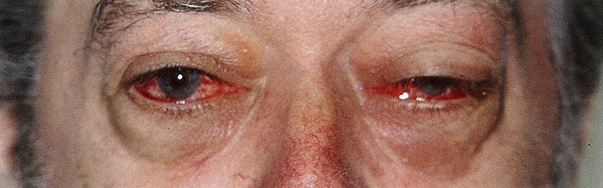
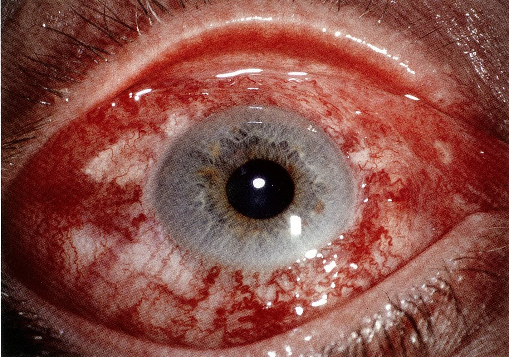

# Arteriovenous fistula

*Categories: Clinical knowledge > Neurology > Vascular disorders and trauma > Arteriovenous fistula*

[Original Article Link](https://coursology-qbank.com/amboss/article/2i0TIf)

---

## Summary

An arteriovenous <u>fistula</u> is an abnormal connection between an <u>artery</u> and a <u>vein</u>. The most important examples include <u>carotid-cavernous fistula</u> and <u>pulmonary arteriovenous fistula</u>. A <u>carotid-cavernous fistula</u> is an abnormal communication between a carotid <u>artery</u> and the <u>cavernous sinus</u>. It is most commonly caused by trauma. This <u>fistula</u> leads to a high-pressure inflow of arterial blood into the venous sinuses, resulting in compression and damage to adjacent structures. The main symptom is <u>diplopia</u>, which is caused by compression injury of the <u>oculomotor nerves</u>. Other common symptoms include <u>pulsatile tinnitus</u>, <u>exophthalmos</u>, and <u>headache</u>. Diagnosis is established based on typical CT/<u>MRI</u> or <u>angiography</u> findings (e.g., enlarged <u>cavernous sinus</u>). The preferred treatment method is endovascular occlusion of the <u>fistula</u> with balloons or coils. A <u>pulmonary arteriovenous fistula</u> is an abnormal communication between the <u>pulmonary artery</u> and <u>veins</u>, and it leads to a high-pressure inflow of arterial blood into the venous system, causing venous congestion. The main symptom is <u>dyspnea</u>; other common symptoms include <u>hemoptysis</u>, <u>platypnea</u> and <u>orthopnea</u>, <u>chest pain</u>, and <u>cyanosis</u>. Diagnosis is established based on typical transthoracic <u>contrast echocardiography</u>, CT, and <u>angiography</u> findings (e.g., mass with feeding vessels). Treatment is only required for symptomatic patients, and the preferred treatment method is <u>embolotherapy</u>.

---

## Carotid-cavernous fistula

* Definition: an abnormal communication between the carotid <u>artery</u> and the <u>cavernous sinus</u>

* Classification

| Types of <u>carotid-cavernous fistula</u> |  |  |
| --- | --- | --- |
| Characteristics | Direct <u>carotid-cavernous fistula</u> | Indirect <u>carotid-cavernous fistula</u> |
| Description |   * Abnormal communication between the <u>cavernous sinus</u> and the intracavernous <u>internal carotid artery</u>  * High-flow <u>carotid-cavernous fistula</u>    |   * Abnormal communication between the <u>cavernous sinus</u> and branches of the internal and/or <u>external carotid artery</u> within the <u>dura mater</u>  * Low-flow (dural) <u>carotid-cavernous fistula</u>    |
| <u>Epidemiology</u> |  * Most common type   |  * Less common type   |
|  Etiology [[1]](https://coursology-qbank.com/amboss/article/kPamUk) |   * Secondary to <u>head trauma</u>  * Spontaneous  * <u>Iatrogenic</u> (e.g., as a result of surgical procedure)    |   * Secondary to cavernous carotid <u>aneurysm</u> rupture or <u>cavernous sinus thrombosis</u>  * Rarely, as a complication of diseases that affect arterial walls (e.g., <u>Ehlers-Danlos syndrome</u>, <u>fibromuscular dysplasia</u>)  * Spontaneous    |
| Onset of symptoms |  * Typically rapid   |  * Typically gradual   |

* Pathophysiology: : congenital <u>malformation</u> or trauma → arteriovenous <u>fistula</u> formation → arterial blood flowing into venous system → venous congestion → compression of <u>cavernous sinus</u> structures (i.e., <u>CN III</u>, <u>CN IV</u>, <u>CN VI</u>, <u>CN V1</u>, and <u>CN V2</u>

* Clinical features [[2]](https://coursology-qbank.com/amboss/article/OPaIUk)

* <u>Headache</u>

* Orbital <u>pain</u>

* <u>Diplopia</u>, blurred <u>vision</u>

* <u>Pulsatile tinnitus</u> (<u>fistula</u> <u>bruit</u>)

* Signs of congestion 

* Unilateral or bilateral, pulsatile <u>exophthalmos</u>

* <u>Chemosis</u>

* Massive <u>conjunctival</u> congestion and hemorrhage, with potential bleeding in the <u>retina</u> and <u>vitreous humor</u>

* Increase in <u>intraocular pressure</u>

* <u>Optic disc</u> swelling

* Diagnostics

* CT/<u>MRI</u> (with or without <u>angiography</u>) may show:

* <u>Proptosis</u>

* Enlargement of the <u>cavernous sinus</u>

* Expansion of the superior <u>ophthalmic veins</u>

* <u>Skull fractures</u> (if <u>fistula</u> is due to trauma)

* Abnormal <u>cavernous sinus</u> flow

* <u>Ultrasound</u> with <u>transcranial Doppler</u>: shows increased blood flow

* <u>Cerebral angiography</u>

* <u>Gold standard</u> for diagnosis (and treatment)

* Visualization of feeding vessels and blood flow

* Treatment

* Embolization using balloons or coils

* Direct <u>fistulas</u>: transarterial approach

* Indirect <u>fistulas</u>: transvenous approach

* Neurosurgery

* Indicated if endovascular interventions fail or are not possible

* Occlusion of the <u>fistula</u> via <u>suturing</u> or packing

> [!TIP]
> If not treated swiftly, <u>carotid-cavernous fistulas</u> may result in cerebral hemorrhage or <u>infarction</u>, <u>intracranial hypertension</u>, <u>vision loss</u>, or even <u>death</u>.

Carotid-cavernous fistula 1/2

Carotid-cavernous fistula 2/2

---

## Pulmonary arteriovenous fistula (PAVF)

* Definition: an abnormal communication between <u>pulmonary arteries</u> and <u>veins</u>

* Etiology

* Can be acquired (e.g., trauma, <u>surgery</u>)

* Frequently associated with <u>hereditary hemorrhagic telangiectasia</u>

* Pathophysiology: arteriovenous <u>fistula</u> formation → flow of arterial blood into venous system → venous congestion → pulmonary symptoms

* Clinical features 

* <u>Dyspnea</u> (most common symptom)

* <u>Hemoptysis</u> (due to <u>PAVF</u> rupture)

* <u>Platypnea</u>, <u>orthodeoxia</u>

* <u>Chest pain</u>, <u>cough</u>

* <u>Cyanosis</u>, <u>clubbing</u>

* <u>Physical examination</u> may show <u>murmurs</u>/<u>bruits</u> (loudest during inspiration).

* Diagnostics [[3]](https://coursology-qbank.com/amboss/article/D8c1KV0)

* CT: test of choice for initial diagnosis

* Multiple or single, round, dense <u>nodules</u> or masses with well-demarcated, smooth borders and a sac-like appearance

* Lobulation may be visible.

* Feeding vessels often appear as tubular structures that terminate at the sac.

* Contrast-enhanced <u>pulmonary angiography</u>: <u>gold standard</u> for defining the anatomy of <u>PAVF</u> and for definitive diagnosis

* Transthoracic <u>contrast echocardiography</u>: to evaluate the <u>right-to-left shunt</u> (<u>shunt fraction</u> assessment)

* <u>Chest radiography</u>: feeding vessels that have the appearance of smooth <u>nodules</u> with linear parallel shadows

* <u>Laboratory studies</u>

* <u>CBC</u>: <u>anemia</u> or <u>polycythemia</u>

* <u>Arterial blood gas analysis</u>: <u>hypoxemia</u> (↓ <u>SaO2</u>)

* Differential diagnosis

* Highly vascular <u>parenchymal</u> <u>tumor</u>

* <u>Hepatopulmonary syndrome</u>

* <u>Atrial septal defects</u>

* Nasal telangiectases, endobronchial telangiectases

* Management [[4]](https://coursology-qbank.com/amboss/article/E8c8oV0)[[5]](https://coursology-qbank.com/amboss/article/v8cAoV0)

* Not all <u>PAVFs</u> require intervention.

* In symptomatic <u>PAVFs</u>, <u>embolotherapy</u> is preferred.

* Complications

* <u>Stroke</u>, <u>brain abscess</u> (both due to <u>paradoxical embolism</u>)

* <u>Hemothorax</u> (due to rupture of a subpleural <u>PAVF</u>)

* During <u>pregnancy</u>, especially during the <u>third trimester</u>, pulmonary hemorrhage may occur and can be fatal.

* <u>Polycythemia</u> (due to chronic <u>hypoxemia</u>) or <u>anemia</u> (due to blood loss)

* <u>Pulmonary hypertension</u>

---