# Ischemic stroke

*Categories: Clinical knowledge > Neurology > Vascular disorders and trauma > Ischemic stroke*

[Original Article Link](https://coursology-qbank.com/amboss/article/iJ0JFS)

---

## Summary

<u>Ischemic</u> <u>stroke</u> is an acute neurological condition caused by impaired <u>cerebral blood flow</u> (e.g., vascular occlusion or systemic <u>hypoperfusion</u>). The most important <u>risk factors</u> are chronic systemic <u>hypertension</u> and cardiovascular disease. <u>Modifiable risk factors</u> should be managed (e.g., <u>primary prevention of ASCVD</u>, anticoagulation for patients with <u>atrial fibrillation</u>) for <u>primary prevention of stroke</u>. Clinically, <u>ischemic</u> <u>stroke</u> is characterized by the acute onset of <u>focal neurological deficits</u>, which are dependent on the cerebral territory covered by the relevant vessel. If <u>ischemic</u> <u>stroke</u> is suspected, a noncontrast head CT should immediately be performed to rule out <u>intracranial hemorrhage</u> and blood <u>glucose</u> should be measured as it is a <u>stroke mimic</u>. <u>Revascularization</u> of the vessels affected in <u>ischemic</u> <u>stroke</u>, e.g., via <u>tissue plasminogen activator</u> (<u>tPA</u>) or thrombectomy, can preserve <u>brain</u> tissue and improve outcomes if given early. Further treatment consists of <u>supportive care</u>, <u>neuroprotective measures</u>, management of underlying causes, and <u>reducing subsequent stroke risk</u> with <u>antiplatelet therapy</u> and other <u>management of ASCVD</u>.

<u>Central retinal artery occlusion</u>, <u>transient ischemic attack</u>, <u>intracerebral hemorrhage</u>, and <u>subarachnoid hemorrhage</u> are covered in separate articles. See also “<u>Overview of stroke</u>.”

---

## Definitions

* Acute neurological dysfunction caused by <u>brain</u>, spinal cord, or retinal <u>infarction</u>  [[1]](https://coursology-qbank.com/amboss/article/F7dgnr0)

* See “<u>Overview of stroke</u>” for related conditions.

---

## Epidemiology

<u>Ischemic</u> <u>strokes</u> account for ∼ 85% of all <u>strokes</u>.

### Risk factors for ischemic stroke

* <u>Nonmodifiable risk factors</u> [[2]](https://coursology-qbank.com/amboss/article/R3alR4)[[3]](https://coursology-qbank.com/amboss/article/Q3auR4)[[4]](https://coursology-qbank.com/amboss/article/2-bT9w)

* Age ≥ 65 years

* Sex <u>♂</u> > <u>♀</u>

* African Americans, Native Americans, Alaska Natives, and Hispanics are at higher risk.

* <u>Family history</u> of cardiovascular or <u>cerebrovascular disease</u>

* Genetic disorders (e.g., <u>sickle cell disease</u>)

* History of <u>TIA</u>

* <u>Migraine with aura</u>

* <u>Low birth weight</u>

* <u>Modifiable risk factors</u> [[2]](https://coursology-qbank.com/amboss/article/R3alR4)[[4]](https://coursology-qbank.com/amboss/article/2-bT9w)

* Systemic <u>hypertension</u>

* <u>Hyperlipidemia</u>

* <u>Diabetes mellitus</u>

* <u>Atherosclerosis</u>

* Cardiovascular disease

* <u>Carotid artery stenosis</u>

* <u>Atrial fibrillation</u>

* <u>Obesity</u>

* <u>Coagulopathy</u> (e.g., <u>protein C</u> or S deficiency), <u>hyperhomocysteinemia</u>

* <u>Heavy alcohol use</u>

* Tobacco use

* <u>Recreational drug</u> use (e.g., <u>cocaine</u> can cause cerebral vasospasm)

* <u>Oral contraceptive</u> use

* <u>Hormone replacement therapy</u>

* Sedentary lifestyle

* Suboptimal diet (e.g., high salt intake, inadequate fruit and vegetable intake)

> [!TIP]
> For both <u>ischemic</u> and <u>hemorrhagic strokes</u>, age is the most important <u>nonmodifiable risk factor</u> and <u>arterial hypertension</u> is the most important <u>modifiable risk factor</u>.

Epidemiological data refers to the US, unless otherwise specified.

---

## Etiology

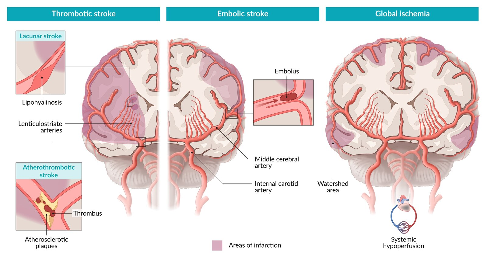

Types of ischemic stroke

### Embolic <u>strokes</u> (∼ 20% of all <u>strokes</u>)

* Most commonly affect the <u>middle cerebral artery</u> (<u>MCA</u>)

* Dislodged <u>emboli</u> can affect multiple cerebral vascular territories simultaneously.

* Cardiac emboli

* <u>Atrial fibrillation</u>

* Atrial or ventricular <u>thrombi</u>

* <u>Rheumatic heart disease</u>

* <u>Ventricular aneurysms</u>

* <u>Atheroemboli</u> 

* <u>Internal carotid artery</u>

* <u>Aortic arch</u> (less common)

* <u>Infectious emboli</u>: bacterial <u>endocarditis</u>

* Paradoxical embolism: <u>venous thromboembolism</u> (especially due to <u>deep vein thrombosis</u>) in patients with right-to-left cardiac shunt (e.g., <u>persistent foramen ovale</u> or <u>atrial septal defect</u>)

* Spectacular shrinking deficit: <u>distal</u> migration of the <u>embolus</u> leads to recanalization of the affected vessel and rapid clinical improvement after symptom onset

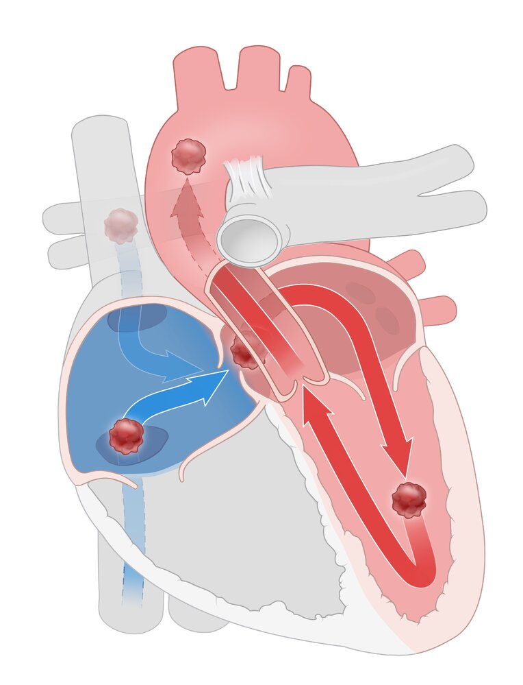

Pathophysiology of paradoxical embolism

### <u>Thrombotic</u> <u>strokes</u> (∼ 40%)

* Large vessel <u>atherosclerosis</u> (∼ 20%) 

* Rupture of an <u>atherosclerotic plaque</u> and exposure of subendothelial <u>collagen</u> → <u>formation of a thrombus</u>

* <u>Thrombus formation</u> most commonly occurs at branch points in <u>arteries</u> (e.g., ; <u>internal carotid artery</u> bifurcation or where the <u>MCA</u> branches from the <u>circle of Willis</u>).

* Small vessel occlusion (e.g., <u>lacunar infarct</u>) (∼ 20%): see “Subtypes and variants” below.

### <u>Global</u> cerebral <u>ischemia</u>

* Systemic <u>hypoperfusion</u>

* <u>Shock</u> or bilateral large <u>artery</u> <u>atherosclerosis</u> (e.g., of carotid <u>arteries</u>) → decreased effective <u>oxygen delivery</u> to the whole <u>brain</u>

* Common during cardiac surgeries

* Can result in <u>watershed infarct</u>

* <u>Hypoglycemia</u>: Repeated episodes of <u>hypoglycemia</u> (e.g., due to <u>insulinoma</u>) increase the risk of cerebral <u>ischemia</u>.

* Severe and/or chronic <u>hypoxia</u>: <u>hypoxemia</u> (e.g., due to <u>respiratory arrest</u>) → <u>global</u> tissue <u>hypoxia</u> in the <u>brain</u>

### Other causes

* <u>Hypercoagulable states</u>

* <u>Inherited thrombophilia</u> (e.g., <u>factor V</u> Leiden mutation, <u>protein C</u> deficiency)

* <u>Polycythemia</u>

* <u>Hormonal contraceptive</u> use

* <u>Hormone replacement therapy</u>

* <u>Sickle cell disease</u>

* <u>Vasculitis</u> (e.g., <u>giant cell arteritis</u>)

* <u>Arterial dissection</u> (e.g., due to trauma or <u>fibromuscular dysplasia</u>)

References:[[5]](https://coursology-qbank.com/amboss/article/U30b3f)[[6]](https://coursology-qbank.com/amboss/article/i3aJR4)[[7]](https://coursology-qbank.com/amboss/article/P3aWi4)[[8]](https://coursology-qbank.com/amboss/article/43a3i4)[[9]](https://coursology-qbank.com/amboss/article/dRaoN4)[[10]](https://coursology-qbank.com/amboss/article/VRaGN4)[[11]](https://coursology-qbank.com/amboss/article/eRaxN4)

---

## Clinical features

* Sudden onset of <u>focal neurological deficits</u> (e.g., <u>weakness</u>/<u>paralysis</u>, <u>paresthesias</u>, <u>aphasia</u>, <u>dysarthria</u>)

* Nonspecific symptoms (e.g., impaired consciousness, <u>nausea</u>, <u>vomiting</u>, <u>headache</u>, <u>seizures</u>)

* Symptoms depend on the location of the <u>stroke</u> (see “<u>Stroke symptoms by affected vessel</u>” and “<u>Stroke symptoms by affected region</u>”)

* Symptoms suggesting a specific etiology:

* <u>Aortic dissection</u>: <u>chest pain</u>, <u>hypotension</u>, <u>dyspnea</u>

* <u>Endocarditis</u>: <u>fever</u>, <u>heart murmur</u>

* <u>ICH</u>/<u>SAH</u>: sudden, severe <u>headache</u>

> [!TIP]
> <u>Stroke</u> should be ruled out in patients presenting with first-time <u>epileptic seizures</u> and subsequent neurological deficits, as the <u>seizure</u> may have been caused by an acute cerebral pathology.

---

## Subtypes and variants

### Lacunar infarct [[7]](https://coursology-qbank.com/amboss/article/P3aWi4)[[12]](https://coursology-qbank.com/amboss/article/bMYHMp)

* Definition: noncortical <u>infarcts</u> characterized by the absence of <u>cortical signs</u> (e.g., no <u>aphasia</u>, <u>hemianopsia</u>, <u>agnosia</u>, <u>apraxia</u>)

* Etiology  

* Most common: chronic hypertensive vasculopathy → <u>lipohyalinosis</u> of the small vessels → occlusion of small, penetrating <u>arteries</u> (e.g., <u>lenticulostriate artery</u>);   → <u>lacunar stroke</u> resulting in specific <u>lacunar syndromes</u> (see “<u>Lacunar syndromes</u>”)

* Less common

* Cardioembolic event

* <u>Microatheroma</u> formation

* Microbleed (rare)

* <u>Risk factors</u>

* <u>Hypertension</u>

* <u>Diabetes mellitus</u>

* Clinical features

* Acute transient <u>focal neurological symptoms</u> that often have a <u>stuttering</u> course

* Symptoms depend on the affected territory.

* See “<u>Lacunar syndromes</u>.”

* Commonly affected areas

* <u>Internal capsule</u>, corona radiata

* <u>Pons</u>

* <u>Basal ganglia</u> (<u>striatum</u>, <u>putamen</u>, <u>globus pallidus</u>, <u>thalamus</u>, caudate)

* Diagnosis: <u>diffusion-weighted MRI</u>

* Pathology: results in a <u>pale infarction</u> at the periphery of the cortex

* Treatment: same as for other <u>ischemic</u> <u>strokes</u> (see “Treatment”)

> [!NOTE]
> <u>Infarction</u> of the <u>posterior</u> limb of the <u>internal capsule</u> is the most common type of <u>lacunar stroke</u> and may manifest clinically with <u>pure motor stroke</u>, <u>pure sensory stroke</u> (rare), <u>sensorimotor stroke</u>, <u>dysarthria-clumsy hand syndrome</u>, and/or <u>ataxic hemiparesis</u>.

### Watershed infarct [[6]](https://coursology-qbank.com/amboss/article/i3aJR4)[[13]](https://coursology-qbank.com/amboss/article/ES08Yf)

* Definition: border-zone <u>infarct</u> in the region between the territory of two major <u>arteries</u> that supply the <u>brain</u> (watershed area)

* Etiology: sudden decrease in blood pressure or cessation of blood flow through both vessels → <u>ischemia</u> in the susceptible region between two vascular territories

* Cortical <u>border zones</u>: territories between the <u>anterior</u> and <u>middle cerebral arteries</u> and between the middle and <u>posterior cerebral arteries</u>

* Internal <u>border zones</u>: territories between the <u>superficial</u> and deep branches of the <u>MCA</u>

* Clinical features

* Signs of systemic <u>hypoperfusion</u> (e.g., <u>tachycardia</u>, <u>low blood pressure</u>, <u>pallor</u>, sweating)

* Diffuse neurological deterioration

* PCA-<u>MCA</u> <u>watershed region</u>: bilateral visual loss (<u>cortical blindness</u>)

* <u>ACA</u>-<u>MCA</u> <u>watershed region</u>: <u>proximal</u> limb <u>weakness</u> with sparing of the face, hands, and feet (“man-in-the-barrel syndrome”)

Cerebral watershed areas

---

## Initial evaluation and acute stabilization

### <u>Primary survey</u>

Clinical assessment and management should occur simultaneously with the goals of stabilizing the patient, keeping the door-to-<u>neuroimaging</u> time to a minimum, and identifying candidates for reperfusion therapy as soon as possible.  [[14]](https://coursology-qbank.com/amboss/article/Jmbsg8)[[15]](https://coursology-qbank.com/amboss/article/3DbSVD)[[16]](https://coursology-qbank.com/amboss/article/NDb-eD)

* <u>Airway management</u>: <u>Secure airway</u> if <u>airway protective reflexes</u> are impaired, e.g., due to depressed <u>level of consciousness</u> or <u>bulbar dysfunction</u>.

* <u>Respiratory support</u>

* Provide <u>oxygen therapy</u> to keep <u>SpO2</u> > 94%.

* Consider <u>mechanical ventilation</u> for <u>respiratory failure</u>.

* <u>Hemodynamic support</u>: See “<u>Blood pressure management in ischemic stroke</u>.”

* Rapid focused <u>neurological assessment</u>

* Determine the time of symptom onset or, if this is unknown, the time the patient was last seen well or at neurological baseline.

* Identify <u>risk factors for ischemic stroke</u> and <u>risk factors for hemorrhagic stroke</u>.

* Minimum <u>neurological examination</u>

* <u>GCS</u> score

* <u>Pupillary examination</u>

* Identification of <u>lateralizing signs</u>, e.g., <u>hemiparesis</u>, facial droop, <u>pronator drift</u>

* Screening for signs of <u>cerebral herniation</u>

* Focused <u>neurological examination</u> 

* Attempt to localize lesion by identifying <u>stroke symptoms by affected vessel</u>.

* Perform severity assessment: e.g., <u>NIHSS</u>

* Assess for a central cause in patients presenting with <u>vertigo</u> (e.g., using <u>HINTS examination</u>). [[17]](https://coursology-qbank.com/amboss/article/97dNLr0)

* Critical management steps [[14]](https://coursology-qbank.com/amboss/article/Jmbsg8)[[18]](https://coursology-qbank.com/amboss/article/n9b7LD)

* Check <u>POC glucose</u> and treat immediately if < 60 mg/dL or > 400 mg/dL to rule out <u>stroke mimic</u>.

* Arrange emergency <u>neuroimaging</u>, e.g., noncontrast CT head, to rule out <u>intracranial hemorrhage</u>.

* Treat eligible patients with reperfusion therapy for acute <u>ischemic</u> <u>stroke</u> (e.g., IV <u>thrombolytics</u>, <u>mechanical thrombectomy</u>)

* Identify inclusion and exclusion criteria.

* Lower BP to < 185/110 mm Hg prior to initiation.

* Initiate <u>neuroprotective measures</u> and <u>supportive care for ischemic stroke</u>.

* Start <u>ICP management</u> if needed: Avoid <u>steroids</u>, <u>hypothermia</u>, and <u>barbiturates</u>.

* Consults and disposition

* Consult <u>neurology</u> immediately if acute <u>ischemic</u> <u>stroke</u> is identified.

* Consult neurosurgery for any <u>hemorrhagic transformation</u> or if there are indications for <u>ventriculostomy</u> or <u>decompressive craniectomy</u>: e.g., <u>cerebral edema</u> with refractory <u>↑ ICP</u>, large <u>cerebellar</u> <u>infarction</u> with obstructing <u>hydrocephalus</u>.

* Admit the patient to a dedicated <u>stroke unit</u> (or <u>ICU</u>) for at least 24 hours .

* Arrange immediate transfer to a <u>stroke center</u> if specialized care is unavailable locally.  [[17]](https://coursology-qbank.com/amboss/article/97dNLr0)

* Next steps: See “<u>Diagnostics of ischemic stroke</u>” and “<u>Treatment of ischemic stroke</u>.”

> [!TIP]
> Only <u>POC glucose</u> and noncontrast <u>neuroimaging</u> (e.g., CT head or <u>MR</u> <u>brain</u>) are required prior to <u>thrombolytic therapy</u>. Do not delay treatment to complete the remainder of the diagnostic evaluation. A classic clinical presentation without evidence of a <u>stroke mimic</u> or <u>intracranial bleeding</u> on initial <u>neuroimaging</u> is typically enough to diagnose acute <u>ischemic</u> <u>stroke</u> in time-limited settings. [[14]](https://coursology-qbank.com/amboss/article/Jmbsg8)

> [!WARNING]
> Malignant infarctions in the <u>MCA</u> territory or large PICA infarctions may require surgical intervention before <u>edema</u> reaches its maximum extent to prevent <u>brain herniation</u>. [[14]](https://coursology-qbank.com/amboss/article/Jmbsg8)

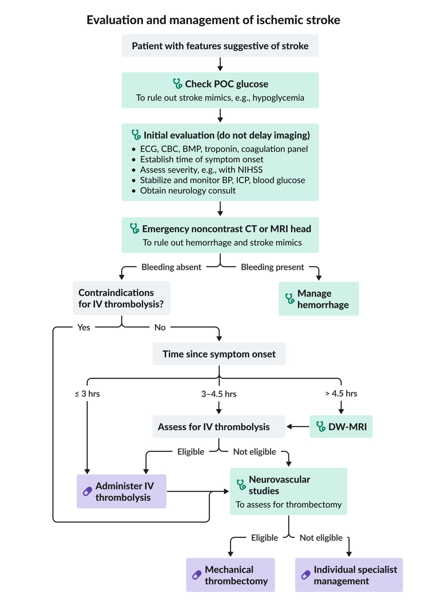

Evaluation and management of ischemic stroke

### Blood pressure management in acute ischemic stroke [[14]](https://coursology-qbank.com/amboss/article/Jmbsg8)

* Provide <u>immediate hemodynamic support</u> for <u>hypotension</u> and <u>hypovolemia</u> (see “<u>Neurogenic shock</u>”).

* <u>Treatment of hypertension</u> in patients not undergoing reperfusion therapy

* BP < 220/120 mm Hg 

* Permissive hypertension: Moderate <u>hypertension</u> is tolerated within the first 48–72 hours with the goal of maintaining cerebral <u>perfusion</u>.

* Earlier BP reduction is indicated in patients with certain comorbidities, e.g., concomitant <u>heart failure</u> or <u>aortic dissection</u>, and after <u>thrombolysis</u>.

* BP ≥ 220/120 mm Hg: Careful BP reduction, e.g., by ∼ 15% within the first 24 hours of <u>stroke</u> onset may be considered.

* Patients undergoing reperfusion therapy: Reduce BP to < 185/110 mmHg beforehand and keep BP < 180/105 mm Hg for the first 24 hours after treatment.

* Recommended agents: <u>labetalol</u> DOSAGE, <u>clevidipine</u> DOSAGE, or <u>nicardipine</u> DOSAGE

* Once the patient is neurologically stable, start (or restart) oral <u>antihypertensive therapy</u> if BP > 140/90 mm Hg.

---

## Severity assessment

The following scales can be calculated at initial presentation to guide treatment decisions and estimate prognosis, or repeated to monitor progression and response to therapy during admission, <u>rehabilitation</u>, and follow-up. They are also used as <u>outcome measures</u> in clinical trials.

### National Institutes of Health Stroke Scale (<u>NIHSS</u>) [[19]](https://coursology-qbank.com/amboss/article/iDbJVD)

* A severity score that quantifies neurological impairment for specific categories within the following broad domains:

* <u>Level of consciousness</u>, orientation, and ability to follow commands

* <u>Cranial nerve palsies</u>: e.g., visual impairment, facial droop

* Motor and sensory deficits or neglect

* Language impairment

* Coordination

* Scores between are assigned for each category are combined and totals can range from 0 (no impairment) to 42 (most severe).

> [!WARNING]
> The <u>NIHSS</u> is weighted towards <u>anterior</u> circulation <u>strokes</u> and underestimates <u>stroke</u> severity in the <u>posterior</u> circulation. [[20]](https://coursology-qbank.com/amboss/article/PwXWQZ0)

|  National Institute of Health <u>Stroke</u> Scale (<u>NIHSS</u>)  [[14]](https://coursology-qbank.com/amboss/article/Jmbsg8)[[19]](https://coursology-qbank.com/amboss/article/iDbJVD)  |  |  |
| --- | --- | --- |
| Category | Task | Score |
| 1a: <u>Level of consciousness</u> | Assess alertness. |   * 0: Alert  * 1: <u>Somnolence</u> or <u>lethargy</u>  * 2: <u>Obtundation</u> or <u>stupor</u>  * 3: <u>Coma</u>    |
| 1b: Orientation questions | Ask month and age. |   * 0: Answers both correctly  * 1: Answers one correctly  * 2: Answers neither question correctly    |
| 1c: Commands | Patient opens/closes eyes and makes a fist.   |   * 0: Follows both commands  [[19]](https://coursology-qbank.com/amboss/article/iDbJVD)  * 1: Follows one command  * 2: Does not follow commands    |
| 2: Gaze | Patient follows examiner's finger in horizontal movements. |   * 0: Normal movement  * 1: Partial gaze palsy  * 2: Forced deviation or complete gaze palsy    |
| 3: <u>Visual fields</u> | Present visual stimuli in the patient's <u>visual field</u> quadrants. |   * 0: No visual loss  * 1: Partial <u>hemianopia</u>  * 2: Complete <u>hemianopia</u>  * 3: Bilateral <u>hemianopia</u> (or blindness)    |
| 4: <u>Facial palsy</u> | Patient shows <u>teeth</u>, raises eyebrows, squeezes eyes shut. |   * 0: Normal movement  * 1: Minor facial <u>paralysis</u>  * 2: Partial facial <u>paralysis</u>  * 3: Complete unilateral or bilateral facial <u>paralysis</u>    |
|  5a: Motor: left arm 5b: Motor: right arm  | Patient elevates each arm to 45° from a <u>supine position</u> or 90° if sitting with open palms facing downwards. |    * 0: No drift  * 1: Arm drifts within 10 seconds  * 2: Arm falls within 10 seconds but shows some effort against gravity  * 3: Arm falls; no effort possible against gravity  * 4: No movement   (Separate scores are given for left arm and right arm.) |
|  6a: Motor: left leg 6b: Motor: right leg  | Patient elevates each leg to 30° from a <u>supine position</u>. |    * 0: No drift  * 1: Leg drifts within 5 seconds  * 2: Leg falls within 5 seconds but shows some effort against gravity  * 3: Leg falls; no effort possible against gravity  * 4: No movement   (Separate scores are given for left leg and right leg.) |
| 7: <u>Limb ataxia</u> | Patient performs <u>finger-to-nose</u> and heel-shin tests on both sides. |   * 0: No <u>ataxia</u>  * 1: <u>Ataxia</u> in one limb  * 2: <u>Ataxia</u> in two limbs    |
| 8: Sensory | Test sensation of face, arms, and legs.   |   * 0: Normal sensation  * 1: Mild sensory loss  * 2: Severe sensory loss    |
| 9: Language | Patient names items, describes a picture, or reads a sentence. |   * 0: No <u>aphasia</u>  * 1: Mild to moderate <u>aphasia</u>  * 2: Severe <u>aphasia</u>  * 3: <u>Global aphasia</u> or no speech production    |
| 10: <u>Dysarthria</u> | Ask patient to read or repeat words. |   * 0: Normal articulation  * 1: Mild to moderate <u>dysarthria</u>  * 2: Severe <u>dysarthria</u>    |
| 11: <u>Sensory extinction</u> or inattention | Offer simultaneous tactile and visual stimuli. |   * 0: No extinction or inattention  * 1: Extinction or inattention in one sensory modality  * 2: Complete inattention to one side or extinction to ≥ 1 sensory modality    |
|   * Instructions  * Assess each category in order.  * Score only what the patient does, without making assumptions about their capabilities.  * Do not coach the patient or change scores retroactively.  * Interpretation: There is currently no consensus on which <u>NIHSS</u> scores serve as cutoffs for <u>stroke</u> severity. [[21]](https://coursology-qbank.com/amboss/article/iwXJiZ0)  * Minor <u>stroke</u> is most commonly defined as <u>NIHSS</u> ≤ 5 or <u>NIHSS</u> ≤ 3.  [[14]](https://coursology-qbank.com/amboss/article/Jmbsg8)[[21]](https://coursology-qbank.com/amboss/article/iwXJiZ0)[[22]](https://coursology-qbank.com/amboss/article/cCbaID)[[23]](https://coursology-qbank.com/amboss/article/IzbY8w)  * Very severe <u>stroke</u> is defined by the 2019 <u>AHA</u> guideline as <u>NIHSS</u> > 25.  [[14]](https://coursology-qbank.com/amboss/article/Jmbsg8)  * Can also be used to assess prognosis, although cutoffs vary.  [[16]](https://coursology-qbank.com/amboss/article/NDb-eD)[[24]](https://coursology-qbank.com/amboss/article/QwXuiZ0)[[25]](https://coursology-qbank.com/amboss/article/jwX_iZ0)    |  |  |

NIH Stroke Scale/Score (NIHSS)

### Modified Rankin scale [[26]](https://coursology-qbank.com/amboss/article/LXcwAa0)[[27]](https://coursology-qbank.com/amboss/article/oXc0_a0)

* A scale used to quantify the degree of disability and dependence in daily activities before and after cerebral <u>stroke</u>.

* The scale ranges from 0 (no symptoms) to 6 (<u>death</u>).

|  <u>Modified Rankin scale</u>   |  |  |
| --- | --- | --- |
| Disability | Symptoms | Score |
|  None | Absent | 0 |
| Insignificant | Present, but not affecting usual activities | 1 |
| Slight | Affecting some activities, but not affecting independence | 2 |
| Moderate | Necessitating assistance for some <u>ADLs</u>, but not for walking | 3 |
| Moderately severe | Necessitating assistance for walking and most <u>ADLs</u>  | 4 |
| Severe | Necessitating full-time care for all <u>ADLs</u> (e.g., bedbound, incontinent) | 5 |
| <u>Death</u> |  | 6 |

Modified Rankin Scale (mRS)

---

## Diagnosis

### Diagnostic approach  [[28]](https://coursology-qbank.com/amboss/article/4wX3QZ0)[[29]](https://coursology-qbank.com/amboss/article/lwXvQZ0)[[30]](https://coursology-qbank.com/amboss/article/s9XtKZ0)[[31]](https://coursology-qbank.com/amboss/article/wXchZY0)

* Prioritize <u>neuroimaging for ischemic stroke</u> as soon as possible.

* Obtain initial noncontrast imaging without delay.  [[14]](https://coursology-qbank.com/amboss/article/Jmbsg8)

* CT head is usually the initial imaging modality

* <u>MRI</u> <u>brain</u> is more sensitive for early <u>stroke</u> detection than CT , however, it is less commonly available and takes longer.

* Consider advanced <u>neuroimaging</u> in consultation with a <u>neurologist</u>, but do not delay reperfusion therapy if indicated.  [[28]](https://coursology-qbank.com/amboss/article/4wX3QZ0)[[32]](https://coursology-qbank.com/amboss/article/TXc6xa0)

* Identify any <u>stroke mimics</u> on <u>neuroimaging</u>: e.g., <u>brain tumor</u>, <u>brain abscess</u>

* Consider follow-up <u>neuroimaging</u> for patients with high clinical suspicion and equivocal initial CT and <u>MRI</u>.

* Order additional studies within the first 48 hours of symptom onset to determine the underlying etiology.

* <u>Laboratory studies</u>

* <u>ECG</u> and further cardiac evaluation (e.g., to identify <u>atrial fibrillation</u>)

* Neurovascular studies: to identify stenosis or <u>dissection of the carotid or vertebral arteries</u>

* <u>Anterior</u> circulation <u>infarct</u>

* Obtain noninvasive carotid imaging: e.g., <u>CTA</u>, <u>MRA</u>, or <u>carotid artery duplex</u>

* Consider noninvasive intracranial arterial imaging: e.g., <u>CTA</u>, <u>MRA</u>, transcranial doppler

* See also “<u>Carotid artery stenosis diagnostics</u>.”

* <u>Posterior</u> circulation <u>infarct</u>: Consider noninvasive imaging of intracranial and extracranial <u>arteries</u> (including vertebrobasilar circulation)

* If etiology remains uncertain (i.e., cryptogenic <u>stroke</u>): Consider advanced studies, e.g., prolonged <u>ambulatory ECG monitoring</u>, evaluation for <u>patent foramen ovale</u>, screening for genetic diseases or <u>vasculitides</u>

> [!TIP]
> Obtain noncontrast <u>neuroimaging</u> as soon as possible.

> [!WARNING]
> The decision to obtain advanced imaging should not delay the administration of <u>thrombolytic therapy</u> in appropriate candidates. [[14]](https://coursology-qbank.com/amboss/article/Jmbsg8)

Evaluation and management of ischemic stroke

### Immediate <u>laboratory studies</u> [[11]](https://coursology-qbank.com/amboss/article/eRaxN4)[[14]](https://coursology-qbank.com/amboss/article/Jmbsg8)[[31]](https://coursology-qbank.com/amboss/article/wXchZY0)[[33]](https://coursology-qbank.com/amboss/article/ciaaq4)

* <u>Glucose</u>

* Serum <u>troponin</u> [[11]](https://coursology-qbank.com/amboss/article/eRaxN4)

* <u>Coagulation panel</u>

* <u>BMP</u>

* <u>CBC</u>

### Cardiac evaluation [[14]](https://coursology-qbank.com/amboss/article/Jmbsg8)[[31]](https://coursology-qbank.com/amboss/article/wXchZY0)

All patients with a suspected <u>ischemic</u> <u>stroke</u> should receive an initial <u>ECG</u> and <u>cardiac monitoring</u>.

* All patients

* <u>ECG</u>: to evaluate for <u>atrial fibrillation</u>, <u>atrial flutter</u>, or other cardiac conditions (e.g., <u>acute myocardial infarction</u>)

* <u>Cardiac monitoring</u>: indicated for a minimum of 24 hours to detect occult <u>atrial fibrillation</u>

* Select patients

* Consider prolonged <u>cardiac monitoring</u> (i.e., 30 days) for suspected intermittent <u>atrial fibrillation</u> or <u>atrial flutter</u>. [[33]](https://coursology-qbank.com/amboss/article/ciaaq4)[[34]](https://coursology-qbank.com/amboss/article/IHbY7E)

* <u>Echocardiography</u>: Consider in patients with suspected embolic <u>stroke</u> or symptoms of <u>heart</u> disease.

* <u>TTE</u> is the preferred initial modality.

* <u>TEE</u> may be added if the identification of a <u>PFO</u> , valvular disease, or <u>aortic arch</u> <u>atherosclerosis</u> will change management. [[34]](https://coursology-qbank.com/amboss/article/IHbY7E)[[35]](https://coursology-qbank.com/amboss/article/75Y4lp)

* Possible findings include left atrial or ventricular <u>thrombus</u>, dilated or <u>restrictive cardiomyopathy</u>, <u>patent foramen ovale</u> (<u>PFO</u>), and cardiac <u>tumor</u>.

* Consider <u>cardiac CT</u> or <u>cardiac MRI</u> if embolic <u>stroke</u> of undetermined source (ESUS) is suspected.

### Additional investigations [[11]](https://coursology-qbank.com/amboss/article/eRaxN4)[[14]](https://coursology-qbank.com/amboss/article/Jmbsg8)[[33]](https://coursology-qbank.com/amboss/article/ciaaq4)

Consider these in select patients, e.g., to identify the underlying cause, assess the risk of recurrence, and evaluate comorbidities or complications.

* Guiding treatment and <u>reducing subsequent stroke risk</u>

* <u>Lipid profile</u>

* <u>Fasting</u> <u>glucose</u> or <u>OGTT</u>

* <u>Hemoglobin A1C</u>

* <u>Pregnancy test</u>

* <u>Liver chemistries</u>

* <u>TSH</u>  [[36]](https://coursology-qbank.com/amboss/article/XCX9qZ0)[[37]](https://coursology-qbank.com/amboss/article/J-Xsy00)

* Evaluating underlying cause

* <u>Thrombophilia screening</u>: consider if patient is < 50 years of age and/or has a history of <u>thrombosis</u>  [[33]](https://coursology-qbank.com/amboss/article/ciaaq4)

* <u>CNS</u> infection screening: e.g., <u>blood culture</u>, <u>CSF</u> culture, <u>HIV test</u>, <u>VDRL</u>, <u>RPR</u>

* Toxicology screen: e.g., <u>blood alcohol level</u>, urine screen for <u>cocaine</u> or <u>amphetamines</u>  [[11]](https://coursology-qbank.com/amboss/article/eRaxN4)

* <u>ESR</u>/<u>CRP</u>

* Others

* <u>Electroencephalogram</u> (<u>EEG</u>): Consider if there is a concern for <u>seizures</u>.

* <u>Chest x-ray</u>: Consider if cardiac or respiratory diseases are suspected.

---

## Neuroimaging

### Noncontrast CT head [[29]](https://coursology-qbank.com/amboss/article/lwXvQZ0)[[30]](https://coursology-qbank.com/amboss/article/s9XtKZ0)[[38]](https://coursology-qbank.com/amboss/article/RwbliD)[[39]](https://coursology-qbank.com/amboss/article/kwXmQZ0)[[40]](https://coursology-qbank.com/amboss/article/u9Xp6Z0)

* Indication: all patients with a suspected acute <u>stroke</u> to rule out <u>intracerebral hemorrhage</u> and potential <u>stroke mimics</u> (e.g., tumors) and detect early <u>signs of stroke</u> [[14]](https://coursology-qbank.com/amboss/article/Jmbsg8)

* <u>Stroke</u> protocols: can be paired with <u>CTA</u> head and neck in some centers.

* Findings: may be normal or show evolving <u>ischemic</u> changes over time  [[28]](https://coursology-qbank.com/amboss/article/4wX3QZ0)[[41]](https://coursology-qbank.com/amboss/article/4ZX3b9)

* < 2 hours after event

* Usually, no signs of <u>infarction</u> are visible.

* In a large <u>artery</u> occlusion, there may be <u>hyperdense</u> occluded vessels (e.g., hyperdense MCA sign, which indicates an acute thromboembolic occlusion of the <u>MCA</u> ).

* < 6 hours after the event: in some cases, early signs of cytotoxic <u>edema</u>

* <u>Hypodense</u> <u>parenchyma</u> of infarcted region

* Loss of corticomedullary (i.e., gray-<u>white matter</u>) differentiation, especially in the <u>basal ganglia</u> and <u>insula</u>

* Effacement of the sulci: e.g., obscuring of the <u>lateral sulcus</u> (also known as Sylvian <u>fissure</u>) due to cortical swelling

* 12–24 hours after event; : <u>Hypodense</u> <u>parenchyma</u> starts becoming more clearly demarcated.

* 3–5 days after event: maximum extent of <u>edema</u> and <u>mass effect</u> [[42]](https://coursology-qbank.com/amboss/article/z9XrJZ0)

* 2–3 weeks after event: Infarcted region appears <u>isodense</u>.  [[43]](https://coursology-qbank.com/amboss/article/-9XDJZ0)

* Chronic <u>infarcts</u> appear <u>hypodense</u> (<u>isodense</u> to cerebral spinal fluid) and well-demarcated, with negative <u>mass effect</u>.

> [!WARNING]
> Infarctions in the <u>cerebellum</u> and <u>brainstem</u> may be harder to detect with noncontrast head CT than infarctions in other regions. [[44]](https://coursology-qbank.com/amboss/article/W3bPht)

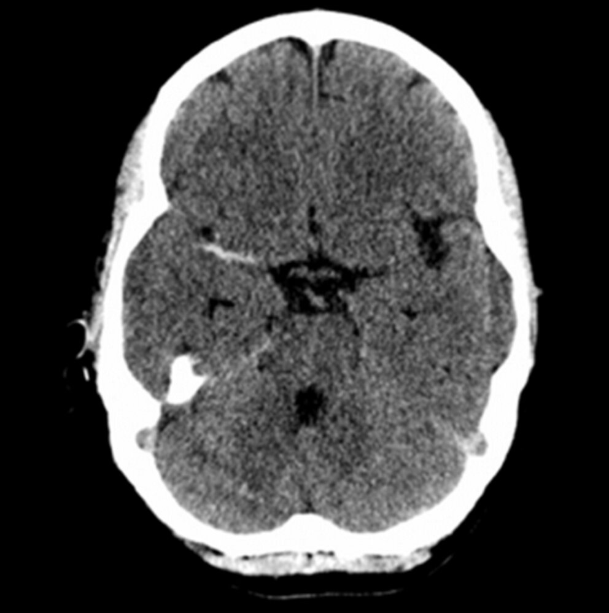

Hyperdense middle cerebral artery (MCA) sign

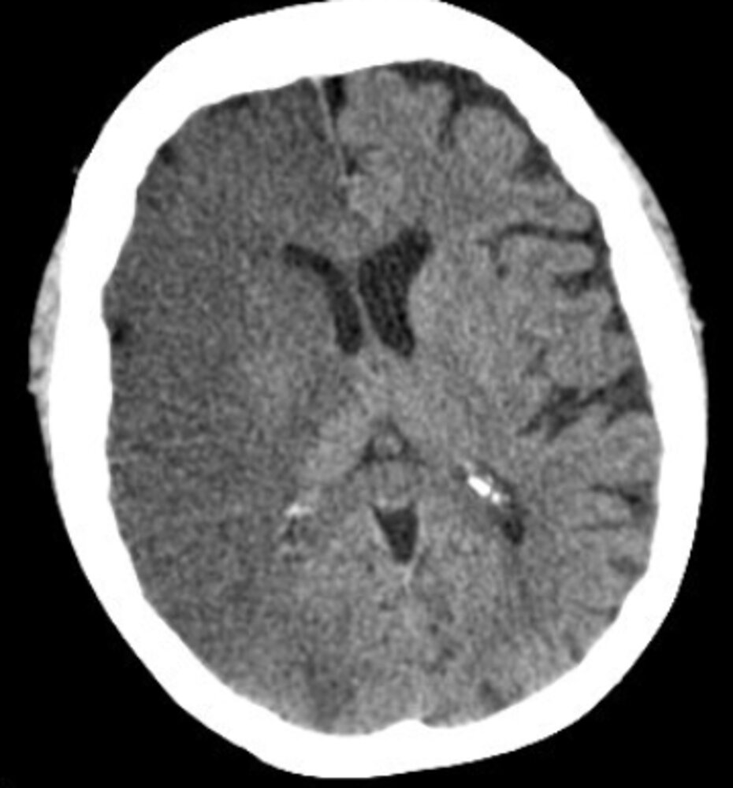

Acute ischemic stroke with hyperdense middle cerebral artery sign

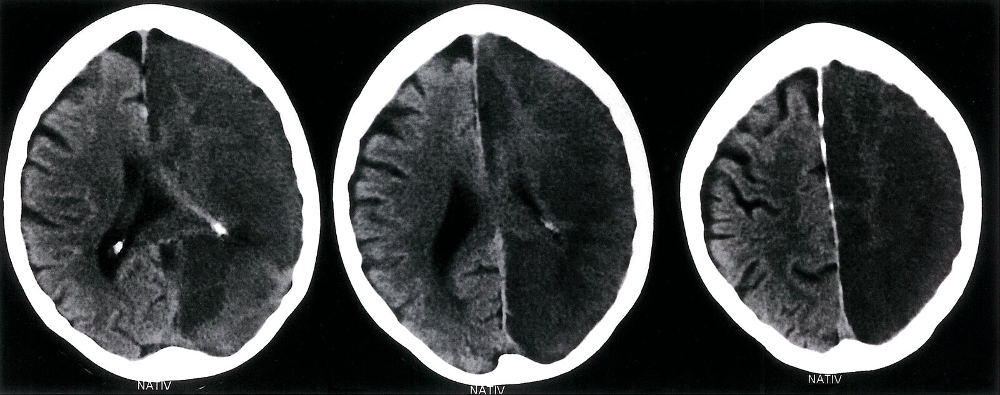

Large left hemispheric cerebral infarct

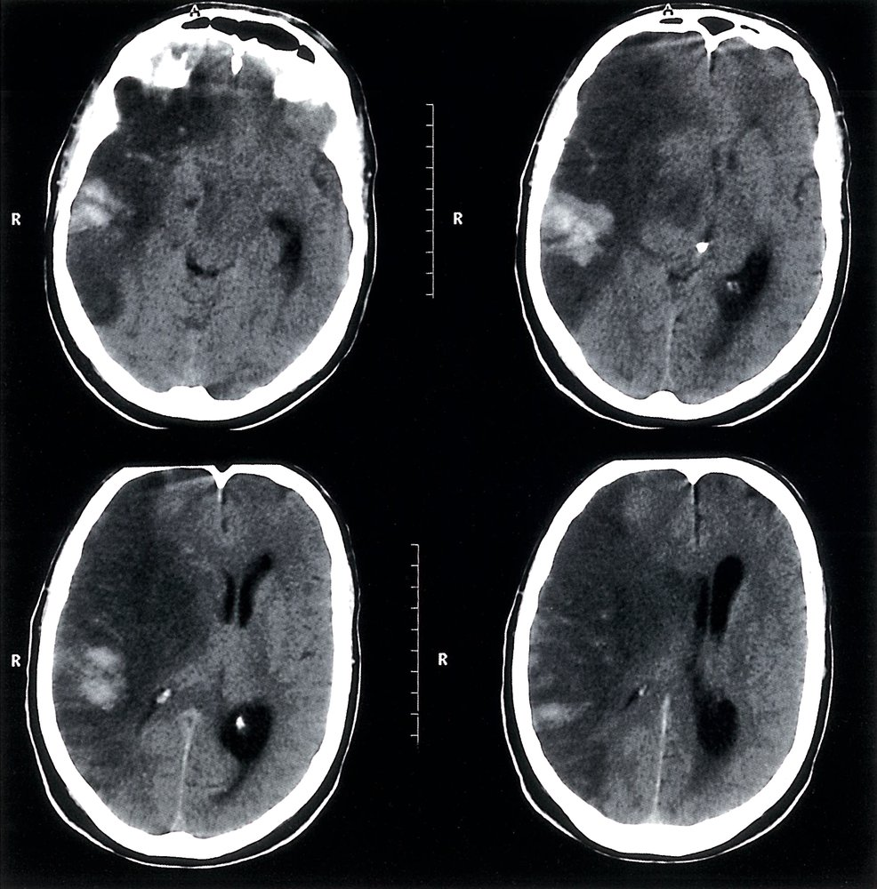

Subacute hemorrhagic cerebral infarct

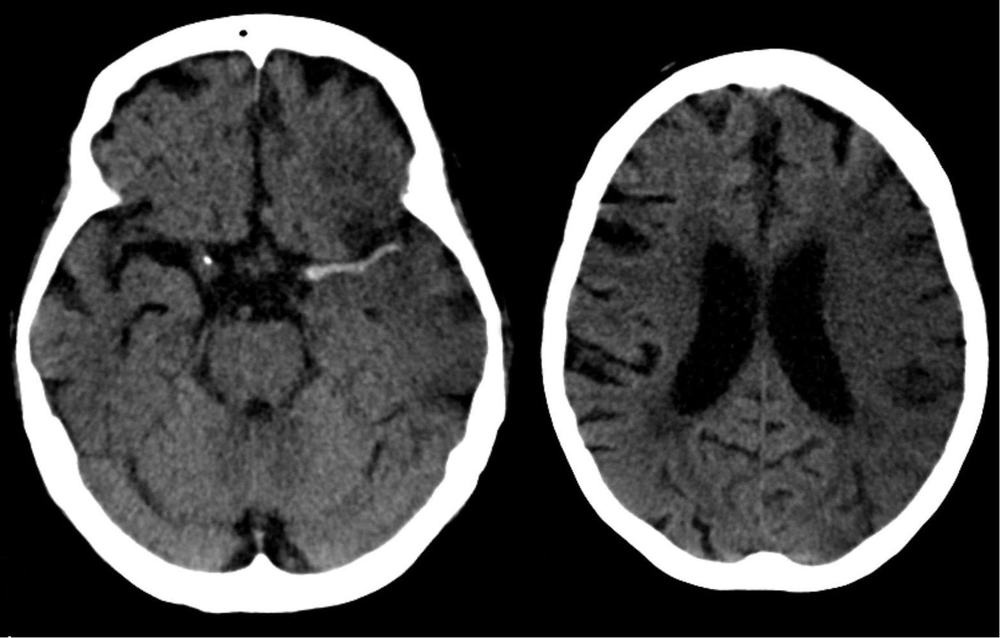

Hyperdense middle cerebral artery sign in stroke

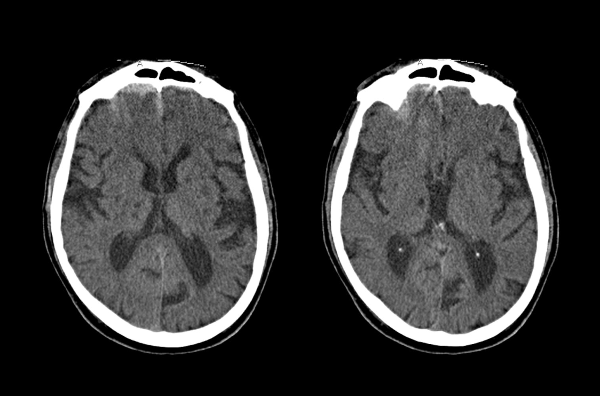

Chronic lacunar infarcts

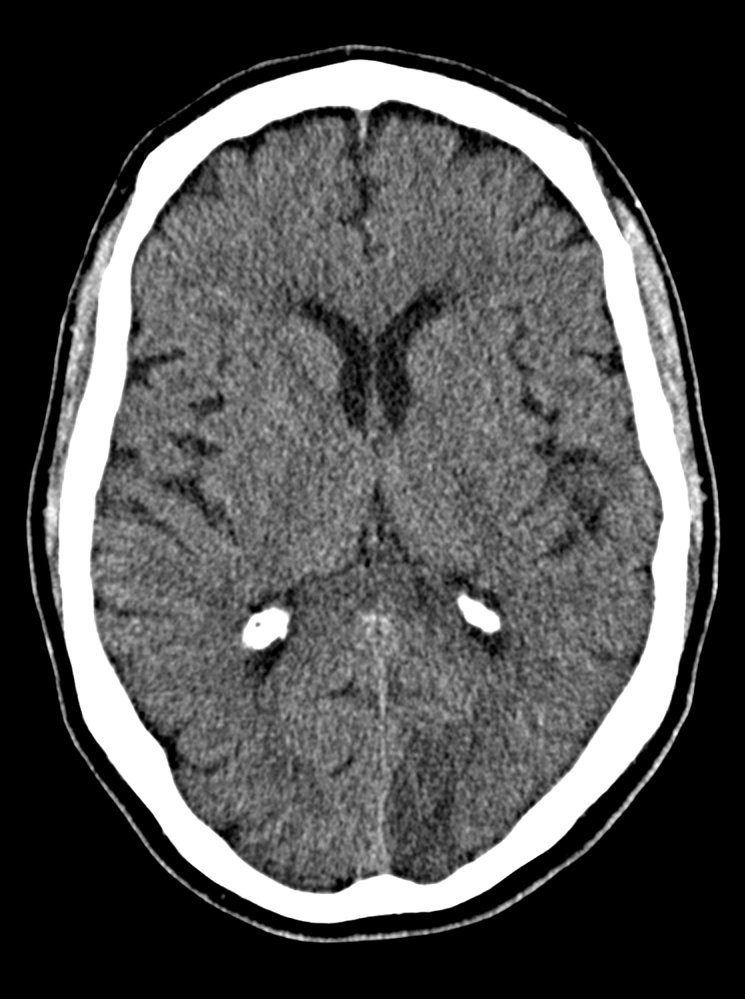

Subacute posterior cerebral artery infarct

### <u>MRI</u> <u>brain</u> [[14]](https://coursology-qbank.com/amboss/article/Jmbsg8)[[38]](https://coursology-qbank.com/amboss/article/RwbliD)[[45]](https://coursology-qbank.com/amboss/article/9AbNNw)

* Indications

* If readily available, <u>brain</u> <u>MRI</u> may be performed instead of noncontrast head CT. [[46]](https://coursology-qbank.com/amboss/article/Ewb8kD)

* Unclear time of onset or wake-up <u>stroke</u>: to determine eligibility for <u>thrombolysis</u>

* Signs or symptoms of a <u>posterior</u> circulation <u>infarct</u>

* <u>Stroke</u> protocols: includes <u>T1-weighted</u>, <u>T2-weighted</u>, fluid-attenuated <u>inversion</u> recovery (<u>FLAIR</u>), and <u>diffusion-weighted imaging</u> (<u>DWI</u>).

* Findings: The appearance of early <u>ischemic</u> lesions depends on the time and imaging sequence  [[30]](https://coursology-qbank.com/amboss/article/s9XtKZ0)[[47]](https://coursology-qbank.com/amboss/article/4CX3HZ0)

* Early acute (< 6 hours after event)

* Arterial <u>enhancement</u> or a <u>hyperdense</u> media sign may be visible.

* <u>DWI</u>: <u>Ischemic</u> lesion appears <u>hyperintense</u> within a few minutes (most sensitive modality).

* Late acute (6–24 hours after event)

* <u>T1-weighted</u>: <u>Ischemic</u> lesion appears <u>hypointense</u>.

* <u>T2-weighted</u> and <u>FLAIR</u>: <u>Ischemic</u> lesion appears <u>hyperintense</u>.

* Chronic <u>infarcts</u> can show variable signal intensity.

* Typical signal patterns can suggest an underlying etiology [[48]](https://coursology-qbank.com/amboss/article/OCXIHZ0)

* Cardioembolic: multiple lesions in different vascular territories

* Large <u>artery</u> <u>atherosclerosis</u>: scattered lesions in one vascular territory

> [!TIP]
> <u>DWI</u>-<u>FLAIR</u> mismatch indicates hyperacute <u>ischemic</u> <u>stroke</u> that occurred within the past 6 hours. [[47]](https://coursology-qbank.com/amboss/article/4CX3HZ0)

### Neurovascular studies [[11]](https://coursology-qbank.com/amboss/article/eRaxN4)[[14]](https://coursology-qbank.com/amboss/article/Jmbsg8)[[17]](https://coursology-qbank.com/amboss/article/97dNLr0)[[31]](https://coursology-qbank.com/amboss/article/wXchZY0)

* Goal: visualize intracranial and/or extracranial vascular occlusions and collateral vessels  [[14]](https://coursology-qbank.com/amboss/article/Jmbsg8)[[38]](https://coursology-qbank.com/amboss/article/RwbliD)

* Indications

* Confirming the diagnosis in patients with high clinical suspicion for <u>ischemic</u> <u>stroke</u> and equivocal noncontrast <u>neuroimaging</u>

* Identify candidates for vascular recanalization

* Large vessel <u>revascularization</u> (e.g., <u>carotid endarterectomy</u>): e.g., patients with nondisabling <u>stroke</u> (<u>modified Rankin scale</u> < 2) in the territory of the carotid <u>arteries</u>

* <u>Mechanical thrombectomy</u>: patients with acute <u>ischemic</u> <u>stroke</u> presenting in a late time window (6–24 hours since time last seen normal)

* Timing: within 24 hours if not already done at admission

* Options: Choose modality based on individual patient risks and resource availability.

* Advanced <u>neuroimaging</u>

* <u>CTA</u> head and neck (most common): often directly follows noncontrast CT head in many <u>stroke neuroimaging</u> protocols

* <u>MR angiography</u> head and neck

* <u>Perfusion-weighted imaging</u>: to assess the presence and size of the <u>ischemic penumbra</u>  [[17]](https://coursology-qbank.com/amboss/article/97dNLr0)[[30]](https://coursology-qbank.com/amboss/article/s9XtKZ0)[[49]](https://coursology-qbank.com/amboss/article/kbbmFH)[[50]](https://coursology-qbank.com/amboss/article/ObbIFH)

* <u>Ultrasound</u> studies

* <u>Carotid artery duplex</u>: to evaluate extracranial vasculature

* Transcranial doppler: to evaluate intracranial vasculature  [[51]](https://coursology-qbank.com/amboss/article/9wbNOD)

* <u>Digital subtraction angiography</u> (<u>DSA</u>): Invasive, catheter-based <u>gold standard</u> for cerebral vessel assessment  [[52]](https://coursology-qbank.com/amboss/article/m9bVLD)

* Findings

* <u>CTA</u>/<u>MR angiography</u> [[38]](https://coursology-qbank.com/amboss/article/RwbliD)

* Large vessel occlusion(s)

* Vascular dissection (e.g., <u>dissection of the carotid or vertebral artery</u>)

* <u>Carotid artery stenosis</u>

* CT <u>perfusion</u>

* <u>Ischemic penumbra</u>: reduced <u>cerebral blood flow</u> and blood volume

* <u>Ischemic core</u>: severely reduced <u>cerebral blood flow</u> and blood volume PLUS increased mean transit time

* <u>MR perfusion</u>: A <u>perfusion-diffusion mismatch</u> indicates the presence of a potentially salvageable <u>penumbra</u>.

> [!TIP]
> In potential candidates for <u>mechanical thrombectomy</u>, perform <u>CTA</u> immediately following noncontrast CT. If indicated, <u>thrombolysis</u> can be performed simultaneously. [[14]](https://coursology-qbank.com/amboss/article/Jmbsg8)

> [!WARNING]
> If indicated, do not delay <u>CTA</u> to wait for <u>creatinine</u> or <u>TSH</u> levels, as the risk of <u>iodine-induced hyperthyroidism</u> and <u>contrast-induced nephropathy</u> is relatively low, especially in patients with no known history of <u>thyroid</u> or renal abnormalities. [[36]](https://coursology-qbank.com/amboss/article/XCX9qZ0)[[40]](https://coursology-qbank.com/amboss/article/u9Xp6Z0)[[53]](https://coursology-qbank.com/amboss/article/8zaOuM)[[54]](https://coursology-qbank.com/amboss/article/aCXQqZ0)

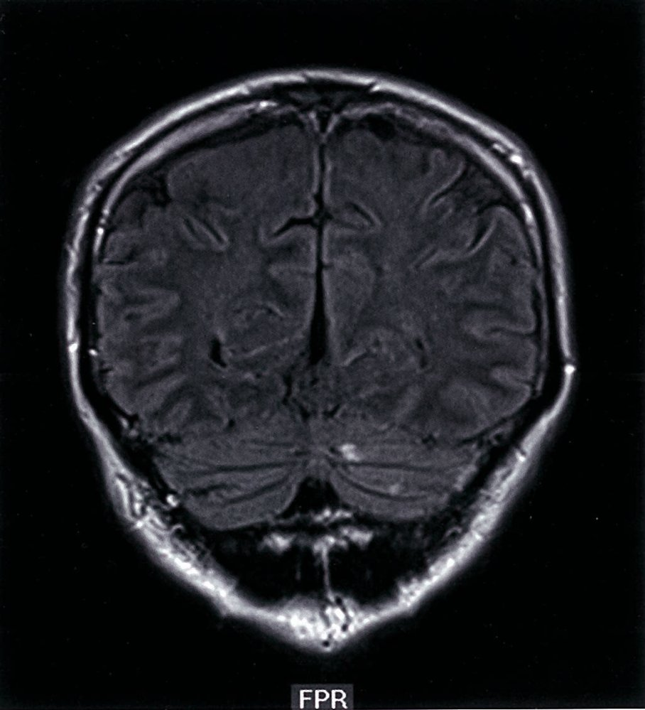

Hyperintense lesions in cerebellar infarction

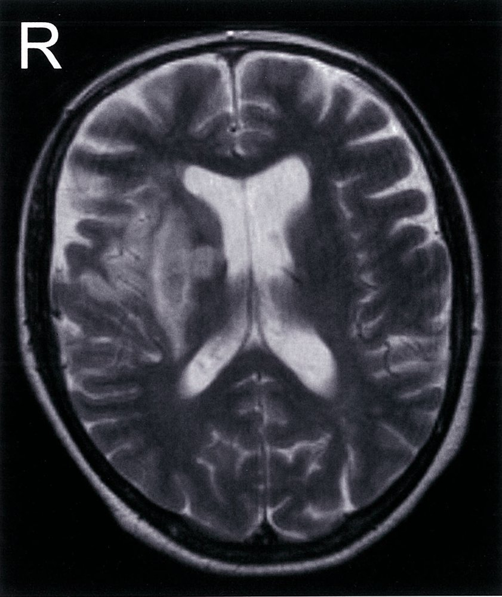

Right middle cerebral artery infarction

---

## Pathology

### Patterns of <u>necrosis</u> in <u>ischemic</u> <u>stroke</u> [[55]](https://coursology-qbank.com/amboss/article/fUYkco)

* General: <u>infarction</u> → <u>liquefactive necrosis</u>;   → cystic cavity formation

* Two main responses to <u>brain</u> tissue <u>ischemia</u>

* <u>Selective neuronal necrosis</u>: more likely to occur with transient <u>ischemia</u>

* Pannecrosis: more likely to occur with irreversible <u>ischemia</u> (e.g., <u>infarction</u>)

* Irreversible neuronal injury begins ∼ 5 minutes after tissue <u>hypoxia</u>.

* See “<u>Cellular changes and adaptive responses</u>.”

> [!NOTE]
> <u>Infarction</u> of <u>brain</u> tissue is typically followed by <u>liquefactive</u> <u>necrosis</u>, in contrast to the coagulative <u>necrosis</u> seen after <u>infarction</u> in other organs.

#### Selective neuronal necrosis

* Definition: selective destruction of nerve cells with sparing of <u>glial cells</u>

* Mechanism

* Transient <u>ischemia</u> → subsequent reperfusion (e.g., resuscitation following <u>cardiac arrest</u>) → increased metabolic demand, release of toxic excitatory <u>neurotransmitters</u> → <u>ischemic</u> injury

* Certain <u>neurons</u> are more susceptible to <u>ischemic</u> injury. 

* <u>Pyramidal cells</u> of the <u>hippocampus</u>: Damage causes <u>anterograde amnesia</u>.

* Purkinje cells of the <u>cerebellum</u>: Damage causes <u>intention tremor</u>, <u>nystagmus</u>, and <u>ataxia</u>.

* <u>Pyramidal cells</u> of <u>neocortex</u>: Symptoms depend on the affected <u>brain</u> region.

* <u>Histology</u>: neuronal <u>necrosis</u> with viable <u>glial cells</u> (which can proliferate and cause a laminar or pseudolaminar tissue architecture)

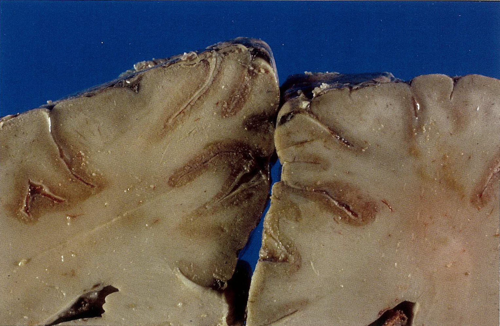

Selective neuronal necrosis

#### Pannecrosis

* Definition: the <u>death</u> of all cell types in a given region of the <u>brain</u>, including <u>neurons</u>, <u>glial cells</u>, and vascular cells

* Mechanism: permanent <u>ischemia</u>

* <u>Histology</u>: cystic lesions and loss of tissue architecture

### Histologic changes in the infarcted region [[55]](https://coursology-qbank.com/amboss/article/fUYkco)[[56]](https://coursology-qbank.com/amboss/article/vOYA86)

| Time from start of <u>ischemia</u> | Histologic features |
| --- | --- |
| 12–24 hours |  * Red neurons (eosinophilic <u>cytoplasm</u> + <u>pyknotic</u> <u>nucleus</u>)   |
| 1–3 days |   * <u>Neutrophils</u>  * <u>Liquefactive necrosis</u>    |
| 3–5 days |  * <u>Macrophages</u> (<u>microglia</u>, <u>CD40</u>-positive)   |
| 5–15 days |   * <u>Reactive gliosis</u> (<u>astrocytes</u>)  * Vascular <u>proliferation</u>    |
| > 15 days |   * <u>Glial scarring</u>  * Cyst formation    |

* Areas and cells most vulnerable to <u>hypoxia</u>

* <u>Neocortex</u>

* <u>Hippocampus</u>

* Purkinje cells (<u>cerebellum</u>)

* <u>Watershed areas</u>

> [!NOTE]
> The hippocampus, neocortex, Purkinje cells, and watershed areas are the areas most vulnerable to <u>hypoxia</u>: Vulnerable hippos Need PURe water.

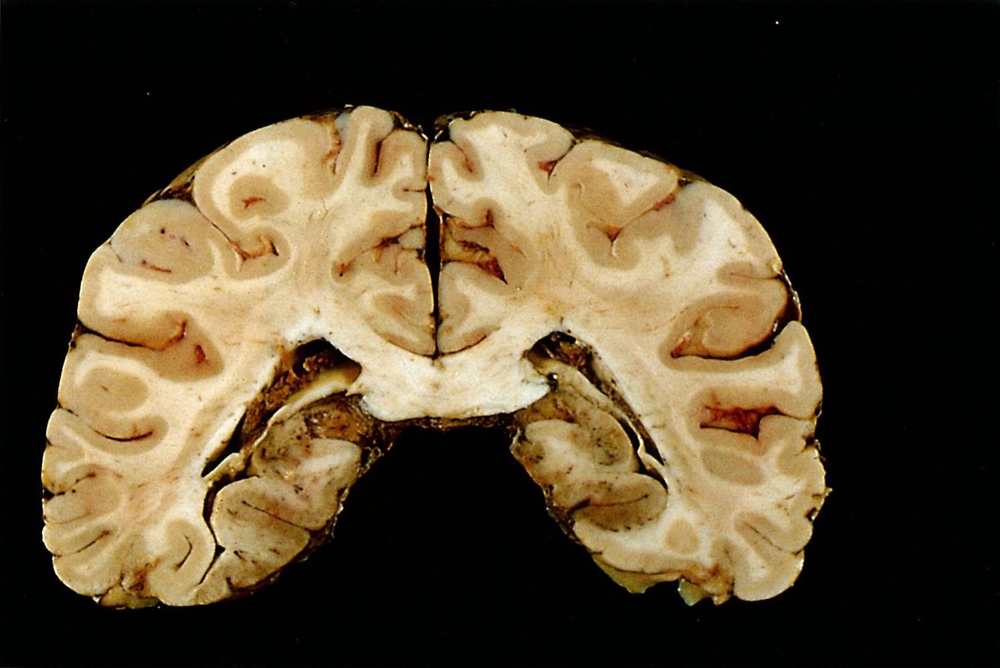

Bilateral ischemic stroke in the calcarine sulcus

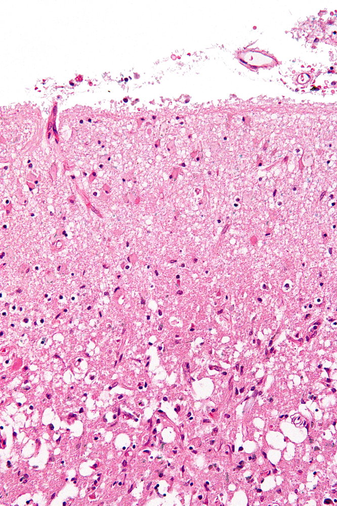

Reactive gliosis

References:[[55]](https://coursology-qbank.com/amboss/article/fUYkco)[[56]](https://coursology-qbank.com/amboss/article/vOYA86)

---

## Treatment

### Therapeutic approach [[14]](https://coursology-qbank.com/amboss/article/Jmbsg8)

* Treat all eligible patients with reperfusion therapy for acute <u>ischemic</u> <u>stroke</u> within recommended time frames.

* Continue <u>supportive care for ischemic stroke</u> including <u>neuroprotective measures</u>.

* Initiate measures for <u>reducing subsequent stroke risk</u>.

* Start antiplatelet treatment with <u>aspirin</u> or <u>clopidogrel</u> within 24–48 hours after symptom onset.

* Treat underlying conditions: e.g., <u>atrial fibrillation</u>, <u>carotid artery stenosis</u>, <u>carotid or vertebral artery dissection</u>

* Reduce <u>modifiable risk factors</u>: e.g., smoking, <u>hypertension</u>, <u>hyperlipidemia</u>, <u>diabetes</u>

* Monitor and treat any complications.

* Provide early <u>rehabilitation</u> and mobilization.

---

## Reperfusion therapy

### General principles [[14]](https://coursology-qbank.com/amboss/article/Jmbsg8)

* Identify eligible candidates and initiate treatment as soon as possible.

* Goal: to prevent further tissue <u>ischemia</u> and irreversible <u>infarction</u>

* Commonly used treatment options include intravenous <u>thrombolytic therapy</u> and <u>mechanical thrombectomy</u>.

* The <u>effectiveness</u> of intraarterial <u>thrombolysis</u> is unclear.

> [!NOTE]
> Time is <u>brain</u>! Reperfusion therapy should not be delayed. However, <u>intracranial hemorrhage</u> is a contraindication for reperfusion therapy and must be ruled out first.

### Intravenous <u>thrombolysis</u> [[14]](https://coursology-qbank.com/amboss/article/Jmbsg8)

Inclusion and exclusion criteria for <u>thrombolysis</u> are not strict and treatment decisions should be made in consultation with a <u>neurologist</u> taking into account multiple individual patient factors.

* Agents: intravenous <u>recombinant tissue plasminogen activator</u> (<u>tPA</u>)

* <u>Alteplase</u> DOSAGE

* OR <u>tenecteplase</u> DOSAGE  [[14]](https://coursology-qbank.com/amboss/article/Jmbsg8)[[17]](https://coursology-qbank.com/amboss/article/97dNLr0)[[57]](https://coursology-qbank.com/amboss/article/neb7zs)

* Inclusion criteria

* No evidence of <u>stroke mimic</u> or <u>intracranial hemorrhage</u>

* Acute disabling neurological symptoms

* Time from onset of symptoms or last seen normal (or at baseline)

* < 3 hours: patients ≥ 18 years old with any disabling <u>stroke</u> (including mild disabling or severe <u>stroke</u>)  [[14]](https://coursology-qbank.com/amboss/article/Jmbsg8)

* 3–4.5 hours: select patients (consult <u>neurology</u>)

* Unclear symptom onset > 4.5 hours from last known baseline state (e.g., wake-up <u>stroke</u>): <u>MRI</u> findings determine whether <u>thrombolysis</u> is indicated.

> [!TIP]
> If a patient is unable to consent to treatment (e.g., <u>altered mental status</u>, <u>aphasia</u>) and a legal representative is not immediately present, IV <u>alteplase</u> can still be administered in eligible patients with disabling <u>stroke</u> symptoms. [[14]](https://coursology-qbank.com/amboss/article/Jmbsg8)

> [!WARNING]
> Do not wait on <u>coagulation parameters</u> before administering <u>tPA</u> in patients with no known history of <u>coagulopathy</u> or <u>thrombocytopenia</u>. Discontinue treatment if <u>platelets</u> are < 100,000/mm3, <u>INR</u> > 1.7 or <u>PT</u> is abnormally elevated. [[14]](https://coursology-qbank.com/amboss/article/Jmbsg8)

|  Exclusion criteria for thrombolysis in acute ischemic stroke [[14]](https://coursology-qbank.com/amboss/article/Jmbsg8)  |  |  |
| --- | --- | --- |
|  | <u>Absolute contraindications</u> |  <u>Relative contraindications</u>   |
| Preexisting conditions |   * Recent <u>ischemic</u> <u>stroke</u> or severe <u>head trauma</u> (≤ 3 months ago)  * Recent intracranial or intraspinal <u>surgery</u> (≤ 3 months ago)  * History of <u>intracranial hemorrhage</u>  * GI <u>malignancy</u> or recent <u>GI bleed</u> (≤ 21 days ago)  * Intraaxial <u>intracranial neoplasm</u>    |   * Recent major <u>surgery</u> or trauma (not including head) (< 14 days ago)  * History of <u>bleeding diathesis</u> or <u>coagulopathy</u>  * Current <u>malignancy</u>  * History of cerebral microbleeding  * History of <u>GI bleeding</u> (> 21 days ago) or genitourinary bleeding  * Known left atrial or ventricular <u>thrombus</u>  * <u>Pregnancy</u> or early <u>postpartum period</u> (< 14 days after delivery)  * Recent arterial puncture (< 7 days ago)    |
| Acute findings |   * Acute intracranial or <u>subarachnoid hemorrhage</u> [[14]](https://coursology-qbank.com/amboss/article/Jmbsg8)  * Acute <u>bleeding diathesis</u>   * <u>INR</u> > 1.7, <u>PT</u> > 15 sec, or <u>aPTT</u> > 40 sec  * <u>Low platelet count</u>: < 100,000/mm3  * Anticoagulation with <u>direct thrombin inhibitors</u> or direct <u>factor Xa inhibitors</u>  * Recent treatment dose of <u>LMWH</u> (< 24 hours)  * Active internal bleeding  [[58]](https://coursology-qbank.com/amboss/article/Yybndw)  * Acute <u>infective endocarditis</u>  * Acute <u>aortic arch</u> dissection  * Nondisabling minor <u>stroke</u> (<u>NIHSS</u> < 5)  * Large areas of marked <u>hypodensity</u> on CT  * Severe uncontrolled <u>hypertension</u> (BP > 185/110 mm Hg)  [[58]](https://coursology-qbank.com/amboss/article/Yybndw)    |   * Very severe <u>stroke</u> (<u>NIHSS</u> > 25) > 3 hours after event  * <u>Acute pericarditis</u>  * Intracranial conditions that may increase bleeding risk    |

> [!TIP]
> Some conditions commonly misconceived as contraindications for <u>thrombolysis</u> therapy include <u>antiplatelet therapy</u>, <u>end-stage renal disease</u>, and concurrent <u>MI</u>. In patients with preexisting disability or <u>dementia</u>, treatment decisions should be based on prestroke functionality and quality of life. [[14]](https://coursology-qbank.com/amboss/article/Jmbsg8)[[59]](https://coursology-qbank.com/amboss/article/C7dqLr0)

> [!WARNING]
> Severe hypo- or <u>hyperglycemia</u> (<u>glucose</u> < 50 mg/dL or > 400 mg/dL) and severe <u>hypertension</u> > 185/110 mm Hg should be treated before <u>tPA</u> administration. [[14]](https://coursology-qbank.com/amboss/article/Jmbsg8)

#### Complications of IV thrombolytic therapy [[14]](https://coursology-qbank.com/amboss/article/Jmbsg8)

* <u>Angioedema</u>: can compromise <u>airway</u>

* Stop <u>tPA</u> infusion and any <u>ACE inhibitors</u>.

* Secure <u>difficult airway</u>: See “<u>Management of angioedema</u>.”

* Medication protocol: differs from standard <u>treatment of bradykinin-mediated angioedema</u>. 

* Administer in rapid sequence.

* <u>Methylprednisolone</u> DOSAGE

* <u>Diphenhydramine</u> DOSAGE

* <u>Famotidine</u> DOSAGE

* If <u>edema</u> progresses despite initial treatment: Administer <u>epinephrine</u> DOSAGE OR <u>icatibant</u> DOSAGE. [[14]](https://coursology-qbank.com/amboss/article/Jmbsg8)

* <u>Intracranial hemorrhage</u>: suspect if sudden neurological deterioration or <u>headache</u>

* Stop <u>tPA</u> infusion and obtain immediate noncontrast head CT.

* Order urgent <u>CBC</u>, <u>coagulation panel</u>, <u>fibrinogen</u> level, blood <u>type and screen</u>, <u>crossmatching</u>.

* Consult neurosurgery and <u>hematology</u>.

* Administer <u>cryoprecipitate</u> DOSAGE.

* Administer <u>tranexamic acid</u> DOSAGE OR ε-<u>aminocaproic acid</u> DOSAGE.

* Maintain <u>neuroprotective measures</u>.

* See also “<u>Intracerebral hemorrhage</u>.”

* Extracranial hemorrhage: Specific management depends on the site and severity of bleeding.

#### Additional measures after <u>thrombolysis</u>

* Check blood pressure and neurological status frequently.

* Avoid invasive procedures, if possible.

* Obtain a follow-up head CT (without IV contrast) or <u>brain</u> <u>MRI</u> 24 hours after <u>thrombolysis</u>, prior to starting <u>anticoagulants</u> or <u>antiplatelet agents</u>.

### Mechanical thrombectomy [[14]](https://coursology-qbank.com/amboss/article/Jmbsg8)

* Description

* Physical retrieval or <u>aspiration</u> of the occluding <u>thrombus</u> via the <u>femoral artery</u> using a <u>stent</u> retriever and/or an <u>aspiration</u> catheter

* Must be performed at a dedicated <u>stroke center</u>

* Inclusion criteria  [[14]](https://coursology-qbank.com/amboss/article/Jmbsg8)

* Age ≥ 18 years

* Acute large <u>artery</u> occlusion;  causing a <u>stroke</u>: e.g., <u>proximal</u> <u>artery</u> occlusion in <u>anterior</u> cerebral circulation (M1) or occlusion of the <u>internal carotid artery</u>   [[17]](https://coursology-qbank.com/amboss/article/97dNLr0)

* Disabling <u>stroke</u> symptoms (<u>NIHSS</u> ≥ 6)

* Limited affected area on CT (<u>Alberta Stroke Program Early CT Score</u> ≥ 6)

* Previously independent in <u>ADLs</u> (prestroke <u>modified Rankin scale</u> (<u>mRS</u>) ≤ 1)

* Patients with symptom onset within the past 6 hours or selected patients with symptom onset between 6 and 24 hours ago

> [!TIP]
> Patients who are eligible for <u>tPA</u> should receive <u>thrombolysis</u> immediately, while <u>mechanical thrombectomy</u> is being considered. If indicated, <u>mechanical thrombectomy</u> should be performed without delay to assess the response to <u>thrombolysis</u>. [[14]](https://coursology-qbank.com/amboss/article/Jmbsg8)[[60]](https://coursology-qbank.com/amboss/article/c7dakr0)

---

## Supportive care and neuroprotective measures

### <u>Neuroprotective measures</u>

Follow standard measures, including the following specific targets for acute <u>ischemic</u> <u>stroke</u>: [[14]](https://coursology-qbank.com/amboss/article/Jmbsg8)

* <u>Targeted temperature management</u>: treat any temperature > 38°C

* Goals: Maintain <u>normothermia</u> and avoid <u>neurogenic fever</u>.

* <u>Hypothermia</u> is not recommended in acute <u>ischemic</u> <u>stroke</u>.

* <u>Glucose management for secondary brain injury</u> prevention

* <u>Hypoglycemia</u>: Treat if blood <u>glucose</u> is < 60 mg/dL.

* <u>Hyperglycemia</u>; : Treat to maintain blood <u>glucose</u> levels in a range of 140 to 180 mg/dL [[14]](https://coursology-qbank.com/amboss/article/Jmbsg8)

* Blood pressure: see “<u>Blood pressure management in acute ischemic stroke</u>” for details.

### <u>Supportive care</u>

* <u>Dysphagia</u> screening

* Keep patient <u>NPO</u> until the risk of <u>aspiration</u> has been assessed.

* See “<u>Dysphagia</u>” for further information on diagnostics and management.

* <u>VTE prophylaxis</u>: in addition to <u>antiplatelet therapy</u> and hydration [[14]](https://coursology-qbank.com/amboss/article/Jmbsg8)

* <u>Mechanical VTE prophylaxis</u> is preferred: intermittent pneumatic compression (<u>IPCs</u>).

* Benefits of <u>pharmacological VTE prophylaxis</u> are unclear.

* Early <u>rehabilitation</u> and mobilization

* Start normal enteral diet within 7 days if possible.

* Order <u>physiotherapy</u>, <u>occupational therapy</u>, and <u>speech therapy</u>. [[61]](https://coursology-qbank.com/amboss/article/TxX6DZ0)

* <u>Screen for depression</u>. [[14]](https://coursology-qbank.com/amboss/article/Jmbsg8)

---

## Reducing subsequent stroke risk

Further therapeutic goals consist of identifying and treating <u>risk factors</u> and underlying conditions to prevent recurrent <u>stroke</u>. [[14]](https://coursology-qbank.com/amboss/article/Jmbsg8)[[33]](https://coursology-qbank.com/amboss/article/ciaaq4)

### <u>Antiplatelet therapy</u> [[14]](https://coursology-qbank.com/amboss/article/Jmbsg8)[[31]](https://coursology-qbank.com/amboss/article/wXchZY0)[[33]](https://coursology-qbank.com/amboss/article/ciaaq4)

* Starting within first 24–48 hours after symptom onset

* <u>Aspirin</u> DOSAGE

* OR <u>clopidogrel</u> DOSAGE

* <u>Dual antiplatelet therapy</u> (<u>DAPT</u>): Consider starting 21-day course in patients with minor <u>stroke</u> symptoms (e.g., <u>NIHSS</u> ≤ 3–5), <u>aspirin</u> DOSAGE AND <u>clopidogrel</u> DOSAGE  [[22]](https://coursology-qbank.com/amboss/article/cCbaID)

* Long-term <u>antiplatelet therapy</u>

* Indicated in patients with noncardioembolic <u>stroke</u> to reduce the risk of recurrence

* Choose an agent based on individual <u>risk factors</u>, e.g., <u>aspirin</u> DOSAGE, <u>clopidogrel</u> DOSAGE, or combination therapy. [[62]](https://coursology-qbank.com/amboss/article/HzbK8w)[[63]](https://coursology-qbank.com/amboss/article/8WbOMs)

* Consult <u>neurology</u> for indication in patients with cardioembolic <u>stroke</u> and significant <u>atherosclerosis</u>.  [[14]](https://coursology-qbank.com/amboss/article/Jmbsg8)

> [!WARNING]
> Wait at least 24 hours before initiating antiplatelet treatment after <u>thrombolysis</u>.

### Management of underlying causes [[14]](https://coursology-qbank.com/amboss/article/Jmbsg8)[[31]](https://coursology-qbank.com/amboss/article/wXchZY0)[[33]](https://coursology-qbank.com/amboss/article/ciaaq4)

#### Large vessel disease

* All patients: Optimize medical management.

* Extracranial <u>artery</u> stenosis

* <u>Carotid artery stenosis</u>: Consider <u>carotid endarterectomy</u> or <u>carotid artery stenting</u> patients with relevant <u>ipsilateral</u> stenosis within 2–7 days of the event.

* <u>Vertebral artery</u> stenosis: intensive medical therapy advised (see “Treatment of <u>modifiable risk factors</u>”)

* Intracranial <u>artery</u> stenosis 

* 50–99%

* <u>Aspirin</u> DOSAGE is preferred over <u>warfarin</u>.

* Target BP < 140/90 mm Hg, start high-intensity <u>statin</u>, and advise at least moderate physical activity

* 70–99%: Consider adding <u>clopidogrel</u> DOSAGE to <u>aspirin</u> for up to 90 days

* Routine <u>angioplasty</u>, <u>stenting</u>, and <u>bypass surgery</u> are discouraged.

* <u>Arterial dissection</u>: treatment with <u>antithrombotic agents</u> for 3–6 months

#### Cardioembolic sources

* <u>Atrial fibrillation</u> or <u>atrial flutter</u>: anticoagulation with <u>warfarin</u> or <u>direct oral anticoagulant</u> is indicated regardless of frequency or persistence.

* Agents and dosages: See “<u>Anticoagulation regimens in atrial fibrillation</u>.”

* Timing: depends on risk of <u>hemorrhagic conversion</u> (specialist consultation advised)

* High risk (e.g., large <u>infarct</u> territory): Consider delaying > 14 days.

* Low risk: can start in 2–14 days

* Avoid concurrent oral anticoagulation and <u>antiplatelet therapy</u>, except in specific circumstances.

* <u>Patent foramen ovale</u>: Initiate <u>antiplatelet therapy</u> and refer to <u>neurologist</u> and cardiologist to consider <u>PFO</u> closure.

* <u>LV thrombus</u> or <u>cardiomyopathy</u> with left atrial <u>thrombus</u>: anticoagulation for 3 months

* <u>Valvular heart disease</u> and/or <u>prosthetic valve</u>

* <u>Valvular AF</u>: anticoagulation with <u>warfarin</u>

* <u>Mechanical valve</u> (mitral) and <u>stroke</u> prior to <u>surgery</u>: <u>aspirin</u> PLUS <u>warfarin</u>

* Other valvular diseases without another indication for anticoagulation: <u>antiplatelet therapy</u> typically preferred.

* Patients already on anticoagulation for <u>stroke</u> prevention: Consult <u>neurology</u> regarding management in the immediate post-<u>stroke</u> period.  [[64]](https://coursology-qbank.com/amboss/article/x7dELr0)[[65]](https://coursology-qbank.com/amboss/article/B7dzLr0)

* <u>Hypercoagulable states</u>: See “<u>Thrombophilia therapy</u>.”

> [!WARNING]
> Consult <u>neurology</u> for patients who experience breakthrough <u>stroke</u> while on <u>antithrombotic therapy</u>.

### Treatment of <u>modifiable risk factors</u> [[31]](https://coursology-qbank.com/amboss/article/wXchZY0)

#### <u>Management of ASCVD</u>

* <u>Lifestyle modifications for ASCVD prevention</u>

* Smoking: Offer <u>counseling on smoking cessation</u>.

* Advise <u>smoking cessation</u> or reduction for those who cannot discontinue tobacco.

* Avoid second-hand smoke exposure.

* Consider pharmacotherapy: e.g., <u>nicotine</u> replacement (<u>gums</u>, patches), <u>varenicline</u>, <u>bupropion</u>

* Diet and exercise

* A <u>heart</u>-healthy diet, e.g., a <u>Mediterranean diet</u>, is preferred over a low-fat diet.

* Patients who can exercise

* Moderate intensity: minimum 10 minutes 4 times/week

* High intensity: minimum 20 minutes 2 times/week

* Patients who cannot exercise: Refer to <u>physical therapy</u> and <u>rehabilitation</u>.

* <u>Lipid-lowering therapy for ASCVD</u>

* No <u>coronary artery disease</u> or cardioembolic source and <u>LDL cholesterol</u> > 100 mg/dL: Start <u>atorvastatin</u> DOSAGE.

* Other ASVCD present: lipid-lowering therapy with <u>statin</u> ± <u>ezetimibe</u> to a target <u>LDL cholesterol</u> < 70 mg/dL

* Management of comorbidities

* <u>Management of hypertension</u>

* Recommend <u>lifestyle changes for managing hypertension</u>, e.g., reducing <u>sodium</u> intake.

* <u>Antihypertensives</u>: for patients with known <u>hypertension</u> or sustained average BP ≥ 130/80 mm Hg

* Target BP < 130/80 mm Hg  [[31]](https://coursology-qbank.com/amboss/article/wXchZY0)

* Preferred agents: <u>thiazide diuretics</u>, <u>ACE-Is</u>, <u>ARBs</u>

* Optimize agent and dosage on an individual basis.

* <u>Management of diabetes mellitus</u>: glycemic control with <u>antihyperglycemics</u> as needed to maintain <u>HbA1c</u> < 7%

> [!TIP]
> The single most important treatable <u>risk factor</u> for preventing recurrent <u>stroke</u> is <u>hypertension</u>.

#### Other <u>modifiable risk factors</u>

* <u>Management of obesity</u>: Weight loss is recommended.

* Screen <u>BMI</u> of all patients.

* Provide directed <u>counseling on weight and diet changes</u> and referral to comprehensive weight loss program.

* <u>Obstructive sleep apnea</u> (<u>OSA</u>): Consider screening in patients with <u>risk factors for OSA</u>, and <u>CPAP</u> therapy for established <u>OSA</u>.

* Substance use

* <u>Alcohol</u> consumption: Eliminate OR reduce to ≤ 2 drinks/day for men and ≤ 1 drink/day for women.

* Provide <u>counseling on substance use disorders</u> and <u>rehabilitation</u> referrals for the following: 

* Patients using <u>CNS stimulants</u>

* Patients with <u>infectious endocarditis</u> due to IV substance use

---

## Prevention

See “<u>Primary prevention of stroke</u>.”

---