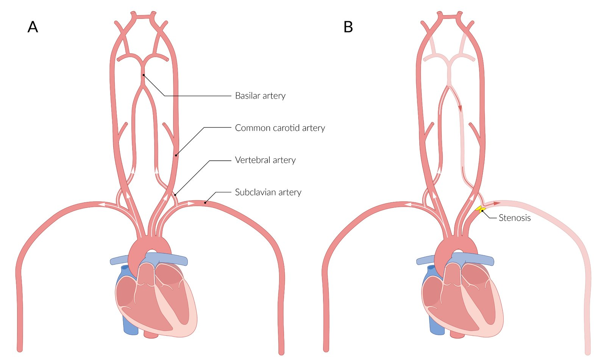

# Subclavian steal syndrome

*Categories: Clinical knowledge > Neurology > Vascular disorders and trauma > Subclavian steal syndrome*

[Original Article Link](https://coursology-qbank.com/amboss/article/bM0HMg)

---

## Summary

Subclavian steal syndrome (<u>SSS</u>) is a condition in which the <u>subclavian artery</u> <u>proximal</u> to the origin of the <u>vertebral artery</u> narrows or becomes occluded, usually due to <u>atherosclerosis</u>. This blockage results in a lack of blood reaching the <u>ipsilateral</u> arm through the <u>subclavian artery</u>, which can lead to a reversal of blood flow in the affected <u>vertebral artery</u> so that blood from the <u>contralateral</u> side can flow through the <u>circle of Willis</u> to supply the affected arm. The condition is mostly asymptomatic. If symptoms occur, they are mainly caused by <u>ischemia</u> of the affected arm and include limb <u>pain</u>, fatigue, <u>paresthesia</u>, and cold <u>skin</u>. Neurological symptoms such as <u>dizziness</u> or even <u>syncope</u> are rare and usually only occur in the presence of cerebrovascular lesions. A characteristic diagnostic sign is a discrepancy in blood pressure between the arms of > 15 mm Hg. Imaging (e.g., <u>ultrasonography</u>) can identify a reversal of blood flow and/or <u>atherosclerosis</u> that confirms the diagnosis. Endovascular intervention or <u>surgery</u> are used to treat symptomatic <u>SSS</u>.

---

## Etiology

* <u>Atherosclerosis</u>

* <u>Takayasu arteritis</u>

* Thoracic <u>surgery</u>

---

## Pathophysiology

Stenosis of the <u>subclavian artery</u> <u>proximal</u> to the origin of the <u>vertebral artery</u>;   → <u>hypoperfusion</u> <u>distal</u> to the stenosis → reversal of blood flow in <u>ipsilateral</u> <u>vertebral artery</u> → compensation through collateral <u>arteries</u>;   → reduced blood flow in the <u>basilar artery</u> → reduced cerebral <u>perfusion</u> upon exertion involving the affected arm [[1]](https://coursology-qbank.com/amboss/article/d40oRT)

Pathophysiology of subclavian steal syndrome

---

## Clinical features

* Most patients are asymptomatic

* Limb <u>ischemia</u> (on exertion)

* <u>Pain</u>, <u>paresthesia</u>

* Pale, cool <u>skin</u>

* Weak, delayed radial <u>pulse</u>

* Disparity in BP > 15 mm Hg

* Neurologic symptoms (due to <u>vertebrobasilar insufficiency</u>)

* <u>Dizziness</u>, <u>vertigo</u>

* Ocular findings (e.g., <u>diplopia</u>)

* <u>Syncope</u>

---

## Diagnosis

* Imaging of the cerebral and upper extremity <u>arteries</u>, e.g., via Doppler <u>ultrasound</u>; , <u>duplex ultrasound</u>, or <u>magnetic resonance angiography</u>, shows reversal of blood flow and/or <u>atherosclerosis</u>.

References:[[2]](https://coursology-qbank.com/amboss/article/c40aRT)[[3]](https://coursology-qbank.com/amboss/article/1402RT)[[4]](https://coursology-qbank.com/amboss/article/W40PRT)

---

## Treatment

* Asymptomatic patients usually do not require treatment apart from lifestyle changes to prevent progression of <u>atherosclerosis</u>.

* Symptomatic patients: <u>angioplasty</u> and <u>stenting</u> or surgical <u>revascularization</u>

References:[[2]](https://coursology-qbank.com/amboss/article/c40aRT)[[3]](https://coursology-qbank.com/amboss/article/1402RT)

---