# Subdural hematoma

*Categories: Clinical knowledge > Neurology > Vascular disorders and trauma > Subdural hematoma*

[Original Article Link](https://coursology-qbank.com/amboss/article/dR0oNf)

---

## Summary

Subdural <u>hematoma</u> (SDH) refers to bleeding into the intracranial <u>subdural space</u> that is typically caused by a rupture of the <u>bridging veins</u>. Trauma, including minor falls, <u>cerebral atrophy</u>, and conditions that increase the risk of bleeding (e.g., <u>coagulopathy</u>, <u>hypertension</u>) are common etiologies of SDH. According to the onset of symptoms, SDH can be classified into <u>acute SDH</u>, <u>subacute SDH</u>, and <u>chronic SDH</u>. Acutely symptomatic SDH typically manifests with <u>altered mental status</u>, <u>focal neurological signs</u>, and <u>signs of increased ICP</u>, and it can progress to <u>brain herniation</u> and <u>death</u> if not treated. <u>Chronic SDH</u> manifests gradually with cognitive deficits, impaired <u>memory</u>, <u>personality</u> changes, and <u>focal neurological signs</u>. <u>Subacute SDH</u> can manifest with features of acute and/or <u>chronic SDH</u>. In patients with acutely symptomatic SDH, <u>neuroprotective measures</u> to prevent <u>secondary brain injury</u> take precedence over diagnostics. Diagnosis is confirmed with a noncontrast head CT, which would show a crescent-shaped (<u>concave</u>) lesion that may cross <u>cranial sutures</u> typically located in the <u>supratentorial region</u>. <u>Surgery</u> is recommended in SDH that is symptomatic, ≥ 10 mm in size, or causing ≥ 5 mm shift in the midline. <u>Conservative management</u> can be considered for small asymptomatic SDHs in patients with no <u>signs of increased ICP</u>.

---

## Definitions

Subdural <u>hematoma</u> refers to a hemorrhage into the intracranial <u>subdural space</u>, which lies between the <u>dura mater</u> and the <u>arachnoid mater</u>. [[1]](https://coursology-qbank.com/amboss/article/tEYXxI)

---

## Classification

Depending on the length of time between the onset of symptoms and the inciting event, SDH can be classified into the following: [[2]](https://coursology-qbank.com/amboss/article/cCYaIr)[[3]](https://coursology-qbank.com/amboss/article/IZbY1H)

* <u>Acute SDH</u>: symptom onset within 3 days of the inciting event

* <u>Subacute SDH</u>: symptom onset 4–20 days after the inciting event

* <u>Chronic SDH</u>: symptom onset ≥ 21 days after the inciting event

---

## Etiology

SDH is caused by a rupture of the <u>bridging veins</u>, which can occur secondary to any of the following factors.

### <u>Acute SDH</u>  [[3]](https://coursology-qbank.com/amboss/article/IZbY1H)

* Most common cause: <u>blunt head trauma</u> (high-energy impact due to <u>motor vehicle accidents</u>)  [[9]](https://coursology-qbank.com/amboss/article/yZbdVH)

* <u>Nonaccidental trauma</u>, e.g., <u>shaken baby syndrome</u>

* <u>Acceleration-deceleration injury</u>  [[10]](https://coursology-qbank.com/amboss/article/AtbRTv)

### <u>Chronic SDH</u>  [[3]](https://coursology-qbank.com/amboss/article/IZbY1H)[[8]](https://coursology-qbank.com/amboss/article/f4bkiF)

#### Traumatic <u>chronic SDH</u>

* In adults: mild trauma secondary to falls (e.g., due to old age, <u>alcohol</u> use disorder, <u>epilepsy</u>, <u>hyponatremia</u>)

* In <u>infants</u> [[11]](https://coursology-qbank.com/amboss/article/24bTiF)

* <u>Nonaccidental trauma</u>, e.g., <u>shaken baby syndrome</u>

* <u>Birth trauma</u>

#### Nontraumatic <u>chronic SDH</u>

* In adults: <u>cerebral atrophy</u> ;  [[12]](https://coursology-qbank.com/amboss/article/g4bFiF)

* Advanced age

* <u>Alcohol use disorder</u> [[13]](https://coursology-qbank.com/amboss/article/V4bGRF)

* <u>Neurodegenerative disease</u>, such as:

* <u>Alzheimer disease</u>

* <u>Dementia</u> (including <u>HIV dementia</u>, <u>vascular dementia</u>)

* Chronic <u>diabetes mellitus</u> [[14]](https://coursology-qbank.com/amboss/article/e4bxRF)[[15]](https://coursology-qbank.com/amboss/article/U4bbiF)

* Previous <u>traumatic brain injury</u>

* Cerebral <u>irradiation</u> [[16]](https://coursology-qbank.com/amboss/article/T4b6iF)

* In <u>infants</u> and young children: <u>meningitis</u> [[11]](https://coursology-qbank.com/amboss/article/24bTiF)

* In both

* Increased risk of hemorrhage due to:

* <u>Antithrombotic therapy</u> or <u>coagulopathy</u>  [[4]](https://coursology-qbank.com/amboss/article/OZYIbn)

* <u>Intracranial aneurysm</u>

* Intracranial <u>arteriovenous malformation</u>

* <u>Intracranial tumors</u>

* <u>Hypertension</u>

* <u>Arteriosclerosis</u>

* <u>Hemodialysis</u>  [[17]](https://coursology-qbank.com/amboss/article/EZb8WH)

* <u>Iatrogenic</u> (e.g., after neurosurgical procedures)

* <u>Spontaneous intracranial hypotension</u> (rare) [[18]](https://coursology-qbank.com/amboss/article/S4byiF)

> [!TIP]
> SDH may occur after trivial trauma in patients with multiple <u>risk factors</u>.

> [!NOTE]
> Individuals at extremes of age (i.e., <u>infants</u> and the elderly) are at an increased risk of developing nontraumatic <u>chronic SDH</u>.

---

## Pathophysiology

* Rupture of <u>bridging veins</u> → low-pressure venous bleeding into the <u>subdural space</u> → SDH

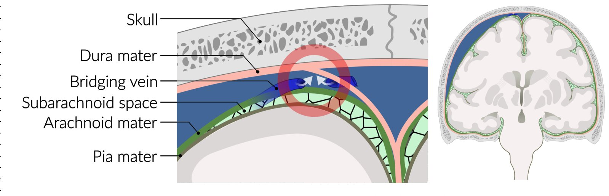

Subdural hematoma: Etiology

---

## Clinical features

Clinical features depend on the size and location of the <u>hematoma</u> and the length of time since the inciting event. In <u>infants</u> and young children unable to articulate symptoms, the presentation can be nonspecific (see <u>abusive head trauma</u>).

### Acute SDH [[2]](https://coursology-qbank.com/amboss/article/cCYaIr)[[3]](https://coursology-qbank.com/amboss/article/IZbY1H)[[9]](https://coursology-qbank.com/amboss/article/yZbdVH)

* Symptom onset

* Typically immediately after (or within 3 days of) the inciting event  [[19]](https://coursology-qbank.com/amboss/article/d0boUH)

* A <u>lucid interval</u> between <u>head injury</u> and onset of neurological symptoms is present in 12–40% of patients. [[9]](https://coursology-qbank.com/amboss/article/yZbdVH)

* Progression

* Rapid

* Can progress to <u>cerebral herniation</u> and <u>death</u>

* Clinical features

* Impaired consciousness and confusion, rapidly deteriorating to <u>coma</u>  [[2]](https://coursology-qbank.com/amboss/article/cCYaIr)

* <u>Focal neurological signs</u>, such as:

* <u>Contralateral</u> <u>hemiparesis</u> and <u>UMN signs</u>

* <u>Ipsilateral</u> <u>hemiparesis</u> due to <u>Kernohan syndrome</u> (<u>false localizing sign</u>; uncommon)

* <u>Cranial nerve palsies</u>, manifesting as:

* <u>Diplopia</u>

* Blurred <u>vision</u>

* Unequal <u>pupils</u>

* <u>Anosmia</u>

* Slurred and/or <u>disorganized speech</u>

* <u>Pupillary</u> abnormalities (e.g., <u>anisocoria</u>, unilateral or bilateral <u>fixed dilated pupils</u>)

* <u>Manifestations of ↑ ICP</u>, such as:

* <u>Headache</u>

* <u>Vomiting</u>

* <u>Cushing triad</u>

* Signs of <u>cerebral herniation syndromes</u>

* <u>Abnormal posturing</u> (e.g., <u>decorticate posturing</u>, <u>decerebrate posturing</u>)

* <u>Seizures</u>

* See ''<u>Clinical features of traumatic brain injury</u>'' for more information.

> [!TIP]
> Traumatic <u>acute SDH</u> and acute <u>EDH</u> have similar clinical manifestations and are indistinguishable without <u>neuroimaging</u>.

### Subacute SDH [[20]](https://coursology-qbank.com/amboss/article/1ub2Jv)

* Symptom onset

* 4–20 days after the inciting event

* Can be acute or insidious

* Progression: A rebleed can cause rapid neurological decline.

* Clinical features: a combination of features of <u>acute SDH</u> and <u>chronic SDH</u>

### Chronic SDH [[3]](https://coursology-qbank.com/amboss/article/IZbY1H)[[21]](https://coursology-qbank.com/amboss/article/uZbpWH)

* Symptom onset

* Insidious

* ≥ 3 weeks after the inciting event

* Progression: typically gradual

* Clinical features

* <u>Altered mental state</u> that can progress to <u>coma</u>, characterized by:

* Confusion

* <u>Delirium</u>

* Excessive drowsiness

* Recurrent <u>headaches</u>

* Cognitive deficits

* Impaired <u>memory</u>

* <u>Dementia</u>  [[22]](https://coursology-qbank.com/amboss/article/XFb9gv)

* <u>Focal neurological signs</u>

* <u>Contralateral</u> <u>hemiparesis</u> (most common) that can progress to <u>hemiplegia</u>

* Incontinence

* <u>Ataxia</u> and recurrent falls

* Changes in <u>personality</u> [[23]](https://coursology-qbank.com/amboss/article/1Fb2Sv)

* <u>Seizures</u> (rare)

---

## Diagnosis

### Important considerations [[5]](https://coursology-qbank.com/amboss/article/35YSPp)[[6]](https://coursology-qbank.com/amboss/article/ZyYZd7)

* Immediate initiation of <u>neuroprotective measures</u> takes precedence over diagnostics in patients with acutely symptomatic SDH.

* Traumatic <u>acute SDH</u>: Follow trauma protocols, i.e., <u>primary survey in TBI</u>.

* Diagnostics should not delay the transfer of a patient to a <u>neurocritical care unit</u> if needed.

### <u>Laboratory studies</u>

* Traumatic SDH: See ''Diagnostics'' in “<u>TBI</u>” for routine <u>laboratory studies</u> that should be obtained in all patients with <u>TBI</u>.

* Nontraumatic SDH: Workup for the underlying cause (See “Etiology”)

### <u>Neuroimaging</u> [[24]](https://coursology-qbank.com/amboss/article/tobXdu)[[25]](https://coursology-qbank.com/amboss/article/CNbqW8)

In <u>trauma patients</u>, findings of other injuries often accompany SDH, e.g., <u>skull fractures</u>, <u>cerebral edema</u>, and other types of <u>TBI</u>

#### CT head without IV contrast

* Indication: first-line imaging modality for suspected <u>acute SDH</u>

* Characteristic findings [[24]](https://coursology-qbank.com/amboss/article/tobXdu)

* Crescent-shaped, <u>concave</u>, sharply demarcated <u>extraaxial lesion</u>

* Can cross <u>cranial suture lines</u>

* Does not cross the midline

* A large unilateral SDH can cause midline shift to the <u>contralateral</u> side; midline shift may be absent or less significant in bilateral SDH. [[26]](https://coursology-qbank.com/amboss/article/vZbAWH)

* <u>Radiodensity</u> of the lesion depends on the length of time since the inciting event. 

* <u>Acute SDH</u>: <u>hyperdense</u>

* <u>Subacute SDH</u>: <u>isodense</u>  [[27]](https://coursology-qbank.com/amboss/article/iubJIv)

* <u>Chronic SDH</u>: <u>hypodense</u>

* Acute-on-<u>chronic SDH</u>: <u>hyperdense</u> areas (recent hemorrhage) admixed with <u>isodense</u> or <u>hypodense</u> areas (older <u>hematoma</u>)  [[4]](https://coursology-qbank.com/amboss/article/OZYIbn)[[28]](https://coursology-qbank.com/amboss/article/BZbzdH)

* Common locations

* <u>Supratentorial</u> location (most common)

* <u>Posterior cranial fossa</u>

* Interhemispheric  [[24]](https://coursology-qbank.com/amboss/article/tobXdu)[[29]](https://coursology-qbank.com/amboss/article/xZbEdH)

* Radiographic signs of other concurrent <u>TBIs</u> can be present, e.g., <u>EDH</u> with SDH.

Subdural hematoma and cerebral edema

Subdural hematoma

Subdural hematoma

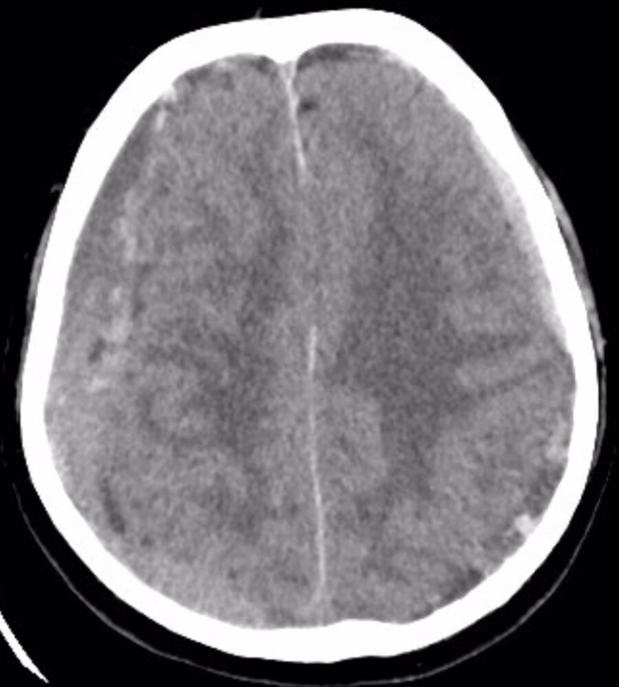

Bilateral subdural hematomas

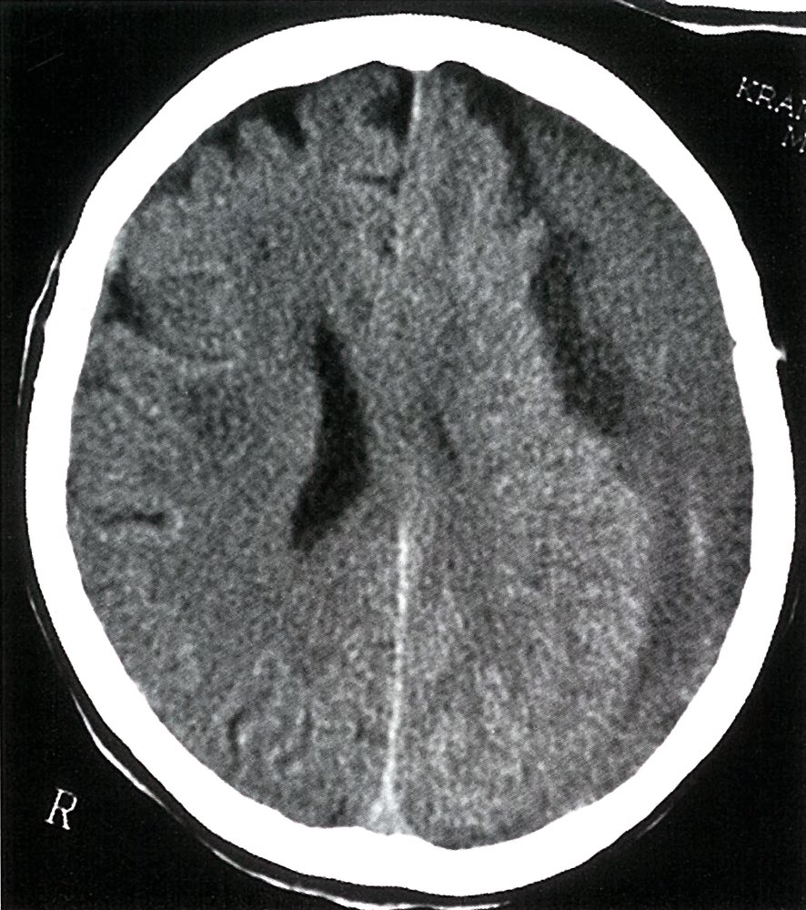

Chronic subdural hematoma

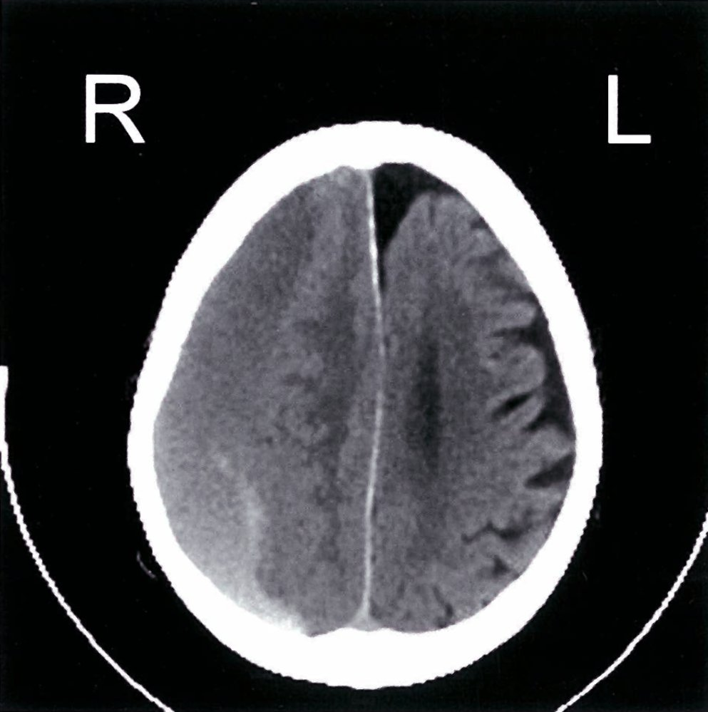

Acute-on-chronic subdural hematoma

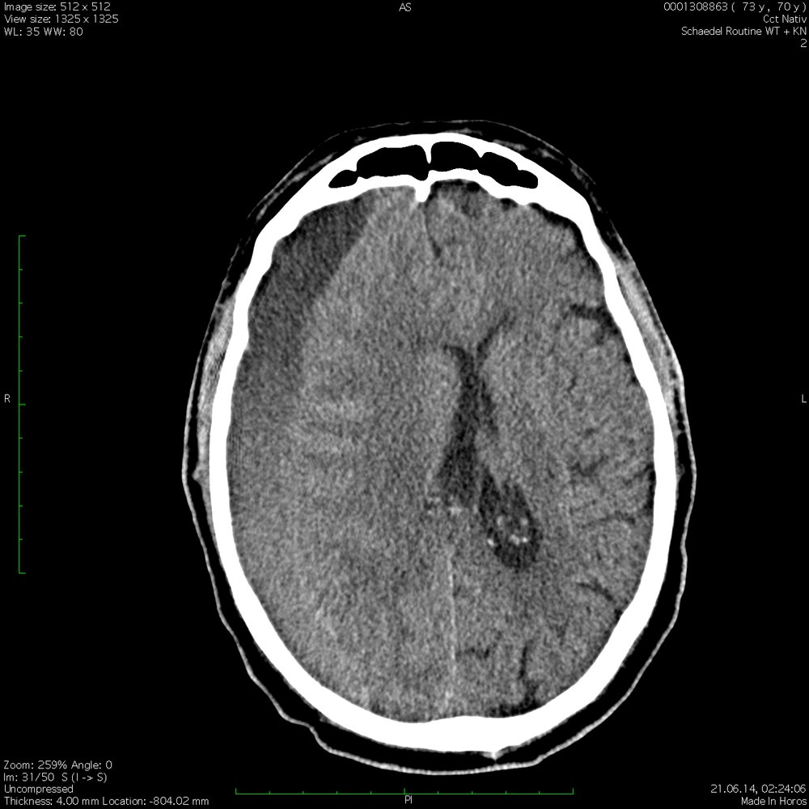

Acute-on-chronic subdural hematoma

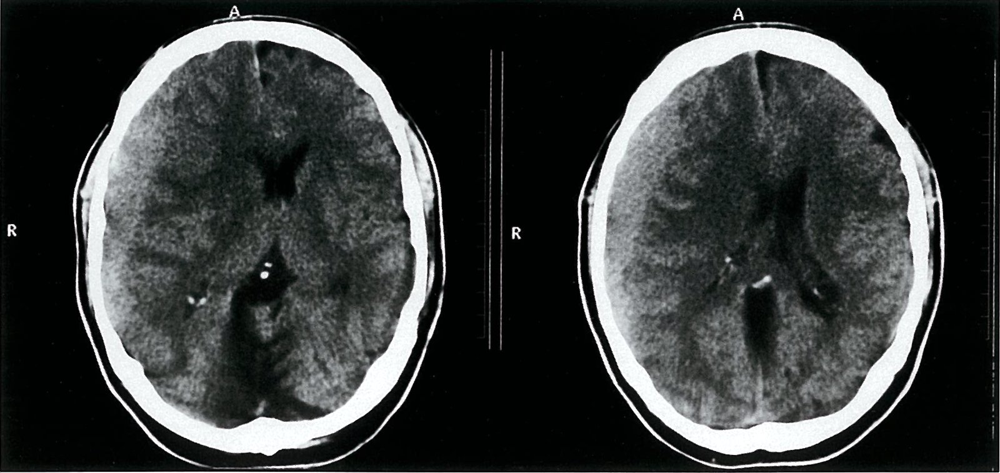

Acute subdural hematoma

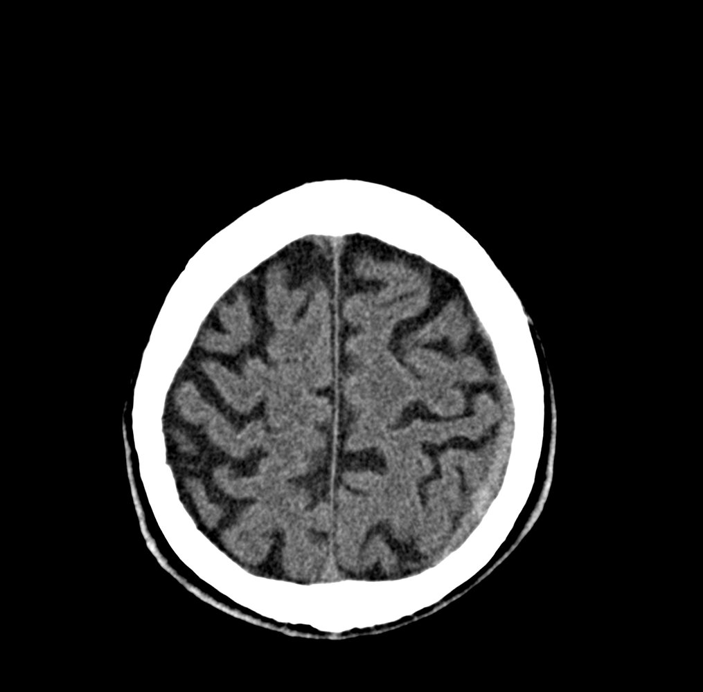

Acute subdural hematoma

Epidural and subdural hematomas

#### <u>MRI</u> head [[24]](https://coursology-qbank.com/amboss/article/tobXdu)[[25]](https://coursology-qbank.com/amboss/article/CNbqW8)

* Indications

* Neurological features unexplained by CT findings   [[2]](https://coursology-qbank.com/amboss/article/cCYaIr)

* Suspected <u>subacute SDH</u> or <u>chronic SDH</u>   [[24]](https://coursology-qbank.com/amboss/article/tobXdu)[[25]](https://coursology-qbank.com/amboss/article/CNbqW8)

* Evaluation for nontraumatic etiologies (e.g., <u>AVM</u>, dural <u>metastases</u>) [[29]](https://coursology-qbank.com/amboss/article/xZbEdH)[[30]](https://coursology-qbank.com/amboss/article/Bubztv)

* Characteristic findings [[24]](https://coursology-qbank.com/amboss/article/tobXdu)[[29]](https://coursology-qbank.com/amboss/article/xZbEdH)

* Similar to those on <u>CT scan</u>

* Intensity of the lesion on <u>T2-weighting</u> depends on the length of time since the inciting event.

* <u>Acute SDH</u>: <u>hypointense</u>    [[29]](https://coursology-qbank.com/amboss/article/xZbEdH)

* <u>Subacute SDH</u>: <u>hyperintense</u>   [[28]](https://coursology-qbank.com/amboss/article/BZbzdH)[[29]](https://coursology-qbank.com/amboss/article/xZbEdH)

* <u>Chronic SDH</u>: <u>hyperintense</u> core with a <u>hypointense</u> rim   [[29]](https://coursology-qbank.com/amboss/article/xZbEdH)

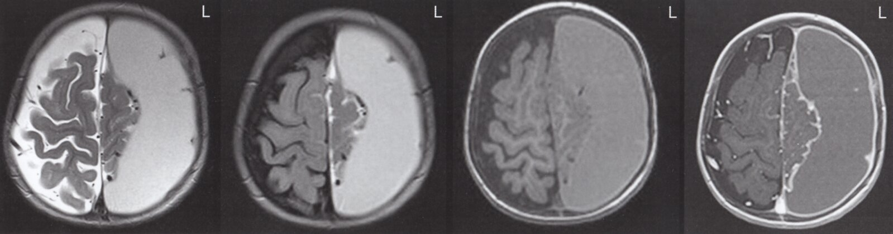

Subdural hematoma

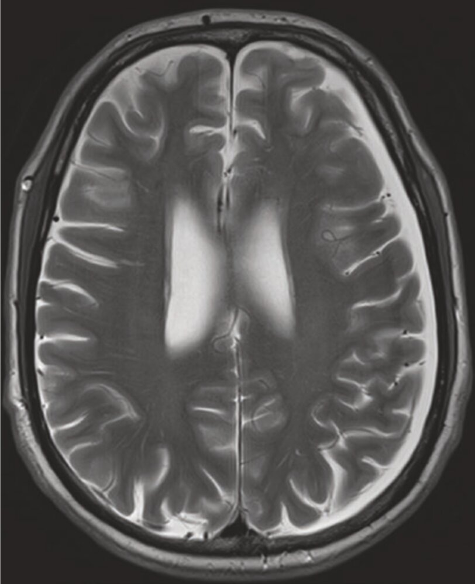

Chronic subdural hematoma

Subacute on chronic subdural hematoma

Abusive head trauma

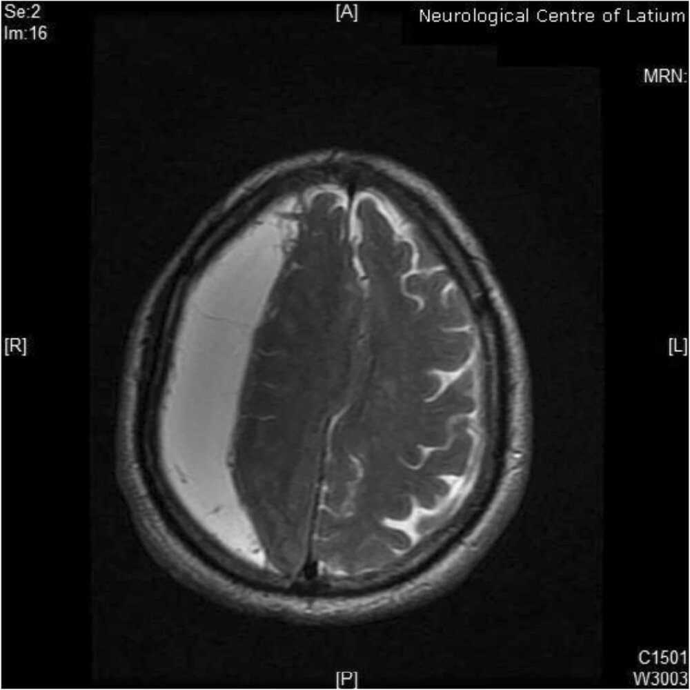

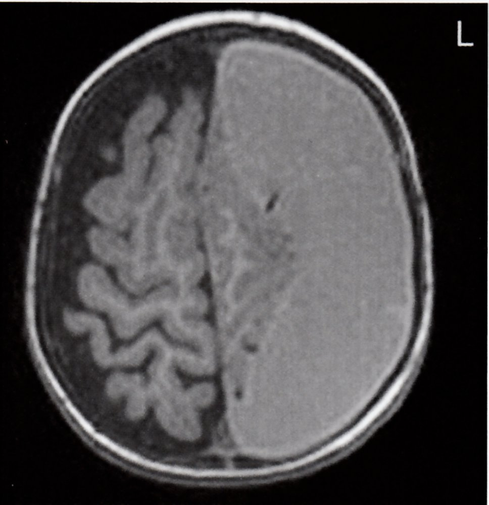

Subacute subdural hematoma and subdural hygroma (2/2)

### <u>Angiography</u> [[2]](https://coursology-qbank.com/amboss/article/cCYaIr)[[24]](https://coursology-qbank.com/amboss/article/tobXdu)

* Indication: to determine the etiology of a nontraumatic SDH (e.g., ruptured <u>aneurysm</u>, vascular meningeal <u>tumor</u>, <u>AVM</u>)

* Modalities

* <u>CTA</u>

* <u>MR angiography</u>

* <u>DSA</u>

---

## Treatment

### Approach

Specific <u>treatment of SDH</u> depends on the size of the <u>hematoma</u>, neurological status of the patient at presentation, and etiology (traumatic or nontraumatic). For patients with acute traumatic SDH, see also “<u>Management approach for TBI</u>”.

* Symptomatic SDH (acute, subacute, or chronic)

* Immediate neurosurgery consult and/or transfer to a <u>neurocritical care unit</u> if expertise is not available on site

* Medical management

* <u>Neuroprotective measures</u>

* Empiric <u>ICP management</u> if there are <u>signs of ↑ ICP</u>

* See also “<u>Initial management of TBI</u>.”

* Surgical management: <u>Hematoma</u> evacuation (see “Neurosurgical interventions”)

* Emergency temporizing measure: If there is rapid neurological decline (e.g., <u>cerebral herniation syndrome</u>) and <u>surgery</u> is delayed, consider immediate <u>burr hole craniotomy</u>, e.g., prior to interfacility transfer. [[32]](https://coursology-qbank.com/amboss/article/gwbFRD)[[33]](https://coursology-qbank.com/amboss/article/B50zmg)

* Asymptomatic SDH (acute, subacute, or chronic): urgent neurosurgery consult to determine surgical vs. <u>conservative management</u> and disposition.

* All patients

* <u>Supportive care</u>, monitoring, and <u>prevention of complications in brain injuries</u>

* Frequent <u>neurological examinations</u>

* Prevention of <u>secondary bleeding</u> or <u>hematoma</u> expansion, e.g., discontinuing <u>antithrombotics</u>, <u>anticoagulant reversal</u>, possible <u>platelet transfusion</u>

* Prevention of other complications as needed, e.g., <u>VTE</u>, <u>seizures</u>, <u>CNS</u> infections

* Treatment of reversible underlying causes for spontaneous SDH (e.g., management of <u>coagulopathy</u>, <u>hypertension</u>, <u>diabetes mellitus</u>)

* For patients with traumatic SDH see also “<u>Management of trauma patients</u>,” and “<u>TBI</u>.”

### Neurosurgical interventions [[4]](https://coursology-qbank.com/amboss/article/OZYIbn)[[9]](https://coursology-qbank.com/amboss/article/yZbdVH)[[26]](https://coursology-qbank.com/amboss/article/vZbAWH)

* Indications [[1]](https://coursology-qbank.com/amboss/article/tEYXxI)[[26]](https://coursology-qbank.com/amboss/article/vZbAWH)

* <u>Hematoma</u> size ≥ 10 mm

* Midline shift ≥ 5 mm

* Signs of <u>cerebral herniation syndromes</u> (e.g., <u>extensor posturing</u>, <u>anisocoria</u>)

* Rapid neurological deterioration (e.g., ≥ 2-point decrease in <u>GCS</u> score from the time of injury or symptom onset to ER transfer) [[9]](https://coursology-qbank.com/amboss/article/yZbdVH)

* Unilateral or bilateral <u>fixed dilated pupils</u>

* <u>ICP</u> > 20 mm Hg  [[9]](https://coursology-qbank.com/amboss/article/yZbdVH)

* Failure of <u>conservative management</u> [[26]](https://coursology-qbank.com/amboss/article/vZbAWH)

* Additional indications in <u>chronic SDH</u> include: [[4]](https://coursology-qbank.com/amboss/article/OZYIbn)

* Change in baseline neurological status

* Evidence of <u>mass effect</u>

* Increasing size of <u>hematoma</u>

* Timing

* <u>Acute SDH</u>: preferably within ≤ 4 hours of the inciting event  [[9]](https://coursology-qbank.com/amboss/article/yZbdVH)[[19]](https://coursology-qbank.com/amboss/article/d0boUH)

* <u>Subacute SDH</u> or <u>chronic SDH</u>: as soon as possible  [[34]](https://coursology-qbank.com/amboss/article/8DbOTD)

* Options 

* Signs of <u>cerebral herniation syndromes</u>: emergency <u>craniotomy</u> or <u>decompressive craniectomy</u>; consider emergency temporizing <u>burr hole craniotomy</u> if definitive neurosurgical management is delayed (e.g., requires interfacility transfer) [[19]](https://coursology-qbank.com/amboss/article/d0boUH)[[35]](https://coursology-qbank.com/amboss/article/g0bF2H)

* <u>Acute SDH</u>   [[9]](https://coursology-qbank.com/amboss/article/yZbdVH)[[19]](https://coursology-qbank.com/amboss/article/d0boUH)[[26]](https://coursology-qbank.com/amboss/article/vZbAWH)

* <u>Craniotomy</u> with evacuation of <u>hematoma</u>

* <u>Decompressive craniectomy</u>

* <u>Subacute SDH</u> and <u>chronic SDH</u> [[26]](https://coursology-qbank.com/amboss/article/vZbAWH)[[34]](https://coursology-qbank.com/amboss/article/8DbOTD)[[36]](https://coursology-qbank.com/amboss/article/j0b_fH)

* Definitive <u>surgery</u>: <u>Craniotomy</u> and clot evacuation (with/without drain placement)  [[21]](https://coursology-qbank.com/amboss/article/uZbpWH)[[37]](https://coursology-qbank.com/amboss/article/jDb_VD)

* Elderly or high surgical risk: Consider minimally invasive or bedside interventions, e.g., <u>twist drill craniostomy</u>. [[38]](https://coursology-qbank.com/amboss/article/4Db3eD)

> [!TIP]
> An SDH ≥ 10 mm in size or causing ≥ 5 mm midline shift should be surgically removed, even if the patient is asymptomatic. [[1]](https://coursology-qbank.com/amboss/article/tEYXxI)

### <u>Conservative management</u>

* Indications (all of the following): [[1]](https://coursology-qbank.com/amboss/article/tEYXxI)[[26]](https://coursology-qbank.com/amboss/article/vZbAWH)[[39]](https://coursology-qbank.com/amboss/article/9DbNgD)

* Asymptomatic

* <u>Hematoma</u> < 10 mm in size

* Midline shift < 5 mm

* Normal <u>pupillary reflex</u> and no <u>signs of ↑ ICP</u>, regardless of the <u>GCS</u> score

* <u>Acute SDH</u> [[1]](https://coursology-qbank.com/amboss/article/tEYXxI)[[26]](https://coursology-qbank.com/amboss/article/vZbAWH)

* Admit to <u>neurocritical care unit</u>.

* <u>Neuroprotective measures</u>

* <u>ICP</u> monitoring

* Serial <u>neurological examinations</u>  [[19]](https://coursology-qbank.com/amboss/article/d0boUH)

* Serial <u>neuroimaging</u>

* <u>Neuroimaging</u> should be repeated within the first 36 hours or earlier if there is neurological deterioration.  [[1]](https://coursology-qbank.com/amboss/article/tEYXxI)

* Subsequent <u>neuroimaging</u> may be repeated as needed.  [[40]](https://coursology-qbank.com/amboss/article/AZbRVH)

* Urgent <u>surgery</u> in patients with neurological deterioration and/or evidence of <u>hematoma</u> expansion on <u>neuroimaging</u>   [[19]](https://coursology-qbank.com/amboss/article/d0boUH)

* <u>Subacute SDH</u> or <u>chronic SDH</u>

* Disposition depends on the size and location of the <u>hematoma</u> and <u>neurological examination</u> findings.   [[4]](https://coursology-qbank.com/amboss/article/OZYIbn)

* <u>Corticosteroids</u> may have a role in aiding spontaneous regression of the <u>hematoma</u>.  [[34]](https://coursology-qbank.com/amboss/article/8DbOTD)[[41]](https://coursology-qbank.com/amboss/article/DDb1gD)

* <u>Surgery</u> may be required for patients who become symptomatic. [[34]](https://coursology-qbank.com/amboss/article/8DbOTD)

> [!TIP]
> All conservatively managed patients should also receive <u>supportive care</u>, monitoring, <u>secondary prevention</u> measures for complications, and treatment of reversible underlying conditions.

---

## Pre- XC clinician content for treatment section; has some postponed content that may be useful in the #future.

#### Initial management

* Acute traumatic SDH: see <u>Management approach for TBI</u> and <u>Moderate and severe TBI treatment</u>

* Acute atraumatic SDH and <u>chronic SDH</u>

* Protect the <u>airway</u> (see <u>Airway management</u>)

* Treat any associated <u>coagulopathy</u>

* Reverse anticoagulation (see <u>Anticoagulant</u> Reversal) [[45]](https://coursology-qbank.com/amboss/article/SFYyhI)

* Stop any further doses of <u>anticoagulants</u> and <u>anti-platelet agents</u>

* <u>Platelet transfusion</u> is recommended if <u>platelets</u> are < 100 and <u>surgery</u> is planned   [[46]](https://coursology-qbank.com/amboss/article/rv0fYR)[[47]](https://coursology-qbank.com/amboss/article/zZbrVH) 
* If on <u>antiplatelet therapy</u>: the decision to transfuse <u>platelets</u> should be individually based on factors such as severity, size and location of bleed, and <u>point of care tests</u>    [[47]](https://coursology-qbank.com/amboss/article/zZbrVH)

* Start general <u>neuroprotective measures</u> and <u>ICP management</u>

#### Ongoing management

* All patients require a neurosurgical consult

* In patients with a small SDH (<u>hematoma</u> is < 10 mm, midline shift < 5 mm) and no change to neurological status <u>conservative management</u> may be appropriate

* In all other patients, neurosurgical evacuation is required

### Surgical management [[9]](https://coursology-qbank.com/amboss/article/yZbdVH)[[26]](https://coursology-qbank.com/amboss/article/vZbAWH)

* Indicated for both acute and chronic patients if: 

* <u>Hematoma</u> is > 10 mm

* Midline shift > 5 mm

* There are signs of <u>herniation</u> e.g., <u>extensor posturing</u>

* Additional indications in <u>acute SDH</u> include:

* Rapidly deteriorating <u>neurological examination</u> (> 2 point decrease in <u>GCS</u>) with <u>GCS</u> < 8

* Fixed and <u>dilated pupils</u> (either unilateral or bilateral)

* <u>ICP</u> > 20 mmHg

* Additional indications in <u>chronic SDH</u> include:

* <u>GCS</u> is affected

* Neurological deficits are present

#### Surgical management in <u>acute SDH</u>

* Should occur within ≤ 4 hours of injury [[19]](https://coursology-qbank.com/amboss/article/d0boUH)

* The aim is to evacuate the <u>hematoma</u> and relieve <u>raised intracranial pressure</u>

* Surgical options include: [[19]](https://coursology-qbank.com/amboss/article/d0boUH)[[26]](https://coursology-qbank.com/amboss/article/vZbAWH)[[48]](https://coursology-qbank.com/amboss/article/20bT2H) 

* <u>Decompressive craniectomy</u>

* Cranioplastic <u>craniotomy</u>

* <u>Trephination</u>

* In <u>acute SDH</u> with impending <u>herniation</u>, can be used as a temporizing measure [[19]](https://coursology-qbank.com/amboss/article/d0boUH)[[35]](https://coursology-qbank.com/amboss/article/g0bF2H)

* Needs to be followed by either <u>decompressive craniectomy</u> or cranioplastic <u>craniotomy</u> [[19]](https://coursology-qbank.com/amboss/article/d0boUH)[[35]](https://coursology-qbank.com/amboss/article/g0bF2H)

#### Surgical management in subacute and <u>chronic SDH</u>

* Surgical technique depends on whether patients are high <u>anesthetic</u> risk and whether neomembranes have formed or not  [[26]](https://coursology-qbank.com/amboss/article/vZbAWH)[[49]](https://coursology-qbank.com/amboss/article/30bSfH)[[50]](https://coursology-qbank.com/amboss/article/R0blfH)[[51]](https://coursology-qbank.com/amboss/article/i0bJfH)

* No neomembranes or patient at high <u>anesthetic</u> risk: <u>twist drill craniostomy</u> +/- subdural evacuating port system (SEPS) [[26]](https://coursology-qbank.com/amboss/article/vZbAWH)

* Neomembranes

* <u>Burr hole evacuation</u>/<u>Trephination</u> [[26]](https://coursology-qbank.com/amboss/article/vZbAWH)

* <u>Craniotomy</u> evacuation (large or mini, with or without assisted endoscopy)

### <u>Conservative management</u>

* Some patients with both acute and <u>chronic subdural hematomas</u> may be suitable for <u>conservative management</u>

* In both cases there is no clear guidance on when anticoagulation and <u>antiplatelet agents</u> should be restarted; consult with neurosurgical service on when to restart [[1]](https://coursology-qbank.com/amboss/article/tEYXxI)

#### <u>Conservative management</u> of <u>acute SDH</u>

* Can be considered for patients with small <u>acute subdural hematomas</u> if: [[1]](https://coursology-qbank.com/amboss/article/tEYXxI)

* There is no <u>pupillary</u> abnormality

* No <u>intracranial hypertension</u> in patients with <u>GCS</u> < 9

* The <u>hematoma</u> is < 10 mm with midline shift < 5 mm

* Patients should be monitored in the <u>ICU</u>

* <u>ICP</u> should be monitored if <u>GCS</u> < 9 [[1]](https://coursology-qbank.com/amboss/article/tEYXxI)

* CT head should be repeated within the first 36 hours (sooner if there is neurological deterioration) [[1]](https://coursology-qbank.com/amboss/article/tEYXxI)

* <u>Surgery</u> should occur within < 2 hours of deterioration [[19]](https://coursology-qbank.com/amboss/article/d0boUH)

#### <u>Conservative management</u> of chronic and <u>subacute SDH</u>

* Indicated if the patient is: [[26]](https://coursology-qbank.com/amboss/article/vZbAWH)

* Asymptomatic

* No clinical signs of <u>herniation</u>

* <u>Hematoma</u> is < 10 mm with midline shift < 5 mm

* Patients should have close monitoring of their neurological status

* Patients require serial <u>CT scans</u> [[40]](https://coursology-qbank.com/amboss/article/AZbRVH)

---