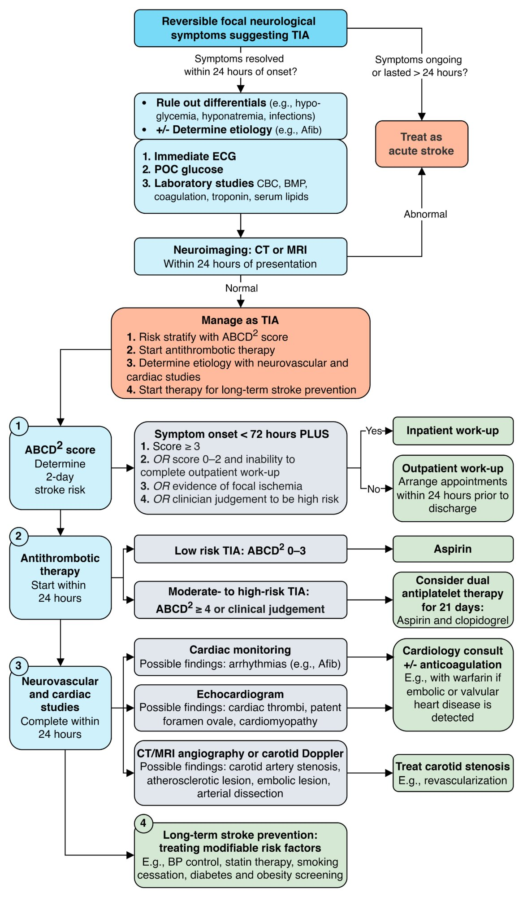

# Transient ischemic attack

*Categories: Clinical knowledge > Neurology > Vascular disorders and trauma > Transient ischemic attack*

[Original Article Link](https://coursology-qbank.com/amboss/article/6r0jRh)

---

## Summary

Transient <u>ischemic</u> attack (TIA) is a temporary, focal cerebral <u>ischemic</u> event that results in reversible neurological symptoms but is not associated with a visible acute <u>infarct</u> on <u>neuroimaging</u>. Cardiogenic embolism (e.g., from <u>atrial fibrillation</u>) and <u>atherosclerosis</u> (e.g., <u>carotid artery stenosis</u>) are the most commonly identified etiologies. Symptoms depend on the affected territory and may mimic an acute <u>stroke</u>; however, symptoms are transient. Because patients with TIA have an increased <u>stroke</u> risk, early diagnosis and initiation of secondary preventive therapies for subsequent <u>stroke</u> are vital. Management typically includes urgent <u>neuroimaging</u>, <u>antithrombotic therapy</u> (e.g., <u>antiplatelet therapy</u>), and prompt determination of the underlying cause (e.g., using <u>echocardiography</u> and neurovascular studies) to guide targeted preventative measures, such as the management of underlying <u>atrial fibrillation</u> or <u>carotid artery stenosis</u>.

See also “<u>Ischemic stroke</u>,” “<u>Overview of stroke</u>,” and “<u>Carotid artery stenosis</u>.”

---

## Definition

TIA refers to temporary, focal cerebral <u>ischemia</u> that results in reversible neurological deficits without acute <u>infarction</u> (i.e., imaging findings show no signs of <u>infarction</u>).  [[2]](https://coursology-qbank.com/amboss/article/wXchZY0)[[3]](https://coursology-qbank.com/amboss/article/75Y4lp)

---

## Etiology

* See “Etiology” in “<u>Ischemic stroke</u>.”

* Classification  [[7]](https://coursology-qbank.com/amboss/article/yobdeu)

* Cardioembolic (e.g., due to <u>atrial fibrillation</u>)

* Lacunar/small vessel disease (e.g., due to chronic <u>hypertension</u>)

* Large vessel disease/low-flow state (e.g., <u>atherosclerosis</u> of <u>MCA</u>, <u>severe carotid artery stenosis</u>)

* Blood disorders/<u>hypercoagulable states</u>

---

## Clinical features

* Neurological manifestations

* Acute, transient <u>focal neurological symptoms</u>

* Typically, symptoms last < 1 hour (the majority of cases resolve in < 15 minutes).

* Possibly <u>amaurosis fugax</u>

* Symptoms depend on the affected territory (see “<u>Stroke symptoms by affected vessels</u>” and “<u>Stroke symptoms by affected region</u>”) and etiology. [[8]](https://coursology-qbank.com/amboss/article/OLbIB8)

* Embolic: often a single, discrete episode lasting hours rather than minutes

* <u>Lacunar stroke</u>/small vessel disease: See “<u>Lacunar syndromes</u>.”

* Large vessel disease/low-flow state: often recurrent episodes lasting minutes

* Atypical symptoms may be seen.  [[9]](https://coursology-qbank.com/amboss/article/1pb2ou)

* Features suggesting a specific underlying cause

* <u>Atrial fibrillation</u>: <u>palpitations</u>, irregular <u>heart rate</u>

* <u>Carotid artery stenosis</u>: <u>carotid bruit</u>

* <u>Endocarditis</u>: <u>fever</u>, <u>heart murmur</u>, history of IV drug abuse

* <u>Aortic dissection</u>: <u>chest pain</u>, <u>hypotension</u>

* <u>Paradoxical embolism</u>: <u>features of DVT</u>

> [!TIP]
> Perform a full <u>physical examination</u> to assess for neurological deficits and look for evidence of specific causes.

Transient ischemic attack fact sheet

---

## Management

TIA is a <u>self-limiting</u> event that is most often diagnosed retrospectively and requires no specific treatment. The primary management goal is <u>stroke</u> prevention.

### Approach [[2]](https://coursology-qbank.com/amboss/article/wXchZY0)[[3]](https://coursology-qbank.com/amboss/article/75Y4lp)[[10]](https://coursology-qbank.com/amboss/article/Jmbsg8)

* Establish a <u>clinical diagnosis</u>, focusing on <u>symptoms of TIA</u>, their onset, and changes over time.

* Obtain an immediate <u>ECG</u> and <u>point-of-care glucose</u>.

* Rule out alternate diagnoses, e.g., acute <u>ischemic stroke</u> or <u>stroke mimics</u> (see “<u>Diagnosis of ischemic stroke</u>”).

* Complete <u>TIA diagnostics</u>, i.e., <u>laboratory studies</u>, <u>neuroimaging</u>, and cardiac evaluation, within 24–48 hours of symptom onset to:

* Identify the etiology

* Ensure timely <u>stroke</u> prevention  [[2]](https://coursology-qbank.com/amboss/article/wXchZY0)[[11]](https://coursology-qbank.com/amboss/article/5Lbiy8)

* Perform <u>TIA risk stratification</u>.

* <u>Reduce subsequent stroke risk</u> through:

* <u>Antithrombotic therapy for TIA</u>

* Treating the underlying etiology

* Other prevention measures, e.g., <u>ASCVD prevention</u>

> [!WARNING]
> Treat patients with ongoing neurological deficits or acute <u>infarct</u> seen on imaging as having an acute <u>stroke</u>; see “<u>Initial management of acute stroke</u>.”

Management of transient ischemic attack (TIA)

#### Disposition [[3]](https://coursology-qbank.com/amboss/article/75Y4lp)[[11]](https://coursology-qbank.com/amboss/article/5Lbiy8)

Disposition is decided based on clinical judgment, as there is no evidence-based consensus.  [[11]](https://coursology-qbank.com/amboss/article/5Lbiy8)[[12]](https://coursology-qbank.com/amboss/article/uAcplU0)[[13]](https://coursology-qbank.com/amboss/article/k61mO30)

* <u>Neurology</u> consultation is recommended for: 

* Patients with complex or high-risk TIAs requiring admission

* All patients in follow-up to help tailor long-term <u>stroke</u> prevention

* Use clinical scoring systems as a guide only (see “Risk <u>stratification</u>”).  [[3]](https://coursology-qbank.com/amboss/article/75Y4lp)

* Features that support admission include: [[11]](https://coursology-qbank.com/amboss/article/5Lbiy8)[[12]](https://coursology-qbank.com/amboss/article/uAcplU0)

* Multiple TIA episodes or TIA while on therapeutic anticoagulation

* Evidence of a potential embolic source

* Inability to complete outpatient workup within 2 days

* If discharged from the emergency department:

* Advise patients to return if symptoms recur.

* Prescribe <u>antithrombotic therapy for TIA</u> as indicated.

* Ensure outpatient follow-up.

> [!WARNING]
> Risk scoring systems and imaging findings do not replace clinical judgment in determining overall <u>stroke</u> risk and disposition.

---

## Prognosis

* Increased risk of future <u>ischemic stroke</u>  [[5]](https://coursology-qbank.com/amboss/article/kLbmB8)

* Within 2 days: ∼ 3–10%

* Within 90 days: ∼ 9–17%

---