# Vertebral injuries

*Categories: Clinical knowledge > Neurology > Vascular disorders and trauma > Vertebral injuries*

[Original Article Link](https://coursology-qbank.com/amboss/article/M30MQf)

---

## Summary

<u>Vertebral</u> injuries consist of <u>fractures</u>, subluxations, <u>dislocations</u>, and <u>ligamentous injuries</u> with or without consequent <u>nerve root</u> and/or <u>spinal cord injury</u>. They are usually caused by high-energy <u>blunt trauma</u>, but <u>pathological fractures</u> may occur. During the initial evaluation, it is imperative to determine if the injury is stable and whether neurological injury has occurred. <u>Spinal motion restrictions</u> are maintained until these questions are resolved. <u>Clinical decision rules</u> are used to determine whether imaging studies are needed; CT <u>spine</u> is the most common initial diagnostic test. <u>Stable vertebral injuries</u> are often <u>managed conservatively</u> with external <u>spinal immobilization</u>, <u>analgesics</u>, and <u>physical therapy</u>. Most <u>unstable vertebral injuries</u> require surgical <u>immobilization</u>. Expert consultation (e.g., with orthopedics, <u>spine</u> <u>surgery</u>, neurosurgery) is usually necessary to determine definitive management.

The primary focus of this article is the thoracolumbar <u>spine</u>. See “<u>Cervical spine injuries</u>” for details on the <u>cervical spine</u>.

For injuries involving the spinal cord, see “<u>Spinal cord injuries</u>.”

---

## Epidemiology

* Common in older women (<u>osteoporotic</u> <u>fractures</u>) and young men (traumatic injuries) [[1]](https://coursology-qbank.com/amboss/article/tvWXbn0)

* Location: ∼ 50% in the <u>cervical spine</u> and ∼ 50% in the thoracic, lumbar, and <u>sacral spine</u> [[2]](https://coursology-qbank.com/amboss/article/2XaTxQ)

Epidemiological data refers to the US, unless otherwise specified.

---

## Etiology

### Trauma

* <u>Blunt trauma</u>: e.g., <u>motor vehicle crashes</u> (<u>MVCs</u>), falls

* <u>Penetrating trauma</u>: e.g., <u>gunshot wounds</u>

|  <u>Vertebral</u> injuries by mechanism [[2]](https://coursology-qbank.com/amboss/article/2XaTxQ)[[3]](https://coursology-qbank.com/amboss/article/AN1Rdh0)  |  |
| --- | --- |
| Mechanism of injury | Types of <u>vertebral</u> injury |
| <u>Flexion</u> |   * <u>Wedge fracture</u>  * <u>Flexion teardrop fracture</u>  * <u>Atlanto-occipital dislocation</u>  * <u>Cervical facet dislocation</u>  * <u>Odontoid process fracture</u>  * <u>Clay-shoveler fracture</u>  * <u>Flexion-distraction injury</u> (e.g., <u>Chance fracture</u>)  * <u>Transverse process fracture</u>    |
| <u>Flexion</u> rotation |  * <u>Atlanto-occipital dislocation</u>   |
| Extension |   * <u>Hangman's fracture</u>  * <u>Extension teardrop fracture</u>  * <u>Atlanto-occipital dislocation</u>    |
| Shear |  * <u>Odontoid process fracture</u>   |
|  Compression (axial loading) |   * <u>Vertebral compression fracture</u> (most common <u>vertebral</u> <u>fracture</u>)  * <u>Vertebral burst fracture</u>  * <u>Jefferson fracture</u>    |

> [!TIP]
> <u>Atlanto-occipital dislocation</u> can be caused by various injury mechanisms, including <u>flexion</u>, <u>flexion</u> rotation, and extension. [[2]](https://coursology-qbank.com/amboss/article/2XaTxQ)[[3]](https://coursology-qbank.com/amboss/article/AN1Rdh0)

### <u>Pathological fractures</u>

* <u>Osteoporosis</u> (most common)

* <u>Malignancy</u> (e.g., <u>bone metastases</u>)

* Infection (e.g., <u>Pott disease</u>)

---

## Initial management

The following initial steps apply to all levels of <u>vertebral</u> injury. For further details on <u>cervical spine injuries</u>, see “<u>Initial management of C-spine injury</u>.”

### <u>Primary survey</u> [[4]](https://coursology-qbank.com/amboss/article/1vW2_M0)[[5]](https://coursology-qbank.com/amboss/article/ZuWZpM0)

* If indicated, <u>manage the airway</u> with <u>manual in-line C-spine stabilization</u>.

* Maintain <u>spinal motion restrictions</u> until <u>unstable vertebral injury</u> is excluded.

* Begin management of urgent concurrent injuries, if present (e.g., <u>TBI management</u>, <u>management of trauma</u>).

* Treat <u>neurogenic shock</u>, if present.

### <u>Secondary survey</u> [[4]](https://coursology-qbank.com/amboss/article/1vW2_M0)[[5]](https://coursology-qbank.com/amboss/article/ZuWZpM0)

* Palpate the entire <u>spine</u> using <u>log roll</u>.

* Perform a focused <u>neurological examination</u>, e.g., <u>segmental motor testing</u>, <u>deep tendon reflexes</u>, identifying <u>sensory level</u>.

* Assess rectal tone on <u>digital rectal examination</u>.

* Begin <u>acute management for spinal cord injury</u>, if suspected.

* Continue management of concurrent injuries.

Dermatome map

Deep tendon reflexes

Log roll maneuver with spinal motion restrictions

### Initial diagnostics [[4]](https://coursology-qbank.com/amboss/article/1vW2_M0)[[5]](https://coursology-qbank.com/amboss/article/ZuWZpM0)

* If applicable, use <u>clinical decision rules</u> to guide decisions on obtaining imaging studies (see “<u>Diagnostics of vertebral injuries</u>” for details).

* When indicated, obtain <u>diagnostics for spinal injuries</u>, e.g., CT <u>spine</u> for adults with <u>blunt trauma</u>.

### Urgent consults

* Consult a <u>spine</u> <u>surgeon</u> for known or suspected <u>vertebral</u> or <u>spinal cord injury</u>.

* Consult neurosurgery for concomitant <u>TBI</u>.

* Consult trauma <u>surgery</u> for <u>polytrauma</u> and other multisystem injuries.

> [!WARNING]
> For <u>unstable spinal injuries</u>, urgent surgical intervention is typically indicated to minimize the risk of irreversible neurological injury.

---

## Classification

### <u>Vertebral</u> injury stability [[3]](https://coursology-qbank.com/amboss/article/AN1Rdh0)[[6]](https://coursology-qbank.com/amboss/article/wvWhXn0)[[7]](https://coursology-qbank.com/amboss/article/9vWNXn0)

Determining stability typically requires clinical and radiographic assessment of spinal bones, <u>ligaments</u>, and nervous system by a <u>spine</u> specialist. [[8]](https://coursology-qbank.com/amboss/article/LvWw0n0)

* Mechanical instability

* Determined by assessing the integrity of spinal bones and <u>ligaments</u> (especially those of the <u>posterior spinal column</u>)

* If more than one of the following structures are involved, mechanical instability is likely:  [[6]](https://coursology-qbank.com/amboss/article/wvWhXn0)

* <u>Anterior spinal column</u>

* <u>Middle spinal column</u>

* <u>Posterior spinal column</u>

* Imaging signs of mechanical instability include:  [[8]](https://coursology-qbank.com/amboss/article/LvWw0n0)

* Significant <u>vertebral body</u> height loss (i.e., > 50%) [[8]](https://coursology-qbank.com/amboss/article/LvWw0n0)

* Significant <u>kyphosis</u> (e.g., > 15–35°) [[8]](https://coursology-qbank.com/amboss/article/LvWw0n0)[[9]](https://coursology-qbank.com/amboss/article/mkdVoJ0)

* Neurological instability: determined by the <u>ASIA scale</u>

* Mixed instability: a combination of mechanical and neurological instability

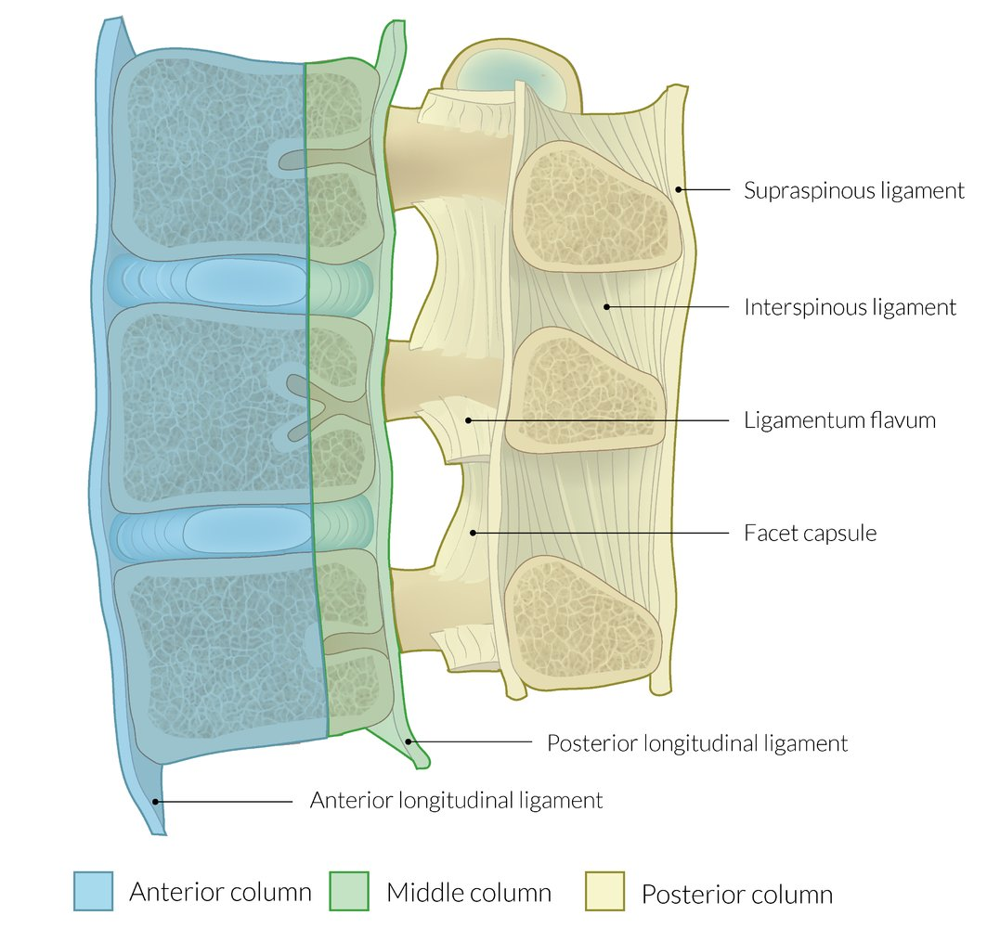

Denis' three-column classification of spinal instability in thoracolumbar injuries

#### Stable vertebral injuries

* Characteristics

* No risk of displacement, deformity, or progressive neurological injury

* No independently mobile <u>vertebrae</u> or <u>fracture</u> fragments

* Typical examples 

* <u>Vertebral</u> <u>fractures</u> limited to the <u>anterior spinal column</u>, e.g., <u>anterior</u> <u>wedge fractures</u>

* Isolated <u>transverse process</u> <u>fractures</u>

* Isolated <u>spinous process</u> <u>fractures</u> (e.g., <u>Clay-shoveler fracture</u>)

* Isolated laminar or <u>articular processes</u> <u>fractures</u> (e.g., <u>spondylolysis</u>)

* Unilateral <u>cervical facet dislocation</u> [[10]](https://coursology-qbank.com/amboss/article/JzWsFL0)

#### Unstable vertebral injuries

* Characteristics

* At risk of displacement, deformity, and progressive neurological injury

* Independently mobile <u>vertebrae</u> or <u>fracture</u> fragments

* Typical examples 

* <u>Vertebral</u> <u>fractures</u> involving the <u>posterior spinal column</u>, e.g.:

* Most <u>burst fractures</u> (including <u>Jefferson fracture</u>)

* Other severe compression <u>fractures</u>

* <u>Flexion-distraction injuries</u>

* <u>Vertebral fracture-dislocations</u>

* <u>Flexion teardrop fracture</u>

* <u>Atlanto-occipital dislocation</u> [[11]](https://coursology-qbank.com/amboss/article/RZdlYo0)

* Bilateral <u>cervical facet dislocation</u> [[10]](https://coursology-qbank.com/amboss/article/JzWsFL0)

* Type II <u>odontoid fractures</u> [[12]](https://coursology-qbank.com/amboss/article/PZdWbo0)[[13]](https://coursology-qbank.com/amboss/article/JEWs9M0)

### AO Spine classification [[14]](https://coursology-qbank.com/amboss/article/6-WjyL0)[[15]](https://coursology-qbank.com/amboss/article/jvW_-M0)[[16]](https://coursology-qbank.com/amboss/article/lEWvDM0)

#### AO <u>Spine</u> Upper Cervical Injury Classification System [[14]](https://coursology-qbank.com/amboss/article/6-WjyL0)[[17]](https://coursology-qbank.com/amboss/article/NEW-DM0)

* Class

* Class I: occipital condyle and craniocervical junction injuries

* Class II: C1 ring and C1–2 <u>joint</u> injuries

* Class III: C2 and C2–3 <u>joint</u> injuries

* Type

* Type A: bone injury only

* Type B: <u>ligament injury</u> with or without bone injury but with anatomical integrity intact

* Type C: significant translation of <u>spine</u>, loss of anatomical integrity

#### AO <u>Spine</u> Subaxial and Thoracolumbar Injury Classification Systems [[15]](https://coursology-qbank.com/amboss/article/jvW_-M0)[[16]](https://coursology-qbank.com/amboss/article/lEWvDM0)

This is a simplified version; additional subclassification is based on <u>fracture</u> characteristics, neurological complications, and patient modifiers.  [[18]](https://coursology-qbank.com/amboss/article/p-WLyL0)[[19]](https://coursology-qbank.com/amboss/article/4vW3Zn0)

* Class A: compression injuries of the <u>vertebral body</u> without <u>ligament</u> damage

* Class B: distraction injuries of the <u>anterior tension band</u> or the <u>posterior tension band</u>

* Class C: displacement or translational injury

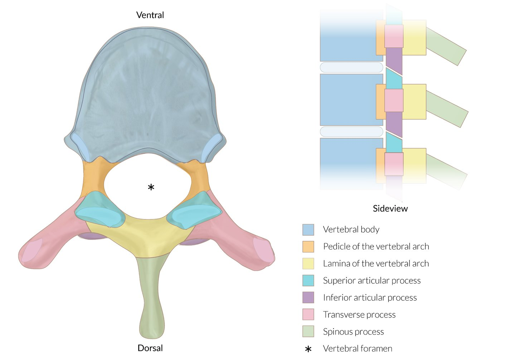

Anatomy of the vertebra

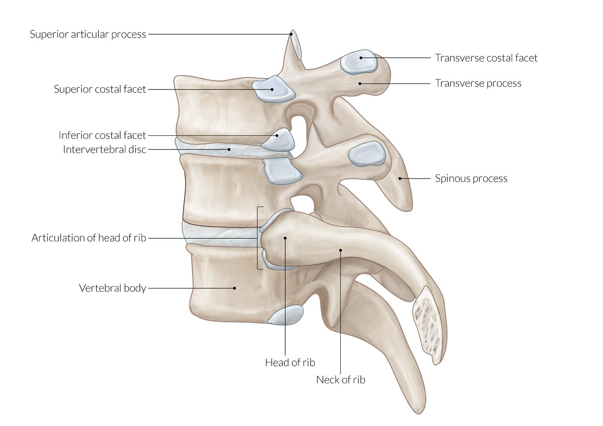

Thoracic spine and costovertebral anatomy

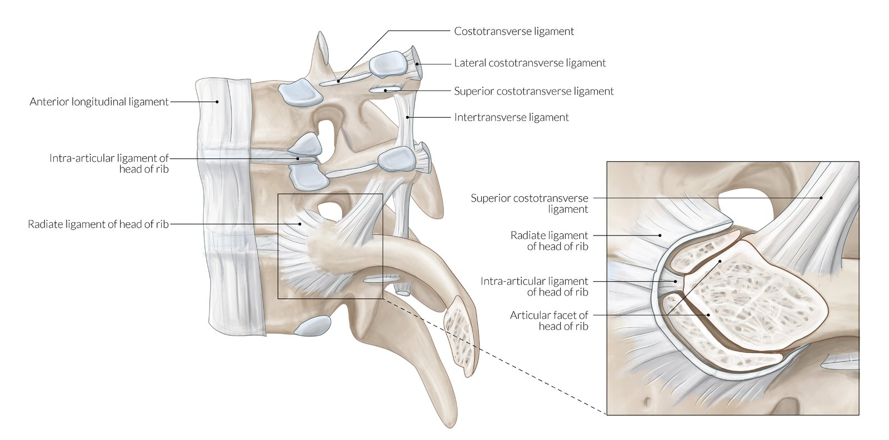

Costovertebral joints and ligaments

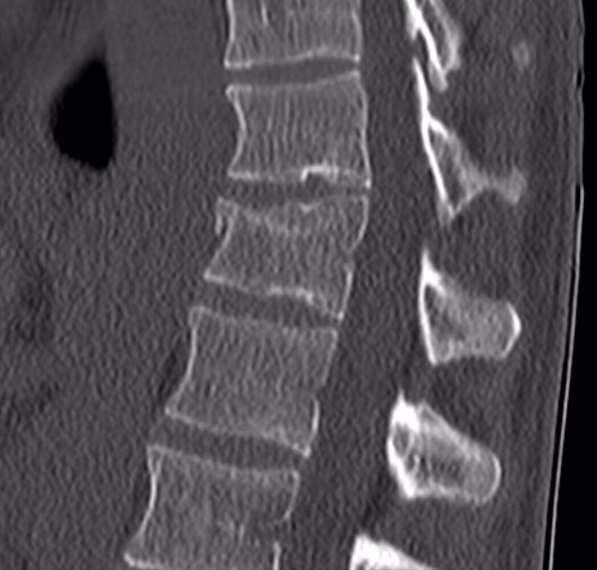

Vertebral body wedge fracture

---

## Clinical features

* <u>Vertebral</u> injury 

* Localized <u>pain</u>

* Tenderness with pressure, percussion, and/or compression

* Palpable unevenness or disruption of <u>vertebral process</u> alignment

* Paravertebral <u>hematoma</u>

* <u>Kyphosis</u> (secondary to <u>ventral</u> <u>vertebral</u> compression)

* Neurological injury: <u>clinical features of spinal cord injury</u> and/or <u>nerve root</u> injuries

* <u>Paralysis</u>, <u>weakness</u>, numbness, <u>paresthesias</u>, and/or abnormal <u>proprioception</u>

* <u>Hyperreflexia</u> and/or <u>hyporeflexia</u>

* <u>Urinary retention</u> or <u>urinary incontinence</u>

* <u>Spinal shock</u>

* Concomitant traumatic injuries: e.g., <u>traumatic pneumothorax</u>, <u>traumatic hemothorax</u>, <u>blunt abdominopelvic trauma</u>, <u>blunt cerebrovascular injury</u> (<u>BCVI</u>)

---

## Diagnosis

### Approach [[4]](https://coursology-qbank.com/amboss/article/1vW2_M0)[[20]](https://coursology-qbank.com/amboss/article/CVWq940)[[21]](https://coursology-qbank.com/amboss/article/4xW39n0)

See “<u>Diagnostics for cervical spine injuries</u>” for details on <u>C-spine injuries</u>.

* Indications for imaging

* <u>C-spine</u>: See ”<u>NEXUS criteria</u>” and “<u>Canadian C-Spine Rule</u>.”

* T- and <u>L-spine</u>: See ”<u>Indications for T- and L-spine imaging</u>.”

* First-line study (if indicated)

* Children: <u>x-rays</u> of the <u>spine</u>

* Adults with <u>blunt trauma</u>: CT <u>spine</u>

* Adults with <u>penetrating trauma</u>: <u>CTA</u> or <u>MRA</u> of neck, thorax, and/or abdomen

> [!WARNING]
> Do not delay urgent interventions (e.g., <u>intubation</u>, <u>fluid resuscitation</u>) to obtain <u>spine</u> imaging in patients with hemodynamic or respiratory instability.

> [!TIP]
> Following <u>blunt trauma</u>, use <u>clinical decision rules</u> to determine the need for <u>C-spine</u> imaging and avoid unnecessary radiation exposure. [[22]](https://coursology-qbank.com/amboss/article/PcWWc40)

### <u>X-rays</u> of the <u>spine</u>  [[4]](https://coursology-qbank.com/amboss/article/1vW2_M0)[[20]](https://coursology-qbank.com/amboss/article/CVWq940)

* Not routinely recommended in adults, often the initial study in children  [[4]](https://coursology-qbank.com/amboss/article/1vW2_M0)[[20]](https://coursology-qbank.com/amboss/article/CVWq940)[[23]](https://coursology-qbank.com/amboss/article/3ZdSYo0)

* Views

* Thoracolumbar and <u>sacral spine</u>: anteroposterior (AP) and <u>lateral</u>

* <u>C-spine</u>: AP, <u>lateral</u>, <u>swimmer's view</u>, and <u>odontoid view</u>  [[24]](https://coursology-qbank.com/amboss/article/2DWTdn0)

* See also “<u>C-spine X-rays</u>” and “<u>C-spine x-rays in children</u>.”

Cervical spine lateral view

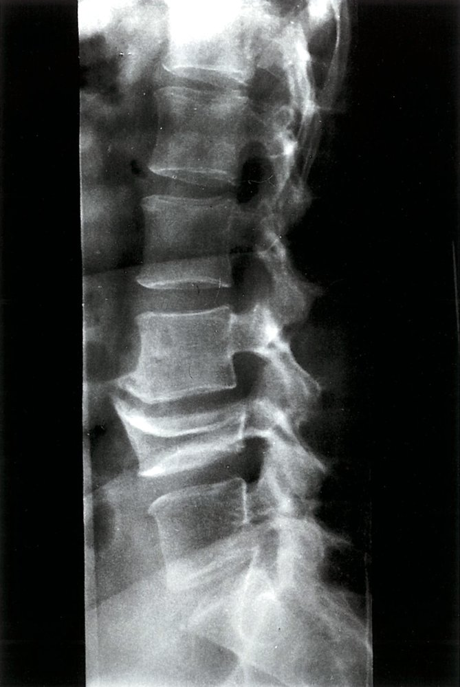

Chronic lumbar compression deformity

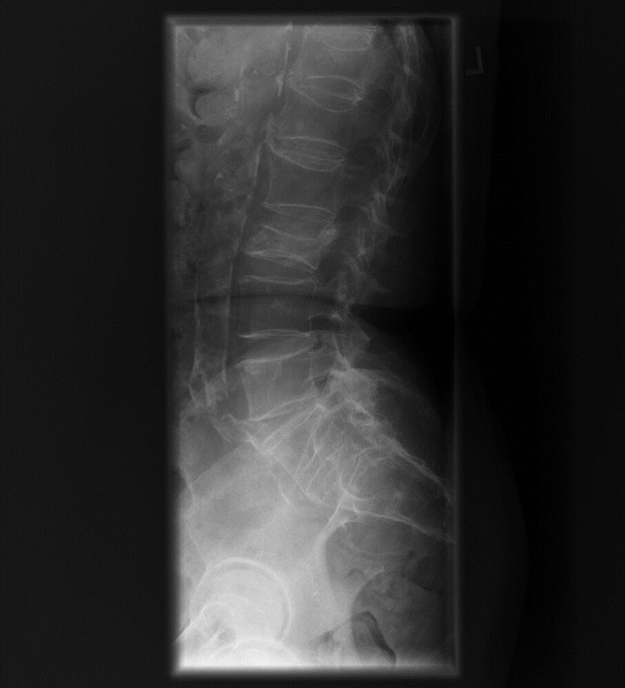

Vertebral compression fractures

### CT imaging [[4]](https://coursology-qbank.com/amboss/article/1vW2_M0)[[21]](https://coursology-qbank.com/amboss/article/4xW39n0)

* CT <u>spine</u> without IV contrast 

* Initial imaging study of choice after <u>blunt trauma</u> in adults

* Obtain CT imaging of the whole <u>spine</u> if an injury at any level of the <u>spine</u> is identified.  [[21]](https://coursology-qbank.com/amboss/article/4xW39n0)

* <u>CTA</u> head and neck: in patients meeting the <u>expanded Denver screening criteria</u> for <u>BCVI</u>

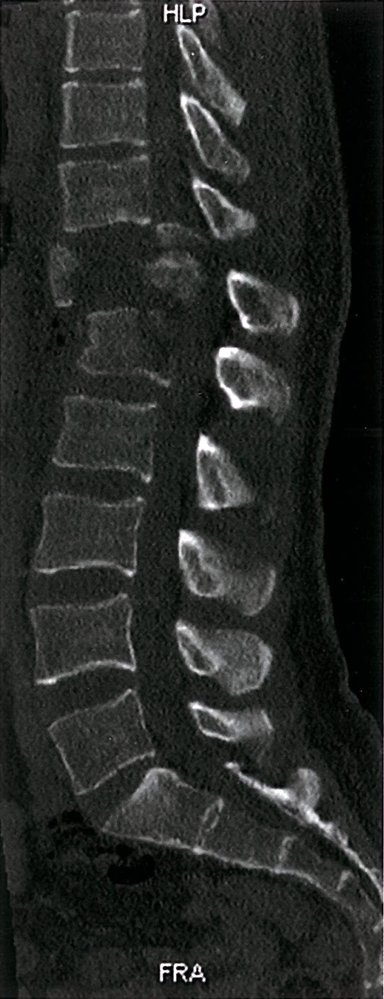

T12 burst fracture and L1 fracture

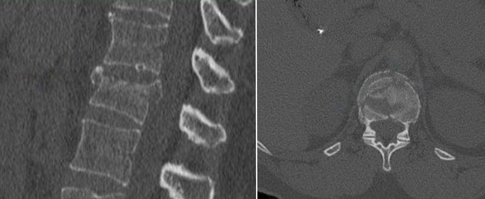

Burst fracture of T12 vertebral body

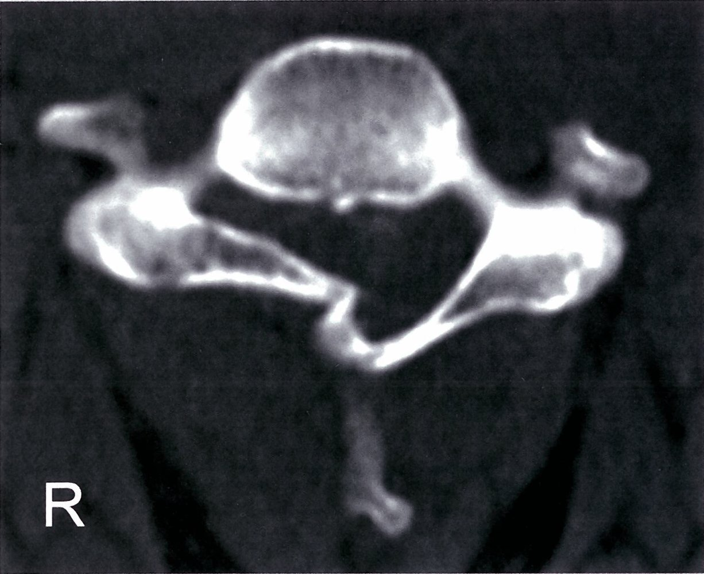

Vertebral arch fracture deformity with spinal stenosis

Vertebral body wedge fracture

### <u>MRI</u> <u>spine</u>  [[4]](https://coursology-qbank.com/amboss/article/1vW2_M0)[[21]](https://coursology-qbank.com/amboss/article/4xW39n0)

* General principles 

* Typically used as an adjunct to CT <u>spine</u>

* Highest <u>sensitivity</u> for <u>soft tissue</u> injuries of the <u>spine</u>

* Neurological: <u>spinal cord injuries</u> or <u>nerve root</u> injuries

* <u>MSK</u>: disc or <u>ligamentous injuries</u>

* Indications

* <u>Soft tissue</u> injury suggested by clinical or CT findings

* Discordant clinical and CT findings  [[4]](https://coursology-qbank.com/amboss/article/1vW2_M0)

* Concern for <u>unstable vertebral injuries</u>  [[4]](https://coursology-qbank.com/amboss/article/1vW2_M0)[[21]](https://coursology-qbank.com/amboss/article/4xW39n0)

* Patients with <u>altered mental status</u>, negative CT, and grossly intact <u>motor function</u>: not routinely indicated  [[4]](https://coursology-qbank.com/amboss/article/1vW2_M0)[[21]](https://coursology-qbank.com/amboss/article/4xW39n0)[[25]](https://coursology-qbank.com/amboss/article/guWFqM0)[[26]](https://coursology-qbank.com/amboss/article/n4d7PJ0)

* Follow local protocols.

* See “<u>C-spine clearance</u>” for further details.

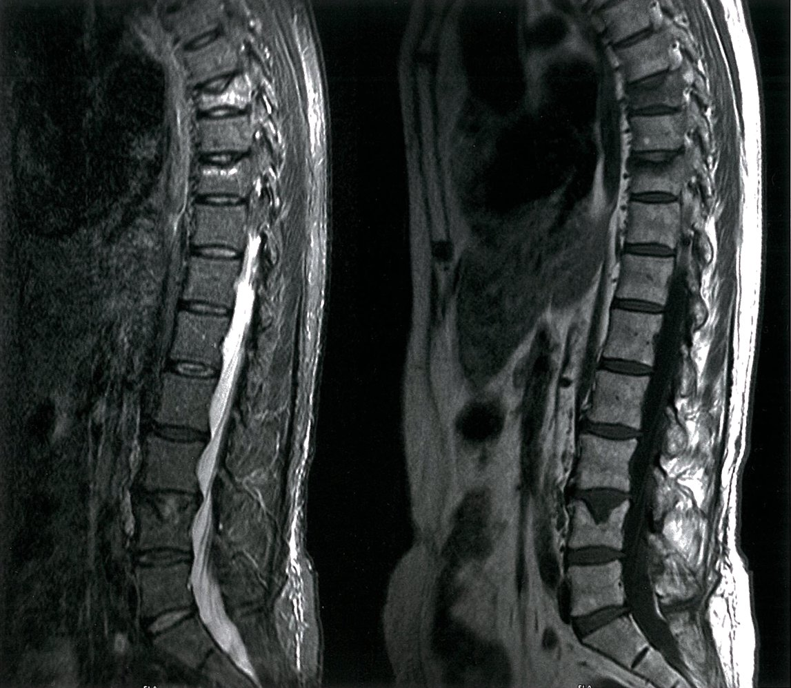

Acute and chronic vertebral fractures

---

## Management

See also “<u>Initial management of vertebral injuries</u>.”

### General principles

* Definitive treatment should be guided by a <u>spine</u> <u>surgeon</u> and depends on: [[4]](https://coursology-qbank.com/amboss/article/1vW2_M0)

* Injury characteristics

* Degree of neurological involvement

* Patient factors

* For <u>cervical spine injuries</u>, see “<u>Definitive management of C-spine injuries</u>.”

### <u>Conservative management</u> [[4]](https://coursology-qbank.com/amboss/article/1vW2_M0)[[27]](https://coursology-qbank.com/amboss/article/C8WqKM0)[[28]](https://coursology-qbank.com/amboss/article/XDW91n0)

* Indications: : typically used for <u>stable vertebral injuries</u>

* Measures:

* <u>Acute pain management</u>

* External <u>immobilization</u> (orthotic bracing): e.g., <u>halo vest</u>, rigid <u>cervical collar</u>, thoracolumbar <u>brace</u>  [[4]](https://coursology-qbank.com/amboss/article/1vW2_M0)[[29]](https://coursology-qbank.com/amboss/article/IvWYYn0)

* <u>Physiotherapy</u> [[29]](https://coursology-qbank.com/amboss/article/IvWYYn0)

### Surgical management

* Surgical <u>immobilization</u> (spondylodesis) [[27]](https://coursology-qbank.com/amboss/article/C8WqKM0)[[28]](https://coursology-qbank.com/amboss/article/XDW91n0)[[30]](https://coursology-qbank.com/amboss/article/euWxJM0)

* Indications: <u>unstable vertebral injury</u>;  or neurological injury

* Technique   [[30]](https://coursology-qbank.com/amboss/article/euWxJM0)

* Decompression of neural elements

* Realignment of the <u>spine</u>

* Fusion of two or more <u>vertebral bodies</u> via <u>internal fixation</u> to stabilize the <u>spine</u>

* Minimally invasive procedures: See “<u>Vertebral augmentation</u>” for compression <u>fractures</u>.

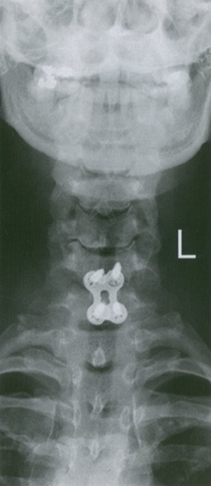

Cervical spondylodesis 1/2

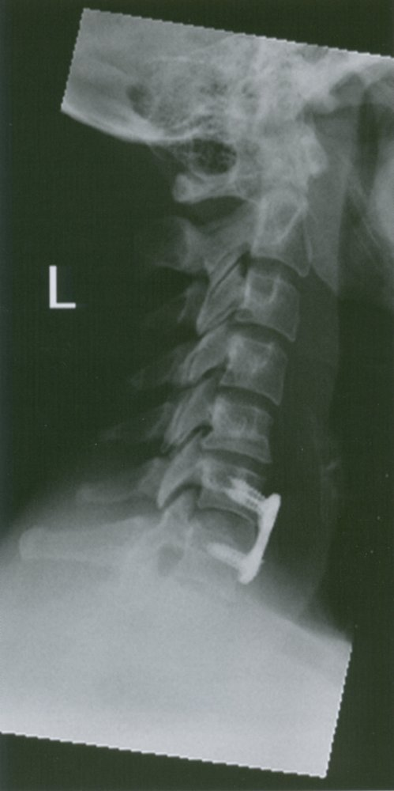

Cervical spondylodesis 2/2

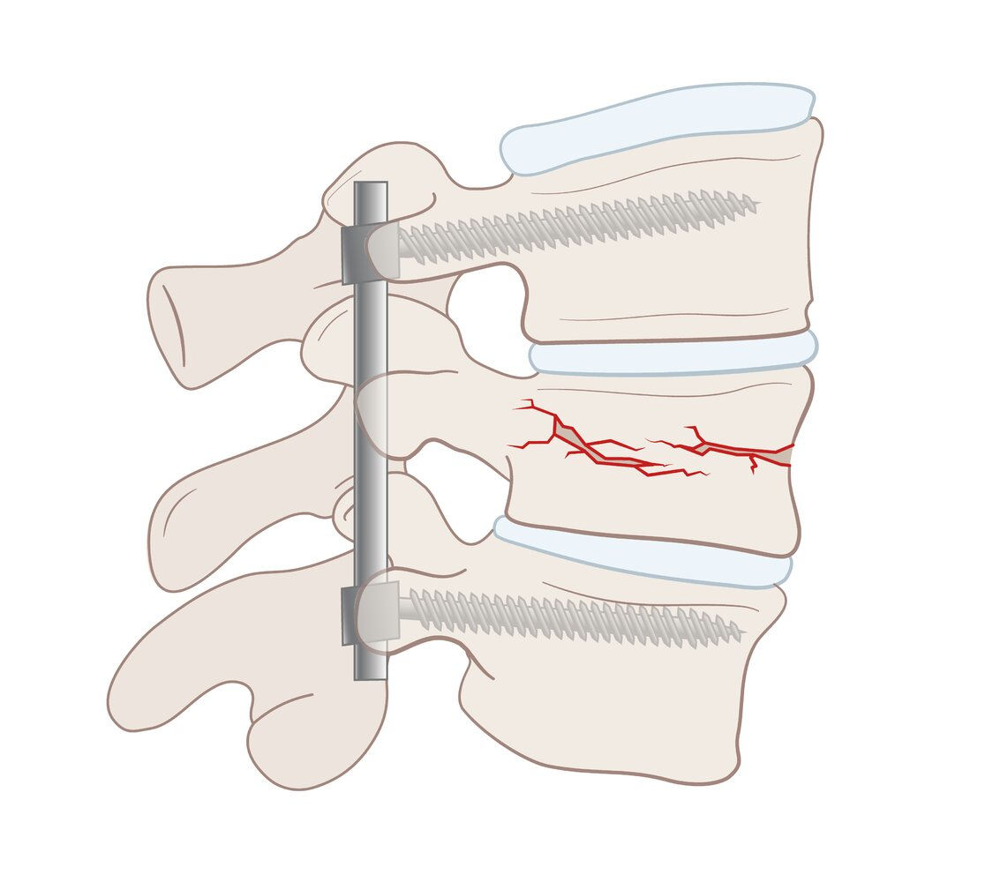

Internal fixation of a vertebral fracture

### Disposition [[3]](https://coursology-qbank.com/amboss/article/AN1Rdh0)

* Patients with identified <u>fractures</u> and/or unstable <u>ligamentous injuries</u> are usually admitted.

* Patients with only <u>soft tissue</u> injuries may be discharged with <u>analgesics</u> and <u>return precautions</u>.

* Perform <u>fall risk assessment</u> for all <u>falls in older adults</u>.

* Consider discharge and follow-up in consultation with a <u>spine</u> specialist for patients with all of the following:

* Minor uncomplicated <u>fractures</u>

* Adequate symptom control

* Minimal functional impairment

* Low risk of complications

---

## Thoracic and lumbar spine injuries

### Diagnostics

* Indications for imaging the thoracic and/or lumbar spine  [[31]](https://coursology-qbank.com/amboss/article/yvWdcn0)[[32]](https://coursology-qbank.com/amboss/article/AvWRcn0)[[33]](https://coursology-qbank.com/amboss/article/_vW5cn0)

* Thoracolumbar <u>pain</u> or tenderness

* Neurological deficits

* Multiple concurrent or <u>distracting injuries</u>

* <u>Glasgow coma scale</u> score < 15 or intoxication

* <u>Cervical spine fracture</u>  [[21]](https://coursology-qbank.com/amboss/article/4xW39n0)

* Other: <u>head injury</u>, age > 60 years, high-risk injury mechanism  [[34]](https://coursology-qbank.com/amboss/article/-vWDcn0)

* Imaging: typically CT <u>spine</u>, see “<u>Diagnostics of vertebral injuries</u>” for details

### Management [[28]](https://coursology-qbank.com/amboss/article/XDW91n0)[[35]](https://coursology-qbank.com/amboss/article/krWmh50)[[36]](https://coursology-qbank.com/amboss/article/VvWG_M0)

* Initial management

* See “<u>Initial management of vertebral injuries</u>.”

* Identify and treat concomitant life- or limb-threatening injuries.

* Injuries at or below L1: <u>conus medullaris syndrome</u> or <u>cauda equina syndrome</u>

* <u>T-spine</u> injuries: <u>blunt chest trauma</u>, e.g., <u>rib fractures</u>, <u>pneumothorax</u>, <u>cardiac contusion</u>

* <u>L-spine</u> injuries: <u>blunt abdominopelvic trauma</u>, e.g., intraabdominal hemorrhage, <u>splenic injury</u>, <u>diaphragmatic injury</u>

* Any <u>penetrating thoracic trauma</u> or <u>penetrating abdominal trauma</u>

* Definitive management: depends on injury stability and score based on the <u>AO Spine classification</u>

* <u>Stable vertebral injuries</u> without neurological deficits: <u>conservative treatment</u> with <u>external orthosis</u> (optional), early mobilization, and close follow-up  [[28]](https://coursology-qbank.com/amboss/article/XDW91n0)

* <u>Unstable vertebral injuries</u> and/or <u>spinal cord injury</u>: Surgical <u>immobilization</u> is usually required.

---

## Vertebral compression fracture

### Background

* Definition: collapse of the <u>vertebral body</u> with ≥ 20% reduction in its height [[37]](https://coursology-qbank.com/amboss/article/zHXrGz)[[38]](https://coursology-qbank.com/amboss/article/GvWBYn0)

* <u>Epidemiology</u> [[39]](https://coursology-qbank.com/amboss/article/qvWCan0)

* Most common in adults > 65 years old, especially those with <u>osteoporosis</u>

* <u>♀</u> > <u>♂</u>

* Mechanism: usually caused by axial loading with <u>flexion</u>

* Morphology  

* Wedge fracture: Collapse is most prominent in the <u>anterior</u> <u>vertebral body</u>.   [[38]](https://coursology-qbank.com/amboss/article/GvWBYn0)

* Vertebra plana: severe compression <u>fracture</u> with uniform loss of height across the <u>vertebral body</u>  [[40]](https://coursology-qbank.com/amboss/article/CvWqXn0)

* Codfish vertebra: biconcave <u>vertebral body</u>  [[41]](https://coursology-qbank.com/amboss/article/xvWEXn0)

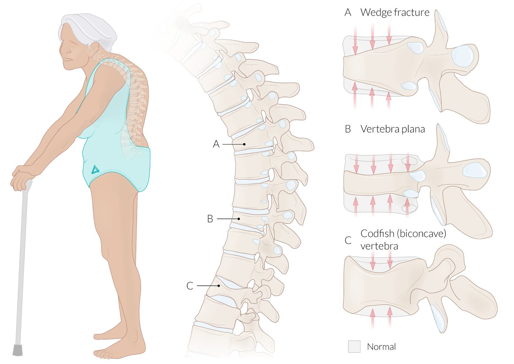

Compression fractures of the vertebra

### Etiology

* <u>Pathological fractures</u>: e.g., due to <u>osteoporosis</u> (most common cause) or <u>bone metastasis</u>

* Trauma

#### <u>Risk factors</u> [[37]](https://coursology-qbank.com/amboss/article/zHXrGz)

* <u>Osteopenia</u> or <u>osteoporosis</u>

* Older age

* Female sex

* History of inactivity, falls, or prior <u>vertebral compression fractures</u>

* Chronic systemic <u>corticosteroid</u> use

* Low body weight

* <u>Alcohol</u> consumption and/or smoking

* <u>Vitamin D deficiency</u>

#### <u>Red flags</u> for <u>malignancy</u>-related compression <u>fractures</u> [[42]](https://coursology-qbank.com/amboss/article/rvWfYn0)

* <u>Fracture</u> without trauma in individuals aged < 50 years

* History of <u>malignancy</u>

* Weight loss

* Persistent <u>pain</u>

### Clinical features [[37]](https://coursology-qbank.com/amboss/article/zHXrGz)[[42]](https://coursology-qbank.com/amboss/article/rvWfYn0)[[43]](https://coursology-qbank.com/amboss/article/JvWsan0)

* Often asymptomatic  [[37]](https://coursology-qbank.com/amboss/article/zHXrGz)

* <u>Pain</u>

* Midline and localized to a spinal segment (bandlike)

* Sudden onset after minor trigger, e.g., sneezing, <u>coughing</u>, turning in bed

* Exacerbated by rotation, movement, standing

* Localized midline tenderness

* Thoracic <u>kyphosis</u> and lumbar <u>lordosis</u>

* Loss of height  [[38]](https://coursology-qbank.com/amboss/article/GvWBYn0)

* See also “<u>Clinical features of vertebral fractures</u>.”

### Diagnostics [[42]](https://coursology-qbank.com/amboss/article/rvWfYn0)[[44]](https://coursology-qbank.com/amboss/article/svWtYn0)

* <u>X-ray</u> <u>spine</u> (AP and <u>lateral</u> views)

* Usual initial study

* Typically shows wedge-shaped <u>vertebral body</u> with loss of height

* CT <u>spine</u> or <u>MRI</u> <u>spine</u>

* Indicated for new and/or symptomatic compression <u>fractures</u>

* <u>MRI</u> <u>spine</u> is often chosen to discriminate between <u>osteoporosis</u> and a <u>neoplastic</u> etiology.

* <u>Dual-energy x-ray absorptiometry</u>: indicated for <u>bone mineral density assessment</u> in patients with suspected <u>fragility fractures</u>

Vertebral body wedge fracture

### Management [[44]](https://coursology-qbank.com/amboss/article/svWtYn0)[[45]](https://coursology-qbank.com/amboss/article/HvWKYn0)[[46]](https://coursology-qbank.com/amboss/article/fyWkeL0)

#### Approach [[29]](https://coursology-qbank.com/amboss/article/IvWYYn0)[[37]](https://coursology-qbank.com/amboss/article/zHXrGz)[[42]](https://coursology-qbank.com/amboss/article/rvWfYn0)

* All patients: Begin <u>initial management of vertebral injuries</u>.

* <u>Unstable vertebral injuries</u> and/or neurological impairment: typically require <u>spondylodesis</u>

* <u>Stable vertebral injuries</u>: usually <u>conservative management</u>, <u>vertebral augmentation</u> in select cases

* <u>Burst fractures</u>: usually unstable (see “<u>Vertebral burst fractures</u>”)

* <u>Osteoporotic</u> <u>fractures</u>

* 3-month trial of <u>conservative management</u> for most patients

* <u>Vertebral augmentation</u> for severe symptoms or significant deformity

* Underlying radiosensitive <u>malignancy</u>: <u>radiotherapy</u>

> [!TIP]
> Compression <u>fractures</u> involving only the <u>anterior spinal column</u> (most common) are usually stable. [[29]](https://coursology-qbank.com/amboss/article/IvWYYn0)

#### <u>Conservative management</u> [[29]](https://coursology-qbank.com/amboss/article/IvWYYn0)

* <u>Acute pain management</u>

* <u>NSAIDs</u> or <u>acetaminophen</u>: first-line  [[47]](https://coursology-qbank.com/amboss/article/tldXAJ0)

* <u>Opioids</u>: limited second-line use at minimal effective doses to avoid <u>opioid adverse effects</u>.

* Other: <u>antidepressants</u>, <u>calcitonin</u>, <u>bisphosphonates</u>, <u>teriparatide</u>  [[29]](https://coursology-qbank.com/amboss/article/IvWYYn0)

* Orthotic bracing  [[29]](https://coursology-qbank.com/amboss/article/IvWYYn0)

* <u>Physical therapy</u>  [[29]](https://coursology-qbank.com/amboss/article/IvWYYn0)[[48]](https://coursology-qbank.com/amboss/article/GpXBI_)

* <u>Treatment of osteoporosis</u>: e.g., <u>bisphosphonates for osteoporosis</u>

> [!TIP]
> Consult a <u>spine</u> specialist if symptoms do not resolve within 4–8 weeks. [[39]](https://coursology-qbank.com/amboss/article/qvWCan0)[[44]](https://coursology-qbank.com/amboss/article/svWtYn0)

#### Vertebral augmentation [[29]](https://coursology-qbank.com/amboss/article/IvWYYn0)[[46]](https://coursology-qbank.com/amboss/article/fyWkeL0)[[49]](https://coursology-qbank.com/amboss/article/cDWaWn0)

* Indications

* Progressive <u>pain</u> or <u>kyphosis</u> despite <u>conservative treatment</u>

* Acute compression <u>fracture</u> with severe <u>pain</u> and/or functional limitation

* Acute compression <u>fracture</u> with significant <u>kyphosis</u> and/or loss of <u>vertebral body</u> height

* Procedures

* Vertebroplasty: percutaneous injection of bone cement into the fractured <u>vertebra</u>

* Kyphoplasty: reexpansion of <u>vertebral body</u> with an inflatable balloon followed by injection of bone cement

> [!TIP]
> Compression <u>fractures</u> are the most common type of <u>vertebral</u> <u>fracture</u>. Most are <u>stable vertebral injuries</u> and can be <u>managed conservatively</u>. [[42]](https://coursology-qbank.com/amboss/article/rvWfYn0)

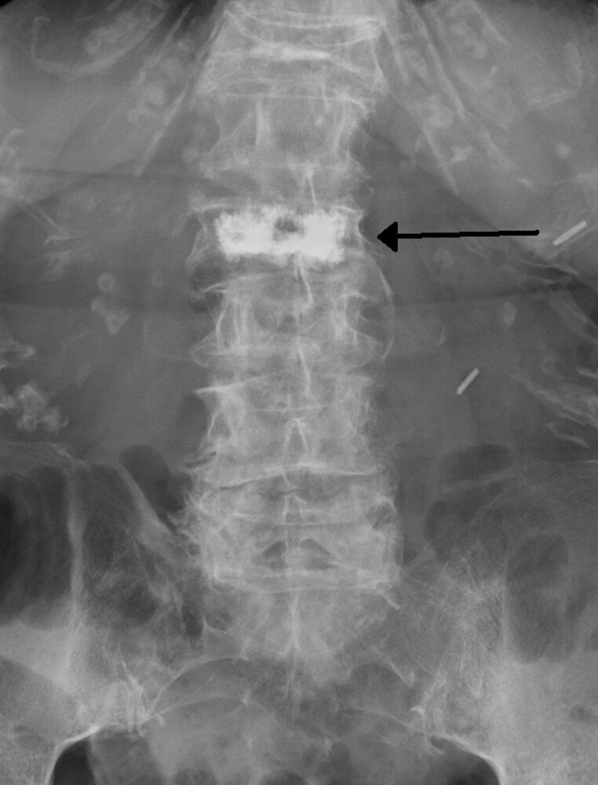

Vertebroplasty

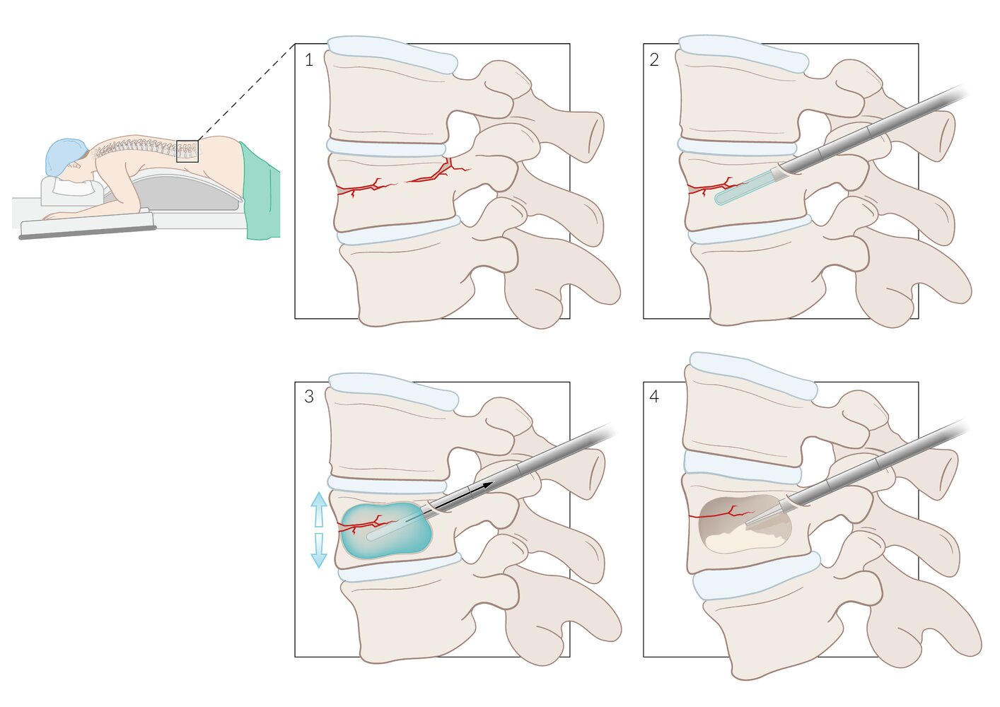

Kyphoplasty

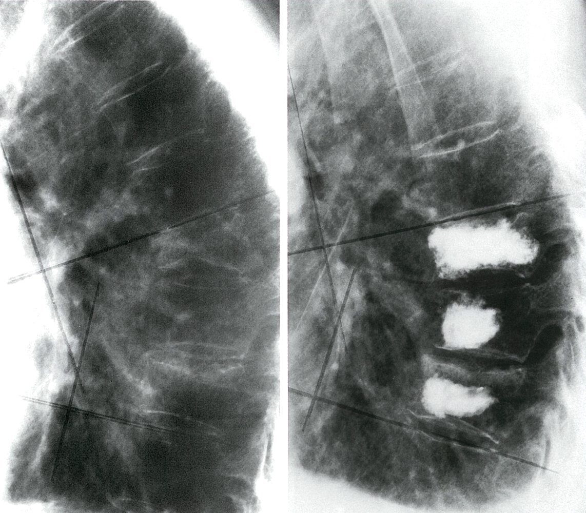

Vertebral body fractures with cement augmentation

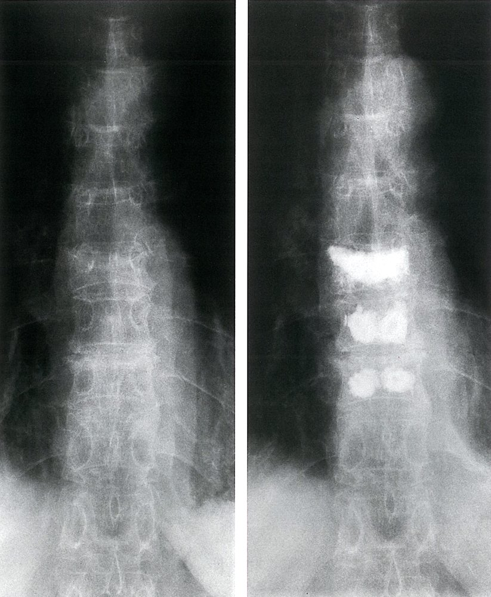

Vertebral body compression fractures before and after kyphoplasty

### Complications [[37]](https://coursology-qbank.com/amboss/article/zHXrGz)[[42]](https://coursology-qbank.com/amboss/article/rvWfYn0)[[43]](https://coursology-qbank.com/amboss/article/JvWsan0)

* Loss of mobility

* Reduced <u>lung function</u>

* Decreased appetite and early satiety

* <u>Chronic pain</u>

* Reduced quality of life

---

## Complications

* <u>Spinal cord injury</u>

* Severe injury of the spinal cord → respiratory <u>depression</u>

* Spinal <u>contusion</u>/<u>concussion</u> to <u>spinal shock</u> → neurological deficits

* Injuries of the <u>cervical spine</u> may result in a retropharyngeal <u>hematoma</u> → <u>dysphagia</u>.

* Vessel injury: dissection or <u>thrombotic</u> blockage of the <u>vertebral artery</u>

* Posttraumatic deformation of the <u>spine</u>: loss of height, <u>scoliosis</u>, or <u>kyphosis</u>

* Gibbus 

* A hump or <u>kyphotic</u> deformity in the <u>spine</u> (usually thoracolumbar <u>spine</u>)

* Common causes include <u>vertebral</u> <u>fracture</u> and <u>spondylodiscitis</u> (especially <u>Pott's disease</u>).

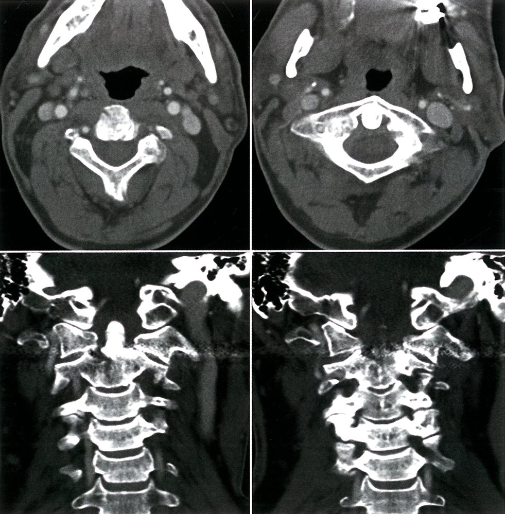

Stenosis of the vertebral artery at C1-C2

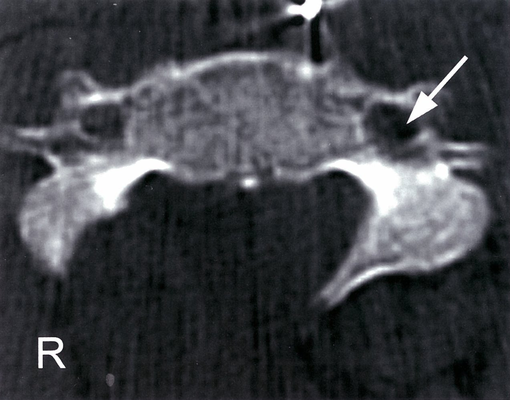

Transverse foramen (Foramen transversarium)

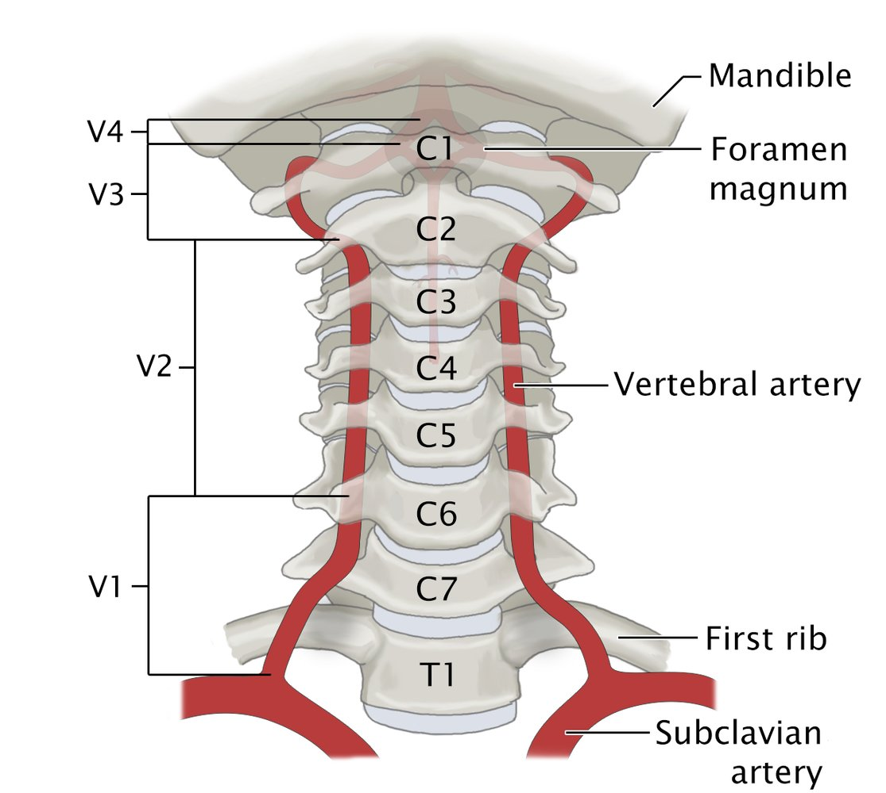

Course and segments of the vertebral artery

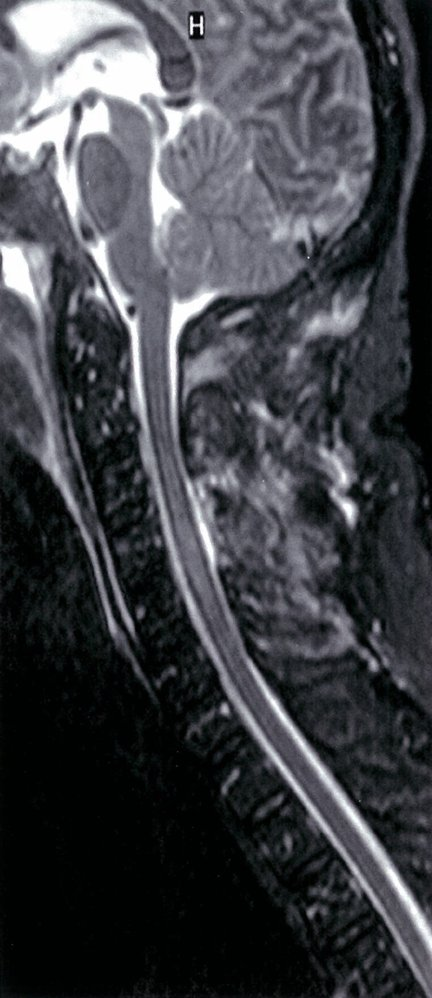

Myelopathy following a C4 fracture

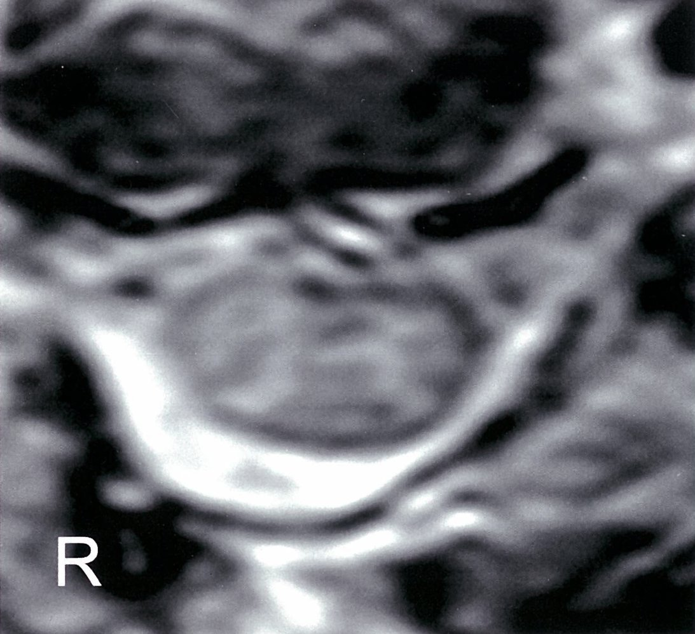

Myelopathy after a vertebral body fracture

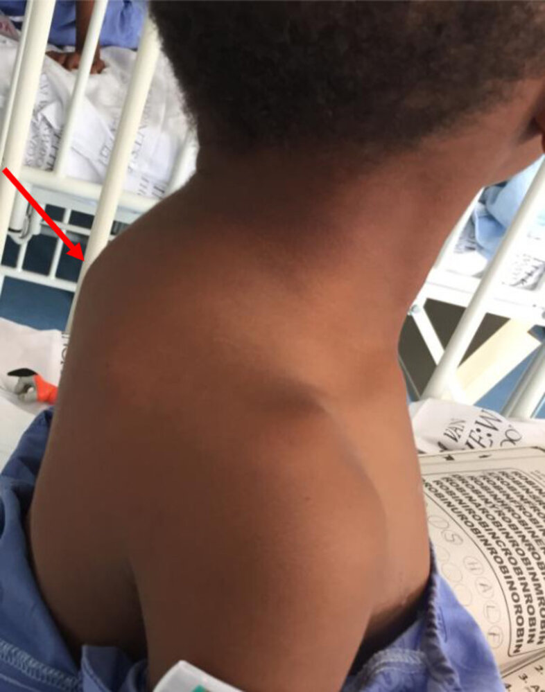

Gibbus deformity

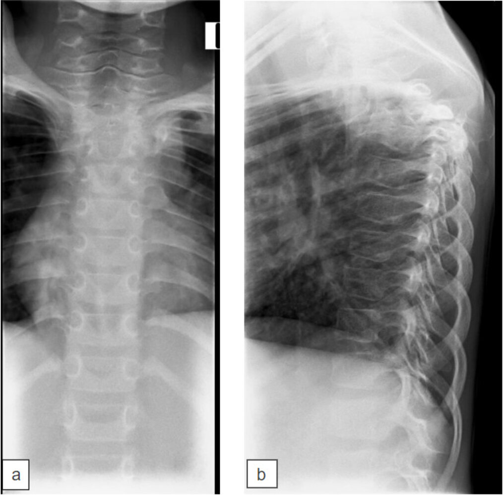

Tuberculous spondylitis (Pott disease) with gibbus deformity

We list the most important complications. The selection is not exhaustive.

---