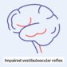
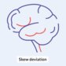
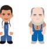

# Vertigo

*Categories: Clinical knowledge > Neurology > Vertigo > Vertigo*

[Original Article Link](https://coursology-qbank.com/amboss/article/fH0kph)

---

## Summary

Vertigo is the false sensation of motion (e.g., spinning or swaying) caused by dysfunction of the <u>inner ear</u> (<u>peripheral vertigo</u>) or the <u>central vestibular system</u> (<u>central vertigo</u>). It is often confused with similar terms related to <u>dizziness</u> (e.g., disequilibrium, <u>lightheadedness</u>). Peripheral causes (e.g., <u>benign paroxysmal positional vertigo</u>, <u>vestibular neuritis</u>) are typically benign, while central causes (e.g., <u>posterior</u> <u>stroke</u>, tumors of the <u>posterior fossa</u>) can be life-threatening. Clinical features and <u>neurological examination</u> findings can help identify the underlying cause. Depending on the clinical presentation, targeted examination maneuvers may also be indicated. In patients with episodic, triggered vertigo, the <u>Dix-Hallpike maneuver</u> can be used to confirm <u>benign paroxysmal positional vertigo</u> (<u>BPPV</u>), while in patients with acute vertigo without a clear trigger, <u>head impulse, nystagmus, test of skew</u> (HINTS) examination can be used to assess for central causes (e.g., <u>ischemic stroke</u>). Urgent <u>neuroimaging</u> is indicated in patients with suspected <u>central vertigo</u>. Further testing, including <u>laboratory studies</u>, is not routinely required. Treatment depends on the underlying cause.

See also “<u>Vestibular neuritis</u>”, “<u>Labyrinthitis</u>”, “<u>BPPV</u>”, and “<u>Meniere disease</u>.”

---

## Definitions

* Vertigo: the sensation of spinning or swaying of oneself (internal vertigo) or of one's surroundings (external vertigo) while stationary; caused by vestibular dysfunction due to asymmetric vestibular input and may be spontaneous or triggered  [[2]](https://coursology-qbank.com/amboss/article/2vbTzv)[[3]](https://coursology-qbank.com/amboss/article/MlcMxc0)

* Dizziness [[2]](https://coursology-qbank.com/amboss/article/2vbTzv)[[3]](https://coursology-qbank.com/amboss/article/MlcMxc0)

* A nonvertiginous disturbance in spatial orientation without a false sensation of motion

* Often used by patients as an umbrella term to describe a variety of sensations, including vertigo, <u>presyncope</u>, imbalance, and confusion  [[4]](https://coursology-qbank.com/amboss/article/5Ncib10)

> [!WARNING]
> Do not confuse vertigo for <u>presyncope</u>, which refers to severe <u>lightheadedness</u> or near <u>loss of consciousness</u>; most commonly due to a drop in systemic blood pressure or <u>hypoxia</u>. [[4]](https://coursology-qbank.com/amboss/article/5Ncib10)[[5]](https://coursology-qbank.com/amboss/article/XSb9yG)

---

## Etiology

Vertigo can be caused by a variety of medical conditions, which are commonly divided into central and peripheral causes based on the location of involvement.

|  <u>Causes of vertigo</u> [[5]](https://coursology-qbank.com/amboss/article/XSb9yG)[[6]](https://coursology-qbank.com/amboss/article/SBcyZU0)  |  |  |
| --- | --- | --- |
| Type of vertigo | Definition | Diagnoses |
| Central vertigo |  * Caused by <u>central vestibular system</u> (e.g., <u>cerebellum</u>, <u>brainstem</u>, <u>vestibular nuclei</u>) lesions or dysfunction   |   * <u>Ischemia</u> and/or hemorrhage of the vertebrobasilar circulation (i.e., <u>ischemic stroke</u>, <u>hemorrhagic stroke</u>, <u>TIA</u>)  * <u>Lateral medullary (Wallenberg) syndrome</u> [[7]](https://coursology-qbank.com/amboss/article/E4a8Ok)  * <u>Vertebrobasilar insufficiency</u>  * <u>Cerebellar stroke</u>  * <u>Brainstem</u> <u>ischemia</u> (e.g., <u>basilar artery</u> occlusion, <u>vestibular nuclei</u> <u>stroke</u>)  * <u>Posterior fossa</u> tumors (e.g., <u>vestibular schwannoma</u>, <u>meningiomas</u>) [[8]](https://coursology-qbank.com/amboss/article/xlcE_c0)  * <u>Migraine</u> (e.g., <u>vestibular migraine</u>, <u>migraine with brainstem aura</u>)  * <u>Demyelination</u> (e.g., in <u>multiple sclerosis</u>)  [[7]](https://coursology-qbank.com/amboss/article/E4a8Ok)  * See also “<u>Causes of central vertigo</u>.”    |
| Peripheral vertigo |  * Caused by <u>inner ear</u> (e.g., <u>vestibulocochlear nerve</u>, <u>semicircular canals</u>) lesions or dysfunction   |   * <u>Vestibular neuritis</u> and/or <u>labyrinthitis</u>  * <u>Meniere disease</u> (from <u>endolymphatic hydrops</u>)  * <u>Benign paroxysmal positional vertigo</u> (from <u>semicircular canal</u> debris)  * <u>Aminoglycoside</u> toxicity  * <u>Perilymphatic fistula</u>  * <u>Herpes zoster oticus</u>  * See also “<u>Causes of peripheral vertigo</u>.”    |

> [!WARNING]
> <u>Stroke</u> and acute <u>obstructive hydrocephalus</u> caused by a <u>posterior fossa</u> <u>tumor</u> are <u>medical emergencies</u> and require immediate management.

---

## Clinical features

Vertigo is often accompanied by other signs and symptoms, which can help to identify the underlying cause. However, further evaluation is often necessary to establish a diagnosis and rule out life-threatening causes.

> [!WARNING]
> Clinical features alone cannot determine whether vertigo is peripheral or central in origin, as symptoms often overlap, e.g., movement can worsen symptoms of <u>dizziness</u> and/or vertigo in both peripheral and central causes. [[5]](https://coursology-qbank.com/amboss/article/XSb9yG)

### Associated features

|  Peripheral vs. central vertigo [[5]](https://coursology-qbank.com/amboss/article/XSb9yG)[[7]](https://coursology-qbank.com/amboss/article/E4a8Ok)[[9]](https://coursology-qbank.com/amboss/article/c3baht)  |  |  |  |
| --- | --- | --- | --- |
| Clinical features |  | Suggestive of <u>peripheral vertigo</u> | Suggestive of <u>central vertigo</u> |
| Neurological features |  <u>Cranial nerve</u> features <u>Cerebellar features</u>  |   * Typically absent  * No <u>dysmetria</u>, <u>dysphagia</u>, <u>dysarthria</u>, or <u>diplopia</u>  * Mild gait disturbance may be present.  * <u>Nystagmus</u>, <u>hearing loss</u>, and/or <u>tinnitus</u> may be present.    |   * Marked involvement  * Presence of <u>dysmetria</u>, <u>dysphagia</u>, <u>dysarthria</u>, or <u>diplopia</u>  * Severe <u>ataxia</u>    |
|  <u>Nystagmus</u> [[5]](https://coursology-qbank.com/amboss/article/XSb9yG)[[10]](https://coursology-qbank.com/amboss/article/kIYm1q) (See “<u>HINTS exam</u>” for details.) |  * Unidirectional, frequently horizontal   |  * Horizontal, torsional, or vertical (e.g., down-beat <u>nystagmus</u>)   |  |
| <u>Hearing loss</u> and/or <u>tinnitus</u> |  * Common   |  * Rare  [[11]](https://coursology-qbank.com/amboss/article/IOcYFc0)   |  |
| Other <u>focal neurological deficits</u> |  * Absent   |  * Present   |  |
|  Sense of motion (e.g., swaying, spinning) |  |  * Severe   |  * Mild   |
| <u>Nausea</u> and/or <u>vomiting</u> |  |  * Severe   |  * Varies   |

> [!NOTE]
> Any of the Dangerous D's (Dysphagia, Dysarthria, Diplopia, Dysmetria) strongly suggest a central <u>cause of vertigo</u>.

### Vestibular syndromes

Patients are often classified into vestibular syndromes based on their clinical presentation (e.g., onset, triggers, and chronicity) in order to guide the diagnostic evaluation (e.g., <u>Dix-Hallpike</u> testing vs <u>HINTS examination</u>).

* Acute vestibular syndrome: the acute onset of continuous vertigo, gait instability, <u>nystagmus</u>, and <u>nausea</u> (with or without <u>hearing loss</u>) that may be worsened, but not triggered, by movement; usually lasts days to weeks  [[4]](https://coursology-qbank.com/amboss/article/5Ncib10)[[9]](https://coursology-qbank.com/amboss/article/c3baht)[[12]](https://coursology-qbank.com/amboss/article/-SbDXt)

* Episodic vestibular syndrome: recurrent episodes of vertigo often associated with gait instability and <u>nausea</u> that typically last seconds to hours; may be triggered  or spontaneous  [[4]](https://coursology-qbank.com/amboss/article/5Ncib10)

* Chronic vestibular syndrome: the presence of continuous vestibular symptoms for weeks to years [[4]](https://coursology-qbank.com/amboss/article/5Ncib10)

---

## Clinical evaluation

Varied approaches for the evaluation of vertigo exist.  [[3]](https://coursology-qbank.com/amboss/article/MlcMxc0)[[4]](https://coursology-qbank.com/amboss/article/5Ncib10)[[5]](https://coursology-qbank.com/amboss/article/XSb9yG)

### Focused history [[3]](https://coursology-qbank.com/amboss/article/MlcMxc0)[[4]](https://coursology-qbank.com/amboss/article/5Ncib10)[[5]](https://coursology-qbank.com/amboss/article/XSb9yG)

* Determine onset, triggers, and duration of vertigo.

* Identify the following:

* Associated features that may help <u>differentiate between central and peripheral vertigo</u>

* <u>Risk factors for ischemic stroke</u>

* Features of any underlying etiologies.

### Focused <u>physical examination</u> [[3]](https://coursology-qbank.com/amboss/article/MlcMxc0)[[4]](https://coursology-qbank.com/amboss/article/5Ncib10)[[5]](https://coursology-qbank.com/amboss/article/XSb9yG)

* Perform <u>orthostatic vital signs</u> to rule out <u>orthostatic presyncope</u>.

* Conduct a <u>neurological examination</u> that includes:

* Evaluation of <u>cerebellar features</u> and full <u>cranial nerve examination</u> including:

* Evaluation of <u>nystagmus</u> (e.g., identify <u>spontaneous nystagmus</u> and <u>gaze-evoked nystagmus</u>)

* <u>Examination of gait</u>

* Identification of any <u>focal neurological deficits</u>.

### Targeted examination maneuvers [[5]](https://coursology-qbank.com/amboss/article/XSb9yG)[[11]](https://coursology-qbank.com/amboss/article/IOcYFc0)[[12]](https://coursology-qbank.com/amboss/article/-SbDXt)[[13]](https://coursology-qbank.com/amboss/article/97dNLr0)

* Consider <u>HINTS examination</u> to screen for a central cause in <u>acute vestibular syndrome</u> without an identifiable trigger.

* Consider <u>Dix-Hallpike maneuver</u> or other <u>provoking maneuvers for BPPV</u> for a triggered <u>episodic vestibular syndrome</u>.

> [!TIP]
> When approaching a patient with vertigo, think TiTrATE: Timing, Triggers, And Targeted Examination. [[4]](https://coursology-qbank.com/amboss/article/5Ncib10)

Dix-Hallpike maneuver

Dix-Hallpike maneuver (left side)

Dix-Hallpike maneuver (right side)

### Head impulse, nystagmus, test of skew (HINTS) examination [[9]](https://coursology-qbank.com/amboss/article/c3baht)[[12]](https://coursology-qbank.com/amboss/article/-SbDXt)

* Indication: symptomatic patients with <u>acute vestibular syndrome</u>

* Objective: to screen for central <u>causes of vertigo</u>, especially <u>stroke</u>  [[9]](https://coursology-qbank.com/amboss/article/c3baht)[[11]](https://coursology-qbank.com/amboss/article/IOcYFc0)[[12]](https://coursology-qbank.com/amboss/article/-SbDXt)

* Next steps: If <u>HINTS testing</u> suggests a central <u>cause of vertigo</u>, begin urgent management and obtain <u>neuroimaging</u>. [[11]](https://coursology-qbank.com/amboss/article/IOcYFc0)[[14]](https://coursology-qbank.com/amboss/article/qOcCtc0)

> [!WARNING]
> Performing <u>HINTS testing</u> while the patient is asymptomatic increases the likelihood of a <u>false-negative</u> result. [[9]](https://coursology-qbank.com/amboss/article/c3baht)[[15]](https://coursology-qbank.com/amboss/article/35YSPp)

|  Overview of <u>HINTS examination</u> [[9]](https://coursology-qbank.com/amboss/article/c3baht)[[12]](https://coursology-qbank.com/amboss/article/-SbDXt)[[16]](https://coursology-qbank.com/amboss/article/mibVHt)  |  |  |  |
| --- | --- | --- | --- |
|  |  Procedure  | Findings |  |
|  Suggestive of a peripheral cause  |  Suggestive of a central cause [[9]](https://coursology-qbank.com/amboss/article/c3baht)  |  |  |
|  Head impulse test Evaluates the <u>vestibuloocular reflex</u> (<u>VOR</u>)  [[17]](https://coursology-qbank.com/amboss/article/DNb1W8)  |   * Ask the patient to fixate on a stationary object in front of them.  * Rapidly rotate the patient's head 10 degrees from center and assess their ability to maintain a central gaze. [[5]](https://coursology-qbank.com/amboss/article/XSb9yG)  * Repeat the procedure, rotating the patient's head to the <u>contralateral</u> side.    |  * Abnormal <u>head impulse test</u> (impaired <u>VOR</u>)   * Inability to maintain central fixation on a stationary target during head rotation  * Followed by a corrective shift of the eyes back to the stationary target (correction <u>saccade</u>)   |  * Normal <u>head impulse test</u> (normal <u>VOR</u>): Central fixed gaze is maintained during head rotation.   [[9]](https://coursology-qbank.com/amboss/article/c3baht)   |
|  <u>Nystagmus</u>  [[17]](https://coursology-qbank.com/amboss/article/DNb1W8)  |   * Watch for <u>spontaneous nystagmus</u> at rest.  * Watch for <u>gaze-evoked nystagmus</u> while <u>examining the extraocular muscles</u>.    |   * Spontaneous <u>horizontal nystagmus</u> (typical)   [[15]](https://coursology-qbank.com/amboss/article/35YSPp)  * The direction of <u>nystagmus</u> does not change with gaze change (<u>unidirectional nystagmus</u>).  * The fast phase beats away from the side of the lesion.  * Intensity increases when the patient looks toward the fast phase and decreases when looking toward the slow phase (Alexander law).  * Gaze fixation suppresses <u>nystagmus</u>.    |   * May be torsional, horizontal, or vertical  [[4]](https://coursology-qbank.com/amboss/article/5Ncib10)[[17]](https://coursology-qbank.com/amboss/article/DNb1W8)  * The direction of <u>nystagmus</u> changes with gaze change (<u>gaze-evoked nystagmus</u>).  * Gaze fixation does not reduce <u>nystagmus</u>.    |
| Test of skew |   * Ask the patient to maintain a fixed central gaze and to keep both eyes open during the examination.  * Repeatedly cover and uncover alternating eyes, while watching for vertical deviation from the central gaze upon uncovering the <u>eye</u>. [[5]](https://coursology-qbank.com/amboss/article/XSb9yG)    |  * <u>Skew deviation</u> is absent : The <u>eye</u> remains in a fixed central gaze when uncovered.   |  * <u>Skew deviation</u> (vertical ocular misalignment) is present: A refixation <u>saccade</u> occurs upon uncovering the <u>eye</u>.   |
|  Interpretation [[11]](https://coursology-qbank.com/amboss/article/IOcYFc0)[[14]](https://coursology-qbank.com/amboss/article/qOcCtc0)   * Presence of ANY of the following strongly suggests <u>central vertigo</u>: normal <u>head impulse test</u>, any central-type <u>nystagmus</u> (e.g., direction-changing, vertical, or <u>torsional nystagmus</u>), AND/OR <u>skew deviation</u>  * Presence of <u>ALL</u> of the following suggests <u>peripheral vertigo</u>: abnormal <u>head impulse test</u>, only peripheral-type <u>nystagmus</u> (e.g., spontaneous unidirectional <u>horizontal nystagmus</u>), AND no <u>skew deviation</u>     |  |  |  |

> [!NOTE]
> During <u>HINTS testing</u>, think INFARCT to identify central causes (e.g., <u>stroke</u>): Impulse Normal, Fast-phase Alternating, Refixation on Cover Test. [[11]](https://coursology-qbank.com/amboss/article/IOcYFc0)

Vestibuloocular Reflex

Impaired Vestibuloocular Reflex

Spontaneous Nystagmus

Gaze-evoked Nystagmus

Skew Deviation

Characterization of nystagmus by direction

Testing the vestibuloocular reflex with oculocephalic maneuver

Vertigo maneuvers: Performing the HINTS exam

---

## Diagnosis

### Approach

* Suspected <u>central vertigo</u>

* Admit patients for further testing (e.g., <u>neuroimaging</u>) and treatment.

* See “<u>Management of central vertigo</u>.”

* High likelihood of <u>peripheral vertigo</u> (i.e., no signs suggestive of <u>central vertigo</u>)

* Usually, no further acute diagnostic testing is required.

* Begin empiric <u>management of peripheral vertigo</u>.

* Consider ENT referral for outpatient evaluation and follow-up.

* Chronic vertigo

* Consider <u>neuroimaging</u> and <u>laboratory studies</u>.

* Refer to ENT and/or <u>Neurology</u> to guide evaluation.

> [!WARNING]
> Obtain immediate <u>neuroimaging</u> if <u>central vertigo</u> is suspected based on <u>focal neurological deficits</u>, abnormal <u>HINTS testing</u>, or presence of <u>risk factors for ischemic stroke</u> (e.g., age ≥ 65, multiple comorbidities).

### <u>Neuroimaging</u> [[3]](https://coursology-qbank.com/amboss/article/MlcMxc0)[[9]](https://coursology-qbank.com/amboss/article/c3baht)[[18]](https://coursology-qbank.com/amboss/article/cSbaAG)

* Indication: clinical findings suggestive of a central <u>cause of vertigo</u> [[16]](https://coursology-qbank.com/amboss/article/mibVHt)

* <u>Focal neurological deficits</u>

* Concurrent severe <u>headache</u>

* <u>HINTS examination</u> suggestive of <u>central vertigo</u>

* <u>Risk factors for ischemic stroke</u>

* Modality: <u>MRI</u> <u>brain</u> with or without magnetic resonance <u>angiogram</u> (<u>MRA</u>)  [[3]](https://coursology-qbank.com/amboss/article/MlcMxc0)[[19]](https://coursology-qbank.com/amboss/article/QkbunF)[[20]](https://coursology-qbank.com/amboss/article/TNc6010)

* Findings

* Abnormal findings may be seen in patients with <u>ischemic stroke</u>, <u>demyelination</u>, or tumors.

* Findings are typically normal in patients with peripheral causes (e.g., those with <u>vestibular neuritis</u>).

### Additional studies [[3]](https://coursology-qbank.com/amboss/article/MlcMxc0)

Additional studies may be performed if the <u>cause of vertigo</u> remains unknown or if <u>patient history</u> and/or <u>physical examination</u> suggest an alternative cause.

* <u>Laboratory studies</u>: Consider based on <u>patient history</u>.  [[5]](https://coursology-qbank.com/amboss/article/XSb9yG)

* <u>CBC</u>, <u>BMP</u>, <u>POC glucose</u>, <u>vitamin B12</u>

* Serum drug levels (e.g., for <u>anticonvulsants</u>)

* <u>Urine toxicology screen</u>

* <u>ECG</u>: to evaluate for suspected <u>cardiogenic syncope</u> and/or <u>arrhythmia</u>

* <u>Audiogram</u>: to evaluate for <u>sensorineural hearing loss</u> (e.g., in <u>Meniere disease</u>, <u>labyrinthitis</u>, <u>vestibular schwannoma</u>)

* Caloric testing (with electronystagmography): to detect a unilateral peripheral vestibulopathy   [[21]](https://coursology-qbank.com/amboss/article/Duc1tV0)[[22]](https://coursology-qbank.com/amboss/article/wuchtV0)

* Procedure: Infuse cold water and, subsequently, warm water into each <u>ear</u> and document the elicited <u>nystagmus</u>.  [[10]](https://coursology-qbank.com/amboss/article/kIYm1q)[[16]](https://coursology-qbank.com/amboss/article/mibVHt)[[23]](https://coursology-qbank.com/amboss/article/JhbsUt)

* Interpretation

* Normal caloric response

* Cold water: <u>nystagmus</u> with the fast phase away from the stimulated <u>ear</u>

* Warm water: <u>nystagmus</u> with the fast phase toward the stimulated <u>ear</u>

* Unilaterally reduced or absent caloric response suggests a peripheral cause.

> [!NOTE]
> The direction of the fast component of the physiological <u>nystagmus</u> elicited with <u>caloric testing</u> can be remembered with the term <u>COWS</u>: Cold Opposite; Warm Same.

---

## Peripheral vertigo

### Etiology [[3]](https://coursology-qbank.com/amboss/article/MlcMxc0)[[5]](https://coursology-qbank.com/amboss/article/XSb9yG)

| Causes of peripheral vertigo |  |  |  |
| --- | --- | --- | --- |
|  | Characteristics of vertigo | Clinical features | Diagnostic approach |
| <u>Vestibular neuritis</u> and <u>labyrinthitis</u> |   * <u>Acute vestibular syndrome</u>; spontaneous  * Duration: days to months    |   * Possibly a recent <u>upper respiratory infection</u>  * <u>Cochlear symptoms</u> (acute unilateral <u>hearing loss</u>) in <u>labyrinthitis</u>  * No <u>cochlear symptoms</u> in <u>vestibular neuritis</u>    |  * Diagnosis is based on the presence of characteristic features (i.e., <u>acute vestibular syndrome</u>) and <u>HINTS testing</u> that suggests a peripheral cause.   |
| <u>Benign paroxysmal positional vertigo</u> |   * <u>Episodic vestibular syndrome</u>; triggered by movement (e.g., lying down, reclining)  * Duration: ≤ 90 seconds [[4]](https://coursology-qbank.com/amboss/article/5Ncib10)    |   * No <u>cochlear symptoms</u>  * Vertical, torsional, or horizontal <u>nystagmus</u> may be seen spontaneously or after <u>provoking maneuvers for BPPV</u> (positive <u>Dix-Hallpike maneuver</u> and/or <u>supine roll test</u>).    |   * Diagnosis is based on classic presentation (e.g., <u>episodic vestibular syndrome</u>) and positive <u>provoking maneuvers for BPPV</u>.  * Consider <u>neuroimaging</u> if the patient has atypical features.    |
| <u>Meniere disease</u> |   * <u>Episodic vestibular syndrome</u>; spontaneous  * Duration: 20 minutes to 12 hours [[24]](https://coursology-qbank.com/amboss/article/nPb72F)    |   * <u>Cochlear symptoms</u> (unilateral <u>hearing loss</u>, <u>tinnitus</u>)  * <u>Aural fullness</u>    |  * Diagnosis requires fulfillment of the <u>diagnostic criteria for Meniere disease</u>.   |

### Management of peripheral vertigo

For detailed management of specific types of <u>peripheral vertigo</u>, see “<u>Vestibular neuritis</u>”, “<u>Labyrinthitis</u>”, “<u>BPPV</u>”, and “<u>Meniere disease</u>.”

* Identify and treat the underlying condition;  based on clinical evaluation (e.g., <u>Epley maneuver</u> for suspected <u>BPPV</u>).

* Consider short-term symptomatic pharmacotherapy for acute vertigo, <u>nausea</u>, and <u>vomiting</u>. [[24]](https://coursology-qbank.com/amboss/article/nPb72F)[[25]](https://coursology-qbank.com/amboss/article/BXYzZL)[[26]](https://coursology-qbank.com/amboss/article/I1YYRL)

* <u>Vestibular suppressants</u>

* <u>Antiemetics</u>, e.g., <u>metoclopramide</u>, <u>ondansetron</u>

* if the diagnosis is unclear or a trial of therapy is unsuccessful, consider further diagnostics for vertigo and outpatient follow-up with specialist (e.g., ENT).

* Consider <u>vestibular rehabilitation therapy</u> to help facilitate central vestibular compensation and accelerate recovery.

#### Vestibular suppressants [[15]](https://coursology-qbank.com/amboss/article/35YSPp)[[16]](https://coursology-qbank.com/amboss/article/mibVHt)[[24]](https://coursology-qbank.com/amboss/article/nPb72F)[[25]](https://coursology-qbank.com/amboss/article/BXYzZL)[[26]](https://coursology-qbank.com/amboss/article/I1YYRL)

* Definition: drugs that suppress the effects of vestibular dysfunction, such as vertigo, <u>nystagmus</u>, and <u>nausea</u>

* Indications

* <u>Meniere disease</u> and <u>vestibular neuritis</u>: short-term pharmacotherapy for severe symptoms of an acute episode of <u>peripheral vertigo</u>

* <u>BPPV</u>: generally not recommended, but may be used:  [[25]](https://coursology-qbank.com/amboss/article/BXYzZL)

* Prior to provoking or repositioning maneuvers

* In patients who decline <u>canalith repositioning maneuvers</u> (<u>CRM</u>)

* In patients with intractable symptoms

* <u>First-generation antihistamines</u>   [[24]](https://coursology-qbank.com/amboss/article/nPb72F) ; 

* <u>Meclizine</u> DOSAGE  [[24]](https://coursology-qbank.com/amboss/article/nPb72F)

* <u>Diphenhydramine</u> (<u>off-label</u>) DOSAGE [[24]](https://coursology-qbank.com/amboss/article/nPb72F)

* <u>Dimenhydrinate</u> DOSAGE

* <u>Benzodiazepines</u>  [[15]](https://coursology-qbank.com/amboss/article/35YSPp)

* <u>Diazepam</u> (<u>off-label</u>) DOSAGE [[24]](https://coursology-qbank.com/amboss/article/nPb72F)

* <u>Lorazepam</u> (<u>off-label</u>) DOSAGE [[24]](https://coursology-qbank.com/amboss/article/nPb72F)

* <u>Clonazepam</u> DOSAGE [[24]](https://coursology-qbank.com/amboss/article/nPb72F)

> [!TIP]
> <u>Vestibular suppressants</u> should only be used for short periods of time. Chronic use of <u>vestibular suppressants</u> is contraindicated because they can inhibit central compensation and potentially exacerbate chronic gait and <u>postural instability</u>. [[15]](https://coursology-qbank.com/amboss/article/35YSPp)[[24]](https://coursology-qbank.com/amboss/article/nPb72F)[[25]](https://coursology-qbank.com/amboss/article/BXYzZL)

> [!TIP]
> Counsel patients about potential adverse effects of <u>vestibular suppressants</u> (e.g., falls, cognitive dysfunction, drowsiness).

#### Vestibular rehabilitation [[16]](https://coursology-qbank.com/amboss/article/mibVHt)[[24]](https://coursology-qbank.com/amboss/article/nPb72F)[[25]](https://coursology-qbank.com/amboss/article/BXYzZL)

* Definition: a set of physical exercises used to treat <u>dizziness</u> and balance disorders by inducing <u>vestibular habituation</u>, central vestibular compensation, and adaptation to gravitational changes to minimize the frequency of episodic vertigo

* Indications

* <u>Vestibular neuritis</u>

* <u>Meniere disease</u> with chronic imbalance

* <u>BPPV</u>

* As adjunctive therapy to <u>CRM</u>

* In refractory <u>BPPV</u>

* If <u>CRM</u> is not possible

* Exercises: can include walking and balance exercises, controlled <u>eye movements</u>,  and active head movements  and may be tailored to the patient by a trained specialist and adapted depending on the underlying disease (e.g., <u>Cawthorne-Cooksey exercises</u>, <u>Brandt-Daroff exercises</u>)

---

## Differential diagnoses

This section lists common mimics of vertigo. For a comparison of different <u>etiologies of vertigo</u>, see “<u>Causes of peripheral vertigo</u>” and “<u>Causes of central vertigo</u>.”

### Cardiac and neurological disorders

* <u>Presyncope</u> and <u>syncope</u>

* <u>Cardiac syncope</u> (e.g., <u>arrhythmogenic syncope</u>)

* <u>Noncardiac syncope</u> (e.g., <u>orthostatic hypotension</u>, <u>neurocardiogenic syncope</u>)

* Other neurological vertigo mimics

* Focal <u>seizures and epilepsy</u>

* <u>Sensory ataxia</u>

* Reduced <u>proprioception</u>

* <u>Peripheral neuropathy</u> (e.g., <u>diabetic peripheral neuropathy</u>, <u>vitamin B12 deficiency</u>)

* <u>Neurodegenerative disorders</u> (e.g., <u>Alzheimer disease</u>, <u>Parkinson disease</u>, <u>Amyotrophic lateral sclerosis</u>)

### Other causes of <u>dizziness</u>

* Metabolic abnormalities

* <u>Electrolyte</u> disturbances, e.g., <u>hyponatremia</u>, <u>hyperkalemia</u>, <u>hypercalcemia</u>

* <u>Hypoglycemia</u>

* <u>Persistent postural-perceptual dizziness</u>

* Chronic sensation of <u>dizziness</u>;  lasting for ≥ 3 months without <u>cochlear symptoms</u>

* Patients often suffer from <u>anxiety</u> and/or <u>depressive disorders</u>.

* Adverse effects: i.e., of medications and other substances (e.g., <u>alcohol</u>, <u>recreational drug</u> use)  [[30]](https://coursology-qbank.com/amboss/article/gNcF010)

* Functional <u>dizziness</u>: e.g., <u>anxiety disorders</u>, <u>panic disorder</u>, <u>somatic symptom and related disorders</u>

#### Motion sickness [[31]](https://coursology-qbank.com/amboss/article/_uY5FI)[[32]](https://coursology-qbank.com/amboss/article/ooc01W0)

* Definition: a nonpathological acute condition characterized by <u>dizziness</u>, <u>nausea</u>, and autonomic symptoms caused by a mismatch in proprioceptive signals; depending on the means of locomotion, <u>motion sickness</u> is often referred to as seasickness, carsickness, or airsickness.

* <u>Epidemiology</u>: more frequent in children, women, and individuals with <u>migraines</u> and/or vestibular disorders

* Etiology: locomotion by any means of transportation (esp. boat) or a simulation thereof (e.g., while watching a film or playing video games)

* Pathophysiology

* A mismatch of sensorial information that occurs when parts of the sensory apparatus report motion while others report being stationary

* Example: reading while driving; the eyes will report being stationary while the vestibular apparatus will report motion or, conversely, while watching a roller coaster simulation, the eyes will report motion, but the <u>vestibular system</u> will report being stationary

* Clinical features

* Gastrointestinal: <u>nausea</u> (most common) and <u>vomiting</u>

* Autonomic: <u>excessive sweating</u>, <u>pallor</u>, yawning, drowsiness, and <u>hypersalivation</u>

* Neurological: <u>dizziness</u>, <u>headache</u>, blurred <u>vision</u>, and spatial <u>disorientation</u>

* Diagnostics

* No further workup is needed in patients reporting typical features and a history of <u>motion sickness</u>.

* Urgent <u>neuroimaging</u> is indicated if symptoms, signs, and/or findings of otoneurological examination suggest a central cause (see “<u>Peripheral vs. central vertigo</u>” above).

* Prevention and treatment

* Behavioral measures: avoid reading or watching videos and choose a forward-facing seat during transportation, focus the distant horizon, reduce head and body movements

* Medical treatment: most effective when used prophylactically 

* <u>Anticholinergic agents</u>: <u>scopolamine</u> (most effective agent)

* First-generation <u>antihistamines</u>: <u>meclizine</u>

> [!TIP]
> <u>Motion sickness</u> can be prevented by suppressing vestibular pathways. Hence, <u>anticholinergics</u> and <u>first-generation antihistamines</u> are the first-line drugs for prevention.

The differential diagnoses listed here are not exhaustive.

---