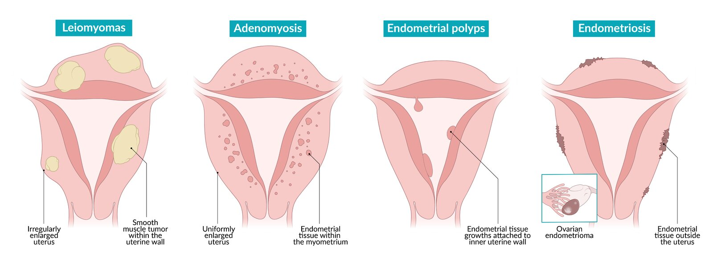

# Dysmenorrhea

*Categories: Clinical knowledge > Obstetrics/gynecology > Basics of obstetrics and gynecology > Dysmenorrhea*

[Original Article Link](https://coursology-qbank.com/amboss/article/NG0-zh)

---

## Summary

Dysmenorrhea is lower abdominal and <u>pelvic pain</u> that occurs shortly before and/or during <u>menstruation</u>. <u>Primary dysmenorrhea</u> is dysmenorrhea in the absence of <u>pelvic</u> pathology and is caused by an increase in <u>prostaglandin</u> levels. It typically begins 6–12 months after <u>menarche</u> and is common in <u>adolescents</u> and young adults. Symptoms may include <u>low back pain</u>, <u>nausea</u>, fatigue, <u>diarrhea</u>, and <u>headaches</u>. <u>Primary dysmenorrhea</u> is clinically diagnosed after excluding <u>features that suggest secondary dysmenorrhea</u> and <u>mimics of dysmenorrhea</u>. Treatment for <u>primary dysmenorrhea</u> includes <u>NSAIDs</u> for <u>pain</u> relief, <u>hormonal contraceptives</u>, and lifestyle modifications. <u>Secondary dysmenorrhea</u> results from an underlying condition such as <u>endometriosis</u> (most commonly), <u>pelvic inflammatory disease</u> (<u>PID</u>), or <u>uterine fibroids</u>. The diagnostic workup and management of <u>secondary dysmenorrhea</u> are based on the suspected condition.

---

## Primary dysmenorrhea

<u>Primary dysmenorrhea</u> is lower abdominal and <u>pelvic pain</u> that occurs shortly before and/or during <u>menstruation</u> and is not caused by <u>pelvic</u> pathology.

### Etiology [[2]](https://coursology-qbank.com/amboss/article/E4d8OJ0)[[3]](https://coursology-qbank.com/amboss/article/MvdM0H0)

Increased production of <u>endometrial</u> <u>prostaglandins</u> (<u>PGF2α</u>) causes:

* Hyperactive uterine contractions

* Uterine <u>vasoconstriction</u> → <u>ischemia</u>

### Clinical features [[2]](https://coursology-qbank.com/amboss/article/E4d8OJ0)[[4]](https://coursology-qbank.com/amboss/article/ord0Rr0)

* Cyclic, crampy lower abdominal and/or <u>pelvic pain</u> [[3]](https://coursology-qbank.com/amboss/article/MvdM0H0)

* Onset 6–12 months after <u>menarche</u>

* Lasts 8–72 hours after onset of menstrual bleeding

* Severity of <u>pain</u> is stable with each <u>menstrual cycle</u>.

* Additional symptoms may include:

* GI symptoms (e.g., <u>nausea</u>, <u>vomiting</u>, <u>diarrhea</u>)

* <u>Headache</u>

* Fatigue, <u>sleep</u> disturbance

* Muscle cramps

* Associated conditions

* <u>Premenstrual disorders</u>

* <u>Depression</u>

* <u>Anxiety</u>

> [!TIP]
> <u>Pain</u> associated with <u>primary dysmenorrhea</u> is typically midline and may radiate to the back or thighs. Consider <u>secondary dysmenorrhea</u> in patients with unilateral <u>pain</u>. [[3]](https://coursology-qbank.com/amboss/article/MvdM0H0)

### Diagnosis [[2]](https://coursology-qbank.com/amboss/article/E4d8OJ0)[[3]](https://coursology-qbank.com/amboss/article/MvdM0H0)[[4]](https://coursology-qbank.com/amboss/article/ord0Rr0)

* <u>Primary dysmenorrhea</u> is ; a <u>clinical diagnosis</u> and a diagnosis of exclusion.

* Make a presumptive diagnosis in patients with:

* No <u>features that suggest secondary dysmenorrhea</u> ; or <u>mimics of dysmenorrhea</u> on detailed <u>patient history</u>

* Negative <u>pregnancy test</u> (for patients who can become pregnant)

> [!TIP]
> <u>Pelvic examination</u> and imaging are not required in <u>adolescents</u> with classic symptoms of <u>primary dysmenorrhea</u>. [[2]](https://coursology-qbank.com/amboss/article/E4d8OJ0)

### Treatment [[2]](https://coursology-qbank.com/amboss/article/E4d8OJ0)

There is insufficient evidence to support a specific treatment algorithm for <u>primary dysmenorrhea</u>. Use initial therapies as monotherapy or combined therapy based on <u>shared decision-making</u>.

* Initial therapy

* <u>Pain</u> relief with <u>NSAIDs</u>: Start any of the following 1–2 days before <u>the menstrual cycle</u> begins, and continue for 2–3 days into the cycle. : [[2]](https://coursology-qbank.com/amboss/article/E4d8OJ0)[[5]](https://coursology-qbank.com/amboss/article/tsdX9r0)

* <u>Ibuprofen</u> (<u>off-label</u>) DOSAGE

* <u>Naproxen</u> (<u>off-label</u>) DOSAGE [[2]](https://coursology-qbank.com/amboss/article/E4d8OJ0)

* See “<u>Oral analgesics</u>” for additional options.

* Hormonal therapy: <u>CHCs</u> or <u>progestin-only contraception</u>  [[2]](https://coursology-qbank.com/amboss/article/E4d8OJ0)[[6]](https://coursology-qbank.com/amboss/article/L7dwmr0)

* Nonpharmacological measures: heating pads, exercise  [[7]](https://coursology-qbank.com/amboss/article/n7d7mr0)[[8]](https://coursology-qbank.com/amboss/article/o7d05r0)

* Refractory dysmenorrhea  [[4]](https://coursology-qbank.com/amboss/article/ord0Rr0)

* Assess <u>treatment adherence</u>.

* Consider <u>diagnostic evaluation for secondary dysmenorrhea</u>. [[4]](https://coursology-qbank.com/amboss/article/ord0Rr0)

* Refer to a specialist (e.g., <u>obstetrics and gynecology</u>) for management.

> [!WARNING]
> <u>Opioids</u> are not recommended for the management of <u>primary dysmenorrhea</u>. [[2]](https://coursology-qbank.com/amboss/article/E4d8OJ0)[[4]](https://coursology-qbank.com/amboss/article/ord0Rr0)

---

## Secondary dysmenorrhea

<u>Secondary dysmenorrhea</u> is lower abdominal and <u>pelvic pain</u> that occurs shortly before and/or during <u>menstruation</u> and is caused by an underlying <u>pelvic</u> condition.

---

## Etiology

* <u>Endometriosis</u> (most common underlying cause)

* <u>PID</u>

* <u>Adenomyosis</u>

* <u>Uterine fibroids</u>

* <u>Ovarian cysts</u> or masses

* <u>Endometrial polyps</u>

* Stenosis of the <u>cervical os</u>

* Obstructive <u>anomalies of the female genital tract</u> (e.g., <u>imperforate hymen</u>, <u>transverse vaginal septum</u>)

* Intrauterine adhesions (i.e., <u>Asherman syndrome</u>) or <u>pelvic</u> adhesions

* <u>Copper intrauterine device</u> [[9]](https://coursology-qbank.com/amboss/article/umXphA)[[10]](https://coursology-qbank.com/amboss/article/DIW1U50)

> [!TIP]
> <u>Endometriosis</u> is the most common underlying cause of <u>secondary dysmenorrhea</u>. [[4]](https://coursology-qbank.com/amboss/article/ord0Rr0)

---

## Clinical evaluation

### Focused history [[2]](https://coursology-qbank.com/amboss/article/E4d8OJ0)[[4]](https://coursology-qbank.com/amboss/article/ord0Rr0)

Obtain a complete medical, family, and <u>gynecologic and obstetric history</u>, including:

* <u>Sexual history</u> (e.g., <u>risk factors for STIs</u>)

* Clinical features that suggest secondary dysmenorrhea, e.g.:

* <u>Pain</u> characteristics

* Onset with <u>menarche</u> or > 25 years of age [[4]](https://coursology-qbank.com/amboss/article/ord0Rr0)

* Sudden, severe, and/or progressively worsens

* Noncyclical or mid-cycle

* Associated symptoms

* Abnormal <u>vaginal discharge</u>

* <u>Abnormal uterine bleeding</u> (<u>AUB</u>)

* <u>Infertility</u>

* <u>Dyspareunia</u>

* <u>Clinical features of PID</u>

* Personal and family <u>medical history</u>

* <u>Family history</u> of <u>endometriosis</u>

* Congenital abnormalities (e.g., genitourinary, <u>vertebral</u>, cardiac, gastrointestinal)

* History of procedural interventions (e.g., <u>IUD</u> placement, <u>pelvic</u> <u>surgery</u>)  [[4]](https://coursology-qbank.com/amboss/article/ord0Rr0)

* Unsuccessful empiric treatment for <u>primary dysmenorrhea</u>

### Focused examination [[2]](https://coursology-qbank.com/amboss/article/E4d8OJ0)

* <u>Abdominal examination</u>

* <u>Pelvic examination</u>: to assess for abnormalities suggesting an underlying cause of <u>secondary dysmenorrhea</u>, e.g.,

* Uterine enlargement or irregularity

* <u>Cervical motion tenderness</u>

* Adnexal tenderness or mass

* Vaginal or cervical discharge

* Obstructive <u>anomalies of the female genital tract</u>

---

## Diagnostics

* Initial testing [[2]](https://coursology-qbank.com/amboss/article/E4d8OJ0)[[4]](https://coursology-qbank.com/amboss/article/ord0Rr0)

* <u>Pregnancy test</u> for patients who can become pregnant

* <u>STI screening</u> (e.g., <u>NAAT</u> for <u>chlamydia</u> and <u>gonorrhea</u>) in sexually active patients

* <u>Pelvic</u> <u>ultrasound</u>

* Additional testing: may include the following based on suspected etiology  [[2]](https://coursology-qbank.com/amboss/article/E4d8OJ0)[[4]](https://coursology-qbank.com/amboss/article/ord0Rr0)

* Diagnostics to exclude <u>mimics of dysmenorrhea</u> (e.g., <u>urinalysis</u> for patients with urinary symptoms)  [[4]](https://coursology-qbank.com/amboss/article/ord0Rr0)

* Targeted testing for specific <u>causes of secondary dysmenorrhea</u> (e.g., diagnostics for <u>endometriosis</u>)

---

## Common causes

|  <u>Common causes of secondary dysmenorrhea</u> [[2]](https://coursology-qbank.com/amboss/article/E4d8OJ0)[[4]](https://coursology-qbank.com/amboss/article/ord0Rr0)  |  |  |  |
| --- | --- | --- | --- |
|  | Characteristic clinical features | Diagnostic findings | Management |
|  <u>Endometriosis</u> [[11]](https://coursology-qbank.com/amboss/article/v4dAOJ0)[[12]](https://coursology-qbank.com/amboss/article/eJ1xG30)  |   * Chronic <u>pelvic pain</u> (worsens before onset of menstrual bleeding) [[13]](https://coursology-qbank.com/amboss/article/Usdb8r0)  * <u>Dyspareunia</u>  * <u>Infertility</u>  * <u>Dyschezia</u>, <u>dysuria</u>  * <u>Adnexal masses</u> and/or tenderness  * Rectovaginal tenderness    |   * <u>TVUS</u> (best initial test): <u>endometriomas</u> [[14]](https://coursology-qbank.com/amboss/article/z4drNJ0)  * <u>Laparoscopy</u>: direct visualization and histopathological confirmation  * A negative diagnostic workup does not exclude <u>endometriosis</u>.    |   * Initial therapy [[15]](https://coursology-qbank.com/amboss/article/7Nd4cq0)  * <u>CHCs</u> (preferred) or <u>progestin-only contraception</u>  * <u>NSAIDs</u>  * <u>GnRH agonists</u>, <u>danazol</u>  * <u>Surgery</u> [[16]](https://coursology-qbank.com/amboss/article/6odj1I0)  * Conservative: excision and/or <u>ablation</u> of lesions  * Definitive: <u>hysterectomy</u> ± bilateral <u>salpingo-oophorectomy</u>    |
|  <u>Pelvic inflammatory disease</u> (<u>PID</u>) [[17]](https://coursology-qbank.com/amboss/article/2NcT010)[[18]](https://coursology-qbank.com/amboss/article/mxcVCe0)  |   * Lower abdominal/<u>pelvic pain</u>  * <u>Fever</u>, <u>nausea</u>, <u>vomiting</u>  * Mucopurulent cervical discharge  * <u>Cervical motion tenderness</u>    |   * <u>Clinical diagnosis</u> based on <u>diagnostic criteria for PID</u>  * <u>Pathogen</u> identification (e.g., positive <u>NAAT</u> for <u>chlamydia</u> and/or <u>gonorrhea</u>)    |   * <u>Empiric antibiotic therapy for PID</u>  * Hospitalization in severe cases  * See “<u>Treatment of PID</u>” for details.    |
|  <u>Adenomyosis</u> [[19]](https://coursology-qbank.com/amboss/article/dOdorJ0)[[20]](https://coursology-qbank.com/amboss/article/WOdPrJ0)  |   * <u>AUB</u>  * Chronic <u>pelvic pain</u>  * <u>Dyspareunia</u>  * Uniformly enlarged, mildly tender <u>uterus</u>    |   * Imaging (<u>TVUS</u>, <u>MRI</u>): asymmetric myometrial thickening  * <u>Biopsy</u> (selected patients): histopathological confirmation [[21]](https://coursology-qbank.com/amboss/article/KodU1I0)    |   * <u>Pain management</u> (first line: <u>NSAIDs</u>)  * Hormonal therapy (e.g., <u>CHCs</u>, <u>progestin-only contraception</u>)  * <u>Surgery</u>  * Conservative: hysteroscopic <u>endometrial</u> excision, <u>ablation</u>  * Definitive: <u>hysterectomy</u>    |
|  <u>Uterine leiomyoma</u> [[22]](https://coursology-qbank.com/amboss/article/uEWpxM0)[[23]](https://coursology-qbank.com/amboss/article/XAc9RU0)  |   * <u>AUB</u>  * Back/<u>pelvic pain</u>  * <u>Infertility</u>  * <u>Urinary tract</u> or bowel symptoms  * <u>Dyspareunia</u>  * Firm, irregular, enlarged <u>uterus</u> [[24]](https://coursology-qbank.com/amboss/article/5sdivr0)    |  * <u>Ultrasound</u> (best initial test): well-circumscribed <u>hypoechoic</u> solid mass [[25]](https://coursology-qbank.com/amboss/article/KM1Uph0)   |   * Minimal symptoms: <u>expectant management</u>  * Pharmacological treatment  * <u>GnRH agonists</u>  * <u>CHCs</u>, <u>progestin-only contraception</u>  * Procedural interventions (e.g., <u>uterine artery embolization</u>, <u>myomectomy</u>, <u>hysterectomy</u>)    |
|  <u>Intrauterine adhesions</u> [[26]](https://coursology-qbank.com/amboss/article/3v1S-i0)[[27]](https://coursology-qbank.com/amboss/article/T7d6Or0)  |   * <u>Amenorrhea</u>  * <u>Infertility</u>, <u>recurrent pregnancy loss</u>    |   * Negative <u>hormone withdrawal testing in amenorrhea</u> [[28]](https://coursology-qbank.com/amboss/article/45d34q0)  * Diagnostic <u>hysteroscopy</u> (preferred): visualization of adhesions    |   * Treat only if symptomatic.  * <u>Surgery</u> (e.g., lysis of adhesions, <u>hysterectomy</u>)    |
|  Obstructive <u>anomalies of the female genital tract</u> [[29]](https://coursology-qbank.com/amboss/article/2MdTLq0)  |   * <u>Pelvic pain</u>  * <u>Amenorrhea</u> or <u>AUB</u>  * <u>Infertility</u>  * <u>Dyspareunia</u>  * Palpable abdominal mass  * Shortened <u>vagina</u>  * <u>Hematocolpos</u>    |   * <u>TVUS</u>: may show <u>hematocolpos</u>  * <u>MRI</u>: can confirm presence of specific anomalies    |  * Refer to gynecology for surgical management (e.g., <u>hymenectomy</u>, vaginal septum resection).   |
|  <u>Endometrial polyps</u> [[30]](https://coursology-qbank.com/amboss/article/yOddEJ0)[[31]](https://coursology-qbank.com/amboss/article/jod_bI0)[[32]](https://coursology-qbank.com/amboss/article/nKd7SI0)  |   * May be asymptomatic  * <u>AUB</u> or <u>postmenopausal bleeding</u>  * <u>Infertility</u>  * <u>Recurrent pregnancy loss</u>    |   * <u>TVUS</u>: focal echogenic <u>endometrial</u> mass with preserved <u>endometrial</u>-myometrial interface [[32]](https://coursology-qbank.com/amboss/article/nKd7SI0)[[33]](https://coursology-qbank.com/amboss/article/0mdeVq0)  * <u>Hysteroscopy</u> or <u>sonohysterography</u>: visualization of polyps  * Negative <u>endometrial biopsy</u> can rule out other causes (e.g., <u>endometrial hyperplasia</u> or <u>carcinoma</u>).    |   * Asymptomatic <u>premenopausal</u> patients: observation and follow-up  * Symptomatic or <u>risk factors for endometrial cancer</u>: hysteroscopic polypectomy  * See “Treatment” in “<u>Endometrial polyps</u>” for details.    |
|  <u>Ovarian cysts</u> or masses [[2]](https://coursology-qbank.com/amboss/article/E4d8OJ0)[[34]](https://coursology-qbank.com/amboss/article/NJY-8J)  |   * Unilateral <u>pelvic pain</u>  * Abdominal <u>bloating</u>  * An <u>adnexal mass</u> may be palpable.    |   * <u>Pelvic</u> imaging: <u>ovarian cyst</u> or mass  * See also “<u>Diagnostics for adnexal mass</u>.”    |   * <u>Ovarian cysts</u>  * Functional cysts: <u>expectant management</u>  * Symptomatic, large, or complicated cysts: <u>surgery</u>  * <u>Ovarian cancer</u>: Treatment depends on <u>cancer stage</u>.  * See respective articles for details.    |

Benign conditions of the uterus

---

## Management

* Treat the underlying cause.

* If no cause is identified on diagnostic evaluation: [[4]](https://coursology-qbank.com/amboss/article/ord0Rr0)

* Refer to <u>obstetrics and gynecology</u>.

* Additional evaluation may include advanced imaging and/or <u>surgery</u> (e.g., <u>laparoscopy</u> to evaluate for <u>endometriosis</u>).

---