# General endocrinology

*Categories: Clinical knowledge > Obstetrics/gynecology > Basics of obstetrics and gynecology > General endocrinology*

[Original Article Link](https://coursology-qbank.com/amboss/article/AT0Rt2)

---

## Summary

Endocrinology is the study of the endocrine system (i.e., the <u>hypothalamus</u>, <u>pituitary gland</u>, <u>thyroid gland</u>, <u>adrenals</u>, and <u>gonads</u>), metabolic diseases, and certain aspects of nutritional medicine. The endocrine glands are responsible for producing and secreting <u>hormones</u>, which influence the function of cells in certain tissues of the body. <u>Hormone</u> secretion is controlled by highly regulated pathways, the most important of which is the <u>hypothalamic-pituitary axis</u>. The <u>hypothalamus</u> secretes and stores <u>nontropic hormones</u> (e.g., <u>ADH</u>, <u>oxytocin</u>) and <u>releasing hormones</u> (e.g., <u>TRH</u>, <u>CRH</u>, <u>GnRH</u>). The <u>pituitary gland</u> is composed of the <u>anterior pituitary</u>, which secretes <u>tropic hormones</u> (e.g., <u>ACTH</u>, <u>TSH</u>, <u>FSH</u>, <u>LH</u>) and whose function is controlled by <u>hypothalamic</u> <u>releasing hormones</u>, and the <u>posterior pituitary</u>, which stores <u>ADH</u> and <u>oxytocin</u>. The <u>gonads</u> are the <u>ovaries</u> in female individuals and <u>testicles</u> in male individuals. Their function is controlled via the <u>hypothalamic-pituitary-gonadal axis</u>, as well as the secretion of <u>sex hormone-binding globulin</u> (<u>SHBG</u>). Disruption of the <u>hypothalamic</u>-<u>pituitary</u> axis can result in the development of various endocrine disorders, which are classified according to the level of pathway disruption: primary (disorders of the peripheral endocrine gland), secondary (<u>pituitary</u> dysfunctions), and tertiary (<u>hypothalamic</u> disorders). An understanding of these <u>hormone</u> pathways is important for the diagnosis and management of endocrine disorders, particularly when interpreting changes in <u>hormone</u> levels and the results of suppression and/or stimulation tests.

For more information, see the articles "<u>Thyroid gland and parathyroid glands</u>" and “<u>Adrenal gland</u>.”

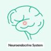

The Neuroendocrine System: Regulatory Processes

---

## Overview of endocrinological diseases

This article focuses on the <u>hypothalamic-pituitary axis</u>. Other important structures, <u>hormones</u>, and metabolic diseases are discussed in their respective articles.

* Types of endocrinological diseases

* Primary disease: caused by disorders of the endocrine gland (e.g., <u>Addison disease</u>)

* Secondary disease: caused by disorders of the <u>pituitary</u> (e.g., <u>Cushing disease</u>)

* Tertiary disease: caused by disorders of the <u>hypothalamus</u> (e.g., <u>hypothalamic</u> trauma, hemorrhage)

* Metabolic diseases

* <u>Diabetes mellitus</u>

* <u>Metabolic syndrome</u>

* <u>Osteoporosis</u> (See “<u>Calcium homeostasis</u>” in “<u>Hypocalcemia</u>”)

* Diseases of the endocrine glands of the <u>hypothalamic-pituitary axis</u>

* <u>Pituitary gland</u>

* <u>Hypopituitarism</u>

* <u>Prolactinoma</u>

* <u>Acromegaly</u>

* <u>Diabetes insipidus</u>

* <u>SIADH</u>

* <u>Central precocious puberty</u>

* <u>Adrenal cortex</u>

* <u>Hypocortisolism</u>

* <u>Cushing syndrome</u>

* <u>Primary hyperaldosteronism</u>

* <u>Congenital adrenal hyperplasia</u>

* <u>Adrenal insufficiency</u>

* <u>Thyroid gland</u>

* <u>Hypothyroidism</u>

* <u>Hyperthyroidism</u>

* <u>Gonads</u>

* <u>Hypogonadotropic hypogonadism</u>

* <u>Hypergonadotropic hypogonadism</u>

---

## Basics of endocrinology

### Hormones

* Definition

* <u>Hormones</u> are <u>endogenous</u> messengers produced by endocrine glands or single cells that are responsible for <u>signal transduction</u>.

* They influence the function and metabolic rate of other organs and cells in the body.

* Complex regulatory circuits (e.g., the <u>hypothalamic-pituitary axis</u>) control their secretion.

* Types of <u>hormones</u>

| Overview of the most important types of <u>hormones</u> |  |  |
| --- | --- | --- |
| Type of <u>hormone</u> | Description | Example |
| Based on signaling pathways |  |  |
| Paracrine hormones |  * Affect the neighboring cells via <u>diffusion</u>   |  * <u>D cells</u> of the <u>stomach</u> produce <u>somatostatin</u> to inhibit neighboring <u>G cells</u> from secreting <u>gastrin</u>.   |
| Autocrine hormones |  * Affect the secreting cell itself   |  * <u>Autocrine signaling</u> is particularly important for the self-renewal of <u>embryonic stem cells</u>. [[1]](https://coursology-qbank.com/amboss/article/aqbQCu)   |
| Endocrine hormones |  * Secreted into the bloodstream to reach their targets   |  * <u>Pancreatic</u> <u>β cells</u> secrete <u>insulin</u> directly into the bloodstream to stimulate the uptake of <u>glucose</u> by the hepatic, muscle, and <u>adipose tissue</u> cells.   |
| Based on chemical nature |  |  |
| Steroid hormones |  * Derived from <u>cholesterol</u>   |   * Testosterone  * <u>Progesterone</u>  * <u>Estrogen</u>  * <u>Glucocorticoids</u>  * <u>Mineralocorticoids</u>    |
| Amine hormones |  * Derived from a single <u>amino acid</u> such as <u>phenylalanine</u>, <u>tyrosine</u>, or <u>tryptophan</u>   |   * <u>Catecholamines</u>  * <u>Thyroid hormones</u> (T3 and T4)    |
| Peptide hormones |  * Derived from a few or many <u>amino acids</u>   |   * <u>Oxytocin</u>  * <u>Vasopressin</u>  * <u>Prolactin</u>  * <u>Glucagon</u>  * <u>Insulin</u>    |
| Based on solubility |  |  |
| Lipophilic hormones |   * Diffuse through the lipid plasma membrane of cells, bind to <u>intracellular receptors</u>, and affect <u>transcription</u>  * Usually have long-term effects with delayed onset (e.g., sex <u>hormones</u>)    |   * <u>Steroid hormones</u>  * <u>Thyroid hormones</u>    |
| Hydrophilic hormones |   * Water-soluble  * Bind to <u>receptor</u> <u>proteins</u> on the <u>cellular membrane</u>    |  * Amine and <u>peptide hormones</u> (except for <u>thyroid hormones</u>, which are <u>lipophilic</u>)   |

> [!NOTE]
> <u>Hydrophilic hormones</u> (e.g., <u>catecholamines</u>) are stored in secretory granules and released when needed. <u>Lipophilic hormones</u> (e.g., adrenocortical <u>steroid hormones</u>) pass into the bloodstream once synthesized without being stored in cells.

* Degradation of <u>hormones</u>

* <u>Steroid hormones</u> and <u>thyroid hormones</u>: inactivation and conjugation in the <u>liver</u> and excretion in <u>bile</u>

* <u>Catecholamines</u>: enzymatic degradation and excretion in urine (e.g., <u>vanillylmandelic acid</u>)

* <u>Peptide</u>/protein <u>hormones</u>: proteolytic degradation mainly in the <u>liver</u> and <u>kidneys</u>

### Feedback control mechanisms

<u>Hormone</u> secretion is controlled by the following feedback mechanisms: [[2]](https://coursology-qbank.com/amboss/article/bqbHCu)

* Negative feedback  

* <u>Hormone</u> secretion by the endocrine gland suppresses the release of <u>hypothalamic</u> and <u>pituitary</u> <u>hormones</u>.

* Negative feedback loop types include:

* Ultrashort feedback loop: <u>Hypothalamic</u> <u>hormones</u> inhibit their own secretion via <u>autocrine</u> effects.

* Short feedback loop: <u>Pituitary</u> <u>hormones</u> inhibit the release of <u>hypothalamic</u> <u>hormones</u>.

* Long feedback loop: <u>Hormones</u> from peripheral endocrine glands inhibit the release of <u>hypothalamic</u> and <u>pituitary</u> <u>hormones</u>.

* Example: <u>Thyroid hormone</u> signaling decreases the production of <u>thyrotropin-releasing hormone</u> (<u>TRH</u>) and <u>thyroid-stimulating hormone</u> (<u>TSH</u>).

* Positive feedback

* <u>Hormone</u> secretion enhances its own production.

* Example: Uterine stretching during <u>labor</u> contractions under the influence of <u>oxytocin</u> triggers the release of more <u>oxytocin</u> from the <u>posterior pituitary</u>.

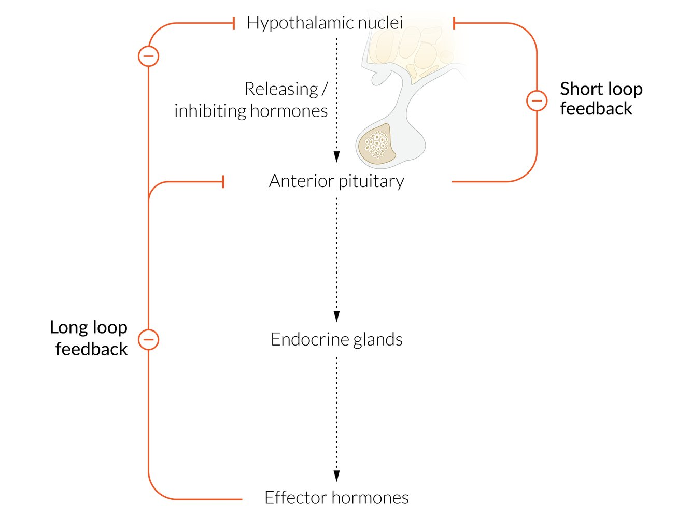

Negative feedback (inhibition) of the hypothalamus-pituitary axis

### Diagnosis of endocrine diseases

* Direct measurement of <u>hormone</u> blood levels (e.g., measuring <u>prolactin</u> blood level upon suspicion of <u>prolactinoma</u>)

* Stimulation of glands to detect underactivity (e.g., <u>ACTH stimulation test</u> for <u>Addison disease</u>)

* Inhibition of glands to detect hyperactivity (e.g., <u>dexamethasone suppression test</u> for <u>Cushing syndrome</u>)

* Imaging of glands to determine:

* Morphological abnormalities (e.g., <u>thyroid ultrasound</u>)

* Functional abnormalities (e.g., <u>thyroid scintigraphy</u>)

* Specific <u>laboratory studies</u> (e.g., determination of <u>thyrotropin</u> <u>receptor</u> <u>antibodies</u>; <u>HbA1c</u> for <u>diabetes mellitus</u>)

---

## Hypothalamus and pituitary gland

### <u>Hypothalamus</u>

* Anatomy

* <u>Ventral</u> part of the <u>diencephalon</u> (see “<u>Diencephalon</u>”)

* Composed of multiple <u>nuclei</u> (e.g., <u>lateral nucleus</u>, <u>preoptic nucleus</u>)

* Function

* Regulation of hormonal secretion by the <u>anterior pituitary gland</u> via the <u>hypothalamic-pituitary axis</u>

* Secretion/storage of <u>ADH</u> and <u>oxytocin</u>

* <u>ADH</u> and <u>oxytocin</u> are produced in the <u>supraoptic nucleus</u> and <u>paraventricular nucleus</u> of the <u>hypothalamus</u>.

* Both <u>hormones</u> are transported to the <u>posterior pituitary</u> via neurophysins (a group of carrier <u>proteins</u>) and released into the circulation as needed.

* Reception and integration of sensory inputs (e.g., from <u>area postrema</u>, <u>OVLT</u>)

* Thirst and hunger regulation

* Autonomic function control

* <u>Thermoregulation</u>

* <u>Hormones</u>

* Inhibiting hormones

* Function: decrease hormonal secretion from the <u>pituitary gland</u>

* Examples: <u>somatostatin</u>, <u>dopamine</u>

* Releasing hormones

* Function: increase hormonal secretion from the <u>pituitary gland</u>

* Examples: <u>thyrotropin-releasing hormone</u> (<u>TRH</u>), <u>corticotropin-releasing hormone</u> (<u>CRH</u>), <u>gonadotropin-releasing hormone</u> (<u>GnRH</u>), <u>growth hormone-releasing hormone</u> (<u>GHRH</u>)

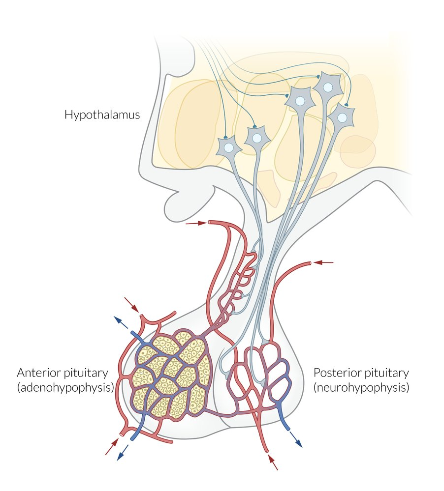

Functional anatomy of the hypothalamic-pituitary axis

### Pituitary gland (<u>hypophysis</u>)

* Anatomy

* Located in the sella turcica (midline <u>depression</u> of the <u>sphenoid bone</u>) of the <u>middle cranial fossa</u>

* Connected to the <u>hypothalamus</u> via the pituitary stalk (a tube-like structure between the median eminence of the <u>hypothalamus</u> and the <u>posterior pituitary</u> that contains the <u>axons</u> of the <u>posterior pituitary</u> <u>neurons</u>)

* Consists of two major parts:

* Anterior pituitary gland (<u>adenohypophysis</u>): develops from oral <u>ectoderm</u> (<u>Rathke pouch</u>)

* Posterior pituitary gland (<u>neurohypophysis</u>): develops from <u>neural ectoderm</u>

* The three major types of <u>pituitary</u> cells are:

* Acidophil cells

* Secrete <u>prolactin</u> and <u>growth hormone</u> (<u>GH</u>)

* Stain well with acidic dyes such as eosin

* Basophilic cells

* Secrete <u>adrenocorticotropic hormone</u> (<u>ACTH</u>), <u>thyroid-stimulating hormone</u> (<u>TSH</u>), <u>luteinizing hormone</u> (<u>LH</u>), and <u>follicle-stimulating hormone</u> (<u>FSH</u>)

* Stain well with basic dyes (e.g., hematoxylin)

* Chromophobe cells

* Do not secrete <u>hormones</u>  [[3]](https://coursology-qbank.com/amboss/article/ES08Yf)

* Stain poorly with both acidic and basic dyes

* Function

* <u>Anterior pituitary gland</u>

* Regulation of endocrine gland function via the release of <u>tropic hormones</u>

* Secretion of <u>nontropic hormones</u> with direct peripheral effects

* <u>Posterior pituitary gland</u>: storage/release of <u>ADH</u> and <u>oxytocin</u> in pituicytes (<u>glial cells</u>)

* Intermediate <u>pituitary gland</u>: secretion of <u>melanocyte-stimulating hormone</u> (<u>MSH</u>)

* <u>Hormones</u>

* Tropic hormones: act on endocrine glands to mediate their effects

* All <u>pituitary</u> glycoprotein <u>hormones</u> (e.g., <u>FSH</u>, <u>LH</u>, <u>TSH</u>) have a common alpha subunit.

* Each <u>hormone</u> has a unique beta subunit.

* Nontropic hormones: act directly on target-tissue cells

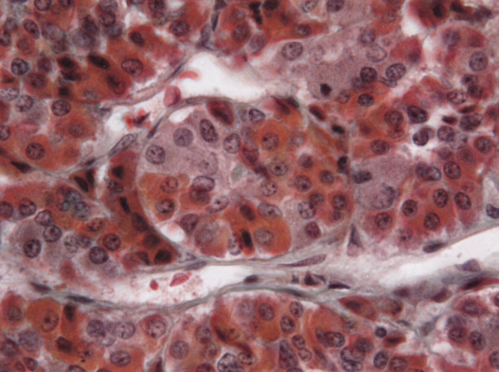

Adenohypophysis

> [!NOTE]
> “B-FLAT”: Basophils secrete FSH, LH, ACTH, and TSH.

> [!NOTE]
> “PiG on Acid”: Prolactin and GH are secreted by Acidophils.

---

## Hypothalamic-pituitary axis

### <u>Hypothalamus</u> and <u>anterior pituitary</u>

#### <u>Tropic hormones</u>

| Tropic <u>hypothalamic</u> <u>hormones</u> and their effects |  |  |  |
| --- | --- | --- | --- |
| Axis | <u>Hypothalamus</u> | <u>Pituitary gland</u> | Endocrine target organ |
|  Hypothalamic-pituitary-adrenal axis    |  * CRH  * Stimulates <u>ACTH</u>, <u>MSH</u>, and β-<u>endorphin</u> secretion from proopiomelanocortin (<u>POMC</u>) precursor  * <u>CRH</u> levels decrease after long-term <u>steroid</u> treatment via negative feedback.   |  * ACTH  * Stimulates <u>adrenal</u> <u>glucocorticoid</u> and <u>androgen</u> production  * Cleaved in the corticotropic cells of the <u>anterior pituitary</u>  * <u>ACTH</u> and <u>MSH</u> share the common precursor <u>POMC</u>, which explains the <u>hyperpigmentation</u> seen in <u>Cushing disease</u>.   |  * <u>Adrenal cortex</u>   |
|  Hypothalamic-pituitary-thyroid axis    |  * TRH  * Stimulates <u>TSH</u> and <u>prolactin</u> secretion  * An increase in <u>TRH</u> levels (e.g., in primary/<u>secondary hypothyroidism</u>) may result in the development of <u>galactorrhea</u> because it stimulates <u>prolactin</u> secretion.   |  * TSH  * Stimulates <u>thyroid hormone production</u>  * <u>TSH</u> secretion is inhibited by <u>dopamine</u>, <u>somatostatin</u>, and <u>glucocorticoids</u>.  [[4]](https://coursology-qbank.com/amboss/article/jrb_SE)  * <u>TSH</u> levels are the best initial test in the workup of <u>hypothyroidism</u>.   |  * <u>Thyroid gland</u>   |
|  Hypothalamic-pituitary-gonadal axis    |  * GnRH  * Stimulates <u>FSH</u> and <u>LH</u> secretion  * During <u>breastfeeding</u>, high <u>prolactin</u> levels cause supressed <u>GnRH</u> secretion, which results in the development of <u>lactational amenorrhea</u>.  * Pulsatile <u>GnRH</u> secretion is responsible for <u>puberty</u> and reproductive function.   |  * Gonadotropins  * LH  * Female individuals: triggers <u>ovulation</u>  * Male individuals: stimulates <u>testosterone</u> synthesis in <u>Leydig cells</u>  * FSH: stimulates the maturation of germ cells in both male and female individuals   |  * <u>Gonads</u>  * Female individuals: <u>ovaries</u>  * Male individuals: <u>testicles</u>   |

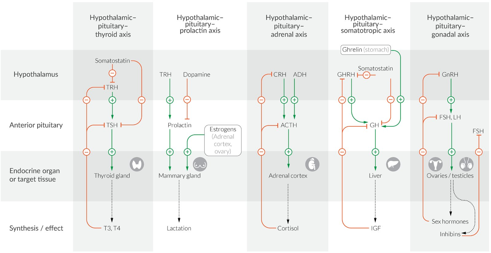

Overview of the hypothalamic-pituitary-target organ axes

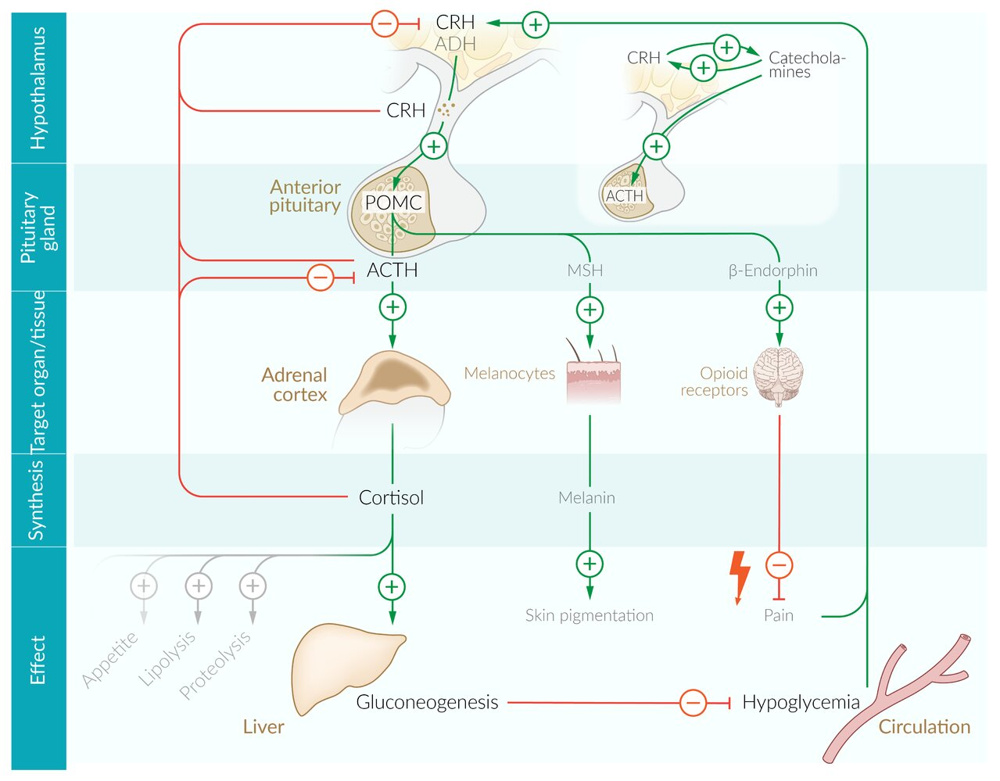

Regulation of the hypothalamic-pituitary-adrenal axis

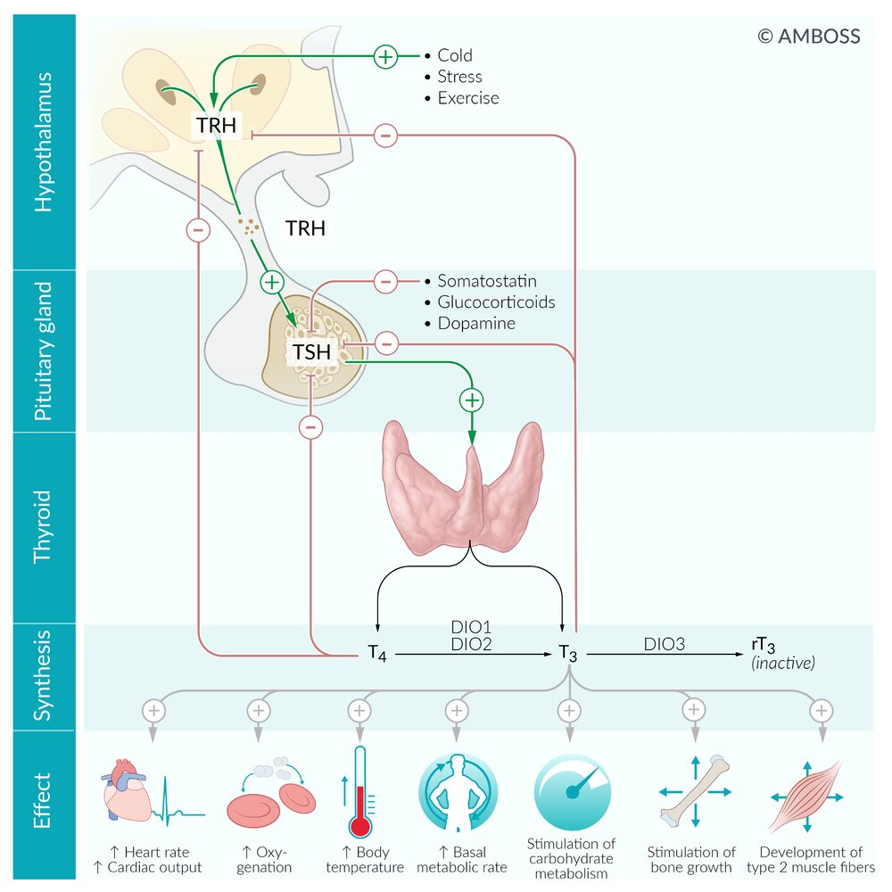

Regulation of thyroid hormone synthesis

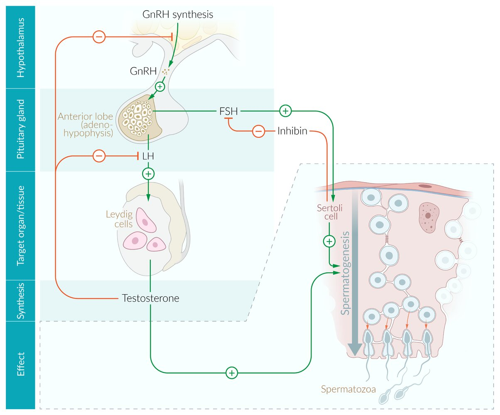

Hypothalamic-pituitary-gonadal axis (male)

#### <u>Nontropic hormones</u>

| Nontropic <u>hypothalamic</u> <u>hormones</u> and their effects |  |  |
| --- | --- | --- |
| Axis | <u>Hypothalamus</u> | <u>Pituitary gland</u> |
|  Hypothalamic-pituitary-somatotropic axis   |  * GHRH  * Stimulates <u>GH</u> secretion  * Synthetic forms of <u>GHRH</u> (<u>tesamorelin</u>) can be used for abdominal fat reduction in <u>HIV-associated lipodystrophy</u>.   |  * GH (<u>growth hormone</u>, <u>somatotropin</u>)  * Direct effects   * ↓ <u>Glucose</u> uptake into cells (↑ <u>insulin resistance</u>)  * ↑ <u>Lipolysis</u>  * ↑ <u>Protein synthesis</u> in muscle  * ↑ <u>Amino acid</u> uptake  * Indirect effects: mediated by IGF-1 (<u>insulin-like growth factor 1</u>; originally called <u>somatomedin C</u>)   * Growth stimulation  * <u>Anabolic</u> effect on body  * <u>GH</u> regulation [[5]](https://coursology-qbank.com/amboss/article/7eX4Zx)[[6]](https://coursology-qbank.com/amboss/article/reXfZx)  * ↑ <u>GH</u> secretion: exercise, <u>deep sleep</u>, <u>puberty</u>, <u>hypoglycemia</u>, <u>CKD</u>, <u>thyroid hormone</u>, <u>estrogen</u>, <u>testosterone</u>, and short-term <u>glucocorticoid</u> exposure  * ↓ <u>GH</u> secretion: <u>glucose</u>, <u>somatostatin</u>, somatomedin, free <u>fatty acids</u>, and chronic <u>glucocorticoid</u> therapy  [[6]](https://coursology-qbank.com/amboss/article/reXfZx)[[7]](https://coursology-qbank.com/amboss/article/seXtZx)   |
|  * <u>Somatostatin</u>  * Inhibits <u>GH</u> and <u>TSH</u> secretion  * Synthetic forms of <u>somatostatin</u> are used in the <u>treatment of acromegaly</u> (e.g., <u>octreotide</u>).   |  |  |
| Hypothalamic-pituitary-prolactin axis |  * <u>Dopamine</u> (<u>prolactin-inhibiting hormone</u>): inhibits secretion of <u>prolactin</u> in the <u>pituitary gland</u> and has a higher influence on <u>prolactin</u> regulation than <u>TRH</u>   |  * Prolactin (secreted by lactotropic cells)  * ↑ <u>Breast</u> tissue growth and lactation  * Inhibits <u>GnRH</u> secretion  * Female individuals  * Inhibition of <u>ovulation</u>  * <u>Amenorrhea</u>  * <u>Galactorrhea</u>  * Decreased libido  * Male individuals  * Inhibition of <u>spermatogenesis</u>  * Decreased libido   |
|  * <u>TRH</u>: stimulates the secretion of <u>prolactin</u> (but is not part of the <u>hypothalamic-pituitary-prolactin axis</u>)   |  |  |
| Hypothalamic-melanocortin system |  * Melanocyte-inhibiting hormone: inhibits release of <u>MSH</u>   |   * α-MSH  * Cleaved in the arcuate <u>nucleus</u>  * <u>Regulation of appetite</u> and metabolism: promotes satiety [[8]](https://coursology-qbank.com/amboss/article/2qbTBu)  * Stimulates <u>melanogenesis</u> → <u>melanocyte</u> stimulation → <u>hyperpigmentation</u>  * <u>β-MSH</u>    |

> [!NOTE]
> “No PRO-BLAM:” Derivatives of PROopiomelanocortin are Beta-<u>endorphin</u>, ACTH, and MSH.

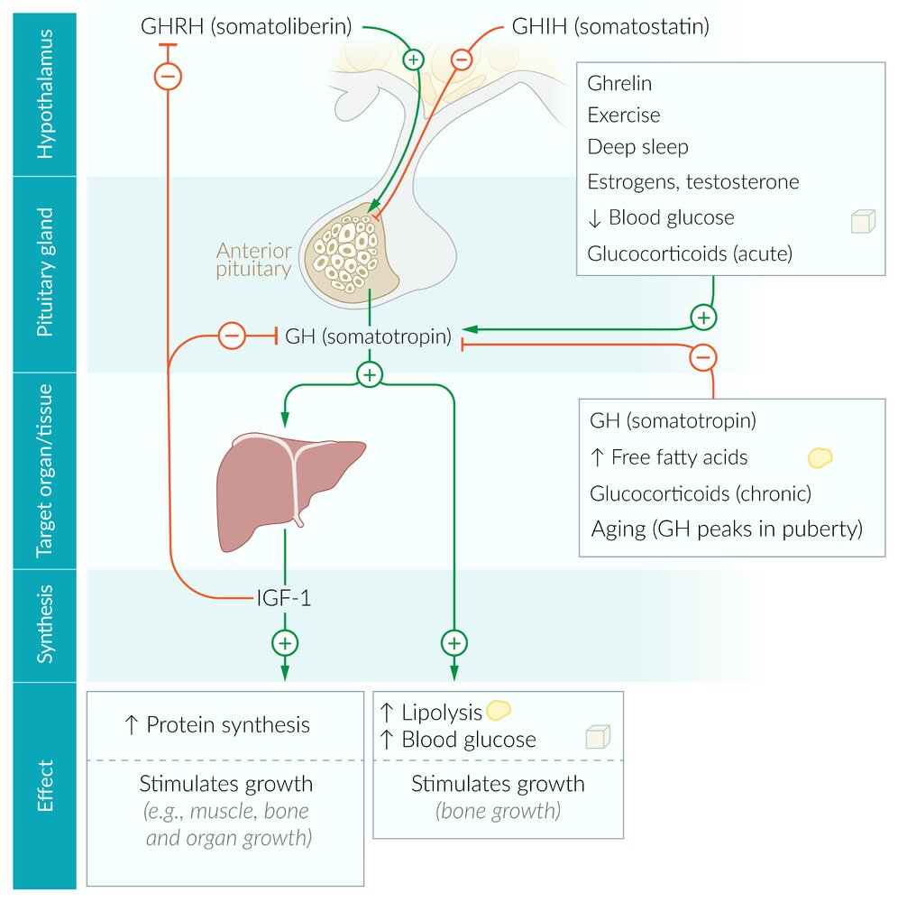

Hypothalamic-pituitary-somatotropic axis

Hormonal feedback control of nontropic hormones

### <u>Hypothalamus</u> and <u>posterior pituitary</u>

| <u>Hormones</u> of the <u>posterior pituitary gland</u> |  |  |  |
| --- | --- | --- | --- |
| <u>Hormone</u> |  Regulation [[9]](https://coursology-qbank.com/amboss/article/op00qS)  | Main effects | Clinical relevance |
|  Antidiuretic hormone    |   * <u>Plasma osmolality</u>: sensed by <u>hypothalamic</u> <u>osmoreceptors</u>  * <u>Hypovolemia</u>: sensed by the atrial stretch <u>receptors</u>  * <u>Hypotension</u>: sensed by the peripheral <u>baroreceptors</u>  * <u>Angiotensin II</u>: sensed by <u>hypothalamic</u> <u>receptors</u>    |   * Regulation of <u>plasma osmolality</u>    * Mediated by V2 receptors  * Insertion of <u>aquaporin channels</u> in the <u>principal cells</u> of the renal <u>collecting duct</u> and <u>DCT</u> [[10]](https://coursology-qbank.com/amboss/article/SqbyBu)  * Results in increased water reabsorption  * Regulation of blood pressure  * Mediated by V1 receptors  * Vasoconstrictive effects at higher levels  * Increase of <u>urea</u> reabsorption in the <u>collecting duct</u>: increases the corticomedullary gradient and facilitates <u>urine concentration</u>  * <u>ACTH</u> release [[11]](https://coursology-qbank.com/amboss/article/8eXO0x)    |   * Elevated in <u>SIADH</u> despite plasma <u>hypoosmolality</u>  * <u>ADH</u> deficiency or resistance can lead to <u>diabetes insipidus</u>.  * Second-line therapy for <u>septic shock</u> (increases organ <u>perfusion</u>)  * <u>Alcohol</u> inhibits <u>ADH</u> release and causes diuresis. [[12]](https://coursology-qbank.com/amboss/article/ueXp0x)    |
|  Oxytocin    |   * <u>Nipple</u> stimulation  * Stretching of the <u>vagina</u> or <u>cervix</u>    |   * Promotes uterine contractions during <u>labor</u>  * Facilitates milk ejection reflex via <u>myoepithelial cell</u> contraction    |  * Involved in the neuromodulation of social and reproductive behavior, fear, <u>anxiety</u>, and <u>depression</u>   |

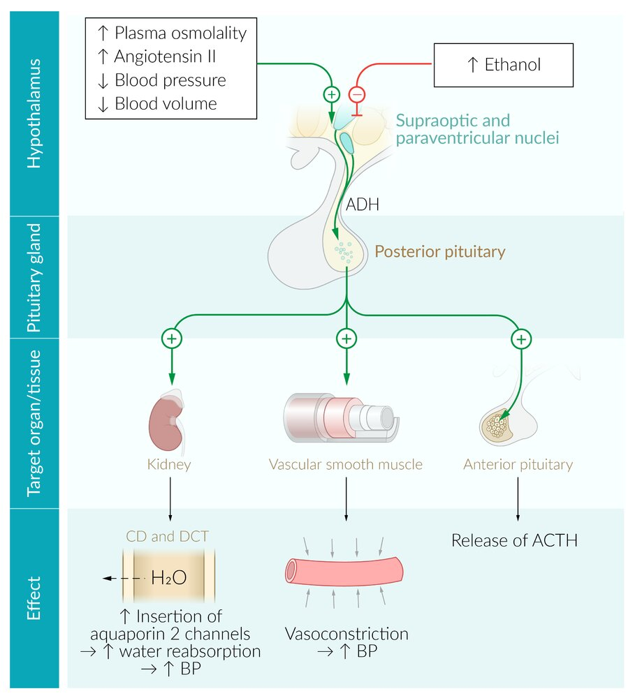

Hormonal feedback control of ADH secretion

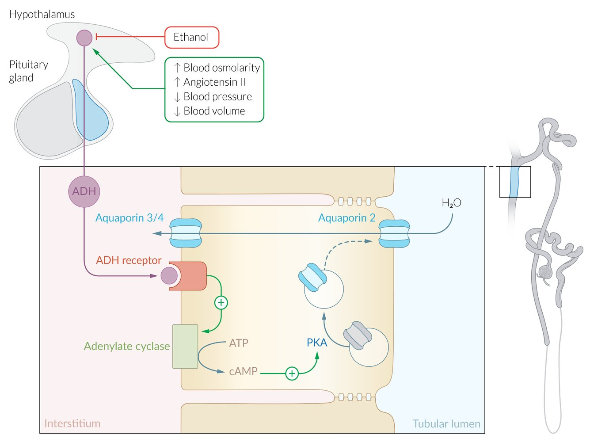

Effect of ADH on the kidney

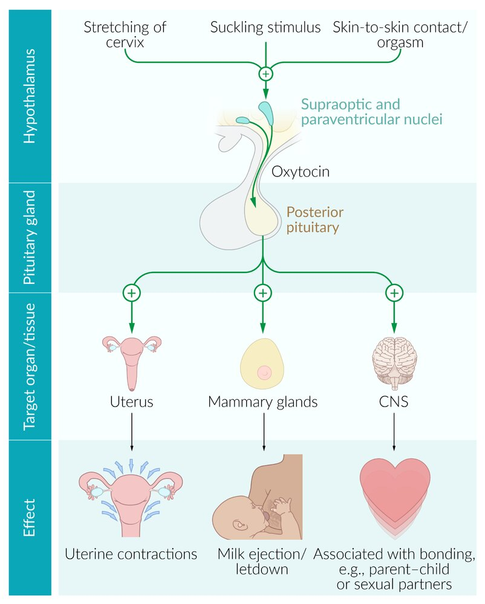

Hypothalamic-pituitary axis: oxytocin

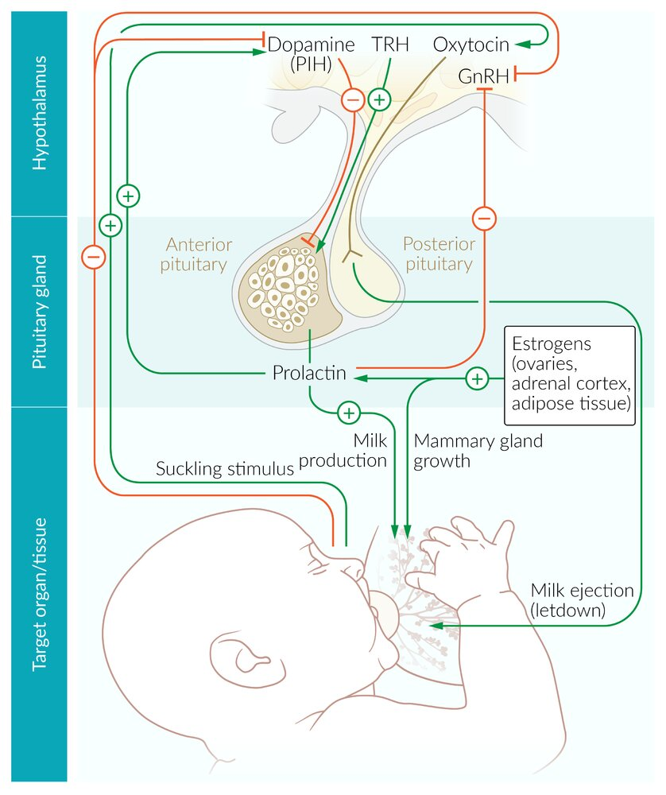

Stimulation of milk production and ejection

---

## Hypothalamic and pituitary drugs

| Overview of hypothalamic and pituitary drugs |  |  |  |  |
| --- | --- | --- | --- | --- |
| Drug class | Examples | Mechanism of action | Indications | Side effects |
| GnRH agonists |   * Goserelin  * Leuprolide  * Nafarelin  * <u>Histrelin</u>    |   * Excessive <u>pituitary</u> stimulation → ↓ <u>GnRH</u> <u>receptors</u> → ↓ <u>LH</u> and <u>FSH</u> secretion → ↓ <u>estradiol</u> production in <u>ovaries</u>, ↓ <u>testosterone</u> in male individuals [[13]](https://coursology-qbank.com/amboss/article/GrYBiq)  * Transient <u>agonist</u> effects are followed by the suppression of the <u>hypothalamic-pituitary-gonadal axis</u>.    |   * Cancer (continuous administration)  * <u>Breast cancer</u>  * <u>Prostate cancer</u>  * <u>Uterine leiomyoma</u>  * <u>Infertility</u> (pulsatile administration)  * <u>Endometriosis</u>  * <u>Precocious puberty</u>    |   * <u>Hypogonadism</u>  * Decreased libido  * Vaginal dryness  * <u>Hot flashes</u>  * <u>Nausea</u>, <u>vomiting</u>  * Decreased <u>bone mineral density</u>    |
| GnRH antagonists |  * Degarelix   |  * Block <u>GnRH</u> <u>receptors</u> on <u>pituitary</u> to decrease <u>FSH</u> and <u>LH</u> secretion   |   * <u>Prostate cancer</u>  * <u>In vitro fertilization</u>  [[14]](https://coursology-qbank.com/amboss/article/HgYK9o)    |   * <u>Hypogonadism</u>  * <u>Hot flashes</u>  * <u>Elevated liver enzymes</u>  * <u>Nausea</u>, <u>vomiting</u>    |
| Somatostatin analogues |   * <u>Octreotide</u>  * <u>Lanreotide</u>    |   * Inhibit <u>GH</u> secretion  * Inhibit the release of <u>splanchnic</u> <u>vasodilatory</u> <u>hormones</u> (e.g., <u>gastrin</u>, <u>glucagon</u>, <u>insulin</u>, <u>VIP</u>)    |   * <u>Acromegaly</u>  * <u>Carcinoid syndrome</u>  * <u>VIPoma</u>  * Acute <u>esophageal variceal bleeding</u>  * <u>Glucagonoma</u>  * <u>Gastrinoma</u>  * <u>Insulinoma</u>    |   * General  * Fatigue, <u>weakness</u>  * <u>Depressed mood</u>  * Gastrointestinal  * <u>Steatorrhea</u>  * <u>Nausea</u>, <u>vomiting</u>  * Abdominal <u>pain</u>, cramps  * <u>Cholelithiasis</u> (due to inhibition of <u>cholecystokinin</u>)    |
|  GHRH analogs [[15]](https://coursology-qbank.com/amboss/article/hqbcyu)  |  * Tesamorelin   |  * Stimulate <u>GH</u> <u>receptors</u>   |   * <u>Growth hormone deficiency</u>  * <u>Turner syndrome</u>  * <u>HIV-associated lipodystrophy</u>  * <u>Short stature</u> (e.g., in children with <u>CKD</u>) [[16]](https://coursology-qbank.com/amboss/article/BYazrQ)    |   * <u>Idiopathic intracranial hypertension</u>  * Increased <u>insulin resistance</u>  * Prepubertal <u>gynecomastia</u>  * <u>Slipped capital femoral epiphysis</u>  * Progression of <u>scoliosis</u>    |
| GH receptor antagonists |  * Pegvisomant   |  * Block <u>GH</u> <u>receptor</u>   |  * <u>Acromegaly</u>   |  * <u>Hepatotoxicity</u>   |
| <u>Dopamine agonists</u> |   * <u>Bromocriptine</u>  * <u>Cabergoline</u>    |  * Stimulate <u>dopamine</u> <u>receptors</u>   |   * <u>Prolactinoma</u>  * <u>Parkinson disease</u>  * <u>Neuroleptic malignant syndrome</u>  * <u>Malignant hyperthermia</u>    |   * <u>Nausea</u>, <u>vomiting</u>  * <u>Orthostatic hypotension</u>  * Confusion, <u>hallucination</u>  * <u>Dyskinesia</u>    |
|  ADH antagonists [[17]](https://coursology-qbank.com/amboss/article/MqbM_u)[[18]](https://coursology-qbank.com/amboss/article/nqb7_u)  |   * Conivaptan  * Tolvaptan  * Demeclocycline (a <u>tetracycline</u>)    |   * Block <u>V2 receptors</u> and decrease water reabsorption in the renal <u>collecting duct</u>  * <u>Tolvaptan</u>: selective <u>V2 receptor</u> <u>antagonism</u>  * <u>Conivaptan</u>: dual V1A and <u>V2 receptor</u> <u>antagonism</u>  * <u>Demeclocycline</u> seems to disrupt the intracellular <u>second messenger</u> cascade that follows after the binding of <u>vasopressin</u> to the <u>V2 receptor</u> in renal <u>collecting ducts</u> → ↓ <u>ADH</u> effect    |   * <u>Euvolemic hyponatremia</u> (e.g., <u>SIADH</u>)  * <u>Hypervolemic hyponatremia</u> (e.g., <u>congestive heart failure</u>, <u>liver cirrhosis</u>)  * <u>Demeclocycline</u>: bacterial infections    |   * <u>Hypernatremia</u>  * <u>Nephrogenic DI</u> (specific to <u>demeclocycline</u>)  * <u>Hypotension</u>  * Dry mouth  * <u>Liver</u> failure [[19]](https://coursology-qbank.com/amboss/article/jLc_x10)  * <u>Nausea</u>, <u>vomiting</u>, <u>stomach</u> <u>pain</u>  * Increased thirst, hunger, <u>urination</u>  * Weight loss  * CYP3A (including <u>CYP3A4</u>) inhibition and CYP3A induction  * <u>Demeclocycline</u>  * <u>Azotemia</u> and <u>nephrotoxicity</u>  * <u>Hepatotoxicity</u>  * <u>Skin</u> reactions    |
| ADH analogs |   * Desmopressin  * Terlipressin    |   * Act on the V1 and <u>V2 receptors</u>  * Release <u>vWF</u> stored in the <u>endothelium</u>    |   * <u>Central DI</u>  * <u>Von Willebrand disease</u>  * <u>Hemophilia A</u>  * <u>Nocturnal enuresis</u>    |  * <u>Hyponatremia</u>   |
| <u>Oxytocin</u> |  * <u>Oxytocin</u>   |  * Mediates <u>calcium</u> influx → uterine contraction   |   * <u>Induction of labor</u>  * <u>Augmentation of labor</u>  * <u>Postpartum hemorrhage</u>    |   * <u>Hyponatremia</u>  * <u>Tachysystole</u>  * <u>Hypotension</u>    |

---

## Adrenal cortex

* The <u>adrenal cortex</u> consists of three distinct layers:

* <u>Zona glomerulosa</u>: produces <u>mineralocorticoids</u> (i.e., <u>aldosterone</u>)

* <u>Zona fasciculata</u>: produces <u>glucocorticoids</u> (i.e., <u>cortisol</u>)

* <u>Zona reticularis</u>: produces <u>androgens</u> (i.e., <u>dehydroepiandrosterone</u>)

* Feedback control mechanism

* ↑ <u>Hypothalamic</u> secretion of <u>CRH</u> → ↑ <u>ACTH</u> secretion from the <u>pituitary</u> → ↑ synthesis of <u>glucocorticoids</u> and <u>androgens</u> from the <u>adrenal cortex</u>

* <u>Mineralocorticoids</u> are secreted as a result of <u>renin-angiotensin-aldosterone system</u> activation.

* See “<u>Hormones of the adrenal cortex</u>” in “<u>Adrenal gland</u>.”

Regulation of the hypothalamic-pituitary-adrenal axis

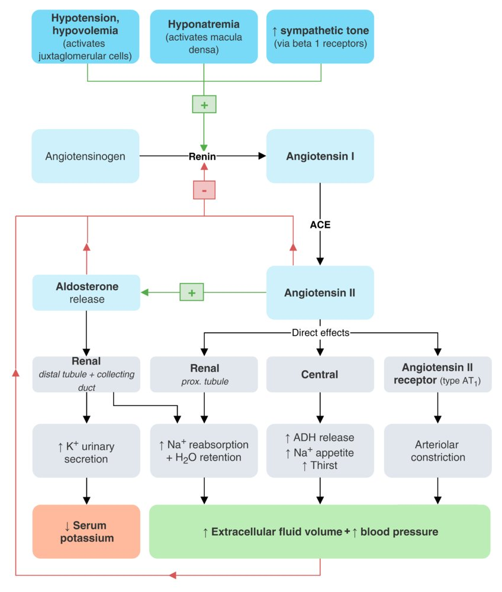

Renin-angiotensin-aldosterone system

---

## Thyroid gland

* The <u>thyroid gland</u> cells produce the following <u>hormones</u>: [[20]](https://coursology-qbank.com/amboss/article/Fp0grS)

* Follicular cells: the <u>thyroid hormones</u> T3 (<u>triiodothyronine</u>) and T4 (<u>tetraiodothyronine</u>)

* <u>Parafollicular cells</u>: <u>calcitonin</u>

* The main function of the <u>thyroid hormones</u> is the regulation of basal metabolism and growth, while <u>calcitonin</u> is involved in <u>calcium</u> and <u>phosphate</u> <u>homeostasis</u>.

* Feedback control mechanism

* ↑ <u>Hypothalamic</u> secretion of <u>TRH</u> → ↑ <u>TSH</u> secretion from the <u>pituitary</u> → ↑ <u>thyroid hormone</u> production

* <u>Calcitonin</u> is not controlled by the <u>hypothalamic-pituitary-thyroid axis</u>. It is released in response to increased serum <u>Ca2+</u> levels.

* See “<u>Thyroid gland and parathyroid glands</u>.”

Regulation of thyroid hormone synthesis

---

## Gonads

### Overview

* Definition

* <u>Gonads</u> are reproductive organs that produce <u>gametes</u> and sex <u>hormones</u>.

* The male <u>gonad</u> is the <u>testicle</u> and the female <u>gonad</u> is the <u>ovary</u>.

* Sex <u>hormones</u>

* Male individuals: <u>testosterone</u>, <u>dihydrotestosterone</u>

* Female individuals: <u>estrogen</u>, <u>progesterone</u>

* Regulation: The secretion of sex <u>hormones</u> is controlled by the <u>pituitary</u> and <u>hypothalamic</u> <u>hormones</u>.

* <u>LH</u>

* <u>FSH</u>

* <u>GnRH</u>

### Physiological effects of <u>LH</u> and <u>FSH</u>

| <u>Hormone</u> | Target <u>gonad</u> |  |
| --- | --- | --- |
| <u>Ovary</u> | <u>Testicle</u> |  |
| <u>FSH</u> |   * Maturation of follicles  * <u>Estrogen</u> production  * Inhibin B secretion by <u>granulosa cells</u>  * <u>Inhibin B</u> suppresses the release of <u>FSH</u> (in both male and female individuals).  * Involved in the regulation of <u>ovarian follicles</u>  * Can be used to measure <u>ovarian reserve</u>  * A marker of <u>granulosa cell tumors</u>    |   * <u>Spermatogenesis</u>  * <u>Inhibin B</u> secretion by <u>sertoli cells</u>: can be used as a marker of <u>sertoli cell</u> function and <u>spermatogenesis</u> [[21]](https://coursology-qbank.com/amboss/article/Lqbw_u)    |
| <u>LH</u> |   * <u>Ovulation</u>  * <u>Estrogen</u> production  * <u>Progesterone</u> production    |  * <u>Testosterone</u> production by <u>Leydig cells</u>   |

### Physiological effects of sex <u>hormones</u>

* See “<u>Female sex hormones</u>” and “<u>Male sex hormones</u>.”

#### Feedback control mechanisms

* <u>Hypothalamus</u>

* Central regulation

* Pulsatile release of <u>GnRH</u> during <u>puberty</u> stimulates secretion of <u>FSH</u>, <u>LH</u>, and sex <u>hormones</u>.

* <u>GnRH</u> secretion may be influenced by competitive sports, <u>malnutrition</u>, or <u>stress</u>, any of which can lead to <u>amenorrhea</u> in women.

* Peripheral regulation via feedback inhibition of <u>GnRH</u>, <u>FSH</u>, and <u>LH</u> secretion by the following <u>hormones</u>:

* <u>Androgen</u>

* <u>Estrogen</u>

* <u>Progesterone</u>

* <u>Inhibin</u>

* Sex hormone-binding globulins (SHBGs): a group of transporter <u>proteins</u> required for the transport of <u>lipophilic</u> sex <u>hormones</u>

* <u>Hyperestrogenism</u> (e.g., <u>pregnancy</u>, <u>OCP</u> use) causes increased <u>SHBG</u> levels.

* Female individuals with low levels of <u>SHBG</u> (e.g., <u>PCOS</u>) have higher levels of free <u>testosterone</u>, which is responsible for the development of <u>hirsutism</u> in these patients.

* Male individuals with high <u>estrogen</u> levels (e.g., in <u>liver cirrhosis</u>) are at risk of developing <u>gynecomastia</u> because of increased <u>SHBG</u> levels and decreased free <u>testosterone</u> levels.

* In addition to <u>SHBG</u> <u>gene</u> <u>polymorphisms</u> there are many factors that affect SHBG levels. [[22]](https://coursology-qbank.com/amboss/article/PodWXI0)[[23]](https://coursology-qbank.com/amboss/article/l0WvTP0)

* ↓ levels: <u>obesity</u>, uncontrolled <u>type 2 DM</u>, <u>nephrotic syndrome</u>, <u>decompensated cirrhosis</u>, untreated <u>hypothyroidism</u>, untreated <u>acromegaly</u>, use of <u>glucocorticoids</u>, use of <u>exogenous</u> <u>androgens</u>

* ↑ levels: advanced age, <u>HIV infection</u>, <u>compensated cirrhosis</u>, <u>hepatitis</u>, untreated <u>hyperthyroidism</u>, use of some <u>anticonvulsants</u> (e.g., <u>carbamazepine</u>, <u>phenytoin</u>, <u>phenobarbital</u>), use of <u>exogenous</u> <u>estrogens</u>

---

## Regulation of appetite and satiety

### Overview [[24]](https://coursology-qbank.com/amboss/article/qqbCzu)[[25]](https://coursology-qbank.com/amboss/article/IqbY-u)[[26]](https://coursology-qbank.com/amboss/article/rqbf-u)

* Input

* Gastrointestinal system

* <u>Endocrine hormones</u>: released into the circulation in response to feeding/<u>fasting state</u>

* <u>Vagal</u> afferents: relay signals from intestinal <u>mechanoreceptors</u> to the <u>nucleus tractus solitarius</u>

* <u>Fat tissue</u>: <u>leptin</u> <u>hormone</u> released into the circulation

* Integrating center: <u>arcuate nucleus (hypothalamus)</u>

* Projection: The arcuate <u>nucleus</u> relays signals to other <u>hypothalamic nuclei</u> via orexigenic and anorexigenic <u>neurons</u>.

* Orexigenic <u>neurons</u>

* Stimulate appetite

* Release <u>neuropeptide Y</u> and <u>agouti-related peptide</u>

* Anorexigenic <u>neurons</u>

* Suppress appetite

* Release <u>POMC</u>

* Output

* <u>Lateral nucleus</u> of the <u>hypothalamus</u> (hunger center): appetite stimulation

* <u>Ventromedial nucleus</u> of the <u>hypothalamus</u> (satiety center): appetite suppression

* Clinical relevance

* Polyphagia: excessive hunger (e.g., in <u>hyperthyroidism</u>, <u>Prader-Willi syndrome</u>)

* <u>Anorexia</u>: a loss of appetite (e.g., in cancer, <u>HIV</u>)

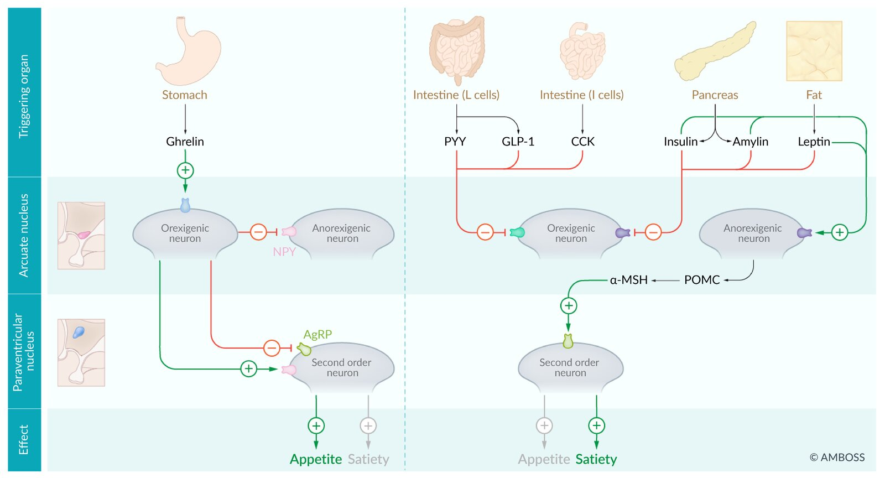

Regulation of appetite and satiety

### <u>Regulation of appetite</u>

| Neuroendocrine <u>regulation of appetite</u> |  |  |  |
| --- | --- | --- | --- |
| <u>Neurotransmitter</u>/<u>hormone</u> | Regulation | Site of production | Effects |
|  Ghrelin [[24]](https://coursology-qbank.com/amboss/article/qqbCzu)[[26]](https://coursology-qbank.com/amboss/article/rqbf-u)  |   * ↑ Levels during:  * <u>Fasting states</u>  * <u>Sleep deprivation</u>  * <u>Prader-Willi syndrome</u>  * ↓ Levels after:  * Food intake  * <u>Gastric bypass surgery</u>    |  * <u>Stomach</u>   |   * ↑ Appetite  * <u>GH</u> release (via <u>GH</u> secretagogue <u>receptor</u>)    |
| Endocannabinoid |   * Hunger [[27]](https://coursology-qbank.com/amboss/article/Bqbz0E)  * Intake of fatty and sweet food    |  * Unclear  [[28]](https://coursology-qbank.com/amboss/article/yqbdaE)   |   * ↑ Appetite  * ↑ <u>Dopamine</u> release from <u>nucleus accumbens</u> (reward pathway) [[29]](https://coursology-qbank.com/amboss/article/AqbRaE)  * <u>Exogenous</u> <u>cannabinoids</u> are responsible for “the <u>munchies</u>” effect.    |
| Neuropeptide Y |  * Hunger   |  * <u>Hypothalamus</u>   |   * ↑ Appetite  * Regulation of <u>anxiety</u>-related behavior  * Increased neuronal excitability    |

### Regulation of satiety [[24]](https://coursology-qbank.com/amboss/article/qqbCzu)[[26]](https://coursology-qbank.com/amboss/article/rqbf-u)

| Neuroendocrine regulation of satiety |  |  |  |
| --- | --- | --- | --- |
| <u>Hormone</u> | Regulation | Source | Effects |
| Leptin |   * ↓ Levels during:  * <u>Starvation</u>  * <u>Sleep deprivation</u>  * ↑ Levels in:  * <u>Obesity</u> (due to <u>leptin</u> resistance)  * Fed state    |  * <u>Adipose tissue</u>   |   * ↓ Appetite (long term)  * ↓ <u>Neuropeptide Y</u> release  * <u>Leptin</u> <u>gene</u> mutation causes <u>obesity</u>.    |
| <u>Cholecystokinin</u> |   * Lipid-rich <u>chyme</u>  * Protein-rich <u>chyme</u>    |  * <u>I cells</u> of the <u>small intestine</u>   |   * ↓ Appetite (short term)  * ↓ Gastric emptying    |
| <u>GLP-1</u> |   * <u>Carbohydrate</u>-rich <u>chyme</u>  * Lipid-rich <u>chyme</u>    |  * <u>L cells</u> of the small and <u>large intestine</u>   |   * ↓ Appetite (short term)  * ↓ Gastric emptying  * ↑ <u>Insulin</u>  * ↓ <u>Glucagon</u>    |
| <u>Peptide YY</u> |  * Protein-rich <u>chyme</u>   |  * <u>L cells</u> of the small and <u>large intestine</u>   |   * ↓ Appetite (short term)  * ↓ Gastric emptying    |
|  Amylin [[30]](https://coursology-qbank.com/amboss/article/bIbHYE)  |  * <u>Glucose</u> (cosecreted with <u>insulin</u>)   |  * <u>β cells</u> of the <u>pancreas</u>   |   * ↓ Appetite (short term)  * ↓ Gastric emptying  * ↓ <u>Glucagon</u> release    |

> [!NOTE]
> <u>Ghrelin</u> makes you Gain weight. <u>Leptin</u> makes you Lose weight.

### Appetite regulators

| Appetite-regulating drugs |  |  |  |  |
| --- | --- | --- | --- | --- |
| Drug class | Example | Mechanism of action | Indication | Side effects |
|  <u>Cannabinoid receptor agonist</u> [[31]](https://coursology-qbank.com/amboss/article/YLbnw8)[[32]](https://coursology-qbank.com/amboss/article/1Ib2bE)  |  * <u>Dronabinol</u>   |  * Activation of <u>CB1</u> and <u>CB2</u> <u>receptors</u>   |   * Appetite stimulation (e.g., in <u>HIV</u> patients)  * <u>Chemotherapy</u>-induced emesis    |   * Sedation  * Euphoria/<u>dysphoria</u>  * <u>Hallucinations</u>  * Dry mouth  * Autonomic effects  * <u>Tachycardia</u>  * <u>Orthostatic hypotension</u>    |
| Synthetic <u>progestin</u> |  * <u>Megestrol acetate</u>   |  * Unclear  [[33]](https://coursology-qbank.com/amboss/article/WIbPbE)   |  * Appetite stimulation [[34]](https://coursology-qbank.com/amboss/article/dIbobE)  * <u>Cancer cachexia</u>  * <u>AIDS</u>   |   * <u>Thromboembolism</u> risk  * <u>Edema</u>  * <u>Adrenal suppression</u> and <u>Cushing syndrome</u>  [[35]](https://coursology-qbank.com/amboss/article/eIbxbE)    |
|  <u>GLP-1 agonist</u> [[36]](https://coursology-qbank.com/amboss/article/UIbbXE)  |  * <u>Liraglutide</u>   |  * Activation of <u>GLP-1</u> <u>receptor</u>   |   * Weight loss (↑ satiety)  * <u>Diabetes</u>    |   * <u>Nausea and vomiting</u>  * <u>Pancreatitis</u>    |

---