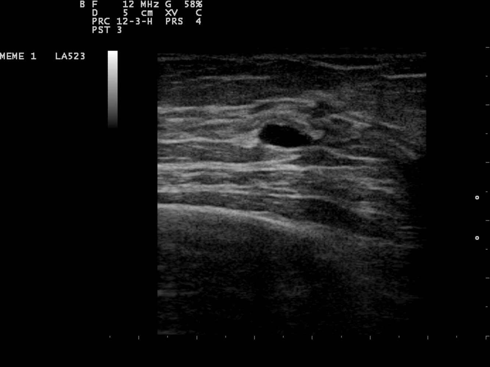

# Breast cysts

*Categories: Clinical knowledge > Obstetrics/gynecology > Breast disorders > Breast cysts*

[Original Article Link](https://coursology-qbank.com/amboss/article/JG0sZ3)

---

## Summary

<u>Breast</u> cysts are circumscribed fluid collections that most commonly occur in <u>premenopausal</u> women. The typical presentation includes single or multiple <u>breast</u> masses of variable size that may be tender. Because cysts cannot be reliably distinguished from a solid mass on palpation or <u>mammography</u>, the diagnostic evaluation requires a <u>breast ultrasound</u>. Based on <u>ultrasound</u> findings, <u>breast</u> cysts are characterized as simple, complicated, or complex. <u>Complex breast cysts</u> are associated with an increased risk of <u>malignancy</u> and should be biopsied. <u>Complicated breast cysts</u> are typically benign; a <u>biopsy</u> should be considered if there is clinical suspicion of <u>malignancy</u>. <u>Simple breast cysts</u> are benign and seldom require any further diagnostics. Management depends on the type of cyst and risk of <u>malignancy</u> and includes surveillance, therapeutic <u>aspiration</u>, and surgical excision.

---

## Epidemiology

* <u>Simple breast cysts</u> are a common cause of <u>breast</u> lesions identified on examination or imaging.  [[2]](https://coursology-qbank.com/amboss/article/Qe1uAf0)[[3]](https://coursology-qbank.com/amboss/article/Ru1lIi0)

* Peak <u>incidence</u> (of simple cysts): 35–50 years of age; most common in <u>premenopausal</u> women [[2]](https://coursology-qbank.com/amboss/article/Qe1uAf0)[[4]](https://coursology-qbank.com/amboss/article/Gh1B2g0)

Epidemiological data refers to the US, unless otherwise specified.

---

## Clinical features

* Maybe asymptomatic (detected incidentally) [[3]](https://coursology-qbank.com/amboss/article/Ru1lIi0)

* Single or multiple <u>breast</u> masses

* May be tender

* Variable size (microcysts, gross cysts, <u>clusters</u>) and texture (smooth, soft, firm)

* Usually mobile

> [!TIP]
> Cystic and solid <u>breast</u> masses cannot reliably be distinguished on <u>physical examination</u> alone. [[2]](https://coursology-qbank.com/amboss/article/Qe1uAf0)[[4]](https://coursology-qbank.com/amboss/article/Gh1B2g0)[[5]](https://coursology-qbank.com/amboss/article/DQc1yX0)

---

## Management

### Approach [[2]](https://coursology-qbank.com/amboss/article/Qe1uAf0)[[5]](https://coursology-qbank.com/amboss/article/DQc1yX0)

* Follow <u>age-appropriate breast imaging for a palpable breast mass</u>.

* Use targeted <u>ultrasound</u> to evaluate any masses identified on <u>mammography</u>.  [[2]](https://coursology-qbank.com/amboss/article/Qe1uAf0)[[6]](https://coursology-qbank.com/amboss/article/sU1teT0)[[7]](https://coursology-qbank.com/amboss/article/_5155h0)

* Tailor further management based on imaging findings.

* <u>Simple breast cyst</u>: no further diagnostic evaluation [[2]](https://coursology-qbank.com/amboss/article/Qe1uAf0)[[5]](https://coursology-qbank.com/amboss/article/DQc1yX0)

* <u>Complicated breast cyst</u>: surveillance, therapeutic <u>aspiration</u>, or <u>biopsy</u> depending on clinical concern for <u>malignancy</u>

* <u>Complex breast cyst</u>: <u>ultrasound</u>-guided <u>core needle biopsy</u> or <u>excisional biopsy</u> to rule out concomitant <u>malignancy</u>

> [!TIP]
> <u>Ultrasound</u> is the preferred modality for differentiating between cystic and solid <u>breast</u> masses. [[2]](https://coursology-qbank.com/amboss/article/Qe1uAf0)[[6]](https://coursology-qbank.com/amboss/article/sU1teT0)[[7]](https://coursology-qbank.com/amboss/article/_5155h0)

> [!TIP]
> <u>Biopsy</u> is recommended for all <u>breast</u> cysts with suspicious features (e.g., Doppler flow, thick septations or walls, solid components). [[6]](https://coursology-qbank.com/amboss/article/sU1teT0)

> [!TIP]
> Cytological evaluation is recommended if bloody fluid is obtained on therapeutic or diagnostic <u>aspiration</u>. [[2]](https://coursology-qbank.com/amboss/article/Qe1uAf0)[[3]](https://coursology-qbank.com/amboss/article/Ru1lIi0)

### Characterization of <u>breast</u> cysts [[2]](https://coursology-qbank.com/amboss/article/Qe1uAf0)[[5]](https://coursology-qbank.com/amboss/article/DQc1yX0)[[8]](https://coursology-qbank.com/amboss/article/Pu1Wri0)

<u>Breast</u> cysts are best characterized on <u>ultrasound</u>. On <u>mammography</u>, a <u>breast</u> cyst appears as a round, circumscribed mass (i.e., indistinguishable from a solid <u>breast mass</u>). [[2]](https://coursology-qbank.com/amboss/article/Qe1uAf0)[[5]](https://coursology-qbank.com/amboss/article/DQc1yX0)

|  |  Types of breast cysts [[2]](https://coursology-qbank.com/amboss/article/Qe1uAf0)[[3]](https://coursology-qbank.com/amboss/article/Ru1lIi0)[[8]](https://coursology-qbank.com/amboss/article/Pu1Wri0)  |  |  |
| --- | --- | --- | --- |
|  |  Simple breast cyst  | Complicated breast cyst | Complex breast cyst |
| Characteristic features on <u>ultrasound</u> |   * Round or oval well-defined, <u>anechoic</u>  * <u>Posterior acoustic enhancement</u>  * Thin walls  * No mural thickening  * No solid components  * No internal septations    |   * Round <u>hypoechoic</u> well-defined mass with internal echoes  * May or may not have <u>posterior acoustic enhancement</u>  * No solid components or intracystic mass  * No internal septations  * Avascular on <u>Doppler ultrasound</u>    |  * Round well-defined mass with any of the following:  * Internal septations  * Mural thickening  * Thick walls  * Solid and cystic components   |
| Risk of <u>malignancy</u> |  * None   |  * Low (< 2%) [[2]](https://coursology-qbank.com/amboss/article/Qe1uAf0)[[8]](https://coursology-qbank.com/amboss/article/Pu1Wri0)   |  * High (up to 23%) [[8]](https://coursology-qbank.com/amboss/article/Pu1Wri0)   |

Breast cyst

> [!TIP]
> <u>Mammography</u> cannot reliably distinguish between a solid and cystic <u>breast mass</u>. A <u>breast mass</u> detected on <u>mammography</u> should be additionally evaluated on <u>ultrasound</u>. [[2]](https://coursology-qbank.com/amboss/article/Qe1uAf0)[[5]](https://coursology-qbank.com/amboss/article/DQc1yX0)[[6]](https://coursology-qbank.com/amboss/article/sU1teT0)

### Management of <u>simple breast cysts</u> [[2]](https://coursology-qbank.com/amboss/article/Qe1uAf0)[[3]](https://coursology-qbank.com/amboss/article/Ru1lIi0)

* Asymptomatic cysts: : no intervention required; most resolve spontaneously [[9]](https://coursology-qbank.com/amboss/article/iR1J5g0)

* Symptomatic cysts : Consider <u>ultrasound</u>-guided <u>fine needle aspiration</u>. [[2]](https://coursology-qbank.com/amboss/article/Qe1uAf0)[[6]](https://coursology-qbank.com/amboss/article/sU1teT0)

* Simple cysts generally collapse on <u>aspiration</u>.

* <u>Aspirate</u> is typically serous and can be discarded.

> [!TIP]
> <u>Simple breast cysts</u> are not associated with an increased risk of <u>breast cancer</u>. Routine <u>breast cancer screening</u> is appropriate. [[2]](https://coursology-qbank.com/amboss/article/Qe1uAf0)[[3]](https://coursology-qbank.com/amboss/article/Ru1lIi0)[[8]](https://coursology-qbank.com/amboss/article/Pu1Wri0)

### Management of <u>complicated breast cysts</u> [[2]](https://coursology-qbank.com/amboss/article/Qe1uAf0)[[3]](https://coursology-qbank.com/amboss/article/Ru1lIi0)[[6]](https://coursology-qbank.com/amboss/article/sU1teT0)[[8]](https://coursology-qbank.com/amboss/article/Pu1Wri0)

Management depends on patient preferences and clinical concern for <u>malignancy</u> and includes the following.

* Surveillance: close clinical and imaging follow-up over 1–2 years  [[2]](https://coursology-qbank.com/amboss/article/Qe1uAf0)[[8]](https://coursology-qbank.com/amboss/article/Pu1Wri0)

* Therapeutic <u>fine needle aspiration</u>: Any bloody <u>aspirate</u> should be sent for <u>cytology</u>.

* <u>Core needle biopsy</u> is indicated if there is clinical suspicion for <u>malignancy</u>, such as:

* Lesion persists after <u>aspiration</u>

* Bloody <u>aspirate</u> obtained

* Increasing cyst size (on surveillance) [[8]](https://coursology-qbank.com/amboss/article/Pu1Wri0)

> [!TIP]
> Routine <u>breast cancer screening</u> is appropriate for patients with <u>complicated breast cysts</u> that have been proven benign on <u>biopsy</u> or have not increased in size over a period of surveillance. [[8]](https://coursology-qbank.com/amboss/article/Pu1Wri0)

### Management of <u>complex breast cysts</u> [[2]](https://coursology-qbank.com/amboss/article/Qe1uAf0)[[3]](https://coursology-qbank.com/amboss/article/Ru1lIi0)[[8]](https://coursology-qbank.com/amboss/article/Pu1Wri0)

Perform an <u>ultrasound</u>-guided <u>core needle biopsy</u> or <u>excisional biopsy</u> in all patients. [[2]](https://coursology-qbank.com/amboss/article/Qe1uAf0)[[6]](https://coursology-qbank.com/amboss/article/sU1teT0)

* Benign lesion on <u>biopsy</u> [[8]](https://coursology-qbank.com/amboss/article/Pu1Wri0)

* Follow-up at 6 and/or 12 months for 1 year.

* No growth on surveillance: Routine <u>breast cancer screening</u> is appropriate.

* <u>Indeterminate lesion</u> or <u>radio</u>-pathological discordance: surgical excision [[8]](https://coursology-qbank.com/amboss/article/Pu1Wri0)

---