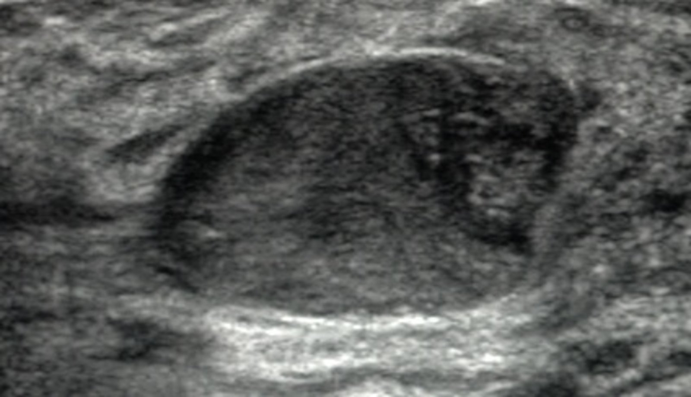
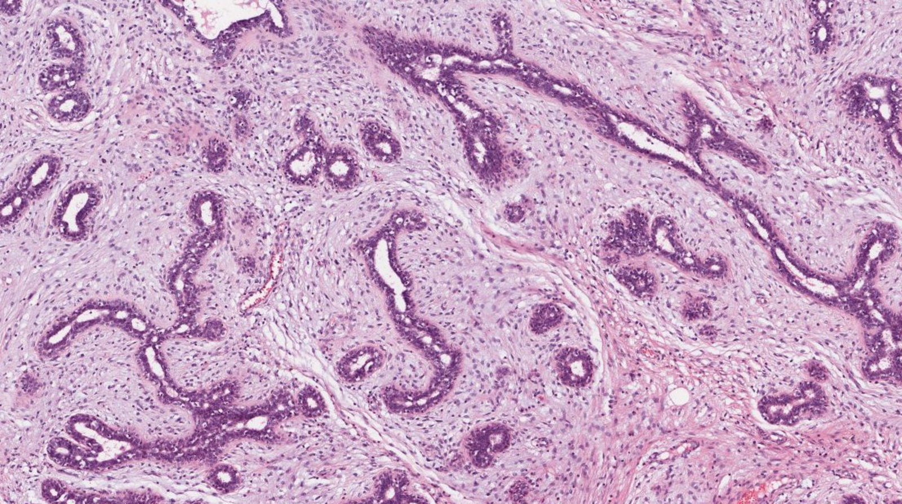

# Fibroadenoma

*Categories: Clinical knowledge > Obstetrics/gynecology > Breast disorders > Fibroadenoma*

[Original Article Link](https://coursology-qbank.com/amboss/article/ht0cW3)

---

## Summary

Fibroadenomas are the most common benign <u>breast</u> <u>tumor</u> in women under 35 years of age. Hormonal factors are thought to contribute to fibroadenoma growth, but the exact etiology is poorly understood. On examination, fibroadenomas are well-defined, mobile, typically solitary <u>breast</u> masses that are 1–2 cm in diameter on average. <u>Giant fibroadenomas</u> are much larger in size and can distort the shape of the <u>breast</u>. <u>Patient history</u>, <u>physical examination</u>, and <u>age-appropriate imaging for a palpable breast mass</u> are used to establish the diagnosis. <u>Biopsy</u> is not routinely required for diagnostic confirmation but may be indicated to rule out differential diagnoses (e.g., <u>phyllodes tumor</u>, <u>breast cancer</u>). Although most fibroadenomas are benign and have an excellent prognosis, complex <u>adenomas</u> are associated with an increased risk of <u>breast cancer</u>.

---

## Epidemiology

* The most common <u>breast</u> <u>tumor</u> in women < 35 years of age

* Peak <u>incidence</u>: 20–30 years

Epidemiological data refers to the US, unless otherwise specified.

---

## Etiology

* <u>Idiopathic</u>

* Possible hormonal etiology;  (increased <u>estrogen</u>, e.g., during <u>pregnancy</u> may stimulate growth )

---

## Clinical features

* Usually a well-defined, mobile mass

* Most commonly solitary

* Nontender

* Rubbery consistency

* Typically 1–2 cm in diameter

* Giant fibroadenomas are > 5 cm in size and may distort the shape of the <u>breast</u>. [[3]](https://coursology-qbank.com/amboss/article/0R1elg0)

---

## Diagnosis

Follow age-appropriate diagnostic workup for a <u>palpable breast mass</u>. The findings specific to fibroadenoma are described here.

### Imaging [[3]](https://coursology-qbank.com/amboss/article/0R1elg0)[[4]](https://coursology-qbank.com/amboss/article/DQc1yX0)

* <u>Breast ultrasound</u>: well-circumscribed oval or round <u>hypoechoic</u> solid mass with no <u>posterior acoustic shadowing</u> [[2]](https://coursology-qbank.com/amboss/article/Qe1uAf0)[[4]](https://coursology-qbank.com/amboss/article/DQc1yX0)

* <u>Mammography</u> [[3]](https://coursology-qbank.com/amboss/article/0R1elg0)

* Round mass with a well-defined border

* May have popcorn-like calcifications

* <u>Breast</u> <u>MRI</u> : The appearance varies depending on whether <u>hyalinization</u> is present.

Breast mass

### <u>Biopsy</u>

* Indications (not routinely indicated): imaging or clinical findings suspicious for <u>malignancy</u> or <u>phyllodes tumor</u>  [[2]](https://coursology-qbank.com/amboss/article/Qe1uAf0)[[3]](https://coursology-qbank.com/amboss/article/0R1elg0)[[5]](https://coursology-qbank.com/amboss/article/iR1J5g0)

* Modalities: <u>core needle biopsy</u>, <u>fine needle aspiration</u>, or <u>excisional biopsy</u>  [[2]](https://coursology-qbank.com/amboss/article/Qe1uAf0)[[3]](https://coursology-qbank.com/amboss/article/0R1elg0)[[5]](https://coursology-qbank.com/amboss/article/iR1J5g0)

* Findings: fibrous and <u>glandular tissue</u> [[3]](https://coursology-qbank.com/amboss/article/0R1elg0)

Fibroadenoma of the breast

> [!TIP]
> <u>Biopsy</u> is not routinely required in patients with imaging findings consistent with a fibroadenoma and no clinical suspicion of <u>malignancy</u> or <u>phyllodes tumor</u>. [[2]](https://coursology-qbank.com/amboss/article/Qe1uAf0)[[3]](https://coursology-qbank.com/amboss/article/0R1elg0)[[4]](https://coursology-qbank.com/amboss/article/DQc1yX0)

> [!TIP]
> <u>Core needle biopsy</u> or <u>excisional biopsy</u> is preferred if <u>phyllodes tumor</u> is suspected as <u>FNAC</u> cannot reliably distinguish between fibroadenomas and <u>phyllodes tumors</u>. [[2]](https://coursology-qbank.com/amboss/article/Qe1uAf0)[[6]](https://coursology-qbank.com/amboss/article/TQ16vg0)

---

## Differential diagnoses

* <u>Phyllodes tumor</u>

* Tend to be larger in size

* Often grow more rapidly than fibroadenomas

* Usually occur in women ∼ 40 years of age

* Other benign <u>breast</u> lesions (e.g., <u>breast cysts</u>)

* <u>Breast cancer</u>

> [!TIP]
> The clinical and imaging features of <u>phyllodes tumors</u> may closely resemble those of fibroadenomas, but the biological behaviors of these tumors are different. Borderline and malignant <u>phyllodes tumors</u> can <u>metastasize</u> hematogenously, and benign <u>phyllodes tumors</u> have a high risk of recurrence postexcision.

The differential diagnoses listed here are not exhaustive.

---

## Treatment

Management decisions should be made using <u>shared decision-making</u>.

### <u>Expectant management</u>

* Indications [[3]](https://coursology-qbank.com/amboss/article/0R1elg0)[[7]](https://coursology-qbank.com/amboss/article/jR1_5g0)

* Fibroadenomas < 2 cm in size [[5]](https://coursology-qbank.com/amboss/article/iR1J5g0)

* Asymptomatic <u>adolescent</u> patients  [[7]](https://coursology-qbank.com/amboss/article/jR1_5g0)

* Measures: routine <u>clinical breast exams</u> (<u>CBE</u>) and <u>age-appropriate imaging for a palpable breast mass</u>

* Lesions diagnosed as fibroadenoma on imaging alone: Short-term (every 6 months for 2 years) follow-up with imaging is recommended. [[2]](https://coursology-qbank.com/amboss/article/Qe1uAf0)[[3]](https://coursology-qbank.com/amboss/article/0R1elg0)

* <u>Biopsy</u>-proven fibroadenomas: Longer surveillance intervals may be considered. [[8]](https://coursology-qbank.com/amboss/article/IF1Yji0)

### Surgical excision

* Indications [[3]](https://coursology-qbank.com/amboss/article/0R1elg0)[[5]](https://coursology-qbank.com/amboss/article/iR1J5g0)

* Large size (e.g., > 2 cm) or rapid growth

* Suspected <u>malignancy</u>

* Bothersome symptoms  or cosmetic concerns

### Minimally invasive procedures [[3]](https://coursology-qbank.com/amboss/article/0R1elg0)

* Indications: an alternative to surgical excision for patients with <u>biopsy</u>-proven fibroadenomas

* Modalities

* <u>Thermal ablation</u> : targeted cell destruction of the fibroadenoma

* Vacuum-assisted percutaneous excision: removal of the fibroadenoma using a hollow bore needle under image guidance

---

## Prognosis

* Generally good

* Most fibroadenomas are not associated with an increased risk of <u>breast cancer</u>.

* Complex fibroadenomas  may be associated with an increased risk of <u>breast cancer</u>.

---