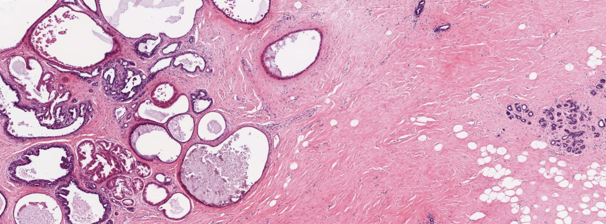
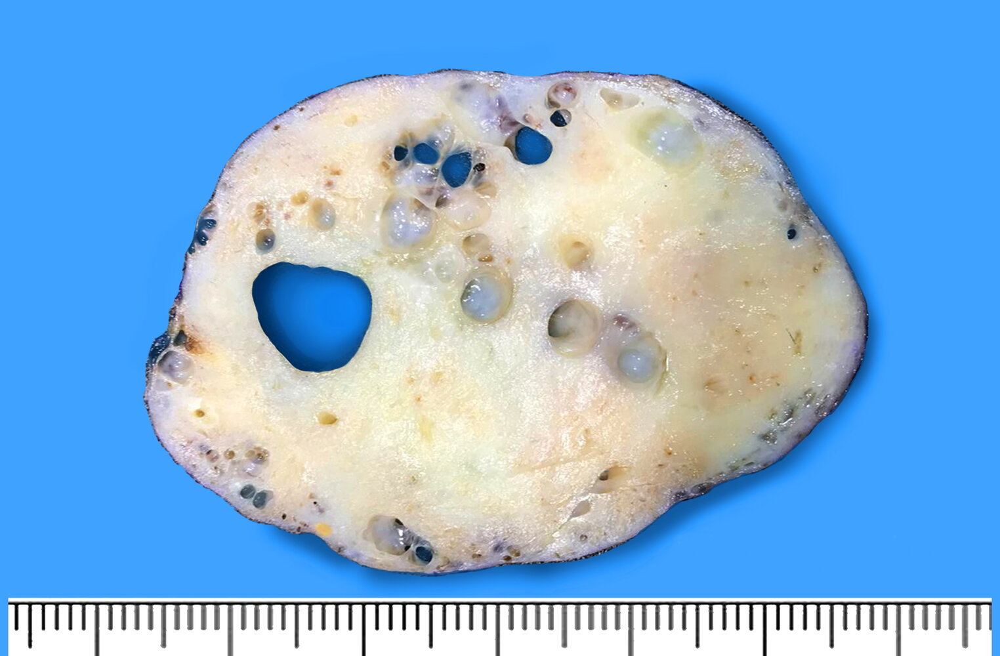

# Fibrocystic breast changes

*Categories: Clinical knowledge > Obstetrics/gynecology > Breast disorders > Fibrocystic breast changes*

[Original Article Link](https://coursology-qbank.com/amboss/article/7G0403)

---

## Summary

Fibrocystic <u>breast</u> changes is a nonspecific term that includes a heterogeneous spectrum of <u>breast</u> conditions. Women between 20 and 50 years of age are most commonly affected. Histologically, fibrocystic changes are divided into <u>nonproliferative breast lesions</u> (e.g., <u>simple breast cysts</u>, apocrine <u>metaplasia</u>) and <u>proliferative breast lesions</u> (e.g., ductal <u>epithelial</u> <u>hyperplasia</u>, <u>sclerosing adenosis</u>). Patients typically present with premenstrual bilateral multifocal <u>breast</u> <u>pain</u> with or without palpable <u>nodules</u>, which may be tender. The diagnosis is made during the workup of symptoms (e.g., <u>mastalgia</u>, <u>palpable breast mass</u>, <u>nipple discharge</u>) or incidentally on <u>clinical breast examination</u> and/or imaging. Tissue <u>biopsy</u>, usually a <u>core-needle biopsy</u>, is indicated if there is a clinical suspicion of <u>malignancy</u>. Management of <u>breast</u> lesions without <u>cellular atypia</u> is primarily symptomatic. <u>Proliferative breast lesions</u> with <u>cellular atypia</u> require surgical excision as they are associated with an increased risk of <u>breast cancer</u>.

---

## Epidemiology

* Most common benign lesion of the <u>breast</u>

* Peak age: 20–50 years

* Up to 50% of women are affected during their lifetime.

Epidemiological data refers to the US, unless otherwise specified.

---

## Clinical features

* Premenstrual bilateral multifocal <u>breast</u> <u>pain</u> (<u>cyclic mastalgia</u>)

* Tender or nontender <u>breast</u> <u>nodules</u>

* Clear, greenish, or slightly milky <u>nipple discharge</u>; often multiductal [[2]](https://coursology-qbank.com/amboss/article/MMdM6q0)

---

## Subtypes and variants

### Nonproliferative breast lesions [[3]](https://coursology-qbank.com/amboss/article/Qe1uAf0)[[4]](https://coursology-qbank.com/amboss/article/MibMHt)[[5]](https://coursology-qbank.com/amboss/article/hU1c1T0)

* <u>Simple breast cysts</u>: circumscribed fluid-filled lesions (blue dome cysts)

* Stromal <u>fibrosis</u> (no malignant potential)

* Apocrine <u>metaplasia</u>

### Proliferative breast lesions (with or without <u>cellular atypia</u>) [[3]](https://coursology-qbank.com/amboss/article/Qe1uAf0)[[5]](https://coursology-qbank.com/amboss/article/hU1c1T0)

* Sclerosing adenosis

* <u>Proliferation</u> of small ductules and acini in the lobules

* Stromal <u>fibrosis</u> [[6]](https://coursology-qbank.com/amboss/article/xjXEcy)

* Calcifications (slightly increased risk of <u>breast cancer</u>)

* Ductal <u>epithelial</u> <u>hyperplasia</u> (ductal <u>hyperplasia</u>)

* <u>Epithelial</u> <u>hyperplasia</u> of <u>terminal duct</u> cells and lobular <u>epithelium</u>

* The presence of <u>atypical cells</u> is associated with an increased risk of <u>breast cancer</u>.

* <u>Papillary</u> <u>proliferation</u> (papillomatosis) is a type of ductal <u>hyperplasia</u> that has a <u>papillary</u> histopathological appearance.

* Radial <u>scar</u>

* <u>Fibroadenoma</u>

* <u>Intraductal papilloma</u>

Fibrocystic disease of the breast

Fibrocystic change of the breast

---

## Treatment

### <u>Nonproliferative breast lesions</u> or <u>proliferative breast lesions</u> without <u>atypia</u>

* Symptomatic management [[7]](https://coursology-qbank.com/amboss/article/x21EPT0)

* Proper <u>breast</u> support (i.e., a well-fitting bra)

* Consider topical <u>NSAIDs</u>, <u>tamoxifen</u>; , or <u>danazol</u> for moderate to severe symptoms.

* See “<u>Management of mastalgia</u>” for details.

* <u>Management of breast cysts</u> (e.g., surveillance, <u>FNAC</u>, or excision)

* Age-appropriate routine <u>breast cancer</u> surveillance is sufficient.  [[3]](https://coursology-qbank.com/amboss/article/Qe1uAf0)

### <u>Proliferative breast lesions</u> with <u>atypia</u> (specifically atypical ductal <u>hyperplasia</u>)  [[3]](https://coursology-qbank.com/amboss/article/Qe1uAf0)

* Surgical excision, followed by close surveillance for <u>breast cancer</u> with <u>CBE</u> and imaging  [[3]](https://coursology-qbank.com/amboss/article/Qe1uAf0)

* <u>Chemoprevention</u> (e.g., <u>tamoxifen</u>, <u>raloxifene</u>, or <u>aromatase inhibitors</u>) can be considered for further risk reduction. [[3]](https://coursology-qbank.com/amboss/article/Qe1uAf0)

> [!TIP]
> Atypical ductal <u>hyperplasia</u> is associated with an increased risk of <u>breast cancer</u> in both the affected and <u>contralateral</u> <u>breast</u>. [[3]](https://coursology-qbank.com/amboss/article/Qe1uAf0)

---

## Prognosis

* <u>Nonproliferative breast lesions</u> are not associated with an increased risk of <u>breast cancer</u>.

* <u>Proliferative breast lesions</u> with <u>atypical cells</u> (e.g., ductal <u>epithelial</u> <u>hyperplasia</u>) are associated with an increased risk of cancer.

---