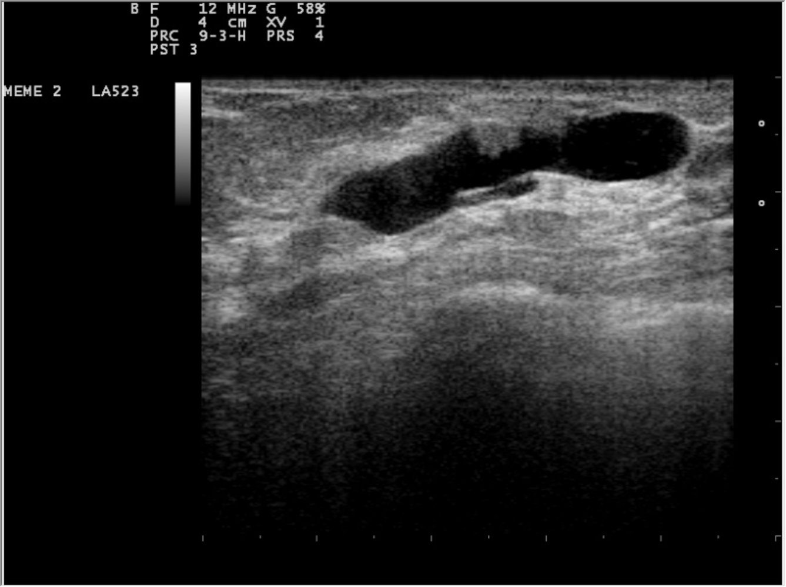
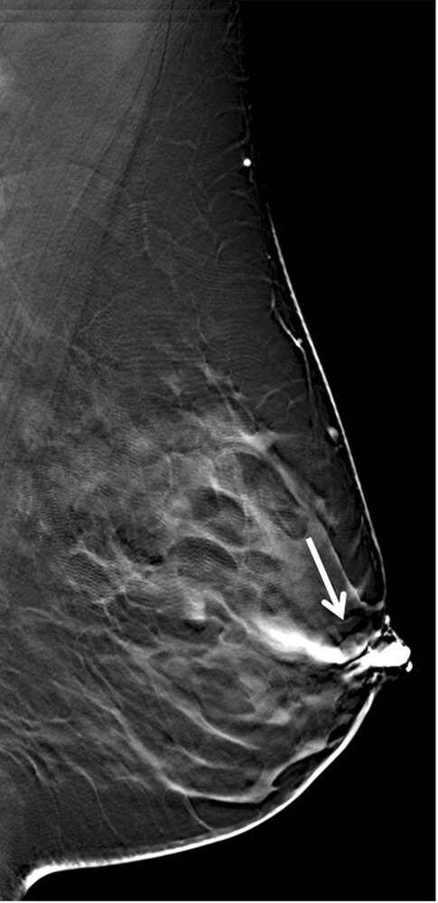

# Intraductal papilloma

*Categories: Clinical knowledge > Obstetrics/gynecology > Breast disorders > Intraductal papilloma*

[Original Article Link](https://coursology-qbank.com/amboss/article/Rt0lW3)

---

## Summary

Intraductal papilloma is a <u>tumor</u> that arises from the <u>epithelium</u> of the <u>lactiferous ducts</u>, with a peak <u>incidence</u> between 30–50 years of age. Solitary papillomas (central papillomas) are the most common cause of bloody or serous <u>nipple discharge</u> and are often associated with a palpable retroareolar mass; they are typically benign. Multiple papillomas (peripheral papillomas) are usually asymptomatic and diagnosed incidentally; they are often associated with <u>atypia</u>, <u>DCIS</u>, or invasive <u>breast cancer</u>. Characteristic features of intraductal papillomas on age-appropriate <u>breast</u> imaging include a well-defined intraductal mass and calcifications. Image-guided <u>core needle biopsy</u> is recommended in all patients for diagnostic confirmation and to assess for <u>cellular atypia</u>. Intraductal papillomas without <u>atypia</u> can be managed expectantly. Surgical excision to rule out concomitant <u>malignancy</u> is recommended for patients with intraductal papillomas with <u>atypia</u>; these patients should undergo further risk assessment for <u>breast cancer</u> and be considered for prophylactic <u>chemotherapy</u>.

---

## Epidemiology

* Peak <u>incidence</u>: 30–50 years [[2]](https://coursology-qbank.com/amboss/article/Qe1uAf0)

* Most common cause of bloody or serous <u>nipple discharge</u> [[3]](https://coursology-qbank.com/amboss/article/rj1fbS0)[[4]](https://coursology-qbank.com/amboss/article/eXaxCQ)

Epidemiological data refers to the US, unless otherwise specified.

---

## Clinical features

* Solitary papilloma (also known as central papilloma) 

* Bloody or serous <u>nipple discharge</u>

* Palpable retroareolar mass

* Multiple papillomas (also known as peripheral papillomas) 

* May be asymptomatic

* Can present as a peripherally located <u>palpable breast mass</u>

* <u>Nipple discharge</u> is uncommon.

> [!TIP]
> Solitary intraductal papillomas are typically benign. Multiple papillomas are often associated with <u>atypia</u>, <u>DCIS</u>, or invasive <u>breast cancer</u>. [[2]](https://coursology-qbank.com/amboss/article/Qe1uAf0)[[5]](https://coursology-qbank.com/amboss/article/sj1tbS0)

---

## Diagnosis

Follow age-appropriate diagnostic workup for a <u>palpable breast mass</u> and/or <u>nipple discharge</u> (see “<u>Breast mass</u>” and “<u>Nipple discharge</u>” for details). The findings specific to intraductal papillomas are described here. Asymptomatic intraductal papillomas may also be detected incidentally.

### Imaging

#### Initial imaging [[2]](https://coursology-qbank.com/amboss/article/Qe1uAf0)[[5]](https://coursology-qbank.com/amboss/article/sj1tbS0)[[6]](https://coursology-qbank.com/amboss/article/_415NS0)

* <u>Breast ultrasound</u>: well-defined solid <u>nodule</u> or mass within a dilated <u>lactiferous duct</u>

* <u>Mammography</u>: may be normal or show a well-defined mass with calcifications

Intraductal breast mass

#### Additional imaging

##### Ductography

* Indication: localization of affected ducts for <u>biopsy</u> or <u>surgery</u>  [[7]](https://coursology-qbank.com/amboss/article/3h1Sdg0)[[8]](https://coursology-qbank.com/amboss/article/z41rNS0)

* Method: <u>mammography</u> with contrast injection to visualize the <u>lactiferous ducts</u> [[9]](https://coursology-qbank.com/amboss/article/x21EPT0)

* Findings: filling defect(s) within the <u>lactiferous duct</u>, <u>duct ectasia</u> or obstruction, duct wall deformity [[6]](https://coursology-qbank.com/amboss/article/_415NS0)[[8]](https://coursology-qbank.com/amboss/article/z41rNS0)

Intraductal papilloma

##### <u>Breast</u> <u>MRI</u> [[5]](https://coursology-qbank.com/amboss/article/sj1tbS0)[[10]](https://coursology-qbank.com/amboss/article/iP1JeS0)

* Indications 

* Consider in patients with <u>nipple discharge</u> and inconclusive findings on initial imaging

* To assess the extent of lesions or to guide <u>core needle biopsy</u>

* Findings: enhancing <u>nodule</u>(s) within dilated <u>lactiferous duct</u>(s)

### <u>Core needle biopsy</u>  [[5]](https://coursology-qbank.com/amboss/article/sj1tbS0)

* Indication: all patients with suspected intraductal papilloma

* Findings [[11]](https://coursology-qbank.com/amboss/article/-41DNS0)[[12]](https://coursology-qbank.com/amboss/article/Zk1ZmS0)

* <u>Papillary</u> structure with fibrovascular core covered by both <u>epithelial</u> and <u>myoepithelial cells</u>

* Peripheral papillomas may be associated with <u>cellular atypia</u>, <u>DCIS</u>, or invasive <u>breast cancer</u>. [[5]](https://coursology-qbank.com/amboss/article/sj1tbS0)[[6]](https://coursology-qbank.com/amboss/article/_415NS0)

---

## Treatment

* Intraductal papilloma without <u>atypia</u> [[5]](https://coursology-qbank.com/amboss/article/sj1tbS0)[[10]](https://coursology-qbank.com/amboss/article/iP1JeS0)[[13]](https://coursology-qbank.com/amboss/article/hO1cHS0)[[14]](https://coursology-qbank.com/amboss/article/xF1E4i0)

* Surveillance

* Excision may be considered for symptomatic control.

* Intraductal papilloma with <u>atypia</u> [[5]](https://coursology-qbank.com/amboss/article/sj1tbS0)[[15]](https://coursology-qbank.com/amboss/article/BF1z4i0)

* Surgical excision of the affected duct(s)

* Refer patients to oncology for further risk assessment and the possible need for prophylactic <u>chemotherapy</u>.

---

## Prognosis

* Intraductal papilloma without <u>atypia</u>: good prognosis

* Intraductal papillomas with <u>atypia</u>: associated with an increased risk of <u>breast cancer</u>

---