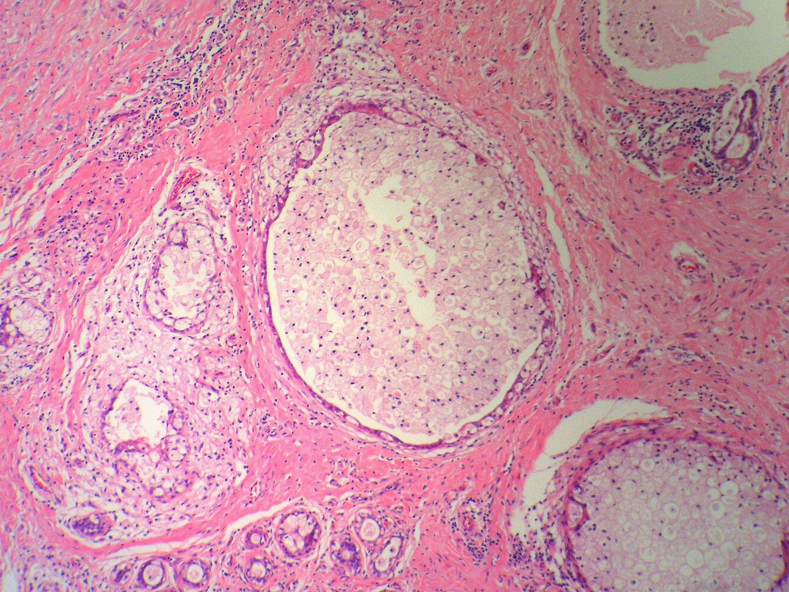

# Mammary duct ectasia

*Categories: Clinical knowledge > Obstetrics/gynecology > Breast disorders > Mammary duct ectasia*

[Original Article Link](https://coursology-qbank.com/amboss/article/St0y13)

---

## Summary

Mammary duct ectasia is a chronic inflammatory condition characterized by dilatation of the terminal (subareolar) <u>lactiferous ducts</u>, with a peak <u>incidence</u> in women between 40–50 years of age. Although often asymptomatic, mammary duct ectasia may manifest with unilateral or bilateral <u>nipple discharge</u>, <u>nipple</u> <u>inversion</u>, or a subareolar mass. The diagnostic workup is based on the age-appropriate evaluation for <u>pathological nipple discharge</u> and/or a <u>palpable breast mass</u>. A <u>biopsy</u> may be required if imaging is inconclusive or depicts features concerning for <u>malignancy</u>. The typical histopathological features of duct ectasia include periductal inflammation, luminal secretions with/without inflammatory infiltrate, and foamy <u>histiocytes</u>. As most cases resolve spontaneously, <u>expectant management</u> is usually appropriate. Surgical excision of the affected duct may be considered for symptomatic control.

---

## Epidemiology

* Most common in <u>perimenopausal</u> women

* Peak <u>incidence</u>: 40–50 years

Epidemiological data refers to the US, unless otherwise specified.

---

## Clinical features

* Often asymptomatic

* Unilateral or bilateral nonmilky gray, greenish, or bloody discharge

* <u>Nipple</u> <u>inversion</u>

* Firm, tender subareolar mass may be present (may mimic <u>breast cancer</u>)

* <u>Noncyclic mastalgia</u>

> [!NOTE]
> Mammary duct ectasia is the most common cause of greenish <u>nipple discharge</u>.

---

## Diagnosis

### Approach [[2]](https://coursology-qbank.com/amboss/article/Qe1uAf0)[[3]](https://coursology-qbank.com/amboss/article/x21EPT0)

* <u>Pathological nipple discharge</u> and/or <u>palpable breast mass</u>: 

* Perform age-appropriate <u>breast</u> imaging.

* See “<u>Palpable breast mass</u>” and “<u>Diagnostic approach to nipple discharge</u>” for details.

* Imaging findings concerning for <u>malignancy</u> : <u>biopsy</u>

### Imaging [[4]](https://coursology-qbank.com/amboss/article/drYoTq)

* <u>Breast ultrasound</u>: dilated subareolar ducts

* <u>Mammography</u>: dilated, <u>tortuous</u> subareolar ducts, branching calcifications

### <u>Biopsy</u> [[4]](https://coursology-qbank.com/amboss/article/drYoTq)[[5]](https://coursology-qbank.com/amboss/article/bu1Hpi0)

* Periductal inflammation and/or <u>fibrosis</u>

* The ductal lumens may be obliterated or filled with inspissated secretions and inflammatory cells.

* Foamy <u>histiocytes</u> are characteristically present within the inflammatory infiltrate.

Mammary duct ectasia

---

## Treatment

* <u>Expectant management</u> is usually sufficient as most cases resolve spontaneously. [[2]](https://coursology-qbank.com/amboss/article/Qe1uAf0)[[6]](https://coursology-qbank.com/amboss/article/hh1cdg0)

* Consider surgical duct excision  for patients with: [[3]](https://coursology-qbank.com/amboss/article/x21EPT0)

* <u>Nipple discharge</u>  [[2]](https://coursology-qbank.com/amboss/article/Qe1uAf0)[[3]](https://coursology-qbank.com/amboss/article/x21EPT0)

* Other persistent symptoms

* Nondiagnostic <u>biopsy</u>

---