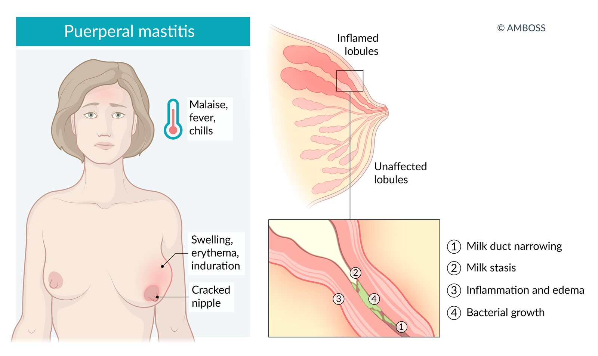

# Mastitis

*Categories: Clinical knowledge > Obstetrics/gynecology > Breast disorders > Mastitis*

[Original Article Link](https://coursology-qbank.com/amboss/article/ft0k13)

---

## Etiology

### Infectious mastitis [[3]](https://coursology-qbank.com/amboss/article/5R1ing0)

* <u>Staphylococcus aureus</u> (most common infectious cause of <u>puerperal mastitis</u>) [[2]](https://coursology-qbank.com/amboss/article/Qe1uAf0)

* Other pathogens (e.g., <u>Streptococcus</u>, <u>Escherichia coli</u>, <u>Corynebacterium</u>, <u>mycobacteria</u>)

### Noninfectious mastitis

* <u>Idiopathic</u> [[7]](https://coursology-qbank.com/amboss/article/dg1o8T0)

* <u>Foreign body reaction</u> (e.g., to piercings, implants) [[3]](https://coursology-qbank.com/amboss/article/5R1ing0)

* <u>Periductal mastitis</u> is associated with <u>cigarette smoking</u>. [[2]](https://coursology-qbank.com/amboss/article/Qe1uAf0)[[4]](https://coursology-qbank.com/amboss/article/WS1PAT0)

* Peripheral <u>nonpuerperal mastitis</u> may be <u>idiopathic</u> or associated with trauma, <u>diabetes mellitus</u>, or <u>immunosuppression</u>. [[2]](https://coursology-qbank.com/amboss/article/Qe1uAf0)[[4]](https://coursology-qbank.com/amboss/article/WS1PAT0)

---

## Pathophysiology

* <u>Nipple</u> fissures facilitate the entry of bacteria located in the nostril and throat of the <u>infant</u> or on the <u>skin</u> of the mother into the milk ducts during <u>breastfeeding</u>.

* Prolonged <u>breast engorgement</u>;  (due to overproduction of milk ) or insufficient drainage of milk;  (e.g., due to infrequent feeding, quick <u>weaning</u>, illness in either the baby or mother) result in milk stasis, which creates favorable conditions for bacterial growth within the <u>lactiferous ducts</u>.

* Duct narrowing as well as surrounding inflammation and <u>edema</u> contribute to milk stasis.

---

## Clinical features

* Typically localized, tender, indurated, swollen, <u>erythematous</u> <u>breast</u> (generally unilateral)

* Systemic symptoms (<u>malaise</u>, <u>fever</u>, and chills)

* <u>Pain</u> during <u>breastfeeding</u> [[9]](https://coursology-qbank.com/amboss/article/pi1Lsg0)

* Reduced milk secretion

* Reactive axillary <u>lymphadenopathy</u> (less common)

> [!WARNING]
> <u>Inflammatory breast cancer</u> may manifest with features similar to mastitis and should be evaluated for in patients with inadequate response to empiric treatment of mastitis. [[2]](https://coursology-qbank.com/amboss/article/Qe1uAf0)

Lactational mastitis

---

## Diagnosis

* Diagnosis is usually clinical.

* Diagnostic studies are indicated to evaluate for complications or alternative diagnoses in patients with atypical presentation or poor response to initial <u>empiric antibiotic therapy</u>.

### <u>Breast milk</u> culture  [[3]](https://coursology-qbank.com/amboss/article/5R1ing0)[[5]](https://coursology-qbank.com/amboss/article/bXaH9Q)[[8]](https://coursology-qbank.com/amboss/article/qh1CUg0)

#### Indications

* Inadequate response to initial <u>empiric antibiotic therapy</u>.

* Severe infection

* <u>Immunosuppressed</u> <u>infant</u> or <u>infant</u> in critical care receiving <u>breast milk</u>

* Recurrent mastitis

#### Method

* Clean the <u>nipple</u> and <u>areola</u> with a topical <u>antiseptic</u> solution.

* Using sterile gloves to express <u>breast milk</u>, collect a 5–10 mL sample of <u>breast milk</u> in a sterile container for culture.

### Imaging [[2]](https://coursology-qbank.com/amboss/article/Qe1uAf0)

#### Indications (not routinely required) [[5]](https://coursology-qbank.com/amboss/article/bXaH9Q)[[8]](https://coursology-qbank.com/amboss/article/qh1CUg0)

* Poor response to <u>empiric antibiotic therapy</u> (e.g., within 48–72 hours)

* Exclusion of alternative diagnoses

* Evaluation for complications (e.g., <u>abscess</u>)

#### Modalities

* <u>Breast ultrasound</u>: preferred for palpable <u>breast lump</u>, suspected <u>breast abscess</u>, or <u>periductal mastitis</u>  [[10]](https://coursology-qbank.com/amboss/article/DQc1yX0)[[11]](https://coursology-qbank.com/amboss/article/Oj1I0S0)

* <u>Mammography</u> or <u>digital breast tomosynthesis</u> : preferred when <u>inflammatory breast cancer</u> is suspected [[12]](https://coursology-qbank.com/amboss/article/Sm1yUh0)

#### Supportive findings (of mastitis) [[4]](https://coursology-qbank.com/amboss/article/WS1PAT0)

* On <u>breast ultrasound</u>

* Inflamed <u>breast</u> <u>parenchyma</u> (e.g., <u>edema</u>, <u>increased echogenicity</u>)

* Inflammatory axillary <u>lymphadenopathy</u>

* <u>Hypoechoic</u> fluid collections suggestive of a <u>breast abscess</u> may be present.

* On <u>mammography</u>: ill-defined architectural distortion and localized <u>skin</u> thickening

> [!TIP]
> <u>Mammography</u> is not contraindicated during lactation. Nursing or expressing <u>breast milk</u> before imaging improves imaging <u>sensitivity</u>. [[12]](https://coursology-qbank.com/amboss/article/Sm1yUh0)

### <u>Biopsy</u>

* <u>Core needle biopsy</u>: may be preferable for patients with imaging features suspicious for <u>malignancy</u>  [[4]](https://coursology-qbank.com/amboss/article/WS1PAT0)[[13]](https://coursology-qbank.com/amboss/article/Kg1UwT0)

* <u>Punch biopsy</u>: may be preferable for patients with features concerning for <u>inflammatory breast cancer</u> [[2]](https://coursology-qbank.com/amboss/article/Qe1uAf0)[[7]](https://coursology-qbank.com/amboss/article/dg1o8T0)

---

## Management

### <u>Puerperal mastitis</u> [[2]](https://coursology-qbank.com/amboss/article/Qe1uAf0)[[5]](https://coursology-qbank.com/amboss/article/bXaH9Q)[[14]](https://coursology-qbank.com/amboss/article/FT1gsT0)

* Initiate supportive therapy.

* Consider <u>antibiotics</u> if no improvement after 12–24 hours. [[8]](https://coursology-qbank.com/amboss/article/qh1CUg0)[[14]](https://coursology-qbank.com/amboss/article/FT1gsT0)

* For inadequate response to initial treatment or recurrence of symptoms, consider:

* <u>Breast milk</u> cultures and/or imaging (see “Diagnostics”)

* Referral to <u>breast</u> <u>surgery</u> (e.g., for treatment of underlying <u>breast abscess</u>, which requires surgical drainage)

* Severe cases (e.g., <u>sepsis</u>): Admit to hospital and initiate IV <u>antibiotics</u>.

#### Supportive therapy [[5]](https://coursology-qbank.com/amboss/article/bXaH9Q)[[14]](https://coursology-qbank.com/amboss/article/FT1gsT0)

* Rest, adequate hydration

* Warm and cold compresses

* Consider <u>therapeutic ultrasound</u> for symptomatic relief.  [[8]](https://coursology-qbank.com/amboss/article/qh1CUg0)

* <u>Pain management</u>

* <u>NSAIDs</u> (e.g., <u>ibuprofen</u> DOSAGE) [[8]](https://coursology-qbank.com/amboss/article/qh1CUg0)

* <u>Acetaminophen</u> DOSAGE [[8]](https://coursology-qbank.com/amboss/article/qh1CUg0)

* <u>Breastfeeding</u>;  upon <u>infant</u> demand with alternate <u>breasts</u>  [[8]](https://coursology-qbank.com/amboss/article/qh1CUg0)

> [!TIP]
> Patients with mastitis should continue <u>breastfeeding</u> to reduce the risk of a <u>breast abscess</u>, but feeding should only be on-demand to avoid contributing to the inflammatory process. [[8]](https://coursology-qbank.com/amboss/article/qh1CUg0)

#### Empiric antibiotic therapy for breast infections

* First-line

* Oral <u>penicillinase</u>-resistant <u>penicillin</u>  (e.g., <u>dicloxacillin</u> DOSAGE or <u>flucloxacillin</u> DOSAGE) [[5]](https://coursology-qbank.com/amboss/article/bXaH9Q)[[8]](https://coursology-qbank.com/amboss/article/qh1CUg0)

* OR <u>cephalexin</u> DOSAGE)  [[5]](https://coursology-qbank.com/amboss/article/bXaH9Q)[[8]](https://coursology-qbank.com/amboss/article/qh1CUg0)

* <u>Risk factors</u> for <u>MRSA</u> infection: 

* <u>Clindamycin</u> DOSAGE [[5]](https://coursology-qbank.com/amboss/article/bXaH9Q)[[8]](https://coursology-qbank.com/amboss/article/qh1CUg0)[[14]](https://coursology-qbank.com/amboss/article/FT1gsT0)

* Or <u>trimethoprim-sulfamethoxazole</u> (<u>TMP-SMX</u>) DOSAGE  [[5]](https://coursology-qbank.com/amboss/article/bXaH9Q)[[8]](https://coursology-qbank.com/amboss/article/qh1CUg0)[[14]](https://coursology-qbank.com/amboss/article/FT1gsT0)

* Severe illness:
* IV <u>vancomycin</u> DOSAGE [[14]](https://coursology-qbank.com/amboss/article/FT1gsT0)

> [!WARNING]
> Avoid <u>TMP-SMX</u> in lactating mothers with <u>newborns</u> < 30 days old because of the risk of <u>kernicterus</u>. [[8]](https://coursology-qbank.com/amboss/article/qh1CUg0)

### <u>Nonpuerperal mastitis</u> [[2]](https://coursology-qbank.com/amboss/article/Qe1uAf0)[[3]](https://coursology-qbank.com/amboss/article/5R1ing0)[[7]](https://coursology-qbank.com/amboss/article/dg1o8T0)

* All patients: Initiate <u>empiric antibiotic therapy for mastitis</u>.  [[2]](https://coursology-qbank.com/amboss/article/Qe1uAf0)[[3]](https://coursology-qbank.com/amboss/article/5R1ing0)

* <u>Periductal mastitis</u> [[2]](https://coursology-qbank.com/amboss/article/Qe1uAf0)[[3]](https://coursology-qbank.com/amboss/article/5R1ing0)

* Consult <u>surgery</u> for recurrence or development of complications (e.g., <u>fistula</u>).

* Encourage <u>smoking cessation</u>.

* <u>Idiopathic granulomatous mastitis</u>: specialist referral (e.g., <u>breast</u> <u>surgery</u>) to rule out <u>breast cancer</u> and determine management  [[4]](https://coursology-qbank.com/amboss/article/WS1PAT0)[[7]](https://coursology-qbank.com/amboss/article/dg1o8T0)

---

## Prevention

* Anticipatory lactational counseling  [[15]](https://coursology-qbank.com/amboss/article/Ugcbub0)

* To prevent recurrence: Consider oral <u>Lactobacillus</u> probiotic. [[8]](https://coursology-qbank.com/amboss/article/qh1CUg0)[[16]](https://coursology-qbank.com/amboss/article/egcx8b0)

---