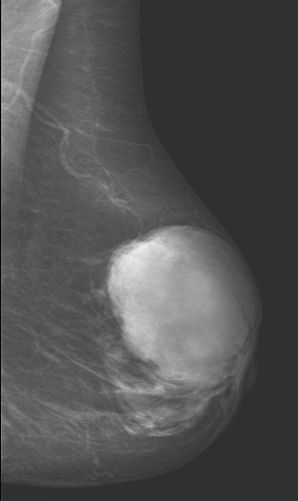
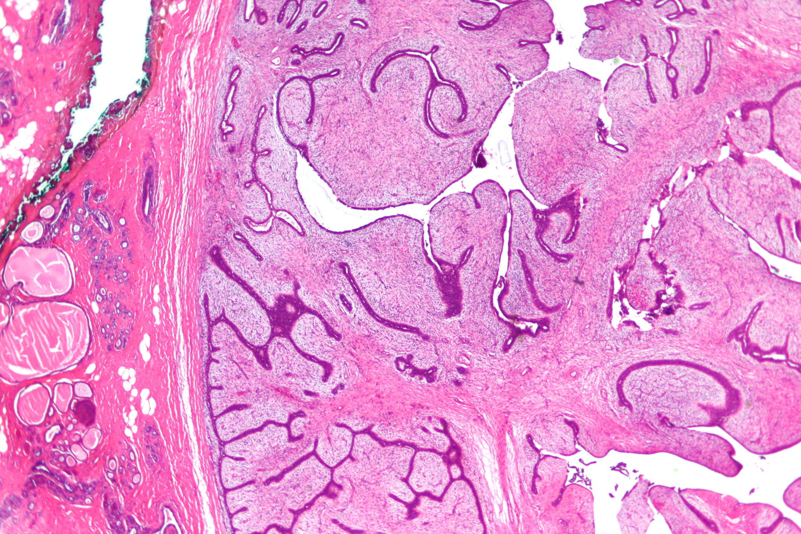

# Phyllodes tumor

*Categories: Clinical knowledge > Obstetrics/gynecology > Breast disorders > Phyllodes tumor*

[Original Article Link](https://coursology-qbank.com/amboss/article/3t0SW3)

---

## Summary

Phyllodes <u>tumor</u> is a rare fibroepithelial <u>breast</u> <u>tumor</u> that typically manifests in individuals between 40–50 years of age as a painless, multinodular <u>breast mass</u>. Unlike <u>fibroadenomas</u>, phyllodes tumors tend to increase in size more rapidly over time. On <u>breast ultrasound</u>, phyllodes tumors appear as a <u>hypoechoic</u> solid mass containing cysts; on <u>mammography</u>, they appear as a <u>hyperdense</u> mass. <u>Biopsy</u> is required for diagnostic confirmation. Histological findings of stromal cellularity and leaf-like architecture distinguish phyllodes from <u>fibroadenoma</u>. Phyllodes tumors are categorized as benign, borderline, and malignant according to the following features: border infiltration, <u>mitotic</u> activity, stromal <u>atypia</u>, and hypercellularity. Malignant or borderline phyllodes tumors can <u>metastasize</u> hematogenously. Surgical excision is recommended for nonmetastatic disease. <u>Metastatic</u> phyllodes tumors carry a poor prognosis; management (e.g., palliative <u>surgery</u>, <u>chemotherapy</u>) should be tailored to the individual. Phyllodes tumors have a high rate of recurrence after surgical excision.

---

## Epidemiology

* Account for < 1% of <u>breast</u> lesions

* Peak <u>incidence</u>: 40–50 years

Epidemiological data refers to the US, unless otherwise specified.

---

## Clinical features

* Painless, multinodular lump in the <u>breast</u>, with an average size of 4–7 cm

* Variable growth rate: may grow slowly over many years, rapidly, or have a biphasic growth pattern

> [!TIP]
> Compared to phyllodes tumors, <u>fibroadenomas</u> tend to be smaller in size, remain the same size or grow slowly, and usually occur in younger (20–30 years) women. [[3]](https://coursology-qbank.com/amboss/article/TQ16vg0)

---

## Diagnosis

Follow age-appropriate diagnostic workup for a <u>palpable breast mass</u>. The findings specific to phyllodes <u>tumor</u> are described here.

> [!WARNING]
> Phyllodes tumors and <u>fibroadenomas</u> have similar clinical presentations and imaging features. If phyllodes <u>tumor</u> is suspected, a <u>biopsy</u> is necessary to confirm the diagnosis. [[3]](https://coursology-qbank.com/amboss/article/TQ16vg0)

### Imaging findings

* <u>Breast ultrasound</u>: <u>hypoechoic</u> solid mass that may contain cysts [[4]](https://coursology-qbank.com/amboss/article/Sj1y-g0)[[5]](https://coursology-qbank.com/amboss/article/x41ElS0)

* <u>Mammography</u>: <u>hyperdense</u> mass  [[3]](https://coursology-qbank.com/amboss/article/TQ16vg0)[[5]](https://coursology-qbank.com/amboss/article/x41ElS0)

> [!TIP]
> Phyllodes tumors may be indistinguishable from <u>fibroadenomas</u> on imaging, but features such as larger size, the presence of cysts, or a <u>hyperdense</u> mass on <u>mammography</u> should raise concern for phyllodes <u>tumor</u>. [[3]](https://coursology-qbank.com/amboss/article/TQ16vg0)

Large breast mass

### <u>Biopsy</u>

* Indications: all patients with suspected phyllodes <u>tumor</u> [[3]](https://coursology-qbank.com/amboss/article/TQ16vg0)

* Modalities  [[2]](https://coursology-qbank.com/amboss/article/Qe1uAf0)[[3]](https://coursology-qbank.com/amboss/article/TQ16vg0)[[6]](https://coursology-qbank.com/amboss/article/4j130S0)

* <u>Core needle biopsy</u>

* <u>Excisional biopsy</u>

* Findings [[6]](https://coursology-qbank.com/amboss/article/4j130S0)

* Leaf-like architecture with <u>papillary</u> projections ; of <u>epithelium</u>-lined stroma (<u>connective tissue</u>)   [[7]](https://coursology-qbank.com/amboss/article/A41RNS0)

* Phyllodes tumors are histologically categorized as benign, borderline, or malignant.  [[3]](https://coursology-qbank.com/amboss/article/TQ16vg0)[[6]](https://coursology-qbank.com/amboss/article/4j130S0)

Phyllodes tumor

> [!TIP]
> Stromal cellularity and leaf-like architecture are key histological findings that distinguish phyllodes tumors from <u>fibroadenomas</u>. [[3]](https://coursology-qbank.com/amboss/article/TQ16vg0)

> [!WARNING]
> While phyllodes tumors are typically benign, some are malignant and have the potential to <u>metastasize</u>. Phyllodes tumors should be considered malignant until proven otherwise. [[3]](https://coursology-qbank.com/amboss/article/TQ16vg0)[[4]](https://coursology-qbank.com/amboss/article/Sj1y-g0)

---

## Treatment

Refer all patients with phyllodes tumors to a <u>breast</u> <u>surgeon</u> or surgical oncologist for management.

* Benign phyllodes <u>tumor</u>: surgical excision

* Borderline or malignant phyllodes <u>tumor</u>: Assess for <u>metastases</u> (e.g., CT chest).

* Nonmetastatic disease:

* Wide excision (1 cm margin), if feasible

* Adjuvant radiation may be considered to minimize the risk of recurrence.

* <u>Metastatic</u> disease:

* Palliative <u>surgery</u>

* <u>Chemotherapy</u> may be considered on an individual basis.

---

## Prognosis

* High risk of recurrence after excision  [[3]](https://coursology-qbank.com/amboss/article/TQ16vg0)

* Borderline and malignant phyllodes can <u>metastasize</u> hematogenously.

* <u>Metastatic</u> phyllodes <u>tumor</u> has a poor prognosis.

---