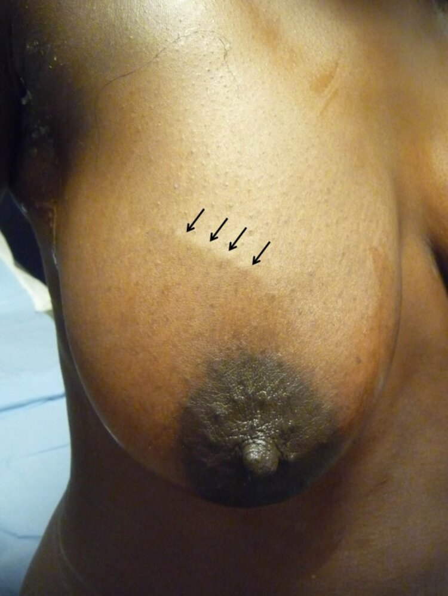
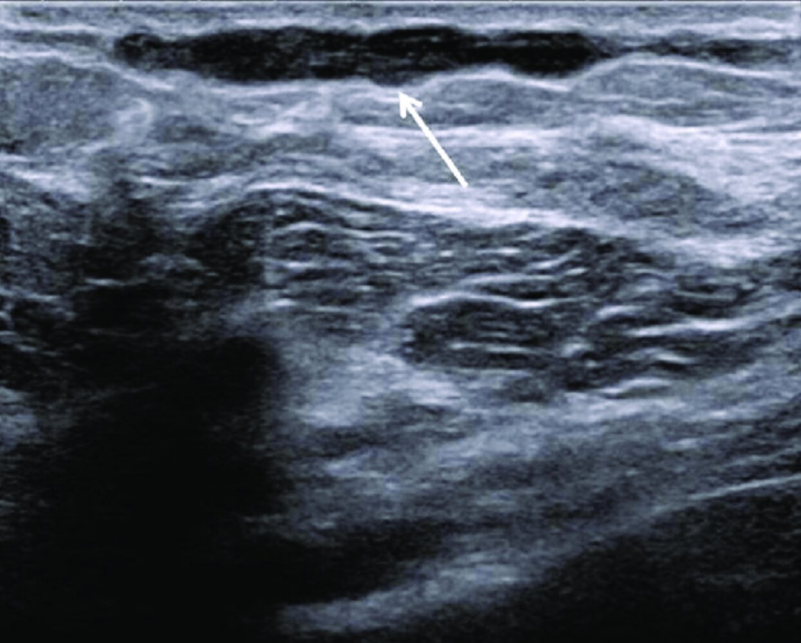
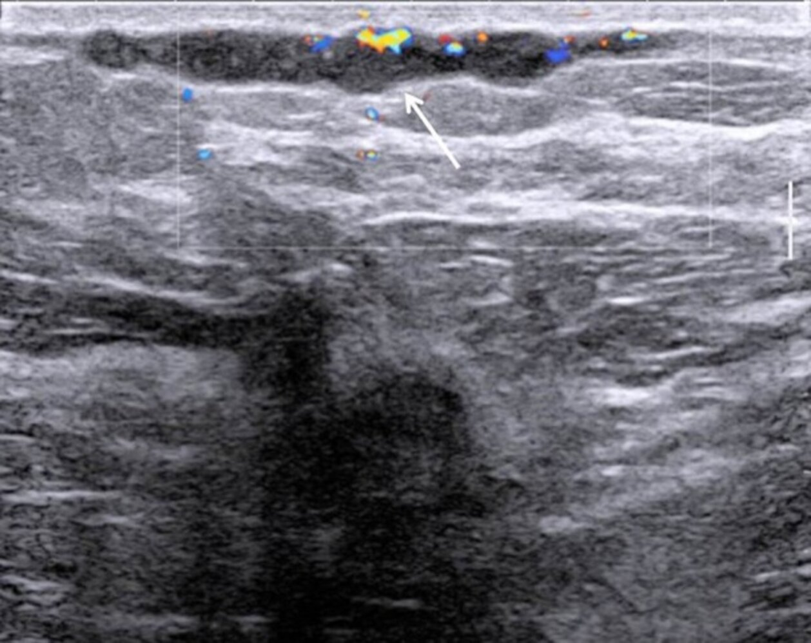

# Superficial thrombophlebitis of the breast

*Categories: Clinical knowledge > Obstetrics/gynecology > Breast disorders > Superficial thrombophlebitis of the breast*

[Original Article Link](https://coursology-qbank.com/amboss/article/pG0LZ3)

---

## Summary

<u>Superficial thrombophlebitis</u> of the <u>breast</u>, often referred to as Mondor disease of the <u>breast</u>, is a benign and <u>self-limited</u> <u>thrombophlebitis</u> of the <u>superficial veins</u> of the <u>breast</u> and/or anterolateral <u>chest wall</u>. The exact etiology is unknown, but it may be associated with trauma (including <u>breast</u> <u>surgery</u> and radiation). The condition characteristically manifests with the sudden onset of a tender cord-like induration. Although the diagnosis is primarily clinical, age-appropriate <u>breast</u> imaging is required in all patients to rule out concomitant <u>breast cancer</u>. On imaging, <u>superficial thrombophlebitis</u> typically appears as a <u>superficial</u> dilated tubular structure with a characteristic beaded appearance; an intraluminal <u>thrombus</u> may be visible on <u>Doppler ultrasound</u>. Management is mainly supportive.

---

## Clinical features

* Sudden onset

* Painful, thickened, cord-like lump or mass

* Overlying <u>erythema</u> of the <u>superficial veins</u> of the <u>breast</u> and/or <u>anterior</u> <u>chest wall</u>

Mondor disease of the breast

---

## Diagnosis

* Primarily a <u>clinical diagnosis</u>

* Perform age-appropriate <u>breast</u> imaging in all patients to exclude underlying <u>malignancy</u>  [[2]](https://coursology-qbank.com/amboss/article/Qe1uAf0)[[4]](https://coursology-qbank.com/amboss/article/_5155h0)

* <u>Breast ultrasound</u> findings:

* <u>Superficial</u> tubular structure with multiple areas of narrowing, giving a characteristic beaded appearance

* On <u>Doppler ultrasound</u>, the tubular structure may be <u>anechoic</u> or an echogenic <u>thrombus</u> may be visible.

* <u>Mammography</u> findings: often normal, but a <u>superficial</u> tubular structure with a beaded appearance may also be seen

> [!WARNING]
> <u>Superficial thrombophlebitis</u> of the <u>breast</u> may rarely be associated with underlying invasive <u>breast cancer</u>. [[2]](https://coursology-qbank.com/amboss/article/Qe1uAf0)

Mondor disease (1/2)

Mondor disease (2/2)

---

## Management

* Primarily symptomatic: topical <u>NSAIDs</u>; see also “<u>Management of mastalgia</u>” [[3]](https://coursology-qbank.com/amboss/article/gu1Fqi0)

* Reassurance

---