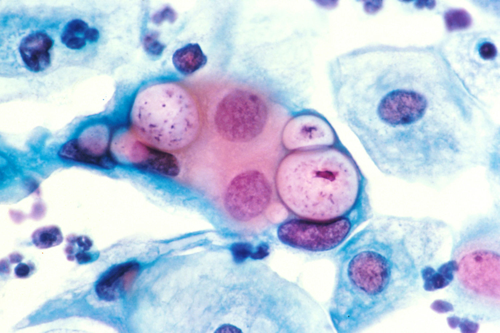
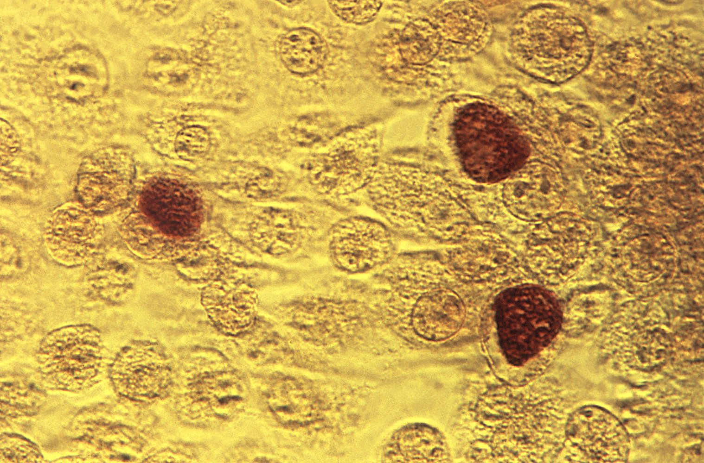
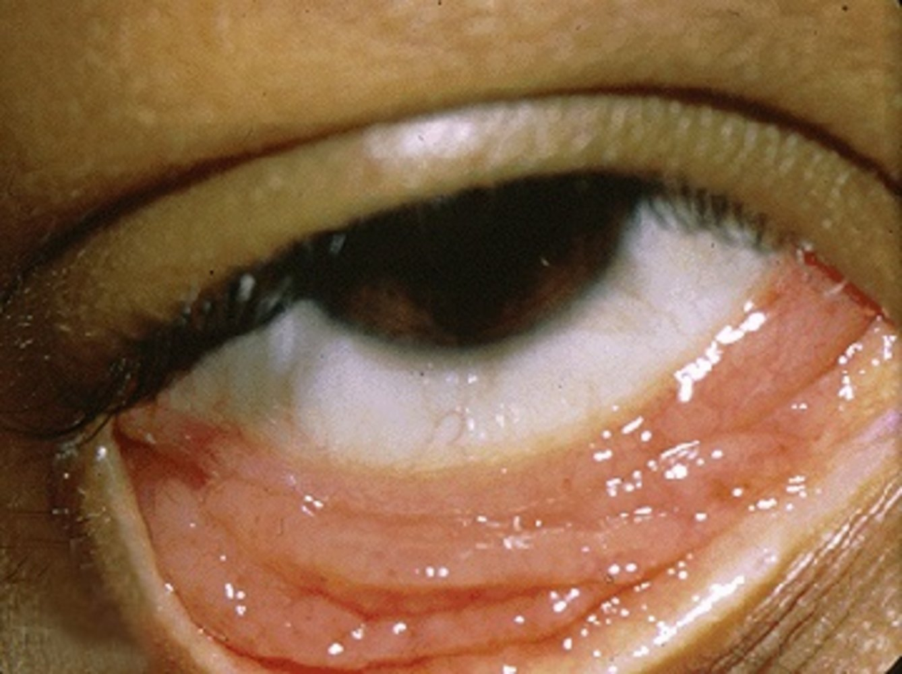

# Chlamydia infections

*Categories: Clinical knowledge > Obstetrics/gynecology > Gynecological infectious diseases > Chlamydia infections*

[Original Article Link](https://coursology-qbank.com/amboss/article/ff0kl2)

---

## Summary

Chlamydiaceae is a family of gram-negative, <u>obligate intracellular bacteria</u> that includes 3 organisms pathogenic to humans: <u>Chlamydia trachomatis</u>, <u>Chlamydia pneumoniae</u>, and <u>Chlamydia psittaci</u>. <u>C. trachomatis</u> can be differentiated into <u>serotypes</u> A–C, D–K, and L1–L3. <u>Serotypes</u> A–C mainly affect the eyes and cause <u>trachoma</u>. An infection with <u>serotypes</u> D–K can result in genitourinary infections (e.g., <u>cervicitis</u>, <u>PID</u>, <u>urethritis</u>), <u>conjunctivitis</u>, and <u>infant</u> <u>pneumonia</u>. <u>Serotypes</u> L1–L3, in turn, lead to sexually transmitted <u>lymphogranuloma venereum</u>. While both <u>C. pneumoniae</u> and <u>C. psittaci</u> primarily affect the respiratory system, <u>C. psittaci</u> also causes <u>psittacosis</u>. Chlamydial infections in adults and <u>adolescents</u> are mostly diagnosed based on clinical presentation and are treated with <u>doxycycline</u> or <u>macrolides</u>. In all cases of sexually transmitted chlamydial infection, <u>expedited partner therapy</u> should also be initiated as soon as possible. <u>Chlamydia infection in children</u> can be acquired via <u>perinatal</u> infection (e.g., manifesting as <u>conjunctivitis</u> or <u>pneumonia in infants</u>) or sexual transmission. <u>Chlamydia</u> infection in preadolescent children is concerning for <u>child sexual abuse</u> and should be managed in consultation with a <u>child abuse</u> specialist.

Ocular manifestations are discussed in more detail in the “<u>Bacterial conjunctivitis</u>” and “<u>Neonatal conjunctivitis</u>” articles.

---

## General

### General characteristics

* Gram-negative organisms that <u>Gram stain</u> poorly

* Obligate intracellular bacteria (unable to produce its own <u>ATP</u>)

* Absent <u>peptidoglycan</u> (<u>muramic acid</u>) in <u>the cell</u> wall, which makes <u>beta-lactam</u> <u>antibiotics</u> ineffective

* Visible as <u>cytoplasmic</u> <u>inclusion bodies</u> on <u>Giemsa stain</u> or fluorescent <u>antibody</u>-stained smear

* Very difficult cultivation

Pap smear showing chlamydial infection

### Life cycle

* First phase: elementary bodies (small and dense bodies that characterize the infectious stage of Chlamydiaceae; stable in the extracellular environment and almost inactive metabolically) [[1]](https://coursology-qbank.com/amboss/article/l_bvow)
1. * Attachment of extracellular <u>elementary bodies</u> to <u>target cells</u> (mostly on the respiratory or urogenital <u>epithelium</u>)
2. * <u>Endocytosis</u>
3. * Transformation into <u>reticulate bodies</u> in the endosome

* Second phase: reticulate bodies (represent the obligate intracellular, replicative, and metabolically active form of Chlamydiaceae)
1. * Replication by fission and aggregation of various <u>reticulate bodies</u> in the endosome (at which point they are called <u>inclusion bodies</u>)
2. * Transformation of <u>reticulate bodies</u> into <u>elementary bodies</u>
3. * Lysis of endosomes
4. * Release of newly formed <u>elementary bodies</u> and exit from cell
5. * New start of cycle

> [!NOTE]
> Elementary bodies survive in the Environment, Enter <u>the cell</u> via Endocytosis, and Evolve into <u>reticulate bodies</u>.

> [!NOTE]
> Reticulate bodies Replicate in <u>the cell</u> and Reorganize to <u>elementary bodies</u>.

Chlamydia trachomatis in McCoy cell culture

Chlamydia trachomatis in McCoy cell culture (magnified view)

### Features

| Characteristics of Chlamydiaceae |  |  |  |  |
| --- | --- | --- | --- | --- |
| Bacteria | <u>Serotypes</u> | Organ | Transmission | Disease |
|  <u>Chlamydia trachomatis</u>  | A–C |  * Eyes   |   * Smear infection via discharge from the eyes or nose of infected persons  * Can be transmitted by direct contact, clothes, or insects    |  * <u>Trachoma</u>   |
| D–K |   * Eyes  * Genitourinary tract  * <u>Lungs</u>    |   * Sexual intercourse  * Vaginal <u>birth</u> (in which the mother is infected)    |   * <u>Neonatal chlamydial conjunctivitis</u>  * <u>Inclusion conjunctivitis</u>  * <u>Chlamydial genitourinary infections</u>  * <u>Pelvic inflammatory disease</u>  * <u>Infant</u> <u>pneumonia</u>  * <u>Reactive arthritis</u> [[2]](https://coursology-qbank.com/amboss/article/y4XdNy)  * <u>Proctitis</u>, especially in <u>men who have sex with men</u>    |  |
| L1–L3 |   * <u>Urinary tract</u>  * Anorectal area  * Genitourinary tract    |  * Sexual intercourse   |  * <u>Lymphogranuloma venereum</u> (<u>LGV</u>)   |  |
|  <u>Chlamydia pneumoniae</u>  |  |  * <u>Lungs</u>   |  * Person-to-person transmission of respiratory secretions via aerosols   |  * <u>Atypical pneumonia</u> (especially in older adults) [[3]](https://coursology-qbank.com/amboss/article/yXWd040)   |
| <u>Chlamydia psittaci</u> |  |  * <u>Lungs</u>   |  * <u>Airborne transmission</u> (pathogens in the feces and dander of birds)   |   * <u>Psittacosis</u>  * <u>Atypical pneumonia</u>    |

Inclusion conjunctivitis

---

## Chlamydial pneumonia

### Infant pneumonia due to Chlamydia trachomatis (<u>serotypes</u> D–K) [[4]](https://coursology-qbank.com/amboss/article/Bedza60)[[5]](https://coursology-qbank.com/amboss/article/2NcT010)

* Transmission: <u>perinatal transmission</u> during delivery via contact with the genital flora of the birthing parent

* <u>Incubation period</u>: 4–12 weeks

* Clinical features

* <u>Staccato cough</u>, <u>tachypnea</u>, nasal congestion, <u>rales</u>, <u>otitis media</u>

* Typically afebrile

* Possible <u>neonatal conjunctivitis</u>  [[4]](https://coursology-qbank.com/amboss/article/Bedza60)

* Diagnostics

* <u>Pathogen</u> identification: from a <u>posterior</u> <u>nasopharyngeal specimen</u> 

* Definitive test: culture

* Additional tests: nonculture tests, such as <u>nucleic acid amplification tests</u> (<u>NAAT</u>) and direct fluorescence <u>antibody</u> (<u>DFA</u>)

* Other tests

* <u>CBC</u>: may reveal <u>eosinophilia</u>

* <u>CXR</u>: hyperinflation and bilateral diffuse infiltrates

* Management

* Consider empiric treatment based on high clinical suspicion while awaiting results of diagnostic testing.

* <u>Antibiotics</u>

* Recommended: oral <u>erythromycin</u> base OR ethyl <u>succinate</u>

* Alternative: <u>azithromycin</u>

* If infection is confirmed, perform <u>testing for gonorrhea</u>.

* Schedule follow-up to determine response to treatment.

* Complications: <u>respiratory failure</u>

* Prevention: <u>prenatal chlamydia screening</u> and treatment before <u>birth</u>

> [!WARNING]
> Monitor treated <u>infants</u> for <u>signs of hypertrophic pyloric stenosis</u>, which is associated with oral <u>erythromycin</u> and <u>azithromycin</u> in <u>infants</u> < 6 weeks of age. [[4]](https://coursology-qbank.com/amboss/article/Bedza60)

### <u>Chlamydia pneumoniae</u>

* Transmission: person-to-person transmission of respiratory secretions via aerosols [[6]](https://coursology-qbank.com/amboss/article/5g0iD2)

* <u>Incubation period</u>: 3–4 weeks

* Clinical features 

* Sometimes asymptomatic

* General symptoms of <u>atypical pneumonia</u> 

* <u>Fever</u>

* Non-productive <u>cough</u>

* <u>Headache</u>

* <u>Myalgias</u>

* Sometimes associated with <u>pharyngitis</u> and <u>hoarseness</u>  [[7]](https://coursology-qbank.com/amboss/article/ng07D2)

* Diagnostics [[8]](https://coursology-qbank.com/amboss/article/UPbbVF)[[9]](https://coursology-qbank.com/amboss/article/2PbTVF)

* <u>Chlamydia</u> <u>IgG</u> and <u>IgM</u> <u>serology</u>

* <u>NAAT</u>: performed on the patient's <u>nasopharyngeal swab</u> or <u>sputum</u>

* Treatment

* First-line treatment: oral <u>azithromycin</u>, <u>clarithromycin</u>

* Second-line treatment: oral <u>doxycycline</u>

* Complications [[6]](https://coursology-qbank.com/amboss/article/5g0iD2)

* <u>Asthma exacerbation</u>

* <u>Myocarditis</u>

* <u>Encephalitis</u>

### <u>Chlamydia psittaci</u> (psittacosis, "<u>parrot fever</u>" , or <u>ornithosis</u> ) [[10]](https://coursology-qbank.com/amboss/article/Kg0Uw2)

* Transmission

* Airborne;  (pathogens from feces and/or dander of infected birds)

* Mainly affects individuals in contact with free-ranging birds or pets, or occurs as an <u>occupational disease</u>

* <u>Incubation period</u>: 5–14 days [[10]](https://coursology-qbank.com/amboss/article/Kg0Uw2)

* Clinical features: Symptoms can vary greatly.

* Acute onset of <u>flu-like</u> symptoms; , especially <u>fever</u>

* <u>Atypical pneumonia</u> with non-productive <u>cough</u>

* <u>Headaches</u>

* <u>Arthralgia</u>, <u>myalgia</u>

* Diagnostics [[11]](https://coursology-qbank.com/amboss/article/TPb6VF)

* Culture of respiratory specimens (e.g., <u>sputum</u>, <u>pleural fluid</u>)

* <u>Polymerase chain reaction</u> (<u>PCR</u>) of respiratory specimens

* <u>Serology</u> for <u>Chlamydia psittaci</u> <u>IgG</u> and <u>IgM</u> with the <u>complement</u>-fixation test (<u>CFT</u>) or micro-<u>immunofluorescence</u> (<u>MIF</u>); diagnosis requires either of the following:

* Four-fold or greater increase in <u>antibody</u> <u>titer</u> between acute and convalescent sera

* A single <u>IgM antibody</u> <u>titer</u> of 1:16 or higher

* Treatment

* First-line treatment: <u>doxycycline</u>

* Second-line treatment: <u>macrolides</u> (e.g., <u>azithromycin</u>, <u>erythromycin</u>)

* Drugs of choice for children and pregnant women

* Alternative: <u>fluoroquinolones</u>

* Complications [[10]](https://coursology-qbank.com/amboss/article/Kg0Uw2)[[12]](https://coursology-qbank.com/amboss/article/3_bSLw)

* <u>Respiratory failure</u>

* <u>Myocarditis</u>, <u>endocarditis</u>

* <u>Meningoencephalitis</u>

* <u>Hepatitis</u>

> [!NOTE]
> <u>Chlamydia</u> psittaci accumulates in parrots and other birds and causes atypical pneumonia.

> [!TIP]
> <u>Psittacosis</u> is a <u>notifiable disease</u> and should be reported in most of the states.

---

## Sexually transmitted infections

<u>Chlamydia trachomatis</u> predominantly affects the genitourinary tract although it can cause <u>pneumonia</u> and <u>neonatal conjunctivitis</u> in <u>infants</u> born vaginally to infected mothers. Disease presentation depends on the <u>serotype</u> involved. <u>Serotypes</u> D–K cause <u>genitourinary chlamydia</u> (<u>nonlymphogranuloma venereum</u>), which presents with <u>urethritis</u>, <u>proctitis</u>, <u>cervicitis</u>, <u>pelvic inflammatory disease</u>, <u>epididymitis</u>, and <u>prostatitis</u>; <u>serotypes</u> L1–L3 cause <u>lymphogranuloma venereum</u>, which presents with either rectal infection (<u>proctitis</u>) or <u>ulceration</u> and inguinal <u>lymphadenopathy</u>.

---

## Genitourinary chlamydia (Nonlymphogranuloma venereum)

### Etiology

* <u>Chlamydia trachomatis</u> <u>serotypes</u> D–K [[13]](https://coursology-qbank.com/amboss/article/FYWgIP0)

* May be transmitted through genital-to-genital contact or oropharyngeal-to-genital contact

### <u>Epidemiology</u>

* One of the most common <u>STIs</u> in the US [[14]](https://coursology-qbank.com/amboss/article/6vcjae0)

* One of the most common causes of <u>pelvic inflammatory disease</u> [[5]](https://coursology-qbank.com/amboss/article/2NcT010)

### Clinical features [[15]](https://coursology-qbank.com/amboss/article/zQ1rAg0)

* The majority of infected individuals are asymptomatic.  [[14]](https://coursology-qbank.com/amboss/article/6vcjae0)

* Patients of any <u>gender</u> may present with <u>urethritis</u>;  (can cause <u>dysuria</u> or <u>polyuria</u>) or <u>proctitis</u>

* Patients with female genitalia may additionally present with <u>salpingitis</u>, <u>cervicitis</u>, or <u>symptoms of pelvic inflammatory disease</u>.

* (Muco)<u>purulent</u> <u>vaginal discharge</u>

* <u>Abnormal uterine bleeding</u>

* <u>Postcoital bleeding</u>

* <u>Dyspareunia</u>

* Patients with male genitalia may additionally present with <u>epididymitis</u> or <u>prostatitis</u>.

* Symptoms of <u>reactive arthritis</u> may also be present. [[2]](https://coursology-qbank.com/amboss/article/y4XdNy)

### Diagnostics of genitourinary chlamydia [[5]](https://coursology-qbank.com/amboss/article/2NcT010)

* Preferred test: <u>nucleic acid amplification test</u> (<u>NAAT</u>)

* Detects <u>Chlamydia trachomatis</u> <u>RNA</u> or <u>DNA</u>, e.g., by <u>PCR</u>  [[14]](https://coursology-qbank.com/amboss/article/6vcjae0)

* Specimen collection:  [[5]](https://coursology-qbank.com/amboss/article/2NcT010)

* Individuals with female genitalia: <u>vaginal swab</u> (preferred), cervical swab, or <u>first-void urine</u>

* Individuals with male genitalia: <u>first-void urine</u> (preferred) or urethral swab

* Suspected exposure from rectal intercourse: rectal swab

* Other diagnostic tests: not routinely recommended; a culture may be preferred over <u>NAAT</u> in select circumstances.  [[16]](https://coursology-qbank.com/amboss/article/KBcUbU0)

### Management of genitourinary chlamydia [[5]](https://coursology-qbank.com/amboss/article/2NcT010)

The following recommendations apply to adults and <u>adolescents</u>, including pregnant individuals. For management of <u>chlamydia infection in preadolescents</u>, see “<u>Chlamydia in children</u>.”

#### Approach

* Start <u>antibiotic therapy</u> (even if asymptomatic), e.g., <u>doxycycline</u> or <u>azithromycin</u>.  [[15]](https://coursology-qbank.com/amboss/article/zQ1rAg0)

* Evaluate and treat sexual partners (offer <u>expedited partner therapy</u> where available). 

* All partners in the last 60 days

* OR, if no partners in the past 60 days, the most recent partner

* Test for common sexually transmitted <u>coinfections</u>.

* All patients: <u>HIV testing</u>, <u>gonorrhea testing</u>, <u>syphilis testing</u>

* <u>Men who have sex with men (MSM)</u> diagnosed with <u>chlamydia</u> on a rectal sample: Consider testing for <u>LGV</u>. [[17]](https://coursology-qbank.com/amboss/article/h31cRg0)

* Offer patients <u>counseling on safer sex practices</u> including <u>HIV PrEP</u> where appropriate.  [[5]](https://coursology-qbank.com/amboss/article/2NcT010)

* Advise patients to abstain from sexual intercourse until all the following criteria are met:

* Completion of a 7-day regimen or for 7 days after a single-dose regimen

* Symptom resolution

* All sexual partners have completed treatment

* Report all cases of <u>genitourinary chlamydia</u> to the local health department. [[18]](https://coursology-qbank.com/amboss/article/-Q1DAg0)

> [!TIP]
> <u>Doxycycline</u> is contraindicated in <u>pregnancy</u>; pregnant patients should be treated with <u>azithromycin</u>. [[5]](https://coursology-qbank.com/amboss/article/2NcT010)

#### Antibiotic therapy for genitourinary chlamydia

* When possible, provide the complete regimen and administer the first dose at the time of visit.

* Recommended regimens

* Nonpregnant individuals

* First-line: <u>doxycycline</u> DOSAGE [[5]](https://coursology-qbank.com/amboss/article/2NcT010)[[19]](https://coursology-qbank.com/amboss/article/nid7Hp0)

* Alternative: <u>azithromycin</u>  DOSAGE OR <u>levofloxacin</u> (<u>off-label</u>) DOSAGE  [[5]](https://coursology-qbank.com/amboss/article/2NcT010)[[19]](https://coursology-qbank.com/amboss/article/nid7Hp0)

* Pregnant individuals

* Preferred: <u>azithromycin</u> DOSAGE

* Alternative: <u>amoxicillin</u> DOSAGE [[5]](https://coursology-qbank.com/amboss/article/2NcT010)

> [!WARNING]
> Patients with <u>gonorrhea</u> <u>coinfection</u> should be treated with oral <u>doxycycline</u> plus a single dose of intramuscular <u>ceftriaxone</u>. [[5]](https://coursology-qbank.com/amboss/article/2NcT010)

> [!TIP]
> If nonadherence to treatment is a concern, <u>directly observed therapy</u> with <u>azithromycin</u> (given as a single dose) is preferred. [[5]](https://coursology-qbank.com/amboss/article/2NcT010)[[19]](https://coursology-qbank.com/amboss/article/nid7Hp0)

#### Follow-up [[5]](https://coursology-qbank.com/amboss/article/2NcT010)

* Follow-up of pregnant patients with chlamydia

* Perform a test of cure at 4 weeks.

* Repeat after 3 months.

* Individuals with ongoing <u>risk factors for STIs</u> should also be screened for <u>chlamydia</u> in the <u>third trimester</u>.  [[5]](https://coursology-qbank.com/amboss/article/2NcT010)

* Follow-up of nonpregnant patients with <u>chlamydia</u>

* Consider retesting at 4 weeks if any of the following are present:

* Persistent symptoms

* Concern for reinfection

* Concern for <u>poor adherence</u> to treatment regimen

* Otherwise, retest at 3 months.

### Complications [[5]](https://coursology-qbank.com/amboss/article/2NcT010)[[16]](https://coursology-qbank.com/amboss/article/KBcUbU0)

* <u>PID</u> → <u>Fitz-Hugh-Curtis syndrome</u>

* <u>Ectopic pregnancy</u>

* <u>Infertility</u>

* <u>Reactive arthritis</u>

* <u>Perinatal transmission</u> causing:

* <u>Neonatal chlamydial conjunctivitis</u>

* <u>Infant pneumonia due to Chlamydia trachomatis</u>

Fitz-Hugh-Curtis syndrome (perihepatitis)

### Prevention

* Counsel patients on <u>prevention of STIs</u>.

* Offer <u>doxycycline</u> <u>postexposure prophylaxis</u> to <u>MSM</u> and <u>transgender women</u> with ≥ 1 bacterial <u>STI</u> in the past 12 months (see “<u>Postexposure prophylaxis for STIs</u>”). [[20]](https://coursology-qbank.com/amboss/article/M2dMR60)

#### Screening for chlamydia [[5]](https://coursology-qbank.com/amboss/article/2NcT010)[[14]](https://coursology-qbank.com/amboss/article/6vcjae0)

Screen patients using <u>NAAT</u>.

|  Recommended <u>screening for chlamydia</u> [[5]](https://coursology-qbank.com/amboss/article/2NcT010)  |  |  |
| --- | --- | --- |
|  | Frequency | Specimen collection |
| Sexually active women |  * Annual screening for patients:  [[5]](https://coursology-qbank.com/amboss/article/2NcT010)[[14]](https://coursology-qbank.com/amboss/article/6vcjae0)  * < 25 years  * ≥ 25 years with <u>risk factors for STIs</u> (e.g., new or multiple sex partners, sex partner with an <u>STI</u>)   |   * Preferred: <u>vaginal swab</u>  * Alternative: cervical swab, or <u>first-void urine</u>  * Patients with a history of anal sex: A rectal swab should be additionally obtained.    |
| Prenatal screening for Chlamydia trachomatis |   * Patients with <u>risk factors for STIs</u>: first prenatal visit and in the <u>third trimester</u>  * For all other patients: consider at the first prenatal visit (especially in high <u>prevalence</u> areas)  [[21]](https://coursology-qbank.com/amboss/article/Ef18LT0)    |  |
| Sexually active young men |   * No recommended set intervals  * Consider screening in clinical settings with a high <u>prevalence</u> of chlamydial infections.  [[5]](https://coursology-qbank.com/amboss/article/2NcT010)    |   * Preferred: <u>first-void urine</u>  * Alternative: urethral swab    |
| <u>MSM</u> |   * At least annually  * Every 3–6 months for patients with ongoing additional <u>risk factors for STIs</u>    |  * Obtain samples from sites of potential exposure in the last year (except oropharyngeal), in patients with a history of:  [[5]](https://coursology-qbank.com/amboss/article/2NcT010)  * Insertive intercourse: <u>first-void urine</u> (preferred) or urethral swab  * Receptive anal intercourse: rectal swab   |

> [!TIP]
> Best practices for screening <u>transgender</u> individuals have not been established; tailor screening to the patient's anatomy. See also “<u>Principles of transgender health care</u>.” [[5]](https://coursology-qbank.com/amboss/article/2NcT010)[[15]](https://coursology-qbank.com/amboss/article/zQ1rAg0)

> [!TIP]
> Screening is typically performed simultaneously with <u>screening for gonorrhea</u>.

---

## Lymphogranuloma venereum

### Etiology [[5]](https://coursology-qbank.com/amboss/article/2NcT010)

* Caused by <u>Chlamydia trachomatis</u> <u>serotypes</u> L1–L3 [[5]](https://coursology-qbank.com/amboss/article/2NcT010)

* Rectal infection has been associated with <u>mucosal</u> trauma, e.g., from receptive fisting, sex toy use, and group sex. [[22]](https://coursology-qbank.com/amboss/article/rBcfXU0)[[23]](https://coursology-qbank.com/amboss/article/YU1nbT0)

> [!NOTE]
> <u>C. trachomatis</u> <u>serotypes</u> L1-L3 cause Lymphogranuloma venereum.

### <u>Epidemiology</u>

* Globally: more common in tropical and subtropical regions [[17]](https://coursology-qbank.com/amboss/article/h31cRg0)

* In high-income countries: increasing <u>incidence</u> among <u>MSM</u> [[22]](https://coursology-qbank.com/amboss/article/rBcfXU0)

### Clinical features [[5]](https://coursology-qbank.com/amboss/article/2NcT010)[[17]](https://coursology-qbank.com/amboss/article/h31cRg0)

* Rectal infection (most common): <u>proctitis</u> or <u>proctocolitis</u>

* ∼ 50% of cases may be asymptomatic or mild. [[22]](https://coursology-qbank.com/amboss/article/rBcfXU0)

* Mild symptoms: <u>constipation</u>, mucous streaking of stool [[23]](https://coursology-qbank.com/amboss/article/YU1nbT0)

* Severe symptoms: rectal <u>pain</u>, bleeding, and discharge; <u>tenesmus</u>, and systemic symptoms [[5]](https://coursology-qbank.com/amboss/article/2NcT010)

* Genital or anal infection: genital and inguinal disease [[17]](https://coursology-qbank.com/amboss/article/h31cRg0)

* Primary infection (after approx. 1 week)

* Small, painless genital <u>ulcers</u> (herpetiform) that heal spontaneously within a few days

* May be accompanied by mucopurulent discharge

* Secondary infection (2–6 weeks after onset of primary infection)

* Painful swelling of the <u>lymph nodes</u> in the inguinal region (<u>buboes</u>)

* If <u>lymph nodes</u> are enlarged above and below the <u>inguinal ligament</u>, the characteristic groove sign may be seen.

* In one-third of cases, an <u>abscess</u> forms and may rupture, discharging <u>pus</u>.

* Oral infection: oral <u>ulceration</u>, which may be followed by <u>cervical lymphadenopathy</u> [[5]](https://coursology-qbank.com/amboss/article/2NcT010)

> [!TIP]
> <u>Ulcers</u> may have healed by the time patients present with painful <u>lymphadenopathy</u>. [[5]](https://coursology-qbank.com/amboss/article/2NcT010)

### Diagnostics [[5]](https://coursology-qbank.com/amboss/article/2NcT010)

* Presumptive diagnosis: recommended, based on the following

* Clinical presentation

* Epidemiological information

* <u>NAAT</u> for <u>C. trachomatis</u> taken from the site of the patient's symptoms, e.g.:

* Rectal specimen (if symptoms of <u>proctocolitis</u> are present)

* Swabs of genital or oral lesions

* <u>Lymph node</u> <u>aspirate</u>   [[17]](https://coursology-qbank.com/amboss/article/h31cRg0)

* Exclusion of <u>differential diagnoses of LGV</u>

* Rectal <u>Gram stain</u> in <u>proctitis</u> or <u>proctocolitis</u>: More than 10 <u>WBC</u> per <u>high power field</u> suggests <u>LGV</u> <u>proctitis</u>. [[5]](https://coursology-qbank.com/amboss/article/2NcT010)[[24]](https://coursology-qbank.com/amboss/article/DYW1rP0)

* Definitive diagnosis: genotyping (e.g., by <u>PCR</u>) of sample taken for <u>NAAT</u> to identify the <u>C. trachomatis</u> <u>serotypes</u> associated with <u>LGV</u>  [[5]](https://coursology-qbank.com/amboss/article/2NcT010)

> [!TIP]
> If clinical suspicion for <u>LGV</u> is high, start <u>antibiotic</u> treatment immediately rather than waiting for the results of diagnostic testing. [[5]](https://coursology-qbank.com/amboss/article/2NcT010)

### Management [[5]](https://coursology-qbank.com/amboss/article/2NcT010)

The following recommendations apply to adults and <u>adolescents</u>, including pregnant individuals. For management of <u>chlamydia infection in preadolescents</u>, see “<u>Chlamydia in children</u>.”

#### Approach

* Start <u>antibiotic therapy</u> (preferably <u>doxycycline</u>). [[15]](https://coursology-qbank.com/amboss/article/zQ1rAg0)

* Consider <u>bubo</u> drainage.

* Evaluate and treat: [[5]](https://coursology-qbank.com/amboss/article/2NcT010)

* All partners in the last 60 days  [[5]](https://coursology-qbank.com/amboss/article/2NcT010)[[17]](https://coursology-qbank.com/amboss/article/h31cRg0)

* The most recent sexual partner (if no history of sexual contact in the last 60 days).

* Testing for common sexually transmitted <u>coinfections</u> is recommended: <u>HIV testing</u>, <u>gonorrhea testing</u>, <u>syphilis testing</u>.

* Offer patients <u>counseling on safer sex practices</u>, including <u>HIV PrEP</u> where appropriate.

* Advise patients to abstain from sexual intercourse until all the following criteria are met: [[17]](https://coursology-qbank.com/amboss/article/h31cRg0)

* <u>Antibiotic</u> course has been completed

* Resolution of symptoms

* All sexual partners have completed treatment

* Report all cases of <u>LGV</u> to the local health department. [[18]](https://coursology-qbank.com/amboss/article/-Q1DAg0)

#### Antibiotic therapy for LGV [[5]](https://coursology-qbank.com/amboss/article/2NcT010)

* Initiate <u>antibiotic</u> treatment without waiting for <u>NAAT</u> results for patients with:

* Severe <u>proctocolitis</u> symptoms (bloody discharge, <u>tenesmus</u>, or rectal <u>ulcers</u>)

* Severe inguinal <u>buboes</u>

* Genital <u>ulcer</u> without an alternative etiology

* Symptomatic patients

* First-line: <u>doxycycline</u> DOSAGE [[5]](https://coursology-qbank.com/amboss/article/2NcT010)

* Alternatives: <u>azithromycin</u>;  (<u>off-label</u>) DOSAGE or <u>erythromycin</u> DOSAGE [[5]](https://coursology-qbank.com/amboss/article/2NcT010)

* Pregnant patients: Consider <u>azithromycin</u>;  (<u>off-label</u>) or <u>erythromycin</u>.

* Asymptomatic partners: short course <u>doxycycline</u> DOSAGE [[5]](https://coursology-qbank.com/amboss/article/2NcT010)

#### <u>Bubo</u> drainage [[5]](https://coursology-qbank.com/amboss/article/2NcT010)[[17]](https://coursology-qbank.com/amboss/article/h31cRg0)

* Consider drainage to prevent formation of <u>ulcers</u> or <u>fistulas</u>.

* Options include needle <u>aspiration</u> or <u>incision and drainage</u>.  [[17]](https://coursology-qbank.com/amboss/article/h31cRg0)

#### Follow-up [[5]](https://coursology-qbank.com/amboss/article/2NcT010)

* Regularly reassess the patient until signs and symptoms have resolved.

* Retest for <u>C. trachomatis</u> after completion of treatment.

* Pregnant women: at 4 weeks

* Other patients: at 3 months (up to 12 months, if necessary)  [[5]](https://coursology-qbank.com/amboss/article/2NcT010)

### Differential diagnoses of LGV

* <u>Ulcerations</u>/<u>lymphadenopathy</u>

* <u>Granuloma inguinale</u>

* <u>Syphilis</u>

* <u>Herpes simplex virus</u>

* <u>Mpox</u>

* See also “<u>Differential diagnosis of genital lesions</u>” and “Localized <u>lymphadenopathy</u>.”

* <u>Proctitis</u> or <u>proctocolitis</u> [[23]](https://coursology-qbank.com/amboss/article/YU1nbT0)

* <u>Gonorrhea</u>

* <u>Genitourinary chlamydia</u>

* <u>Syphilis</u>

* <u>Herpes simplex virus</u>

* <u>Mpox</u>

* Gastrointestinal pathogens, e.g., <u>Shigella</u> spp, Escheria coli

* <u>Inflammatory bowel disease</u>

> [!NOTE]
> <u>Lymphogranuloma venereum</u> (<u>pathogen</u>: <u>Chlamydia trachomatis</u> <u>serotypes</u> L1–L3) should not be mistaken for <u>granuloma inguinale</u> (<u>pathogen</u>: <u>Klebsiella granulomatis</u>).

### Complications [[5]](https://coursology-qbank.com/amboss/article/2NcT010)[[17]](https://coursology-qbank.com/amboss/article/h31cRg0)

Complications represent a tertiary stage of the disease. [[17]](https://coursology-qbank.com/amboss/article/h31cRg0)

* <u>Fibrotic</u> changes; strictures in the anogenital tract

* Genital <u>elephantiasis</u>, chronic <u>lymphedema</u>

* <u>Reactive arthritis</u>

---