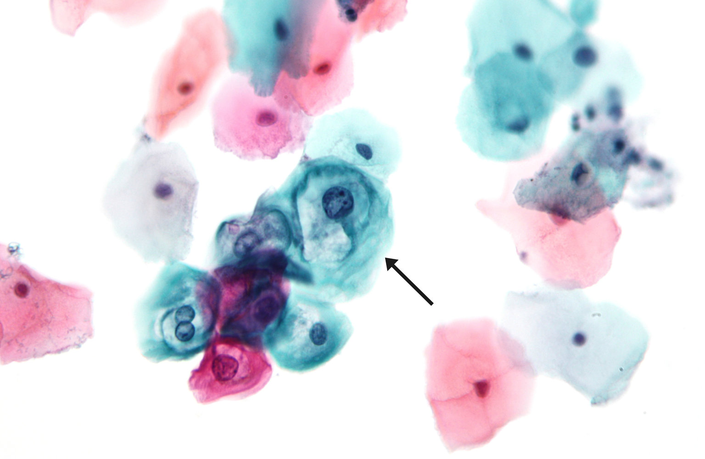

# Human papillomavirus infection

*Categories: Clinical knowledge > Obstetrics/gynecology > Gynecological infectious diseases > Human papillomavirus infection*

[Original Article Link](https://coursology-qbank.com/amboss/article/zO0rET)

---

## Summary

The <u>human papillomavirus</u> (<u>HPV</u>) is a <u>nonenveloped DNA virus</u> that infects the cutaneous and <u>mucosal</u> <u>epithelium</u>. There are more than 200 known types of <u>HPV</u>. Transmission usually occurs through direct contact (e.g., sexual or nonsexual contact between <u>skin</u> and/or <u>mucosal</u> surfaces). <u>Vertical transmission</u> is uncommon. Most <u>HPV</u> infections are asymptomatic. Clinical manifestations depend on the <u>HPV</u> type and include <u>cutaneous warts</u>, <u>anogenital warts</u>, and <u>laryngeal papillomas</u>. Infection with high-risk <u>mucosal</u> types can cause <u>HPV-related cancers</u>, e.g., <u>cervical cancer</u>, <u>anal cancer</u>, and <u>oropharyngeal cancers</u>. Diagnosis of <u>HPV</u> infection is based on disease manifestation and ranges from <u>clinical diagnoses</u> (e.g., <u>cutaneous warts</u>) to <u>HPV testing</u> (e.g., in patients with abnormalities detected on <u>cervical cancer screening</u>). Most <u>HPV</u> infections in immunocompetent individuals resolve spontaneously within 2 years. Management is based on clinical manifestations, and options include observation, topical pharmacotherapy, <u>cryotherapy</u>, laser therapy, and surgical excision. The <u>HPV vaccine</u> is the most effective preventive measure against <u>anogenital warts</u> and <u>HPV-related cancers</u> and is indicated for all individuals between 11 and 12 years of age, ideally before the first sexual intercourse. In individuals with <u>cutaneous warts</u>, minimizing <u>skin</u>-to-<u>skin</u> transmission can help prevent <u>autoinoculation</u> and transmission of infection to others. Recurrence of <u>HPV</u> infections is common.

Specific <u>HPV-related diseases</u> (e.g., <u>cutaneous warts</u>, <u>anogenital warts</u>, <u>cervical cancer</u>) are detailed separately.

---

## Etiology

### Human papillomavirus [[1]](https://coursology-qbank.com/amboss/article/thdXfp0)[[2]](https://coursology-qbank.com/amboss/article/d3dohp0)

* Double-stranded, circular, <u>nonenveloped DNA virus</u> with an icosahedral <u>capsid</u>

* There are > 200 known types of <u>HPV</u>; some infect the cutaneous <u>epithelium</u> and others infect the <u>mucosal</u> <u>epithelium</u>.

* Routes of transmission include: [[3]](https://coursology-qbank.com/amboss/article/JhdsUp0)[[4]](https://coursology-qbank.com/amboss/article/b-WHDL0)

* Direct contact (e.g., <u>sexual activity</u>, <u>autoinoculation</u>)

* <u>Fomites</u> [[5]](https://coursology-qbank.com/amboss/article/RPWlel0)

* <u>Vertical transmission</u> (rare)

> [!TIP]
> Genital <u>HPV</u> infection is the most common <u>sexually transmitted infection</u>. [[1]](https://coursology-qbank.com/amboss/article/thdXfp0)

### Risk factors for HPV infection [[3]](https://coursology-qbank.com/amboss/article/JhdsUp0)

* Damaged <u>skin</u>/<u>mucous membranes</u> (e.g., <u>maceration</u>, trauma) [[6]](https://coursology-qbank.com/amboss/article/lPWvUl0)[[7]](https://coursology-qbank.com/amboss/article/Bedza60)

* <u>Immunodeficiency</u> (e.g., due to <u>HIV infection</u>, <u>chemotherapy</u>)

* Additional <u>risk factors</u> for genital/<u>mucosal</u> <u>HPV</u> infections include:

* Unprotected sex

* Higher number of lifetime sexual partners

* Early age at first <u>sexual activity</u>

* Lack of <u>circumcision</u> in male individuals [[1]](https://coursology-qbank.com/amboss/article/thdXfp0)

* History of other <u>sexually transmitted infections</u>

---

## Pathophysiology

* <u>HPV</u> expresses the following oncoproteins

* E6 → inhibition of <u>p53 protein</u> → inhibition of the <u>intrinsic apoptotic pathway</u> and inhibition of <u>p21</u> protein

* E7

* Inhibition of <u>retinoblastoma protein</u> (<u>pRb</u>) → increased activity of <u>E2F</u>-family of <u>transcription factors</u>

* Inhibits <u>p21</u> and <u>p27</u> (<u>CDK inhibitors</u>) → increased activity of <u>cyclin-dependent kinase</u>

> [!NOTE]
> 6 comes before 7 and P comes before R: <u>E6</u> inhibits <u>P53</u> and <u>E7</u> inhibits <u>pRb</u>

---

## Overview of HPV-associated diseases

* Most <u>HPV</u> infections are asymptomatic. [[1]](https://coursology-qbank.com/amboss/article/thdXfp0)

* <u>HPV</u> infection can cause various diseases depending on specific <u>HPV</u> type and site of infection. [[3]](https://coursology-qbank.com/amboss/article/JhdsUp0)

|  <u>HPV</u> types and associated diseases [[1]](https://coursology-qbank.com/amboss/article/thdXfp0)  |  |  |  |  |
| --- | --- | --- | --- | --- |
|  |  |  | Example <u>HPV</u> types | Associated diseases |
|  Cutaneous HPV types [[1]](https://coursology-qbank.com/amboss/article/thdXfp0)[[5]](https://coursology-qbank.com/amboss/article/RPWlel0)  |  |  |  * <u>HPV</u> 1–5, 7, 10, 27–29, 57   |  * <u>Cutaneous warts</u>, e.g.:  * <u>Common warts</u>  * <u>Flat warts</u>  * <u>Plantar warts</u>   |
|  Mucosal HPV types  |  |  High-risk HPV types [[1]](https://coursology-qbank.com/amboss/article/thdXfp0)[[2]](https://coursology-qbank.com/amboss/article/d3dohp0)  |  * <u>HPV</u> 16, 18, 31, 33, 35, 39, 45, 51, 52, 56, 58, 59, 66, 68   |   * HPV-related cancers  * <u>Cervical cancer</u>  * <u>Vulvar cancer</u>  * <u>Vaginal cancer</u>  * <u>Carcinoma of the penis</u>  * <u>Anal cancer</u>  * <u>Oropharyngeal cancer</u>  * Squamous intraepithelial lesion (SIL): low-grade (<u>LSIL</u>) or high-grade (<u>HSIL</u>) [[8]](https://coursology-qbank.com/amboss/article/8W1OMf0)  * <u>Cervical intraepithelial neoplasia</u> (<u>CIN</u>)  * <u>Vulvar intraepithelial neoplasia</u>  * <u>Vaginal intraepithelial neoplasia</u>  * <u>Penile intraepithelial neoplasia</u>  * <u>Perianal intraepithelial neoplasia</u>  * <u>Anal intraepithelial neoplasia</u>    |
|  Low-risk <u>HPV</u> types [[2]](https://coursology-qbank.com/amboss/article/d3dohp0)[[4]](https://coursology-qbank.com/amboss/article/b-WHDL0)  |  * <u>HPV</u> 6 and 11   |   * <u>Anogenital warts</u> (<u>condylomata acuminata</u>)  * Papillomas or <u>warts</u> of nongenital <u>mucosal</u> membranes (e.g., <u>laryngeal papillomas</u>, <u>conjunctival</u> papillomas, oral <u>warts</u>)  * <u>CIN</u> [[9]](https://coursology-qbank.com/amboss/article/BdXzHC)    |  |  |

> [!NOTE]
> <u>HPV</u> types 1, 2, and 4 are commonly associated with <u>cutaneous warts</u>. <u>HPV</u> types 6 and 11 are commonly associated with <u>anogenital warts</u>. [[1]](https://coursology-qbank.com/amboss/article/thdXfp0)[[2]](https://coursology-qbank.com/amboss/article/d3dohp0)[[5]](https://coursology-qbank.com/amboss/article/RPWlel0)

> [!TIP]
> Most <u>HPV</u> infections are asymptomatic and resolve spontaneously. Persistent infection with a <u>high-risk HPV</u> type (especially <u>HPV</u> types 16 and 18) is associated with an increased risk of <u>HPV-related cancers</u>, most of which are <u>squamous cell cancers</u>. [[1]](https://coursology-qbank.com/amboss/article/thdXfp0)[[2]](https://coursology-qbank.com/amboss/article/d3dohp0)[[3]](https://coursology-qbank.com/amboss/article/JhdsUp0)

---

## Pathology

* <u>Epidermal</u> <u>hyperplasia</u> and <u>hyperkeratosis</u>

* Koilocytes  

* <u>Pathognomonic</u> of an infection with <u>HPV</u>

* <u>Dysplastic</u> squamous cells characterized by well-defined, clear, balloon-like, perinuclear halo and hyperchromasia

* Papillomatosis (i.e., elongated rete ridges  of the <u>epidermis</u> that point towards the center of the <u>wart</u>)

Pap smear showing low-grade dysplasia

---

## Prevention

### <u>Risk factor</u> modification

* Advise patients to minimize <u>skin</u>-to-<u>skin</u> transmission of <u>HPV</u> (e.g., by avoiding direct contact with <u>warts</u>). [[11]](https://coursology-qbank.com/amboss/article/HPWKTl0)

* Use appropriate footwear in public areas (e.g., locker rooms, public showers).

* Keep <u>skin</u> clean and dry.

* Counsel patients on safe sex practices to minimize sexual transmission of <u>HPV</u>. [[3]](https://coursology-qbank.com/amboss/article/JhdsUp0)[[10]](https://coursology-qbank.com/amboss/article/2NcT010)[[12]](https://coursology-qbank.com/amboss/article/l3dvip0)

* Delay initiation of <u>sexual activity</u>.

* Limit number of sex partners.

* Use <u>barrier contraception</u> consistently. [[13]](https://coursology-qbank.com/amboss/article/G4WBkl0)

* Counsel patients on <u>smoking cessation</u> and minimizing <u>alcohol</u> consumption.  [[3]](https://coursology-qbank.com/amboss/article/JhdsUp0)[[10]](https://coursology-qbank.com/amboss/article/2NcT010)

> [!TIP]
> <u>Barrier contraception</u> does not provide complete protection from <u>HPV</u> infection, as uncovered areas such as the <u>anus</u>, <u>vulva</u>, and <u>scrotum</u> may still transmit infection. [[10]](https://coursology-qbank.com/amboss/article/2NcT010)[[13]](https://coursology-qbank.com/amboss/article/G4WBkl0)

> [!TIP]
> Infection with one <u>HPV</u> type does not protect against infection with another type. Simultaneous or consecutive infection with multiple <u>HPV</u> types is possible. [[1]](https://coursology-qbank.com/amboss/article/thdXfp0)

### <u>Vaccination</u> [[10]](https://coursology-qbank.com/amboss/article/2NcT010)[[12]](https://coursology-qbank.com/amboss/article/l3dvip0)[[14]](https://coursology-qbank.com/amboss/article/Y9YnNr)[[15]](https://coursology-qbank.com/amboss/article/T3d63p0)

* <u>HPV vaccine</u>: The human papillomavirus 9-valent vaccine protects against <u>HPV</u> types 6, 11, 16, 18, 31, 33, 45, 52, and 58, which cause <u>anogenital warts</u> and <u>HPV-related cancers</u>.  [[3]](https://coursology-qbank.com/amboss/article/JhdsUp0)[[14]](https://coursology-qbank.com/amboss/article/Y9YnNr)[[16]](https://coursology-qbank.com/amboss/article/UUWbck0)

* <u>Vaccine</u> schedule [[14]](https://coursology-qbank.com/amboss/article/Y9YnNr)[[17]](https://coursology-qbank.com/amboss/article/LWWwN40)[[18]](https://coursology-qbank.com/amboss/article/pWWLm40)[[19]](https://coursology-qbank.com/amboss/article/4u13ri0)

* <u>Routine immunization</u>

* All individuals between 11 and 12 years of age, preferably before first sexual intercourse

* Minimum age for the first dose: 9 years

* See “<u>ACIP immunization schedule</u>” for dosing, <u>catch-up immunization</u>, and recommendations for special patient groups (e.g., <u>immunocompromised individuals</u>).

* Contraindications

* <u>Pregnancy</u> (<u>pregnancy testing</u> is not required before <u>vaccination</u>)  [[10]](https://coursology-qbank.com/amboss/article/2NcT010)[[12]](https://coursology-qbank.com/amboss/article/l3dvip0)[[20]](https://coursology-qbank.com/amboss/article/N3d-ip0)

* Severe <u>allergic reaction</u> (e.g., <u>anaphylaxis</u>) following a previous <u>HPV vaccine</u> dose

ACIP routine immunization schedule: children and adolescents ≤ 18 years of age

ACIP catch-up immunization schedule: children and adolescents ≤ 18 years of age

> [!TIP]
> The <u>HPV vaccine</u> protects against <u>HPV</u> infection and associated conditions (e.g., <u>anogenital warts</u> and <u>HPV-related cancers</u>). [[13]](https://coursology-qbank.com/amboss/article/G4WBkl0)[[21]](https://coursology-qbank.com/amboss/article/uVWpw40)

> [!TIP]
> Offer <u>vaccination</u> to all eligible patients, regardless of <u>sexual orientation</u> or practices and including those already exposed to <u>HPV</u> through sexual contact. [[1]](https://coursology-qbank.com/amboss/article/thdXfp0)[[22]](https://coursology-qbank.com/amboss/article/p4dL4J0)

---