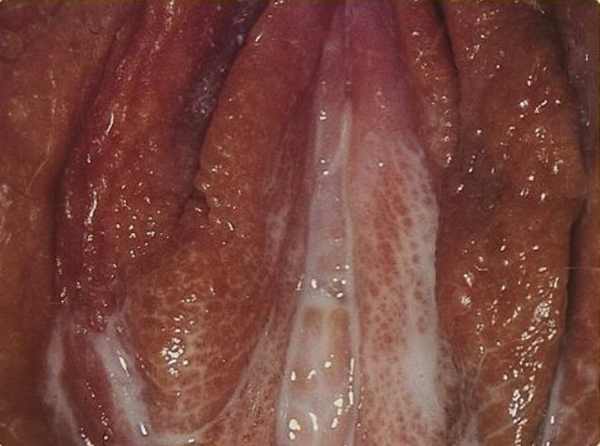
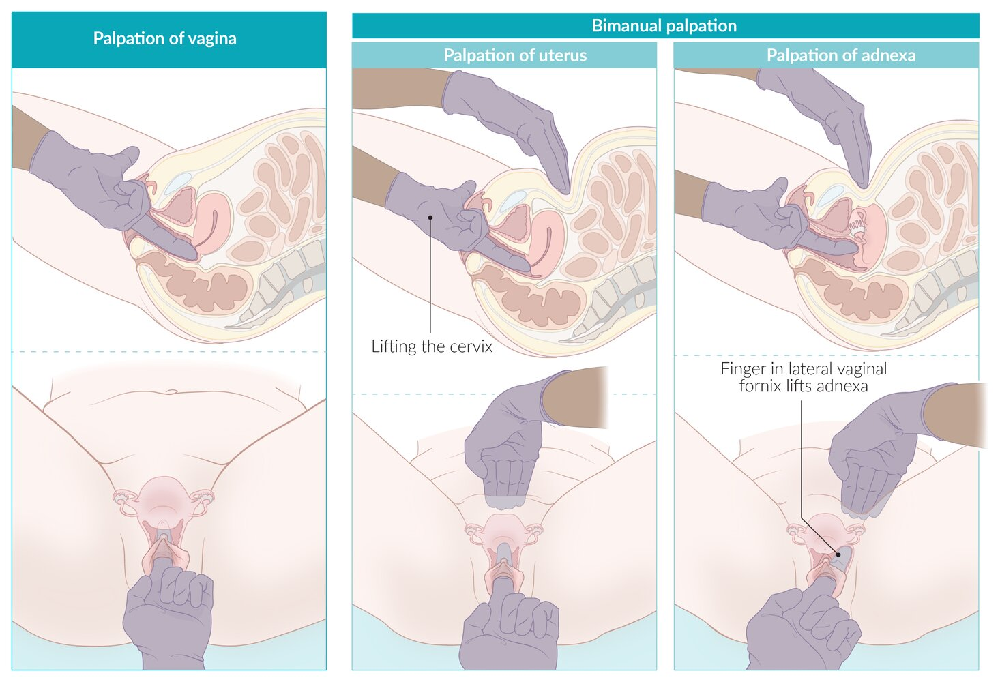
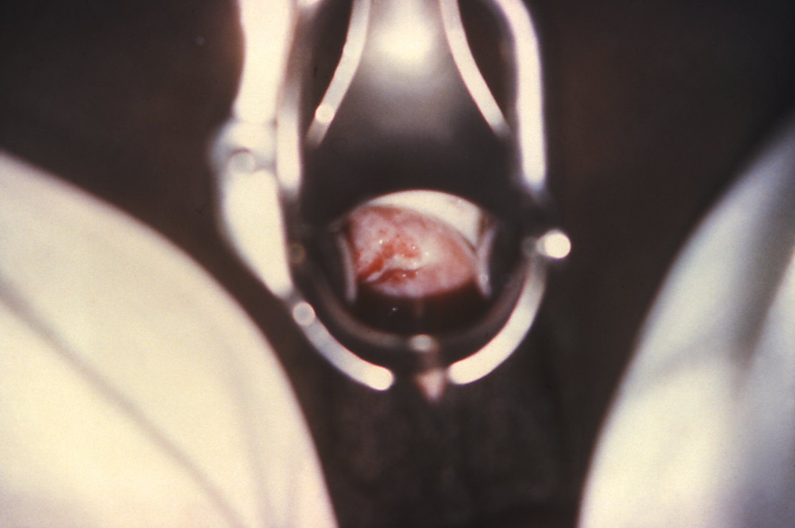
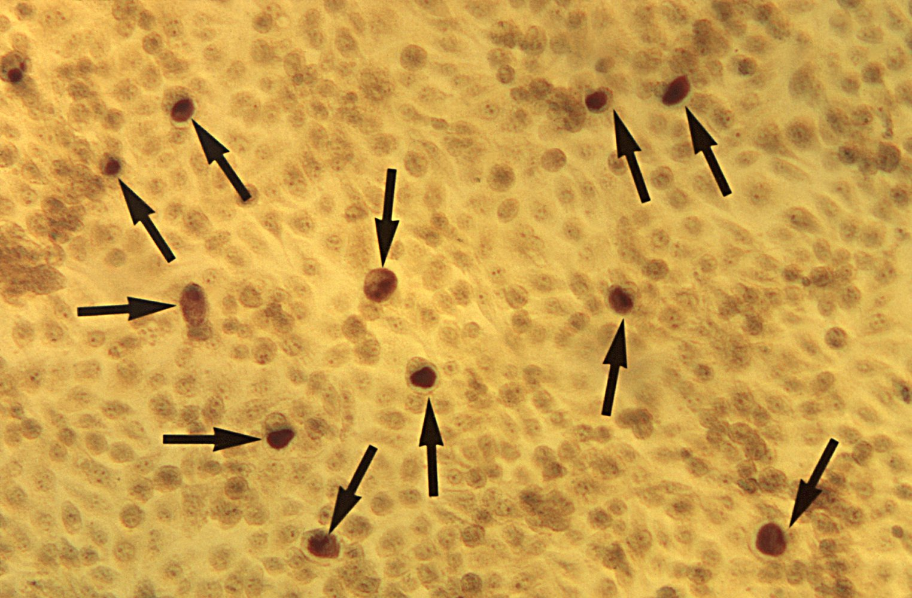
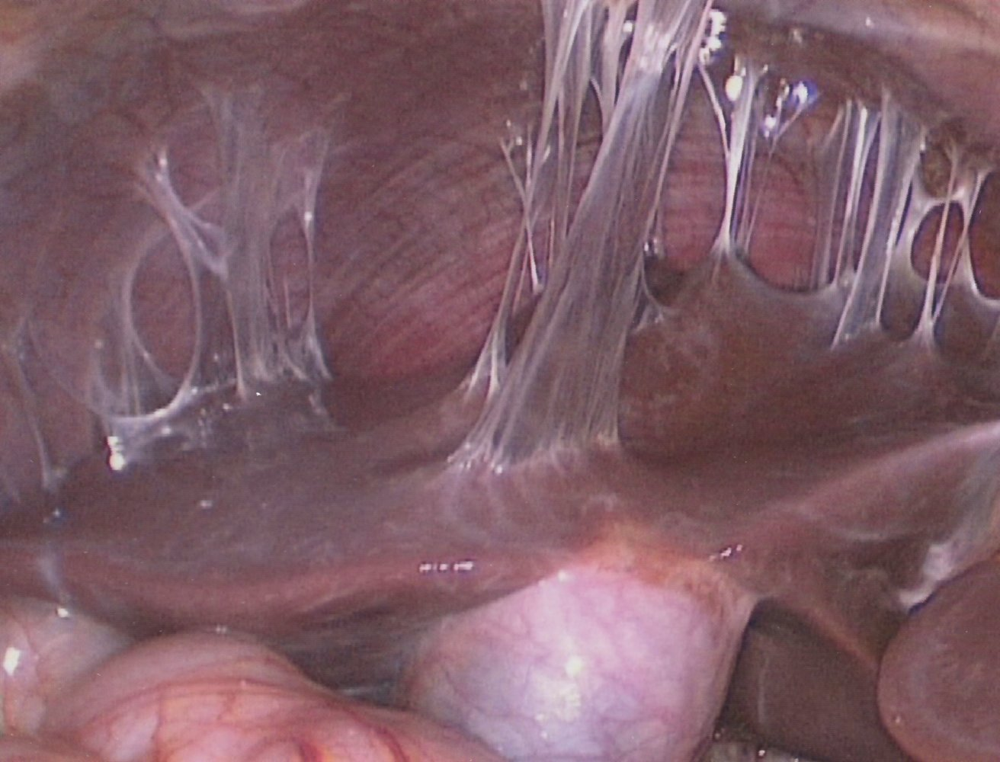

# Pelvic inflammatory disease

*Categories: Clinical knowledge > Obstetrics/gynecology > Gynecological infectious diseases > Pelvic inflammatory disease*

[Original Article Link](https://coursology-qbank.com/amboss/article/pL0LAg)

---

## Summary

<u>Pelvic</u> inflammatory disease (PID) is caused by a bacterial infection that spreads beyond the <u>cervix</u> to infect the upper <u>female reproductive tract</u>, i.e., the <u>uterus</u> (<u>endometritis</u>), <u>fallopian tubes</u> (<u>salpingitis</u>), and/or <u>ovaries</u> (<u>oophoritis</u>). It can also spread to surrounding <u>pelvic</u> structures (<u>parametritis</u>) and/or <u>pelvic</u> <u>peritoneum</u> (<u>peritonitis</u>). The most common pathogens that cause PID are <u>Chlamydia trachomatis</u> and <u>Neisseria gonorrhoeae</u>. Patients may be asymptomatic, have mild <u>pelvic pain</u> with <u>vaginal discharge</u>, or present with signs of systemic inflammation, including <u>fever</u> and severe abdominal <u>pain</u>. PID is a <u>clinical diagnosis</u>; asymptomatic patients might only be diagnosed retrospectively during a workup for complications such as <u>infertility</u>. Initial diagnostic studies include evaluation for <u>STIs</u> and <u>pregnancy</u>. Atypical or severe presentations and/or suspected complications may be confirmed with imaging and, in rare cases, <u>laparoscopy</u>. <u>Empiric antibiotic therapy</u> that covers both <u>Chlamydia trachomatis</u> and <u>Neisseria gonorrhoeae</u> is indicated when the minimum criteria for PID are met, even if no specific infectious cause is identified. PID can cause scarring that may lead to long-term complications, including <u>infertility</u>, <u>ectopic pregnancy</u>, and chronic <u>pelvic pain</u>.

---

## Definitions

* A bacterial infection that spreads beyond the <u>cervix</u> to infect the upper <u>female reproductive tract</u>, i.e., the:

* <u>Endometrium</u> (<u>endometritis</u>; see also “<u>Postpartum endometritis</u>”)

* <u>Fallopian tubes</u> (<u>salpingitis</u>, <u>pyosalpinx</u>, <u>tubo-ovarian abscess</u>)

* <u>Ovaries</u> (<u>oophoritis</u>, <u>tubo-ovarian abscess</u>)

* Surrounding <u>pelvic</u> structures (<u>parametritis</u>)

* <u>Pelvic</u> <u>peritoneum</u> (<u>peritonitis</u>)

---

## Epidemiology

* Lifetime <u>prevalence</u>: ∼ 4.5% in women of reproductive age (18–44 years) [[1]](https://coursology-qbank.com/amboss/article/jma_2O)

* > 1 million women experience an episode of PID/year. [[2]](https://coursology-qbank.com/amboss/article/QAbujw)

* PID is one of the most common <u>causes of infertility</u>. [[1]](https://coursology-qbank.com/amboss/article/jma_2O)

Epidemiological data refers to the US, unless otherwise specified.

---

## Etiology

* Pathogens [[3]](https://coursology-qbank.com/amboss/article/fEakEm)[[4]](https://coursology-qbank.com/amboss/article/OmaIfO)

* Most common: <u>Chlamydia trachomatis</u>, <u>Neisseria gonorrhoeae</u>

* Less common (consider <u>coinfections</u>): <u>E. coli</u>, <u>Ureaplasma</u>, <u>Mycoplasma</u>, and other <u>anaerobes</u>

* <u>Risk factors</u> [[4]](https://coursology-qbank.com/amboss/article/OmaIfO)

* Multiple sexual partners, unprotected sex

* History of prior <u>STIs</u> and/or adnexitis

* <u>Intrauterine devices</u>  [[3]](https://coursology-qbank.com/amboss/article/fEakEm)

* Vaginal dysbiosis  [[5]](https://coursology-qbank.com/amboss/article/PAbWPw)

> [!TIP]
> The risk of PID is lower during <u>pregnancy</u>; when it does develop, it usually occurs within the <u>first trimester</u> and increases the risk of maternal <u>morbidity</u> and <u>preterm births</u>. [[6]](https://coursology-qbank.com/amboss/article/paYLln)

---

## Clinical features

* Lower abdominal <u>pain</u> (generally bilateral), which may progress to <u>acute abdomen</u> [[7]](https://coursology-qbank.com/amboss/article/lmavfO)

* <u>Nausea</u>, <u>vomiting</u>

* <u>Fever</u>

* <u>Dysuria</u>, <u>urinary urgency</u>

* <u>Menorrhagia</u>, <u>metrorrhagia</u>

* <u>Dyspareunia</u>

* Abnormal <u>vaginal discharge</u> (yellow/green color)

Vaginal discharge in gonococcal infection

---

## Subtypes and variants

### Pelvic cellulitis (<u>parametritis</u>) [[8]](https://coursology-qbank.com/amboss/article/Xmc9V10)

* Definition: acute or <u>chronic inflammation</u> of the <u>parametrium</u>

* Clinical features

* <u>Fever</u>

* Dull abdominal <u>pain</u> or the sensation of <u>pelvic</u> fullness

* Absence of gastrointestinal and/or urinary signs, masses, or <u>peritoneal signs</u>

* Diagnosis

* <u>Medical history</u>: recent gynecological <u>surgery</u> or procedure, infections (e.g., <u>cervicitis</u>, <u>endometritis</u>)

* <u>Ultrasound</u>: <u>hyperemic</u>, <u>edematous</u> tissue surrounding the <u>uterus</u>

* Treatment: <u>antibiotics</u> (See “<u>Treatment of PID</u>.”)

### Tubo-ovarian abscess [[9]](https://coursology-qbank.com/amboss/article/2NcT010)[[10]](https://coursology-qbank.com/amboss/article/ZBcZze0)[[11]](https://coursology-qbank.com/amboss/article/NJY-8J)

* Definition: an infectious inflammatory mass of the <u>fallopian tubes</u> and/or <u>ovary</u> that may spread to adjacent organs (e.g., <u>bladder</u>, bowel)

* Clinical features include the following (see “<u>Clinical features of PID</u>”):

* <u>Fever</u>

* Lower abdominal <u>pain</u>

* <u>Vaginal discharge</u>

* <u>Leukocytosis</u>

* Diagnostics

* See “<u>Diagnostics for PID</u>.”

* Imaging (most commonly <u>ultrasound</u>) is required to confirm the diagnosis.

* Treatment

* See “<u>Treatment of PID</u>.”

* Admit patient for at least 24 hours for IV <u>empiric antibiotic therapy for PID</u>.

* Transition clinically improved patients to oral <u>empiric antibiotic therapy for PID</u> with:

* <u>Doxycycline</u>

* PLUS either <u>metronidazole</u> OR <u>clindamycin</u>

* Obtain consultation for drainage (surgical or <u>image-guided percutaneous drainage</u>) for any of the following indications:

* <u>Abscess</u> is > 3 cm [[12]](https://coursology-qbank.com/amboss/article/G9WBKn0)

* Patient is <u>postmenopausal</u>  [[11]](https://coursology-qbank.com/amboss/article/NJY-8J)

* There is lack of improvement after 24–48 hours of <u>antibiotics</u> [[10]](https://coursology-qbank.com/amboss/article/ZBcZze0)

---

## Diagnosis

### Approach [[9]](https://coursology-qbank.com/amboss/article/2NcT010)[[13]](https://coursology-qbank.com/amboss/article/mxcVCe0)

PID is a <u>clinical diagnosis</u>.

* Determine if diagnostic criteria are met with an <u>initial evaluation for PID</u> that includes:

* <u>Speculum examination</u>

* <u>Bimanual pelvic examination</u>

* <u>STI testing</u>

* <u>Pregnancy testing</u>

* Pursue <u>additional evaluation for PID</u> (e.g., imaging, invasive diagnostics) only if:

* The diagnosis remains unclear

* OR symptoms persist after treatment

> [!TIP]
> Maintain a low threshold for assessing for PID in young, sexually active women with lower abdominal <u>pain</u>.

> [!TIP]
> PID may be overlooked in asymptomatic or mild infections and is therefore sometimes diagnosed retrospectively (e.g., during an evaluation for <u>tubal infertility</u>).

Bimanual pelvic examination

### Diagnostic criteria [[9]](https://coursology-qbank.com/amboss/article/2NcT010)

|  Diagnostic criteria for PID [[9]](https://coursology-qbank.com/amboss/article/2NcT010)  |  |
| --- | --- |
|  | Findings |
| Minimum criteria for PID |  * Any of the following in a sexually active female individual with <u>pelvic pain</u> or lower abdominal <u>pain</u> (in the absence of an alternative cause; see “Differential diagnoses”):  * Cervical motion tenderness: severe <u>pain</u> elicited by manipulation or movement of the <u>cervix</u>  * Uterine tenderness  * Adnexal tenderness   |
|  Supportive criteria for PID  |  * Any of the following additional criteria:  * Oral temperature > 38.3°C (> 101°F)  * Mucopurulent cervical discharge  * <u>Cervical friability</u>  * Abundant <u>WBCs</u> on microscopy of vaginal secretions  * Elevated <u>ESR</u> and/or <u>CRP</u>  * Confirmed cervical infection with <u>N. gonorrhoeae</u> or <u>C. trachomatis</u>   |

> [!TIP]
> Consider alternative diagnoses in patients with no mucopurulent cervical discharge and no <u>leukorrhea</u>. [[9]](https://coursology-qbank.com/amboss/article/2NcT010)

Cervical discharge in gonorrhea (speculum view)

### Initial evaluation for PID [[9]](https://coursology-qbank.com/amboss/article/2NcT010)[[13]](https://coursology-qbank.com/amboss/article/mxcVCe0)

#### <u>Gynecological exam</u>

* <u>Speculum examination</u> to evaluate for:

* Mucopurulent cervical discharge

* <u>Cervical friability</u>

* <u>Bimanual pelvic examination</u> ;  to evaluate for:

* <u>Cervical motion tenderness</u>, uterine or adnexal tenderness

* <u>Tubo-ovarian abscess</u> or mass

Bimanual pelvic examination

#### <u>Laboratory studies</u>

* Vaginal and/or cervical swab testing

* <u>NAAT</u> and/or culture for <u>N. gonorrhoeae</u> and <u>C. trachomatis</u> (see “<u>Diagnostics of gonorrhea</u>” and “<u>Chlamydia infections</u>”)

* <u>Wet mount preparation</u> to evaluate for:

* <u>WBCs</u> (<u>leukorrhea</u>)

* <u>Trichomoniasis</u>

* <u>Bacterial vaginosis</u>

* <u>Pregnancy test</u>: to rule out intrauterine and <u>ectopic pregnancy</u>

* Blood tests

* <u>HIV</u> testing, <u>RPR</u> for <u>syphilis</u>

* Infection markers (nonspecific for PID) [[14]](https://coursology-qbank.com/amboss/article/3ycSUU0)

* <u>Leukocytosis</u> on <u>CBC</u>

* Elevated <u>ESR</u> and/or <u>CRP</u>

> [!TIP]
> PID is unlikely if <u>WBCs</u> are not detected on microscopic examination of cervical discharge. [[9]](https://coursology-qbank.com/amboss/article/2NcT010)

> [!NOTE]
> A <u>Giemsa stain</u> of discharge typically shows <u>cytoplasmic</u> <u>inclusions</u> in <u>C. trachomatis</u> infection, but not in <u>N. gonorrhoeae</u> infection.

Chlamydia trachomatis in McCoy cell culture

### Additional evaluation for PID [[9]](https://coursology-qbank.com/amboss/article/2NcT010)[[13]](https://coursology-qbank.com/amboss/article/mxcVCe0)[[14]](https://coursology-qbank.com/amboss/article/3ycSUU0)

#### Indications

* Unclear diagnosis or concern for alternative diagnosis (e.g., <u>ectopic pregnancy</u>, <u>tubo-ovarian abscess</u>, <u>ovarian torsion</u>)  [[14]](https://coursology-qbank.com/amboss/article/3ycSUU0)

* Severe illness, e.g., <u>nausea</u>, <u>vomiting</u>, <u>fever</u> > 38.5°C (> 101.3°F)

* Lack of improvement   within 72 hours of <u>treatment for PID</u>

#### Imaging

* Modalities [[15]](https://coursology-qbank.com/amboss/article/EBW8cL0)

* <u>Transvaginal ultrasound</u>: preferred initial study if tubo-ovarian pathology or <u>pregnancy</u> is suspected

* CT or <u>MRI</u> abdomen/<u>pelvis</u>

* Findings suggestive of PID

* Free <u>pelvic</u> fluid

* Thickened fluid-filled <u>fallopian tubes</u>, due to <u>salpingitis</u>  [[9]](https://coursology-qbank.com/amboss/article/2NcT010)[[16]](https://coursology-qbank.com/amboss/article/0yWedL0)

* Complications of <u>salpingitis</u>, e.g.:

* Pyosalpinx: the accumulation of <u>pus</u> in the <u>fallopian tubes</u> [[17]](https://coursology-qbank.com/amboss/article/dyWoVL0)

* <u>Tubo-ovarian abscess</u>

* <u>Perihepatitis</u>

> [!TIP]
> Imaging is not routinely indicated but can help confirm the diagnosis of PID, especially in ambiguous cases. [[9]](https://coursology-qbank.com/amboss/article/2NcT010)

#### Invasive diagnostics

These methods can definitively confirm a diagnosis of PID, but are rarely used.

* <u>Diagnostic laparoscopy</u>

* May show signs of moderate to severe <u>salpingitis</u> (tubal <u>edema</u>, <u>erythema</u>, and <u>purulent</u> <u>exudate</u>) , <u>oophoritis</u>, <u>perihepatitis</u>, or <u>tubo-ovarian abscess</u>

* Cannot be used to diagnose <u>endometritis</u>

* <u>Endometrial biopsy</u>

* May be performed transcervically as an isolated procedure or as part of a <u>laparoscopy</u>  [[1]](https://coursology-qbank.com/amboss/article/jma_2O)[[9]](https://coursology-qbank.com/amboss/article/2NcT010)

* Used to diagnose <u>endometritis</u>

---

## Differential diagnoses

* <u>Ectopic pregnancy</u>

* <u>Ovarian cyst rupture</u>

* <u>Ovarian torsion</u>

* <u>Dysmenorrhea</u>

* <u>Mittelschmerz</u>

* <u>Urinary tract infection</u>

* <u>Appendicitis</u>

* <u>Renal colic</u>

* See also: “<u>Causes of pelvic pain</u>”

The differential diagnoses listed here are not exhaustive.

---

## Treatment

### Approach [[9]](https://coursology-qbank.com/amboss/article/2NcT010)[[13]](https://coursology-qbank.com/amboss/article/mxcVCe0)

* Screen for <u>signs of sepsis</u>; if present, initiate immediate <u>management of sepsis</u>.

* Admit for inpatient management if any of the following indications are present:

* Concern for surgical emergency (e.g., <u>differential diagnosis of acute abdomen</u>)

* <u>Tubo-ovarian abscess</u>

* Severe illness with <u>nausea</u>, <u>vomiting</u>, <u>fever</u> > 38.5°C (101°F), and/or an unwell appearance

* <u>Pregnancy</u>

* Unable to tolerate or adhere to an oral regimen

* Initiate prompt <u>empiric antibiotic therapy for PID</u>.

* Reassess treatment response in 48–72 hours.

* Improvement : Complete a full treatment course.

* Inadequate improvement:

* Admit (if not already admitted) for IV <u>antibiotics</u>.

* Consider alternative diagnoses.

* Obtain <u>additional evaluation for PID</u>, including imaging and consideration of invasive diagnostics.

* Consider removal of <u>IUD</u>, if present.

* Obtain specialist consults in specific cases.

* <u>PID in pregnancy</u>: Consult infectious diseases.

* Tubo-ovarian <u>abscesses</u> with certain indications (see “Subtypes and variants”): Consult <u>surgery</u> and/or interventional radiology.

* Provide <u>further management of PID</u>, including partner screening and <u>expedited partner therapy</u>.

> [!WARNING]
> Start <u>antibiotic therapy</u> as soon as the diagnosis is suspected and complete treatment even if infectious testing comes back negative. Undertreating or missing PID can result in long-term <u>infertility</u>. [[9]](https://coursology-qbank.com/amboss/article/2NcT010)

> [!TIP]
> <u>IUDs</u> only substantially increase the risk of PID in the first 3 weeks after placement. Do not remove an <u>IUD</u> in a patient diagnosed with PID unless there is inadequate improvement after 48–72 hours. [[9]](https://coursology-qbank.com/amboss/article/2NcT010)

### Empiric antibiotic therapy for PID

#### Inpatient management [[9]](https://coursology-qbank.com/amboss/article/2NcT010)[[13]](https://coursology-qbank.com/amboss/article/mxcVCe0)

* Initiate prompt empiric parenteral <u>antibiotics</u>.  

* Preferred: <u>cephalosporin</u> (<u>cefotetan</u> or <u>cefoxitin</u>) plus <u>doxycycline</u>

* Add <u>metronidazole</u> if a <u>cephalosporin</u> other than <u>cefotetan</u> or <u>cefoxitin</u> is used.

* After 24–48 hours of improvement, switch to an appropriate oral <u>antibiotic</u> regimen prior to discharge (e.g., <u>doxycycline</u> plus <u>metronidazole</u>).

* Arrange prompt follow-up.

|  Inpatient <u>antibiotic therapy</u> for <u>pelvic</u> inflammatory disease [[9]](https://coursology-qbank.com/amboss/article/2NcT010)  |  |  |
| --- | --- | --- |
|  | Initial <u>antibiotics</u> | Transition to oral <u>antibiotics</u> |
| Preferred |  * <u>Doxycycline</u> DOSAGE PLUS one of the following:  * <u>Cefotetan</u> DOSAGE  * <u>Cefoxitin</u> DOSAGE  * <u>Ceftriaxone</u> DOSAGE PLUS <u>metronidazole</u>DOSAGE   |  * <u>Doxycycline</u> DOSAGE PLUS <u>metronidazole</u> DOSAGE   |
|  Alternatives (e.g., for patients allergic to <u>penicillin</u> and/or <u>cephalosporin</u>)  [[13]](https://coursology-qbank.com/amboss/article/mxcVCe0)  |  * <u>Ampicillin/sulbactam</u> DOSAGE PLUS <u>doxycycline</u> DOSAGE   |  |
|  * <u>Clindamycin</u> DOSAGE PLUS <u>gentamicin</u> DOSAGE   |   * Uncomplicated PID: <u>doxycycline</u> DOSAGE OR <u>clindamycin</u> DOSAGE  * PID with <u>tubo-ovarian abscess</u>: <u>Doxycycline</u> DOSAGE PLUS one of the following:  * <u>Clindamycin</u> DOSAGE  * <u>Metronidazole</u> DOSAGE    |  |

#### Outpatient management [[9]](https://coursology-qbank.com/amboss/article/2NcT010)

* If there are no indications for inpatient management, most patients can receive outpatient treatment with the following:

* A single dose of either of the following:

* IM <u>ceftriaxone</u> DOSAGE

* IM <u>cefoxitin</u>  DOSAGEPLUS oral <u>probenecid</u> DOSAGE

* Followed by 14 days of oral <u>doxycycline</u>  DOSAGE PLUS <u>metronidazole</u> DOSAGE

* Patients with <u>cephalosporin</u> <u>allergy</u>: Consult gynecology or infectious disease.

> [!WARNING]
> <u>Quinolones</u> are no longer recommended for first-line <u>treatment of PID</u> because of the emergence of <u>quinolone</u>-resistant <u>gonorrhea</u> strains. [[9]](https://coursology-qbank.com/amboss/article/2NcT010)

### Further management of PID [[9]](https://coursology-qbank.com/amboss/article/2NcT010)[[13]](https://coursology-qbank.com/amboss/article/mxcVCe0)

* Sexual partners of the patient within the 60 days prior to the onset of symptoms: Test and presumptively treat for <u>chlamydia</u> and <u>gonorrhea</u>.

* Instruct the patient not to engage in sexual intercourse until the patient and all sexual partners have completed treatment.

* Complete <u>STI screening</u> if not already performed.

* If positive for <u>C. trachomatis</u> or <u>N. gonorrhoeae</u>, repeat testing in 3 months.

* Provide patient education.

* <u>Counseling on safe sex practices</u>

* <u>Counseling on contraceptive options</u>

* Encourage regular <u>STI screening</u>.

---

## Complications

### Short-term complications

* <u>Sepsis</u>

* Fitz-Hugh-Curtis syndrome (<u>perihepatitis</u>)

* Inflammation of the <u>liver capsule</u>

* Characterized by violin-string-like adhesions extending from the <u>peritoneum</u> to the <u>liver</u>

Fitz-Hugh-Curtis syndrome (perihepatitis)

### Long-term complications [[14]](https://coursology-qbank.com/amboss/article/3ycSUU0)

* Pathophysiology: inflammation (e.g., <u>salpingitis</u>) → 

* Tubal scarring

* Adhesions of the <u>fallopian tubes</u> and <u>ovaries</u>

* Hydrosalpinx: the accumulation of fluid in the <u>fallopian tubes</u> [[17]](https://coursology-qbank.com/amboss/article/dyWoVL0)

* Manifestations

* <u>Tubal infertility</u> (related to loss of tubal ciliary function)

* <u>Ectopic pregnancy</u>

* Chronic <u>pelvic pain</u>

We list the most important complications. The selection is not exhaustive.

---