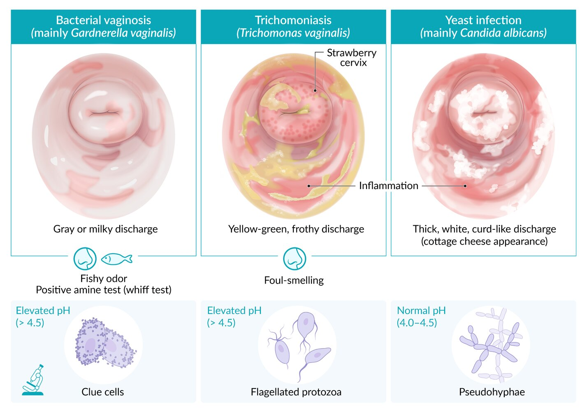
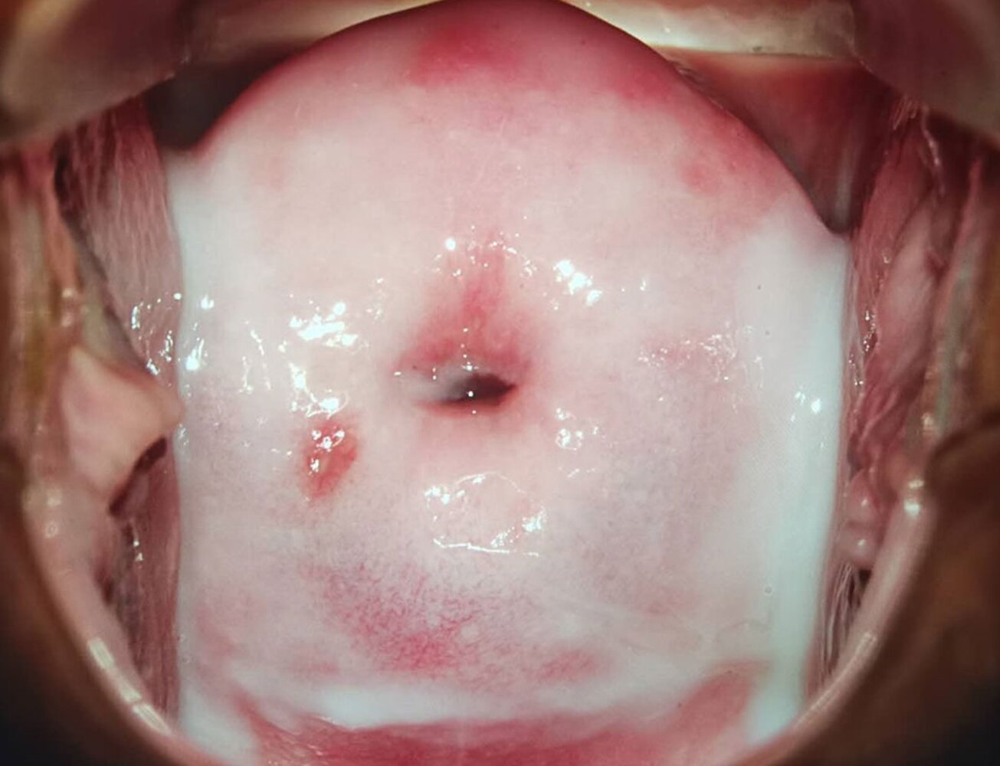
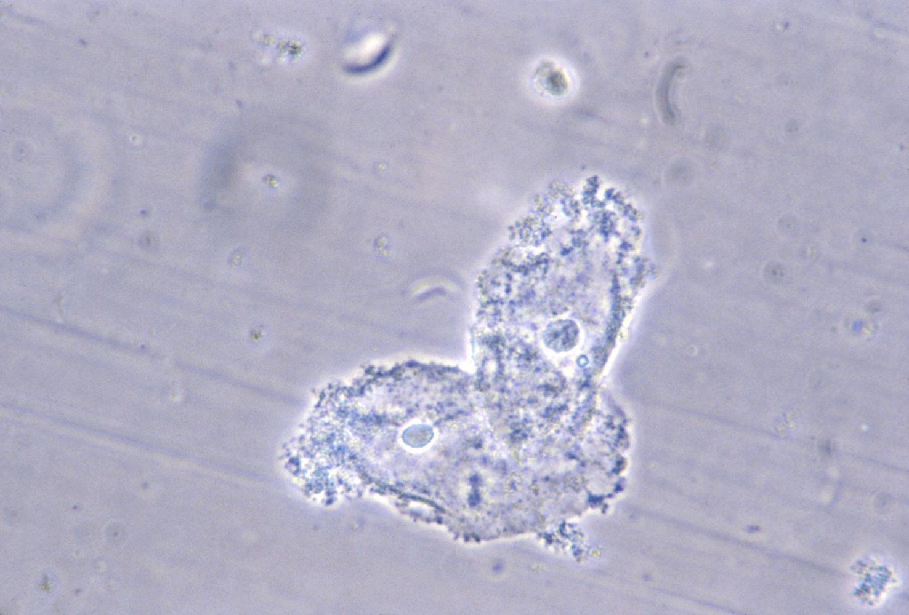
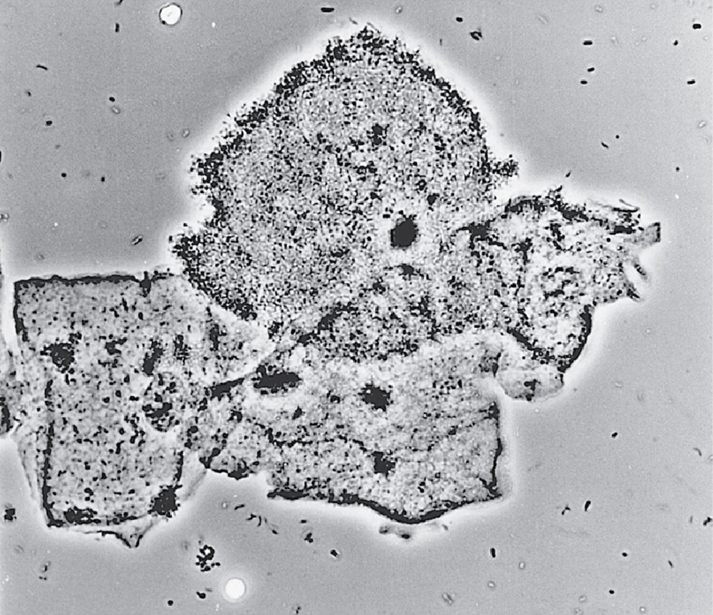
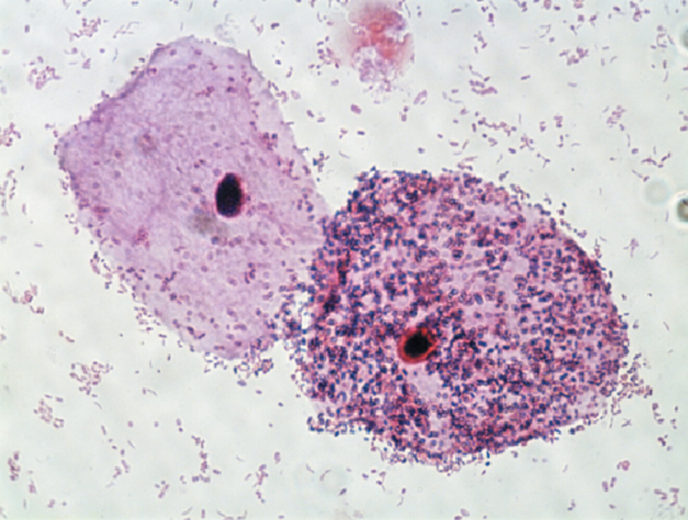
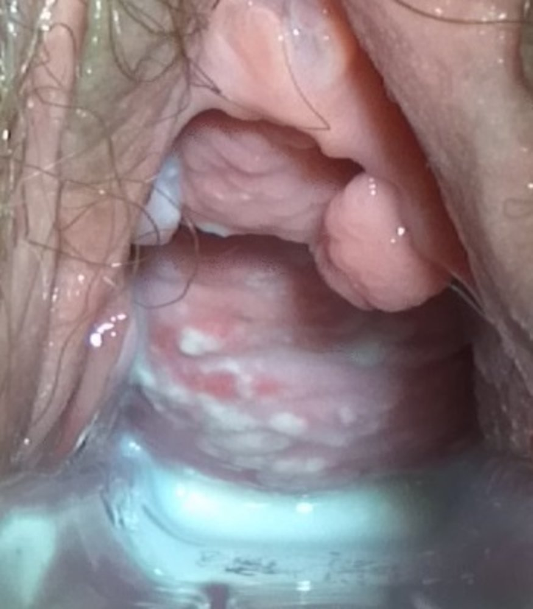
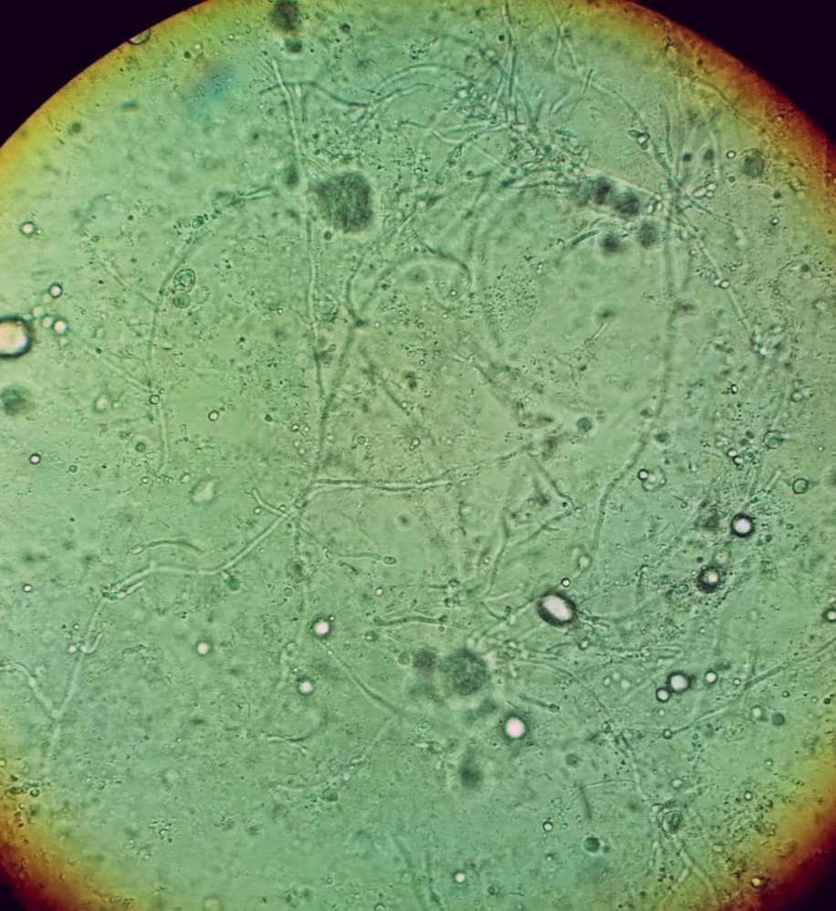
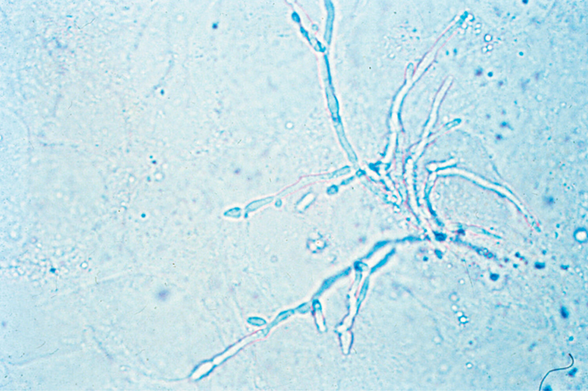

# Vulvovaginitis

*Categories: Clinical knowledge > Obstetrics/gynecology > Gynecological infectious diseases > Vulvovaginitis*

[Original Article Link](https://coursology-qbank.com/amboss/article/JL0sAg)

---

## Summary

Vulvovaginitis refers to a large variety of conditions that result in inflammation of the <u>vulva</u> and <u>vagina</u>. The causes may be infectious (e.g., <u>bacterial vaginosis</u> in most cases) or noninfectious. Physiologically, the <u>normal vaginal flora</u> (mainly lactobacilli) keeps the <u>pH</u> levels of the vaginal fluids low, thus preventing the overgrowth of pathogenic and opportunistic organisms. Disruption of that flora (e.g., due to sexual intercourse) predisposes to infection and inflammation. Diagnosis of <u>infectious vulvovaginitis</u> is based on <u>histology</u> examination of <u>vaginal discharge</u>. Treatment consists of administration of <u>antibiotics</u> or <u>antifungals</u> (depending on the <u>pathogen</u>).

For information on <u>vulvovaginal atrophy</u> caused by declining <u>estrogen</u> levels, see “<u>Menopause</u>.”

---

## Infectious vulvovaginitis

### Etiology [[1]](https://coursology-qbank.com/amboss/article/2NcT010)

* Common causes of <u>infectious vulvovaginitis</u>

* <u>Bacterial vaginosis</u>

* <u>Vulvovaginal candidiasis</u>

* <u>Trichomoniasis</u>

* <u>Aerobic vaginitis</u>

* Other causes of <u>infectious vulvovaginitis</u> (see respective articles for more information)

* <u>Enterobius vermicularis</u> (especially in prepubescent individuals)

* <u>Scabies</u> (seven-year itch)

* <u>Pediculosis pubis</u> (<u>crabs</u>, <u>pubic lice</u>)

### Differential diagnoses of infectious causes of vaginal discharge [[1]](https://coursology-qbank.com/amboss/article/2NcT010)

See the relevant articles and sections for details, including dosages.

| Overview |  |  |  |  |  |
| --- | --- | --- | --- | --- | --- |
| Features | <u>Bacterial vaginosis</u> | <u>Trichomoniasis</u> | <u>Vaginal yeast infection</u> | <u>Gonorrhea</u> | <u>Chlamydia infections</u> |
| <u>Pathogen</u> |  * Polymicrobial with overgrowth of species such as <u>Gardnerella vaginalis</u>   |  * <u>Trichomonas vaginalis</u>   |  * <u>Candida albicans</u>   |  * <u>Neisseria gonorrhoeae</u>   |  * <u>Chlamydia trachomatis</u> <u>serotype</u> D–K   |
| Discharge |   * Gray/milky  * Fishy odor    |   * Frothy, yellow-green  * Foul-smelling    |   * White, crumbly, and thick (cottage cheese-like)  * Odorless    |  * <u>Purulent</u>, creamy   |  * <u>Purulent</u>, bloody   |
|  * May be malodorous   |  |  |  |  |  |
|  Vaginal inflammation   |  * Typically absent   |  * Present   |  * Present   |  * Absent   |  |
| <u>Cervicitis</u> |  * Typically absent   |  * Often present   |  * Absent   |  * Present   |  |
| <u>Vaginal pH</u> |  * > 4.5   |  |  * 4–4.5   |  * Variable   |  |
| Microscopy findings |  * <u>Clue cells</u>   |  * Flagellated <u>protozoa</u>   |  * <u>Pseudohyphae</u>   |  * Gram-negative, intracellular <u>diplococci</u>   |  * Intracellular organisms that <u>Gram stain</u> poorly   |
| Treatment |  * <u>Metronidazole</u>   |   * <u>Metronidazole</u>  * Treat sexual partner(s)    |   * Topical <u>azoles</u>  * Oral <u>fluconazole</u> in nonpregnant adults    |   * <u>Ceftriaxone</u> IV/IM  * Treat sexual partner(s)    |   * <u>Azithromycin</u>  * <u>Doxycycline</u> in nonpregnant patients  * Treat sexual partner(s)    |

> [!TIP]
> Partner therapy is recommended in most cases of <u>STIs</u>, particularly <u>chlamydia</u>, <u>trichomoniasis</u>, and <u>gonorrhea</u>. <u>Bacterial vaginosis</u> and <u>vaginal yeast infection</u> do not require treatment of the partner(s).

Differential diagnosis of infectious vulvovaginitis

---

## Bacterial vaginosis

<u>Bacterial vaginosis</u> is the most common vaginal infection (22–50% of all cases). [[2]](https://coursology-qbank.com/amboss/article/sbXtE9)[[3]](https://coursology-qbank.com/amboss/article/GbXBE9)

### <u>Pathogen</u> [[1]](https://coursology-qbank.com/amboss/article/2NcT010)

<u>Bacterial vaginosis</u> is a polymicrobial infection caused by overgrowth of species including <u>Gardnerella vaginalis</u> (a <u>pleomorphic</u>, gram-variable rod),  Atopobium vaginae, <u>Prevotella</u> spp., and Mobiluncus spp.

### Pathophysiology

* Decreased concentrations of <u>Lactobacillus acidophilus</u> lead to overgrowth of <u>Gardnerella vaginalis</u> and other <u>anaerobes</u>.

* Vaginal <u>epithelial</u> inflammation does not occur because there is no <u>immune response</u>.

### <u>Risk factors</u> [[1]](https://coursology-qbank.com/amboss/article/2NcT010)

* Sexual intercourse (primary <u>risk factor</u>, but it is not considered an <u>STI</u>)

* <u>Intrauterine devices</u>

* <u>Vaginal douching</u>

* <u>Pregnancy</u>

* Uncircumcised male partner

### Clinical features

* Commonly asymptomatic

* Increased <u>vaginal discharge</u>, usually gray or milky with a fishy odor

* <u>Pruritus</u> and <u>pain</u> are uncommon.

Vaginal discharge in bacterial vaginosis

Differential diagnosis of infectious vulvovaginitis

### Diagnosis [[1]](https://coursology-qbank.com/amboss/article/2NcT010)

Several methods can be used to confirm <u>bacterial vaginosis</u> from a <u>vaginal swab</u>.

* Amsel criteria: A <u>clinical diagnosis</u> is made if ≥ 3 of the following criteria are met. [[4]](https://coursology-qbank.com/amboss/article/Tvb6zv)

* Clue cells

* Vaginal <u>epithelial</u> cells with a stippled appearance and fuzzy borders due to bacteria adhering to <u>the cell</u> surface

* Identified on a <u>vaginal wet mount preparation</u>

* Vaginal <u>pH</u> > 4.5

* Positive amine test (sometimes referred to as the “<u>whiff test</u>”): Adding 1–2 drops of 10% <u>potassium</u> hydroxide to a sample of infected <u>vaginal discharge</u> emits a characteristic amine (fishy) odor. [[5]](https://coursology-qbank.com/amboss/article/S-1y9j0)[[6]](https://coursology-qbank.com/amboss/article/h-1cCj0)

* Thin, homogeneous gray-white or yellow discharge that adheres to the vaginal walls

* Nugent score based on <u>Gram stain</u> (a score of 7–10 is consistent with <u>bacterial vaginosis</u>)

* Point-of-care assays

* <u>NAAT</u>

> [!WARNING]
> Culture of <u>G. vaginalis</u> is not recommended for diagnosis because of low <u>specificity</u>. [[1]](https://coursology-qbank.com/amboss/article/2NcT010)

> [!NOTE]
> Think <u>DAMP</u> for diagnosis of <u>bacterial vaginosis</u>: Discharge (gray or milky), Amine odor (positive <u>whiff test</u>), Microscopy (<u>clue cells</u> on <u>vaginal wet mount preparation</u>), pH > 4.5.

Clue cells in bacterial vaginosis

### Management [[1]](https://coursology-qbank.com/amboss/article/2NcT010)

* Perform <u>STI testing</u> to rule out concurrent infection.

* <u>Antibiotic therapy</u> is only indicated in symptomatic individuals. [[1]](https://coursology-qbank.com/amboss/article/2NcT010)[[2]](https://coursology-qbank.com/amboss/article/sbXtE9)

* First-line in nonpregnant and pregnant patients ;  [[1]](https://coursology-qbank.com/amboss/article/2NcT010)

* Oral  <u>metronidazole</u> DOSAGE

* OR intravaginal <u>metronidazole</u> DOSAGE

* OR intravaginal <u>clindamycin</u> DOSAGE

* Alternatives 

* Nonpregnant and pregnant patients: oral <u>clindamycin</u> DOSAGE [[1]](https://coursology-qbank.com/amboss/article/2NcT010)

* Nonpregnant patients: oral <u>tinidazole</u>  DOSAGE OR oral <u>secnidazole</u> DOSAGE  [[1]](https://coursology-qbank.com/amboss/article/2NcT010)

* A test-of-cure is not necessary if symptoms resolve.

* For recurrent infection (i.e., 3 confirmed infections in one year), consider: [[1]](https://coursology-qbank.com/amboss/article/2NcT010)[[2]](https://coursology-qbank.com/amboss/article/sbXtE9)

* Using an alternative agent

* Longer treatment duration

* Suppressive therapy with intravaginal <u>metronidazole</u>

* Treatment of male sexual partners (see "Prevention of reinfection") [[7]](https://coursology-qbank.com/amboss/article/_1V5jt0)

#### Prevention of reinfection

* Advise abstinence or use of <u>condoms</u> during treatment.  [[1]](https://coursology-qbank.com/amboss/article/2NcT010)

* Treatment of partners is not routinely recommended, as the effect on reinfection prevention is unclear. [[1]](https://coursology-qbank.com/amboss/article/2NcT010)

* Initial symptomatic infection: Use <u>shared decision-making</u> to determine whether to treat partners. [[7]](https://coursology-qbank.com/amboss/article/_1V5jt0)

* Recurrent infection

* Offer topical and oral <u>antimicrobial therapy</u> to male partners. [[7]](https://coursology-qbank.com/amboss/article/_1V5jt0)

* Use <u>shared decision-making</u> for same-sex partners.  [[7]](https://coursology-qbank.com/amboss/article/_1V5jt0)

> [!TIP]
> There is insufficient evidence to recommend screening for, or treating, asymptomatic <u>bacterial vaginosis</u> in pregnant and nonpregnant individuals. [[1]](https://coursology-qbank.com/amboss/article/2NcT010)[[8]](https://coursology-qbank.com/amboss/article/gycFeU0)

### Complications [[1]](https://coursology-qbank.com/amboss/article/2NcT010)

* Adverse <u>pregnancy</u> outcomes: <u>preterm delivery</u>, <u>spontaneous abortion</u>, <u>postpartum endometritis</u>

* Increased risk of acquiring an <u>STI</u>, including <u>HIV</u>

* Reinfection

---

## Vulvovaginal candidiasis

* <u>Epidemiology</u>: second most common cause of vulvovaginitis (17–39% of all cases) [[2]](https://coursology-qbank.com/amboss/article/sbXtE9)

* <u>Pathogen</u>: primarily <u>Candida albicans</u> (in <u>immunosuppressed</u> patients also <u>Candida</u> glabrata)

* Pathophysiology: overgrowth of <u>C. albicans</u> 
* Can be precipitated by the following <u>risk factors</u>:

* <u>Pregnancy</u>

* <u>Immune deficiency</u>: both systemic (e.g., poorly controlled <u>diabetes mellitus</u>, <u>HIV</u>, <u>immunosuppression</u>) and local (e.g., <u>topical corticosteroids</u>)

* Antimicrobial treatment (e.g., after systemic <u>antibiotic</u> treatment)

* Clinical features

* White, crumbly, and sticky <u>vaginal discharge</u> that may appear like cottage cheese and is typically odorless

* <u>Erythematous</u> <u>vulva</u> and <u>vagina</u>

* Vaginal burning sensation, severe <u>pruritus</u>, <u>dysuria</u>, <u>dyspareunia</u>

* Diagnosis [[1]](https://coursology-qbank.com/amboss/article/2NcT010)[[2]](https://coursology-qbank.com/amboss/article/sbXtE9)

* Diagnosis is confirmed by the presence of symptoms and either of the following:

* <u>Budding</u> <u>yeast</u>, <u>hyphae</u>, and/or <u>pseudohyphae</u> on a <u>vaginal wet mount</u> with <u>potassium</u> hydroxide (KOH) or saline

* Fungus on vaginal culture

* Additional findings: <u>vaginal pH</u> within normal range (i.e., 4–4.5)

* Classification [[1]](https://coursology-qbank.com/amboss/article/2NcT010)

* Complicated vulvovaginal candidiasis is characterized by presence of ≥ 1 of the following:

* Recurrent infection (i.e., ≥ 3 episodes of <u>vulvovaginal candidiasis</u> within 1 year)

* Severe symptoms

* Causative organism other than <u>C. albicans</u>

* <u>Diabetes mellitus</u> or <u>immune deficiency</u>

* Uncomplicated <u>vulvovaginal candidiasis</u> is an infection with no features of <u>complicated vulvovaginal candidiasis</u>.

* Treatment: only indicated in symptomatic patients  [[1]](https://coursology-qbank.com/amboss/article/2NcT010)

* Uncomplicated <u>vulvovaginal candidiasis</u>

* Nonpregnant individuals: topical <u>azole</u> (e.g., <u>miconazole</u>  DOSAGE, <u>clotrimazole</u> DOSAGE) OR single-dose oral <u>fluconazole</u> (adults only) DOSAGE   [[1]](https://coursology-qbank.com/amboss/article/2NcT010)[[2]](https://coursology-qbank.com/amboss/article/sbXtE9)

* Pregnant individuals: 7-day course of a topical <u>azole</u> (e.g., <u>miconazole</u>  DOSAGE, <u>clotrimazole</u> DOSAGE)

* <u>Complicated vulvovaginal candidiasis</u>

* Adults: See “<u>Treatment of complicated vulvovaginal candidiasis</u>”

* Children: Consult a specialist.

| Treatment of complicated vulvovaginal candidiasis [[1]](https://coursology-qbank.com/amboss/article/2NcT010)[[2]](https://coursology-qbank.com/amboss/article/sbXtE9) |  |
| --- | --- |
| Recurrent infection |   * Treatment of acute infection: extended course of topical <u>azole</u> (e.g., 7–14 days) OR oral <u>fluconazole</u> (<u>off-label</u>) DOSAGE [[1]](https://coursology-qbank.com/amboss/article/2NcT010)  * Suppressive <u>maintenance therapy</u>: oral <u>fluconazole</u> (<u>off-label</u>) DOSAGE    |
| Severe symptoms |   * Extended course of topical <u>azole</u> (e.g., 7–14 days) [[1]](https://coursology-qbank.com/amboss/article/2NcT010)  * OR oral <u>fluconazole</u> (<u>off-label</u>) DOSAGE [[1]](https://coursology-qbank.com/amboss/article/2NcT010)    |
| Causative organism other than <u>C. albicans</u> |   * Consider specialist referral.  * <u>Fluconazole</u> is not recommended  * Treatment may include other <u>azoles</u> and/or <u>boric acid</u>.  [[1]](https://coursology-qbank.com/amboss/article/2NcT010)    |

> [!TIP]
> Obtain a vaginal culture in all patients with <u>complicated vulvovaginal candidiasis</u>. [[1]](https://coursology-qbank.com/amboss/article/2NcT010)

> [!WARNING]
> Oral <u>fluconazole</u> is not recommended for use in pregnant patients because of a possible association with spontaneous abortions and fetal <u>malformations</u>. [[1]](https://coursology-qbank.com/amboss/article/2NcT010)

Candidal vulvovaginitis

Pseudohyphae in vulvovaginal candidiasis

Differential diagnosis of infectious vulvovaginitis

---

## Trichomoniasis

* <u>Epidemiology</u>: 4–35% of all cases [[2]](https://coursology-qbank.com/amboss/article/sbXtE9)

* <u>Pathogen</u>: Trichomonas vaginalis  

* Anaerobic, motile <u>protozoan</u> with <u>flagella</u>

* Does not encyst and, therefore, does not survive well outside the human body   [[9]](https://coursology-qbank.com/amboss/article/gvbFzv)

* Transmission: : sexual

* Clinical features

* Foul-smelling, frothy, yellow-green, <u>purulent</u> discharge

* Vulvovaginal <u>pruritus</u>, burning sensation, <u>dyspareunia</u>, <u>dysuria</u>, strawberry cervix (<u>erythematous</u> <u>mucosa</u> with <u>petechiae</u>)

* Diagnosis [[1]](https://coursology-qbank.com/amboss/article/2NcT010)[[10]](https://coursology-qbank.com/amboss/article/FObg8F)

* Saline <u>vaginal wet mount</u> (initial test): motile <u>trophozoites</u> with multiple <u>flagella</u>

* If the <u>wet mount</u> is inconclusive, perform a culture or <u>nucleic acid amplification testing</u> (<u>NAAT</u>).

* <u>pH</u> of <u>vaginal discharge</u> > 4.5

* Routine screening in asymptomatic (nonpregnant and pregnant) patients is not recommended.

* Treatment [[1]](https://coursology-qbank.com/amboss/article/2NcT010)

* First-line in nonpregnant and pregnant patients: oral <u>metronidazole</u> DOSAGE

* Alternative in <u>HIV</u>-negative nonpregnant patients: oral <u>tinidazole</u> DOSAGE

* Concurrent treatment of sexual partners:

* Female sexual partners: same as treatment for the primary patient

* Male sexual partners: single-dose oral <u>metronidazole</u> DOSAGE; alternative: single-dose oral <u>tinidazole</u> DOSAGE

* Check for other <u>sexually transmitted infections</u>.

* Screen patients for repeat infection after 3 months of treatment.

* Complications: adverse <u>pregnancy</u> outcomes, e.g., <u>preterm delivery</u>, <u>intrauterine growth restriction</u>

> [!NOTE]
> “After sex, Burn the Foul, Green Tree:” burning sensation and foul-smelling, yellow-green discharge are the features of trichomoniasis.

Trichomonas vaginalis

Strawberry cervix and sandy patches

Trichomonas vaginalis

Differential diagnosis of infectious vulvovaginitis

---

## Special patient groups

### Vulvovaginitis in prepubertal children

Vulvovaginitis is the most common gynecological condition in prepubertal children.  [[16]](https://coursology-qbank.com/amboss/article/TBd6Zs0)

#### Etiology

* <u>Noninfectious vulvovaginitis</u> (most common) [[16]](https://coursology-qbank.com/amboss/article/TBd6Zs0)[[17]](https://coursology-qbank.com/amboss/article/rtdfU70)[[18]](https://coursology-qbank.com/amboss/article/bBdHzH0)

* Mucocutaneous irritation (e.g., from urine or fecal matter, synthetic underwear)

* Use of perfumed products (e.g., soaps, bubble baths)

* Vaginal foreign body  [[17]](https://coursology-qbank.com/amboss/article/rtdfU70)[[19]](https://coursology-qbank.com/amboss/article/gBdFZs0)

* <u>Infectious vulvovaginitis</u> [[16]](https://coursology-qbank.com/amboss/article/TBd6Zs0)[[17]](https://coursology-qbank.com/amboss/article/rtdfU70)

* <u>Skin</u> flora: e.g., <u>Staphylococcus epidermidis</u>, <u>Streptococcus viridans</u>

* Respiratory tract infections: e.g., <u>group A streptococci</u>, <u>Haemophilus influenzae</u>

* <u>Enteric</u> infections: e.g., <u>E. coli</u>, <u>Shigella</u>

* <u>STI</u>: due to <u>child sexual abuse</u> [[18]](https://coursology-qbank.com/amboss/article/bBdHzH0)

* <u>E. vermicularis</u>

* <u>C. albicans</u> (rare)  [[17]](https://coursology-qbank.com/amboss/article/rtdfU70)[[18]](https://coursology-qbank.com/amboss/article/bBdHzH0)

> [!TIP]
> Prepubertal children are predisposed to vulvovaginitis because they have thin vulvar and vaginal <u>mucosa</u>, underdeveloped labia, and an alkaline <u>vaginal pH</u> due to an absence of estrogenization. [[16]](https://coursology-qbank.com/amboss/article/TBd6Zs0)[[17]](https://coursology-qbank.com/amboss/article/rtdfU70)

#### Clinical features [[17]](https://coursology-qbank.com/amboss/article/rtdfU70)

* Vulvovaginal

* Frequent touching or rubbing of the genital area by the child

* Burning and/or <u>pruritus</u>

* Localized <u>erythema</u>

* <u>Vaginal discharge</u> (e.g., bloody, <u>purulent</u>, foul-smelling)

* Visible foreign body in selected patients

* Urinary

* Increased frequency

* Burning and/or <u>dysuria</u>

* <u>Urinary incontinence</u> in previously toilet-trained children

> [!TIP]
> Severe genital <u>pain</u> and watery, gray <u>vaginal discharge</u> suggest the presence of a button battery in the genital tract. [[17]](https://coursology-qbank.com/amboss/article/rtdfU70)

#### Diagnosis [[16]](https://coursology-qbank.com/amboss/article/TBd6Zs0)[[17]](https://coursology-qbank.com/amboss/article/rtdfU70)[[19]](https://coursology-qbank.com/amboss/article/gBdFZs0)

<u>Vulvovaginitis in prepubertal children</u> is primarily a <u>clinical diagnosis</u>.

* Perform a comprehensive <u>physical examination</u>, including: 

* Evaluation for signs of <u>precocious puberty</u>

* Examination of the vulvovaginal area

* Screening for (or referral to a specialist to screen for) <u>child sexual abuse</u>, if suspected

* Consider targeted diagnostics as needed, e.g.: [[16]](https://coursology-qbank.com/amboss/article/TBd6Zs0)[[18]](https://coursology-qbank.com/amboss/article/bBdHzH0)[[19]](https://coursology-qbank.com/amboss/article/gBdFZs0)

* <u>Urinalysis</u>

* <u>STI testing</u>: for suspected <u>child sexual abuse</u>

* Vaginal culture, <u>wet mount</u>: for suspected <u>infectious vulvovaginitis</u>

* Imaging (e.g., <u>x-ray</u>, transabdominal or <u>transvaginal ultrasound</u>, <u>MRI</u>): for suspected vaginal foreign body not visualized on examination  [[19]](https://coursology-qbank.com/amboss/article/gBdFZs0)

* Refer to a specialist (e.g., pediatric gynecology) in case of diagnostic uncertainty or persistent symptoms.

> [!TIP]
> If <u>child sexual abuse</u> is suspected (e.g., vaginal foreign body, <u>clinical features of child sexual abuse</u>, <u>STIs</u>), refer to a specialist for examination, if feasible. [[19]](https://coursology-qbank.com/amboss/article/gBdFZs0)

#### Differential diagnosis

* <u>Precocious puberty</u> [[16]](https://coursology-qbank.com/amboss/article/TBd6Zs0)[[17]](https://coursology-qbank.com/amboss/article/rtdfU70)

* Urogenital [[17]](https://coursology-qbank.com/amboss/article/rtdfU70)

* <u>Urinary tract infection in children and adolescents</u>

* <u>Ectopic ureter</u>

* Voiding dysfunction (e.g., <u>overactive bladder</u>, external <u>bladder sphincter dyssynergia</u>) [[20]](https://coursology-qbank.com/amboss/article/6Adjks0)

* Dermatological [[17]](https://coursology-qbank.com/amboss/article/rtdfU70)

* Lichen <u>sclerosis</u>

* <u>Allergic vulvovaginitis</u>

* <u>Atopic dermatitis</u>

* <u>Psoriasis</u>

#### Treatment [[16]](https://coursology-qbank.com/amboss/article/TBd6Zs0)[[17]](https://coursology-qbank.com/amboss/article/rtdfU70)

* Improved hygiene and toilet practices

* Avoidance of tight clothing, synthetic underwear, and products that cause local irritation

* Symptomatic management of vulvovaginal irritation

* Sitting in a tub of warm water or <u>sitz bath</u>

* Applying a fragrance-free <u>emollient</u> after drying the area completely

* Consider a <u>low-potency topical corticosteroid</u> in patients with severe discomfort. [[16]](https://coursology-qbank.com/amboss/article/TBd6Zs0)

* Treat the underlying cause.

* Removal of vaginal foreign body ;  [[16]](https://coursology-qbank.com/amboss/article/TBd6Zs0)[[17]](https://coursology-qbank.com/amboss/article/rtdfU70)[[19]](https://coursology-qbank.com/amboss/article/gBdFZs0)

* Gentle <u>irrigation</u> with saline or water

* If foreign body cannot be removed, refer to a specialist for removal under <u>general anesthesia</u>.

* <u>Targeted antimicrobial therapy</u> for <u>infectious vulvovaginitis</u>[[16]](https://coursology-qbank.com/amboss/article/TBd6Zs0)[[17]](https://coursology-qbank.com/amboss/article/rtdfU70)

* <u>Skin</u> flora or respiratory tract organisms: <u>ampicillin</u>, <u>amoxicillin</u>

* <u>Enteric</u> organisms

* <u>E.coli</u>: <u>azithromycin</u>

* <u>Proteus vulgaris</u>: <u>trimethoprim/sulfamethoxazole</u>

* <u>Enterobius vermicularis</u>: <u>mebendazole</u>

### Infectious vulvovaginitis in pregnancy

* Screening asymptomatic pregnant individuals for <u>infectious vulvovaginitis</u> is not routinely recommended. [[1]](https://coursology-qbank.com/amboss/article/2NcT010)

* The etiology, clinical features, diagnosis, and treatment of symptomatic pregnant patients are similar to those in nonpregnant adults; see "<u>Infectious vulvovaginitis</u>" for details.

> [!TIP]
> <u>Infectious vulvovaginitis</u> during <u>pregnancy</u> is associated with adverse <u>pregnancy</u> outcomes (e.g.,  <u>spontaneous abortion</u>, <u>premature rupture of membranes</u>, <u>chorioamnionitis</u>, <u>neonatal infection</u>, <u>postpartum endometritis</u>).

---