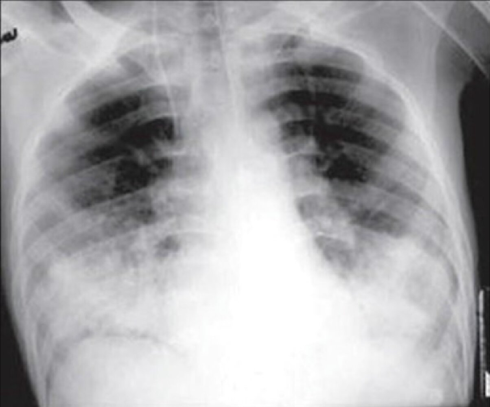
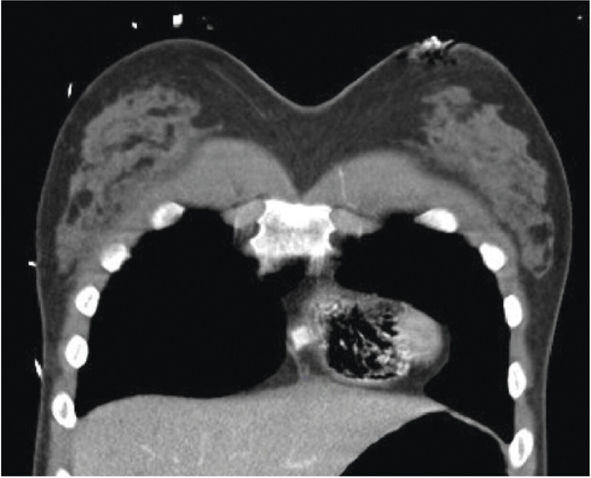
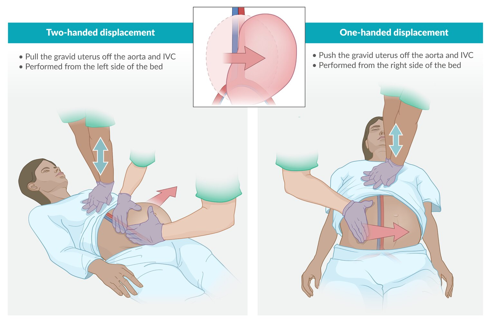

# Nonthrombotic embolism

*Categories: Clinical knowledge > Obstetrics/gynecology > Labor, delivery, and associated disorders > Nonthrombotic embolism*

[Original Article Link](https://coursology-qbank.com/amboss/article/sL0t_g)

---

## Summary

The blockage of <u>blood vessels</u> by fat, air, or <u>amniotic fluid</u> is an uncommon but potentially life-threatening event. <u>Fat emboli</u> mostly originate from the <u>bone marrow</u> in patients with <u>long bone</u> <u>fractures</u>. Air can enter the <u>circulatory system</u> as a result of invasive procedures (e.g., vascular <u>surgery</u> or catheterization, neurological <u>surgery</u>), trauma, or rapid ascent when diving (<u>decompression illness</u>), while <u>amniotic fluid</u> <u>emboli</u> typically occur during <u>labor</u>. The <u>emboli</u> usually lodge within the <u>pulmonary arteries</u> and cause <u>right ventricular outflow obstruction</u> and circulatory collapse. General clinical features of nonthrombotic embolisms include acute onset of <u>hypoxia</u>, <u>hypotension</u>, and neurological symptoms (e.g., <u>altered mental status</u>, <u>seizures</u>). Characteristic clinical findings include a nondependent <u>petechial</u> <u>rash</u> on the upper body in <u>fat embolism</u>, the <u>mill wheel sign</u> in <u>venous air embolism</u>, <u>signs of stroke</u> in <u>arterial air embolism</u>, and <u>disseminated intravascular coagulation</u> in <u>amniotic fluid embolism</u>. Nonthrombotic embolisms are primarily a <u>clinical diagnosis</u>, but results of <u>arterial blood gas analysis</u>, <u>ECG</u>, and chest imaging (e.g., <u>chest x-ray</u>, CT) can support the diagnosis and rule out alternative causes. Management is mainly supportive and includes oxygenation, <u>mechanical ventilation</u>, and, if necessary, administration of <u>vasopressors</u>. Nonthrombotic embolisms have a high <u>mortality rate</u>.

For thromboembolic diseases, see “<u>Pulmonary embolism</u>,” “<u>Thromboembolic stroke</u>,” “<u>Acute mesenteric artery embolism</u>,” “<u>Acute limb ischemia</u>,” and “<u>Retinal vessel occlusion</u>.”

See also “<u>Septic emboli</u>.”

---

## Fat embolism

### Definition [[1]](https://coursology-qbank.com/amboss/article/VhaG14)

A potentially life-threatening condition caused by the entry of fat cells, usually from <u>bone marrow</u>, into the <u>circulatory system</u>

### Etiology [[1]](https://coursology-qbank.com/amboss/article/VhaG14)

* Traumatic (95% of cases)

* Most commonly <u>long bone</u> <u>fractures</u> (e.g., femoral <u>fracture</u>)

* Orthopedic surgeries

* <u>Bone marrow transplant</u>

* Nontraumatic

* <u>Sickle cell crisis</u>

* Others: <u>pancreatitis</u>, <u>osteomyelitis</u>, parenteral lipid infusion, <u>liposuction</u>

> [!TIP]
> Early operative fixation is recommended in patients with <u>long bone</u> <u>fractures</u> to reduce the risk of <u>fat embolism syndrome</u>. [[10]](https://coursology-qbank.com/amboss/article/OB1Iaj0)

### Pathophysiology

* Traumatic <u>fat embolism</u>: fat cells from <u>bone marrow</u> enter <u>systemic circulation</u> and occlude the pulmonary <u>arterioles</u> → <u>right heart failure</u> and <u>pulmonary edema</u>

* Nontraumatic <u>fat embolism</u>: ↑ <u>cytokine</u> levels (e.g., <u>CRP</u>, TNF) → agglutination of <u>chylomicrons</u> in the circulation → <u>fat emboli</u> formation

* <u>Lipases</u> metabolize the lodged fat cells (in pulmonary <u>arterioles</u>) → release of free <u>fatty acids</u> → pulmonary arteriolar <u>endothelial</u> injury → <u>acute lung injury</u>/<u>respiratory distress</u>

* Dermatologic and neurological manifestations (see “Clinical features”): The exact mechanism is unknown but may be due to <u>paradoxical embolisms</u> or biochemical factors (e.g., systemic <u>cytokine</u> release). [[11]](https://coursology-qbank.com/amboss/article/zA1rmj0)

* Distention of <u>thrombi</u>-occluded <u>capillaries</u> → ↑ intracapillary pressure → extravasation of <u>RBCs</u> into the <u>skin</u> → <u>petechial</u> <u>rash</u>

### Clinical features [[1]](https://coursology-qbank.com/amboss/article/VhaG14)[[2]](https://coursology-qbank.com/amboss/article/xB1E1j0)[[3]](https://coursology-qbank.com/amboss/article/CB1q1j0)

Symptoms develop within 12–72 hours of the inciting event.

* Classic triad: Components typically develop sequentially.

* <u>Respiratory distress</u> (in up to 95% of patients) 

* <u>Tachypnea</u>, <u>dyspnea</u>

* <u>Hypoxemia</u>, <u>cyanosis</u>

* Diffuse <u>crackles</u>

* Neurological symptoms (in up to 80% of patients)

* <u>Altered mental status</u> (e.g., confusion, <u>lethargy</u> or restlessness, <u>coma</u>)

* <u>Seizures</u>

* <u>Focal neurological deficits</u>

* <u>Petechial</u> <u>rash</u> (in up to 50% of patients) [[2]](https://coursology-qbank.com/amboss/article/xB1E1j0)[[3]](https://coursology-qbank.com/amboss/article/CB1q1j0)

* Appears 3–5 days after the onset of <u>respiratory distress</u>

* Mainly seen on the <u>axillae</u>, <u>chest wall</u>, head, neck, <u>conjunctiva</u>, and/or buccal <u>mucosa</u>.

* Other features: <u>fever</u>, <u>retinopathy</u>, <u>cor pulmonale</u>

> [!WARNING]
> Fulminant <u>fat embolism syndrome</u> can manifest with <u>ARDS</u>, <u>shock</u>, <u>signs of acute heart failure</u>, and/or <u>DIC</u>. [[1]](https://coursology-qbank.com/amboss/article/VhaG14)

### Diagnosis [[1]](https://coursology-qbank.com/amboss/article/VhaG14)[[2]](https://coursology-qbank.com/amboss/article/xB1E1j0)[[3]](https://coursology-qbank.com/amboss/article/CB1q1j0)

<u>Fat embolism</u> is a <u>clinical diagnosis</u>; rule out other <u>life-threatening causes of dyspnea</u> and <u>critical causes of altered mental status</u>.

#### Diagnostic criteria

<u>Gurd's criteria</u> and <u>Schonfeld's criteria</u> are commonly used, however, neither has been prospectively validated.

##### <u>Gurd's criteria</u>

1 major plus 4 minor criteria are required for the diagnosis. [[12]](https://coursology-qbank.com/amboss/article/_B15Wj0)

* Major criteria

* <u>Petechial</u> <u>rash</u>

* <u>Respiratory insufficiency</u>

* Neurological symptoms (see “Clinical features”)

* Minor criteria

* <u>Fever</u>

* <u>Tachycardia</u>

* Acute <u>anemia</u>

* Acute <u>thrombocytopenia</u>

* Increased <u>ESR</u>

* Renal abnormalities (e.g. <u>anuria</u>, <u>oliguria</u>, lipiduria)

* Retinal changes (<u>petechiae</u> or fat)

* Fat globules in <u>sputum</u>

##### <u>Schonfeld's criteria</u>

|  <u>Schonfeld's criteria</u> [[3]](https://coursology-qbank.com/amboss/article/CB1q1j0)  |  |
| --- | --- |
| Criteria | Points |
| <u>Petechial</u> <u>rash</u> | 5 |
| Bilateral infiltrates on <u>chest x-ray</u> | 4 |
| <u>Hypoxemia</u> < 70 mm Hg | 3 |
| <u>Fever</u> > 38°C (> 100.4°F) | 1 |
| <u>Tachycardia</u> > 120/minute | 1 |
| <u>Tachypnea</u>  > 30 breaths per minute | 1 |
| Confusion | 1 |
| A score of > 5 points is required to make a diagnosis of <u>fat embolism syndrome</u>. |  |

#### <u>Laboratory studies</u> [[2]](https://coursology-qbank.com/amboss/article/xB1E1j0)[[3]](https://coursology-qbank.com/amboss/article/CB1q1j0)

* <u>CBC</u>: <u>anemia</u>, <u>thrombocytopenia</u>

* <u>ESR</u>: increased

* Blood, urine, and/or <u>sputum</u> microscopy: Fat droplets may be seen but are not specific for <u>fat embolism syndrome</u>.

#### Imaging

* <u>CXR</u>: bilateral diffuse or patchy infiltrates   [[2]](https://coursology-qbank.com/amboss/article/xB1E1j0)[[3]](https://coursology-qbank.com/amboss/article/CB1q1j0)

* <u>High-resolution CT</u> chest  [[2]](https://coursology-qbank.com/amboss/article/xB1E1j0)[[3]](https://coursology-qbank.com/amboss/article/CB1q1j0)

* Patchy <u>ground glass opacities</u> and consolidations

* Interlobular septal thickening with a <u>crazy-paving pattern</u>

* <u>Neuroimaging</u>: Consider for patients with neurological symptoms. [[2]](https://coursology-qbank.com/amboss/article/xB1E1j0)[[3]](https://coursology-qbank.com/amboss/article/CB1q1j0)

* CT head: typically normal

* <u>MRI</u> <u>brain</u>: often shows a starfield pattern with multiple punctate lesions

Pulmonary fat embolism

### Management [[1]](https://coursology-qbank.com/amboss/article/VhaG14)[[2]](https://coursology-qbank.com/amboss/article/xB1E1j0)[[3]](https://coursology-qbank.com/amboss/article/CB1q1j0)

Management is primarily supportive, as there are no specific treatments for <u>fat embolism syndrome</u>.

* Acute stabilization

* <u>ABCDE assessment</u>

* Initiate <u>management of respiratory failure</u> (e.g., <u>management of ARDS</u>).

* Provide <u>immediate hemodynamic support</u>.

* Begin <u>initial management of altered mental status</u> and <u>treatment of acute seizures</u>.

* <u>Supportive care</u> and disposition

* Admit to the <u>ICU</u> for monitoring and continued management.

* Perform frequent <u>neurological examination</u> and consider <u>invasive ICP monitoring</u>.

* Provide <u>supportive care for the critically ill patient</u>.

### Prognosis [[1]](https://coursology-qbank.com/amboss/article/VhaG14)[[3]](https://coursology-qbank.com/amboss/article/CB1q1j0)

<u>Fat embolism syndrome</u> is usually <u>self-limited</u>.

* <u>Mortality rates</u> are < 10% with appropriate <u>ICU</u> management.

* Respiratory, neurological, and dermatologic manifestations are usually fully reversible.

---

## Venous air embolism

### Definition [[4]](https://coursology-qbank.com/amboss/article/hx1cwQ0)[[5]](https://coursology-qbank.com/amboss/article/ny17fj0)

A rare and potentially life-threatening condition caused by the entry of gas into the systemic venous circulation

### Etiology [[4]](https://coursology-qbank.com/amboss/article/hx1cwQ0)[[5]](https://coursology-qbank.com/amboss/article/ny17fj0)

* <u>Iatrogenic</u>

* <u>Surgery</u>

* Neurosurgical procedures (highest risk)

* Cardiac or vascular <u>surgery</u>

* <u>Laparoscopic surgery</u>

* Endoscopic procedures

* Vascular catheterization procedures

* <u>Central venous catheter insertion</u> and removal

* <u>Hemodialysis</u> line placement

* <u>Extracorporeal membrane oxygenation</u>

* Infusion-related errors: accidental injection of air

* Trauma: <u>Penetrating trauma</u> that <u>lacerates</u> a <u>vein</u> can allow air to enter from the external environment.

* Diving: rapid ascent, leading to <u>decompression sickness</u>

* Intentional injection of air (suicidal or <u>homicidal</u> intent)

### Pathophysiology [[4]](https://coursology-qbank.com/amboss/article/hx1cwQ0)[[6]](https://coursology-qbank.com/amboss/article/dy1oVj0)

* Air enters the venous system → travels to <u>right ventricle</u> → right ventricular outflow obstruction → circulatory collapse

* Acute <u>cor pulmonale</u> and circulatory collapse typically only occur with large volume embolisms.

* Small volume <u>emboli</u> may be asymptomatic or cause transient or minimal symptoms.

### Clinical features [[4]](https://coursology-qbank.com/amboss/article/hx1cwQ0)[[6]](https://coursology-qbank.com/amboss/article/dy1oVj0)

* Signs of acute <u>right ventricular outflow tract obstruction</u>

* Sudden <u>hypotension</u>

* <u>Jugular venous distention</u>

* <u>Cardiac arrhythmia</u> or arrest

* <u>Clinical features of pulmonary embolism</u>, including:

* <u>Signs of respiratory distress</u>

* Signs of <u>intraoperative PE</u>

* <u>Mill wheel sign</u>

* Patients with <u>paradoxical embolism</u>: clinical features of <u>arterial air embolism</u> are also present

### Diagnostic studies [[4]](https://coursology-qbank.com/amboss/article/hx1cwQ0)[[6]](https://coursology-qbank.com/amboss/article/dy1oVj0)

<u>Venous air embolism</u> is a <u>clinical diagnosis</u>. Exclude other <u>immediately life-threatening causes of dyspnea</u> or <u>shock</u>.

* Chest imaging: evidence of air (hyperlucencies) in the right cardiac chambers and <u>pulmonary arteries</u>

* <u>Chest x-ray</u>: low <u>sensitivity</u>; most appear normal

* Chest CT: higher <u>sensitivity</u>; however, findings may not be clinically significant   [[4]](https://coursology-qbank.com/amboss/article/hx1cwQ0)[[6]](https://coursology-qbank.com/amboss/article/dy1oVj0)

* <u>Echocardiography</u>: evidence of air in the right cardiac chambers

* <u>ECG</u>: may show <u>high-risk ECG signs of PE</u>

* <u>ABG analysis</u>: <u>hypoxemia</u> and <u>hypercarbia</u>

Air in the right ventricle

### Management [[4]](https://coursology-qbank.com/amboss/article/hx1cwQ0)[[5]](https://coursology-qbank.com/amboss/article/ny17fj0)[[6]](https://coursology-qbank.com/amboss/article/dy1oVj0)

For patients with evidence of arterial <u>ischemia</u> (suggesting <u>paradoxical embolism</u>) also see “Management” in “<u>Arterial air embolism</u>.”

* Initial stabilization

* <u>ABCDE approach</u>: <u>CPR</u>; , <u>mechanical ventilation</u>, and <u>immediate hemodynamic support</u> as needed

* Administer 100% <u>oxygen therapy</u>.  [[4]](https://coursology-qbank.com/amboss/article/hx1cwQ0)[[6]](https://coursology-qbank.com/amboss/article/dy1oVj0)

* Place the patient in the left <u>lateral decubitus position</u> and <u>Trendelenburg position</u>.  [[4]](https://coursology-qbank.com/amboss/article/hx1cwQ0)

* Prevent further entry of air into the circulation.

* If a recently removed catheter is suspected as the source, apply an impermeable dressing to the site and hold pressure to prevent further bubble entry.

* Drop any suspected IV infusion source to below <u>heart</u> level.

* Provide rapid volume expansion with <u>IV fluid resuscitation</u>.  [[5]](https://coursology-qbank.com/amboss/article/ny17fj0)

* Consider air <u>aspiration</u> through a <u>central venous catheter</u>;  to evacuate air from the right <u>heart</u>

* Definitive care and disposition: Specialist consultation (e.g., anesthesiology, critical care) typically required

* Severe cases: Transfer for <u>hyperbaric oxygen therapy</u>.  [[4]](https://coursology-qbank.com/amboss/article/hx1cwQ0)[[5]](https://coursology-qbank.com/amboss/article/ny17fj0)

* All other patients: Admit to the <u>ICU</u> for monitoring and continued treatment.

### Prognosis

<u>Air embolism</u> has a high <u>mortality rate</u> (∼ 20%). [[13]](https://coursology-qbank.com/amboss/article/Rx1lwQ0)

---

## Arterial air embolism

### Definition [[4]](https://coursology-qbank.com/amboss/article/hx1cwQ0)[[5]](https://coursology-qbank.com/amboss/article/ny17fj0)

A rare and potentially life-threatening condition caused by the entry of gas into the <u>pulmonary veins</u> or directly into the systemic arterial circulation

### Etiology [[4]](https://coursology-qbank.com/amboss/article/hx1cwQ0)[[5]](https://coursology-qbank.com/amboss/article/ny17fj0)

* <u>Iatrogenic</u>

* <u>Surgery</u>

* Cardiac or vascular <u>surgery</u>

* <u>Laparoscopic surgery</u>

* Endoscopic procedures

* <u>Arterial catheterization</u> procedures

* Arterial <u>angiography</u>

* <u>Extracorporeal membrane oxygenation</u>

* <u>Ventilator-induced lung injury</u> (<u>barotrauma</u>)

* <u>Paradoxical embolism</u>: in patients with <u>venous air embolism</u>  [[4]](https://coursology-qbank.com/amboss/article/hx1cwQ0)[[6]](https://coursology-qbank.com/amboss/article/dy1oVj0)

* Trauma: Blunt or <u>penetrating trauma</u> leading to arterial <u>laceration</u> or torn <u>lung parenchyma</u>.

* Diving: rapid ascent, leading to <u>decompression illness</u>

* Intentional injection of air (suicidal or <u>homicidal</u> intent)

### Pathophysiology [[4]](https://coursology-qbank.com/amboss/article/hx1cwQ0)

* Air enters the arterial system → obstruction of end-organ <u>arterioles</u> or <u>capillaries</u> → <u>ischemic</u> damage

* <u>Ischemia</u> and <u>infarction</u> may occur even with small-volume embolisms.

### Clinical features [[4]](https://coursology-qbank.com/amboss/article/hx1cwQ0)

* Most common: <u>focal neurological deficits</u>, <u>altered mental status</u>, <u>seizures</u>, <u>coma</u>

* Symptoms can vary depending on the amount of air involved

* For examples of <u>focal neurological deficit</u> patterns, see “<u>Clinical features of stroke by affected vessel</u>” and “<u>Lacunar syndromes</u>.”

* Clinical features of the following:

* <u>Acute heart failure</u>, <u>myocardial infarction</u>, <u>arrhythmias</u>

* <u>Acute kidney failure</u>

* Retinal <u>infarction</u>

### Diagnostic studies [[4]](https://coursology-qbank.com/amboss/article/hx1cwQ0)

<u>Arterial air embolism</u> is a <u>clinical diagnosis</u>. Exclude other <u>critical causes of altered mental status</u>.

* CT <u>brain</u>, abdomen, or <u>pelvis</u>: may show <u>ischemic</u> changes in the affected organs

* <u>ECG</u>: may show <u>ischemic ECG changes</u>

* <u>Echocardiography</u>: may show evidence of air in the left cardiac chambers

* <u>Fundoscopic examination</u>: : may show air bubbles within retinal vessels [[14]](https://coursology-qbank.com/amboss/article/3x1SwQ0)

### Management [[4]](https://coursology-qbank.com/amboss/article/hx1cwQ0)[[5]](https://coursology-qbank.com/amboss/article/ny17fj0)[[6]](https://coursology-qbank.com/amboss/article/dy1oVj0)

See also “<u>Diving-related injuries</u>.”

* Initial stabilization

* <u>ABCDE approach</u>: <u>CPR</u>; , <u>mechanical ventilation</u>, and <u>immediate hemodynamic support</u> as needed

* Administer 100% <u>oxygen therapy</u>.  [[4]](https://coursology-qbank.com/amboss/article/hx1cwQ0)[[6]](https://coursology-qbank.com/amboss/article/dy1oVj0)

* Place the patient in the <u>supine position</u>.  [[5]](https://coursology-qbank.com/amboss/article/ny17fj0)[[6]](https://coursology-qbank.com/amboss/article/dy1oVj0)

* Prevent further air entry into the circulation.

* If a recently removed catheter is suspected as the source, apply an impermeable dressing to the site and hold pressure to prevent further bubble entry.

* For air entering through an <u>arterial catheter</u>: Stop flush and open the rotating hemostatic valve.  [[4]](https://coursology-qbank.com/amboss/article/hx1cwQ0)

* Provide <u>IV fluid therapy</u> with <u>colloid solution</u> as needed to maintain <u>normovolemia</u>.  [[5]](https://coursology-qbank.com/amboss/article/ny17fj0)[[6]](https://coursology-qbank.com/amboss/article/dy1oVj0)

* Maintain cerebral <u>perfusion</u> with <u>permissive hypertension</u> or <u>vasopressors</u> as needed. [[6]](https://coursology-qbank.com/amboss/article/dy1oVj0)

* Definitive care and disposition: Transfer for <u>hyperbaric oxygen therapy</u> (treatment of choice) as soon as clinically stable.  [[5]](https://coursology-qbank.com/amboss/article/ny17fj0)[[6]](https://coursology-qbank.com/amboss/article/dy1oVj0)

> [!TIP]
> <u>Hyperbaric oxygen therapy</u> is the treatment of choice for all patients with symptomatic <u>arterial air embolism</u>. [[5]](https://coursology-qbank.com/amboss/article/ny17fj0)[[6]](https://coursology-qbank.com/amboss/article/dy1oVj0)

### Prognosis

<u>Air embolism</u> has a high <u>mortality rate</u> (∼ 20%). [[13]](https://coursology-qbank.com/amboss/article/Rx1lwQ0)

---

## Amniotic fluid embolism (AFE)

### Definition [[7]](https://coursology-qbank.com/amboss/article/aB1QzQ0)[[8]](https://coursology-qbank.com/amboss/article/_y153j0)

A rare life-threatening condition caused by the entry of fetal cells and debris (from <u>amniotic fluid</u>) into maternal circulation  [[8]](https://coursology-qbank.com/amboss/article/_y153j0)

### Pathophysiology

* Desquamated fetal cells or <u>lanugo</u> from <u>amniotic fluid</u> enter maternal circulation and embolize to the pulmonary <u>arterioles</u>  → increased pulmonary arterial pressure, <u>right heart failure</u>, and <u>pulmonary edema</u>

* Entry of <u>procoagulants</u> (<u>thromboplastin</u>) from <u>amniotic fluid</u> into maternal circulation → diffuse <u>intravascular</u> coagulation

* Entry of <u>leukotrienes</u> from <u>amniotic fluid</u> into maternal circulation → triggering of an <u>immune response</u> → pulmonary vasospasm, alveolar <u>capillary</u> damage (<u>pulmonary edema</u>), and <u>hypotension</u>

### <u>Risk factors</u> [[7]](https://coursology-qbank.com/amboss/article/aB1QzQ0)[[8]](https://coursology-qbank.com/amboss/article/_y153j0)[[9]](https://coursology-qbank.com/amboss/article/4A13Pj0)

* Maternal age > 30 years

* <u>Multiparity</u>

* Complicated <u>labor</u> (e.g., <u>placenta previa</u>/abruption, <u>forceps delivery</u>, <u>cesarean delivery</u>, <u>eclampsia</u>)

* Invasive procedures (e.g., <u>amniocentesis</u>, abortion)

* <u>Blunt abdominal trauma</u>

### Clinical features [[7]](https://coursology-qbank.com/amboss/article/aB1QzQ0)[[8]](https://coursology-qbank.com/amboss/article/_y153j0)

<u>AFE</u> typically manifests during <u>labor</u> or immediately after delivery but can occur up to 48 hours postpartum.

* <u>Acute respiratory distress syndrome</u>

* <u>Dyspnea</u>, <u>tachypnea</u>, <u>cough</u>

* <u>Hypoxia</u>, <u>cyanosis</u>

* Basal <u>crepitations</u>

* Cardiovascular collapse: <u>hypotension</u>; , <u>arrhythmias</u>, <u>cardiac arrest</u>

* Neurological symptoms: <u>altered mental status</u>, <u>seizures</u>

* Clinical features of <u>disseminated intravascular coagulation</u> (<u>DIC</u>)

* <u>Multiorgan dysfunction</u>

* Nonspecific symptoms (e.g., <u>anxiety</u>, a sense of impending doom)

* <u>Fetal distress</u>: <u>decelerations</u> on <u>cardiotocography</u>

> [!TIP]
> <u>AFE</u> typically manifests with a classic triad of sudden <u>hypoxia</u> and <u>hypotension</u> followed by <u>coagulopathy</u>. [[7]](https://coursology-qbank.com/amboss/article/aB1QzQ0)[[8]](https://coursology-qbank.com/amboss/article/_y153j0)

### Diagnosis [[7]](https://coursology-qbank.com/amboss/article/aB1QzQ0)[[8]](https://coursology-qbank.com/amboss/article/_y153j0)[[9]](https://coursology-qbank.com/amboss/article/4A13Pj0)

#### General principles

* <u>AFE</u> is a <u>clinical diagnosis</u> based on the sudden onset of typical peripartum clinical features.  [[7]](https://coursology-qbank.com/amboss/article/aB1QzQ0)[[9]](https://coursology-qbank.com/amboss/article/4A13Pj0)

* Supportive studies are used to help guide management and rule out complications.

* Exclude other <u>immediately life-threatening causes of dyspnea</u>, <u>etiologies of shock</u>, and <u>critical causes of altered mental status</u>.

> [!WARNING]
> If <u>AFE</u> is suspected clinically, do not delay treatment to obtain diagnostic studies. [[7]](https://coursology-qbank.com/amboss/article/aB1QzQ0)[[9]](https://coursology-qbank.com/amboss/article/4A13Pj0)

#### <u>Laboratory studies</u>

* <u>Arterial blood gas analysis</u>: <u>hypoxemia</u>, <u>acid-base disorders</u>

* <u>CBC</u>: <u>anemia</u>, <u>thrombocytopenia</u>

* <u>Coagulation studies</u>: ↑ <u>aPTT</u>, ↑ <u>PT</u>, ↓ <u>fibrinogen</u> (see also “<u>Diagnostics in DIC</u>”)

* <u>Type and screen</u> including <u>pretransfusion crossmatch</u>

* <u>Cardiac enzymes</u>: may be elevated

* <u>Pulmonary artery</u> blood sample: presence of squamous cells, <u>hair</u>, or other fetal debris in maternal blood  [[7]](https://coursology-qbank.com/amboss/article/aB1QzQ0)[[8]](https://coursology-qbank.com/amboss/article/_y153j0)

#### Imaging

* <u>CXR</u>: typically shows bilateral opacities similar to <u>pulmonary edema</u> from other causes [[9]](https://coursology-qbank.com/amboss/article/4A13Pj0)

* Bedside <u>echocardiography</u>: brief phase of <u>right ventricular dysfunction</u> often followed by severe <u>left ventricular dysfunction</u>  [[7]](https://coursology-qbank.com/amboss/article/aB1QzQ0)[[9]](https://coursology-qbank.com/amboss/article/4A13Pj0)

* <u>CTA</u> chest: to rule out <u>thrombotic</u> <u>pulmonary embolism</u>

* <u>ECG</u>: to assess for <u>arrhythmias</u> and/or <u>myocardial infarction</u>

### Differential diagnosis [[7]](https://coursology-qbank.com/amboss/article/aB1QzQ0)[[9]](https://coursology-qbank.com/amboss/article/4A13Pj0)

* <u>Placental abruption</u> or <u>uterine rupture</u>

* <u>Postpartum hemorrhage</u> or <u>peripartum hemorrhage</u>

* <u>Air embolism</u> or <u>pulmonary embolism</u>

* <u>Septic shock</u> or <u>anaphylaxis</u>

* <u>Transfusion reaction</u>

* <u>Peripartum cardiomyopathy</u> or <u>myocardial infarction</u>

* <u>Anesthetic</u> complications (e.g., <u>total spinal anesthesia</u>)

* <u>Eclampsia</u>

### Management [[7]](https://coursology-qbank.com/amboss/article/aB1QzQ0)

<u>AFE</u> is a life-threatening condition and must be treated as an emergency.

* <u>ABCDE survey</u>

* <u>Respiratory support</u> and <u>immediate hemodynamic support</u> as needed.

* Obtain immediate obstetrics, critical care, and anesthesia consults.

* Prepare for emergency delivery.

* Management of <u>cardiac arrest in pregnancy</u>

* Initiate <u>CPR</u>.

* Perform <u>left uterine displacement</u>.

* Consider <u>perimortem cesarean delivery</u> if indicated. [[7]](https://coursology-qbank.com/amboss/article/aB1QzQ0)

* <u>Management of cardiogenic shock</u> [[7]](https://coursology-qbank.com/amboss/article/aB1QzQ0)

* Initial phase (RV dysfunction predominates): Consider <u>inodilators</u> to reduce <u>pulmonary vascular resistance</u>.

* Later phase (<u>LV dysfunction</u> predominates): Consider <u>inoconstrictors</u> to treat <u>hypotension</u> and maintain coronary <u>perfusion</u>.

* <u>Treatment of DIC</u>

* Manage refractory uterine bleeding in close cooperation with obstetrics.  [[7]](https://coursology-qbank.com/amboss/article/aB1QzQ0)

* See also “<u>Postpartum hemorrhage</u>” and “<u>Management of antepartum hemorrhage</u>.”

* Disposition

* Undelivered patients: urgent transfer to the operating room for <u>cesarean delivery</u> or <u>assisted vaginal delivery</u>  [[7]](https://coursology-qbank.com/amboss/article/aB1QzQ0)

* Postpartum patients: Transfer to the <u>ICU</u> for <u>postresuscitation care</u>.

Uterine displacement during cardiopulmonary resuscitation (CPR)

### Prognosis

* High <u>maternal mortality rate</u>

* Neurological deficits in surviving <u>infants</u>

---