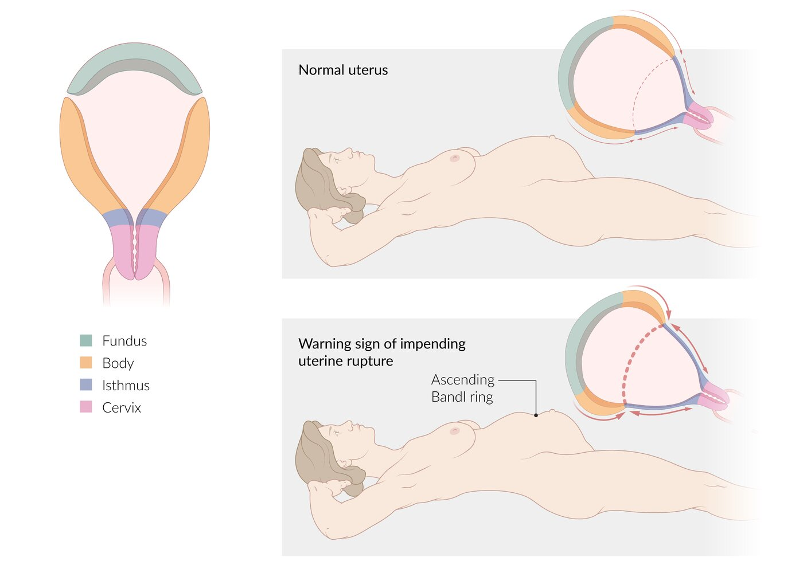
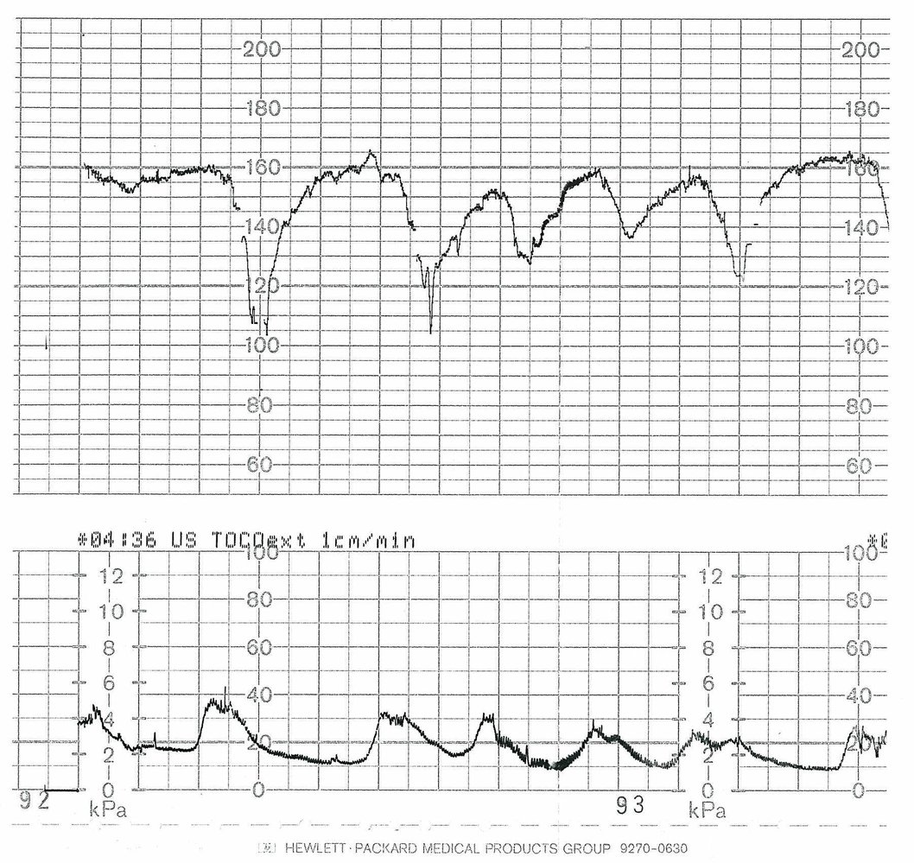

# Uterine rupture

*Categories: Clinical knowledge > Obstetrics/gynecology > Labor, delivery, and associated disorders > Uterine rupture*

[Original Article Link](https://coursology-qbank.com/amboss/article/RO0lHT)

---

## Summary

Uterine rupture is a <u>pregnancy</u> complication that is life-threatening for the mother and the baby. It occurs in approximately one in every 4000 births and, in most cases, during <u>labor</u>. This condition is caused by gross uterine distention or uterine scarring; patients who have had a <u>cesarean delivery</u> in a previous <u>pregnancy</u> are particularly prone to uterine rupture. Signs and symptoms may vary depending on the location and the extent of the rupture. A sudden pause in contractions takes place after rupture, along with an abnormal <u>fetal heart rate</u> (usually <u>bradycardia</u>), severe abdominal <u>pain</u>, <u>vaginal bleeding</u>, and <u>hemodynamic instability</u>. Women with this condition must undergo <u>laparotomy</u> and emergency <u>cesarean delivery</u>. If the <u>uterus</u> is severely damaged and cannot be repaired, or the bleeding is refractory, <u>hysterectomy</u> is necessary.

---

## Etiology

Uterine rupture is primarily caused by uterine distention. Theoretically, this can occur at any stage of <u>pregnancy</u>; however, it usually takes place during active <u>labor</u> because of the massive force exerted during contractions. [[3]](https://coursology-qbank.com/amboss/article/bk0HmT)[[4]](https://coursology-qbank.com/amboss/article/ak0QmT)[[5]](https://coursology-qbank.com/amboss/article/Xk09mT)

* Uterine distention

* Delay in <u>labor</u> progression because of <u>fetal malpresentation</u>

* <u>Fetal macrosomia</u> and <u>multiple gestations</u>

* Overdose of <u>oxytocin</u>

* Uterine <u>scar</u>/prior uterine <u>surgery</u> (e.g., <u>cesarean delivery</u> or <u>myomectomy</u>)

* Traumatic rupture (e.g., <u>iatrogenic</u> or caused by an accident)

* Other <u>risk factors</u> [[6]](https://coursology-qbank.com/amboss/article/YVcnGY0)

* Maternal age ≥ 35 years

* Interdelivery interval < 16 months

* <u>Postterm pregnancy</u>

* <u>Macrosomia</u>

* History of <u>spontaneous abortion</u>

* <u>Induction of labor</u>

---

## Clinical features

### Signs of imminent uterine rupture [[7]](https://coursology-qbank.com/amboss/article/RF1l3i0)

* Severe abdominal <u>pain</u>

* Increased contractions followed by hyperactive <u>labor</u>

* Bandl ring: muscular ring that can be seen above the <u>belly button</u> due to the powerful contractions of the upper uterine segment

### Signs of uterine rupture [[3]](https://coursology-qbank.com/amboss/article/bk0HmT)[[7]](https://coursology-qbank.com/amboss/article/RF1l3i0)[[8]](https://coursology-qbank.com/amboss/article/AN1Rdh0)[[9]](https://coursology-qbank.com/amboss/article/YlWnvl0)

* <u>Fetal distress</u> (earliest and most sensitive sign)

* Severe abdominal <u>pain</u>

* <u>Referred pain</u> in the shoulder may be present.

* Sudden pause in contractions

* Light to moderate <u>vaginal bleeding</u>

* <u>Hemodynamic instability</u> (as a result of abdominal bleeding)

* <u>Loss of fetal station</u> (a specific but uncommon sign)

* Palpable fetal parts through the rupture (a specific but uncommon sign)

> [!TIP]
> Uterine rupture generally occurs during active <u>labor</u>. However, a third of uterine ruptures occur prior to the onset of <u>labor</u>. [[8]](https://coursology-qbank.com/amboss/article/AN1Rdh0)[[10]](https://coursology-qbank.com/amboss/article/Jt1sei0)

Signs of impending uterine rupture: Bandl ring

Fetal heart rate abnormality

---

## Differential diagnoses

See “<u>Differential diagnosis of antepartum bleeding</u>.”

The differential diagnoses listed here are not exhaustive.

---

## Treatment

* <u>ABCDE approach</u> and <u>immediate hemodynamic support</u>

* Immediate <u>OB-GYN</u> consultation for emergency <u>cesarean delivery</u> [[8]](https://coursology-qbank.com/amboss/article/AN1Rdh0)[[12]](https://coursology-qbank.com/amboss/article/cF1aSi0)

* <u>Management of hemorrhagic shock</u> and <u>massive transfusion</u> as needed

* Avoid <u>uterotonic agents</u>.  [[8]](https://coursology-qbank.com/amboss/article/AN1Rdh0)

* If <u>signs of imminent uterine rupture</u> are present: Consider IV <u>tocolytics</u> in consultation with <u>OB-GYN</u> as a temporizing measure.

* Consider <u>hysterectomy</u> for refractory hemorrhage.

* Urgently consult neonatology for possible <u>neonatal resuscitation</u>.

> [!WARNING]
> All patients with uterine rupture or imminent rupture require immediate <u>laparotomy</u> with emergency <u>cesarean delivery</u> within 30 minutes. [[8]](https://coursology-qbank.com/amboss/article/AN1Rdh0)

---